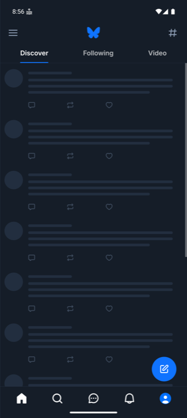
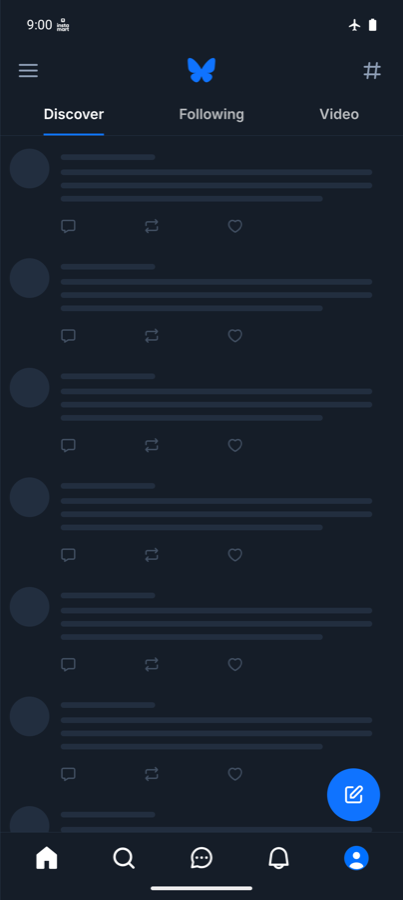
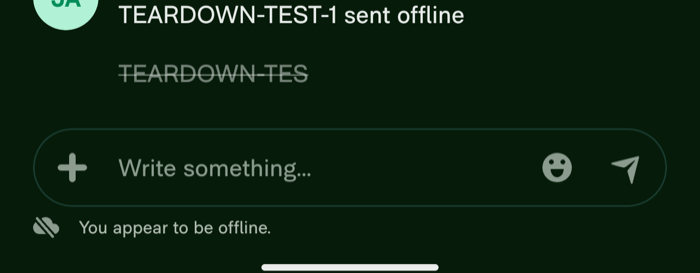
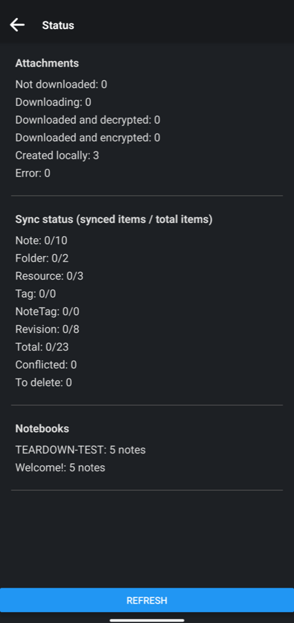
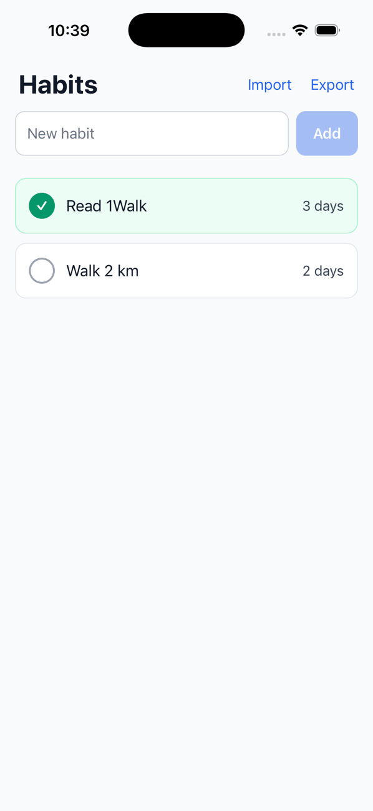
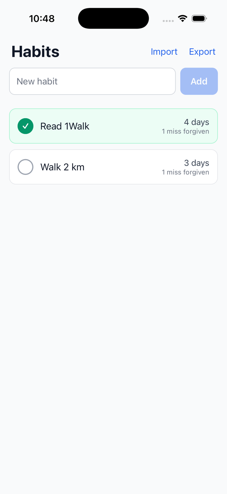

# The App Teardown Handbook

**Reverse engineer the design of any mobile app, by hand or with one command, without opening its code.**

A mobile engineer who can look at any app and say how it is built understands mobile products. That engineer solves product problems faster, because most of them have been solved before in an app already on their phone. That engineer also passes mobile system design interviews, because the interview asks for the same reasoning in the other direction.

This repository teaches that skill and gives you the tools to practice it:

- **A handbook, as a website.** 55 chapters that tie each design to behavior you can see as a normal user.
- **443 probes.** Experiments anyone can run: airplane mode, force-quit, a second device, a link. Each lists the possible outcomes and what each one means.
- **A worksheet.** Pick the outcome you saw, and the design of the app assembles itself.
- **A command for AI agents.** One command lets Claude Code or Codex run the probes on an emulator and write the teardown for you.
- **Three commands to build.** Give an idea, a store link or a feature. The AI asks you each design decision as a question with trade-offs, taken from the handbook, then writes a plan in phases and builds it.

It is independent of platform and framework. There is no decompiler and no traffic proxy.

**Read it online:** https://jaydeepagravat.github.io/app-teardown/

## Proof: three real apps, torn down and checked against their source

Claims are cheap, so the method was tested on three real apps whose source code is public. The handbook's probes were run on each app in an Android emulator. Every conclusion was then checked against the app's source.

| | Bluesky 1.133.0 | Expensify 9.4.99-2 | Joplin 3.7.11 | All three |
|---|---|---|---|---|
| Probes run | 20 | 24 | 53 | 97 |
| Confirmed by the code | 13 | 14 | 26 | **53** |
| Consistent with the code, full path not traced | 5 | 6 | 16 | 27 |
| Not answerable from the client code | 2 | 1 | 2 | 5 |
| Contradicted by the code | 0 | 3 | 9 | **12** |

The three apps were chosen to be three different designs. Bluesky keeps its data in memory. Expensify keeps an offline replica of a backend. Joplin is local-first: the device holds the only copy, and sync is optional and goes where the user chooses. On the test device Joplin had no sync target, so it had no backend at all. The same probes separated the three cleanly:

| The same probe | Bluesky | Expensify | Joplin |
|---|---|---|---|
| Force-quit, then launch in airplane mode | Placeholders, no content | Full content, plus an offline notice | Full content, and no mention of the network |
| Send or change something offline | Not run, read-only | Accepted at once, drawn dimmed, survives a force-quit, sent in the background on reconnect | Accepted at once with no pending mark, survives a force-quit |
| Where storage grows | The cache area (images on disk) | User data (a stored database) | User data (the only copy of the notes) |
| Back after opening a link from a cold start | The Home feed | The target's parent tab | The last note list used, not the note's own notebook |
| Offline level in the handbook's terms | Level 1 in one run, Level 0 across launches | Level 3, a local replica with an outbox | Level 3 behavior with no backend in use and no outbox |

The Joplin run was also a coverage run. All 443 probes were gone through, 53 could be run on one emulator with this app, and each of the other 390 is listed on the example page with its reason.

Things the probes found before any code was read, and what the source then showed:

| What a user can see | What it reveals | What the source says |
|---|---|---|
| Bluesky: the feed survives airplane mode while the app is open and is gone after a force-quit, yet the cache figure grew by 19 MB. | Posts are cached in memory only. Images are cached on disk. | Only queries marked for persistence are saved, and the post feed is not one. The cache control clears the image library's disk cache. |
| Bluesky: a link opens a profile from a cold start, and back leads to the Home feed. | The router builds a back stack under the link's target. | The link handler places a Home route under the target, with a comment that otherwise "the back button will not work". |
| Expensify: a message sent offline is dimmed, is still there after a force-quit, and is sent while the chat is closed. | An optimistic update, a durable outbox, and a sync engine that belongs to the app and not to a screen. | Queued requests are stored under a key named `networkRequestQueue`. A queue in the network layer flushes when the device is back online. |
| Joplin: three sentences typed into a note and a force-quit straight after. The last sentence is gone. With half a second of pause, nothing is lost. | Edits are committed to the local store on a short timer, not on each keystroke. | Editor changes are debounced by 100 ms, then saved through a queue with a 500 ms interval. |
| Joplin: a search in airplane mode finds a word inside a note that was never opened on the device. A misspelled word finds nothing, a prefix does. | An on-device index over all the notes, with exact or prefix matching. | The search engine keeps its own tables in the local database and queries them with a full-text match, with wildcards appended. |

<p>
  
  
  
  
</p>

### The twelve it got wrong

Three were on Expensify and nine on Joplin. Almost all had the same shape: the behavior was recorded correctly, and the probe's reading claimed more than the behavior supports.

On Expensify:

- A splash was read as a wait for the network. It was local startup work.
- "The app reopened on Home" was read as "the app does not save the last screen". It does save it, and restores it only for some accounts.
- A reading offered two candidate designs, and the true one was a third.

On Joplin:

- Offline changes that survive a force-quit were read as "a durable outbox". A local-first app has no outbox. Its local store is the source of truth, and sync compares state. This was a blind spot in the offline chapter's probes, not a slip in one sentence.
- A screen under a link's target was read, twice, as a back stack built for that target. The app had pushed the target over its ordinary start screen.
- State that survived rotation was read as state that survives a rebuild. The app handles rotation itself and rebuilds nothing.
- "Everything typed was saved" was read as "saved on each keystroke". Saves are delayed by about 0.6 seconds, and the same run had already lost text on an immediate quit.
- A time that shifted only after a restart was read as backend formatting or cached strings. It is formatted on the device, with a zone read at launch.
- A blank screen after a refused permission was read as missing code. The code has a branch, which was silent or did not show.
- "No remote media was seen" was read as "the app has no media delivery". With sync on, it downloads attachments.
- Storage that grew was read as a cache filled by browsing. It grew by writing.

Each reading has been corrected in the chapter data, so the next teardown gets the fixed version. One probe step was also made clearer after it was first run with the wrong setting. The full accounts are on the site at `/examples/joplin/` and `/examples/expensify/`, with the Bluesky run at `/examples/bluesky/`. The raw records are in [teardowns/](teardowns/).

Three apps and 97 probe runs is still a small sample. It shows the method is right far more often than wrong, that it tells different designs apart, and that its errors come from overreaching readings far more than from wrong observations. It also shows that the error rate rose when the run widened from the most promising probes to every runnable one: 3 in 44 on the first two apps, 9 in 53 on the third.

## Use it: two ways

### 1. By hand, with the website

Best for learning. You run each probe yourself and see why each behavior points to a design.

```bash
npm install
```

```bash
npm run dev
```

Open `http://localhost:4321`, then:

1. Pick an app on your phone or an emulator.
2. Open Chapter 4 and run the first-pass probes. They tell you which chapters matter for this app.
3. In each chapter, run a probe and select the outcome you saw.
4. Open the worksheet to see the design, and export it as Markdown or JSON.

Not sure which chapter explains something you noticed? Type it into the signal lookup, for example "item reappears after delete".

### 2. With one command, using an AI coding agent

Best for speed. The agent runs every probe that one emulator allows and writes the report.

**You need:**

- An AI coding agent on your PATH: [Claude Code](https://claude.com/claude-code) (`claude`) or Codex (`codex`).
- A running Android emulator or iOS simulator, with the app installed and signed in.
- Node 20 or newer, and this repository cloned with `npm install` done.

**Run:**

```bash
npm run teardown -- xyz.blueskyweb.app
```

Replace the app id with your app's. The command checks the device, then starts your agent with the teardown playbook. The agent:

1. Reads each probe's steps and outcomes from the handbook's data.
2. Drives the emulator: launch, force-quit, airplane mode, links, scrolling, process death, text size.
3. Reads the screen, picks the outcome it saw, and records it with a note.
4. Writes `teardowns/<app id>/report.md` and `teardown.json`.

Load the `teardown.json` into the site's worksheet with **Import a .json teardown**, and read every chapter with the agent's outcomes already selected.

Using another agent? Print the playbook and give it to the agent yourself:

```bash
node bin/teardown.mjs start xyz.blueskyweb.app --print
```

In Claude Code, the same thing is available inside a session as `/teardown xyz.blueskyweb.app`.

**What the agent will not do.** The playbook keeps it read-only: no posting, liking, buying, account creation or passwords. Of the 443 probes, 161 can run on a single emulator. The rest need a second device, days of waiting, a purchase or real hardware, and the agent lists them as skipped instead of guessing. Network probes need an Android emulator, because the iOS simulator has no airplane mode.

## Build with it: three commands

Reading a design is half the skill. The other half is making the decisions yourself. These commands turn the handbook into a design partner: the AI does not guess, it asks.

| You are | Run | What happens first |
|---|---|---|
| Building a completely new idea | `npm run new-app -- "your idea, in as much detail as you have"` | The AI asks which existing products come closest, and looks for earlier attempts |
| Building a new app in a space that already has one | `npm run rebuild-app -- <App Store or Google Play link> --competitors` | The AI reads the store pages, collects bad reviews from the stores and the web, groups the complaints, and ranks the ones a new app can win on |
| Adding a feature at your company | `node <path to this repo>/bin/plan.mjs feature "the feature" --repo .` | The AI reads your codebase and records the decisions it has already made, so it asks only about what is open |

A long idea can come from a file: `npm run new-app -- --file idea.md`. Leave out `--competitors` to study only the app you linked.

After that first step, all three follow the same path:

1. **Choose the chapters.** The nearest archetype and the 10 to 20 concerns that apply. You can add or remove.
2. **Answer questions, in rounds.** At most four at a time. Each has 2 to 4 options, one line on what each option buys and costs, and a recommendation. The options come from the handbook's 752 decision points, and the trade-offs from its chapters.
3. **Review the plan.** The design, a diagram, every decision with the options rejected, and phases. Each phase lists the handbook probes the finished build must pass, so "done" is something you can test on a device.
4. **Build, phase by phase.** The AI stops for your review after each phase.

Plans are written to `plans/<name>/`. The feature command writes inside your own repository. The same prerequisites apply as for the teardown command: Claude Code or Codex on your PATH. With any other agent, add `--print` and paste the result. In Claude Code the commands are also `/new-app`, `/rebuild-app` and `/feature`.

### Proof: all three commands, on one small app

The app and every plan file the commands wrote are in [examples/habit-tracker](examples/habit-tracker/).

**1. `new-app`: from an idea to a running app.** The idea was a habit tracker with no account and no backend that must never lose its history.

| Step | What happened |
|---|---|
| Questions | 8 design questions in 2 rounds: stack, what "never lose" must cover, reminders, the local store, how a streak is stored, what "today" means after travel, how mistakes are undone |
| Plan | 3 phases, each with its probes, approved by the engineer before any code |
| Build | A cross-platform app: about 400 lines, 6 unit tests |
| Checked on an iPhone simulator | Tap a habit and force-quit at once: the tap survived (P54.4). Export, delete a habit, import the file: the same streaks came back (P54.6) |
| Checked again on both platforms | The large-text probe (P37.1) found a real layout bug, which was fixed. On an Android emulator the app passed airplane mode, a kill during a write, process death and a time zone change, and cold starts in under 200 ms |

The decisions the questions forced are the ones that usually go wrong in such an app: the streak is computed from the history and never stored, a day is a local calendar date fixed at the tap, and an import is validated in full before one transaction replaces the data.

**2. `rebuild-app`: what do users of an existing app want?** The command was given the store link of a well-known open-source habit tracker, with competitor analysis on. The research found seven complaint themes with a link for each: no version on other platforms (the two most supported requests), no sync, reminders that nag or do not fire, a backup export that fails, and score errors in edge cases. It also found what users praise most: a score that does not punish one missed day. The engineer chose that as the next thing to build.

The research is honest about its reach. The store page itself could not be read, so no store reviews are in it. It rests on the app's public issue tracker, two listing sites and one comparison article, and it says so at the top. One search result about a different app with a similar name was left out.

**3. `feature`: add it to the codebase.** The command was pointed at the habit tracker with "a streak that forgives one missed day".

| Step | What happened |
|---|---|
| Read the codebase | Found that the streak is computed and never stored, so the feature needs no schema change. That question was not asked |
| Questions | 3, only on what was open: the rule (one miss per 7 days), whether a forgiven day counts (no), and how it is shown (a note on the row) |
| Build | 3 files changed, 4 new tests on both sides of the 7-day boundary. 9 of 9 tests pass |
| Checked on an iPhone simulator | A habit with one missed day in its history shows "4 days, 1 miss forgiven" instead of a reset |

<p>
  
  
</p>

## What is inside

| | |
|---|---|
| Chapters | 55, about 257,000 words |
| Part I. The teardown method | 6 chapters: constraints, a model of any app, probes, inference, the worksheet |
| Part II. Concerns | 32 chapters, from startup and sync to payments and releases |
| Part III. Archetypes | 17 complete teardowns of app types, each ending with how it is asked in an interview |
| Probes | 443 |
| Signals in the lookup | 905 |
| Worksheet fields | 752 |
| Glossary terms | 413 |
| Appendices | Probe catalog, interview guide, further reading |

Every claim in the handbook carries one of three confidence words: **Observed** (seen directly), **Inferred** (the alternatives were ruled out by a probe), or **Speculative** (another design fits equally well).

## For interview preparation

A design interview asks you to produce a design. A teardown reads one. The reasoning is the same, so each teardown you do is practice.

- Appendix E gives a 45-minute plan for a mobile system design interview and maps common prompts to chapters.
- Each archetype chapter (messaging, feeds, ride-hailing, banking and 13 more) ends with a section on how that app type is asked.
- The fastest practice: tear down an app, close the handbook, design the same app from a blank page, and compare.

## Honest limits

- The chapters were written with AI assistance and checked mechanically for format, links and diagrams. Only the three worked examples have tested probes against real apps, covering 60 of the 443 probes. Treat the content as a strong draft and report what is wrong.
- Reading from outside cannot see everything. Backend internals with no client effect stay hidden, and some designs look identical. The handbook says so where it applies.
- The marking of which probes one emulator can run is a heuristic based on each probe's wording.
- The three build commands have each been run once, on one small app, checked on an iPhone simulator and an Android emulator, not on real devices. In those runs the agent followed the playbook the command prints. The commands do start Claude Code by themselves, but that path was only seen as far as the agent opening, not through a whole run. Codex has not been tried. The `rebuild-app` run stopped after the research and the choice of what to build, and its research could not read the store's own reviews. Treat review research as a sample with sources, not as market data.

## Repository layout

```text
src/content/docs/     The chapters, grouped by part, and the worked examples
src/data/chapters/    Each chapter's probes, signals and worksheet fields
src/data/             Glossary and the chapter list
src/components/       Probe, signal table, worksheet form
src/pages/            Contents, signal lookup, worksheet, glossary, probe catalog
bin/teardown.mjs      The command line tool: device control, probes, recording, report
bin/plan.mjs          The build commands: new-app, rebuild-app, feature
AGENT_PLAYBOOK.md     What an AI agent follows during a teardown
PLAN_PLAYBOOK.md      What an AI agent follows when planning and building
teardowns/            Recorded teardowns: bluesky/, expensify/ and joplin/
examples/             The habit tracker built with the three build commands, with its plans
scripts/              check-chapter.mjs, which validates a chapter
templates/            Chapter templates and the diagram kit
STYLE.md              Writing rules, the fixed lists and the file format
```

## Status

| | State |
|---|---|
| Website, 55 chapters, appendices | Draft, under review |
| Worked examples: Bluesky, Expensify and Joplin | Done |
| One-command agent teardown | Works on Android emulators. Limited on the iOS simulator |
| Build commands: new-app, rebuild-app, feature | Each run once on a small app. See the limits above |
| License | MIT for code, CC BY-NC-SA 4.0 for content |
| Hosting | GitHub Pages, deployed on every push to `main` |

## License

Two licenses, by kind of file.

| What | Files | License |
|---|---|---|
| Code and agent playbooks | `bin/`, `scripts/`, `src/components/`, `src/pages/`, `src/plugins/`, `src/lib/`, `src/styles/`, `examples/habit-tracker/` (the app), `.claude/`, `AGENT_PLAYBOOK.md`, `PLAN_PLAYBOOK.md`, `AGENTS.md`, and the config files at the root | [MIT](LICENSE) |
| Handbook content | `src/content/`, `src/data/`, `templates/`, `teardowns/`, `public/`, `STYLE.md`, `OUTLINE.md`, the plan files in `examples/` and this README | [CC BY-NC-SA 4.0](LICENSE-CONTENT) |

In practice: you can run the commands anywhere, including on a company codebase, and what you plan or build with them is yours. You can share and adapt the handbook content with credit, not for commercial use, and under the same license.
