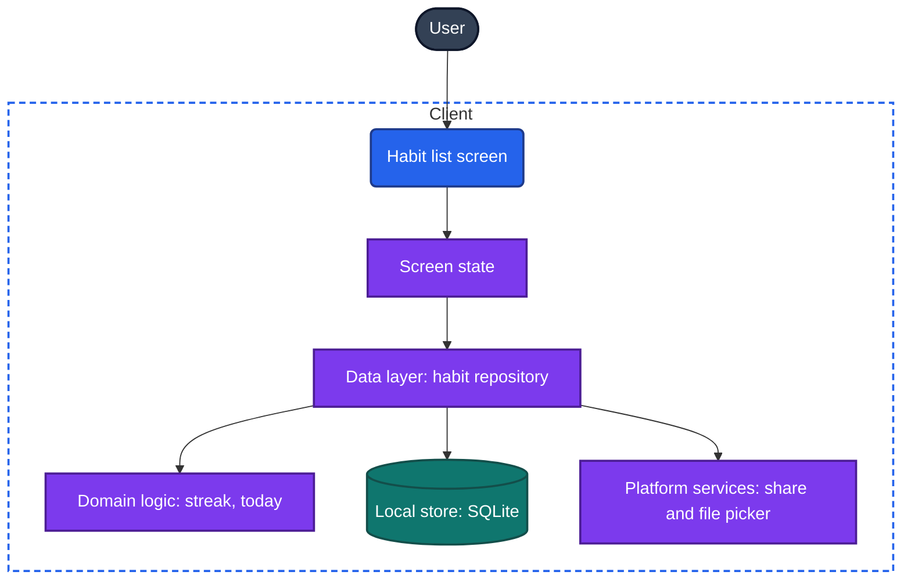

# Plan: a tiny habit tracker

## 1. Summary

A one-screen app that lists daily habits. A tap marks a habit done for today and the row shows the current streak. Habits can be added, renamed and deleted. There is no account, no backend and no network use. The history lives in a local database, survives a force-quit and an update, and can be exported to and imported from a JSON file.

## 2. Design

Parts of the universal app model (Chapter 3) this app has: UI, screen state, domain logic, data layer, local store, platform services (file sharing and picking, for export and import). It has no network client, no sync engine, no background workers and no backend.



### Data model

```text
habit      (id TEXT PRIMARY KEY, name TEXT, position INTEGER, created_at TEXT)
completion (habit_id TEXT, day TEXT, PRIMARY KEY (habit_id, day))   // day is a local date, 2026-10-04
schema version kept in the database's user_version, one migration step per shipped version
```

### Main flows

- **Tap.** Insert or delete the `(habit, today)` row in one transaction, then reload the list from the database. The screen never shows a state the database does not hold.
- **Streak.** Count consecutive days ending today. If today is not done yet, count from yesterday, so the streak does not show as broken before the day ends.
- **Launch.** Open the database, run pending migrations, read habits and completions, draw. No network and no splash wait beyond that.
- **Export.** Write `{version, exportedAt, habits, completions}` to a JSON file and hand it to the share sheet.
- **Import.** Pick a file, validate it fully, then replace all data in one transaction after a confirm. An invalid file changes nothing.

## 3. Decisions

All of them are in [decisions.md](decisions.md). The ones that shape the design most: SQLite as the only copy, one row per habit per day, the streak computed and never stored, the local calendar date as the day, and JSON export as the only path to a second device.

## 4. Phases

### Phase 1: the core loop

- **Goal.** Add a habit, tap it done, see the streak, force-quit, and find everything still there.
- **Work.** Expo project. Database with migration runner. Repository. Streak and date logic with unit tests. The list screen with add, tap to toggle, and an empty state.
- **Left out.** Rename, delete, export, import.
- **Verified by.** Unit tests for streak and date logic. Type check. P54.4 (kill during a write), P8.4 (force-quit and reopen), P7.3 (launch in airplane mode).
- **Risk.** A database write that is not awaited before the UI updates.

### Phase 2: manage habits

- **Goal.** Rename and delete a habit, with a confirm before delete.
- **Work.** Row menu on long press. Rename dialog. Delete with confirm, which removes the habit and its completions in one transaction. Accessibility labels and large text.
- **Left out.** Reordering, archive, editing past days.
- **Verified by.** Unit tests for the repository. P37.1 (large text), P37.8 (change the time zone: a done day stays done), P9.6 (rotate mid-task).
- **Risk.** Layout breaking at the largest text size.

### Phase 3: export and import

- **Goal.** Export the history to a file, wipe the app, import the file, and get the same streaks back.
- **Work.** Export to JSON through the share sheet. Import with full validation and a replace-all transaction. A versioned file format.
- **Left out.** Merge on import, automatic backups.
- **Verified by.** Unit tests for the round trip and for rejected files. P54.6 (export and import round trip).
- **Risk.** An import that fails halfway. The single transaction covers it.

## 5. How we will know it works

| Phase | Probes |
|---|---|
| 1 | P54.4, P8.4, P7.3, P7.1 |
| 2 | P37.1, P37.8, P9.6 |
| 3 | P54.6, P54.2 (shortened: a day in airplane mode) |

## 6. Open questions and risks

- A lost phone loses everything since the last export. The user accepted this.
- Whether the device backup carries the database depends on where the platform puts it. Not relied on.
- Every migration ever shipped must stay in the app (Chapter 54).
