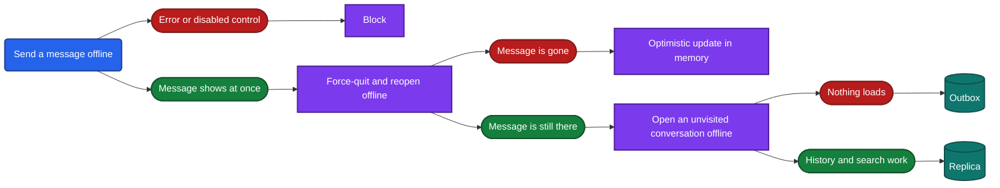
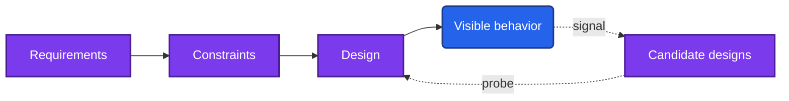

> **The question.** Why does visible behavior reveal design, and where does that stop working?

## 1.1 The claim

You can work out most of a mobile app's design by using it. You do not need its source code, a decompiler or a traffic proxy. You need the app, the device's settings, sometimes a second device, and time.

This sounds too strong, so the chapter states it precisely. The claim has three parts.

1. For each problem a mobile app has to solve, only a few designs work.
2. Each of those designs behaves differently when the condition it was built for occurs.
3. You, as a normal user, can make most of those conditions occur.

When all three hold, a behavior you see points to one design and away from the others. When one of them fails, the behavior tells you less, and Section 1.6 lists the cases.

The result of the work is a teardown: a written account of which designs an app uses, with a stated confidence for each claim. The rest of Part I gives you the method. Parts II and III apply it.

## 1.2 Why the design space is small

An engineer who starts a new app does not choose freely. Seven constraints apply to every mobile app, whatever it does: an unreliable network, process death, limited resources, slow release, an untrusted client, human attention and platform rules. [Chapter 2](/part-1-method/2-the-mobile-constraint-set/) covers each one. Here you only need their effect, which is that they remove most of the designs you could imagine.

Take one problem: the user performs an action, and the network is not available. The designs that survive are few.

| Design | What the client does with the action |
|---|---|
| Block | Refuses the action, or shows an error |
| Optimistic update in memory | Shows the result at once, keeps the mutation in memory, sends it when it can |
| Outbox | Shows the result at once, stores the mutation durably, sends it when it can |
| Replica | Writes to a local store that is a full working copy, and syncs it in both directions later |

There is no fifth design that a team is likely to ship. Variations exist inside each row, and [Chapter 12](/part-2-concerns/12-offline-and-sync/) covers them, but the row itself is one of four.

The same holds for other problems. Fresh information can reach an app without the user asking in about four ways: the client asks on a timer, the client holds a request open, the client keeps a persistent connection, or the backend sends a push. A long list can be loaded whole, in numbered pages, or in pages marked by a cursor. A session can end on a timer, on a backend decision, or never.

The lists are short because the constraints are hard. A design that ignores process death loses user data. A design that ignores battery limits gets its background work stopped by the operating system. Teams converge on the designs that survive, and over more than a decade of mobile development those designs have become common knowledge. You are identifying which known design an app picked. You are not discovering an unknown one.

## 1.3 Each design has a signature

A signature is the set of behaviors a design produces that the alternatives do not. The four designs in Section 1.2 have distinct ones.

| Design | Signature |
|---|---|
| Block | The control is disabled offline, or an error appears |
| Optimistic update in memory | The result shows at once offline, and is gone after a force-quit |
| Outbox | The result shows at once offline, and is still there after a force-quit |
| Replica | Everything works offline, including screens that were never opened in this session |

Notice when the signatures appear. With a fast network and a live process, all four designs look the same: you tap, and the result shows. The differences appear only when the network is off or the process is ended.

This is the central observation of the method. A design exists to handle a constraint. Its alternatives handle the same constraint in a different way. So the designs diverge exactly when the constraint bites, and they are indistinguishable when it does not. Casual use rarely reveals design, because casual use happens mostly in good conditions. Deliberate use under bad conditions reveals a great deal.

A mobile client is unusually open to this, for a simple reason. It runs on a device you control. You decide whether it has a network and how good that network is. You can end its process, change the clock, fill the storage, deny a permission, sign in on a second device, or leave it alone for a month. Each of these is a probe: a repeatable experiment a normal user can run. [Chapter 4](/part-1-method/4-probes/) groups them into families.

A backend offers no such access. You cannot unplug one of its machines. You can read a backend only through what the client shows you, which is why Section 1.6 puts most backend internals out of reach.

## 1.4 A walk-through

This section reads one design from one behavior, slowly. The feature is the send action in a messaging app. The steps use only the app and airplane mode.

**Step 1. Notice a signal.** You are on a train. You send a message as the train enters a tunnel. The message appears in the conversation at once, with a small clock icon next to it. A minute later, out of the tunnel, the icon changes to a check mark.

That is a signal: a behavior observed during normal use. It is Observed. Nothing has been claimed about design yet.

**Step 2. List the candidate designs.** The message appeared before the backend could have confirmed it, so the client shows an optimistic update. Block is ruled out. Three candidates remain: an optimistic update in memory, an outbox, and a replica.

**Step 3. Choose a probe that separates them.** The candidates differ in what survives process death. A mutation held in memory does not. A mutation in an outbox does. So the probe is: go offline, send a message, force-quit the app, open it again while still offline.

**Step 4. Run it and read the outcome.** You turn on airplane mode, send "test 1", see the clock icon, force-quit, and reopen. The message is still in the conversation, still with its clock icon. The mutation was stored durably. The in-memory design is ruled out.

**Step 5. Separate the remaining two.** An outbox and a replica differ in how much works offline. Still in airplane mode, you open a conversation you have not looked at for weeks. Its history is there. You search for an old message, and the search returns it. The client holds data it did not load in this session, and it can query that data. That points to a local store that is a replica, with the conversation list and the messages read from the device.

**Step 6. Check how the mutation leaves.** You move to the settings screen, and turn airplane mode off. A second device shows "test 1" within a few seconds, although the conversation screen is not open on the first device. Something at app level sent the mutation. That component is a sync engine.

**Step 7. State the claim.** The send action writes to a local store and to a durable outbox, and a sync engine at app level sends the outbox when a network is available. Confidence: Inferred, because each alternative was ruled out by a probe.

*Figure 1.1. The walk-through as a decision path. Each probe splits the remaining candidate designs.*

Three things about this walk-through carry over to every teardown.

First, the signal in Step 1 was free. You saw it while using the app for its purpose. Most teardowns start this way, and the skill is to notice that a clock icon is evidence.

Second, the claim also describes the backend. A client that resends a stored mutation after a restart will sometimes send it twice, so the backend must recognize the repeat, most likely by an idempotency key or a client-generated identifier. You did not see that. You reasoned to it from the client design, and it is a weaker claim than the one about the outbox. The gap between those two strengths is what the confidence words in Section 1.7 record.

Third, the whole thing took a few minutes and changed nothing that mattered. The test message went to your own second account.

## 1.5 Forward design and reading a design backwards

Most material on system design runs forwards. It starts from requirements, applies constraints, and arrives at a design. A design interview has this shape, and so does a design document.

A teardown runs the same chain in the other direction. It starts from behavior, lists the designs that could produce it, and uses the constraints to tell them apart.

*Figure 1.2. Forward design runs along the solid arrows. A teardown runs back along the dotted ones.*

The two directions use the same knowledge. To design forwards you must know which designs exist for a problem and what each costs. To read backwards you must know the same list, plus what each design looks like from outside. This handbook teaches the list once, and attaches a signature to every entry.

The directions differ in what they give you.

| | Forward design | Reading backwards |
|---|---|---|
| Starts from | Requirements you were given | Behavior you observed |
| Produces | A design that could work | The design a team shipped |
| Checked by | Argument | Experiment |
| Typical error | A design that ignores a constraint | A claim stronger than the evidence |

The last two rows are the reason to practice the backwards direction. A forward design is checked only by argument, and an argument can skip a constraint without anyone noticing. A shipped app cannot skip one. It has met real networks, real process death and real users, and its behavior records how its team answered each constraint, including the answers they reached after their first attempt failed. Reading shipped apps gives you a library of designs that are known to work, along with the visible cost of each.

The skill also returns to forward design. Once you have learned to ask "what does this design do when the process dies with a mutation pending", you ask it about your own designs. Appendix E covers how to run the method forwards under a time limit.

## 1.6 What cannot be inferred

The method has limits, and a teardown that ignores them is worth less than one that states them. There are six.

### Backend internals with no client effect

You can infer what a backend does for the client. You cannot infer how it does it. Which database product stores the data, how many services exist, how they talk to each other, where they are deployed and how they scale: none of this changes what you see on the device.

The line runs between contract and implementation. "The backend applies a repeated mutation once" is a contract, and the client's behavior depends on it. "The backend stores idempotency keys in a particular kind of store" is implementation. The first can be Inferred. The second cannot be reached at all. Each Part II chapter has a section named "The backend this implies", and it stays on the contract side of that line.

### Language, framework and code structure

The programming language leaves no trace in behavior. Neither does the name of the architecture pattern the team follows, or how the code is divided into modules. Two teams can build the same behavior in different languages with different internal structures, and you would see no difference.

Some neighboring facts are visible. Whether a screen is drawn with the platform's own controls, by a cross-platform drawing layer or by an embedded web page often shows in scrolling, text selection and accessibility behavior. [Chapter 32](/part-2-concerns/32-ui-technology-native-cross-platform-and-web/) covers that. It tells you how a screen is drawn. It does not tell you what language the logic behind it is written in.

### Designs that look identical

Some pairs of designs have the same signature. [Chapter 12](/part-2-concerns/12-offline-and-sync/) gives the clearest case: the two families of algorithm that merge concurrent text edits both show the same live merging. A push that carries the new data and a push hint that tells the client to pull produce the same screen a second later. A delta fetched by cursor and a delta fetched by timestamp look alike until clocks or commit order disagree, which you cannot arrange.

When no probe separates two designs, the honest claim names both and is marked Speculative.

### Designs that only show on failure

Some designs are visible only when a rare failure occurs, and you cannot cause the failure. Idempotency is the standard example. Its absence shows as a duplicate item after a lost response. Its presence shows as nothing. You cannot make a response get lost on demand, so many attempts without a duplicate are weak evidence, not proof.

### Behavior that is not the same for everyone

You observe one account, on one device, on one app version, in one region, on one day. Remote config and feature flags mean that another user may see a different design for the same feature. A team may be running an experiment in which you are in one group. The design may change next week without a release.

A teardown is therefore a claim about what you observed, with the app version and the date written down. It is not a claim about every user.

### Intent

You read what the app does. You do not read why. A message that vanishes after a rejected mutation may be a decision to keep the UI quiet, or a missing error path. Both produce the same behavior. Record the behavior and the design. Leave the motive out.

## 1.7 The three confidence words

Every claim in a teardown carries one of three words. The handbook uses them with exactly these meanings, and always capitalized.

| Word | Meaning |
|---|---|
| **Observed** | Seen directly in a probe. A fact about behavior. |
| **Inferred** | The design that best explains the observations, with the alternatives ruled out by a probe. |
| **Speculative** | Consistent with the observations, but at least one other design fits equally well. |

The walk-through in Section 1.4 used all three.

- "The message stayed in the conversation after a force-quit while offline" is Observed. Anyone who repeats the steps sees it.
- "The send action uses a durable outbox" is Inferred. It is a claim about design, and the alternatives were ruled out by the force-quit.
- "The backend removes duplicates with an idempotency key" is Speculative. It fits, but a client-generated identifier fits equally well, and so does a backend that checks for an identical recent message.

Two rules keep the words useful.

**A word belongs to a claim, not to a feature.** One feature usually yields several claims at different levels. Write them separately.

**Only a probe moves a claim up.** A Speculative claim becomes Inferred when you find and run a probe that rules out the alternative. It does not become Inferred because you have seen the design in other apps, or because it is the most common choice, or because it is what you would have built. Prior knowledge tells you which candidates to list. It does not rule any of them out.

A teardown with many Speculative entries is not a failed teardown. It is an accurate one. The failure is a teardown that states Speculative claims as facts. [Chapter 5](/part-1-method/5-from-signal-to-inference/) covers the full chain from signal to claim, and the errors that are common at each step.

## 1.8 Ground rules

The method works within four rules. They keep it legal, safe and repeatable.

**Use your own account and your own devices.** Every probe in this handbook is designed to run on an account you own. Where a probe needs a second account, use a second account of your own, or one that belongs to someone who has agreed to help. Never probe with an account you were not given.

**Use no inspection tools.** No decompiler, no traffic proxy, no modified device, no debugger attached to someone else's app. There are three reasons. The method must work for any reader and any app, including apps that resist inspection. It must build the reasoning you use in a design review or an interview, where no tool is available. And inspection of a product you do not own can breach its terms, and in some places the law.

**This is not about defeating security.** A teardown studies how a design responds to ordinary conditions: no network, a restart, a second device, a denied permission. It does not try to get around a paywall, reach another user's data, forge a request, or find a vulnerability. If a probe would give you something you are not entitled to, it is not a probe from this handbook. [Chapter 21](/part-2-concerns/21-security-and-trust/) describes what a backend refuses to trust a client with, and it does so by observing refusals, not by testing whether they can be beaten.

**Respect the app's terms.** Read the terms of service before you probe an app at length. Some forbid a second account. Some forbid automated use. Follow them. Probes here are run by hand, a few times, at the pace of a person. They put no unusual load on anyone's backend.

Three practical habits follow from these rules.

- **Prefer actions you can undo.** Probe with a draft, a test item, or a message to yourself. Do not probe with a real payment, a real booking or a post that other people will see.
- **Restore what you change.** Some probes change a device-wide setting, such as the clock. Those probes carry a caution. Put the setting back when you finish.
- **Write claims about what you saw.** If you publish a teardown of a named app, state the version, the date and the confidence of each claim. Do not present an Inferred design as a fact about how a company's product works. This handbook follows the same rule: it describes archetypes, and names a real app only for a fact its maker has published.

## 1.9 How the handbook is organized

The handbook has three parts and six appendices. The full list is on the [contents page](/contents/).

**Part I, the teardown method,** is six chapters, read in order.

| Chapter | What it gives you |
|---|---|
| 1. Reading apps from the outside | Why the method works and where it stops |
| [2. The mobile constraint set](/part-1-method/2-the-mobile-constraint-set/) | The seven forces that shape every app |
| [3. The universal app model](/part-1-method/3-the-universal-app-model/) | The parts of any client and backend, and how to tell which ones an app has |
| [4. Probes](/part-1-method/4-probes/) | The experiments a user can run, and what each one exposes |
| [5. From signal to inference](/part-1-method/5-from-signal-to-inference/) | How an observation becomes a claim with a confidence word |
| [6. The teardown worksheet](/part-1-method/6-the-teardown-worksheet/) | What a finished teardown contains, and the order to fill it in |

**Part II, concerns,** is thirty-two chapters, numbered 7 to 38. A concern is one aspect of system design that applies across app types, such as sync, media or sessions. Each chapter follows the same structure: why the concern exists, the design space, the anatomy of the main designs, probes, a table from signal to design, the backend the client design implies, failure modes, and worksheet entries. The concerns are grouped: the client core, data, media, trust, the device, the business, change over time, and quality. You can read them in any order once you have read Part I.

**Part III, archetypes,** is seventeen chapters, numbered 39 to 55. An archetype is a generic app type defined by its dominant concerns. Each chapter is a complete worked teardown of one archetype, starting with [Chapter 39](/part-3-archetypes/39-messaging/) on messaging, and ends with the archetype as an interview question. The last chapter applies the method to an app that fits no archetype.

**The appendices** collect what the chapters define: the probe catalog, the worksheet, the signal index, the glossary, the method in a design interview, and further reading.

Two reading paths work well. To learn the method, read Part I, then [Chapter 12](/part-2-concerns/12-offline-and-sync/) as a first concern, then the archetype closest to an app you know. To tear down one specific app, read Part I, then go straight to its archetype chapter and follow that chapter's references back into Part II.

## 1.10 The site's tools

The handbook is a website, and four pages on it are tools more than text.

**The signal index, at [/lookup/](/lookup/).** Every concern chapter ends its analysis with a table that maps a signal to the design it points to. The signal index gathers those tables in one place. Use it when you have noticed something in an app and do not know which chapter explains it. Look up the behavior, and it gives you the candidate designs, a confidence word, and the chapter to read.

**The worksheet, at [/worksheet/](/worksheet/).** The worksheet is the standard form a teardown is recorded in. Each chapter adds fields to it. You can keep more than one teardown, and each chapter shows which one you are recording to before its probes and before its fields. Inside a chapter, every probe lists its possible outcomes. Select the outcome you saw, and the fields that outcome determines are filled in for you. Fields that need judgment stay empty until you fill them.

**The glossary, at [/glossary/](/glossary/).** The handbook uses one term per concept and does not use synonyms. "Outbox", "replica", "cache" and "local store" each have one meaning, and the differences between them matter to the claims you make. When a term seems to be used narrowly, it is. Check the glossary instead of reading it loosely.

**The contents page, at [/contents/](/contents/).** It lists every chapter with the question that chapter answers. The question is the fastest way to decide whether a chapter is the one you need.

## 1.11 In practice

Before you read further, run the walk-through from Section 1.4 on an app you use every day. It takes ten minutes and one device.

1. Pick one feature that changes data: sending, saving, liking, marking as done.
2. Turn on airplane mode and perform the action. Write down exactly what you see, in one sentence. That sentence is Observed.
3. List the designs from the table in Section 1.2 that could have produced it.
4. Force-quit the app, reopen it while still offline, and look again. Cross out the designs this rules out.
5. Turn the network back on and watch what happens to your change.
6. Write one claim about the design, and give it a confidence word. If two designs remain, name both and write Speculative.

Then check the claim against Section 1.6. Ask which of your statements are about the client, which are about the backend's contract, and whether any has drifted into implementation you could not have seen.

You have now done every step of a teardown once. The remaining chapters of Part I make each step systematic: which conditions exist to apply, which components to look for, which probes to run, how to reason from signal to claim, and how to record the result.

## 1.12 Summary

- Visible behavior reveals design because the constraints on a mobile app leave only a few workable designs per problem, and each design has a signature.
- Designs differ in how they handle a constraint, so their signatures appear when the constraint bites. In good conditions, different designs look the same.
- A mobile client runs on a device you control. You can remove the network, end the process, change the clock and add a second device, and each of these is a probe.
- A teardown runs forward design in reverse: from a signal, to candidate designs, to a probe that separates them, to a claim.
- The method cannot reach backend implementation, programming language or code structure. It cannot separate designs with the same signature, and it is weak for designs that show only on a failure you cannot cause.
- Every claim carries one of three words: Observed, Inferred or Speculative. Only a probe moves a claim from Speculative to Inferred.
- Probe your own account, use no inspection tools, do not try to defeat security, and respect the app's terms.
- The signal index, the worksheet, the glossary and the contents page are the tools you use alongside the chapters.
