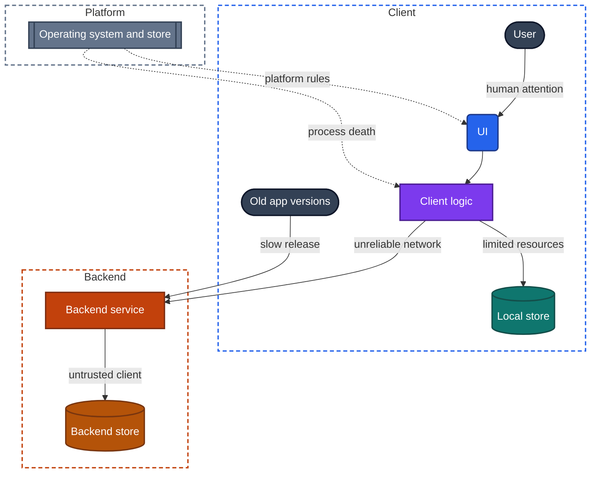
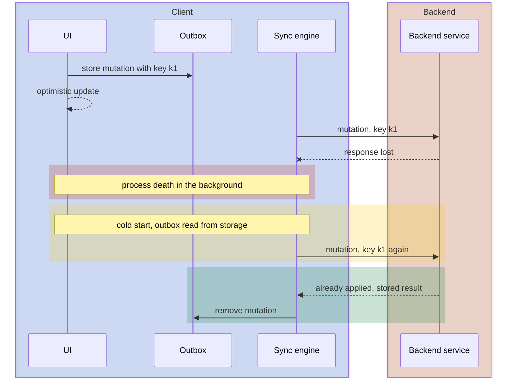

> **The question.** Which forces shape every mobile app, whatever it does?

## 2.1 Why start from constraints

[Chapter 1](/part-1-method/1-reading-apps-from-the-outside/) made a claim: each problem a mobile app faces has only a few workable designs. This chapter gives the reason. Seven constraints apply to every mobile app, and each one removes designs that would work elsewhere.

A constraint is a force every mobile app is subject to. It does not depend on what the app does. A game, a banking app and a note-taking app meet the same seven.

1. **Unreliable network.** Slow, lossy, absent, and changing between all three.
2. **Process death.** The operating system can end the app's process at any time while it is in the background.
3. **Limited resources.** Battery, memory, storage, mobile data and processing power are all rationed.
4. **Slow release.** A shipped version cannot be recalled. Old versions stay in use for years.
5. **Untrusted client.** The backend cannot trust what the client sends, and anything on the device can be inspected.
6. **Human attention.** One small screen, frequent interruptions, and a response must feel immediate.
7. **Platform rules.** The operating system and the store control background execution, permissions, notifications and payments.

The handbook uses these names and this order everywhere.

Constraints matter to a teardown for two reasons. Each one tells you where to look, because a design that answers a constraint shows itself when that constraint bites. And each one explains what you find. When an app does something that looks odd, such as asking you to update before it lets you in, the explanation is nearly always one of the seven.

Figure 2.1 shows where each constraint presses on the structure of an app.

*Figure 2.1. Where each of the seven constraints presses on an app.*

Sections 2.2 to 2.8 take the constraints one at a time. Each section answers three things: what the constraint is, what it forces a design to do, and what you see as a result.

## 2.2 Unreliable network

**What it is.** A mobile network is slow, lossy, absent, and changing between all three. The device moves between a wireless network and mobile data, between cells, into elevators and out of them. A connection that worked when a request started may not exist when the response is due.

The important word is "changing". An app can cope with a network that is always slow, or always absent. The hard case is the one that changes mid-request. The client sends a mutation, the backend applies it, and the response is lost. The client now cannot tell whether the mutation happened.

**What it forces.** Every request needs an answer to four situations: it succeeded, it was refused, it failed for now, and its fate is unknown. Designs that treat the last two as the first two lose data or duplicate it.

- A client must decide what to show while it has no answer. The choices are a blocking indicator, a cache, or an optimistic update.
- A client must decide what to do with a mutation it could not send. The choices are in [Chapter 12](/part-2-concerns/12-offline-and-sync/): block, hold in memory, store in an outbox, or write to a replica.
- A retry must be safe, which requires an idempotency key or an equivalent.
- Retries must be spaced out, or a backend that is recovering gets hit by every client at once.
- The interface between client and backend must limit round trips, because each one is slow and may fail on its own.

**What you see.** Cached content when you open the app in a tunnel. Pending indicators on items you just created. A banner that says the app is offline, or the absence of one. A screen that loads in one step, or a screen whose parts arrive one after another. Duplicate items after a bad connection. Video quality that drops and recovers.

This is the constraint you can apply most cheaply. Airplane mode gives you an absent network at will, and a weak signal at the edge of coverage gives you a lossy one. Its effects are covered in [Chapter 10](/part-2-concerns/10-api-shape/), [Chapter 12](/part-2-concerns/12-offline-and-sync/), [Chapter 13](/part-2-concerns/13-network-transport-and-resilience/) and [Chapter 14](/part-2-concerns/14-real-time-delivery/), among others.

## 2.3 Process death

**What it is.** The operating system can end the app's process at any time while it is in the background. It does so to reclaim memory for whatever the user is doing now. The app gets no reliable notice. From the user's point of view nothing happened: the app is still in the list of recent apps, and tapping it is expected to return to the same place.

On a phone this is routine. An app the user left an hour ago has probably lost its process, and a cold start follows.

**What it forces.** Anything held only in memory must be treated as already lost. A design must sort every piece of state into one of three groups.

- **State that must survive.** User input, unsent mutations, the position in a multi-step flow. This must be written to durable storage before the app goes to the background, or at the moment it is created.
- **State that can be rebuilt.** Content fetched from the backend. It is reloaded from a cache or the network after a cold start.
- **State that may be dropped.** A scroll position in a long feed, an open menu. Dropping it is a choice with a visible cost.

Process death also forces work to be resumable. A long upload that lives in the app's memory ends with the process. To survive, it must be handed to a facility the operating system runs on the app's behalf, or be restartable from where it stopped.

**What you see.** After a long time in the background, the app either returns you to the same screen with the same content, or shows its launch screen and starts from the first tab. A half-written post is still there, or it is gone. A form in a checkout flow keeps its fields, or resets. A message sent in a tunnel survives a force-quit, or disappears.

A force-quit is the user's version of this constraint. It is not identical, because some platforms treat a deliberate quit differently from a silent one, but it removes the process and with it everything held in memory. [Chapter 7](/part-2-concerns/7-launch-and-startup/), [Chapter 8](/part-2-concerns/8-navigation-deep-links-and-screen-state/) and [Chapter 9](/part-2-concerns/9-state-and-ui-data-flow/) cover what an app rebuilds on a cold start and what it restores.

## 2.4 Limited resources

**What it is.** Battery, memory, storage, mobile data and processing power are all rationed. Some of the rationing is physical: the battery is small, and a cheap phone has a fraction of the memory of an expensive one. Some is financial: mobile data costs the user money. Some is enforced: the operating system ends processes that use too much memory, and restricts apps that drain the battery in the background.

**What it forces.** Every resource gets a budget, whether the team wrote one down or not.

- **Memory.** A long list cannot keep every row and every image in memory. It must reuse rows and release images that scroll away.
- **Storage.** A cache needs a size limit and a rule for what to evict. A local store needs a rule for how much history to keep.
- **Mobile data.** Images must be requested at the size they are shown. Large downloads wait for an unmetered network, or ask first.
- **Battery.** The radio is expensive to wake, so requests are batched. A persistent connection is held only while the app is in use. Location is sampled at the lowest accuracy that serves the feature.
- **Processing power.** Work that would block the display is moved off the thread that draws it, or moved to the backend.

**What you see.** Images that appear blurred and then sharpen. A setting named "data saver" or "download on unmetered networks only". Video that plays at a lower quality on mobile data. An app's storage use that grows to a ceiling and stops, or grows without limit. Old conversations whose media must be downloaded again. A feed that stutters on an old device. The battery screen in device settings, which lists what each app used in the foreground and in the background.

Low-power mode, data-saver mode and a nearly full disk are resource probes, and [Chapter 4](/part-1-method/4-probes/) describes them. The designs appear in [Chapter 11](/part-2-concerns/11-local-storage-caching-and-prefetching/), [Chapter 15](/part-2-concerns/15-lists-feeds-and-pagination/), [Chapter 16](/part-2-concerns/16-images/) and [Chapter 35](/part-2-concerns/35-performance-and-resource-budgets/).

## 2.5 Slow release

**What it is.** A shipped version cannot be recalled. A new version must pass store review, which takes hours or days. After that, each user decides when to install it, and some never do. Old versions stay in use for years.

A web team that finds a bug deploys a fix, and every user has it on the next page load. A mobile team that finds a bug ships a fix, and for weeks most users still run the bug. At any moment a backend serves many client versions at once, including some whose authors have left the company.

**What it forces.** The backend must stay compatible with clients it cannot change.

- **The interface between client and backend must evolve by addition.** A field can be added. Removing or changing one breaks an old client.
- **Old clients must tolerate what they do not understand.** A client that crashes on an unknown item type turns every new feature into an outage for old versions.
- **Behavior that may need to change is moved off the client.** Remote config and feature flags let a team turn a feature on, off or down without a release. Server-driven UI lets the backend change a screen's layout. Rules that must change quickly are computed on the backend.
- **There must be a way to retire a version.** A client must be able to learn from the backend that it is too old, and tell the user to update.
- **Releases are staged.** A new version goes to a small share of users first, so a serious fault is caught before it reaches everyone.

**What you see.** A screen that blocks the app until you update. A softer prompt that suggests an update and lets you dismiss it. A feature that appears without an update, or that a friend has and you do not. A screen whose layout changes from one day to the next with no new version installed. A placeholder that says a message cannot be shown in this version of the app. A version history on the store listing with a release every week or two.

You can apply this constraint by not updating. An old version left on a spare device is a time probe, and it shows how the backend treats clients it has outgrown. Chapters 30, 31 and 33 cover the designs.

## 2.6 Untrusted client

**What it is.** The backend cannot trust what the client sends, and anything on the device can be inspected. The app runs on hardware its team does not control. A determined person can read anything stored in the app, change any value in memory, and send the backend any request the app could send, with any content.

**What it forces.** The constraint draws a line through every feature: what the client may decide, and what only the backend may decide.

- **The backend decides anything that has value.** Prices, balances, entitlements, scores, permissions and stock levels are computed and checked on the backend. The client displays them.
- **The backend validates every mutation.** A check in the client is a convenience for the user. The check that counts is repeated on the backend.
- **Secrets do not ship in the app.** A key embedded in the app is a published key. Access is granted to a session, and the session can be revoked.
- **Credentials on the device go in secure hardware-backed storage,** and sensitive data is kept off the device where possible.
- **Sensitive actions ask again.** A payment or a change of password requires a fresh proof of identity, even inside a valid session.

**What you see.** A price that changes between the list screen and the checkout, because the backend recomputed it. A purchased feature that takes a moment to unlock, because the backend is confirming the purchase with the store. An optimistic update that is rolled back because the backend refused the mutation. A screen that works offline for reading and refuses to act. A prompt for a fingerprint, a face or a passcode before a transfer. Being signed out on every device after you change your password. A banking app that hides its content in the list of recent apps.

You do not test this constraint by attacking it. You observe where the app refuses to proceed without the backend, and that shows you where the line was drawn. A feature that is fully usable offline is one the backend does not need to guard in real time. Chapters 20, 21 and 26 cover the designs.

## 2.7 Human attention

**What it is.** One small screen, frequent interruptions, and a response must feel immediate. The user holds the device in one hand, often while doing something else. A session lasts seconds or a few minutes. A call, a notification or the arrival of a bus ends it without warning.

The standard is perception, not measurement. A response within about a tenth of a second feels like the user's own action. A wait of a second is noticed. A wait of several seconds with nothing on screen reads as a failure, and the user leaves.

**What it forces.** The UI must respond before the system has finished.

- **Show something at once.** A cold start shows a cache, a skeleton of the layout or a placeholder before any network response arrives. Stale-while-revalidate is the standard form: cached data first, fresh data when it comes.
- **Acknowledge every action at once.** An optimistic update shows the result of a mutation before the backend confirms it.
- **Never block the display.** Work that takes longer than one frame is moved off the thread that draws.
- **Expect to be interrupted.** Every flow must be safe to abandon at any step and resume later. This is the same demand that process death makes, arrived at from the other side.
- **Bring the user back.** Because sessions are short, an app relies on notifications to start the next one, which leads to the constraint in Section 2.8.
- **Fit one screen.** Content is cut into lists, pages and steps. A long list is loaded as the user scrolls, not ahead of time.

**What you see.** Gray placeholder shapes that turn into content. Yesterday's feed on screen for a moment before today's replaces it. A like that registers at the instant of the tap. A feed that keeps scrolling while more rows load. A draft that is still there after a phone call. A badge on the app icon.

Attention is the constraint that most often pulls against the others. The network says wait for confirmation, and attention says show the result now. The untrusted client says the backend must decide, and attention says the user must not wait for it. Optimistic updates, rollback and reconcile exist to serve both. [Chapter 7](/part-2-concerns/7-launch-and-startup/) and [Chapter 9](/part-2-concerns/9-state-and-ui-data-flow/) cover the main designs.

## 2.8 Platform rules

**What it is.** The operating system and the store control background execution, permissions, notifications and payments. An app is a guest. It runs when the operating system allows it, reaches hardware and personal data only with the user's consent, sends notifications through a channel the platform owns, and sells digital goods through the store's payment system under the store's terms.

**What it forces.** An app cannot do what it wants when it wants. It asks, and designs for being refused.

- **Background work is requested, not taken.** The app declares a task, and the operating system decides when it runs, if at all. Long-running work must fit a category the platform permits, such as audio playback, navigation or a transfer the system manages.
- **Notifications go through the platform's push service.** The backend sends to the platform, and the platform delivers to the device. Delivery is best effort.
- **Every permission can be denied or revoked.** A feature needs a path for each case: granted, denied, granted in part, and withdrawn later.
- **Digital purchases use the store.** The store holds the payment relationship, and the backend learns of a purchase from the store.
- **The app must pass review.** Some designs are ruled out by policy, not by engineering.

**What you see.** A permission prompt, and whether it comes at first launch or at the moment the feature is used. A feature that degrades when a permission is denied, or a screen that refuses to continue. A notification that arrives minutes late, or a batch that arrives together when the device wakes. Content that is current when you open the app, or that refreshes only after you open it. A persistent indicator while an app uses location or the microphone in the background. A payment sheet that belongs to the platform and not to the app. A price that is higher in the app than on the website.

Device settings show most of this directly. The list of permissions an app holds, its notification categories and its background activity are all passive observations. Chapters 22, 23, 25 and 26 cover the designs.

## 2.9 Which chapters each constraint drives

Part II has one chapter per concern. Each concern exists because of one or more constraints. Table 2.1 lists, for each constraint, the Part II chapters it drives most directly. A chapter appears under every constraint that shapes its design space, so most chapters appear more than once.

| Constraint | Part II chapters it drives |
|---|---|
| 1. Unreliable network | [10 API shape](/part-2-concerns/10-api-shape/), [11 Local storage, caching and prefetching](/part-2-concerns/11-local-storage-caching-and-prefetching/), [12 Offline and sync](/part-2-concerns/12-offline-and-sync/), [13 Network transport and resilience](/part-2-concerns/13-network-transport-and-resilience/), [14 Real-time delivery](/part-2-concerns/14-real-time-delivery/), [15 Lists, feeds and pagination](/part-2-concerns/15-lists-feeds-and-pagination/), 17 Audio and video playback, 18 File transfer: uploads and downloads, 19 Live calls and live streaming, 36 Constrained devices and networks |
| 2. Process death | [7 Launch and startup](/part-2-concerns/7-launch-and-startup/), [8 Navigation, deep links and screen state](/part-2-concerns/8-navigation-deep-links-and-screen-state/), [9 State and UI data flow](/part-2-concerns/9-state-and-ui-data-flow/), [12 Offline and sync](/part-2-concerns/12-offline-and-sync/), 18 File transfer: uploads and downloads, 23 Background work and notifications |
| 3. Limited resources | [11 Local storage, caching and prefetching](/part-2-concerns/11-local-storage-caching-and-prefetching/), [15 Lists, feeds and pagination](/part-2-concerns/15-lists-feeds-and-pagination/), 16 Images, 17 Audio and video playback, 24 Location, sensors and hardware, 29 Personalization and on-device intelligence, 35 Performance and resource budgets, 36 Constrained devices and networks |
| 4. Slow release | [10 API shape](/part-2-concerns/10-api-shape/), 30 Remote config and experiments, 31 Server-driven UI, 32 UI technology: native, cross-platform and web, 33 Releases and compatibility, 34 Observability, 38 Modularity, SDKs and team scale |
| 5. Untrusted client | [10 API shape](/part-2-concerns/10-api-shape/), 20 Identity and sessions, 21 Security and trust, 26 Payments and subscriptions, 27 Ads, attribution and growth |
| 6. Human attention | [7 Launch and startup](/part-2-concerns/7-launch-and-startup/), [8 Navigation, deep links and screen state](/part-2-concerns/8-navigation-deep-links-and-screen-state/), [9 State and UI data flow](/part-2-concerns/9-state-and-ui-data-flow/), [15 Lists, feeds and pagination](/part-2-concerns/15-lists-feeds-and-pagination/), 23 Background work and notifications, 28 Search and discovery, 35 Performance and resource budgets, 37 Accessibility and global reach |
| 7. Platform rules | 22 Privacy, permissions and consent, 23 Background work and notifications, 24 Location, sensors and hardware, 25 Platform surfaces: widgets, wearables and extensions, 26 Payments and subscriptions, 27 Ads, attribution and growth |

*Table 2.1. The constraints and the Part II chapters each one drives.*

Use the table in both directions. Reading across, it tells you which chapters to open after a probe has applied a constraint. Reading the other way, it tells you which constraints a concern answers. Background work, in [Chapter 23](/part-2-concerns/23-background-work-and-notifications/), sits under process death, human attention and platform rules, and its design space only makes sense with all three in view.

## 2.10 How constraints combine

A constraint taken alone usually has a simple answer. Designs become distinctive where two or more constraints apply to the same piece of data at the same time, and the simple answer to one is ruled out by another.

### The durable outbox

The clearest case is the outbox of [Chapter 12](/part-2-concerns/12-offline-and-sync/).

The unreliable network alone has a simple answer: keep the mutation and retry it. A list in memory does that.

Process death alone also has a simple answer: write user input to durable storage.

Together they give a harder problem. The mutation must wait for a network, and the wait may be long. The user will put the app in the background during that wait, and the operating system will end the process. The retry list in memory is gone. So the mutation must be stored durably, in order, with enough information to send it later from a fresh process. That is an outbox.

A third constraint then joins. A mutation resent from a fresh process may be one the backend already applied, because the response was lost before the process died. The client cannot know. So each entry carries an idempotency key. Figure 2.2 shows the sequence.

*Figure 2.2. An unreliable network and process death, combined, produce a durable outbox with idempotency keys.*

Each element in the figure answers one constraint. The optimistic update answers human attention. The stored mutation answers process death. The retry answers the unreliable network. The key answers the combination.

### Other combinations

The same reasoning produces most of the recognizable designs in the handbook.

| Constraints combined | Design that results | Where it is covered |
|---|---|---|
| Unreliable network, human attention | Stale-while-revalidate. Show the cache at once, then refresh | [Chapter 11](/part-2-concerns/11-local-storage-caching-and-prefetching/) |
| Unreliable network, human attention, untrusted client | Optimistic update with rollback. Show the result now, let the backend decide, undo if it refuses | [Chapter 12](/part-2-concerns/12-offline-and-sync/) |
| Process death, human attention | Screen state saved and restored, so a cold start returns to the same place | [Chapter 8](/part-2-concerns/8-navigation-deep-links-and-screen-state/) |
| Limited resources, platform rules, human attention | A push hint in place of a persistent connection while the app is in the background | [Chapter 14](/part-2-concerns/14-real-time-delivery/), [Chapter 23](/part-2-concerns/23-background-work-and-notifications/) |
| Limited resources, unreliable network | Pagination, and images requested at display size | [Chapter 15](/part-2-concerns/15-lists-feeds-and-pagination/), [Chapter 16](/part-2-concerns/16-images/) |
| Slow release, untrusted client | Rules computed on the backend, with remote config and feature flags to change behavior without a release | [Chapter 30](/part-2-concerns/30-remote-config-and-experiments/) |
| Slow release, unreliable network | An interface that changes only by addition, and a way to tell an old client to update | [Chapter 10](/part-2-concerns/10-api-shape/), [Chapter 33](/part-2-concerns/33-releases-and-compatibility/) |

### Constraints that pull against each other

Some combinations do not add up to one design. They force a trade, and different apps make it differently.

**Human attention against the untrusted client.** Attention wants the result on screen now. Trust wants the backend to decide first. A like button takes the first side, because a wrong guess costs nothing. A money transfer takes the second, and shows a blocking indicator until the backend answers. Where an app puts each of its actions on that line tells you what its team considers costly to get wrong.

**Unreliable network against the untrusted client.** Working offline requires the client to decide things on its own. Trust requires the backend to decide them. The more of a product's value sits in rules the backend must enforce, the less of it can work offline. This is why a notes app reaches a high offline level and a ticket-booking app does not.

When you find a trade like this in a teardown, record which side each feature took. The pattern across features is more informative than any single one.

## 2.11 In practice

Use the seven constraints as a checklist at three points in a teardown.

**Before you probe.** For the feature you are studying, ask of each constraint: what would this feature have to do about it? You will have seven short answers, and some will be "nothing". The others are your list of things to look for. A photo upload, for example, must survive a dropped connection and process death, avoid mobile data for large files, show progress, and continue in the background within what the platform permits.

**While you probe.** Each constraint has a condition you can apply as a normal user.

| Constraint | Condition you can apply |
|---|---|
| Unreliable network | Airplane mode, a weak signal, a switch between networks |
| Process death | A force-quit, a long time in the background, a device restart |
| Limited resources | Low-power mode, data-saver mode, a nearly full disk |
| Slow release | An old app version kept on a spare device |
| Untrusted client | None to apply. Observe where the app refuses to act without the backend |
| Human attention | An interruption in the middle of a flow, such as a call or a switch to another app |
| Platform rules | A permission denied, granted later or revoked. Notifications turned off |

[Chapter 4](/part-1-method/4-probes/) organizes these conditions into probe families.

**When you explain.** Every design claim in a teardown should name the constraint it answers. "The app stores unsent messages durably" is a finding. "The app stores unsent messages durably because a send must survive both a lost network and process death" is an explanation, and it tells the reader what else to expect. If you cannot name the constraint a behavior answers, you probably have not identified the design yet.

## 2.12 Summary

- Seven constraints shape every mobile app: unreliable network, process death, limited resources, slow release, untrusted client, human attention and platform rules.
- The unreliable network forces every request to handle success, refusal, failure for now and an unknown result. It produces caches, pending states and safe retries.
- Process death forces every piece of state to be classified as must survive, can be rebuilt or may be dropped. It shows in what an app restores after a cold start.
- Limited resources force a budget for memory, storage, data, battery and processing. Slow release forces compatibility with old versions and moves changeable behavior to the backend.
- The untrusted client forces the backend to decide anything of value. It shows in what an app refuses to do offline.
- Human attention forces the UI to respond before the system is done. Platform rules force the app to ask for background time, permissions, notifications and payments, and to cope with refusal.
- Distinctive designs come from combinations. An unreliable network plus process death gives the durable outbox, and a lost response adds the idempotency key.
- Some constraints pull against each other. Where an app places each feature in that trade is a finding worth recording.
