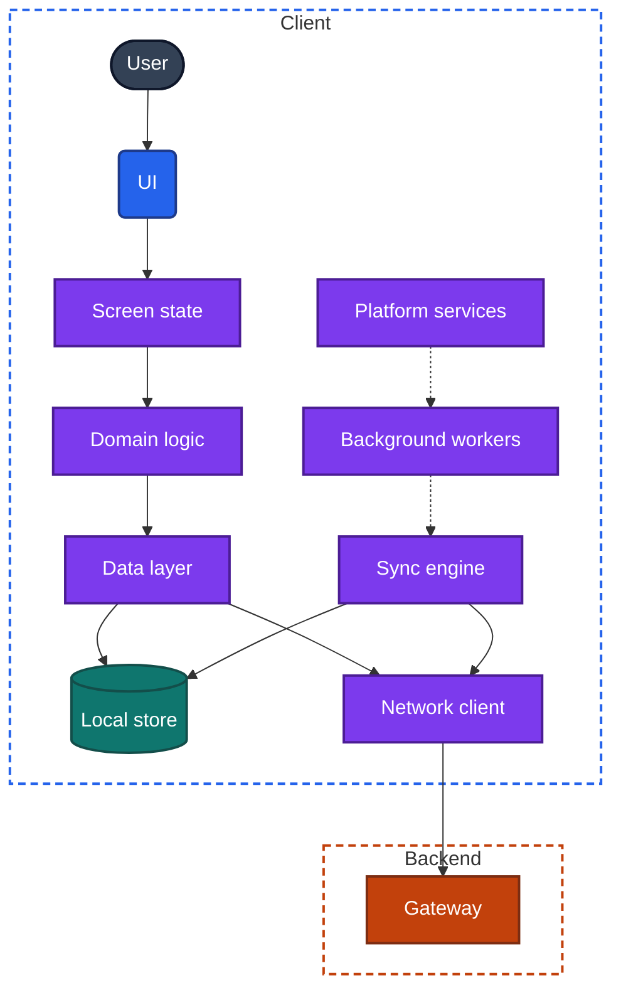
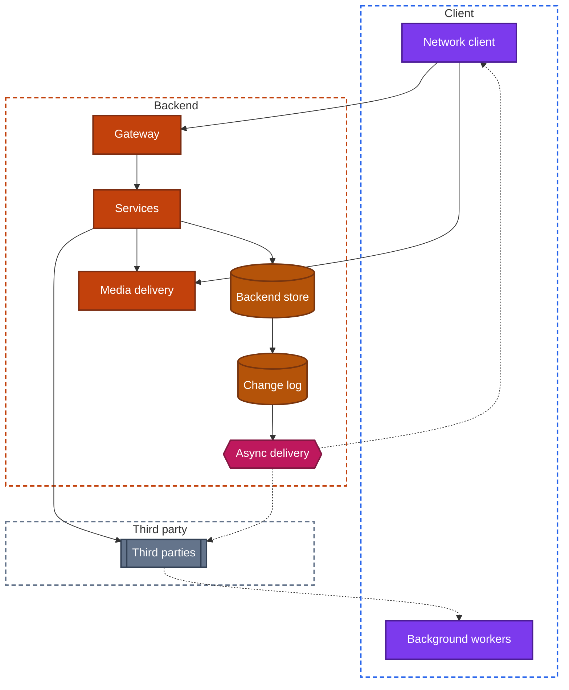
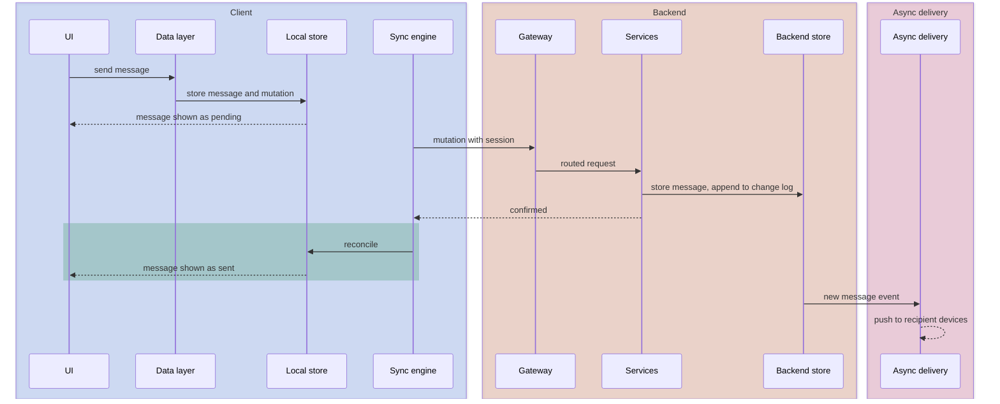

import Probe from '../../../components/Probe.astro';
import Signals from '../../../components/Signals.astro';
import TeardownBar from '../../../components/TeardownBar.astro';
import WorksheetForm from '../../../components/WorksheetForm.astro';

> **The question.** What are the parts of any app and its backend, and which ones does this app have?

## 3.1 Why one model

[Chapter 2](/part-1-method/2-the-mobile-constraint-set/) described the forces on an app. This chapter describes the parts those forces produce.

The model has sixteen components. Nine are on the client and seven are on the backend.

- **Client components:** UI, screen state, domain logic, data layer, local store, network client, sync engine, background workers, platform services.
- **Backend components:** gateway, services, backend store, change log, async delivery, media delivery, third parties.

Every app is a subset of this model. A flashlight app has four of the components: UI, screen state, domain logic and platform services. A messaging app has all sixteen. No app you will meet needs a seventeenth, though many subdivide one of these into several pieces.

The model is a model of jobs, not of code. A component here is a responsibility that something in the system must carry. In one app the data layer is a carefully separated module. In another it is a few functions mixed into the screens. Either way, something decides where a screen's data comes from, and that something is the data layer. You cannot see how the code is organized ([Chapter 1](/part-1-method/1-reading-apps-from-the-outside/), Section 1.6). You can see whether the job is done, and how well.

The model gives a teardown three things.

1. **A first question.** Before you study how an app syncs, you establish whether it has a sync engine at all. Stating which components exist cuts the work, because each absent component removes whole chapters of Part II from the teardown.
2. **A shared vocabulary.** Every later chapter refers to these components by these names. Diagrams draw each one with the same color and shape.
3. **A place to put each finding.** A signal belongs to a component. "Offline changes send from any screen" is a fact about the sync engine. Filing it there shows what else is still unknown about that component.

## 3.2 The client

Figure 3.1 shows the nine client components and how data moves between them.

*Figure 3.1. The nine client components. Solid arrows are direct calls. Dotted arrows are wake-ups.*

The components fall into three groups. UI, screen state and domain logic are what the user deals with, and every app has them. Data layer, local store and network client are how the app gets and keeps data. Sync engine, background workers and platform services are what lets the app act when no screen is asking.

For each component, the text gives its job and how to tell from outside whether an app has it.

### UI

**Job.** Draws the screen and takes input. It holds no data of its own beyond what is needed to draw the current frame.

**How to tell.** Every app has one. The question for a teardown is how the UI is drawn and who decides its layout, and those belong to [Chapter 32](/part-2-concerns/32-ui-technology-native-cross-platform-and-web/) and [Chapter 31](/part-2-concerns/31-server-driven-ui/). Record it as present and move on.

### Screen state

**Job.** Holds what one screen is currently showing and doing: the items in view, the text in a field, the selected tab, the scroll position, and whether the screen is loading, showing content or showing an error. It lives in memory for as long as the screen does.

**How to tell.** Every app has screen state. What varies is how much of it survives. Type half a message, switch to another app for an hour, and return. If the text is still there, that part of the screen state was written to durable storage. If the app returns to its first screen, the screen state was held in memory only and process death removed it. [Chapter 8](/part-2-concerns/8-navigation-deep-links-and-screen-state/) and [Chapter 9](/part-2-concerns/9-state-and-ui-data-flow/) take this further.

### Domain logic

**Job.** Applies the product's rules on the client: validating input, computing a total, deciding which actions an item allows, sorting and filtering. It turns raw data into what the screen should show, and user input into a mutation.

**How to tell.** Domain logic is present in every app, and its amount varies widely. Two observations place it.

- Go offline and use features that compute something. If a cart total updates, a form reports an invalid entry, or a list can be filtered and sorted, the rule runs on the client.
- Watch for rules that change without an app update. A new fee, a changed limit or a reworded validation message that appears with no new version means the rule is in a backend service and the client displays its result.

A client with little domain logic is common where the backend must decide everything of value, and where a team uses server-driven UI.

### Data layer

**Job.** Decides where each piece of data comes from and gives it to the screens. It chooses between memory, the local store and the network client, combines their answers, and decides when cached data is too old. When it is shared between screens, it is also what keeps them consistent.

**How to tell.** Every app with data has this job done somewhere. What you can see is whether one shared data layer does it, or each screen does it for itself.

- Change an item on a detail screen, for example mark it as a favorite, and go back to the list. If the list already shows the change, both screens read from one shared source and observe it. That is a shared data layer.
- If the list shows the old value until you refresh, each screen fetched its own copy and holds it separately.

The second case is not a missing component. It is the same job done per screen, and it is worth recording because it predicts inconsistencies elsewhere in the app.

### Local store

**Job.** Keeps structured data on the device where the client can query it. It may be a cache, which can be discarded without loss, or a replica, which the app writes to first. [Chapter 11](/part-2-concerns/11-local-storage-caching-and-prefetching/) covers the difference in depth.

**How to tell.** This is the easiest component to detect.

- A cold start in airplane mode shows content. Something on the device held it.
- Search or filtering over old content works offline. The data is structured and queryable, not a set of saved responses.
- The app's data size in device settings grows as you use it.

An app that shows nothing but an error on an offline cold start has no local store for content. It may still store small things, such as the session and settings.

### Network client

**Job.** Sends every request to the backend and receives every response. It attaches the session, sets timeouts, retries, orders requests by priority and turns failures into a small set of outcomes the rest of the client understands.

**How to tell.** Any app with a backend has one. Its presence is not the finding. Its uniformity is. If every screen shows the same kind of error on a weak network, recovers in the same way when the network returns, and sends you to the same sign-in screen when the session ends, then all requests pass through one network client. If screens fail in different ways, with different messages and different retry behavior, requests are made from several places. [Chapter 13](/part-2-concerns/13-network-transport-and-resilience/) covers its design.

### Sync engine

**Job.** Sends the outbox, pulls remote changes and applies them to the local store. It runs at app level, independent of any screen.

**How to tell.** A sync engine shows in two behaviors.

- A change made offline is sent after the network returns, while you are on a different screen. Check on a second device.
- Content you have not opened is already current when you get to it.

Many apps have no sync engine. Each screen fetches what it needs when it opens, and a mutation is sent by the screen that made it. [Chapter 12](/part-2-concerns/12-offline-and-sync/) separates these cases with its probes.

### Background workers

**Job.** Do work while no screen is visible: finishing an upload, refreshing content on a schedule, handling a push, cleaning the cache. The operating system decides when they run.

**How to tell.**

- Start a large upload and leave the app. If it completes, a background worker carried it.
- After a notification arrives, open the app in airplane mode. If the new content is there, a background worker fetched it.
- The battery and data screens in device settings show background use per app. An app with none listed after days of use probably has no background workers.

### Platform services

**Job.** Give the app the capabilities that only the operating system has: notifications, location, camera and microphone, secure hardware-backed storage, biometric checks, the store's payment system, sharing to other apps, widgets, and storage that the platform syncs between a user's devices.

**How to tell.** This component is visible by passive observation. Open the app's page in device settings and read the list of permissions and notification categories. Read the privacy section of the store listing. Note every prompt the app shows and every screen that belongs to the platform, such as a payment sheet or a photo picker. Record the list, because each entry points to a Part II chapter.

## 3.3 The backend

Figure 3.2 shows the seven backend components. You reach all of them through the client, so each is detected by its effect on what the client shows.

*Figure 3.2. The seven backend components. The dotted path through third parties is a push that reaches the device by way of the platform's push service.*

Claims about backend components are weaker than claims about client ones. You can often say that a job is done. You can rarely say that a separate piece of software does it. The confidence words in the following paragraphs reflect that.

### Gateway

**Job.** Is the single entry point for client requests. It checks the session, limits request rates, rejects clients that are too old and routes each request to a service.

**How to tell.** Look for behavior that is identical across unrelated features and happens to all of them at once.

- When a session is revoked, every screen sends you to sign-in at the same moment.
- An old version gets the same "update required" screen whichever feature it opens.
- A maintenance message replaces the whole app, not one tab.

These show that the functions of a gateway exist. That a distinct gateway performs them is Speculative, because one large service could do the same.

### Services

**Job.** Run the backend's share of the domain logic. They validate mutations, compute what the client may not decide and produce the responses the client displays.

**How to tell.** Any app with a backend has at least one. How many there are, and where their boundaries lie, is mostly out of reach. One signal gives a hint: partial failure. If the search tab shows an error while the feed and the messages keep working, those features are served separately. Record the features that fail independently. Do not count services.

### Backend store

**Job.** Holds the data that outlives any device. For most apps it is the source of truth.

**How to tell.** Delete the app, install it again and sign in. Whatever returns was in the backend store. Whatever is gone lived only on the device. A second device gives the same answer with less risk.

One case misleads. Some apps move user data between devices through storage the platform provides to each user. Data then appears on a second device, and the app's team runs no backend store at all. The sign is that there is no account for the app itself, and the data follows the platform account only, on that platform only. P3.2 has an outcome for this.

### Change log

**Job.** Records every change in order, so that a client can ask for what changed since a cursor instead of fetching everything again.

**How to tell.** A change log has no direct signature. It is Inferred from catch-up behavior. After a week away, an app with a large data set that becomes current in a moment, including removing items deleted elsewhere, received a delta, and something on the backend produced it. [Chapter 12](/part-2-concerns/12-offline-and-sync/) has a probe for this. Without a local store on the client, there is nothing to catch up, and a change log has no reason to exist for that client.

### Async delivery

**Job.** Moves an event to where it is needed without a waiting request: a push to a closed app, a message down a persistent connection to an open one, a queue between services that lets slow work finish later.

**How to tell.** Three behaviors, each for a different form.

- A notification arrives while the app is closed. That is push, and it is Observed.
- A screen updates while you watch it and touch nothing. That is delivery to a running client. [Chapter 14](/part-2-concerns/14-real-time-delivery/) separates a persistent connection from polling.
- An action completes later than the request that started it. A video shows "processing" and becomes playable after a minute. An export arrives by email. A queue sits behind those.

### Media delivery

**Job.** Stores images, audio, video and files, and serves them to clients, usually from locations near the user and in several sizes or qualities.

**How to tell.** Media that behaves differently from data is delivered separately from it.

- On a weak connection, text and layout appear first and images fill in afterwards.
- Images appear blurred and then sharpen, or video starts at low quality and improves.
- Media keeps loading during an incident in which the rest of the app shows errors, or the reverse.

An app whose images all ship inside the app has no media delivery.

### Third parties

**Job.** Do what the app's team chose not to build: taking payments, proving identity, drawing maps, measuring use, showing ads, sending push through the platform, sending email and text messages, answering support chats.

**How to tell.** Third parties are the most visible backend component, because many of them put their name on screen or must be disclosed.

- A "sign in with" button, a payment sheet or a map attribution names a company.
- The privacy section of the store listing and the app's privacy policy list the kinds of data shared.
- A licenses or acknowledgments screen in the app's settings lists the software it includes.
- A screen that looks and scrolls differently from the rest of the app is often an embedded page from another company.

## 3.4 One action through the model

Components make sense in motion. Figure 3.3 follows one action, sending a message, through the components a messaging app uses. [Chapter 39](/part-3-archetypes/39-messaging/) covers the archetype in full.

*Figure 3.3. Sending a message, as a path through the model.*

Each arrow is something you can check. The pending state is the local store answering before the backend does. The change to "sent" is the sync engine applying a confirmation. The notification on the recipient's device is async delivery. A teardown of a feature is, in the end, this diagram drawn for that feature, with a confidence word on each arrow.

## 3.5 Three apps as subsets

The model is useful because apps leave parts of it out. Table 3.1 shows three apps as subsets.

- **An app with no backend.** A unit converter, a camera filter app, or a personal tracker that keeps its data on the device. [Chapter 54](/part-3-archetypes/54-apps-with-no-backend/) covers the archetype.
- **A content app.** A news reader or a recipe app. Content flows from the backend to the client. The user reads much and writes little.
- **A messaging app.** Data flows both ways between many users, in real time, and must be available offline.

| Component | App with no backend | Content app | Messaging app |
|---|---|---|---|
| UI | Present | Present | Present |
| Screen state | Present | Present | Present |
| Domain logic | Present, all of it | Present, thin | Present |
| Data layer | Present, local only | Present | Present, shared and observed |
| Local store | Present, the only copy | Present, as a cache | Present, as a replica |
| Network client | Absent | Present | Present |
| Sync engine | Absent | Absent | Present |
| Background workers | Rare | Sometimes, for refresh | Present |
| Platform services | Present | Present | Present, many |
| Gateway | Absent | Present | Present |
| Services | Absent | Present | Present |
| Backend store | Absent | Present | Present |
| Change log | Absent | Absent | Present |
| Async delivery | Absent | Push for new content | Push and a persistent connection |
| Media delivery | Absent | Present | Present |
| Third parties | Often present | Present | Present |

*Table 3.1. Three apps as subsets of the universal app model.*

Three points in the table are worth reading closely.

**No backend does not mean no network.** An app whose team runs no backend commonly still includes third parties: ads, analytics, crash reports, the store's payment system. It shows an ad while having no account and no backend store. Record the two separately. The claim "no backend" is about the app's own data.

**The content app is the common case.** Its client is a window onto backend data, with a cache to make it fast. It has no sync engine and no change log because the user's writes are few and small: a bookmark, a like, a setting. Each of those is sent by the screen that made it. Most apps in a store have this shape, and most of the effort in their design goes into the read path.

**The same component differs in kind between subsets.** All three apps have a local store. In the first it is the only copy of the data. In the second it is a cache. In the third it is a replica. The worksheet field records presence. The Part II chapters record the kind.

Other archetypes are other subsets. A video app is a content app with a heavy media delivery component. A ride-hailing app has strong async delivery and platform services and a modest local store. When you start a teardown, find the closest of the three subsets in Table 3.1 and note where your app departs from it. The departures are where the interesting design is.

## 3.6 Probes

Four probes establish most of the component list in about twenty minutes. P3.1 covers the local store and the existence of a backend. P3.2 covers the backend store and delivery to a running client. P3.3 covers push and background workers. P3.4 covers media delivery.

Select the outcome you saw in each probe, and it is recorded in your worksheet for the teardown chosen here.

<TeardownBar />

### P3.1 Offline tour

<Probe id="P3.1" />

### P3.2 Second device

<Probe id="P3.2" />

### P3.3 Delivery to a closed app

<Probe id="P3.3" />

### P3.4 Text before media

<Probe id="P3.4" />

These probes are deliberately coarse. They tell you that a component exists. The concern chapters tell you how it is designed. P3.1, for example, overlaps with the first probes of [Chapter 12](/part-2-concerns/12-offline-and-sync/), which go on to separate a cache from an outbox from a replica.

## 3.7 Signal-to-design table

Many signals for components need no probe. You meet them in normal use.

<Signals chapter={3} />

## 3.8 Worksheet entries

These are the fields this chapter adds to the teardown worksheet. Probe outcomes fill some of them in. The rest come from the signals in Section 3.7 and from passive observation.

<TeardownBar />

<WorksheetForm chapters={[3]} />

Three rules apply when you fill them in.

- **"Absent" needs evidence.** Record a component as absent only when you saw the behavior that its absence produces, such as an error on an offline cold start. Not having seen a component is "unclear".
- **Components belong to features too.** An app can have a sync engine for messages and none for its settings. Fill the fields in for the app as a whole, with "present" meaning that some feature uses the component, and use the notes field to say which.
- **Backend entries carry less confidence.** A backend component marked present on the strength of one signal is Speculative until a concern chapter's probe supports it.

## 3.9 In practice

The component list is the first page of a teardown. Fill it in before you study any single concern.

1. **Start with passive observation.** Read the store listing, the app's page in device settings and the app's own settings screens. This gives you platform services and third parties with no probe at all.
2. **Run P3.1 to P3.4.** They take one sitting and a second device.
3. **Pick the closest subset** from Table 3.1 and write down each departure from it.
4. **Use absences to cut the work.** No local store means [Chapter 12](/part-2-concerns/12-offline-and-sync/) is a single line in your teardown. No async delivery means [Chapter 14](/part-2-concerns/14-real-time-delivery/) is too. No backend store removes most of the data chapters.
5. **Use presences to choose where to go deep.** A sync engine and a change log point to [Chapter 12](/part-2-concerns/12-offline-and-sync/). Heavy media delivery points to Chapters 16 to 18. A long list of platform services points to Chapters 22 to 25.

Then draw the app. Copy Figure 3.1 and Figure 3.2, delete the components that are absent, and mark the ones that are unclear. The picture that remains is the outline of the teardown, and each remaining box is a question for a later chapter. [Chapter 6](/part-1-method/6-the-teardown-worksheet/) puts this step in its place in the full order of work.

## 3.10 Summary

- The universal app model has nine client components and seven backend components. Every app is a subset of it.
- The model describes jobs, not code. You can see whether a job is done. You cannot see how the code is divided.
- UI, screen state and domain logic exist in every app. The local store, network client, sync engine and background workers are what vary, and each has a clear signature.
- Backend components are detected through the client. A backend store shows in what survives a reinstall, async delivery in what arrives unasked, and media delivery in media that loads apart from data.
- Claims about backend components are weaker than claims about client ones. That a job is done can be Inferred. That a separate component does it is usually Speculative.
- An app with no backend, a content app and a messaging app are three subsets. The same component, such as the local store, differs in kind between them.
- Four probes establish most of the component list: an offline tour, a second device, delivery to a closed app, and text before media.
- A teardown begins by stating which components an app has. Absent components remove chapters from the work, and present ones show where to go deep.
