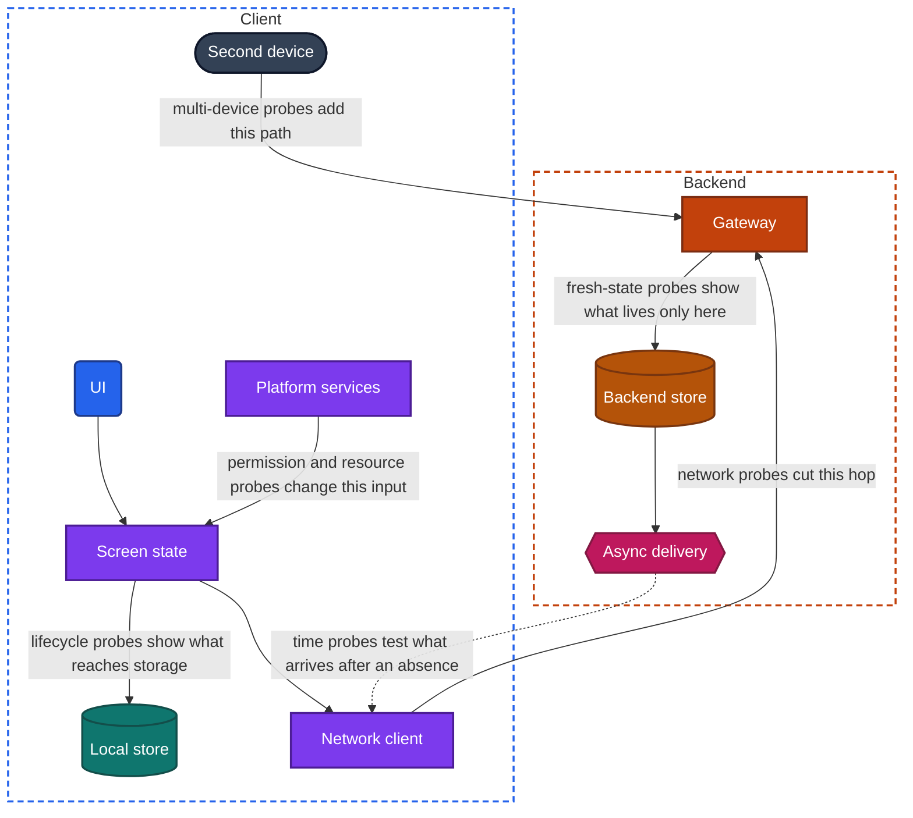

import Probe from '../../../components/Probe.astro';
import Signals from '../../../components/Signals.astro';
import TeardownBar from '../../../components/TeardownBar.astro';
import WorksheetForm from '../../../components/WorksheetForm.astro';

> **The question.** Which experiments can a user run on an app, and what does each one expose?

## 4.1 A probe is an experiment, not a session of use

Normal use shows you what an app does when everything works. That is the least informative condition, because most designs look the same when the network is fast, the process is alive and one device is in play. A feed that refetches on every visit and a feed that reads from a local store both show a list of items.

Designs separate under stress. Take the network away and the first feed shows an error while the second shows content. End the process and one app returns to where you were while another starts over. Each of the seven constraints in [Chapter 2](/part-1-method/2-the-mobile-constraint-set/) is a force the team had to answer, and the answer stays hidden until the force is applied.

A probe applies one such force on purpose. It is a repeatable experiment a normal user can run on an app to expose one aspect of its design. It has three parts: an action you take, a behavior you watch, and a reading that connects each possible behavior to a design.

The method uses only what a normal user has: the app, device settings, a second device or account, and time. You do not inspect traffic and you do not open the app's package. This limit is deliberate. It keeps the method legal and safe, it works on every platform, and it trains the skill the book is about, which is reasoning from behavior to design.

## 4.2 What makes a good probe

A probe is worth running when it has four properties.

| Property | Meaning | A probe that fails it |
|---|---|---|
| Cheap | It takes minutes and needs nothing you do not already have | Leaving a spare device untouched for six weeks |
| Safe | It cannot lose data, cost money or affect another person | Deleting your only copy of something to see whether it returns |
| Repeatable | The same steps give the same result, so a surprise can be checked | An effect that depends on a network glitch you cannot cause again |
| Discriminating | Its possible outcomes point to different candidate designs | Watching a screen load on a fast network |

The fourth property matters most and is the easiest to miss. A probe is discriminating when at least two candidate designs predict different outcomes for it. If every design you are considering would produce the same behavior, the probe tells you nothing, however dramatic the behavior looks.

Consider a "like" button that turns red the moment you tap it. Tapping it again and again is cheap, safe and repeatable, and it discriminates nothing. Both an optimistic update and a fast round trip to the backend turn the button red at once. Tapping it in airplane mode is the discriminating version. The optimistic design still turns the button red. The round-trip design shows an error or leaves the button unchanged.

The four properties trade against each other. The most discriminating probes are often the expensive ones: a long absence, an old app version, a clock set ahead. Section 4.6 gives the order that manages this trade.

Not every probe has to score well on all four. An expensive probe is worth running when it is the only one that separates two designs you care about. An unsafe probe is never worth running.

## 4.3 The Do, Watch, Read format

Every probe in this book is written in the same three parts.

**Do.** The steps, in order, each one an instruction. The steps state the starting condition, because a probe that begins from an unknown state is not repeatable. "Force-quit the app, then turn on airplane mode, then open the app" is a different probe from "turn on airplane mode while the app is open".

**Watch.** What to look at while you do the steps. This part exists because the informative detail is usually small: a pending indicator on one item, a timestamp that shifts by a second, a launch screen that appears for a moment. Without direction you look at the content and miss the mechanism.

**Read.** A list of outcomes. Each outcome is something you can see, the outcomes are mutually exclusive, and each has a reading: what it means about the design, with a confidence word. The three words are fixed across the book.

| Word | Meaning |
|---|---|
| **Observed** | Seen directly in a probe. A fact about behavior. |
| **Inferred** | The design that best explains the observations, with the alternatives ruled out by a probe. |
| **Speculative** | Consistent with the observations, but at least one other design fits equally well. |

The outcome is always a fact about behavior. The reading is a claim about design, and it carries the word that says how far the claim goes. [Chapter 5](/part-1-method/5-from-signal-to-inference/) covers how a reading earns its word.

The format has a practical use beyond tidiness. Writing the outcomes down before you run the steps forces you to decide what each result would mean. A probe whose outcomes you cannot list in advance is an exploration. Explorations are useful for finding signals, and they are not evidence for a design until you turn them into a probe with stated outcomes.

On this site a probe is also a form. You select the outcome you saw, and the selection is recorded in your worksheet. [Chapter 6](/part-1-method/6-the-teardown-worksheet/) describes the worksheet.

## 4.4 The eight probe families

Probes fall into eight families. Seven of them apply a force to the app. The eighth applies none and reads what the device and the store already report.

Figure 4.1 places the active families on the universal app model of [Chapter 3](/part-1-method/3-the-universal-app-model/). Each family acts on a different part of the model, which is why each one exposes different components.

*Figure 4.1. Where each active probe family acts on the universal app model. Passive observation acts on nothing and reads what the device reports.*

| Family | You change | It exposes |
|---|---|---|
| 1. Network probes | The connection between client and backend | What the client keeps, what it queues, how it retries |
| 2. Lifecycle probes | Whether the process and its memory exist | What is stored durably and what is held in memory |
| 3. Time probes | The clock, the length of an absence, the app version | Expiry rules, whose clock is trusted, how old clients are treated |
| 4. Multi-device probes | The number of clients on one account or one item | Delivery paths, conflict rules, session rules |
| 5. Fresh-state probes | Everything stored on the device | What lives only on the device and what the backend can restore |
| 6. Resource probes | Storage, power and data budgets | What the app gives up first when rationed |
| 7. Permission probes | The app's access to platform services | How features degrade, and when the app asks |
| 8. Passive observation | Nothing | Footprint, background activity, release habits, stated behavior |

### Network probes

Airplane mode, a weak connection, a switch between networks.

Airplane mode is the cheapest strong probe there is. It splits every feature into what works from the device alone and what needs the backend, which maps directly onto the local store, the cache and the outbox. A weak connection is a different probe, not a milder one. With no network a request fails at once. With a weak network a request hangs, half completes or succeeds while its response is lost, and that exposes timeouts, retries, request priorities and duplicate handling. A switch between networks, for example from wireless to mobile data in the middle of an upload, exposes whether transfers and persistent connections resume or restart.

These probes carry most of [Chapter 11](/part-2-concerns/11-local-storage-caching-and-prefetching/), [Chapter 12](/part-2-concerns/12-offline-and-sync/) and [Chapter 13](/part-2-concerns/13-network-transport-and-resilience/). [Chapter 14](/part-2-concerns/14-real-time-delivery/) uses them to see how a live connection recovers, and [Chapter 15](/part-2-concerns/15-lists-feeds-and-pagination/) to see how far a list was loaded ahead. The media chapters, 16 to 19, use a weak connection to expose quality adaptation and resumable transfers.

### Lifecycle probes

Force-quit, a long time in the background, a device restart.

Process death removes everything the app held in memory. Whatever is still there afterwards was written to storage. Lifecycle probes therefore draw the line between screen state held in memory and data in the local store, and they do it one feature at a time.

The three probes in the family are not interchangeable. A force-quit is a deliberate act by the user, and many apps choose not to restore the previous screen after one. A long time in the background lets the operating system end the process on its own, which is the case teams design state restoration for. A device restart ends everything at once and shows what starts again without you opening the app, such as notifications still arriving or an upload continuing.

[Chapter 7](/part-2-concerns/7-launch-and-startup/) uses lifecycle probes to compare a cold start with a warm start. [Chapter 8](/part-2-concerns/8-navigation-deep-links-and-screen-state/) uses them to find what survives when the app is killed, and [Chapter 9](/part-2-concerns/9-state-and-ui-data-flow/) to find where each piece of on-screen data lives. [Chapter 12](/part-2-concerns/12-offline-and-sync/) combines them with network probes to test whether pending mutations are durable. [Chapter 23](/part-2-concerns/23-background-work-and-notifications/) uses them to study background work.

### Time probes

A changed clock, a long absence, an old app version.

Many designs contain a rule about time that never fires in a ten-minute session: a cache entry expires, a session ends, a cursor becomes too old to use, an old app version is refused. Time probes make those rules fire.

A changed clock shows whose clock a rule trusts. If setting the device clock ahead expires a cache or changes which edit wins a conflict, the rule runs on client time. If nothing changes, the backend's clock decides. A long absence is the honest version of the same probe and it costs calendar time. An old app version, kept on a spare device with updates turned off, shows how the backend treats clients it can no longer change.

[Chapter 11](/part-2-concerns/11-local-storage-caching-and-prefetching/) uses time probes for cache expiry, and [Chapter 12](/part-2-concerns/12-offline-and-sync/) for clock skew and long absence. [Chapter 20](/part-2-concerns/20-identity-and-sessions/) uses them for session lifetime, [Chapter 30](/part-2-concerns/30-remote-config-and-experiments/) for how long fetched configuration is kept, and [Chapter 33](/part-2-concerns/33-releases-and-compatibility/) for forced upgrades and old-version support.

### Multi-device probes

A second device, a second account.

One client can never show you a delivery path or a conflict, because both need at least two parties. A second device signed in to the same account shows how a change travels from one client to another, how fast, and what triggers it. A second account shows the same for shared data, and adds what one user can see of another: presence, typing indicators, read state, access changes.

The second device does not have to be a phone. A tablet, an old handset or the app's web version all serve. For a second account, use one you own or one that belongs to someone who has agreed to help.

[Chapter 14](/part-2-concerns/14-real-time-delivery/) is built on this family, and [Chapter 12](/part-2-concerns/12-offline-and-sync/) uses it for every conflict probe. [Chapter 9](/part-2-concerns/9-state-and-ui-data-flow/) uses it to see which screens react to a change made elsewhere, and [Chapter 39](/part-3-archetypes/39-messaging/) uses it throughout. [Chapter 20](/part-2-concerns/20-identity-and-sessions/) uses it to find the session rules.

### Fresh-state probes

A fresh install, cleared data, sign out and sign in.

These probes empty the device and watch what comes back. Whatever returns came from the backend, or from a backup. Whatever does not return lived only on the device. The order and speed of the return show what the team loads first and what it leaves for a backfill.

The three probes empty different amounts. Sign out and sign in removes one account's data and keeps the app's own settings, or should. Cleared data returns the app to its first launch on a device the backend may still recognize. A fresh install on a device that has never had the app is the cleanest state and the only one that shows true first-run behavior, including what the app allows before sign-in.

[Chapter 7](/part-2-concerns/7-launch-and-startup/) uses a fresh install to see a first launch, [Chapter 11](/part-2-concerns/11-local-storage-caching-and-prefetching/) to watch a cache fill from empty, and [Chapter 12](/part-2-concerns/12-offline-and-sync/) to watch a first sync. [Chapter 20](/part-2-concerns/20-identity-and-sessions/) uses sign out and sign in. Chapters 27 and 30 use a fresh install to see what a new user is shown.

### Resource probes

Low storage, low-power mode, data-saver mode.

An app that is rationed has to give something up, and what it gives up first shows what the team considers optional. Under low-power mode, look for background refresh that stops, animations that simplify and video that no longer plays on its own. Under data-saver mode, look for lower media quality and prefetching that stops. Under low storage, look for a cache that shrinks and downloads that are refused.

This family also separates the app's own choices from the operating system's. Some effects are imposed on every app, and you learn those by running the same probe on two unrelated apps.

[Chapter 11](/part-2-concerns/11-local-storage-caching-and-prefetching/) uses low storage to find what is discarded, and [Chapter 13](/part-2-concerns/13-network-transport-and-resilience/) uses data-saver mode to find which requests are treated as optional. Chapters 16 to 18 use this family for media quality and transfers, [Chapter 23](/part-2-concerns/23-background-work-and-notifications/) for background work, and Chapters 35 and 36 for resource budgets and constrained devices.

### Permission probes

Deny, grant later, revoke.

A permission is a switch on one of the platform services, and the app's reaction shows how tightly a feature depends on it. Deny a permission and see whether the feature degrades, blocks or keeps asking. Grant it later from device settings and see whether the app notices without a restart. Revoke it while the app is in use and see whether the app copes.

The moment the app asks is a signal too. An app that asks for everything on first launch and an app that asks at the point of need were designed with different priorities.

[Chapter 22](/part-2-concerns/22-privacy-permissions-and-consent/) is built on this family. [Chapter 24](/part-2-concerns/24-location-sensors-and-hardware/) uses it for location and sensors, and [Chapter 23](/part-2-concerns/23-background-work-and-notifications/) uses the notification permission to separate what the app does visibly from what it does silently.

### Passive observation

Storage used, data used, battery used, app size, notifications received, settings screens, store listing.

Passive observation changes nothing. It reads what the device and the store already record about the app. Storage used shows how much the app keeps. Data used and battery used show how much it does, including when you are not looking. App size hints at what is bundled. Notifications received show what the backend can send to a device with no app open. The app's own settings screens list the choices the team exposed, such as a download quality or an offline mode, and each exposed choice is a stated design fact. The store listing gives a version history, a category, declared data practices and a description written by the maker.

Passive observation is rarely conclusive, and it is the best source of questions. It appears in almost every Part II chapter. [Chapter 11](/part-2-concerns/11-local-storage-caching-and-prefetching/) starts from storage used, and Chapters 34, 35 and 38 depend on it heavily because their concerns leave few other traces.

## 4.5 Safety rules

A probe must be safe to run on your own account. Four rules keep it that way.

**Use your own account.** Probe with an account you own, on a device you own. When a probe needs a second account, use another one of yours or one whose owner has agreed and knows what you will do.

**Restore device settings afterwards.** Several probes change a device-wide setting: airplane mode, the clock, low-power mode, a revoked permission. The setting affects every app on the device, not only the one under test. A wrong clock can sign you out of other apps or make secure connections fail. Restore each setting as soon as the probe ends, and check it. Probes in this book that change a device-wide setting carry a caution line.

**Never test on data you cannot afford to lose.** Fresh-state probes delete what is on the device. Conflict probes make one edit lose on purpose. Create test content for the purpose: a note called "probe test", a message to yourself, a draft you do not need. Before a fresh install on your main device, confirm with a second device that your data reaches the backend. Do not run probes inside a flow that moves money, places an order or sends something to another person, unless you intend the real result.

**Do not probe other people's accounts.** The method stops at what the app shows a normal user. Do not try to reach data that is not yours, do not guess identifiers, do not send requests the app's own UI would not send, and do not automate actions at a volume that could burden the service. Content you create while probing should be visible only to you, or to someone who has agreed to take part.

A fifth point is a habit and not a rule: tell the difference between a probe and an attack. Turning off your own network is a probe. Trying to make the backend accept something it should refuse is not part of this method, and it is outside what a service's terms allow.

## 4.6 The order to run probes in

Run probes from passive to active, from cheap to expensive, and from reversible to hard to undo. Figure 4.2 shows the order.

```mermaid
flowchart LR
  A[Passive observation] --> B[Probes inside the app]
  B --> C[Probes that change a device setting]
  C --> D[Probes that need a second device]
  D --> E[Probes that remove data]
  E --> F[Probes that need calendar time]

  classDef actor fill:#334155,stroke:#0F172A,color:#FFFFFF,stroke-width:2px
  classDef ui fill:#2563EB,stroke:#1E3A8A,color:#FFFFFF,stroke-width:2px
  classDef logic fill:#7C3AED,stroke:#4C1D95,color:#FFFFFF,stroke-width:2px
  classDef store fill:#0F766E,stroke:#134E4A,color:#FFFFFF,stroke-width:2px
  classDef service fill:#C2410C,stroke:#7C2D12,color:#FFFFFF,stroke-width:2px
  classDef data fill:#B45309,stroke:#78350F,color:#FFFFFF,stroke-width:2px
  classDef async fill:#BE185D,stroke:#831843,color:#FFFFFF,stroke-width:2px
  classDef external fill:#64748B,stroke:#334155,color:#FFFFFF,stroke-width:2px
  classDef ok fill:#15803D,stroke:#14532D,color:#FFFFFF,stroke-width:2px
  classDef fail fill:#B91C1C,stroke:#7F1D1D,color:#FFFFFF,stroke-width:2px
  classDef wait fill:#FACC15,stroke:#A16207,color:#422006,stroke-width:2px

  class A,B,C,D,E,F logic
```

*Figure 4.2. The order of probes, from cheapest and most reversible to most expensive.*

There are three reasons for this order.

First, passive observation must come before anything else because active probes destroy what it reads. A fresh install resets the storage figure. A long test session inflates the data and battery figures. Read the numbers while they still describe your normal use.

Second, cheap probes decide which expensive probes are worth running. If airplane mode shows a feature is online only, every conflict probe for that feature is pointless, because a feature that cannot write offline cannot produce an offline conflict. The first-pass probes in Section 4.8 exist to make these decisions early.

Third, destructive probes end the chance to observe the current state. Run the fresh install after you have learned everything the populated app can show you.

Start the slow probes early, all the same. A spare device left signed in and untouched costs nothing while you do the rest of the teardown. Set it aside on the first day and return to it at the end.

## 4.7 Running a probe well

A probe is an experiment, and the usual discipline of experiments applies.

**Take a baseline.** Before you apply the force, do the same steps without it. To judge how an app behaves on a weak connection you need to know how it behaves on a good one. Without a baseline you will attribute ordinary behavior to the probe.

**Change one thing.** A probe that turns on airplane mode and force-quits the app tests two things, and its result cannot be assigned to either. Some probes combine forces on purpose, such as the test for durable pending mutations in [Chapter 12](/part-2-concerns/12-offline-and-sync/). Those state the combination and run the single-force probes first.

**Repeat anything surprising.** One run is an anecdote. Apps have bugs, networks have moods, and the operating system makes its own decisions about memory and background time. A result that appears three times out of three is a signal. A result that appears once is a note.

**Record the conditions.** Write down the app version, the device, the operating system version, the network and the date. Apps change behavior between versions, and sometimes between launches of the same version when remote config changes. A finding without its conditions cannot be checked later, by you or by anyone else.

**Probe one feature at a time.** Designs belong to features and not to apps. The message list and the profile screen of one app can give opposite results on the same probe. Name the feature in every record.

**Write the outcome before the reading.** Record what you saw in plain words first, then decide what it means. If you write "has an outbox" in your notes, you have skipped a step. Write "the edit made offline was still visible after a force-quit", and let the reading follow.

## 4.8 The first-pass probes

Six probes work on any app. They take about twenty minutes together, apart from the waiting in P4.4, and they need no knowledge of what the app is for. Their purpose is routing: each outcome tells you which Part II chapters will repay your time on this app.

Run them in the order given. P4.1 is passive and must come first. P4.6 removes data and comes last. Choose one feature to run them on, usually the app's main screen, and record the feature's name.

<TeardownBar />

### P4.1 Footprint survey

<Probe id="P4.1" />

Read the figures before any other probe. The mobile data and battery figures have no outcome of their own here, because they only mean something next to how much you use the app. Record them in the worksheet with the period they cover.

### P4.2 Launch in airplane mode

<Probe id="P4.2" />

This is the cold start version of the probe, with the process ended first. An app that is already open in memory can show content it never stored, and that would hide the difference you are looking for.

### P4.3 Force-quit and reopen

<Probe id="P4.3" />

A force-quit is the user's own act, and an app may deliberately start over after one. A start screen here does not prove that the app loses its place after process death. P4.4 tests that case.

### P4.4 Long background and return

<Probe id="P4.4" />

You cannot force the operating system to end a process, only make it likely. Using demanding apps in between raises the odds. If the process survives every attempt, record that and move on.

### P4.5 Second device

<Probe id="P4.5" />

Time the delay with a clock if B updates on its own. A delay that is always short suggests a persistent connection. A delay that varies from nothing up to some fixed limit suggests polling at that interval. [Chapter 14](/part-2-concerns/14-real-time-delivery/) takes this further.

### P4.6 Fresh install

<Probe id="P4.6" />

Note what the app offers before sign-in as well. Content that is usable without an account tells you which backend reads need no session.

### Reading the six together

No single outcome places an app. The combination does.

| Combination | The app is probably | Go first to |
|---|---|---|
| Blocked offline, start screen after quit, B updates on refresh | A thin client over backend reads | [Chapter 10](/part-2-concerns/10-api-shape/) and [Chapter 13](/part-2-concerns/13-network-transport-and-resilience/) |
| Content offline and writes refused, B updates on refresh | A cached reader | [Chapter 11](/part-2-concerns/11-local-storage-caching-and-prefetching/) and [Chapter 15](/part-2-concerns/15-lists-feeds-and-pagination/) |
| Content and writes offline, large stored data, content returns on a new device | A local replica with a sync engine | [Chapter 12](/part-2-concerns/12-offline-and-sync/) |
| B updates untouched within seconds | Built around real-time delivery | [Chapter 14](/part-2-concerns/14-real-time-delivery/) |
| No propagation, starts empty on a new device | An app with no backend store for this feature | [Chapter 54](/part-3-archetypes/54-apps-with-no-backend/) |

Treat the table as a starting hypothesis. Each row is Speculative until the probes of the chapter it points to have run.

## 4.9 Signal-to-design table

These signals come from the first-pass probes and from passive observation. Each one points to a design and to the chapter that tests it properly.

<Signals chapter={4} />

## 4.10 Worksheet entries

These are the fields this chapter adds to the teardown worksheet. The first-pass probes fill the first six. Complete the rest by hand.

<TeardownBar />

<WorksheetForm chapters={[4]} />

## 4.11 In practice

At the start of a teardown, do four things.

1. Read the passive figures and the store listing before you touch anything else, and write them down.
2. Set a spare device aside, signed in, for the long-absence probes you may want later.
3. Run P4.2 to P4.5 on the app's main feature, selecting the outcome you saw each time.
4. Use the combination of outcomes to choose the three or four Part II chapters that matter most for this app, and write them in the "Chapters to read next" field.

Inside a Part II chapter, pick probes by what they discriminate. Each chapter says which probes to run on every feature and which to run only after a given earlier outcome. Follow that order. It is the cheap-first rule applied to one concern.

When a probe from the book does not fit the app in front of you, write your own in the same format. State the steps and the starting condition. State what to watch. List the outcomes before you run it, and check that at least two candidate designs predict different ones. If they do not, you have a demonstration and not a probe.

## 4.12 Summary

- A probe is a repeatable experiment a normal user can run to expose one aspect of an app's design. It applies a force that normal use does not.
- A good probe is cheap, safe, repeatable and discriminating. Discriminating means that candidate designs predict different outcomes for it.
- Every probe is written as Do, Watch, Read. The outcome is a fact about behavior, and the reading is a design claim with a confidence word.
- There are eight probe families: network, lifecycle, time, multi-device, fresh-state, resource, permission, and passive observation. Each acts on a different part of the universal app model.
- Probe only your own account, restore device settings afterwards, never test on data you cannot afford to lose, and do not probe other people's accounts.
- Run passive observation first, then cheap and reversible probes, then probes that remove data. Start probes that need calendar time early and read them last.
- Take a baseline, change one thing, repeat surprises, record the conditions, and probe one feature at a time.
- Six first-pass probes work on any app and route you to the Part II chapters that matter for it.
