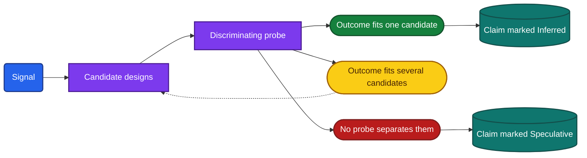
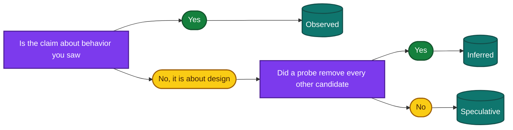

> **The question.** How do you turn an observation into a design claim, and how sure can you be?

## 5.1 An observation is not a design

A probe gives you a signal: a behavior you saw. A teardown is made of design claims: statements about components and rules you cannot see. The step between the two is an inference, and it is where teardowns go wrong.

The difficulty is that behavior does not map one to one onto design. [Chapter 1](/part-1-method/1-reading-apps-from-the-outside/) makes the case that visible behavior reveals design. This chapter deals with the limit of that claim: several designs often produce the same behavior. A list that appears at once on launch can come from a cache on the device, from a process that never died, from a background refresh that ran an hour ago, or from a very fast network. Four designs, one signal.

An engineer's instinct makes this worse. You have built systems, so the first explanation that comes to mind is the way you would have built it. That explanation arrives with a feeling of certainty that it has not earned.

The method replaces the instinct with a fixed sequence of four steps, and with a vocabulary of three words that keeps the strength of each claim visible.

## 5.2 The inference chain

The inference chain has four steps: signal, then candidate designs, then a discriminating probe, then a claim with a confidence word.



*Figure 5.1. The inference chain. A probe that leaves several candidates standing sends you back to the list with fewer candidates.*

**Signal.** State what you saw, with its conditions, in words that contain no design. "The feed appeared at once after a force-quit, on a good connection" is a signal. "The feed is cached" is already a claim.

**Candidate designs.** List every design that would produce the signal. The list comes before any judgment about which is likely.

**Discriminating probe.** Find a probe for which the candidates predict different outcomes, and run it. One probe often removes one candidate and leaves the rest, so this step repeats.

**Claim with a confidence word.** State the design that survives and mark it Observed, Inferred or Speculative. The word is part of the claim and is never left off.

The chain is short enough to run in your head for a small question and strict enough to write out for a claim that matters. Sections 5.3 to 5.6 take the steps one at a time. Sections 5.7 and 5.8 run the whole chain twice.

## 5.3 Stating the signal

A signal is useful in proportion to how exactly it is stated. Three details turn a vague impression into something you can reason from.

**The conditions.** Network state, whether the process was alive, which device, which account, how long since the last use. "Content appeared offline" means little. "Content appeared in airplane mode after a force-quit, on a screen visited ten minutes earlier" excludes several designs on its own.

**The timing.** Many designs differ only in when something happens. Note whether a change appeared before or after a spinner, within one second or after five, while you watched or only when you returned. A count of seconds is enough. You do not need instruments.

**The small details.** A pending indicator, a timestamp that shifts, an item that moves in a list, a brief flash of older content, a message such as "last updated" or "connecting". These are often the only visible trace of a mechanism, and they are easy to miss because they are not the content.

Keep design words out of the signal. If your note says "the outbox drained when the network returned", you have recorded a conclusion and lost the observation it was based on. Write "the clock icon on the message turned into a check mark about two seconds after airplane mode was turned off". The design reading can be revised later. The observation cannot be recovered.

## 5.4 Listing the candidate designs

The second step is the one most often skipped, and it is the one that makes the method work. Before choosing an explanation, write down every design that would produce the signal.

Three questions generate most candidates. Each walks one axis of the universal app model in [Chapter 3](/part-1-method/3-the-universal-app-model/).

1. **Where could the data have come from?** Memory in a live process, the local store, a cache, the backend just now, the app's own bundle, another app or the operating system.
2. **Who could have started the action?** The user's gesture, the UI coming to the foreground, a timer, a background worker, a push hint, a persistent connection.
3. **Where could the rule have been applied?** In domain logic on the client, in the backend's services, or in both.

Take the signal "a new item appeared in the list without a refresh". The second question produces the candidates directly: a persistent connection delivered it, a timer polled for it, a push hint triggered a pull, or the screen refetched when it regained focus.

Part II does much of this work for you. Each concern chapter lays out the design space for its concern, and its signal-to-design table lists the designs behind each common signal. The site's lookup page at [/lookup/](/lookup/) collects those tables. Use them as a checklist of candidates, not as an answer.

Two candidates belong on almost every list and are easy to forget. One is "the process was still alive", which explains a great deal of apparent persistence. The other is "it is a bug", covered in Section 5.9.

A list with one entry is a warning. Either the signal is unusually specific, or you have not thought long enough.

## 5.5 Finding the discriminating probe

A discriminating probe is one whose outcomes differ between the candidates. The way to find it is to write the candidates as rows and ask, for each probe you could run, what each row predicts.

| Candidate | Probe X | Probe Y |
|---|---|---|
| Design A | Outcome 1 | Outcome 1 |
| Design B | Outcome 1 | Outcome 2 |
| Design C | Outcome 2 | Outcome 2 |

Probe X separates C from the others. Probe Y separates A from the others. Together they identify one design. Neither alone does.

A column in which every row holds the same outcome is a probe that cannot help, whatever it shows. That is worth knowing before you spend the time.

Good discriminating probes usually come from asking what one candidate needs that another does not. A cache needs storage, so a force-quit and airplane mode will separate it from memory. A rule based on client time needs the device clock, so a changed clock will separate it from a rule based on backend time. A persistent connection needs a live process in the foreground, so its updates stop the moment the app leaves the screen.

Some pairs of designs have no discriminating probe that a user can run. They differ only inside the backend or inside the client's code. The two families of fine-grained merge in [Chapter 12](/part-2-concerns/12-offline-and-sync/) are an example: both show live merging of concurrent edits, and nothing visible separates them. When you reach such a pair, the chain ends with both candidates named and the claim marked Speculative.

## 5.6 Stating the claim

The three confidence words have fixed meanings.

| Word | Meaning | It applies to |
|---|---|---|
| **Observed** | Seen directly in a probe. A fact about behavior. | What the app did |
| **Inferred** | The design that best explains the observations, with the alternatives ruled out by a probe. | A design, after discrimination |
| **Speculative** | Consistent with the observations, but at least one other design fits equally well. | A design, before or without discrimination |

Observed is the only word that applies to behavior. "An edit made offline is still visible after a force-quit" is Observed. Nothing about a hidden component is ever Observed, because you did not see the component.

Inferred has a condition attached: a probe ruled the alternatives out. It is not a measure of how sure you feel. A claim is Inferred when you can name the other candidates and the outcome that removed each one.

Speculative means a named alternative still stands. It is a respectable result. A teardown that says "persistent connection or a short polling interval, not separated" is more useful than one that asserts the first and is wrong.

Figure 5.2 gives the test for choosing the word.



*Figure 5.2. Choosing the confidence word for a claim.*

A claim has a standard written form: the feature, the design, the word, and the evidence.

```text
Feature:   Note editor
Claim:     Edits are written to a durable outbox before they are sent.
Word:      Inferred
Evidence:  Edit made in airplane mode was present after a force-quit,
           and reached a second device after reconnecting.
Ruled out: Optimistic state held in memory only.
```

The "ruled out" line is what makes the word checkable. If you cannot fill it in, the word is Speculative.

## 5.7 Worked example: the feed that is there at once

**Signal.** You open a news-style app and its feed is on screen with no visible loading. About a second later the list jumps and newer items appear at the top. You saw this on a good wireless connection, opening the app from its icon, a few hours after the last use.

**Candidate designs.** Asking where the first content could have come from gives four.

- **A. Warm start.** The process was still alive, and the list was in memory.
- **B. Cache with stale-while-revalidate.** The client stored the last response, showed it on a cold start, and refreshed it.
- **C. Background refresh.** A background worker fetched the feed before you opened the app, so the stored content was already recent.
- **D. Fast network.** Nothing was stored. The first request simply returned before you noticed, and the jump was a second page or a reorder.

**Discriminating probes.** Write what each candidate predicts.

| Candidate | Force-quit, then open online | Force-quit, then open in airplane mode | Content shown first is |
|---|---|---|---|
| A. Warm start | Loading state | Error or empty | Not applicable |
| B. Cache | Content at once | Content at once | What you last saw |
| C. Background refresh | Content at once | Content at once | Newer than what you last saw |
| D. Fast network | Content at once, or a brief loading state | Error or empty | Current |

The first column removes A if content still appears at once after a force-quit. It does not separate B, C and D. The second column separates D from B and C, because D has nothing to show without a network. The third column separates B from C.

You run them. After a force-quit the feed still appears at once. In airplane mode after a force-quit it appears again, with a small "offline" label. A and D are out.

For the third column you need to know what you last saw. You note the top three items, leave the app in the background for two hours with the network on, then turn on airplane mode before opening it. The top three items are the same ones. You repeat it the next morning and get the same result.

**Claim.** The feed is served from a cache on the device with stale-while-revalidate: Inferred. Warm start and a fast network were ruled out by the cold start in airplane mode.

The claim about background refresh needs care. You did not see newer content in two attempts. That is an absence, and absence is weak evidence: the operating system decides when a background worker runs, and it may not have run. The claim is "no background refresh of the feed was seen in two attempts", which is Observed. The design claim "the app does not refresh the feed in the background" is Speculative.

One more claim comes free. The jump one second after launch is Observed. The design behind it, that fresh results replace the cached list in place instead of being offered through a "new items" control, is Inferred from the same observation, and [Chapter 15](/part-2-concerns/15-lists-feeds-and-pagination/) discusses the choice.

## 5.8 Worked example: the edit that crosses devices

**Signal.** You rename an item on your phone. A tablet signed in to the same account, with the app open on the same screen, shows the new name about two seconds later. You did not touch the tablet.

**Candidate designs.** Asking who could have started the update on the tablet gives four.

- **A. Persistent connection.** The tablet holds a connection open, and the backend sends the change down it.
- **B. Polling.** The tablet asks the backend for changes on a timer.
- **C. Push hint.** The backend sends a push hint through the platform's push channel, and the tablet pulls.
- **D. Local transfer.** The two devices exchanged the change directly, over a local network.

**Discriminating probes.**

| Candidate | Delay over ten trials | Tablet on a different network | Notification permission denied on the tablet |
|---|---|---|---|
| A. Persistent connection | Short and steady | Still updates | Still updates |
| B. Polling | Varies from zero up to the interval | Still updates | Still updates |
| C. Push hint | Short, with occasional long delays | Still updates | May still update |
| D. Local transfer | Short and steady | Stops updating | Still updates |

The second column is cheap and decisive for D. You move the tablet to mobile data while the phone stays on wireless. The rename still arrives. D is out.

The first column separates polling from the rest. A client that polls every ten seconds delivers a change after anything from zero to ten seconds, depending on where in the cycle the change lands. You make ten renames at irregular moments and time each one. Every delay is between one and three seconds. Polling at an interval longer than about three seconds is out. Polling every two seconds would fit the timings, and you cannot exclude it from outside. It would be an expensive choice, and the cost is a reason to think it unlikely, not a probe result.

The third column is weaker than it looks. Denying the notification permission stops visible notifications, and on some platforms a push hint can still be delivered without one. The cell says "may", so the probe cannot separate A from C. This is the kind of column to recognize before running it.

One further observation helps. While the tablet is on screen, a small "connecting" label appears for a moment after you turn its network off and on. A label of that kind describes a connection the app is managing.

**Claim.** Three claims come out, with three different words.

- A change made on one device reaches a second device in the foreground within three seconds, untouched: Observed.
- The update is delivered through the backend and not directly between devices: Inferred. The different-network probe ruled out local transfer.
- The delivery path is a persistent connection: Speculative. A very short polling interval and a push hint both fit the timings. The "connecting" label favors a persistent connection and does not rule the others out.

A single signal produced claims at all three levels. That is normal. A teardown that reports the third claim as Inferred has overstated what was learned. [Chapter 14](/part-2-concerns/14-real-time-delivery/) has further probes for this question.

## 5.9 The rules

Seven rules govern every inference in this book.

### List every candidate design before choosing

The first explanation you think of is drawn from your own experience, and it blocks the others once you accept it. Write the list first. Section 5.4 gives the questions that generate it. The list is also what makes a later Inferred claim honest, because the word requires that alternatives were ruled out, and you can only rule out what you named.

### Find the probe whose outcomes differ between candidates

Evidence that every candidate predicts is not evidence for any of them. Before running a probe, write the prediction of each candidate. If the predictions match, choose another probe. This rule saves time as well as error: it stops you from collecting confirmations that confirm nothing.

### Absence of evidence is weak evidence

A probe that shows a behavior proves the behavior exists. A probe that fails to show it proves much less. You may not have triggered the condition, the operating system may have declined to run the work, or the feature may be turned off for your account by a feature flag.

The duplicate test in [Chapter 12](/part-2-concerns/12-offline-and-sync/) is the standard case. One duplicate item after a weak connection shows that retries are not idempotent. No duplicates after twenty attempts shows little, because the failure needs a lost response and you cannot cause one on demand.

State an absence as what it is: "not seen in N attempts under these conditions". The design claim built on it is Speculative unless something else supports it.

### Assign designs per feature, not per app

An app is many features built at different times by different people under different pressures. One app commonly has a chat screen backed by a local replica, a profile screen that is a plain cached read, and a payment screen that is online only. Each result belongs to the feature it was measured on.

The rule applies to every concern, not only to offline behavior. An app can be server-driven on its home screen and fixed on its settings screen, live on one list and pull-to-refresh on another. Name the feature in every claim.

### Bugs are evidence

A bug is behavior the team did not intend, which means nobody arranged for it to hide the mechanism. A duplicated item points to a retry without an idempotency key. A deleted item that comes back points to a replica that missed a tombstone. A screen that shows another screen's stale value points to two copies of one piece of data. The failure-mode sections of the Part II chapters list what each common bug reveals.

Two cautions apply. A bug seen once may be a one-off, so try to reproduce it. And a bug shows what is missing in one code path, which may not be the path the rest of the feature uses.

### A published statement from the maker beats inference

When the app's maker has published how something works, that statement outranks anything you can infer. Sources include engineering articles, conference talks, public documentation, help pages, the store listing and open-source code released by the maker.

Use published statements with three conditions. Cite the publication, so that the claim can be checked. Note its date, because apps are rewritten and a description from five years ago may describe a system that no longer exists. And check that it covers the feature you are examining, since a statement about one feature says nothing about another.

A published statement that your probes contradict is an interesting finding. Record both. Do not invent or half remember a source. If you cannot name the publication, the claim rests on your inference alone and takes the word your probes earned.

### Always record the confidence word

A claim without its word will be read as fact, by other people and by you a week later. Record the word at the moment you write the claim, when you still know which alternatives stand. The worksheet has the word next to each finding for this reason.

## 5.10 Common reasoning mistakes

**Stopping at the first explanation.** You see a pending indicator and write "outbox". The indicator is Observed. An outbox is one of two candidates, and the other is optimistic state held in memory. A force-quit separates them in thirty seconds. This mistake is common because the first explanation is often right, which teaches you to trust it in the cases where it is wrong.

**Generalizing one feature to the app.** You find that the message list works offline and write "the app is offline-first". The next reader assumes the same of search, settings and media, none of which you tested. Write "the message list" and leave the app unsummarized until its main features have each been probed.

**Treating Speculative as Inferred.** This happens gradually. A claim is written with "probably", is repeated in a summary without it, and becomes the basis for the next inference. The backend sketch is the usual victim: a Speculative persistent connection turns into a confident box in a diagram, and then into a claim about the backend's fan-out. A claim built on another claim can be no stronger than the weaker of the two.

**Confirming instead of discriminating.** After forming a view you run probes that agree with it. Each agreement feels like progress. If the rival designs predicted the same outcomes, your confidence should not have moved.

**Reading the platform as the app.** Some behavior belongs to the operating system: how a system share sheet looks, how long background work is allowed, what happens to every app in low-power mode. Run the same probe on an unrelated app. Behavior that both share tells you about the platform.

**Reading your own conditions as the design.** An account in an experiment group, a region with different rules, an old device with little memory and a beta version can each change behavior. When a result is surprising, repeat it on a second account or device before building on it.

**Mistaking polish for architecture.** A smooth animation, a skeleton screen or an instant response says the team cares about perceived speed. It does not say where the data came from.

## 5.11 When to stop

A teardown has no natural end, because every claim can be tested further. Four conditions tell you to stop working on a question.

1. **The claim is Inferred.** The alternatives you listed are ruled out. More probes would add comfort and no information.
2. **No remaining probe discriminates.** The candidates that are left predict the same outcome for everything a user can do. Mark the claim Speculative, name the candidates, and move on.
3. **The remaining probe costs more than the answer is worth.** A probe that needs six weeks, a third device or a risk to real data is justified only when the question is central to the teardown. Otherwise record it as an open question with the probe that would settle it.
4. **The answer would not change the picture.** If both remaining candidates imply the same backend and the same trade-offs, the difference between them is a detail.

Stopping at Speculative is a result, not a failure. The open questions section of the worksheet exists to hold these, each with its candidates and the probe or publication that would resolve it.

## 5.12 In practice

During a teardown, apply the chain at two speeds.

For the routine probes in Part II, the chain has been run for you. Each probe lists its outcomes, and each outcome carries a reading and a word. Your part is to state the signal exactly, choose the outcome that matches, and notice when none does.

For anything else, including a surprise, a result that fits no listed outcome, or a feature no chapter covers, run the chain by hand:

1. Write the signal with its conditions, in words that contain no design.
2. Write every candidate design, using the three questions of Section 5.4.
3. Build the small table of candidates against probes, and pick the probe whose column differs.
4. Run it, cross out what it removes, and repeat until one candidate is left or no probe separates the rest.
5. Write the claim with its word, its evidence and what was ruled out.

Keep the raw observations in your notes even after the claim is written. When a later probe contradicts a claim, you will need to go back to what you saw.

## 5.13 Summary

- A signal is a behavior. A claim is about design. Several designs usually produce the same signal, so the step between them needs a method.
- The inference chain is signal, then candidate designs, then a discriminating probe, then a claim with a confidence word.
- State the signal with its conditions, timing and small details, and keep design words out of it.
- List every candidate design before choosing. A discriminating probe is one for which the candidates predict different outcomes.
- Observed applies only to behavior. Inferred requires that a probe ruled out the named alternatives. Speculative means at least one alternative still stands.
- Absence of evidence is weak evidence, designs are assigned per feature, bugs are evidence, and a published statement from the maker beats inference.
- The common mistakes are stopping at the first explanation, generalizing one feature to the app, and letting a Speculative claim harden into an Inferred one.
- Stop when the claim is Inferred, when nothing discriminates, or when the next probe costs more than the answer is worth. Record what remains as an open question.
