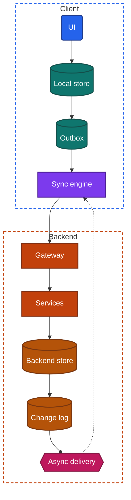

import TeardownBar from '../../../components/TeardownBar.astro';
import WorksheetForm from '../../../components/WorksheetForm.astro';

> **The question.** What does a finished teardown look like, and in what order do you fill it in?

## 6.1 What a finished teardown is

A teardown is both the process of working out an app's design from its behavior and the written result of that process. This chapter is about the written result and the order of work that produces it.

A finished teardown answers five questions about one app.

1. What was examined: which app, which version, which features, under which conditions.
2. Which components of the universal app model the app has.
3. Which design each feature uses for each concern that matters to it, with a confidence word.
4. What backend those client designs imply.
5. What remains unknown, and what would settle it.

The worksheet is the standard form these answers are recorded in. It exists for three reasons.

It makes teardowns comparable. Two teardowns of two messaging apps, recorded in the same fields, can be read side by side. Free-form notes cannot.

It keeps the confidence words attached. A field that holds a finding also holds its word, so the difference between what you saw and what you concluded survives into the summary.

It shows the gaps. An empty field is a visible question. In free-form notes, the things you never tested simply do not appear, and the result looks more complete than it is.

A teardown is also a record of a moment. Apps change with every release, and sometimes between releases through remote config. The version and the date are part of every finding.

## 6.2 The steps in order

A full teardown has six steps. Figure 6.1 shows them.

```mermaid
flowchart LR
  A[Identify the app and its features] --> B[Sketch it against the universal app model]
  B --> C[Run the first-pass probes]
  C --> D[Go concern by concern through Part II]
  D --> E[Sketch the backend each client design implies]
  E --> F[List open questions]
  D -.-> B

  classDef actor fill:#334155,stroke:#0F172A,color:#FFFFFF,stroke-width:2px
  classDef ui fill:#2563EB,stroke:#1E3A8A,color:#FFFFFF,stroke-width:2px
  classDef logic fill:#7C3AED,stroke:#4C1D95,color:#FFFFFF,stroke-width:2px
  classDef store fill:#0F766E,stroke:#134E4A,color:#FFFFFF,stroke-width:2px
  classDef service fill:#C2410C,stroke:#7C2D12,color:#FFFFFF,stroke-width:2px
  classDef data fill:#B45309,stroke:#78350F,color:#FFFFFF,stroke-width:2px
  classDef async fill:#BE185D,stroke:#831843,color:#FFFFFF,stroke-width:2px
  classDef external fill:#64748B,stroke:#334155,color:#FFFFFF,stroke-width:2px
  classDef ok fill:#15803D,stroke:#14532D,color:#FFFFFF,stroke-width:2px
  classDef fail fill:#B91C1C,stroke:#7F1D1D,color:#FFFFFF,stroke-width:2px
  classDef wait fill:#FACC15,stroke:#A16207,color:#422006,stroke-width:2px

  class A,B,C,D,E,F logic
```



*Figure 6.1. The six steps of a full teardown. Findings from the concern chapters correct the first sketch.*

The order follows the rule of [Chapter 4](/part-1-method/4-probes/): passive and cheap work first. Steps 1 and 2 need no probes at all. Step 3 takes about twenty minutes. Step 4 is where most of the time goes, and steps 1 to 3 decide how to spend it. Steps 5 and 6 are reasoning and writing, done away from the device.

The dotted arrow matters. The sketch in step 2 is a guess, and step 4 corrects it. Expect to redraw it at least once.

## 6.3 Step 1: identify the app and its features

Record what you are examining before you examine it.

**The app.** Its name, its store category, the version you are testing and the date. Take the version from the store listing or the app's own settings screen. Record each device and platform you test on, because an app's two platform versions are often separate codebases with different designs.

**The conditions.** The account you use, and anything about it that could change behavior: a paid plan, a region, a very old or very new account, membership of a beta program. A surprising finding often traces back to one of these.

**The archetype guess.** Name the Part III archetype the app most resembles. An archetype is a generic app type defined by its dominant concerns, so the guess tells you which concerns to expect. It is a guess. Many apps combine two archetypes, such as a marketplace with messaging inside it, and some fit none.

**The features.** List the app's main features as a user would name them: the feed, the composer, search, the profile, checkout. Then choose the ones in scope. This is the most important decision in the step, because every design in this book is assigned per feature and not per app. A teardown of three features done properly is worth more than a teardown of twelve done loosely.

Choose features by two tests. Pick the feature the app exists for, since that is where the team spent its design effort. And pick one feature that looks ordinary, since the contrast between the two shows what the team treated as special.

Write down the features you leave out as well. A reader should be able to tell "not examined" from "examined, nothing found".

## 6.4 Step 2: sketch it against the universal app model

[Chapter 3](/part-1-method/3-the-universal-app-model/) defines the parts any app and its backend can have. Every app is a subset of that model, and a teardown states which components an app has. Do this once before probing, as a prediction, using only what normal use and the store listing show.

Go through the two lists and mark each component as present, absent or unknown.

| Client component | A sign that it is present, from normal use |
|---|---|
| UI | Always present |
| Screen state | Always present |
| Domain logic | Rules the app applies without waiting, such as validation or totals |
| Data layer | Always present in some form |
| Local store | Content that is there when you open the app |
| Network client | Any content that comes from elsewhere |
| Sync engine | Changes that travel between your devices without a refresh |
| Background workers | Uploads, downloads or updates that continue after you leave |
| Platform services | Permission prompts, notifications, payments, location |

| Backend component | A sign that it is present, from normal use |
|---|---|
| Gateway | A sign-in, or any content from the backend |
| Services | Distinct areas of function, such as search, payments or messaging |
| Backend store | Your content returns on another device |
| Change log | A device that was away catches up quickly |
| Async delivery | Notifications, or updates that arrive while you watch |
| Media delivery | Images, audio or video |
| Third parties | Sign-in with another provider, payments, maps, ads, support chat |

Most marks will be "unknown" at this stage. That is the point. The unknowns are the list of things the probes have to settle, and each one maps to a Part II chapter.

Keep the sketch small: the components you believe are present, and the paths between them. It is a hypothesis to correct, not a deliverable.

## 6.5 Step 3: run the first-pass probes

[Chapter 4](/part-1-method/4-probes/) defines six first-pass probes that work on any app: the footprint survey, launch in airplane mode, force-quit and reopen, long background and return, second device, and fresh install. Run them on the main feature you chose in step 1.

They do two jobs. They turn several "unknown" marks from step 2 into findings, particularly for the local store, the sync engine, the backend store and async delivery. And they route you: the combination of outcomes says which concern chapters will repay the time.

Run the footprint survey first, before any active probe disturbs the figures. Leave the fresh install until the end of the whole teardown, or run it on a spare device, because it removes the state every other probe depends on.

If you have a spare device, sign in on it now and set it aside. Several probes in Part II need a device that has been away for a long time, and the waiting costs nothing if it starts on the first day.

## 6.6 Step 4: go concern by concern through Part II

Part II has one chapter per concern. Each chapter gives the design space, the probes, a signal-to-design table and a set of worksheet fields. For each feature in scope, work through the chapters that apply.

You do not read all of Part II for every app. Choose chapters from three sources.

- **The first-pass outcomes.** Content and writes that work in airplane mode send you to [Chapter 12](/part-2-concerns/12-offline-and-sync/). A second device that updates untouched sends you to [Chapter 14](/part-2-concerns/14-real-time-delivery/).
- **The archetype.** Each Part III chapter names the concerns that dominate its archetype. A messaging app is dominated by sync, real-time delivery, media and security, as [Chapter 39](/part-3-archetypes/39-messaging/) shows.
- **The feature itself.** A feature with a long list needs [Chapter 15](/part-2-concerns/15-lists-feeds-and-pagination/) whatever the app is.

Within a chapter, follow its probe order. The early probes are cheap and decide whether the later ones apply. Select the outcome you saw in each probe, and the worksheet fields fill as you go.

Three habits keep this step honest.

**One feature at a time.** Finish a concern for one feature before starting it for another. Results from two features blur together quickly, and the blur produces claims about "the app".

**Record the outcome that matches, or none.** If what you saw fits no listed outcome, do not pick the nearest. Write what you saw in the notes field and run the inference chain of [Chapter 5](/part-1-method/5-from-signal-to-inference/) by hand.

**Return to the sketch.** When a concern chapter settles a component, update step 2. If [Chapter 11](/part-2-concerns/11-local-storage-caching-and-prefetching/) shows a cache where you predicted none, the sketch changes, and so may your choice of chapters.

A useful order for the client-side chapters is launch first, then storage, then offline behavior, then delivery: [Chapter 7](/part-2-concerns/7-launch-and-startup/), [Chapter 11](/part-2-concerns/11-local-storage-caching-and-prefetching/), [Chapter 12](/part-2-concerns/12-offline-and-sync/), [Chapter 14](/part-2-concerns/14-real-time-delivery/). Each one uses findings from the one before it. [Chapter 8](/part-2-concerns/8-navigation-deep-links-and-screen-state/), [Chapter 9](/part-2-concerns/9-state-and-ui-data-flow/), [Chapter 10](/part-2-concerns/10-api-shape/) and [Chapter 13](/part-2-concerns/13-network-transport-and-resilience/) can be taken in any order after that.

## 6.7 Step 5: sketch the backend each client design implies

You cannot probe the backend directly. You can reason about it, because a client design only works when the backend supplies certain things. Each Part II chapter has a section called "The backend this implies" that states what those things are.

Collect the implications into one sketch, using the backend components of the universal app model. For each component, write what you concluded and which client finding it rests on.

| Client finding | Backend component it implies |
|---|---|
| Content returns on a new device after sign-in | A backend store that holds the user's content |
| A device that was away for a week catches up in a moment | A change log read by cursor |
| A retried create never duplicates | Services that accept an idempotency key or a client-generated identifier |
| A second device updates while you watch | Async delivery to clients in the foreground |
| A notification arrives after a force-quit | Async delivery through the platform's push channel |
| Images load at a size that fits the screen | Media delivery that serves several sizes |
| A payment sheet from another company appears | A third party, and a service that confirms the result with it |

Two rules apply to this step.

**A backend claim inherits the word of its weakest client finding.** If the persistent connection is Speculative, so is the fan-out component you draw behind it. The backend sketch is the place where a Speculative claim most easily hardens into a confident box, as [Chapter 5](/part-1-method/5-from-signal-to-inference/) warns.

**Sketch only what is implied.** The client tells you that a change log exists. It does not tell you which database holds it, how the backend is split into services or how many regions it runs in. Leave those out, or mark them Speculative and say what they rest on. A backend sketch with ten boxes and two findings behind it is fiction.

## 6.8 Step 6: list open questions

The last step records what the teardown did not settle. Each open question has three parts: the question, the candidate designs still standing, and the probe or publication that would resolve it.

```text
Question:    How does a change reach a second device in the foreground?
Candidates:  Persistent connection, or polling every two seconds or less.
Would settle: A statement from the maker, or the reconnect probes of Chapter 14.
```

Open questions come from four places: claims that ended Speculative, probes you skipped because of cost or risk, features you left out of scope, and results that contradicted each other.

This section is what makes a teardown trustworthy. A reader who sees no open questions should assume the author did not look for them. It is also where a later version of the teardown begins.

## 6.9 A quick teardown and a full teardown

Not every teardown needs every step at full depth. Two sizes cover most uses.

| | Quick teardown | Full teardown |
|---|---|---|
| Time | About 30 minutes | Several hours of work, spread over days or weeks |
| Features | One, the main one | Three to five |
| Model sketch | Marks on the two component lists | A drawn sketch, revised after step 4 |
| Probes | First-pass probes only, without the long wait | First-pass probes, then the probes of each relevant chapter |
| Concern chapters | None worked through. Two or three named as the next to read | Each relevant chapter, per feature |
| Devices | One, and a second if it is at hand | Two, plus a spare for long-absence probes |
| Backend sketch | Three or four lines | A sketch with each component tied to a finding |
| Typical confidence | Mostly Observed and Speculative | Inferred for the dominant concerns |
| Output | Half a page | A complete worksheet and a written summary |

A quick teardown has a fixed budget.

| Minutes | Activity |
|---|---|
| 0 to 5 | Step 1. Name, version, archetype guess, one feature |
| 5 to 10 | Step 2. Mark the component lists. Run the footprint survey |
| 10 to 22 | Step 3. Airplane mode launch, force-quit, second device |
| 22 to 27 | Step 5. Three or four lines on the backend |
| 27 to 30 | Step 6. Open questions and the chapters to read next |

The quick teardown is the right size for a first look, for choosing which of several apps deserves a full teardown, and for practice. Its findings are thin by design: you will have several Observed behaviors, a few Speculative designs and very little that is Inferred, because discrimination takes time. Do not present a quick teardown as more than that.

The full teardown is the right size when you intend to learn from the app's design or compare it with another. Its calendar time is long because some probes wait on the clock. Its working time is a few hours.

A quick teardown is also the first half hour of a full one. Nothing is repeated.

## 6.10 How the site's worksheet works

The site provides the worksheet as a form, at [/worksheet/](/worksheet/).

**One named teardown per app or feature.** You create a teardown and give it a name, such as the app's name, or the app and one feature when you are recording features separately. You can keep several teardowns and switch between them. The bar that appears before the probes in each chapter shows which teardown you are recording to. Check it before selecting outcomes, so that findings from one app do not land in another's worksheet.

**Probe outcomes fill fields.** Each probe in a chapter lists its outcomes. When you select the outcome you saw, the worksheet fields tied to that outcome are filled in for the current teardown. You do not copy results by hand. Fields that no probe fills, such as free-text notes, are completed in the form at the end of each chapter or on the worksheet page.

**Fields are grouped by chapter.** This chapter adds the general fields in Section 6.13. [Chapter 4](/part-1-method/4-probes/) adds the first-pass fields. Each Part II chapter adds the fields for its concern. The worksheet page shows them together.

**Everything is stored in the browser only.** Your teardowns are kept in the storage of the browser you are using. Nothing is sent to a backend, and there is no account. This has consequences you should plan for. A teardown made in one browser does not appear in another browser or on another device. Clearing the browser's site data removes your teardowns. A private browsing window may discard them when it closes.

**Export as Markdown.** The worksheet exports a teardown as a Markdown document. Export when you finish a session, and keep the file somewhere durable. The export is also the starting point for the written summary in Section 6.11.

Because designs belong to features, decide early how to name your teardowns. For a quick teardown, one teardown per app is enough. For a full one, a teardown per feature keeps the concern fields from overwriting each other, with the general fields of this chapter repeated or kept in the first one.

## 6.11 Writing up findings with confidence words

The worksheet holds the findings. The write-up makes them readable. It follows five conventions.

**Lead with scope.** App, version, date, devices and features come first. A finding without them cannot be checked.

**Organize by feature, then by concern.** The reader's first question is "how does this feature work", and the answer draws on several concerns at once.

**Every design claim carries its word.** Put the word where the claim is, in the same sentence. "The note list reads from a local store (Inferred)" is the form. Do not gather the words into a separate section, and do not replace them with softer language. "Probably", "seems to" and "likely" have no fixed meaning. The three words do.

**State the evidence, briefly.** One clause is enough: the probe and what it showed. For an Inferred claim, also name what was ruled out. This is the difference between an assertion and a finding.

**Separate behavior from design.** Write the Observed behavior first and the design reading after it. A reader who disagrees with your reading can still use your observation.

Compare two versions of one finding.

```text
Weak:   The app uses an outbox for offline edits and syncs over a socket.

Better: Note editor. An edit made in airplane mode was still present after
        a force-quit and reached a second device after reconnecting
        (Observed). Edits are held in a durable outbox (Inferred, in-memory
        optimistic state ruled out by the force-quit). Delivery to the second
        device took one to three seconds in ten trials (Observed). The path
        is a persistent connection or very frequent polling (Speculative,
        not separated).
```

The second version is longer and every part of it can be checked. It also shows a reader where the teardown is strong and where it is not.

When a claim rests on something the maker published, say so and name the publication and its date. A published statement outranks inference, and the reader needs to know which kind of claim it is.

Do not name a real app's internal design on the strength of inference alone in anything you publish. Describe what you observed, mark your readings with their words, and leave the statement of fact to the maker.

## 6.12 A worked example: summary of a note-taking app

This is the summary of a full teardown of a generic note-taking app. The app is invented for the example, and it stands for the archetype of [Chapter 48](/part-3-archetypes/48-notes-documents-and-collaboration/).

**Scope.** A note-taking app, store category "Productivity". Version 4.2 tested on two phones and the web version, over two weeks. One paid personal account. Features in scope: the note list, the note editor, search. Left out: sharing, attachments, the home-screen widget.

**Model sketch.** Figure 6.2 shows the components the teardown found.



*Figure 6.2. The components found in the note-taking app. Media delivery and third parties were out of scope.*

**First-pass probes.** Stored data was large before any browsing, about four times the size of the app. Launch in airplane mode showed all notes and accepted an edit. A force-quit reopened the start screen with the draft intact. A second device updated untouched in about two seconds. A fresh install returned all notes after sign-in. All five are Observed.

**Note list.**

- Every note opens in airplane mode, including notes never opened on that device (Observed). The list reads from a local store that holds the whole account, a local replica (Inferred, a cache filled by visits ruled out by the unvisited notes).
- On a fresh install the newest notes appear first and the rest arrive over about a minute while the app is usable (Observed). First sync is staged, with a backfill of older notes (Inferred).
- A device left offline for twelve days caught up in under two seconds (Observed). The read path is a delta from a change log (Inferred, a full refetch ruled out by the speed against the account's size). The retention limit was not reached, so its length is unknown.

**Note editor.**

- An edit made in airplane mode survived a force-quit and reached the second device after reconnecting from a different screen (Observed). Edits go to a durable outbox drained by an app-level sync engine (Inferred).
- With two devices editing the same note offline, the device that reconnected last won in both orderings, and the other edit was lost without a message (Observed). Conflict resolution is last write wins by arrival (Inferred, client time ruled out by the reversed run).
- Edits to the title on one device and the body on the other both survived (Observed). The conflict unit is the field (Inferred). Two offline edits to the body did not merge, so the unit is no finer than the field (Inferred).
- No duplicate note appeared in fifteen creates on a weak connection (Observed). Creates carry an idempotency key or a client-generated identifier (Speculative, since a lost response could not be forced).

**Search.**

- Search returns results in airplane mode at the same speed as online (Observed). Search runs on the device against the local store (Inferred).
- Whether the backend also has a search service, for the web version, was not tested.

**Backend sketch.** A backend store holding every note per user (Inferred, from the fresh install). A change log per user with a cursor (Inferred, from the fast catch-up). A conflict rule applied on arrival at the field level (Inferred). Async delivery to clients in the foreground (Inferred), by persistent connection or short polling (Speculative). No backend search is required by the mobile client.

**Offline level.** The note list and editor are Level 3, local replica, in the terms of [Chapter 12](/part-2-concerns/12-offline-and-sync/). Not Level 4, since concurrent edits to one body do not merge.

**Open questions.**

1. Is delivery to a second device a persistent connection or polling? Would settle: the reconnect probes of [Chapter 14](/part-2-concerns/14-real-time-delivery/), or a statement from the maker.
2. How long are tombstones kept? Would settle: a spare device left offline for several months.
3. Are creates idempotent? No probe available to a user forces the failing case. Would settle: a statement from the maker.
4. Sharing, attachments and the widget were not examined.

The summary fits on a page. Most of its design claims are Inferred, two are Speculative, and each one sits next to the Observed behavior it rests on. A reader can see which is which without asking.

## 6.13 General worksheet fields

These are the general fields of the teardown worksheet. Fill them in at step 1, and return to the last four at steps 5 and 6. The fields added by other chapters appear on the worksheet page beside these.

<TeardownBar />

<WorksheetForm chapters={[6]} />

## 6.14 In practice

For your first teardown, do the quick version on an app you use every day.

1. Open [/worksheet/](/worksheet/), create a teardown and name it.
2. Fill in the app name, version, date, device and one feature.
3. Mark the component lists of Section 6.4 from memory, with "unknown" wherever you are unsure.
4. Go to [Chapter 4](/part-1-method/4-probes/) and run the first-pass probes, selecting outcomes as you go. Skip the long wait and the fresh install.
5. Write three or four lines of backend sketch, each tied to an outcome you selected.
6. Write the open questions, and name the two Part II chapters you would read next.
7. Export the teardown as Markdown.

Then choose whether the app deserves a full teardown. If it does, the quick one is already its first half hour. Add features to the scope, set a spare device aside, and start on the concern chapters in the order of Section 6.6.

Repeat a teardown when the app changes in a way you notice. Record it under a new name with the new version and date, and compare the two exports. A design that changed between versions tells you what the team found wrong with the earlier one.

## 6.15 Summary

- A finished teardown states what was examined, which components the app has, which design each feature uses with a confidence word, what backend that implies and what remains unknown.
- A full teardown has six steps: identify the app and its features, sketch it against the universal app model, run the first-pass probes, go concern by concern through Part II, sketch the backend each client design implies, and list open questions.
- Scope is set per feature. Choose the feature the app exists for and one ordinary feature, and record what you left out.
- A backend claim inherits the confidence word of the weakest client finding it rests on. Sketch only what the client implies.
- A quick teardown takes about 30 minutes, covers one feature with the first-pass probes and yields mostly Observed and Speculative findings. A full teardown takes several hours over days or weeks and reaches Inferred for the dominant concerns.
- The site's worksheet keeps one named teardown per app or feature. Selecting a probe outcome fills its fields. Everything is stored in the browser only, so export as Markdown.
- In a write-up, every design claim carries its word and its evidence in the same sentence, and Observed behavior is stated before the design reading.
- Open questions, each with its candidates and the probe or publication that would settle it, are part of the result.
