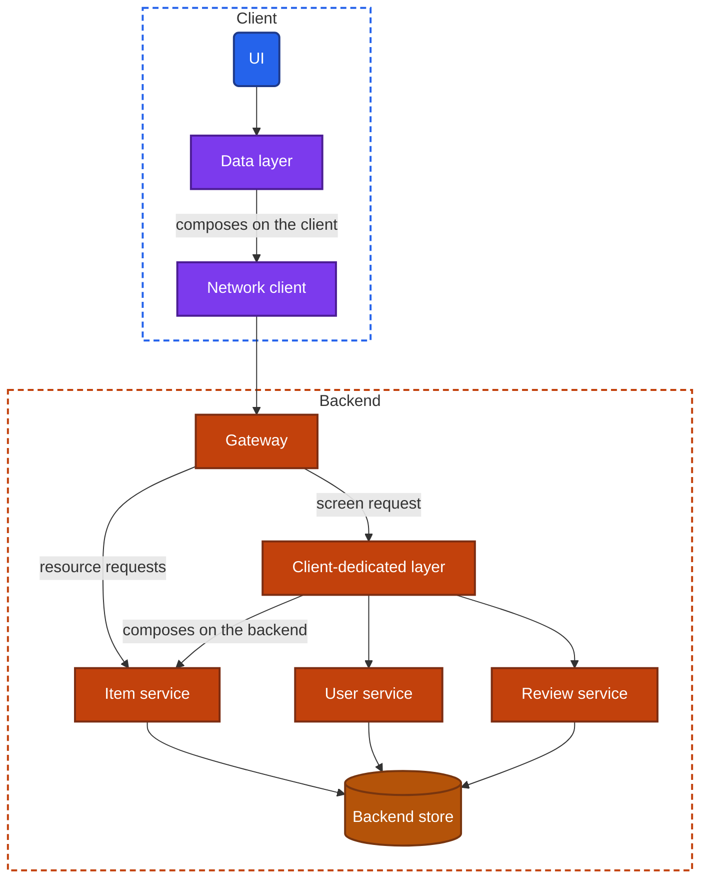
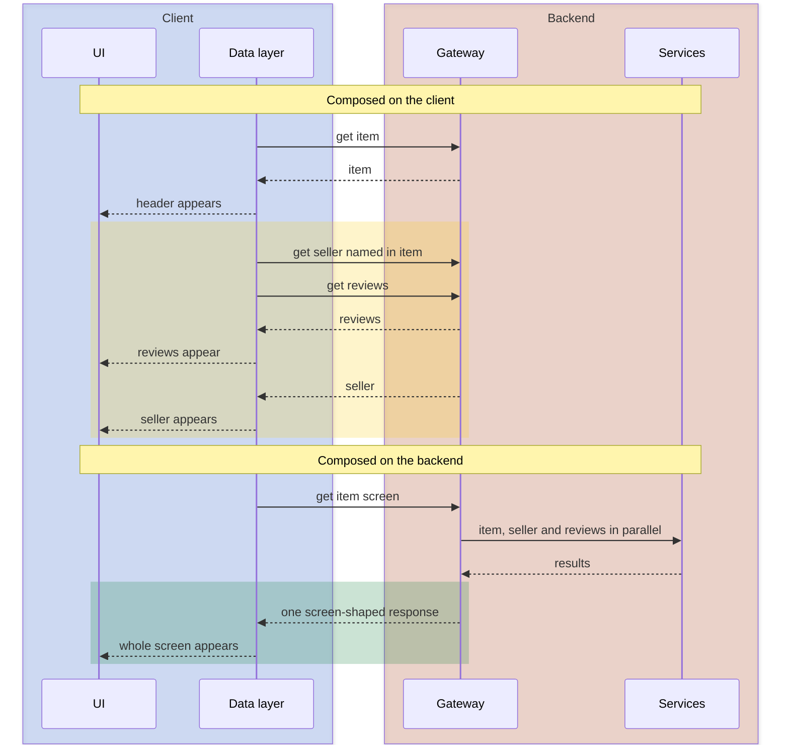
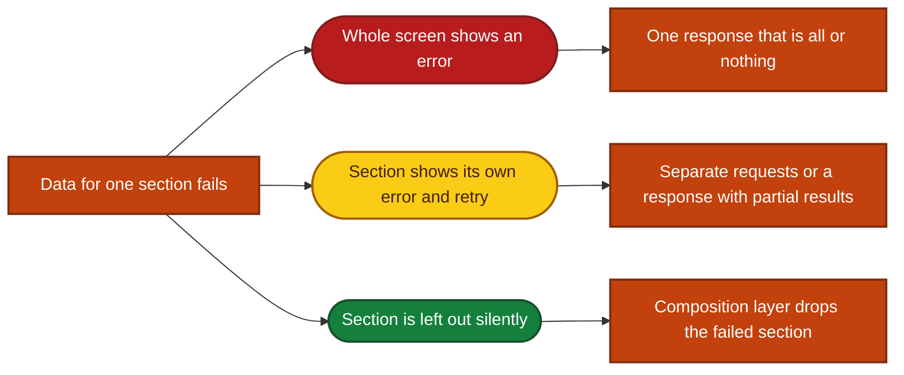

import Probe from '../../../components/Probe.astro';
import Signals from '../../../components/Signals.astro';
import TeardownBar from '../../../components/TeardownBar.astro';
import WorksheetForm from '../../../components/WorksheetForm.astro';

> **The question.** How was the interface between client and backend cut, and who decides what a screen receives?

## 10.1 Why this concern exists

A screen needs data from several places. An item screen in a marketplace shows the item, its seller, its reviews, a delivery estimate and a row of similar items. On the backend those usually belong to different services. Somewhere between the backend store and the UI, the pieces are gathered, joined, trimmed and formatted. The API shape is the decision about where that work happens and who controls it.

Four of the seven constraints from [Chapter 2](/part-1-method/2-the-mobile-constraint-set/) press on the decision.

- **Unreliable network.** Every round trip costs latency and can fail by itself. Five requests on a poor connection are five chances for a screen to end up incomplete. This pushes toward fewer, larger responses.
- **Limited resources.** Bytes cost mobile data, and parsing costs battery and time. A response that carries fields the screen never shows wastes all three. This pushes toward responses cut exactly to the screen.
- **Slow release.** A shipped client keeps calling the interface it was built against, for years. Every shape the backend has ever offered must keep working, or the old client breaks. This pushes logic toward the backend, where it can change without a release.
- **Untrusted client.** A rule enforced only on the client is not enforced. The backend must own every rule that matters, whatever the client also does.

These pull in different directions, and no shape satisfies all of them. A general interface serves many clients and makes each screen do more work. A screen-shaped interface makes the screen fast and simple and ties the backend to the client's layout.

One limit applies to the whole chapter. **You cannot see the wire format from outside.** No probe available to a user shows a request, a response body or a status code. What you can see is the order in which a screen fills, which parts fail together, what changes without an app update, and where two screens disagree. Those are consequences of the API shape, and several shapes produce the same consequences. Section 10.8 lists what remains Speculative.

## 10.2 The design space

### Four ways to cut the interface

**Resource-oriented endpoints.** The backend exposes its nouns: items, users, orders, reviews. Each has an address, and the client reads and writes them one kind at a time. The client composes a screen by fetching each resource it needs and joining them. The interface is general, cacheable per resource ([Chapter 11](/part-2-concerns/11-local-storage-caching-and-prefetching/)), and easy to offer to third parties. The client pays in round trips and in composition code that is written once per platform. Teams choose it when many kinds of client share one interface, or when the backend team and the client team are far apart.

**A query interface.** The backend publishes a typed graph of everything it can return, and the client sends a query naming the exact fields it needs, across as many kinds of data as it likes. One round trip returns exactly that. The client decides what a screen receives, and the backend learns precisely which fields each client version uses. The cost is a query layer the backend must run and protect, since a client can ask an expensive question, and caching that is harder than per-resource caching. Teams choose it when many screens need many different cuts of the same data and the client team wants to move without asking for new endpoints.

**Remote procedure calls.** The interface is a list of verbs: "place order", "mark as read", "start trip". Each call names an action and carries its arguments. This fits mutations well, because a mutation is an intent and not an edit to a record. Many apps use procedures for writes whatever they use for reads. An interface made only of procedures tends to grow one procedure per screen, which turns it into the next design.

**Screen-shaped responses.** A backend layer dedicated to the client, often called a backend for frontend, sits behind the gateway and offers one endpoint per screen or per section. It calls the services, joins the results, applies the rules, formats the strings, and returns what that screen will draw. The backend decides what a screen receives. The client does little more than render. This is the fastest shape for the user and the easiest to change without a release. The cost is a layer that must be changed whenever a screen changes, and that must keep serving the screens of every old client version.

### One step further

**Screen-describing responses.** If the backend already decides the content of each section, it can also decide which sections exist and in what order. The response is a list of typed sections, and the client holds a renderer for each type. This is server-driven UI. [Chapter 31](/part-2-concerns/31-server-driven-ui/) covers it in full. It appears here because it is the far end of the same axis: the more the response describes the screen, the less the client decides.

### Comparison

| Shape | Who composes the screen | Round trips per screen | Change without a release | What you can observe |
|---|---|---|---|---|
| Resource-oriented | Client | Several, some in sequence | New data needs client work | Sections arrive separately. Dependent parts arrive late |
| Query interface | Client states it, backend executes it | Usually one | New fields exist at once, but the client must ask for them | Screen arrives in one piece. Otherwise little |
| Remote procedure calls | Either | One per action | New actions need client work | Little for reads. Actions return complete results |
| Screen-shaped | Backend | One, or one per section | Content, text and rules can change | Screen arrives in one piece. Text and rules change between sessions |
| Screen-describing | Backend | One | Layout can change too | Sections appear, disappear and reorder with no update |

**Shapes belong to screens, not to apps.** A typical app has a screen-describing home screen, screen-shaped detail screens, procedures for writes and a resource-oriented settings area that nobody has touched in years. Record the shape per screen. Screens with different shapes inside one app are a signal in their own right: they often mark the border between teams or between eras of the codebase ([Chapter 38](/part-2-concerns/38-modularity-sdks-and-team-scale/)).

## 10.3 Anatomy

Figure 10.1 shows where composition can happen. The same services and the same backend store stand behind every shape. What differs is the component that joins their output.



*Figure 10.1. Two places to compose a screen: the data layer on the client, or a client-dedicated layer on the backend.*

The join is the same work in both places. Where it runs changes its cost. Between backend services, a call takes a few milliseconds on a reliable network. Between a phone and the gateway, a call takes a hundred milliseconds on a good day and several seconds on a bad one. A join that needs three calls is cheap on the backend and expensive on the client.

Dependencies make it worse. When the second request needs a value from the first response, the two cannot run in parallel. The client waits for one, then starts the other.

```text
// Composed on the client from resources
function loadItemScreen(itemId):
  item = await api.getItem(itemId)          // must finish first
  render(header(item))
  parallel:
    seller  = api.getUser(item.sellerId)    // needs a value from item
    reviews = api.getReviews(itemId)
    similar = api.getSimilar(itemId)
  render(each section as it arrives)

// Composed on the backend
function loadItemScreen(itemId):
  screen = await api.getItemScreen(itemId)  // one round trip
  render(screen)
```



*Figure 10.2. The same screen composed on the client and on the backend. The first fills in stages. The second arrives in one piece.*

The yellow phase in Figure 10.2 is what you look for. A screen composed on the client has a visible order: the part that everything else depends on comes first, and the rest follow in whatever order the network returns them. On a fast connection the stages blur together. On a slow one they separate by seconds, which is why Probe P10.2 repeats the observation on a weak connection.

## 10.4 Over-fetching, under-fetching and request count

Three costs describe how well an interface fits a screen.

**Over-fetching** is a response that carries more than the screen uses. A list row needs a title, a price and a thumbnail, and the resource endpoint returns forty fields per item. The cost is bytes, parse time and memory, multiplied by the length of the list. Over-fetching has almost no direct signature. It contributes to data use and to slow lists on weak connections, and both have many other causes. One indirect signature is useful: a detail screen that opens fully populated with no loading state, straight from a list. The list response already held every field the detail screen shows. That is an over-fetched list, or a prefetch, and [Chapter 11](/part-2-concerns/11-local-storage-caching-and-prefetching/) separates the two.

**Under-fetching** is a response that is not enough, so the client must ask again. The staged load in Figure 10.2 is under-fetching at screen level. At list level it becomes one extra request per row: the list returns identifiers and the client fetches each row's details. You see rows whose text is present while a name, a price or a count in each row fills in a moment later, row by row. Images always load separately and do not count as evidence here. Look at text.

**Request count** is the trade between many small requests and one large one. Neither end is free.

| | Many small requests | One large request |
|---|---|---|
| First content | Early. The fastest part shows first | Late. The slowest part holds back everything |
| Complete screen | Later, and less likely on a lossy network | Sooner in total |
| Failure | Parts fail on their own | The whole screen fails together, unless the response can carry partial results |
| Caching | Each part has its own lifetime | The whole response is as fresh as its most volatile part |
| Visual stability | Content shifts as parts arrive | One layout pass |

Teams that choose one large request often split it again on purpose: one request for the part of the screen visible first, and a second for everything further down. A screen that appears in exactly two steps, top then bottom, on every visit and every connection is this design. It is a deliberate cut, not a waterfall.

**Batching** sits between the two ends. The client keeps its small logical requests and sends several in one round trip. The gateway unpacks them, runs them and returns the results together. From outside, a batch looks like one large request. Sections that are logically separate arrive in the same instant. A second kind of batching applies to writes: the client collects rapid actions, such as a run of reactions or read receipts, and sends them as one call after a short pause. You may notice it as a short, constant delay before a second device sees a burst of changes, all at once.

## 10.5 Errors and partial failures

A composite screen can fail in part. How the interface expresses that decides what the user sees.

```text
// All or nothing
Response = Ok(screen) | Failed(status)

// Partial results
Response:
  data:   the fields that resolved, with gaps
  errors: list of (path to the gap, reason)
```

With separate requests, partial failure is natural. Each request succeeds or fails alone, and the client decides what to do with a screen that has three of its four parts. With one request, the backend must choose. It can fail the whole response, return what it has with a list of gaps, or leave the failing section out and say nothing.



*Figure 10.3. Three visible outcomes when one section of a screen fails, and the interface design behind each.*

The third outcome is the hardest to notice and the most telling. A home screen that has a recommendations row on one visit and none on the next, with no error and no gap, was composed by a layer that drops what it cannot fill. A client that composes its own screen knows which sections it asked for and tends to show a placeholder or an error where one is missing.

Errors on writes carry the same kind of evidence. Submit a form with a value the backend rejects, such as a name that is taken.

- A message beside the field, naming the reason, means the error response identifies the field and the reason in a structured form.
- A message with a specific reason in a general banner or dialog means the response carries text or a code, and nothing that ties it to a field.
- "Something went wrong" means the client received only success or failure, or did not map what it received.

The interface must also separate "rejected, do not retry" from "failed, try again". [Chapter 12](/part-2-concerns/12-offline-and-sync/) depends on that distinction for its outbox, and [Chapter 13](/part-2-concerns/13-network-transport-and-resilience/) for its retry policy. An app that offers a retry button for an action that can never succeed has an interface, or a client, that does not make it.

## 10.6 Versioning and how old clients keep working

Slow release makes an API a promise with no end date. Every client version still in use calls the interface as it was on the day that version shipped. Teams keep the promise in a few ways.

- **Explicit versions.** The client states a version with each request, and the backend keeps each version working. This is simple to reason about and expensive to maintain, since every version is a code path.
- **Additive change only.** The interface never removes or redefines a field. It only adds. Clients ignore what they do not recognize. This works as long as nobody needs to take anything away.
- **The client states what it needs.** With a query interface, each client version's queries are known, so the backend can tell exactly which fields are still in use and by which versions.
- **A client-dedicated layer per version.** The screen-shaped layer absorbs the difference. It reads the client's version from the request and builds a response that version can draw. Services behind it change freely.
- **Capabilities instead of versions.** The client lists what it can render or handle, and the backend sends only that. This is common where responses describe the screen.
- **Forced update.** When none of that is enough, the backend refuses old versions and the app shows a blocking prompt. [Chapter 33](/part-2-concerns/33-releases-and-compatibility/) covers how and when teams do this.

The observable side of versioning is what an old client does with something new. Additive change has one sharp edge: a new value of an existing kind. A new message type, a new card type or a new order status reaches a client that has no case for it. The client shows a placeholder such as "This content is not supported, update the app", shows a blank row, or drops the item. Each is a designed answer to the same problem, and the placeholder shows that the team planned for it.

The opposite observation is as useful. A new section, a rearranged screen or a reworded button that appears with no app update shows that the thing that changed lives on the backend. Which backend mechanism delivered it is a separate question. A screen-shaped response, remote config and a feature flag ([Chapter 30](/part-2-concerns/30-remote-config-and-experiments/)) and server-driven UI ([Chapter 31](/part-2-concerns/31-server-driven-ui/)) can each produce it, and Section 10.8 returns to this.

## 10.7 Where business rules live

Every screen applies rules. Is this button shown? What is the total? Is this input valid? How is this price written? Each rule runs on the client, on the backend, or on both, and the API shape follows from the answer.

| Rule on the client | Rule on the backend |
|---|---|
| Result is instant and works offline | Result needs a round trip |
| Written once per platform, and the copies drift | Written once |
| Frozen in each shipped version | Changes for every version at once |
| Cannot be trusted | Authoritative |

A resource-oriented interface sends raw values and leaves the rules to the client: a price as a number and a currency, a status as a code, a set of permissions. A screen-shaped interface sends conclusions: the price as a finished string, the status as a label and a color, the list of actions the user may take. The second kind makes clients thin and consistent. It also means the backend formats text for a device whose language and region it must be told.

Three behaviors show where a rule lives.

**Computed values offline.** Change a quantity in a cart with the network off. A total that updates was computed on the client. A total that waits was computed on the backend. A total that updates at once and is then corrected when the network returns is a client estimate with the backend as source of truth, which is the careful design for anything involving money.

**Text after a language change.** Change the app's language and return to a screen that was already loaded. Labels built into the app change at once. Text that stays in the old language until the screen is fetched again was sent by the backend as finished strings.

**Two platforms side by side.** Run the same task on the phone app and on the web version or on a phone of the other platform. Identical wording, rounding, validation and ordering point to rules that live in one place, the backend. Small differences, such as a validation message on one and not the other, point to rules written twice on the clients.

Whatever the client does, the backend checks again. A rule you see enforced on the client tells you about responsiveness. It tells you nothing about whether the backend also enforces it, and you should assume that it does.

## 10.8 What cannot be seen from outside

This chapter makes fewer firm claims than most. Record the following as Speculative unless the app's maker has published the answer.

- **Query interface or screen-shaped endpoint.** Both deliver a screen in one round trip. The difference is who wrote the cut, and that is invisible.
- **One response or a parallel fan-out.** A client that fires five independent requests at once and waits for all of them before drawing looks the same as a client that makes one request.
- **A batch or a single request.** Both arrive in one piece.
- **The encoding.** Text or binary, and which schema language, leave no trace a user can see.
- **Resource-oriented with a fast network.** On a good connection the stages of a client-composed screen can fall within one frame. Absence of staging on a fast network proves nothing. Only staging on a slow network is evidence.
- **What delivered a change without an update.** A screen-shaped response, remote config and server-driven UI overlap. [Chapter 31](/part-2-concerns/31-server-driven-ui/) gives probes that separate them.

What you can establish firmly is narrower and still useful: who composes the screen, which parts fail together, where the rules run, and whether the screen can change without a release. Those four facts describe the interface as a design, whatever its syntax.

## 10.9 Probes

Run P10.1 to P10.4 on each screen of interest. They need one device and a weak connection. P10.5 and P10.6 run over days or weeks, so start them early in a teardown. The probe families are those of [Chapter 4](/part-1-method/4-probes/). Select the outcome you saw in each probe, and it is recorded in your worksheet for the teardown chosen here.

<TeardownBar />

### P10.1 First paint of a composite screen

<Probe id="P10.1" />

### P10.2 The same screen on a weak connection

<Probe id="P10.2" />

### P10.3 Failure unit

<Probe id="P10.3" />

### P10.4 List against detail

<Probe id="P10.4" />

### P10.5 Change without an update

<Probe id="P10.5" />

### P10.6 Old version

<Probe id="P10.6" />

### P10.7 What an action returns

<Probe id="P10.7" />

### P10.8 Who computes

<Probe id="P10.8" />

### P10.9 Rejected input

<Probe id="P10.9" />

### P10.10 Language switch

<Probe id="P10.10" />

## 10.10 Signal-to-design table

Each row follows the inference chain of [Chapter 5](/part-1-method/5-from-signal-to-inference/). More rows than usual are Speculative, for the reasons in Section 10.8.

<Signals chapter={10} />

## 10.11 The backend this implies

Once you have placed a screen in the design space, parts of the backend follow.

- **Client composes from resources.** A gateway that routes to services, and services whose resources are addressable one kind at a time. Little else is implied. The backend may be simple, or the client team may have no say over it.
- **Client states its query.** A query layer behind the gateway that resolves fields across services, limits on query cost, and tooling that tracks which fields each client version uses.
- **Backend composes the screen.** A client-dedicated layer that knows the screens, calls services in parallel, sets a time limit for each, and decides what to do when one is late. A section that is sometimes missing without an error is that time limit at work. This layer is usually owned by, or close to, the client team, because it changes whenever a screen does.
- **Backend formats text.** The request must carry the device's language, region and time zone, and the backend holds the translations.
- **Old versions keep working.** The request carries the client's version or capabilities, and some backend component branches on it. If a very old version still works fully, that component and its test burden exist.
- **Actions that update many parts at once.** The mutation response returns the new state of everything the action touched, which means the backend knows which parts of a screen depend on which data.

A client composed from resources and a list that disagrees with its detail screen together suggest a further backend fact: the list and the detail are served from different stores, such as a search index for the list and the primary store for the detail, updated at different times. That is Speculative from one observation and Inferred when the disagreement is repeatable and a refresh of the list does not remove it ([Chapter 9](/part-2-concerns/9-state-and-ui-data-flow/)).

## 10.12 Failure modes and what they reveal

- **A header with nothing under it.** The first request succeeded and a dependent one failed or is still waiting. The client composes the screen, and the requests are in sequence.
- **Rows whose names or prices fill in one by one.** One request per row. The list endpoint under-fetches.
- **A section that is present on some visits and absent on others, with no error.** A composition layer on the backend dropped it when its source was slow or failed.
- **A price in the list that differs from the price on the detail screen.** Two endpoints backed by two sources, or two cached responses of different ages. Refreshing both separates the cases.
- **"This content is not supported."** An old client received a new type. The interface changes by adding types, and the client has a fallback.
- **A blank row or a missing item on an old version only.** The same event with no fallback.
- **A button that is shown, and fails when tapped with "not allowed".** The client decided the button was available by its own rule, and the backend disagreed. The rule exists in two places.
- **A total that changes when you reach the last step of checkout.** The client estimated, and the backend computed the authoritative value late.
- **Mixed languages on one screen.** Some text is built into the app and some is sent by the backend, and the two disagree about the language.
- **A retry button on an action that fails the same way every time.** The interface, or the client's reading of it, does not separate a rejection from a transient failure.
- **A generic error for every problem.** The client receives or keeps only success or failure.

## 10.13 Worksheet entries

These are the fields this chapter adds to the teardown worksheet of [Chapter 6](/part-1-method/6-the-teardown-worksheet/). Probe outcomes fill some of them in. Complete one worksheet per screen, since shapes differ between screens.

<TeardownBar />

<WorksheetForm chapters={[10]} />

## 10.14 Summary

- The API shape decides where a screen's data is joined, trimmed and formatted, and who controls that: the client, the backend, or a layer between them.
- The design space runs from resource-oriented endpoints the client composes, through a query interface and remote procedure calls, to screen-shaped responses and responses that describe the screen itself. Record the shape per screen.
- A screen composed on the client fills in stages, with the part others depend on first. A screen composed on the backend arrives in one piece. A weak connection makes the difference visible.
- Over-fetching is nearly invisible. Under-fetching shows as dependent sections that arrive late and rows that fill in one by one.
- What fails together was fetched together. A section that vanishes without an error was dropped by a composition layer on the backend.
- Old clients show how the interface evolves. A fallback for unknown content, a degraded screen and a forced update are three different answers to slow release.
- Rules on the client are instant and work offline. Rules on the backend change without a release. Offline totals, a language switch and a second platform show where each rule lives.
- The wire format, the encoding and the difference between a query interface and a screen-shaped endpoint cannot be seen from outside. Mark those claims Speculative.
