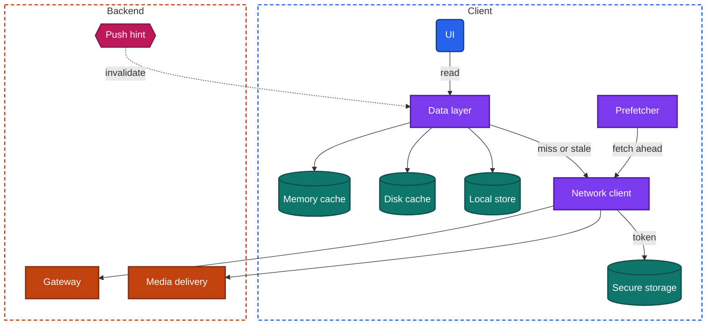
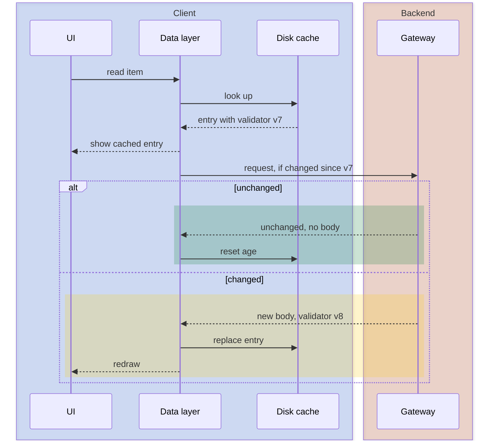

import Probe from '../../../components/Probe.astro';
import Signals from '../../../components/Signals.astro';
import TeardownBar from '../../../components/TeardownBar.astro';
import WorksheetForm from '../../../components/WorksheetForm.astro';

> **The question.** What does this app keep on the device, what does it fetch before you ask, and when does it throw data away?

## 11.1 Why this concern exists

Three of the seven constraints ([Chapter 2](/part-1-method/2-the-mobile-constraint-set/)) pull against each other here.

**Unreliable network** and **human attention** both argue for keeping data on the device. A screen drawn from local data appears in a few milliseconds. A screen drawn from the network appears after a round trip that takes anywhere from a tenth of a second to never. Every piece of data the client already holds is a wait the user does not see.

**Limited resources** argues the other way. Storage is finite and shared with the user's photos. Memory is tighter still, and the operating system ends processes that use too much of it. Every byte fetched ahead of need costs mobile data and battery, and most of what is fetched ahead of need is never looked at.

**Untrusted client** adds a third pressure. Anything written to the device can be read by someone who holds the device, and it can outlive the session that fetched it. A cache is a copy of backend data that the backend no longer controls.

So every app takes a position on four matters:

1. Where each kind of data is kept, and in which kind of storage.
2. Whether a screen reads the local copy, the network, or both, and in which order.
3. How the client learns that a local copy is out of date, and when it deletes copies.
4. What the client fetches before the user asks for it.

This chapter covers reads. Data the user writes on the device, and the replica that such writes need, belong to [Chapter 12](/part-2-concerns/12-offline-and-sync/). The line between the two is the glossary's line between a cache and a replica: a cache can be deleted without loss.

## 11.2 The design space

### Kinds of storage

A device offers four kinds of persistent storage, plus memory. They differ in capability, and each kind of data has a natural home.

| Kind | Capability | What belongs in it | What goes wrong when misused |
|---|---|---|---|
| Key-value settings | Small values read by name, loaded quickly at launch | Preferences, flags, the last selected tab, a cursor | Large values slow every launch, because the whole set is often loaded at once |
| Local store | Structured records, queries, transactions, observation of changes | Items the UI lists, sorts and filters. Cached entities. The replica of [Chapter 12](/part-2-concerns/12-offline-and-sync/) | Needs a migration at every schema change |
| Files | Large opaque blobs, streamed and not loaded whole | Images, audio, video, documents, downloaded responses | No queries. Needs a separate index to know what exists and how old it is |
| Secure hardware-backed storage | Small secrets, protected by the device's hardware and unlock state | Session tokens, encryption keys | Slow, tiny, and on some systems it survives an uninstall |
| Memory | Fastest access, lost at process death | Decoded images, parsed objects for the current screens | Anything kept only here is gone after a force-quit |

The operating system also divides file storage by intent. One area is for data the app cannot recreate, and it is included in device backups. Another area is declared as cache: the operating system may delete it without asking when the device runs short of space. Section 11.6 returns to this, because a user can see the effect.

### Read policies

A read policy is the rule a screen follows when it needs data that may exist both locally and on the backend. Five policies cover almost every app. They are ordered here from the one that trusts the cache least to the one that trusts it most.

**Network only.** The screen always fetches. Nothing local is read, though the response may still be held in memory while the screen is open. The user sees a loading state on every visit and an error when offline. Teams choose this when a stale value is worse than no value: a balance, a price at checkout, seat availability.

**Network first.** The screen fetches, and reads the cache only if the fetch fails. Online, the user sees a loading state on every visit. Offline, the user sees the last copy, usually after a delay while the request times out. It is the cheapest way to add offline reads to an app that was built network only, and it keeps the wait.

**Cache then network.** The screen reads the cache. If a copy exists and is younger than a time limit, the screen shows it and does not fetch. Otherwise the screen fetches and waits. The user sees instant content on a quick return and a loading state after a longer gap. Content changed elsewhere does not appear until the limit passes or the user refreshes by hand.

**Stale-while-revalidate.** The screen shows whatever the cache holds at once, then fetches in the background and redraws if the response differs. The user never waits for content already seen, and sometimes watches it change a moment after it appears. This is the default for content apps. Its cost is the visible change: items shift, counters jump, and a tap can land on something that just moved.

**Cache only.** The screen reads local data and never fetches on its own account. Something else fills the store: a sync engine, a download the user requested, or a background worker. The user sees the same speed online and offline. This is the read side of a local replica.

| Policy | Online revisit | Offline revisit | Shows data changed elsewhere | Typical use |
|---|---|---|---|---|
| Network only | Loading state every time | Error | Always | Money, inventory, anything that must be current |
| Network first | Loading state every time | Last copy, after a delay | Always when online | Offline reads added late |
| Cache then network | Instant within the time limit | Last copy | After the time limit | Slow-changing reference data |
| Stale-while-revalidate | Instant, then may change | Last copy | A moment after display | Feeds, profiles, content |
| Cache only | Instant | Instant | When the store is next filled | Replicas, downloads |

**Policies belong to screens, not to apps.** One app commonly uses network only for the payment screen, stale-while-revalidate for the feed, cache then network for the list of countries, and cache only for downloaded media. Record the policy for each screen you care about.

## 11.3 Anatomy

Figure 11.1 shows the components that a caching client has. In the universal app model ([Chapter 3](/part-1-method/3-the-universal-app-model/)) these sit inside the data layer and the local store, with background workers doing the prefetching.



*Figure 11.1. The components of a caching client.*

### Two tiers

Most clients cache in two tiers. The memory cache holds data in the form the UI needs: parsed objects and decoded images. It answers in well under a frame, it is bounded by the memory the operating system tolerates, and it is emptied by process death. The disk cache holds data in the form it arrived in: response bodies and encoded image files. It survives process death, it is slower by the cost of reading and decoding, and it is bounded by a size the team chose.

A read walks the tiers in order and fills the faster ones on the way back.

```text
function read(key, policy):
  entry = memoryCache.get(key) or diskCache.get(key)
  match policy:
    NetworkOnly:
      return fetchAndStore(key)
    NetworkFirst:
      return fetchAndStore(key) or entry       // entry only on failure
    CacheThenNetwork:
      if entry and entry.age < policy.timeLimit: return entry
      return fetchAndStore(key)
    StaleWhileRevalidate:
      if entry: emit(entry)                    // the UI draws now
      emit(fetchAndStore(key))                 // and again if it changed
    CacheOnly:
      return entry
```

The two tiers are separable from outside. Content that reappears offline within a session and is gone after a force-quit was in the memory cache only. Content that reappears after a force-quit was on disk. Probe P11.1 uses this.

### Responses or entities

A cache holds one of two things, and the choice shows in behavior.

A **response cache** stores each response under the request that produced it. It is simple, and it needs no knowledge of what the data means. Its weakness is that the same item can sit in several responses. A profile name appears in the feed response, the profile response and the search response, and a change to one copy does not reach the others.

An **entity cache** takes responses apart and stores each item once, by identity, in the local store. Every screen that shows the item observes the same record. A change made on one screen appears on every other screen without a fetch. The cost is a schema, migrations, and logic to merge partial items.

The signature is consistency across screens. Change your display name, then visit three screens that show it without refreshing any of them. An entity cache shows the new name on all three. A response cache shows the old name wherever a response has not been refetched. [Chapter 9](/part-2-concerns/9-state-and-ui-data-flow/) treats the same question from the side of the screen.

## 11.4 Freshness

A cached copy is correct at the moment it is stored and less certain every second after. There are four ways for the client to learn that a copy is out of date. Real apps combine them.

### Time limits

Each entry has a maximum age. Past it, the entry is either treated as missing or treated as usable but due for a refresh. The limit can be fixed in the client, or the backend can send it with each response. The second form lets the team change freshness without a release, which matters under the slow release constraint.

Time limits are cheap and blunt. A limit of five minutes means a change can be invisible for five minutes, and it means a refetch every five minutes for data that has not changed in a year.

There is a second question hiding in a time limit: whether an expired entry may still be shown when the network is unavailable. Many apps say yes, since old content is better than an error. Some say no for specific data, and those screens go empty offline after the limit. Probe P11.3 separates the two.

### Validators

A validator lets the client ask "has this changed" instead of "send this again". The backend attaches a version tag or a last-modified time to a response. The client stores it with the entry and sends it back on the next request. If the data has not changed, the backend answers with a short "unchanged" reply and no body.



*Figure 11.2. Stale-while-revalidate with a validator.*

A validator saves bytes, not round trips. The request still crosses the network, so latency is the same and only the transfer shrinks. From outside you cannot see the difference between an "unchanged" reply and a full body that happens to be identical. The only hint is passive: an app that revalidates often and still uses little mobile data probably has validators. That claim is Speculative.

### Invalidation on write

When the user changes something, the client knows at once that related cached data is wrong. It can patch the cached entries, or mark them stale so that the next read fetches. The hard part is knowing which entries are related. Editing one item may affect a detail entry, three list entries, a count on a parent, and a search result.

This is where a response cache hurts and an entity cache pays for itself. With an entity cache, the write updates one record and every screen follows. With a response cache, the team maintains a list of what each write invalidates, and gaps in that list are visible as screens that disagree until refreshed.

### Invalidation by push

The backend knows when data changes, and it can tell the client. A push hint, or a message on a persistent connection ([Chapter 14](/part-2-concerns/14-real-time-delivery/)), names what changed, and the client marks it stale or refetches it. This gives freshness without polling. It depends on delivery that is not guaranteed, so it is always paired with a time limit or a refresh on foreground as a backstop.

| Mechanism | Client learns of a change | Cost | Observable signature |
|---|---|---|---|
| Time limit | Only after the limit | Refetches of unchanged data | Old content for a fixed period, then a reload |
| Validator | On the next request | One round trip, few bytes | None directly. Low data use despite frequent refresh |
| Invalidation on write | At once, for the user's own changes | Bookkeeping in the client | Own changes appear on every screen without refresh |
| Invalidation by push | Shortly after a change made elsewhere | A delivery channel and backend fan-out | Content is current when the app opens, with no visible refresh |

## 11.5 Eviction and storage pressure

A cache that only grows eventually fills the device. Every disk cache therefore has a rule for what to delete. The rule has three parts.

**A bound.** Usually a total size, sometimes a count of entries or a maximum age. Some apps scale the bound to the free space on the device, so the same app keeps more on a large device than on a nearly full one.

**An order.** Least recently used is the common choice: the entry nobody has read for the longest time goes first. Some caches order by age or by size instead. Media caches often keep small thumbnails far longer than full-size files, because thumbnails are cheap to keep and are needed on every list.

**A moment.** Eviction can run on every write, at launch, or in a background task. An app that trims only at launch can exceed its bound during a long session.

The operating system adds its own eviction, outside the app's control. When the device runs low on space, it may delete files from the area the app declared as cache, typically while the app is not running. It does not delete data from the area declared as permanent. This makes the declaration visible. If an app loses cached content after the device ran low on storage but keeps your settings, drafts and downloads, the team placed each kind of data in the right area. If a "downloaded for offline" item disappears under storage pressure, it was stored in the cache area by mistake.

Memory has its own pressure. The operating system warns the app when memory runs short, and a well-built app empties its memory cache in response. You see this as images that redraw from placeholders when you return to a screen after using a heavy app in between.

Some apps expose the cache to the user: a storage screen with a figure, a "clear cache" control, or a setting for the bound. Such a control is strong evidence about how the data is organized. A team can offer "clear cache" safely only if cached data is kept apart from data that cannot be recreated.

## 11.6 Prefetching

Prefetching is fetching data before the user asks for it, on a prediction that the user will. It converts a wait into a cost. The wait disappears when the prediction is right. The cost is paid whether it is right or not.

### What gets prefetched

| Form | Prediction | Trigger | Observable signature |
|---|---|---|---|
| Next page | The user will keep scrolling | The scroll position nears the end of loaded items | Scrolling never reaches a loading indicator at normal speed |
| Next screen | The user will open one of the visible items | A list finishes loading, or an item becomes visible | A never-opened detail screen appears complete, even offline |
| Next media | The user will watch what follows | The current item starts playing | The following item starts with no buffering |
| On intent | The user has started a gesture toward a target | A touch begins, or focus moves to a field | A destination appears faster than a round trip allows |
| Ahead of opening | The user will open the app soon | A background task, or a push hint | Fresh content is present at launch, even in airplane mode |
| Bulk for offline | The user asked for it | An explicit download control | A progress indicator and a large jump in storage used |

[Chapter 15](/part-2-concerns/15-lists-feeds-and-pagination/) covers next-page loading in detail. Background work and what wakes it belong to [Chapter 23](/part-2-concerns/23-background-work-and-notifications/).

### Seeding is not prefetching

A detail screen that shows a title and a thumbnail at once, then fills in the rest, has not been prefetched. The client passed the list item to the detail screen, or the detail screen read the item from an entity cache. No extra request was made. This is seeding, and it is nearly free.

The two are easy to separate. Load a list, go offline, and open an item you have never opened. Seeding shows exactly the fields the list showed and nothing more. Prefetching shows fields the list did not contain: the full description, the large image, the comments. Probe P11.6 does this.

### What it costs and how it is limited

A prefetch that is never used wastes mobile data, battery and a slot on the backend. It also competes with the requests the user is waiting for, which [Chapter 13](/part-2-concerns/13-network-transport-and-resilience/) covers under prioritization. Teams limit the waste with conditions.

```text
function mayPrefetch(item):
  if device.dataSaverOn or device.lowPowerOn: return false
  if item.isLarge and network.isMetered: return false     // video, full images
  if item.isBulk and not device.isCharging: return false  // overnight refresh
  if network.quality is Poor: return false                // do not starve the foreground
  return predictedUse(item) > threshold
```

Each condition is a behavior you can compare across two states of the device. An app that prepares the next video on an unmetered network and not on a metered one has the second condition. An app that refreshes overnight only when plugged in has the third. Probes P11.7 and P11.9 compare these states.

Prefetching also distorts measurements on the backend. Views, impressions and "seen" markers must not be counted for content that was fetched and never displayed. A feed that marks items as seen when they were only prefetched has this bug, and a user notices it as unread items that are already marked read.

## 11.7 Sign out

Sign out is the moment the untrusted client constraint is tested. The device may be handed to another person, or another account may sign in on it. Anything left behind is a leak.

A complete sign out removes five things: the session token in secure storage, the local store of user data, cached responses that were fetched with the user's credentials, the memory cache, and any pending push registration for that account. It may keep data that is the same for every user: public images, the catalog, remote config.

Teams take one of three approaches.

- **Delete everything.** Simple and safe. The next sign in starts from an empty cache, and the first screens are slow.
- **Partition by account.** Each account has its own store and cache directory. Sign out deletes or locks that partition. This is required for apps that support several signed-in accounts and fast switching between them.
- **Delete selectively.** User data is removed and shared media is kept. This is the fastest on the next sign in, and the most likely to miss something.

The misses are visible. The previous user's avatar appears for a moment after a different account signs in. A search history survives. A notification for the old account arrives. Each one names a store that sign out did not clear.

Secure hardware-backed storage has a quirk worth knowing. On some systems it survives an uninstall. An app that signs you in automatically after you delete and reinstall it kept its token there. Whether that is a convenience or a defect depends on the app, and [Chapter 20](/part-2-concerns/20-identity-and-sessions/) takes it up.

## 11.8 Probes

Run P11.1 and P11.2 on each screen of interest, since read policies differ by screen. P11.4 runs in the background of everything else: note the storage figure once at the start of a teardown and again at the end.

<TeardownBar />

### P11.1 Memory or disk

<Probe id="P11.1" />

### P11.2 Read policy

<Probe id="P11.2" />

### P11.3 Late revisit

<Probe id="P11.3" />

### P11.4 Storage growth

<Probe id="P11.4" />

### P11.5 Clear cache

<Probe id="P11.5" />

### P11.6 Unvisited detail

<Probe id="P11.6" />

### P11.7 Metered and unmetered

<Probe id="P11.7" />

### P11.8 Sign out and in

<Probe id="P11.8" />

### P11.9 Ahead of opening

<Probe id="P11.9" />

## 11.9 Signal-to-design table

<Signals chapter={11} />

## 11.10 The backend this implies

Caching looks like a client matter. Most of it depends on what the backend provides.

- **Freshness metadata.** For time limits to be tunable without a release, responses carry their own maximum age. For validators, responses carry a version tag or a modification time, and the backend can compare one cheaply without building the full response first. A backend that must compute the whole response to learn that it is unchanged saves bytes and no work.
- **Stable identities.** An entity cache needs every item to have the same identifier in every response that contains it. An API in which the same item has different shapes or keys on different endpoints ([Chapter 10](/part-2-concerns/10-api-shape/)) pushes the client toward a response cache.
- **Immutable media addresses.** Media delivery works best when an address never changes its content. A changed image gets a new address. The client can then cache media forever and never revalidate it, and the same holds for caches at the network edge. An avatar that stays old on one screen after a change suggests the address was reused.
- **An invalidation channel.** Invalidation by push needs the backend to know which devices hold which data, or at least which users are affected by a change, and to fan a hint out to them.
- **Capacity for speculative load.** Prefetching multiplies read traffic by some factor above what users look at. The backend needs a way to tell prefetch requests apart, so that it can shed them first under load and keep them out of view counts.
- **Per-user and shared data kept apart.** Responses that mix public content with user-specific fields cannot be cached at the edge or kept across sign out. Separating them lets both the edge and the client keep the public part.

## 11.11 Failure modes and what they reveal

- **Two screens disagree about the same item.** A response cache with incomplete invalidation on write. The item lives in several entries and only some were updated.
- **Your own change disappears after you refresh.** The refresh was answered by a stale copy somewhere between client and backend, often a cache at the edge with a time limit. The change itself was saved.
- **Content flashes old, then new, on every visit.** Stale-while-revalidate over data that changes on almost every fetch. The policy fits the screen badly.
- **An image stays old after it was changed.** Media cached by address, and the address was reused for new content.
- **The storage figure grows without limit.** A disk cache with no bound, or data written to the permanent area that should have been declared as cache.
- **Downloads vanish after the device ran low on space.** Content the user asked to keep was stored in the area the operating system is allowed to clear.
- **The previous account's data appears after a new sign in.** Sign out left a store or a memory cache in place.
- **The app is slow to launch and gets slower over months.** A large amount of data is read at startup, often from key-value settings that have grown, or a local store that is never trimmed. [Chapter 7](/part-2-concerns/7-launch-and-startup/) covers the launch path.
- **Items marked as seen that you never saw.** Prefetched content was counted as displayed.
- **High mobile data use with little time in the app.** Prefetching or background refresh without a metered-network condition.

## 11.12 Worksheet entries

These are the fields this chapter adds to the teardown worksheet. Probe outcomes fill some of them in. Fill in the read policy fields once per screen you tested, and the rest once per app.

<TeardownBar />

<WorksheetForm chapters={[11]} />

## 11.13 Summary

- A device offers key-value settings, a local store, files and secure hardware-backed storage, plus memory. Each kind of data has a natural home, and misplacement shows up as slow launches, lost downloads or leaked secrets.
- A cache has a memory tier and a disk tier. A force-quit between two offline visits tells you which tier held the content.
- Five read policies run from network only to cache only. Each produces a distinct pattern of loading states, instant content and visible changes. Policies are assigned per screen.
- Freshness comes from time limits, validators, invalidation on write and invalidation by push. Validators cannot be seen from outside, so claims about them are Speculative.
- A response cache and an entity cache differ in whether one change reaches every screen without a fetch.
- Eviction has a bound, an order and a moment. The operating system may also clear the declared cache area under storage pressure, which shows where the team put each kind of data.
- Prefetching trades data and battery for a wait. Opening a never-visited detail screen offline separates seeding from prefetching, and comparing a metered with an unmetered network shows the conditions that limit it.
- Sign out shows which stores hold user data. Anything of the previous account that survives names a store that was missed.
