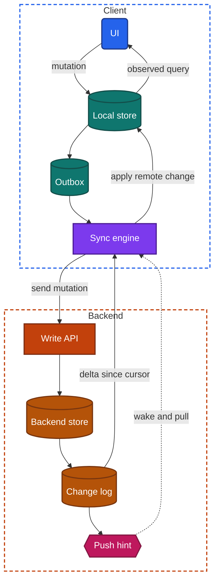
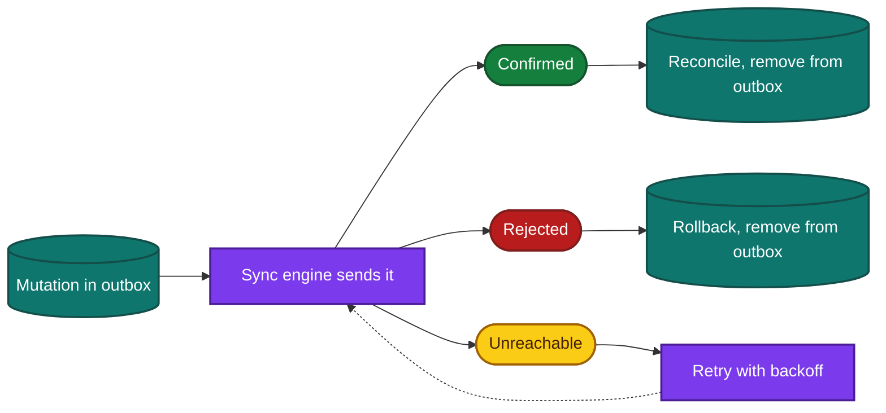
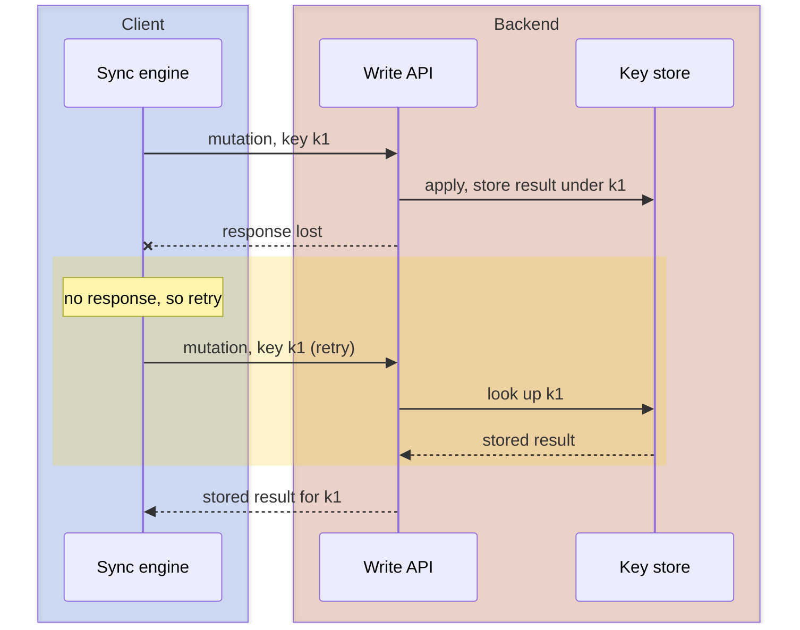

import Probe from '../../../components/Probe.astro';
import Signals from '../../../components/Signals.astro';
import TeardownBar from '../../../components/TeardownBar.astro';
import WorksheetForm from '../../../components/WorksheetForm.astro';

> **The question.** When this app loses the network, what keeps working, and how do its copies of data converge afterwards?

## 12.1 Why this concern exists

A mobile client is disconnected more often than its designers would like. The network drops in elevators and on trains, a request times out halfway through, and the operating system suspends the app before a response arrives. Process death ([Chapter 2](/part-1-method/2-the-mobile-constraint-set/)) adds a second problem: anything held only in memory is gone when the process is.

An app therefore holds at least two copies of its data, one on the device and one on the backend, and they disagree for some period after every change. Every app takes a position on three matters, whether its team chose that position on purpose or not:

1. What the user can read while disconnected.
2. What the user can write while disconnected, and what happens to those writes.
3. Which copy wins when the copies disagree.

These positions are unusually visible from outside. Turning the network off is the cheapest probe in the book, and it exposes more design than any other single action.

## 12.2 The design space

Offline behavior falls into five levels. Each level includes the capabilities of the one before it.

**Level 0. Online only.** The client holds data in memory for the current screen. Without a network it shows an error or an empty screen. Teams choose this when stale data is worse than no data, for example an account balance or a seat map, or when the feature is new and offline support has not been paid for yet.

**Level 1. Cached reads.** The client keeps responses in a cache and shows them when the network is unavailable. Writes are blocked or fail. The backend is the source of truth and the cache is disposable. This is the default for content apps, because it costs little and makes the app feel faster even when online (stale-while-revalidate, [Chapter 11](/part-2-concerns/11-local-storage-caching-and-prefetching/)).

**Level 2. Queued writes.** The client applies a mutation to local state at once (an optimistic update), records it in an outbox, and sends it when it can. The backend is still the source of truth. The local copy is the backend's data plus the user's unconfirmed mutations. Teams choose this for actions that are small, frequent and rarely rejected: sending a message, liking a post, marking a task done.

**Level 3. Local replica.** The UI reads and writes only the local store. A sync engine moves changes in both directions in the background. The app is fully usable offline for all data already on the device. Teams choose this when the data belongs to the user and is edited often: notes, tasks, messages, field-work forms. It is the first level at which conflicts must be designed for, because two devices can both make long runs of changes while apart.

**Level 4. Concurrent editing.** Several replicas edit the same item at the same time and the edits merge at fine granularity, such as single characters or single properties. This requires an operation log and a merge algorithm, and usually a persistent connection ([Chapter 14](/part-2-concerns/14-real-time-delivery/)). Teams choose it only when collaboration on one item is the product.

| Level | Offline read | Offline write | Source of truth | Conflicts | Relative cost |
|---|---|---|---|---|---|
| 0 Online only | No | No | Backend | Cannot occur | Lowest |
| 1 Cached reads | Visited data | No | Backend | Cannot occur | Low |
| 2 Queued writes | Visited data | Selected actions | Backend | Rare, backend decides | Medium |
| 3 Local replica | All synced data | Everything | Shared, by rule | Expected, rule needed | High |
| 4 Concurrent editing | All synced data | Everything | Merged log | Constant, merged automatically | Highest |

**Levels belong to features, not to apps.** A single app commonly has a Level 3 message list, a Level 2 "like" button, a Level 1 profile screen and a Level 0 payment screen. Record the level for each feature. An app described with one level has not been torn down.

## 12.3 Anatomy

Figure 12.1 shows the full machinery of Level 3. Lower levels are subsets of it: Level 1 has only the pull path into a cache, and Level 2 adds the outbox.



*Figure 12.1. The components of a local-replica sync system.*

Two properties of this figure matter for a teardown.

First, the UI never waits on the network. It writes to the local store and redraws from it. An app built this way responds at the same speed online and offline, which is itself a signal.

Second, the write path and the read path are separate systems with separate failure modes. Section 12.4 covers the write path, Section 12.5 the read path, and Section 12.6 what happens when they collide.

## 12.4 The write path

### Applying and queuing

A mutation is applied to the local store and added to the outbox in one atomic step. If the two steps were separate, process death between them would leave either a visible change that is never sent, or a sent change that is not visible.

```text
function perform(mutation):
  mutation.id = newUniqueId()        // becomes the idempotency key
  transaction(localStore):
    applyLocally(mutation)
    outbox.append(mutation)
  syncEngine.requestRun()
```

### Draining

The sync engine sends the outbox in order. Each mutation has three possible outcomes, and each produces a different visible behavior.

```text
function drainOutbox():
  while outbox is not empty:
    m = outbox.first()
    match send(m):
      Confirmed(serverState):
        transaction(localStore):
          reconcile(m, serverState)
          outbox.remove(m)
      Rejected(reason):
        transaction(localStore):
          rollback(m)
          outbox.remove(m)
        notifyUser(m, reason)        // some apps skip this step
      Unreachable:
        scheduleRetryWithBackoff()
        return
```



*Figure 12.2. The three outcomes of a queued mutation.*

- **Confirmed.** A pending indicator disappears. Sometimes the item changes slightly, for example a timestamp shifts or the item moves in a list, because backend values replace local ones.
- **Rejected.** The item disappears, reverts, or is marked as failed with a retry control. An app that removes it without telling the user has an outbox and no rejection UI.
- **Unreachable.** Nothing visible changes. The mutation waits.

### Idempotency

A request can succeed on the backend while its response is lost. The client cannot tell this apart from a request that never arrived, so it must retry, and the retry must not apply the mutation twice. The client attaches an idempotency key, and the backend stores the result under that key and returns the stored result for any repeat.



*Figure 12.3. A retried mutation applied once.*

A common form of the same idea is the client-generated identifier: the client assigns the permanent ID of a new item, so a repeated create is recognized as the same item. This also removes a second problem. With backend-assigned IDs, a mutation that edits a just-created item cannot be sent until the create is confirmed and the temporary ID is replaced everywhere it was used.

### Operations or states

The outbox holds one of two kinds of entry, and the choice shapes conflict behavior.

- **Operations** record intent: "add item X to list L", "increment by one". They merge well, because two operations on the same item can often both be applied.
- **States** record results: "list L is now [A, B, X]". They are simpler, and the later one replaces the earlier one.

### Ordering and blocking

A strictly ordered outbox has a weakness: one mutation that can never succeed blocks every mutation behind it. Designs handle this by treating a rejection as final and removing the entry, by ordering per item instead of globally, or by moving a repeatedly failing entry aside. An app in which one failed action stops all later actions from sending has a globally ordered outbox and none of these measures.

## 12.5 The read path

The client needs to learn what changed on the backend since it last asked. There are four common ways to ask.

| Method | How it works | Weakness |
|---|---|---|
| Full refetch | Download the whole collection every time | Cost grows with data size |
| Timestamp | "Give me everything modified after T" | Misses changes when clocks or commit order disagree. Deletes need separate handling |
| Cursor over a change log | The backend numbers every change. The client sends the cursor it last received | The backend must keep the log |
| Per-item version check | The client sends IDs and versions, and the backend returns the items that differ | Request size grows with item count |

The cursor method is the most robust, and it is what most Level 3 systems converge on.

```text
function pull():
  loop:
    page = backend.changesSince(cursor)
    transaction(localStore):
      for change in page.changes:
        applyRemote(change)          // upsert, or delete for a tombstone
      cursor = page.nextCursor       // stored with the data, atomically
    if not page.hasMore: return
```

The cursor is saved in the same transaction as the data it describes. Saved separately, process death could leave a cursor that points past changes the local store never received, and those changes would be lost for good.

### Deletions

A deleted item cannot be reported by its absence. The backend keeps a tombstone and delivers it through the change log like any other change. Tombstones cannot be kept forever, so the backend eventually discards old ones. A client whose cursor is older than the oldest retained tombstone can no longer be brought up to date by a delta, and the backend tells it to discard its replica and load everything again.

### What triggers a pull

| Trigger | Visible behavior |
|---|---|
| App comes to the foreground | Content updates a moment after opening |
| User gesture, such as pull to refresh | Content updates only when asked |
| Push hint | Content is already current when the app is opened |
| Persistent connection ([Chapter 14](/part-2-concerns/14-real-time-delivery/)) | Content updates while the user watches |
| Periodic background task | Content is roughly current, depending on how long ago the task ran |

### First sync

A new device has an empty local store. Loading everything before showing anything is simple and slow. Most designs load the most recent data first, make the app usable, and backfill older data afterwards. The order in which data appears on a fresh install shows what the team considers essential.

## 12.6 Conflicts

A conflict exists when two replicas changed the same data and neither had seen the other's change. Three things define a conflict design: the unit at which conflicts are detected, how they are detected, and how they are resolved.

### Unit

The unit is the smallest piece of data that is replaced as a whole. With a whole record as the unit, a change to an item's title on one device and to its due date on another is a conflict, and one change is lost. With a field as the unit, both survive. With a character or list element as the unit, even changes within one text field survive.

### Detection

- **None.** The backend accepts every write. The last one to arrive wins and nobody is told.
- **Version check.** Each item carries a version. A write states the version it was based on, and the backend rejects it if the item has moved on. The client must then pull, reapply and resend.
- **Causal history.** Each replica tracks which changes it has seen, so the system can tell "B came after A" from "A and B were concurrent". This is required for Level 4 and uncommon below it.

### Resolution

| Strategy | Rule | Observable signature |
|---|---|---|
| LWW by arrival | The write the backend receives last wins | The device that reconnects last wins, whatever the order of the actual edits |
| LWW by client time | The write with the later device timestamp wins | The later edit wins regardless of reconnect order. A device with a wrong clock wins or loses wrongly |
| Field-level merge | LWW applied per field | Edits to different fields both survive. Edits to the same field follow LWW |
| Backend rejects | A stale write is refused | The user sees an error or a prompt to reload, and the edit is not saved |
| Keep both | Both versions are stored | A duplicate item or a "conflicted copy" appears |
| User decides | The app shows both versions and asks | A comparison or choice dialog |
| Domain merge | A rule specific to the data type | Counters add up. Sets take the union. A delete may beat or lose to an edit, by rule |
| Automatic fine-grained merge | Operations are transformed or designed to commute | Concurrent edits to one text both appear, interleaved at the position each was made |

### Fine-grained merge

Two families of algorithm provide Level 4. Operational transformation rewrites each incoming operation against the operations it did not know about, and relies on the backend to put all operations in one order. Conflict-free replicated data types attach enough metadata to each operation that replicas can apply them in any order and reach the same result. Google has described Google Docs as built on operational transformation. Figma, in its engineering post "How Figma's multiplayer technology works", describes an approach inspired by conflict-free replicated data types that still relies on a central server.

From outside, the two families cannot be told apart. Both show live merging of concurrent edits. A claim about which one an app uses is Speculative unless its maker has published it.

## 12.7 Probes

Run P12.1 to P12.4 on every feature of interest. Run the rest on features that reached Level 2 or higher. Select the outcome you saw in each probe, and it is recorded in your worksheet for the teardown chosen here.

<TeardownBar />

### P12.1 Offline read

<Probe id="P12.1" />

### P12.2 Offline write

<Probe id="P12.2" />

### P12.3 Kill while pending

<Probe id="P12.3" />

### P12.4 Reconnect

<Probe id="P12.4" />

### P12.5 Two-device conflict

<Probe id="P12.5" />

### P12.6 Conflict unit

<Probe id="P12.6" />

### P12.7 Delete against edit

<Probe id="P12.7" />

### P12.8 Clock skew

<Probe id="P12.8" />

### P12.9 Long absence

<Probe id="P12.9" />

### P12.10 First sync

<Probe id="P12.10" />

### P12.11 Flaky network duplicates

<Probe id="P12.11" />

## 12.8 Signal-to-design table

<Signals chapter={12} />

## 12.9 The backend this implies

Each client level requires specific backend support. Once you have placed a feature at a level, the following can be Inferred.

- **Level 1.** Nothing beyond ordinary read endpoints. Validators such as version tags let the client confirm cheaply that cached data is still current ([Chapter 11](/part-2-concerns/11-local-storage-caching-and-prefetching/)).
- **Level 2.** Write endpoints that accept an idempotency key or a client-generated ID, and a store of recently seen keys. Rejections must be distinguishable from transient failures, because the client treats the first as final and retries the second.
- **Level 3.** A change log per user or per shared space, with a monotonic position that serves as the cursor. Tombstones with a retention period. A delta endpoint. A way to signal the client that changes exist, by push hint or persistent connection. A stated conflict rule, enforced on the backend so that all clients agree.
- **Level 4.** An operation log per document, a component that orders or merges operations, a persistent connection to every active editor, and periodic snapshots so that a new client does not replay the whole history.

Shared data adds a requirement at Level 3 and above. When a user loses access to an item, the backend must deliver that loss as a change, so that the item is removed from replicas that already hold it. An app where content you no longer have access to stays visible offline has not solved this.

## 12.10 Failure modes and what they reveal

Sync bugs are informative because each one comes from a specific missing piece.

- **Duplicated items.** A create was retried and the backend had no way to recognize the repeat. Idempotency is absent on that endpoint.
- **Silently lost edits.** Record-level LWW with no detection. Each device's change was valid, and one overwrote the other.
- **Items that return after deletion.** A replica that missed the tombstone wrote the item back, or a state-based mutation carried the full old record.
- **A permanently pending item.** The outbox cannot get this entry accepted and does not give up. If later actions are also stuck, the outbox is globally ordered.
- **A counter that jumps.** Optimistic increments were shown locally and then replaced by the backend total, which included other users' actions or excluded a rejected one.
- **Items in the wrong order until refresh.** The local store sorted by device time, and the backend sorted by its own time.
- **A long reload after an update.** The team chose to rebuild the local store from the backend instead of writing a migration. This tells you the backend holds everything the device holds.
- **Content visible offline after access was removed.** Access changes are not delivered through the change log.

## 12.11 Worksheet entries

These are the fields this chapter adds to the teardown worksheet. Probe outcomes fill some of them in. Complete one worksheet per feature.

<TeardownBar />

<WorksheetForm chapters={[12]} />

## 12.12 Summary

- Offline behavior has five levels, from online only to concurrent editing. Levels are assigned per feature, not per app.
- The write path is an optimistic update plus a durable outbox. Idempotency keys make retries safe. A mutation ends as confirmed, rejected or still waiting, and each outcome looks different to the user.
- The read path asks what changed since a cursor. Deletions travel as tombstones, and limited tombstone retention forces a full reload after a long absence.
- A conflict design is a unit, a detection method and a resolution strategy. Two devices and airplane mode are enough to identify all three in most apps.
- Reversing the order of edits against the order of reconnection separates LWW by arrival from the other rules. A clock change separates client time from backend time.
- The client's level implies specific backend components, so a client teardown also yields a backend sketch.
- Some designs cannot be told apart from outside, in particular the two families of fine-grained merge. Record those as Speculative.
- Sync bugs are evidence. Each common failure points to one missing mechanism.
