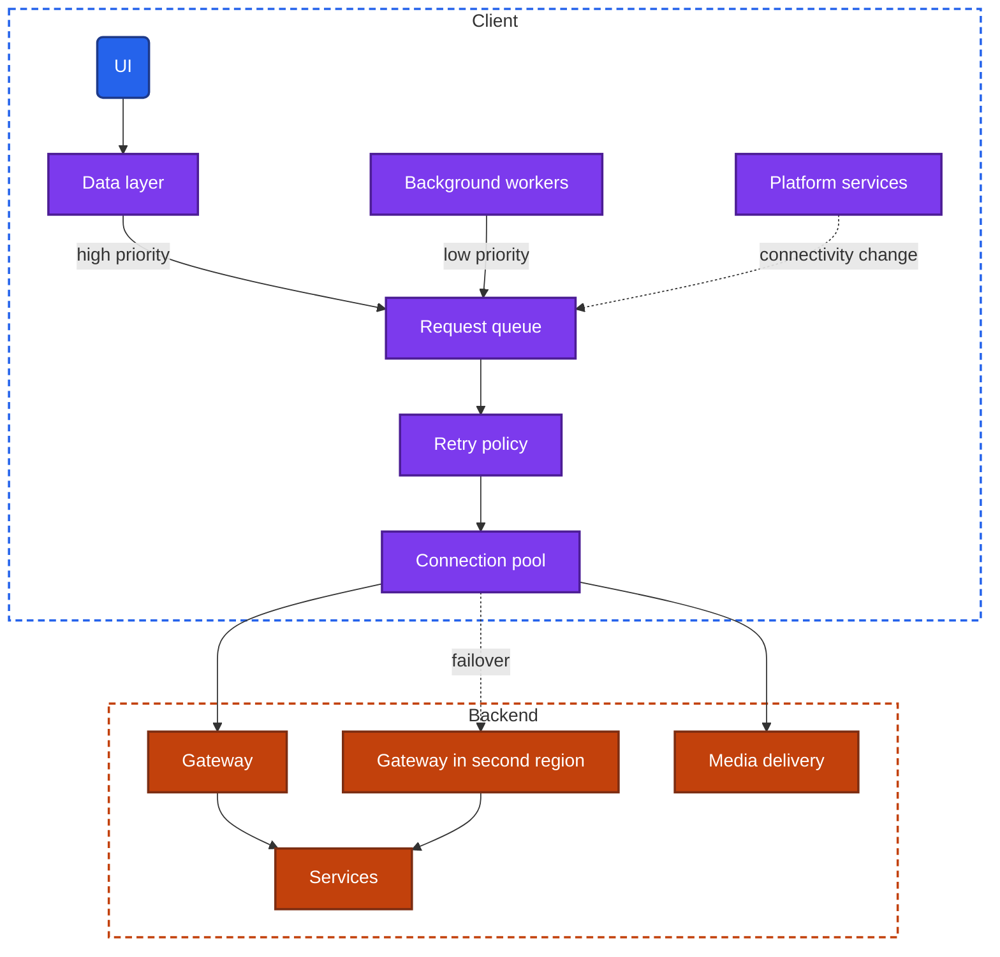
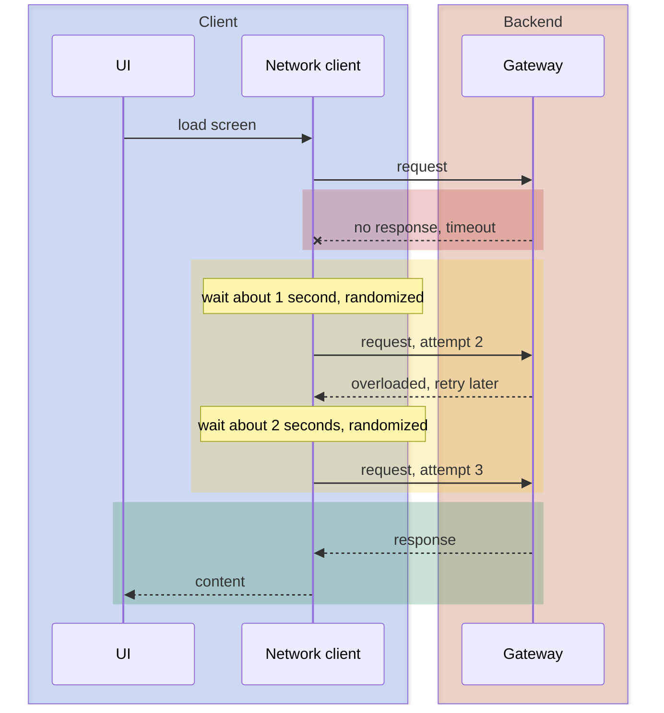

import Probe from '../../../components/Probe.astro';
import Signals from '../../../components/Signals.astro';
import TeardownBar from '../../../components/TeardownBar.astro';
import WorksheetForm from '../../../components/WorksheetForm.astro';

> **The question.** How does this app behave on a slow, lossy or failing network, and how does it prioritize its requests?

## 13.1 Why this concern exists

The first of the seven constraints ([Chapter 2](/part-1-method/2-the-mobile-constraint-set/)) is the unreliable network: slow, lossy, absent, and changing between all three. A request from a mobile client can fail in more ways than a request between two machines in a data center. The radio may have no signal. It may have a signal that carries almost nothing. The device may move from a wireless network to cellular while the request is in flight. The network may be present and connected to nothing. The backend may be slow, or down in one region.

The client usually cannot tell these apart. It sent a request and has not received a response. Whether the request was lost, the response was lost, or the backend is still working, looks the same from the device. Every design in this chapter is a way of deciding what to do in that state of ignorance.

Two more constraints shape the decisions. **Human attention** means a person is watching a loading state and will give up within seconds. The client has to choose between waiting longer, trying again and admitting failure, and it has to tell the user which one it chose. **Limited resources** means every retry costs battery and mobile data, and the radio itself is expensive to wake.

[Chapter 12](/part-2-concerns/12-offline-and-sync/) covers what the app does while there is no network at all. This chapter covers the harder case: a network that is present and bad, and the moment a request fails.

## 13.2 The design space

Network handling grows in steps. Each step includes the ones before it, and each has a visible signature.

**Step 0. Defaults.** The client sends each request once, with whatever timeout the platform's networking component ships with. A failure becomes an error on the screen. Nothing is retried, prioritized or cancelled. On a good network this is indistinguishable from the most careful design. On a bad one, the user sees long loading states that end in errors, and has to retry everything by hand.

**Step 1. Tuned timeouts and retries.** The team sets timeouts per kind of request and retries transient failures automatically, with backoff. The user sees fewer errors, and a retry control when the client gives up. This is the baseline for any app that takes mobile seriously.

**Step 2. A managed request queue.** Requests pass through a component that knows what each one is for. It ranks them, cancels those nobody is waiting for, and merges identical ones. The user sees the current screen load quickly even while heavy work runs behind it.

**Step 3. Network awareness.** The client measures or is told the quality of the network and changes what it asks for: smaller images, fewer requests, lower quality media, no prefetching. It listens for connectivity changes and resumes on its own. The user sees an app that degrades instead of failing.

**Step 4. Path resilience.** The client and backend survive failures of a path and not only of a request. A transport keeps a connection alive across a network switch. The client fails over to another host or region. The user sees nothing, which is the point, and also the reason this step is the hardest to confirm from outside.

| Step | On a weak network | On a network switch | Cost | Signature |
|---|---|---|---|---|
| 0 Defaults | Long loading state, then an error | Request fails | None | Manual retry for everything |
| 1 Timeouts and retries | Shorter waits, errors less often | Request fails, then retries | Low. Requires safe retries | Brief stalls that resolve by themselves |
| 2 Managed queue | Current screen stays responsive | Same as Step 1 | Medium. Every request needs a declared purpose | Foreground loads beat background work |
| 3 Network awareness | Lower quality, still usable | Resumes when the new network is ready | Medium. Needs variants on the backend | Visible quality changes. Recovery without a tap |
| 4 Path resilience | Same as Step 3 | No visible interruption | High. Involves backend and infrastructure | Often none |

As with every concern, steps belong to features. A messaging feature may sit at Step 4 and the settings screen at Step 0.

## 13.3 Anatomy

In the universal app model ([Chapter 3](/part-1-method/3-the-universal-app-model/)), all of this lives in the network client, with help from platform services for connectivity information. Figure 13.1 opens the network client up.



*Figure 13.1. The parts of a resilient network client.*

A request passes through three stages on the way out.

The **request queue** decides whether and when the request runs. It holds the priority of each request, knows which screen asked for it, and can drop it if that screen is gone.

The **retry policy** decides what happens after a failure. It classifies the failure, and either gives up, or waits and sends again.

The **connection pool** decides which connection carries the request. It keeps connections open for reuse, opens new ones when needed, and notices when the network under them has changed.

Step 0 has only the connection pool, supplied by the platform. Step 1 adds the retry policy. Step 2 adds the request queue. Steps 3 and 4 make each stage listen to platform services.

## 13.4 Timeouts

A timeout is the client's decision that a request has failed because nothing has come back. It is a guess, and it can be wrong in both directions.

A request has several phases, and a careful client limits each one separately.

| Timeout | Limits | Typical setting |
|---|---|---|
| Connect | Time to establish a connection | Short. A host that does not answer in a few seconds rarely answers later |
| Idle | Time with no bytes arriving | Medium. Tolerates a slow response that is still moving |
| Total | Time for the whole request | Depends on the request. Short for a small read, long or absent for an upload |

A single total timeout applied to everything is the usual Step 0 arrangement, and it fails at both ends. It is too long for a tap on a small button and too short for a large upload on a slow network.

### What each mistake looks like

**Too long.** The loading state runs for half a minute or more and then becomes an error. The user gave up long before. An app that shows a spinner for a full minute in airplane mode is not consulting connectivity and is waiting out a default.

**Too short.** Requests that would have succeeded are abandoned. On a weak connection the app shows errors quickly and repeatedly, while other apps on the same device load slowly and succeed. Short timeouts combined with automatic retries are worse: each attempt is cut off before it can finish, and the app never loads at all on a network that is merely slow.

**None in the UI.** The request eventually fails underneath, and the screen has no state for failure. The loading state never ends. This is a missing branch in screen state and not a transport matter, and it is common.

A client can also skip the wait. Platform services report whether the device has any network path. A client that checks this fails at once in airplane mode, with a specific message. Probe P13.1 separates the client that asks from the client that waits.

## 13.5 Retries

A failed request can be sent again. Whether it should be depends on three things: what kind of failure it was, whether sending it twice is harmless, and how many other clients are about to do the same.

### Which failures

| Failure | Retry | Reason |
|---|---|---|
| No connection, connection reset, timeout | Yes | Transient by nature |
| Backend reports overload or temporary unavailability | Yes, after a wait, honoring any delay the backend states | The backend asked for time |
| Backend reports the request is invalid, forbidden or not found | No | The same request gets the same answer |
| Backend reports the session is no longer valid | Once, after refreshing the session | [Chapter 20](/part-2-concerns/20-identity-and-sessions/) |

A client that retries the third row is visible as a long loading state on a screen that then shows "not found". It spent its retries on an answer that was final the first time.

### Which requests

Reads are safe to repeat. Writes are safe only if the backend can recognize the repeat. A timeout on a write does not mean the write failed. The backend may have applied it and lost the response. Retrying a payment, a message or an order without protection can apply it twice. The protection is the idempotency key, which [Chapter 12](/part-2-concerns/12-offline-and-sync/) covers in Section 12.4. A team that has not built idempotency for a write has two honest options: do not retry it automatically, or retry and accept duplicates. The first shows as a failed state with a manual retry control. The second shows as duplicates on a weak network.

### Backoff and jitter

Retrying at once, and repeatedly, turns a brief backend problem into a lasting one. Every client that failed retries together, the backend fails again under the combined load, and the cycle continues. Two measures prevent this.

**Backoff** lengthens the wait after each failed attempt, usually doubling it up to a ceiling. A backend that is struggling gets progressively more room.

**Jitter** randomizes each wait. Without it, clients that failed at the same moment retry at the same moment, in waves. With it, the retries spread out.

```text
function sendWithRetry(request):
  attempt = 0
  loop:
    result = send(request)
    if result.succeeded or not isTransient(result): return result
    if not request.safeToRepeat: return result   // no idempotency, no retry
    attempt = attempt + 1
    if attempt > request.maxAttempts: return result
    ceiling = min(maxWait, baseWait * 2 ^ attempt)
    wait(random(0, ceiling))                     // jitter spreads clients out
    waitUntil(connectivity.available)            // do not burn attempts offline
```



*Figure 13.2. A read that succeeds on its third attempt. The user sees one long loading state.*

Backoff has a recognizable feel from outside. A loading state stalls, and content arrives in a lump after an irregular pause, without any tap. You cannot read the waits themselves. What you can observe is whether recovery happened by itself and roughly how many seconds it took. A second device recovering at a clearly different moment from the same outage is consistent with jitter, and it proves nothing, since many other things differ between two devices. Treat any claim about jitter as Speculative.

### Retry budgets

A layered system can multiply retries. The UI retries three times, the network client retries three times under it, and the gateway retries three times behind it: twenty-seven requests for one tap. Careful designs retry at one layer only, or cap the share of traffic that may be retries. This is invisible from outside in normal operation. It shows during an outage, as the difference between an app that recovers within a minute of the backend returning and one that stays broken for many minutes while its own clients keep it down.

## 13.6 Priority, cancellation and deduplication

A weak network is a narrow pipe. What matters is the order in which requests go through it.

### Priority

The request the user is waiting on comes first. A common ranking has four classes.

1. **Blocking the current screen.** The data the visible screen cannot draw without, and the write the user just made.
2. **Visible but secondary.** Images on screen, counts, anything below the first view.
3. **Predicted.** Prefetching ([Chapter 11](/part-2-concerns/11-local-storage-caching-and-prefetching/)).
4. **Deferred.** Analytics, logs, large uploads and downloads, cache maintenance.

The queue runs higher classes first and limits how many lower ones run at once. Deferred work is often handed to background workers that the operating system schedules for a moment of good connectivity ([Chapter 23](/part-2-concerns/23-background-work-and-notifications/)).

The signature is what happens to the foreground while something heavy runs. Start a large upload on a weak network and open a new screen. If the screen loads at near-normal speed while the upload slows, the client ranks its requests. If the screen crawls until the upload ends, everything shares one queue. Probe P13.8 does this.

### Cancellation

A request whose screen is gone has no one waiting for it. Cancelling it frees the pipe for the next screen. On a fast network nobody notices. On a slow one, a client that never cancels lets a user who taps through five screens queue five screens of requests, and the sixth waits behind all of them.

Not everything should be cancelled. A write the user made must complete even if the user leaves. A read that is nearly finished is worth keeping for the cache. A design that cancels by rule distinguishes these.

From outside, cancellation and the cache blur together. Leave a slow-loading screen and return. If it is complete, the request kept running and its result was stored. If it starts again from nothing, either the request was cancelled, or it finished and its result was thrown away. Those two cannot be separated by this observation alone. The second half of probe P13.6 helps: a client that cancels makes the next screen load faster.

### Deduplication

Two parts of the app often want the same data at the same moment. A list and its header both ask for the current user. Ten rows all ask for the same avatar. A user pulls to refresh twice. Deduplication attaches the second caller to the request already in flight, so one request serves both.

```text
function fetchOnce(key):
  if inFlight.has(key): return inFlight.get(key)   // join the existing request
  pending = startRequest(key)
  inFlight.set(key, pending)
  whenFinished(pending):
    inFlight.remove(key)                           // later callers fetch afresh
  return pending
```

Deduplication is invisible when it works. Its absence is sometimes visible: the same image fading in at different moments in different rows, or a double tap on a button producing two results. The second case is deduplication of writes, which needs the idempotency key again.

## 13.7 Connections

Everything so far concerned single requests. Under them is a connection, and how the client manages connections sets the floor for how fast anything can be.

### Reuse

Opening a secure connection costs several round trips before the first byte of the request is sent. On a fast network that is a tenth of a second. On a slow cellular link it can be a second or more. A client that opens a connection per request pays this every time. A client that keeps connections open pays it once.

The visible trace is the first request after idle. An app that is slow on its first action after a pause and fast on the next ones is reopening connections. An app that keeps one persistent connection ([Chapter 14](/part-2-concerns/14-real-time-delivery/)) has no such pause, and pays for it in battery.

### Multiplexing

Older transports carry one request at a time per connection, so a client opens several connections in parallel and queues the rest. Newer ones multiplex: many requests share one connection, each as its own stream, with priorities between them. This removes the queue at the connection level.

Multiplexing over a single reliable byte stream has one flaw on lossy networks. A lost packet stalls every stream on that connection until it is retransmitted, even streams whose data arrived intact. Transports built on independent streams avoid this, because a loss delays only the stream it belongs to. They also combine the connection and encryption handshakes, and can resume a recent connection with no handshake round trip.

### Surviving a network switch

A traditional connection is identified by the addresses at its two ends. When the device moves from a wireless network to cellular, its address changes and every open connection dies. Each request in flight fails and must be retried on a new connection.

Some transports identify a connection by an identifier carried in the packets and not by address. The connection continues across the switch. Requests in flight are delayed by a moment and do not fail. A separate technique runs a connection over both networks at once, so the loss of one is covered by the other.

### What you can know

None of this can be identified from outside without inspection tools. You can observe that a download continued when you walked out of wireless range. Three designs fit that observation: a transport that survived the switch, a fast silent retry that resumed from where it stopped, and a transfer that had been using cellular all along because the device judged the wireless link too weak. Record what you saw as Observed. Record any statement about the transport as Speculative, unless the maker has published it.

## 13.8 Adapting to network quality

At Step 3 the client stops treating all networks alike.

### Knowing the quality

The client has three sources. Platform services report the type of network and whether it is metered. They report little about how good it is right now. The client's own recent requests are a better measure: it knows how long they took and how many bytes moved. Some transports expose their estimate of round-trip time and throughput. Most apps combine the first two into a few buckets, such as poor, moderate and good.

### Changing what is asked for

| Adaptation | On a poor network | Requires |
|---|---|---|
| Image variants | Smaller or more compressed images | Media delivery that serves several sizes of each image ([Chapter 16](/part-2-concerns/16-images/)) |
| Media quality | Lower resolution or bitrate | Media encoded at several qualities ([Chapter 17](/part-2-concerns/17-audio-and-video-playback/)) |
| Page size | Fewer items per request | Pagination that accepts a size ([Chapter 15](/part-2-concerns/15-lists-feeds-and-pagination/)) |
| Deferral | No prefetching, no autoplay, analytics held back | A request queue with priorities |
| Payload shape | Fewer fields, or one combined request in place of several | An API that offers both ([Chapter 10](/part-2-concerns/10-api-shape/)) |

### Compression

Text payloads compress well, and nearly every app compresses responses. Request bodies are compressed less often, though it matters for uploads of logs and large writes. Some apps use a binary encoding in place of text, or a compression dictionary shared between client and backend, to shrink payloads further. None of this is visible in the UI. The only outside evidence is passive: the mobile data figure in device settings after a fixed amount of use. It supports a comparison between two apps of the same archetype and not a claim about one app's encoding.

### Data-saver modes

The operating system offers a low-data mode that the user turns on, and it tells apps about it. An app can respect it, ignore it, or offer its own setting. Respecting it means some combination of: lower quality media, no autoplay, no prefetching, no background refresh, images loaded on tap. The behavior under this mode shows which of the adaptations in this section the team has built, because the mode forces them on regardless of the measured quality. Probe P13.7 uses that.

## 13.9 Failures beyond the device

### Captive networks

A captive network is one that accepts the device and then intercepts its traffic until the user signs in or accepts terms: hotels, airports, cafes. The device reports a connection. Requests either hang, or receive the network's sign-in page in place of the expected response.

The operating system tests for this and usually shows the sign-in page itself. Until the user completes it, an app faces a network that looks connected and delivers nothing. A careful client treats "connected" as a hint and its own requests as the truth. It verifies that a response really came from its backend, which the secure connection normally guarantees, and it reports "no internet" instead of "something went wrong". A careless client shows an endless loading state, a generic error, or in rare cases tries to parse the sign-in page as data.

### Failover

A backend that runs in several regions can lose one and continue. How the client reaches the surviving region determines what the user sees.

| Mechanism | Who acts | What the user sees during a regional outage |
|---|---|---|
| Name resolution is changed to point at a healthy region | Backend operators | Errors for some minutes, until devices pick up the change |
| One address is routed by the network to the nearest healthy region | Network infrastructure | A brief stall, or nothing |
| The client holds a list of hosts and tries the next one | Client | A slower first request, then normal service |
| No failover | Nobody | Errors until the region returns |

Regional failures have a distinctive shape. The app fails for you and works for a friend in another country. Or one feature fails and the rest works, because features are served by different services with different regions. Reads may work while writes fail, when a surviving region can serve replicated data and cannot accept changes. You cannot cause an outage, so this is passive observation, collected when it happens. An app's status page and its maker's incident reports are public sources worth reading.

Media often fails independently of everything else. Text loads and images do not, or the reverse. This is direct evidence that media delivery is a separate system from the gateway, as the universal app model has it.

## 13.10 Communicating network state

The last design decision is what to tell the user. There are four common forms, and apps mix them by feature.

| Form | What it is | Fits |
|---|---|---|
| Global banner | A strip across the app saying it is offline or reconnecting | Apps where most features need the network and the state affects everything |
| Inline retry | An error and a retry control in the place the content would be | A single failed read |
| Per-item state | A pending or failed mark on one item | Writes with an outbox ([Chapter 12](/part-2-concerns/12-offline-and-sync/)) |
| Silence | Nothing. Stale content stays and requests retry quietly | Apps with a local replica, and background work |

Each form says something about the architecture. A global banner needs a component that tracks connectivity for the whole app, and a banner that says "reconnecting" usually reflects the state of a persistent connection. Inline retry means the screen owns its request and its failure. Silence means the team is confident that local data is good enough, or has not handled the failure at all. Those two look the same until you check whether the data on screen is real.

The wording is also evidence. "You are offline" means the client consulted connectivity. "Something went wrong" means it did not classify the failure. A message that distinguishes "no connection" from "our service is having problems" means the client separates transport failures from backend errors, which the retry policy in Section 13.5 needs anyway.

## 13.11 Probes

P13.1 and P13.2 take a minute each and apply to every screen. The rest need a weak network. The edge of wireless coverage, an elevator, an underground car park or a moving train all serve. Run each weak-network probe more than once, because the network itself varies between runs.

<TeardownBar />

### P13.1 Cut mid-request

<Probe id="P13.1" />

### P13.2 Recovery

<Probe id="P13.2" />

### P13.3 Weak connection

<Probe id="P13.3" />

### P13.4 Quality adaptation

<Probe id="P13.4" />

### P13.5 Network switch

<Probe id="P13.5" />

### P13.6 Leave and return

<Probe id="P13.6" />

### P13.7 Data saver

<Probe id="P13.7" />

### P13.8 Competing requests

<Probe id="P13.8" />

### P13.9 Captive network

<Probe id="P13.9" />

## 13.12 Signal-to-design table

<Signals chapter={13} />

## 13.13 The backend this implies

- **Step 1.** Responses that separate "try again" from "do not try again", with distinct codes for overload, invalid input and missing data. A way to state how long the client should wait. Idempotency on every write the client retries. Without these, the client's retry policy has nothing to classify.
- **Step 2.** Nothing strictly required. A gateway that honors stream priorities, and that stops work on a request the client has cancelled, turns client-side ranking into real savings.
- **Step 3.** Variants. Media delivery that serves each image and video at several sizes and qualities. Endpoints that accept a page size or a field selection. The backend may also receive the client's network bucket and choose for it.
- **Step 4.** More than one region, with data replicated between them, and a mechanism from the table in Section 13.9 to steer clients. A gateway that supports a transport able to survive a network switch. Load shedding, so that an overloaded backend refuses cheaply and early instead of timing out slowly.

Two further items apply at every step. The gateway needs its own timeouts, shorter than the client's, so that it answers with an error before the client gives up and retries into the same slow path. And the backend needs to see retries as retries, through an attempt count or the idempotency key, so that it can measure how much of its load is self-inflicted.

## 13.14 Failure modes and what they reveal

- **A loading state that never ends.** The screen has no failure state, or the request has no total timeout.
- **A spinner for a minute in airplane mode.** The client does not consult connectivity and waits out a default timeout.
- **Errors on a slow network where other apps succeed.** Timeouts tuned on a fast network. Combined with retries, the app can fail forever on a link that is only slow.
- **Duplicates after a weak connection.** A write is retried without an idempotency key.
- **The app stays broken for minutes after the network returns.** No listener for connectivity changes, so the client sits out a long backoff wait, or waits for the user to act.
- **Everything is slow after tapping through several screens.** No cancellation. Requests for screens the user left are still ahead in the queue.
- **The app is unusable during an upload.** No prioritization. The transfer and the foreground share one queue.
- **The first action after a pause is slow.** Connections are closed when idle and reopened on demand.
- **An upload restarts from zero after a network switch.** No resumable transfer and no connection that survives the switch. [Chapter 18](/part-2-concerns/18-file-transfer-uploads-and-downloads/) covers resumable transfers.
- **A generic error on a hotel network.** The client does not distinguish a captive network from a backend failure.
- **Text loads and images do not.** Media delivery is a separate system and it, or the path to it, has failed.
- **The app fails for you and works for someone elsewhere.** A regional failure with slow or absent failover.

## 13.15 Worksheet entries

These are the fields this chapter adds to the teardown worksheet. Probe outcomes fill some of them in. Record the conditions of each weak-network run in the notes field, since the same probe can give different outcomes on different networks.

<TeardownBar />

<WorksheetForm chapters={[13]} />

## 13.16 Summary

- A mobile client cannot tell a lost request from a lost response or a slow backend. Timeouts, retries and failover are all ways of acting without that knowledge.
- Network handling grows in steps: defaults, tuned timeouts and retries, a managed request queue, network awareness, and path resilience. Steps are assigned per feature.
- Timeouts that are too long show as endless loading states. Timeouts that are too short show as errors on networks that are only slow. Airplane mode in the middle of a request shows whether the client consults connectivity or waits.
- Retries apply to transient failures and to requests that are safe to repeat. Writes need an idempotency key. Backoff and jitter protect the backend, and neither can be measured from outside.
- Priority, cancellation and deduplication decide the order of requests through a narrow pipe. A heavy transfer running beside a fresh screen load exposes the ranking.
- Connection reuse, multiplexing and transports that survive a network switch set the floor for speed. A seamless switch is Observed. The transport behind it is Speculative.
- Adaptation needs variants on the backend. The device's data-saver mode forces the adaptations on and shows which ones exist.
- How the app reports network state, in a banner, inline, per item or not at all, shows which component owns each failure.
