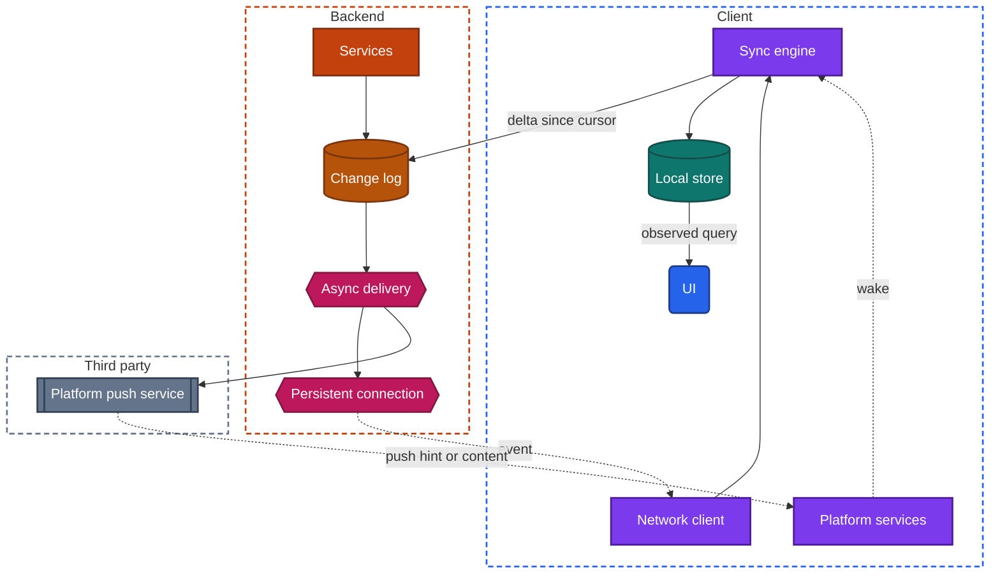
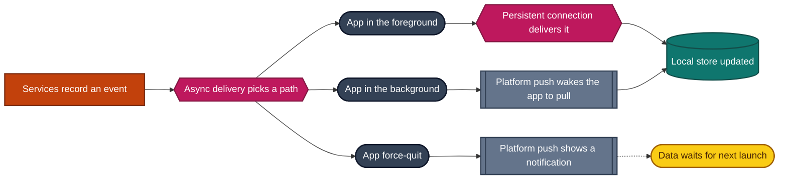
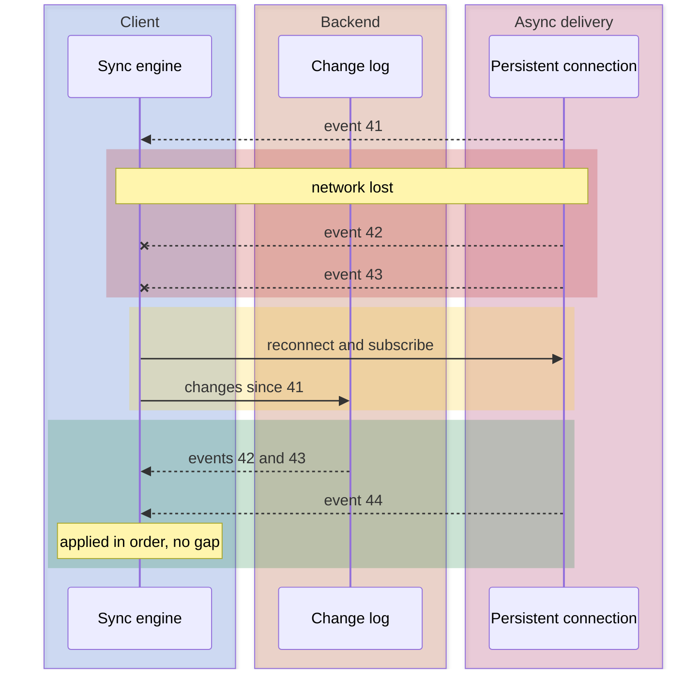

import Probe from '../../../components/Probe.astro';
import Signals from '../../../components/Signals.astro';
import TeardownBar from '../../../components/TeardownBar.astro';
import WorksheetForm from '../../../components/WorksheetForm.astro';

> **The question.** How does new information reach this app without the user asking for it, and what changes when the app leaves the screen?

## 14.1 Why this concern exists

An ordinary request starts on the client. The backend cannot open a conversation with a phone. Something has to change before a message, a price, a driver's position or a collaborator's edit can appear without a tap. Either the client keeps asking, or the client keeps a path open, or the platform carries the event on the app's behalf.

Four of the seven constraints ([Chapter 2](/part-1-method/2-the-mobile-constraint-set/)) decide which of those a team picks.

**Limited resources.** A radio that wakes every few seconds drains the battery. Every mechanism in this chapter is a different trade between latency and the number of times the radio wakes.

**Platform rules.** The operating system suspends an app shortly after it leaves the screen, and the app's own connections stop with it. In the background, the only path the app can count on is the push channel that the platform runs.

**Process death.** A force-quit or reclaimed app has no code running at all. Whatever arrives then is handled by the operating system, not by the app.

**Unreliable network.** A held connection breaks often and silently. Every design that uses one needs a plan for what was missed while it was down.

The result is that almost no app uses one mechanism. It uses one in the foreground, another in the background, and a pull on top of both. A teardown of this concern is a table of app states against mechanisms, not a single word.

## 14.2 The design space

There are six mechanisms. They are ordered here from the simplest to the most capable. The last one is different in kind, because the platform runs it and the app only borrows it.

**Fetch on open or on gesture.** The client asks when a screen opens, when the app returns to the foreground, or when the user pulls to refresh. Nothing arrives unasked. Latency is unbounded: an event waits until the user's next visit. Battery, data and backend cost are the lowest possible. Teams choose this for content that changes slowly or where nobody is waiting, such as a profile, a catalog or a settings screen. It is also the fallback under every other mechanism.

**Polling.** The client repeats a request on a timer. Latency is between zero and one interval, and half an interval on average. Cost is paid whether or not anything changed: every poll wakes the radio and reaches the backend, and most polls return nothing. Polling runs only while the app is in the foreground, or more precisely while the screen that owns the timer is open. Teams choose it when an interval of tens of seconds is acceptable and when the simplicity is worth more than the waste: an order status, a queue position, a dashboard. An adaptive variant shortens the interval while something is in progress and lengthens it when idle.

**Long polling.** The client sends a request and the backend holds it open until it has an event to return, or until a time limit passes. The client then sends the next request at once. Latency is close to that of a real connection. The cost moves to the backend, which holds one open request per client, and to the moment after each event, when the client is briefly not listening. It works wherever an ordinary request works, which is its main attraction. It stops when the app is suspended.

**Server stream.** The client opens one request and the backend keeps the response open, writing events into it as they happen. Data flows one way. Anything the client needs to send goes in separate ordinary requests. Latency is low and per-event overhead is small. The backend holds one open response per client. Teams choose it when the client mostly listens: live scores, prices, the progress of a job, a generated answer that appears word by word. It stops when the app is suspended.

**Persistent connection.** The client and the backend keep one two-way connection open and either side sends at any time. Latency is the lowest of all, in both directions. The costs are the highest. The client needs heartbeats to detect a dead connection, reconnect logic with backoff, and a way to catch up. The backend needs a tier of machines that hold connections, and a registry of which machine holds which device. Teams choose it when the client also sends often and small: chat, typing indicators, live location, shared cursors, multiplayer state. It stops when the app is suspended, apart from narrow exceptions the platform grants, such as an ongoing call ([Chapter 13](/part-2-concerns/13-network-transport-and-resilience/) covers the connection itself).

**Platform push.** The operating system keeps a single connection to its own push service for the whole device. The app's backend hands a message to that service, addressed to a device token, and the service delivers it. This is the only mechanism that works when the app is in the background or has no process. Its battery cost per app is close to zero, because the connection is shared by every app. Its weaknesses are that delivery is best effort, order is not guaranteed, payloads are small, and the platform may delay, merge or drop messages.

Platform push is used in two ways, and telling them apart is one of the main tasks of this chapter.

- **As a push hint.** The message says only that something changed. The app wakes, pulls the change through its normal read path, and then updates its local store and shows a notification if one is due. A push hint that shows nothing to the user is a silent push. The platform rations silent pushes and may skip them in low-power mode or after a force-quit.
- **As the carrier of the content.** The message holds the text to display, and the operating system shows it without running the app. The app's own data is not updated until the app next runs. This is more reliable for getting a notification on screen and worse for having the data ready.

Many apps send both in one message: visible text for the operating system, and a flag asking for a background wake to pull.

| Mechanism | Typical latency | Battery and data cost | Backend cost | Foreground | Background |
|---|---|---|---|---|---|
| Fetch on open or gesture | Until the next visit | Lowest | Lowest | Works | Nothing arrives |
| Polling | Zero to one interval | Constant, even when idle | One request per client per interval | Works | Stops |
| Long polling | About a second | One held request, renewed per event | One held request per client | Works | Stops |
| Server stream | Under a second | One held response | One held response per client | Works | Stops |
| Persistent connection | Under a second, both ways | Heartbeats while open | Connection tier and registry | Works | Stops, with narrow exceptions |
| Platform push | One to several seconds, sometimes far more | Shared by all apps | One call to the push service per device | Works, rarely the main path | The only path |

Like offline levels in [Chapter 12](/part-2-concerns/12-offline-and-sync/), these belong to features and not to apps. One app can hold a persistent connection for its conversations, poll for an order status, and fetch its profile screen only on open.

## 14.3 Anatomy

Figure 14.1 shows a client that combines a persistent connection with platform push, which is the most complete form. Simpler designs remove nodes from it.



*Figure 14.1. A client that receives events over a persistent connection and over platform push.*

Three properties of this figure matter for a teardown.

First, there are two delivery paths and one pull path. Events arrive over the connection or over the push service. Both can lose events. The pull from the change log is what makes the result correct. A design with delivery paths and no pull path loses data, and Section 14.5 shows how to find that out.

Second, the push service is a third party. The app's team does not run it, cannot see inside it, and cannot promise when it delivers. Any feature that depends on it inherits that uncertainty.

Third, every path ends in the same place. A well-built client writes each event to the local store, and the UI redraws from the store ([Chapter 9](/part-2-concerns/9-state-and-ui-data-flow/)). A client that hands events straight to the screen that happens to be open shows a recognizable defect: an event that arrives while you are on another screen is not there when you go back.

### Who owns the connection

A connection or a polling timer belongs either to one screen or to the whole app. The difference is visible. With a screen-owned subscription, a badge on another tab does not change until you open that tab. With an app-owned connection, badges, list previews and the open screen all change together.

## 14.4 Mechanisms across the app's lifecycle

The mechanism in use depends on the state of the app. Figure 14.2 shows the usual arrangement.



*Figure 14.2. The delivery path for one event in each app state.*

**Foreground.** The app holds its own connection, or polls. Platform push still arrives, and the app usually suppresses the visible notification for the screen you are already looking at.

**Background.** The operating system suspends the app within seconds to minutes, and the connection is closed or goes quiet. The backend notices, by a missed heartbeat or an explicit goodbye, and switches to platform push. The push either wakes the app for a short time to pull, or only shows text.

**Force-quit or no process.** There is nothing to wake, or the platform declines to wake it. Only the visible part of a push has an effect. The data arrives when the app is next opened.

Two transitions in this arrangement produce visible effects.

**Going to the background.** There is a window in which the backend still believes the connection is alive. An event sent in that window goes down a dead connection. A design that waits for acknowledgment on the connection, and falls back to push when none arrives, closes the window. A design that does not will drop or delay the first event after you leave the app.

**Returning to the foreground.** The app reconnects and must learn what it missed. This is the subject of Section 14.5.

Some backends skip the choice and send every event on both paths. The client then receives the same event twice and must recognize the repeat. A notification for a message you are reading at that moment is the visible trace of this design with weak suppression on the client.

## 14.5 Reconnect and catch-up

A connection delivers what is sent while it is up. It says nothing about what was sent while it was down. Three designs deal with this.

- **No catch-up.** The client resumes listening and shows only new events. Earlier ones appear when the user refreshes or reopens the screen. This is acceptable for data that expires at once, such as a price, and a defect for data that does not, such as a message.
- **Refetch on reconnect.** The client reloads the current screen's data after each reconnect. This is simple and correct for one screen. It costs a full request every time the network flickers.
- **Catch-up by cursor.** The client tells the backend the last position it holds, and the backend returns everything after it. This is the read path of [Chapter 12](/part-2-concerns/12-offline-and-sync/), triggered by a reconnect instead of a timer. It is the only design that is both complete and cheap.



*Figure 14.3. Catch-up by cursor after a lost connection.*

The order of the two steps in the waiting phase matters. The client subscribes first and pulls second. If it pulled first, an event created between the pull and the subscription would be in neither. Subscribing first means such an event can arrive twice, once live and once in the pull, and a duplicate is harmless when the client checks positions.

```text
function onEvent(event):
  last = lastSeq[event.stream]
  if event.seq <= last:
    return                           // already applied, by the pull or an earlier delivery
  if event.seq > last + 1:
    catchUp(event.stream)            // something is missing, so ask the change log
    return
  transaction(localStore):
    apply(event)
    lastSeq[event.stream] = event.seq   // position saved with the data
  acknowledge(event.stream, event.seq)
```

The same function serves every delivery path. An event from the connection, from a push that carries content, and from a pull all pass through it, so the paths can overlap freely.

A push hint is the degenerate case. It carries no position and no content. It only causes `catchUp` to run.

## 14.6 Ordering, duplicates and delivery guarantees

### Ordering

Events can arrive out of order. Two events take different routes, a retry overtakes a newer event, or a push is delayed. The device clock is no help, because devices disagree about the time.

The standard answer is a sequence number assigned by the backend, per stream: per conversation, per document, per order. The client sorts by it and uses it to detect gaps, as in Section 14.5. A global sequence across all of a user's data is simpler for the client and harder for the backend to scale.

The user's own new items are the exception. They are shown at once, before the backend has assigned a position, so they are placed by local time and moved if needed when the confirmation arrives. An item that shifts position a moment after sending is that reconcile step, described in [Chapter 12](/part-2-concerns/12-offline-and-sync/).

### Delivery guarantees

A delivery path offers one of three guarantees.

| Guarantee | How it is built | What the user can see |
|---|---|---|
| At most once | Send and forget. No acknowledgment, no retry | Events are sometimes missing and never repeated |
| At least once | The receiver acknowledges. The sender retries until it does | Nothing is missing. A repeat appears if the receiver does not check for one |
| Effectively once | At least once, plus a receiver that discards repeats by ID or sequence number | Nothing is missing and nothing repeats |

Exactly-once delivery over an unreliable network does not exist as a transport property. What exists is at-least-once delivery with an idempotent receiver. The reasoning is the same as for the idempotency key on the write path, applied in the other direction.

Platform push is at most once in practice. That is why an app that needs its data to be complete uses push only as a push hint or as a fast preview, and relies on a pull for correctness.

### Acknowledgments

An acknowledgment is a small message that travels back along the path. There are several, and they mean different things.

- **Accepted by the backend.** The sender's mutation is stored. This is the confirmation of [Chapter 12](/part-2-concerns/12-offline-and-sync/).
- **Delivered to a device.** A recipient's client received the event and stored it.
- **Seen by the user.** The recipient opened the screen that shows it.

A messaging app that shows separate marks for sent, delivered and read is displaying these three acknowledgments. Each mark is Observed evidence that the corresponding acknowledgment exists and is itself delivered to the sender in real time. The moment the "delivered" mark appears also tells you something. If it appears while the recipient's app is force-quit, the acknowledgment came from code that ran in the background on receipt of a push, or the backend counts the hand-off to the push service as delivery.

## 14.7 Ephemeral signals

Some events are worth sending and not worth keeping. A typing indicator, an "online" dot, a collaborator's cursor, a moving vehicle on a map, a live viewer count. This chapter calls them ephemeral signals.

They are designed differently from stored events in four ways.

- **Not stored.** They are not written to the change log. A client that was not connected never learns of them. There is nothing to catch up on.
- **At most once.** A lost signal is replaced by the next one, so nobody retries.
- **Expiry on the receiver.** A "started typing" signal is not reliably followed by "stopped typing", because the sender can lose the network between the two. The receiver therefore removes the indicator after a few seconds unless the signal is renewed.
- **Rate limited.** The sender emits at most one signal per interval, not one per keystroke or per sensor reading.

Presence, the knowledge of who is online, works the same way at a larger scale. The backend treats a device as online while it holds a connection or has sent a heartbeat recently. When the connection drops without a goodbye, presence turns off only after the heartbeat time limit. The delay between a force-quit and the "online" indicator going off is that limit, plus any grace period the backend adds to hide brief reconnects.

Ephemeral signals are strong evidence about transport. They need a path from the backend to the client with latency under about a second, they are too frequent for platform push, and they are useless when polled. An app that shows a responsive typing indicator has a held connection of some kind while in the foreground. That is as close to certainty about transport as outside observation gets.

## 14.8 Fan-out

One event usually has more than one destination. Fan-out happens along two axes.

**Many recipients.** A message to a group goes to every member. For a small group, the backend writes the event into each recipient's stream, or looks up each recipient's connections, at the moment of sending. For a very large audience, that is too much work per event. The backend instead publishes to a topic that connected clients subscribe to, sends push to a sample or to nobody, and lets everyone else pull. Features degrade visibly as the audience grows: typing indicators disappear, read marks become counts or vanish, and live counters move in steps because updates are batched.

**Many devices of one user.** Each device has its own connection and its own push token. An incoming event must reach all of them. The user's own actions must also reach the user's other devices: a message sent from the phone has to appear on the tablet, and a conversation read on one device has to lose its unread badge on the other. This second direction is easy to forget, and its absence is easy to see.

Notifications add a third case. When you read an item on one device, a well-built system sends a push to the other devices that removes the notification already shown for it. Stale notifications on a second device mean that read state is not fanned out by push.

Fan-out has an order problem of its own. Devices receive the same event at different times, so two devices of one user briefly disagree. Sequence numbers make them converge on the same order. They do not make them agree at every instant.

## 14.9 What the outside view can and cannot tell you

Be strict about confidence in this chapter. The transport is invisible.

- **Whether updates arrive unasked** is Observed.
- **Polling against a held connection** is Inferred at best. Evenly spread delays up to a fixed maximum indicate a timer. Delays that are always short indicate something held open. A very short polling interval looks like a connection, and a slow backend behind a connection looks like polling.
- **Long polling, a server stream and a persistent connection** cannot be told apart from outside. All three deliver within about a second. Fast two-way ephemeral signals favor a persistent connection, and that claim is still Speculative.
- **Push hint against push that carries content** can be Inferred, by checking whether the app's data is present offline after a notification arrives (P14.5).
- **Catch-up design** can be Inferred from what appears after a reconnect (P14.8).

Write "held connection" on the worksheet when that is all you know. Precision you do not have is worse than a vague true statement.

## 14.10 Probes

All of these need a second device, a second account, or both. Put the two devices side by side and use a stopwatch. Run P14.1 first, because every later probe compares against it. Select the outcome you saw in each probe, and it is recorded in your worksheet for the teardown chosen here.

<TeardownBar />

### P14.1 Foreground latency

<Probe id="P14.1" />

### P14.2 Update rhythm

<Probe id="P14.2" />

### P14.3 Subscription scope

<Probe id="P14.3" />

### P14.4 Background delivery

<Probe id="P14.4" />

### P14.5 Notification, then offline

<Probe id="P14.5" />

### P14.6 Force-quit delivery

<Probe id="P14.6" />

### P14.7 Notification permission off

<Probe id="P14.7" />

### P14.8 Reconnect catch-up

<Probe id="P14.8" />

### P14.9 Second device of one user

<Probe id="P14.9" />

### P14.10 Ephemeral signal expiry

<Probe id="P14.10" />

## 14.11 Signal-to-design table

<Signals chapter={14} />

## 14.12 The backend this implies

Each client mechanism requires specific backend support. Once you have placed a feature, the following can be Inferred.

- **Fetch on open and polling.** Ordinary read endpoints. A cheap way to answer "nothing changed", such as a version check or a delta endpoint, because most polls are wasted. Capacity sized for the number of open apps divided by the interval, whatever the rate of real events.
- **Long polling and a server stream.** Machines that can hold many open requests at once, and an internal way to route an event to the machine that holds the right request.
- **A persistent connection.** A connection tier, separate from the request-handling services. A registry that maps each user and device to the machine holding its connection. Heartbeats and time limits. A plan for deployments, since restarting a machine drops every connection it holds and all those clients reconnect together.
- **Platform push.** A store of device tokens per user, kept current as tokens change and as users sign out. Integration with each platform's push service. Handling of the errors that say a token is dead.
- **Catch-up.** A change log with a position per stream, as in [Chapter 12](/part-2-concerns/12-offline-and-sync/). Without it, the client can only refetch.
- **Delivery choice.** A component that knows, per device, whether a live connection exists, and that picks the connection or the push service. This is async delivery in the universal app model ([Chapter 3](/part-1-method/3-the-universal-app-model/)).
- **Ephemeral signals.** A fast path that skips the backend store and the change log, with presence state held in memory and expired by time.
- **Fan-out.** For small audiences, a write or a lookup per recipient. For large ones, topics that clients subscribe to, and a limit above which per-recipient features are turned off.

Signing out belongs here too. The backend must remove the device's token when the user signs out. A device that still gets notifications for an account that signed out of it shows that the token was not removed.

## 14.13 Failure modes and what they reveal

- **A notification arrives and the app shows a loading state for that item.** Push carries content for display, and the app's data comes only from a pull on open.
- **A notification for something you are already looking at.** The backend sends on both paths, and the client does not suppress the notification for the open screen.
- **The same item appears twice until refresh.** At-least-once delivery with no check for repeats on the client.
- **Items missing after a tunnel or an elevator, present after refresh.** A connection with no catch-up on reconnect.
- **Items out of order that fix themselves on reopening.** The client orders by arrival, and the backend orders by sequence number.
- **A typing indicator that never goes away.** The receiver has no expiry and the "stopped" signal was lost.
- **A contact shown online long after they left.** A long heartbeat time limit, or presence that is cleared only by an explicit goodbye.
- **The first event after leaving the app is late or missing.** The backend had not yet noticed the dead connection and did not fall back to push.
- **Notifications stop after a force-quit.** The feature depends on a silent push that wakes the app, and the platform does not wake a force-quit app.
- **An unread badge that disagrees between two devices.** Read state is not fanned out to the user's other devices, or only on the next pull.
- **A burst of old notifications when the device comes back online.** The push service stored them while the device was unreachable, and the backend did not ask for them to be merged or to expire.
- **Updates stop arriving after the app has been open a long time.** The connection died silently and the client has no heartbeat to notice.

## 14.14 Worksheet entries

These are the fields this chapter adds to the teardown worksheet. Probe outcomes fill some of them in. Complete one set per feature that receives updates.

<TeardownBar />

<WorksheetForm chapters={[14]} />

## 14.15 Summary

- There are six mechanisms: fetch on open or gesture, polling, long polling, a server stream, a persistent connection and platform push. They belong to features, not to apps.
- An app's own connections work only in the foreground. Platform push is the only path in the background, and after a force-quit only its visible part has an effect.
- Platform push is either a push hint that triggers a pull or the carrier of the content. Opening the app offline after a notification separates the two.
- Delivery paths lose events. A pull by cursor from the change log is what makes the result complete, and the client subscribes before it pulls.
- Sequence numbers from the backend give order and expose gaps. At-least-once delivery plus a receiver that discards repeats is the practical guarantee.
- Ephemeral signals are sent and never stored. They expire on the receiver, and a responsive one is the best outside evidence of a held connection.
- Fan-out runs across recipients and across one user's devices. The second is the one that reveals itself through stale badges and notifications.
- The transport cannot be identified from outside. Polling against a held connection is Inferred from the rhythm of delays, and the kind of held connection stays Speculative.
