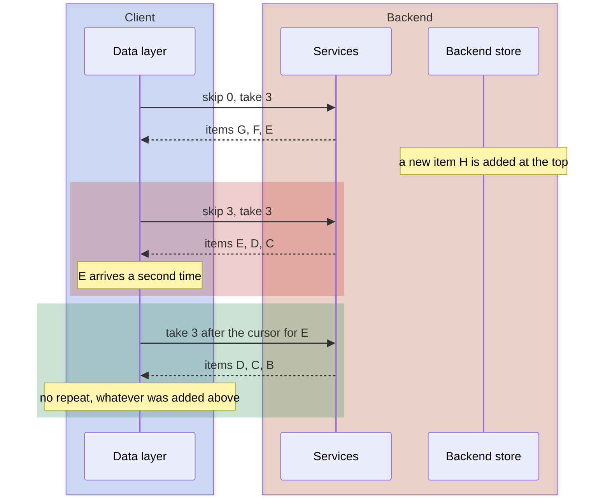
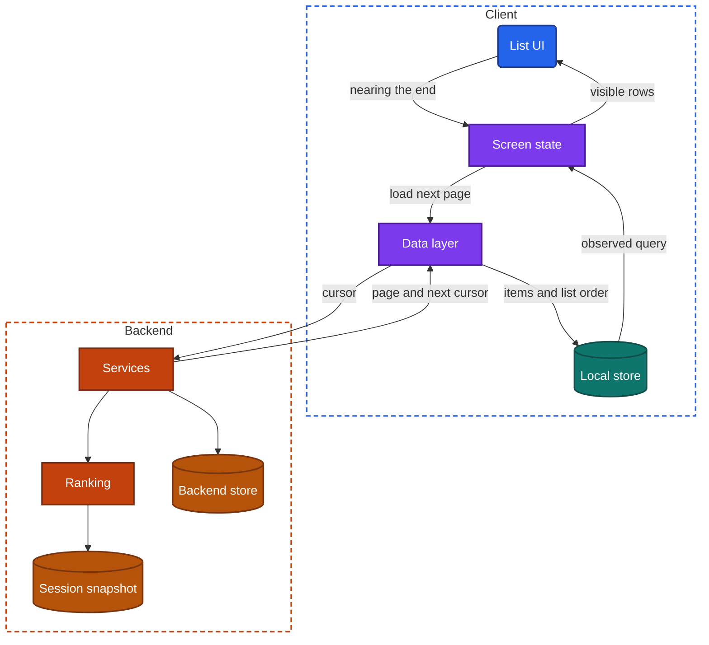
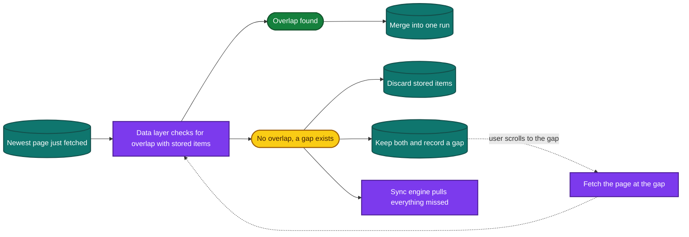

import Probe from '../../../components/Probe.astro';
import Signals from '../../../components/Signals.astro';
import TeardownBar from '../../../components/TeardownBar.astro';
import WorksheetForm from '../../../components/WorksheetForm.astro';

> **The question.** How does this app load a list that is too long to load at once, what decides its order, and how does it stay fresh without moving under the user?

## 15.1 Why this concern exists

Most screens in most apps are lists. A list of ten items is a single request. A list of ten thousand, or one with no end, is a design problem, and four of the seven constraints ([Chapter 2](/part-1-method/2-the-mobile-constraint-set/)) shape it.

**Limited resources.** The whole list cannot be downloaded, held in memory or drawn. The client takes it in pieces, and the screen holds views only for the rows in sight.

**Unreliable network.** Every piece is a separate request that can be slow or fail. The list has to stay usable with some pieces present and others not.

**Human attention.** The user is reading the list while it loads and while it changes. Content that jumps, repeats or disappears under a thumb is noticed at once.

**Process death.** A user who was three hundred items deep expects to still be there after answering a call. The position, and the items around it, must survive somewhere.

Underneath these sits one fact that makes the problem hard. The list is not still. Items are added, removed and reordered on the backend while the client walks through it page by page. Each paging design is a different answer to what the next page means when the list has changed since the last one.

## 15.2 The design space: how the next page is asked for

There are three ways to ask for the next page. They differ in what the client sends.

**Offset paging.** The client sends a position and a count: skip 40 items, return 20. It is the simplest design on both sides, and it is the only one that can jump to an arbitrary page. Its weakness is that positions shift when the list changes. If three items are added at the top between two requests, the next page starts three items too early and repeats three items the user has seen. If three items are removed, the next page starts three items too late, and three items are never shown. The backend cost also grows with depth, because the store must walk past everything that is skipped.

**Cursor paging.** The backend returns a cursor with each page, and the client sends it back to get the page that follows. The cursor marks a place in the list, not a count from the top, so changes before that place do not shift the next page. The client cannot jump ahead, because it has no cursor for a page it has not reached. A cursor may expire.

**Keyset paging.** The client sends the sort key of the last item it holds: return 20 items older than this timestamp. It has the stability of a cursor and needs nothing stored on the backend. It requires a sort order that is total and stable, so a tie-breaker such as the item ID is added to the key. It behaves badly when an item's sort key changes. In a list sorted by latest activity, an item that receives activity moves to the top while the user is paging toward it, and the user may see it twice or think they missed it.

Cursor paging and keyset paging cannot be told apart from outside. A cursor is very often a sort key with a wrapper around it. Record them together.

| Method | The client sends | Items added above the position | Items removed above the position | Jump to any page | Backend cost at depth |
|---|---|---|---|---|---|
| Offset paging | A count to skip | The next page repeats items | The next page skips items | Yes | Grows with depth |
| Cursor paging | The cursor from the last page | No effect | No effect | No | Constant |
| Keyset paging | The last item's sort key | No effect | No effect | No | Constant |



*Figure 15.1. The same insertion under offset paging and under cursor paging.*

### A client can hide the repeat and not the skip

Many clients drop any incoming item whose ID is already in the list. That hides the duplicate that offset paging produces. The page then appears to hold fewer new items than usual, which is a fainter signal. A skipped item cannot be hidden by the client, because the client never receives it. This is why P15.4, which removes items, is a more reliable test of offset paging than P15.3, which adds them.

### Page size and when the next page is requested

Page size is a trade between the number of requests and the cost of each. A small page gives a fast first paint and many round trips. A large page wastes data when the user leaves after three items. Many apps use a small first page and larger later ones, or pick the size from the screen height.

The moment of the request matters as much as the size. A client that asks only when the last item is on screen shows a loading indicator at the end of every page. A client that asks when the user is still some distance from the end hides the wait at normal scrolling speed. The indicator then appears only during a fast fling or on a weak connection. This is prefetching applied to a list ([Chapter 11](/part-2-concerns/11-local-storage-caching-and-prefetching/)).

### How paging is shown

| Presentation | What the user does | When a team chooses it |
|---|---|---|
| Endless scroll | Nothing. The next page loads on approach | Browsing with no target, where stopping points are unwanted |
| Load-more control | Taps to load the next page | Lists with a footer worth reaching, or where each page is costly |
| Explicit pages | Picks a page number | Search results and catalogs, where position must be shareable and a total is known |
| Everything at once | Nothing. The list is complete | Short lists, or a local replica that already holds the data |

Presentation hints at the method and does not settle it. Explicit page numbers need a method that can jump, which favors offset paging. Endless scroll works with any method.

## 15.3 Anatomy

Figure 15.2 shows the components of a paged list that is also stored on the device.



*Figure 15.2. The components of a paged list.*

The paging state is small: the items loaded so far, the cursor for the next page, whether a request is in flight, and whether the end has been reached. Most list bugs are errors in this state.

```text
function loadNextPage(list):
  if list.loading or list.reachedEnd: return     // a second trigger must not start a second request
  list.loading = true
  match backend.page(list.query, list.nextCursor):
    Page(items, nextCursor):
      transaction(localStore):
        store.upsert(items)                       // by ID, so a repeat replaces and never duplicates
        store.appendOrder(list.id, items)
        list.nextCursor = nextCursor
      list.reachedEnd = (nextCursor is none)
    Failed:
      list.showRetryRow = true                    // the loaded items stay on screen
  list.loading = false
```

Two details in this function are visible from outside. The guard on the first line prevents two requests for the same page, and a list without it shows a whole page twice after a fast scroll. The failure branch decides what a failed page looks like: a retry row at the end of the list, an indicator that spins forever, or an error that replaces everything already loaded.

## 15.4 Time-ordered lists and ranked feeds

A list is either ordered by a property of its items or ranked by the backend for this user at this moment. The two cannot be paged the same way.

**A time-ordered list** has a sort key that every item carries and that does not depend on who asks or when. A conversation, a transaction history and a notification list are of this kind. Cursor paging or keyset paging works directly. Page two means the same thing an hour later.

**A ranked feed** has no such key. The backend scores candidate items for this user, and the score depends on what the user has seen, what has happened since, and the model in use that day. Ask twice and the order differs. "The 20 items after item X" has no meaning, because X has no fixed neighbors. A ranked feed needs something extra to make paging coherent, and there are three common answers.

- **Session snapshot.** On the first request, the backend ranks a few hundred candidates, stores that ordered list under a session ID, and pages through it by cursor. The order is frozen for the life of the snapshot. Paging is stable and cheap. The feed cannot react to what the user does within the session.
- **Rank each page, exclude what was shown.** Each request means "the best items not yet shown". The backend tracks what it has served, or the client sends what it holds. The feed adapts as the user scrolls. There is no stable page two, and a repeat appears whenever the record of shown items fails.
- **A list of IDs first.** The backend returns a long ordered list of item IDs at once, and the client fetches the items themselves a page at a time. The order is frozen on the client. This is a session snapshot held on the device.

These three are hard to separate from outside. What can be seen is ranking stability: whether the order holds when the same feed is requested again.

### Ranking stability on refresh

A refresh of a ranked feed is a new ranking request. The usual result is new content at the top, with items already seen pushed down or removed. This is by design: the user asked for something new.

It has a consequence for returning to a feed. The backend cannot give back the feed the user was reading, because that ordering no longer exists there, or exists only until the snapshot expires. A ranked feed that restores its exact content after process death has stored the loaded items on the device. A ranked feed that returns to the top with different content has not, or has chosen not to after some time away.

## 15.5 Keeping a list fresh

New items appear at the head of the list while the user is looking at it or is away from it. There are four ways to bring them in.

| Design | How new items arrive | What it does to the reader |
|---|---|---|
| Pull to refresh, replace | The gesture refetches the first page and discards the rest | Position and deeper pages are lost. Always consistent |
| Pull to refresh, prepend | The gesture fetches items newer than the top item | Position is kept. Can leave a gap, as Section 15.6 explains |
| New-items control | The client learns that new items exist and shows a control. A tap inserts them and scrolls up | Nothing moves until the user asks |
| Silent merge | Items are inserted as they arrive | Safe at the top or in a conversation. Elsewhere it needs position correction |

The new-items control exists because of the human attention constraint. Inserting rows above what the user is reading pushes that content down the screen. A control that says new items are waiting lets the user decide when the list moves. To show it, the client has to know that new items exist without displaying them, which means a poll for a count or an event over a held connection ([Chapter 14](/part-2-concerns/14-real-time-delivery/)).

Silent merge is correct where the user expects movement. In a conversation, a new message appears at the end and the view follows it if the user was already at the end. If the user had scrolled back, a well-built client leaves the view where it is and shows a marker for the new message.

When rows are inserted above the visible area, the client must adjust the scroll offset by the height of what was inserted. A list that jumps when older or newer content loads in is missing this correction.

## 15.6 Gaps and paging in two directions

### Gaps after an absence

Suppose the device holds a time-ordered list up to yesterday evening. The user opens the app and the client fetches the newest page. If more than one page of items arrived overnight, the newest page and the stored items do not meet. There is a gap between them.



*Figure 15.3. What a client can do when the newest page does not meet the stored items.*

A client has three options when it finds a gap.

- **Discard the stored items.** The list becomes the newest page, and older content loads again by paging. This is the simplest choice, and it means the stored list was only a cache of the first screen.
- **Keep both runs and record the gap.** The list shows the new run, then a gap row, then the old run. Reaching or tapping the gap row fetches the page that belongs there, and this repeats until the runs meet. The stored items keep their value, at the price of real bookkeeping.
- **Pull everything that was missed.** A sync engine reads the change log from its cursor until it is current, so no gap ever forms. This is the local replica of [Chapter 12](/part-2-concerns/12-offline-and-sync/), and it is what a messaging app does for conversations.

A client that does none of these and joins the two runs anyway shows a list with a silent hole in it. Nothing on screen marks the hole. Only the timestamps on either side give it away.

### Paging around an anchor

Some lists are entered in the middle. A search result opens a conversation at a message from last year. A link lands on one comment in a long thread. A list reopens at the last item read. This chapter calls the item where the list is entered the anchor.

The client asks for a window of items around the anchor and receives two cursors, one for each direction. The list now has two loading edges, and each behaves as Section 15.2 describes. Three extra problems appear.

- **Position when loading backward.** Items added before the visible content must not push it down. This is the same correction as in Section 15.5, and it is where most visible jumps come from.
- **Getting back to the newest item.** A "jump to latest" control either loads every page between the window and the end, or drops the window and loads the newest page. The second is faster and leaves a gap of the kind just described.
- **Live items.** A new item arrives while the user is in an old window. It belongs at the end, which is not loaded. The client has to hold it or drop it, and must not append it to the window.

An app that cannot page backward handles the same request in a cruder way. It loads from the newest item down to the target, which takes a long time for an old target, or it shows the target alone on a separate screen.

## 15.7 Rendering cost and scroll position

### Recycling and windowing

A list screen creates views only for the rows in sight, plus a few on each side, and reuses them as rows scroll off. This is view recycling. Its traces are brief: a row that shows the previous row's image for an instant, or blank rows during a very fast fling when binding cannot keep up.

Very long lists apply the same idea to data. The client keeps a window of pages in memory and drops pages far from the viewport. Scrolling a long way back then shows loading states again for content that was on screen minutes earlier. If that content returns at once and works offline, the dropped pages are being read back from the local store. If it loads from the network, they are not stored.

### Placeholders and the scroll indicator

A placeholder is a row drawn before its data arrives. It tells you what the client knew in advance.

- **Placeholders for a first screen only.** The client knows nothing about the list. It draws a fixed number of generic rows.
- **Placeholders throughout, with a scroll indicator that does not change size.** The client knows the total number of rows before it has their data, and has reserved space for each. This allows a jump to any position, as in a photo grid with a date scrubber or a contact list with an index down the side. It implies a count or a full list of IDs delivered up front.
- **A scroll indicator that shrinks and jumps back as pages load.** The total is unknown and the list grows with each page.

### Keeping scroll position

Scroll position has to survive three events of increasing difficulty.

1. **Going to a detail screen and back.** The list screen is still in memory. A reset here means the list is rebuilt or refetched on every return.
2. **Leaving the app and returning with the process alive.** Nothing was lost, so a reset here is a choice. Many feeds refresh after a set time away, on the view that the old content is no longer worth resuming.
3. **Process death.** The saved position is an item ID and an offset, kept in saved screen state ([Chapter 8](/part-2-concerns/8-navigation-deep-links-and-screen-state/)). It is useful only if the items around it can be shown again. For a time-ordered list they can be fetched again by anchor. For a ranked feed they must have been stored on the device, as Section 15.4 explains.

From outside, the last two are hard to separate. A reset after a long absence fits both a freshness time limit and process death with no restore. A force-quit is not a substitute for process death here, because most platforms treat a force-quit as a request to discard saved screen state.

## 15.8 Stored pages, and the list against its detail screen

### Storing pages on the device

A list can be stored in two shapes ([Chapter 11](/part-2-concerns/11-local-storage-caching-and-prefetching/)).

- **Stored responses.** Each page is kept as it arrived. This is a cache. It gives a fast first screen through stale-while-revalidate, and it goes wrong when pages fetched at different times no longer fit together.
- **Stored items and a stored order.** Items are kept once each, by ID, and the list is a separate ordered set of IDs. Pages merge into one run, gaps can be recorded, and an item that appears in several lists exists once.

The second shape is what makes a list consistent with the rest of the app.

### List and detail

The same item appears as a row in a list and as a full screen of its own. When the user changes it on the detail screen and goes back, the row is either current or stale.

- **One copy.** List and detail both read the item from one store, and both observe it. A change shows in both at once. This is the single source of truth design of [Chapter 9](/part-2-concerns/9-state-and-ui-data-flow/).
- **Two copies.** The list holds what the list endpoint returned, and the detail holds what the detail endpoint returned. A change on one does not reach the other until a refetch.
- **Refetch on return.** The list reloads whenever it reappears. It is always current, at the cost of a request, a flash of loading and often the scroll position.

The same test applies across lists. An item liked in one feed should show as liked in a search result and on a profile. Where it does not, each list holds its own copy.

Counts are a special case. A row may show a comment count of 12 while the detail screen shows 14 comments. The count in the row came with the list page some time ago, and the detail screen counted what it loaded. This is two copies with different ages, and it is common even in apps that are otherwise consistent.

## 15.9 Probes

Run P15.1 and P15.2 on every list of interest. They take a minute and need nothing else. P15.3, P15.4 and P15.6 need a second device or account that can add and remove items in the list. Select the outcome you saw in each probe, and it is recorded in your worksheet for the teardown chosen here.

<TeardownBar />

### P15.1 Scroll rhythm

<Probe id="P15.1" />

### P15.2 Page size

<Probe id="P15.2" />

### P15.3 Insert while scrolling

<Probe id="P15.3" />

### P15.4 Remove while scrolling

<Probe id="P15.4" />

### P15.5 Refresh a ranked feed twice

<Probe id="P15.5" />

### P15.6 New items while reading

<Probe id="P15.6" />

### P15.7 Leave and return

<Probe id="P15.7" />

### P15.8 Gap after absence

<Probe id="P15.8" />

### P15.9 Landing mid-list

<Probe id="P15.9" />

### P15.10 List against detail

<Probe id="P15.10" />

## 15.10 Signal-to-design table

<Signals chapter={15} />

## 15.11 The backend this implies

Each client design requires specific backend support ([Chapter 10](/part-2-concerns/10-api-shape/) covers the shape of the endpoints themselves). Once you have placed a list, the following can be Inferred.

- **Offset paging.** Nothing beyond a query with a skip and a limit. A total count is usually returned as well, which is itself a query whose cost grows with the list.
- **Cursor paging and keyset paging.** An index on the sort key with a unique tie-breaker. Cursors that are either self-contained or stored with a lifetime. A defined answer for a cursor that has expired.
- **A ranked feed.** A candidate source, a ranking step, and a record of what each user has been shown. For a session snapshot, a store of ranked lists per session with an expiry time.
- **A new-items control.** A cheap way to ask how many items are newer than a given one, or an event sent over a held connection.
- **Gap filling.** Paging in both directions from any item, so that a gap can be closed from either side.
- **Anchored entry.** An endpoint that returns a window around an item ID, with a cursor for each direction.
- **Placeholders throughout.** A count, or the full ordered list of IDs, delivered before the items.
- **Totals.** An exact count on a large changing list is expensive. A total shown as a rounded figure or with a plus sign after a limit indicates an estimated or capped count.

Removed and hidden items raise a requirement of their own. When the backend filters a page after fetching it, for blocked accounts or removed content, the page comes back short. The client must not read a short page as the end of the list. A backend that signals the end explicitly, by returning no next cursor, avoids this.

## 15.12 Failure modes and what they reveal

- **The same item twice, a page apart.** Offset paging with an insertion in between, and a client that does not drop repeats by ID.
- **The same item twice in a ranked feed.** The record of shown items failed, or candidates from two sources were merged without a check.
- **A whole page repeated.** Two requests for the same page were sent, because the paging state has no guard against a second trigger.
- **An item that another device shows and this one never did.** A skip. Offset paging with a removal in between.
- **The list ends early, and a refresh reveals more.** A short page after filtering on the backend was read as the end of the list.
- **An indicator at the end that spins forever.** A failed page request with no retry row and no error state.
- **Content jumps while you read.** Rows were inserted above the viewport without correcting the scroll offset, or rows changed height when their images loaded.
- **Back from a detail screen, the list is at the top.** The list is rebuilt or refetched on return.
- **A feed that cannot be found again.** A ranked feed whose loaded items are not stored, so a restart produces a different one.
- **A hole in the timeline.** A gap after a long absence that the client joined without recording.
- **A row that disagrees with its detail screen.** Two copies of the item, one per endpoint.
- **Blank rows during a fast fling.** View recycling is working, and binding or image decoding cannot keep up with the scroll.

## 15.13 Worksheet entries

These are the fields this chapter adds to the teardown worksheet. Probe outcomes fill some of them in. Complete one set per list, since one app usually holds lists of several kinds.

<TeardownBar />

<WorksheetForm chapters={[15]} />

## 15.14 Summary

- A next page is asked for by offset, by cursor or by the last item's sort key. Offset paging repeats items after an insertion and skips items after a removal. The other two do neither and look the same from outside.
- A client can hide repeats by dropping known IDs. It cannot hide skips, so removing items is the stronger test.
- Page size, and how far from the end the next request is sent, show in the rhythm of loading indicators.
- A time-ordered list has a stable sort key. A ranked feed does not, and needs a session snapshot, exclusion of shown items or a list of IDs up front to page coherently.
- Lists are kept fresh by pull to refresh, a new-items control or a silent merge. The control exists so that content does not move under the reader.
- After a long absence the newest page may not meet the stored items. The client discards, records a gap and fills it, or pulls everything through a sync engine.
- A list entered at an anchor pages in both directions and must hold its position while content loads on either side.
- Recycling, placeholders and the scroll indicator show what the client knows about the list in advance. Scroll position after process death needs the items as well as the offset.
- One stored copy of each item keeps a list and its detail screen in agreement. Two copies show as a stale row.
