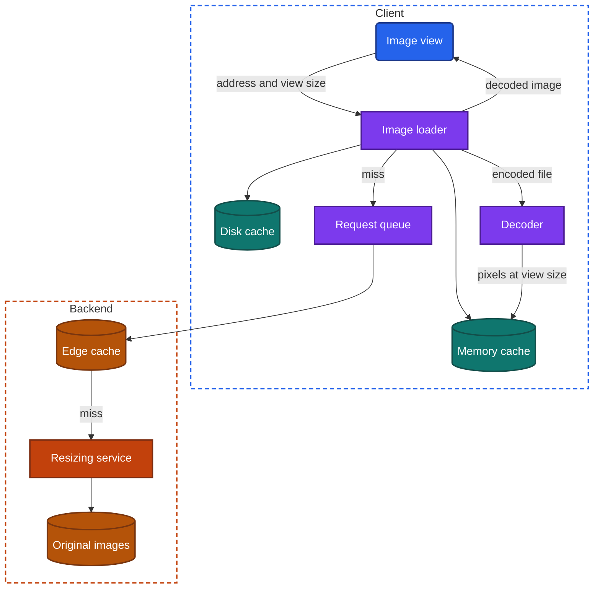
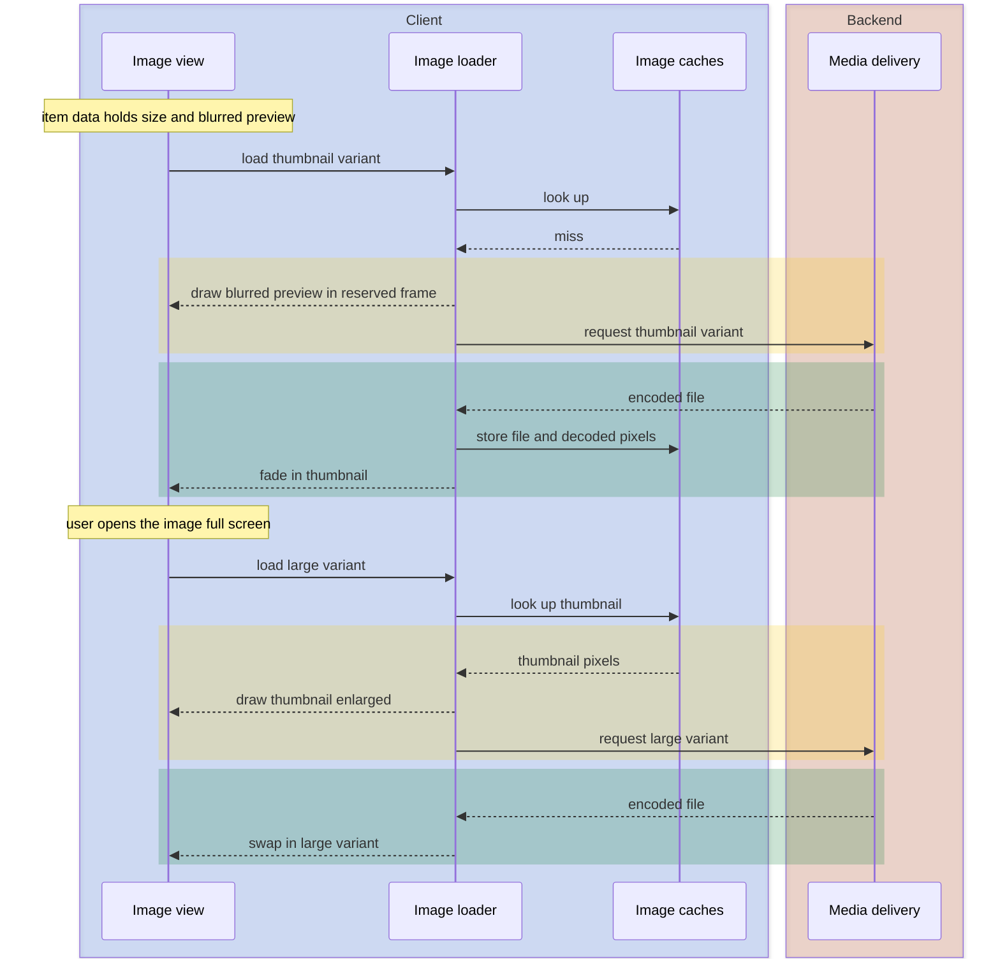

import Probe from '../../../components/Probe.astro';
import Signals from '../../../components/Signals.astro';
import TeardownBar from '../../../components/TeardownBar.astro';
import WorksheetForm from '../../../components/WorksheetForm.astro';

> **The question.** How does this app size, fetch, decode, cache and display its images?

## 16.1 Why this concern exists

In most apps, images are the largest share of the bytes that cross the network and the largest share of the memory the process holds. Three of the seven constraints ([Chapter 2](/part-1-method/2-the-mobile-constraint-set/)) meet here.

**Limited resources** applies four times over. An image costs mobile data to fetch, storage to keep, processing power to decode and memory to hold. The memory cost is the one that surprises. An image file is compressed. To draw it, the client must decode it into raw pixels, and raw pixels take about four bytes each. A photo of 4,000 by 3,000 pixels is a file of a few megabytes and a decoded image of 48 megabytes. An avatar drawn at 360 by 360 pixels needs half a megabyte. A client that decodes the full photo to draw the avatar spends about a hundred times the memory the screen needs, and a list of such rows ends in process death.

**Unreliable network** means an image arrives late, partly, or not at all. A screen of twenty images is twenty requests, and on a weak connection they arrive over many seconds.

**Human attention** means the screen cannot wait for them. Text is ready first. The app must decide what to draw where each image will be, and how to bring the image in without moving what the user is already reading.

So every app takes a position on five stages, and this chapter follows them in order:

1. **Sized.** Which pixel dimensions exist for each image, and who chooses.
2. **Fetched.** Which requests are made, in what order, and which are dropped.
3. **Decoded.** At what size, and where the work runs.
4. **Cached.** What is kept in memory and on disk, and for how long.
5. **Displayed.** What the user sees before, during and after arrival.

This chapter covers still images that the app downloads and shows. Moving media belongs to [Chapter 17](/part-2-concerns/17-audio-and-video-playback/). The general theory of caches and read policies is in [Chapter 11](/part-2-concerns/11-local-storage-caching-and-prefetching/), and this chapter applies it.

## 16.2 The design space

### How many sizes exist

The same image is drawn at many sizes. It is an avatar in a list, a card in a feed and a full screen when tapped. Screens also differ in pixel density. A view that is 100 layout units wide needs 200 pixels on one device and 300 on another. The first design question is how many versions of each image the backend can serve. This book calls each version a **variant**: one image at one size, format and quality.

**One stored size.** The backend stores the file that was uploaded and serves it everywhere. The client shrinks it on the device. This costs nothing to build. It wastes data on every small view, and it wastes memory unless the client is careful about decoding (Section 16.5). Teams choose it early, or when images are few and small, such as icons in a settings list.

**A fixed set of variants.** At upload, the backend produces a small set of sizes, for example a thumbnail, a medium and a large. The item's data carries an address for each, and the client picks the closest one. This is cheap to serve, since every variant is a plain file. Its weakness is slow release. A new layout that needs a size outside the set either wastes bytes or looks soft, and old variants must be regenerated for every stored image when the set changes.

**Variants on request.** The client states what it needs in the image address: a width, a format, a quality. Media delivery produces that variant from the original the first time anyone asks and caches the result. Any layout on any density gets a close fit. The cost is a resizing service, and a need to limit the sizes clients may ask for. Without a limit, every distinct width is a new variant to compute and store, and a hostile client can ask for millions of them. Most teams therefore round requests to a ladder of allowed widths.

| Design | Who picks the size | Bytes wasted | Backend cost | Observable signature |
|---|---|---|---|---|
| One stored size | Nobody | High on small views | None | Small images load as slowly as large ones. Zooming never gets sharper |
| Fixed set of variants | Client, from a short list | Moderate | Storage for each variant | Thumbnails are fast. Zoom swaps to a sharper image once |
| Variants on request | Client, by view size and pixel density | Low | A resizing service and edge caches | Images are sharp at every size, on every device |

From outside, the first design separates clearly from the other two. The second and third are harder to tell apart, since both produce a small image in the list and a larger one on zoom. A claim that an app resizes on request is Speculative unless you can compare two devices of very different pixel density and see that each receives a fitting image.

### Formats and quality

A variant also has a format and a quality setting. Formats differ in capability, and four capabilities matter.

- **Compression efficiency.** Newer formats produce a file 25 to 50 percent smaller than the oldest widely supported photo format at the same visible quality. Not every device can decode them.
- **Transparency.** Needed for logos, stickers and cut-out product shots. Photo formats without it are smaller.
- **Animation.** Short loops can be stored as animated images or as silent video. Video is far smaller and decodes with hardware support, so many apps serve "animated images" as video.
- **Scaling without loss.** Icons and illustrations drawn as shapes stay sharp at any size and are tiny. They ship inside the app or arrive as shape descriptions.

Because support varies by device and by operating system version, the choice of format is a negotiation. The client declares which formats it can decode, in the request or in the address, and media delivery answers with the best one it has. The same image address can therefore return different bytes to different devices.

Quality is the second lever. The backend can lower it for small variants, where artifacts are invisible, and the client can ask for less when data-saver mode is on or the connection is poor. [Chapter 36](/part-2-concerns/36-constrained-devices-and-networks/) covers how apps change for cheap phones and poor networks more broadly.

Format is close to invisible from outside. You can see its effects in data use and in loading speed, and a claim about which format an app uses is Speculative.

## 16.3 Anatomy

Figure 16.1 shows the components. On the client they form one pipeline, usually called an image loader, which sits in the data layer of the universal app model ([Chapter 3](/part-1-method/3-the-universal-app-model/)). On the backend they are all part of media delivery.



*Figure 16.1. The image pipeline on the client and in media delivery.*

### The load path

An image view hands the loader an address and its own size. The loader does the rest.

```text
function load(address, view):
  size = view.sizeInPixels()                  // layout size times pixel density
  key = cacheKey(address, size)
  if memoryCache.has(key):
    return view.show(memoryCache.get(key))    // same frame, so no stand-in and no fade
  view.show(standIn(view.item))
  request = queue.enqueue(address, priority: Visible)
  view.onRecycled: queue.cancel(request)      // the row left the screen
  file = diskCache.get(address) or fetchAndStore(address)
  pixels = decode(file, downsampleTo: size)   // off the thread that draws the UI
  memoryCache.put(key, pixels)
  if view.item.address == address:            // the view may show another item by now
    view.fadeIn(pixels)
```

Each line of this function has a visible effect, and the rest of the chapter takes them one at a time.

### Two caches with different contents

[Chapter 11](/part-2-concerns/11-local-storage-caching-and-prefetching/) describes a memory cache and a disk cache. The image pipeline has both, and they hold different things.

The **disk cache** holds encoded files, exactly as they arrived, keyed by address. It is compact, it survives process death, and reading from it still costs a decode.

The **memory cache** holds decoded pixels, keyed by address and target size. It answers within a frame. It is large for what it holds, so it is bounded to a fraction of the memory the operating system allows the process, and it is emptied on a memory warning and at process death.

Three consequences follow, and each is visible.

First, an image has three speeds. From the memory cache it appears in the same frame as the screen, with no stand-in. From the disk cache it appears after a brief stand-in, typically well under a tenth of a second. From the network it appears when the network allows. Returning to a screen you just left shows the first. Opening the app after a force-quit shows the second.

Second, the image disk cache is usually a separate store from the cache of API responses, with its own bound and its own eviction. Images and text therefore age differently. A screen visited offline often shows images with no text, or text with no images. Record them separately.

Third, images are cached by address, and well-run media delivery never changes the content behind an address. A changed image gets a new address. The client can then keep an image indefinitely with no time limit and no validator, which is why image caches are the most aggressive caches in an app. The failure case is an avatar that stays old after it was changed: the address was reused.

### Media delivery near the user

An image request does not go to the gateway. It goes to media delivery, which keeps copies of popular variants on servers in many regions. This book calls such a copy an **edge cache**. A request is answered from the nearest location that holds the variant. Only a miss travels on to the resizing service and the original.

You cannot see an edge cache directly. You can see its shadow. Images often keep loading during a backend incident in which every other screen shows errors, because media delivery is a separate system with separate capacity. A newly uploaded image is sometimes slow on its first view and fast for everyone afterwards, because the first view produced the variant.

Private images complicate this. An edge cache serves anyone who presents the address, so apps protect private images with addresses that are hard to guess, that carry a signature, or that expire. An expiring address has a visible failure: a screen left open for hours shows broken images when scrolled, until the item data is refetched with fresh addresses. [Chapter 21](/part-2-concerns/21-security-and-trust/) covers what the backend refuses to trust the client with.

## 16.4 What shows before the image arrives

Between the moment a view appears and the moment its pixels are ready, something is drawn in its place. This book calls it the **stand-in**. The choice is one of the most visible design decisions in an app, and it tells you what the item data carries.

| Stand-in | What the item data must carry | Cost | What you see |
|---|---|---|---|
| Blank or flat color | Nothing | None | The same gray box for every image |
| Dominant color | One color value per image | A few bytes, computed at upload | Each box has a different tint that matches the image to come |
| Blurred preview | A very small encoded version, a few dozen bytes | Computed at upload, decoded on the client | A soft, blurred version of the real image, present at once, even offline |
| Low resolution first | The address of a small variant | A second request per image | A coarse image arrives quickly and is replaced by a sharp one |

The first three need no request for the stand-in. The dominant color and the blurred preview travel inside the item's data, with the list response. This is why a blurred preview can appear in airplane mode for an image the device has never fetched: the preview came with the text.

The fourth design fetches twice. It is common on detail and zoom screens, where the small variant is already in the memory cache from the list. Shown enlarged, it serves as an instant stand-in while the large variant loads. This is seeding ([Chapter 11](/part-2-concerns/11-local-storage-caching-and-prefetching/)) applied to pixels.

A separate matter is how the image file itself fills in once bytes start to arrive. There are three patterns.

- **All at once.** The loader waits for the complete file, decodes it and shows it, often with a short fade.
- **Top to bottom.** The file is stored row by row, and the client draws rows as they arrive. On a weak connection the image unrolls downward.
- **Coarse to sharp.** The file is stored as several passes of increasing detail. This book calls it a **progressive image**. The whole picture appears soft after a fraction of the bytes and sharpens in steps. The file is one request, unlike low resolution first.

Coarse to sharp and low resolution first look alike. They separate on a weak connection: a progressive image sharpens in several small steps, and a variant swap is one jump.

### Reserving space

The stand-in needs a size before the image arrives. If the item data carries the image's dimensions or aspect ratio, the client lays out the final frame at once and nothing moves later. If it does not, the view starts at zero or at a guessed height and the content under it jumps when the image lands. A feed whose rows hold still while images arrive has dimensions in its API. A feed that jumps does not, and the jump is a classic cause of taps that land on the wrong item.

Figure 16.2 puts the stages together for a list row and a later zoom.



*Figure 16.2. A blurred preview, a thumbnail and a later swap to a large variant.*

## 16.5 Decoding and memory

Decoding turns a compressed file into pixels. It costs processing time in proportion to the pixels in the file and memory in proportion to the pixels produced. Two decisions control both.

**Decode at the view size.** Most decoders can produce a smaller output than the file holds, skipping work as they go. This is **downsampling**. A loader that downsamples to the view size makes the one-stored-size design survivable: the bytes are still wasted, and the memory is not. A loader that does not downsample holds the full image and lets the UI shrink it at draw time. The result looks the same and costs many times the memory.

**Decode away from the UI.** Decoding a large image takes tens of milliseconds, which is several frames. A loader that decodes on the thread that draws the UI makes scrolling hitch each time an image arrives. A loader that decodes on other threads keeps scrolling smooth and shows images slightly later.

Neither decision is directly visible. Their failures are.

- **Scrolling stutters as images arrive, and is smooth once they are loaded.** Decoding, or resizing at draw time, runs on the UI thread.
- **The app is ended while you browse an image-heavy screen, and reopens at its first screen.** Memory use reached the operating system's limit. Oversized decoded images are the usual cause.
- **Images you just saw redraw from stand-ins after you visit another heavy app.** The memory cache was emptied on a memory warning, which is the correct response. The disk cache refills it.
- **An older or cheaper device shows the second failure and a newer one does not.** The same pixels cost the same memory on both, and the limit differs.

Animated images multiply the problem, since every frame is a decoded image. Loaders decode frames on demand and keep only a few, or the app serves the animation as video and gives the work to the hardware decoder.

[Chapter 35](/part-2-concerns/35-performance-and-resource-budgets/) covers how an app spends time, battery, memory, data and storage as budgets. Images are usually the largest line in the memory budget.

## 16.6 Images in fast-scrolling lists

A list is where the pipeline is stressed. [Chapter 15](/part-2-concerns/15-lists-feeds-and-pagination/) explains view recycling: a small set of row views is reused for whichever items are in sight. A fast scroll passes hundreds of items through a dozen views in a few seconds. Each binding starts an image load, and most of those loads are for rows that leave the screen before the image arrives.

Four mechanisms deal with this. They build on the request queue of [Chapter 13](/part-2-concerns/13-network-transport-and-resilience/).

**Cancellation.** When a row is recycled, its pending request is dropped. Without it, the queue fills with requests nobody is waiting for, and the rows you stopped on wait behind them.

**Priority.** Requests for visible rows go ahead of everything else. Some loaders go further and serve the newest request first, on the reasoning that the row bound most recently is the one most likely still in sight.

**Prefetching.** The loader fetches images for rows just beyond the visible range, in the scroll direction, at low priority. At normal scroll speed, images are then ready when their rows arrive. Prefetching here usually stops at the disk cache: the file is fetched and not decoded, since decoded pixels for rows that never appear would waste memory.

**Deduplication.** The same avatar appears in many rows. One request serves them all.

```text
function onRowBound(view, item):
  view.pending?.cancel()                     // this view was showing another item
  view.pending = imageLoader.load(item.imageAddress, view)

function onScroll(visibleRange, direction):
  for item in itemsJustBeyond(visibleRange, direction, count: 6):
    imageLoader.prefetchToDisk(item.imageAddress, priority: Low)
```

The check at the end of `load` in Section 16.3 guards against the best-known bug in this area. A view starts loading image A, is recycled for another item and starts loading image B. If A finishes last and nothing checks, the row shows A beside B's text. You see it as an image that flashes into the wrong row during a fast scroll and is then replaced. An app that shows this has no cancellation and no check for that view.

From outside, cancellation and priority look the same: after a fast scroll, the rows you stop on fill first. You can tell their presence from their absence, and not one from the other. Probe P16.7 does this.

## 16.7 Full-screen and zoom

Tapping an image opens it at screen size, and pinching asks for more. A thumbnail variant cannot supply those pixels. Apps handle this in three ways.

**Enlarge what is there.** The same variant is scaled up. It turns soft and stays soft. This means one variant per image, or a viewer that was never connected to the larger ones.

**Swap in a larger variant.** The viewer shows the cached thumbnail enlarged, requests a large variant, and replaces the first with the second when it arrives. You see soft, then sharp, in one step. Some apps fetch a screen-size variant on opening and an even larger one only when you zoom past a threshold, which shows as a second sharpening while you pinch.

**Load tiles by region.** For very large images such as maps, scans or panoramas, no device can hold the whole image decoded at full detail. The backend cuts the image into square tiles at several zoom levels, and the viewer requests only the tiles in view. You see squares sharpening one by one as you pan. [Chapter 47](/part-3-archetypes/47-maps-and-navigation/) meets this again.

The zoom swap is the cheapest way to prove that an app has more than one variant, and the delay before the swap estimates the size of the larger file. Run the probe on a weak connection, where the swap takes long enough to watch.

## 16.8 Preparing images before upload

Images also travel the other way. A recent phone camera produces files of several megabytes at twelve or more megapixels. Almost no app needs that, and sending it over a metered network is slow and costly. So the client prepares an image before sending it.

- **Resize.** The image is scaled down to the largest dimension the product will ever display.
- **Compress.** The image is encoded again at a lower quality or in a more efficient format.
- **Strip metadata.** A camera file carries data about the shot, including the location, the time and the device model. Removing it protects the user and saves a little space. Orientation is also stored as metadata, so a client that strips it must first rotate the pixels, or the image arrives sideways.

Preparing on the client saves upload time and data. It also means the backend never receives the original, which cannot be undone later. Some products therefore offer a choice between a standard and a high-quality upload, and some upload a small version at once for instant sharing and the full file later.

The backend cannot trust the client's preparation, under the untrusted client constraint. It decodes every upload again, enforces limits on dimensions and file size, strips metadata itself and produces its own variants. An app whose received images still carry location data has neither side doing this.

The transfer itself, including what happens when it is interrupted, belongs to [Chapter 18](/part-2-concerns/18-file-transfer-uploads-and-downloads/). The choice of what the user may share and what the app may read from the photo library belongs to [Chapter 22](/part-2-concerns/22-privacy-permissions-and-consent/).

## 16.9 Probes

Run P16.1 to P16.3 together on one screen and one weak connection. They take a few minutes and settle most of the display design. P16.9 runs in the background of a whole teardown.

<TeardownBar />

### P16.1 Stand-in

<Probe id="P16.1" />

### P16.2 Arrival pattern

<Probe id="P16.2" />

### P16.3 Reserved space

<Probe id="P16.3" />

### P16.4 Zoom swap

<Probe id="P16.4" />

### P16.5 Offline revisit

<Probe id="P16.5" />

### P16.6 Thumbnail to detail offline

<Probe id="P16.6" />

### P16.7 Fast scroll then stop

<Probe id="P16.7" />

### P16.8 Data-saver mode

<Probe id="P16.8" />

### P16.9 Storage growth

<Probe id="P16.9" />

### P16.10 Upload round trip

<Probe id="P16.10" />

## 16.10 Signal-to-design table

<Signals chapter={16} />

## 16.11 The backend this implies

Image behavior on the client reveals a good deal about media delivery and about the API.

- **Variants.** A zoom swap, or thumbnails that load much faster than full images, means the backend holds more than one size. Either a job produced a fixed set at upload, or a resizing service produces variants on request and caches them. Both need the original to be kept.
- **Image fields in item data.** Reserved space means the API returns dimensions or an aspect ratio with every image. A dominant color or blurred preview means the upload pipeline computes one and the API carries it. These are fields somebody designed into the response ([Chapter 10](/part-2-concerns/10-api-shape/)).
- **An upload pipeline.** Accepting an image means decoding it again, checking limits, removing metadata, scanning it where the product requires that, computing the preview and color, and producing or registering variants. This runs after the upload returns, which is why a new image is sometimes soft or missing for a moment on other devices.
- **Edge caches.** Serving images quickly worldwide needs copies near users, with immutable addresses so that copies never need invalidation. Images that survive a backend incident are the visible evidence.
- **Format negotiation.** Serving a newer format to devices that can decode it needs the client to declare its capabilities and the edge cache to keep the answers apart.
- **Access control for private images.** Private images need signed, expiring or unguessable addresses. Expiring addresses need the API to issue fresh ones.

## 16.12 Failure modes and what they reveal

- **A wrong image flashes in a row during a fast scroll.** View recycling with no cancellation and no check that the view still shows the same item.
- **Content jumps as images arrive.** The item data carries no dimensions, so no space is reserved.
- **Scrolling stutters while images are arriving.** Decoding or resizing on the UI thread.
- **The app is ended on image-heavy screens.** Images are decoded at file size, not at view size, or the memory cache has no bound.
- **An image stays old after it was changed.** The address was reused for new content, and a cache on the device or at the edge still holds the old content.
- **Images are soft on a high-density screen.** The variant was picked by layout size without the pixel density, or the fixed set has no size large enough.
- **Thumbnails are slow and use much data.** One stored size, served to every view.
- **Images break on a screen left open for a long time.** Expiring image addresses that the screen does not renew.
- **A photo arrives rotated on other devices.** Metadata was stripped without applying the orientation to the pixels first.
- **A received photo still carries its location.** Neither the client nor the backend strips metadata.
- **The storage figure grows without limit.** The image disk cache has no bound.
- **The same image is refetched on every visit.** No disk cache for images, or a cache key that changes between visits, such as an address with a fresh signature each time.

## 16.13 Worksheet entries

These are the fields this chapter adds to the teardown worksheet. Probe outcomes fill some of them in. Fill them once per kind of image screen: a list, a detail screen and a full-screen viewer often differ.

<TeardownBar />

<WorksheetForm chapters={[16]} />

## 16.14 Summary

- An image passes through five stages: sized, fetched, decoded, cached and displayed. Each has a design choice with a visible signature.
- The backend serves one stored size, a fixed set of variants, or variants on request. A zoom that sharpens after a moment proves more than one variant exists. Fixed sets and variants on request are hard to tell apart from outside.
- The stand-in shows what the item data carries. A tinted box means a dominant color. A blurred version that appears offline means a preview embedded in the data. Rows that hold still mean dimensions are in the API.
- The memory cache holds decoded pixels and the disk cache holds encoded files. An image therefore has three speeds, and a force-quit between two offline visits separates the tiers.
- Decoding at the view size and away from the UI thread are invisible when done. Their absence shows as stutter during scrolling and as process death on image-heavy screens.
- In fast-scrolling lists, cancellation, priority and prefetching decide what fills first when you stop. A wrong image in a row exposes a missing check.
- Media delivery is a separate system with edge caches near the user and immutable addresses. Formats are negotiated by capability and cannot be identified from outside.
- Before upload, a client resizes, compresses and strips metadata, and the backend repeats the work because it cannot trust the client. Sending a photo to yourself shows what was done.
