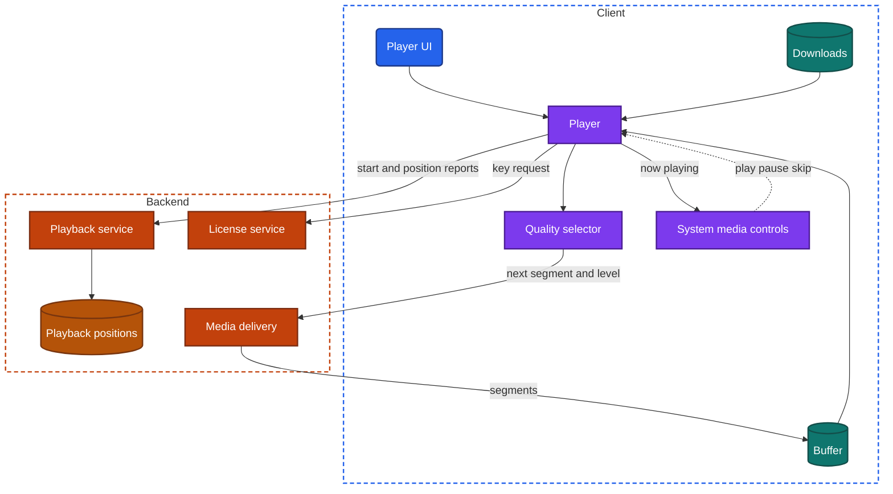
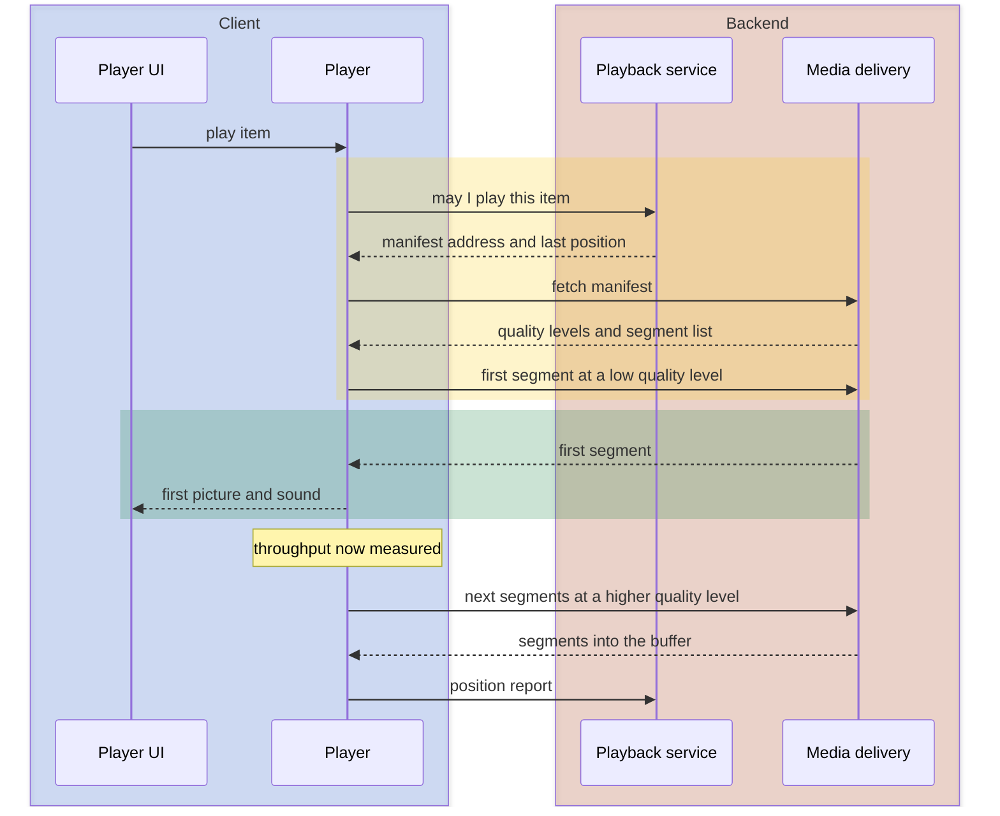
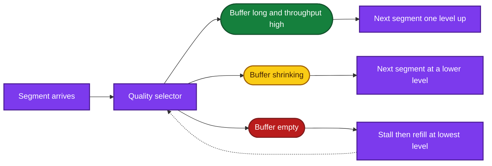

import Probe from '../../../components/Probe.astro';
import Signals from '../../../components/Signals.astro';
import TeardownBar from '../../../components/TeardownBar.astro';
import WorksheetForm from '../../../components/WorksheetForm.astro';

> **The question.** How does this app start playback fast, adapt it to the network and keep it going in the background?

## 17.1 Why this concern exists

Recorded audio and video differ from every other kind of data in one way: they are consumed at a fixed rate. A minute of media takes a minute to play, and the bytes for each second must be on the device before that second is due. Four of the seven constraints ([Chapter 2](/part-1-method/2-the-mobile-constraint-set/)) press on this.

**Unreliable network.** An hour of high-definition video is one to three gigabytes. An hour of music is 50 to 150 megabytes. Neither can be fetched before playback starts, so the app fetches while it plays, over a connection whose speed changes from second to second. When the bytes run out, playback stops.

**Human attention.** The wait between the tap on play and the first picture or sound is the most noticed delay in a media app. This book calls it the **start delay**. A stop in the middle is noticed even more.

**Limited resources.** Video is the most expensive thing a phone does routinely. It uses mobile data at a rate no other feature approaches, and decoding it uses battery. Media files left on the device fill its storage.

**Process death and platform rules.** Audio is the one case where a user expects an app to keep working with the screen off for hours. The operating system allows this only under rules, and it owns the lock screen and the headset buttons through which the user controls it.

So every app that plays media takes a position on these matters:

1. How the media is cut up and delivered, and in how many qualities.
2. What it does to shorten the start delay.
3. How much it fetches ahead, and how it reacts when the network changes.
4. What happens when the screen locks or the user leaves the app.
5. Where the playback position is kept, and which devices learn it.
6. What can be played with no network.

This chapter covers recorded media that plays on demand. Audio and video that move between people as they are produced belong to [Chapter 19](/part-2-concerns/19-live-calls-and-live-streaming/).

## 17.2 The design space

There are three ways to deliver recorded media. They differ in when playback can begin and in what happens when the network slows down.

**Whole file.** The client downloads the complete file, then plays it from storage. Nothing can go wrong during playback, since the network is no longer involved. The start delay is the whole download. Teams choose this for short items where the wait is small: a voice message, a notification sound, a clip of a few seconds. It is also what every offline download is.

**Progressive download.** The client requests one file and starts to play it while it is still arriving. The file holds an index near its start that maps times to byte positions, so the player can begin after the first few seconds of data and can jump to any time by requesting the bytes from that position. There is one quality. If the connection is slower than the file's bitrate, playback stops repeatedly while the download catches up. Teams choose this for short and medium items, for audio, and wherever simplicity matters more than behavior on poor networks. Any file server can deliver it.

**Adaptive streaming.** The backend cuts the media into **segments** of a few seconds each and encodes every segment at several **quality levels**, from a small, soft one to a large, sharp one. It publishes a **manifest**: a small document that lists the quality levels and where each segment is. The player fetches the manifest, then fetches segments one after another, and chooses the quality level again for each segment from what it has measured about the network. When the connection slows, the next segments are smaller and softer and playback continues. Teams choose this for anything long and for video in general. It costs an encoding pipeline, several times the storage, and a player with real logic in it.

| Design | Start delay | When the network slows | Seeking | Backend cost | Observable signature |
|---|---|---|---|---|---|
| Whole file | The full download | No effect once it plays | Instant everywhere | A file server | A progress indicator that must finish before playback |
| Progressive download | Short on a good network | Stops and waits, at the same quality | Fast if the file is indexed for it | A file server | One quality throughout. Repeated stops on a weak connection |
| Adaptive streaming | Short, often at low quality first | Picture softens and playback continues | Fast, to the nearest segment | Encoding in several qualities, a manifest, more storage | Visible changes in sharpness within one item |

Audio blurs these lines. An audio file is small enough that a progressive download on a good connection often completes within the first minute of listening. From then on it behaves like a whole file. Audio apps also use adaptive streaming, and the quality change is hard to hear. For audio, the delivery design is often Speculative from outside.

**Delivery designs belong to kinds of content, not to apps.** One app commonly plays voice messages as whole files, short clips by progressive download and long videos by adaptive streaming. Record each kind separately.

## 17.3 Anatomy

Figure 17.1 shows the components. In the universal app model ([Chapter 3](/part-1-method/3-the-universal-app-model/)), the player is a piece of client logic that outlives any one screen. It is one of the few components that must keep running with no UI at all.



*Figure 17.1. The components of adaptive playback.*

The parts have distinct jobs.

- The **player** owns the playback position and the clock. It takes media from the buffer or from a downloaded file, hands it to the device's decoders, and reports what is playing.
- The **buffer** is the media already fetched and not yet played. It is the player's protection against the network. Its length in seconds is the single most important number in playback.
- The **quality selector** decides which quality level to fetch next. Section 17.5 describes its logic.
- The **system media controls** are a platform service. Through them the app tells the operating system what is playing, and the operating system passes back commands from the lock screen, from headset buttons and from other surfaces.
- The **playback service** answers the request to play an item: whether this user may play it, where its manifest is, and where the user last stopped. It also receives position reports.
- The **license service** issues keys for protected content. Section 17.8 covers it.
- **Media delivery** serves the manifest and the segments from servers near the user, as it does for images ([Chapter 16](/part-2-concerns/16-images/)).

Figure 17.2 shows the start of playback, which is where most of the visible design is.



*Figure 17.2. Starting adaptive playback. The yellow phase is the start delay.*

## 17.4 Starting fast

Figure 17.2 has three round trips before the first picture: the request to the playback service, the manifest and the first segment. Protected content adds a fourth, for the key. On a weak connection each takes a second or more. Every technique for a short start delay removes a round trip, shrinks one, or moves one to before the tap.

| Technique | What it removes | Observable signature |
|---|---|---|
| Low quality first | Most of the bytes of the first segment | The first seconds are soft, then the picture sharpens |
| Manifest address in the item data | The request to the playback service | None directly. Starts are short even for items never seen |
| Preload the start of the next item | Every round trip for that item | The next item starts at once, and its first seconds play in airplane mode |
| Keep the previous position's buffer | The refetch after a short pause or a return | Returning to a paused item plays at once |
| Poster image as a stand-in | Nothing. It covers the wait | A still frame shows where the video will be, then starts to move |
| A player kept ready | Decoder setup time | None directly |
| Open connections early | Connection setup to media delivery | None directly |

**Low quality first** is the most visible. The player knows nothing about the connection when playback begins, so it cannot choose a quality level by measurement. Starting at a low level makes the first segment small, and a small segment arrives fast on any network. Some players choose the starting level from the throughput they measured on the previous item instead, which gives a sharper start on a good network and a slower one when the network has just got worse.

**Preloading the next item** is prefetching ([Chapter 11](/part-2-concerns/11-local-storage-caching-and-prefetching/)) applied to media. It suits any product where the next item is predictable: the next track in an album, the next episode, the next clip in a vertical feed. The app fetches the manifest and the first segment or two of the next item while the current one plays. The cost is data spent on items the user skips. A feed of short clips in which every swipe starts at once is preloading several items ahead, and paying for each clip the user swipes past.

The poster image is a still frame fetched as an image. It is drawn where the video will be, so the layout is stable and the user sees the content before any media arrives. It is the video counterpart of an image stand-in.

Several rows of the table have no signature. A short start delay tells you that something was done. It does not tell you which of the invisible techniques did it, and a claim about them is Speculative.

## 17.5 Buffering and quality switching

### The buffer

The player fetches ahead of the playback position until the buffer reaches a target, then pauses fetching, and continues when the buffer drains below the target. The target is a design decision.

A long buffer rides out long network drops. It also spends data on media the user may never reach, since most people abandon most videos early. A short buffer wastes little and stops at the first dead spot. Typical targets are tens of seconds for video and a whole track for music. Many players grow the target as an item goes on, on the reasoning that someone ten minutes into a film will probably watch the next minute.

You can measure the buffer directly. Turn on airplane mode during playback and time how long it continues. Probe P17.3 does this. Some players also draw the buffered range as a lighter stretch of the seek bar.

When the buffer empties, playback stops and a loading indicator appears. This book calls that a **stall**. After a stall, the player waits until it has a few seconds buffered before it continues, so that it does not stall again at once.

### Choosing the quality level

For each segment the quality selector weighs two measurements: recent throughput, taken from how fast the last segments arrived, and the current buffer length.

```text
function chooseLevel(levels, current, throughput, bufferSeconds, caps):
  allowed = levels.filter(level => level.bitrate <= caps.maxBitrate)
  if bufferSeconds < lowWater:
    return lowest(allowed)                 // a stall is worse than a soft picture
  safeRate = throughput * 0.7              // headroom, since the estimate is noisy
  target = highestWhere(allowed, level => level.bitrate <= safeRate)
  if target > current and bufferSeconds < highWater:
    return current                         // do not step up on a thin buffer
  return target
```

Figure 17.3 shows the three results.



*Figure 17.3. The three results of a quality decision.*

Three properties of this logic are visible.

**Switches happen at segment boundaries.** Segments already in the buffer keep the quality they were fetched at. After the network improves, the picture stays soft for as long as the buffer holds old segments, then sharpens. A long delay between a better network and a better picture means a long buffer.

**Stepping down is fast and stepping up is cautious.** A good selector drops at once when the buffer shrinks and climbs one level at a time. A picture that swings between sharp and soft every few seconds comes from a selector that follows throughput too closely.

**Caps limit the top level.** The selector does not pick a level above a ceiling. The ceiling comes from the screen size, since a phone gains nothing from the largest level. It comes from a metered network or from data-saver mode. It can also come from the user's own quality setting or from the subscription tier. A picture that is always softer on cellular data than on an unmetered network of the same speed shows a cap, not a measurement.

### Seeking

A seek to a time inside the buffer is instant. A seek outside it discards the buffer and starts a small version of startup: fetch the segment that holds the target time, usually at a low quality level, then climb. Both progressive download and adaptive streaming can do this quickly, by byte position or by segment.

Two details are visible. First, some players keep media behind the playback position, so a short jump back is instant. Others discard it and fetch it again. Second, scrubbing along the seek bar often shows small preview frames. Those come from a separate set of thumbnail images listed in the manifest or fetched beside it, and they appear even where the video itself is not buffered.

A progressive file that is not indexed at its start cannot be sought before it is fully downloaded. A seek bar that refuses to move forward, or that waits for the whole stretch in between, exposes this.

## 17.6 Background playback and system controls

Platform rules decide what happens when the screen locks or the user leaves the app.

An app that wants to play audio out of sight must declare it, and the store reviews the declaration. In return, the operating system keeps the process alive for as long as audio is really playing. The exemption ends when playback does. An app paused in the background for a long time is as open to process death as any other app, which is why Section 17.7 treats the saved position as its own design.

While it plays, the app has duties to the operating system.

- **Report what is playing.** The app gives the system media controls a title, artwork, a duration and a position. The lock screen, the notification area, a watch and a car display all draw from this one report.
- **Accept commands.** Play, pause, skip and seek arrive from the lock screen and from headset buttons as commands to the player, with no UI of the app involved.
- **Yield the audio output.** When a call arrives or another app starts to play, the operating system tells the player. The convention is to pause for a call and to lower the volume briefly for a short prompt, such as a spoken navigation instruction, and to continue afterwards.
- **Pause when the output disappears.** When a headset is unplugged or disconnects, the convention is to pause, so that sound does not start coming out of the speaker.

Each duty is a signal when it is missing. Audio that continues with no lock-screen controls has the background declaration and no report. Audio that plays over a phone call, or that blares from the speaker when the headset is pulled out, ignores the operating system's messages. An app that never continues after a call handles the start of the interruption and not its end.

Video has a further choice when the user leaves the app. It can pause. It can continue as sound only, which a well-built player does by switching to an audio-only quality level and no longer fetching picture data. Or it can move to **picture-in-picture**: a small floating window, drawn by the operating system, that stays over other apps. Picture-in-picture is a platform service like the lock-screen controls. The app must declare support and hand its video to the system window. Some products reserve background play for paying users, which makes the behavior a product decision and not a technical limit.

[Chapter 23](/part-2-concerns/23-background-work-and-notifications/) covers what an app does when it is not on screen in general, and [Chapter 25](/part-2-concerns/25-platform-surfaces-widgets-wearables-and-extensions/) covers the surfaces outside the app's own window.

## 17.7 The playback position

For anything longer than a song, the **playback position** is user data: the time the user reached in an item. It has three levels of design, each including the one before.

**In memory.** The position lives in the player. Leave the screen or lose the process, and the item starts from the beginning.

**In the local store.** The player writes the position every few seconds and on every pause. It survives a force-quit and process death. It does not reach other devices.

**Synced.** The client also reports the position to the backend, and other devices read it when they open the item. This is a small case of [Chapter 12](/part-2-concerns/12-offline-and-sync/): a mutation of one value per user per item, queued in an outbox when offline.

```text
function onPositionTick(item, position):       // every few seconds while playing
  localStore.savePosition(item.id, position, now())
  if secondsSinceLastReport() > reportInterval or justPaused:
    outbox.replace(PositionReport(item.id, position, now()))   // only the latest matters
```

The report interval is a trade between backend load and precision. Reporting every second from every player is costly. Reporting every 30 seconds means a second device can be up to 30 seconds behind if the first one lost its process without a final report. A pause normally sends a report at once. So the precision you see on a second device depends on how playback ended on the first: exact after a pause, rough after a force-quit.

Two devices can disagree, and the usual rule is LWW by the time of the report. Some products prefer the furthest position, on the reasoning that going back is rarer than a late report. The two rules separate when you play an item far ahead on one device and then play it from an earlier point on another.

Small product rules sit on top. Many players step back a few seconds when continuing, to restore context. Many mark an item as finished at a threshold short of the end, to skip credits. Both are visible and both are choices.

A step beyond position sync is transfer between devices: a control that lists your other devices and moves live playback to one of them. That needs the backend to know which devices are connected and to push commands to them, which is presence and real-time delivery ([Chapter 14](/part-2-concerns/14-real-time-delivery/)).

## 17.8 Offline downloads and protected content

### Downloads

An offline download is the whole-file design at the user's request. The client fetches every segment of one quality level, or one complete file, and stores it where the operating system will not clear it ([Chapter 11](/part-2-concerns/11-local-storage-caching-and-prefetching/)). The player then reads from the device and needs no network. The transfer itself, with its pauses and continuations, belongs to [Chapter 18](/part-2-concerns/18-file-transfer-uploads-and-downloads/).

A download raises its own design questions.

- **Which quality.** One level is stored. Apps offer a setting, and the size of a download tells you roughly which level it is.
- **Which tracks.** Captions and alternative audio may or may not be included.
- **When it runs.** Often only on an unmetered network, by default.
- **How long it stays valid.** Protected content sets a time limit, as the rest of this section describes.
- **What happens to the position.** A downloaded item played offline still has a position to report later, through the outbox.

### Protected content

Rights holders often require that media cannot be copied off the device. The capability that answers this works as follows. The media is encrypted. The key is not in the file. The player asks a license service for it, and the service checks that this user may play this item on this device. The key comes back inside a **license**, which also carries rules, such as an expiry. Decryption and decoding happen inside a protected part of the device that the app's own code cannot read.

This design has visible consequences, and you can observe them without trying to get around them.

- **Playback needs the license service once.** An item cannot start for the first time with no network, even if every byte of media is on the device.
- **Downloads expire.** An offline license carries time limits: one from the moment of download, and often a shorter one from first play. An item past its limit shows as expired and asks to be renewed online.
- **The app must come online periodically.** Many apps require a connection every few weeks to keep downloads valid, and say so.
- **Downloads are counted.** Limits per device or per account are enforced by the backend, which therefore keeps a record of which device holds what.
- **The picture is hidden from capture.** The preview of the app in the app switcher, or a mirrored screen, shows black where the video is.
- **Quality depends on the device.** A device with weaker protection may be limited to lower quality levels.

Downloads are also tied to the session. Signing out usually deletes them, because the licenses belong to the account ([Chapter 20](/part-2-concerns/20-identity-and-sessions/)).

## 17.9 Captions, audio tracks and autoplay

### Captions and audio tracks

In adaptive streaming, the manifest lists more than video quality levels. Each language of audio is its own track, cut into its own segments. Captions are a further track of timed text. The player combines one video level, one audio track and one text track, and can change any of the three alone.

This shows when you switch. A change of caption language that takes effect at once, with no stop, means captions are a separate text track drawn by the client. A change of audio language with a brief stop means the audio buffer was discarded and refilled while the video buffer was kept. Captions that are part of the picture cannot be turned off or restyled, and mean the text was drawn into the video when it was encoded. Captions drawn by the client follow the device's own caption style settings, which [Chapter 37](/part-2-concerns/37-accessibility-and-global-reach/) returns to.

### Autoplay in feeds

A feed that plays video as it scrolls into view combines this chapter with [Chapter 15](/part-2-concerns/15-lists-feeds-and-pagination/). The design questions are when to start, what to preload and when to refrain.

Decoders are a limited resource, so a feed plays one item at a time: the one most fully in view. It starts muted, since sound without a request is unwelcome. It pauses the item when it scrolls away and often keeps that item's position for a return. It preloads the start of the items next in the scroll direction.

The cost is data. Autoplay spends video-sized amounts of mobile data on content the user did not ask to play, and preloading spends more on content the user may never reach. Teams limit it with the same conditions that limit prefetching in [Chapter 11](/part-2-concerns/11-local-storage-caching-and-prefetching/): no autoplay or a low quality cap on a metered network, none under data-saver mode or low-power mode, and a setting for the user. Probe P17.10 compares these states.

Autoplay also affects what the backend counts. A view counted when a muted video starts moving is a different measure from a view counted after several seconds or after a tap for sound. [Chapter 27](/part-2-concerns/27-ads-attribution-and-growth/) covers why that count matters.

## 17.10 Probes

Run P17.1 to P17.3 on each kind of content the app plays, since delivery designs differ by kind. P17.4 and P17.5 take a minute each. P17.8 needs a second device, and P17.9 needs enough free storage for one download.

<TeardownBar />

### P17.1 Weak start

<Probe id="P17.1" />

### P17.2 Seek to an unbuffered point

<Probe id="P17.2" />

### P17.3 Airplane mode mid-playback

<Probe id="P17.3" />

### P17.4 Lock the screen

<Probe id="P17.4" />

### P17.5 Switch apps

<Probe id="P17.5" />

### P17.6 Next item offline

<Probe id="P17.6" />

### P17.7 Position after a force-quit

<Probe id="P17.7" />

### P17.8 Continue on a second device

<Probe id="P17.8" />

### P17.9 Download then go offline

<Probe id="P17.9" />

### P17.10 Autoplay and data cost

<Probe id="P17.10" />

## 17.11 Signal-to-design table

<Signals chapter={17} />

## 17.12 The backend this implies

Playback is the concern where the client design most directly dictates backend machinery.

- **An encoding pipeline.** Adaptive streaming means every uploaded item is encoded at several quality levels and cut into segments, with a manifest produced for it. This takes minutes to hours per item, which is why newly published video is sometimes available only at low quality at first.
- **Media delivery near the user.** Segments are large and requested continuously. They are served from edge caches, with immutable addresses, apart from the gateway. Playback often survives an incident that breaks the rest of the app.
- **A playback service.** Something checks entitlement at the moment of play and returns the manifest address, often with a signature or an expiry so that the address cannot be shared. Limits on simultaneous streams per account are enforced here, which requires the backend to track active playback through periodic reports from each player.
- **A position store.** Synced positions need one small record per user per item, a write endpoint that accepts frequent small reports, and a conflict rule.
- **A license service.** Protected content needs key storage, a service that issues licenses with rules, and a registry of devices and their downloads.
- **Auxiliary tracks.** Captions, alternative audio and seek-preview thumbnails are each produced, stored and listed in the manifest.
- **Playback telemetry.** A quality selector is tuned from measurements of start delay, stalls and quality across all devices. A team that runs adaptive streaming also collects these. [Chapter 34](/part-2-concerns/34-observability/) covers how a team knows what the app is doing on your device.

## 17.13 Failure modes and what they reveal

- **Playback stops repeatedly at the same sharp quality.** One quality level. Progressive download, or adaptive streaming with nothing below the level in use.
- **The picture swings between sharp and soft every few seconds.** A quality selector that follows throughput with no damping from the buffer.
- **The picture stays soft long after the network recovered.** A long buffer of low-quality segments that the player does not replace.
- **Playback will not start, though the rest of the app works.** The playback service or the license service is failing while media delivery is fine, or the reverse.
- **Audio stops a minute after the screen locks.** The app has no background audio declaration and ran until the operating system suspended it.
- **Audio plays over a phone call, or from the speaker when a headset is unplugged.** The player ignores the operating system's messages about the audio output.
- **Two sounds play at once inside the app.** More than one player instance exists, and nothing coordinates them.
- **The item starts from the beginning after the app was in the background.** The position was held in memory only and the process ended.
- **A second device continues from a much earlier point.** Positions are reported at long intervals, and the last report was lost when playback ended abruptly.
- **A downloaded item refuses to play in airplane mode.** Protected content whose license was not stored for offline use, or has expired.
- **Downloads disappear after the device ran low on space.** They were stored in the area the operating system is allowed to clear.
- **Sound and picture drift apart after a seek or a switch of audio track.** Audio and video are separate tracks, and the player lined them up wrongly.
- **High mobile data use from a feed you only scrolled.** Autoplay and preloading with no metered-network condition.

## 17.14 Worksheet entries

These are the fields this chapter adds to the teardown worksheet. Probe outcomes fill some of them in. Fill them once per kind of content the app plays.

<TeardownBar />

<WorksheetForm chapters={[17]} />

## 17.15 Summary

- Recorded media is delivered as a whole file, by progressive download or by adaptive streaming. A picture that softens instead of stopping on a weak connection identifies adaptive streaming. For audio the design is often Speculative.
- The start delay is a chain of round trips. Low quality first and preloading the next item are the visible ways to shorten it. Several others leave no trace.
- The buffer is the player's protection against the network. Airplane mode during playback measures it in seconds.
- The quality selector chooses a level per segment from throughput and buffer length, under caps for screen size, metered networks and data-saver mode.
- Background audio is granted by platform rules and runs through platform services. Lock-screen controls, headset buttons, interruptions and picture-in-picture each show whether the app meets its duties to the operating system.
- The playback position is held in memory, in the local store or synced. A force-quit separates the first two, and a second device shows the third and its report interval.
- Offline downloads are whole files kept in permanent storage. Protected content adds a license with an expiry, which shows as downloads that need the network once and expire later.
- Autoplay in feeds trades mobile data for immediacy. Comparing an unmetered network with cellular data shows which conditions limit it.
