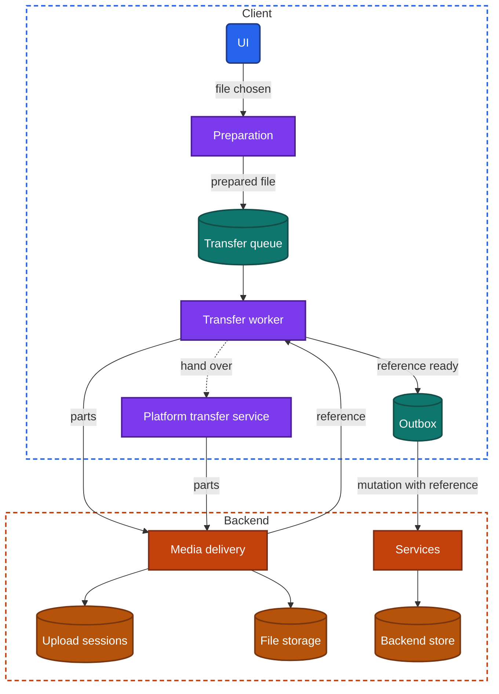
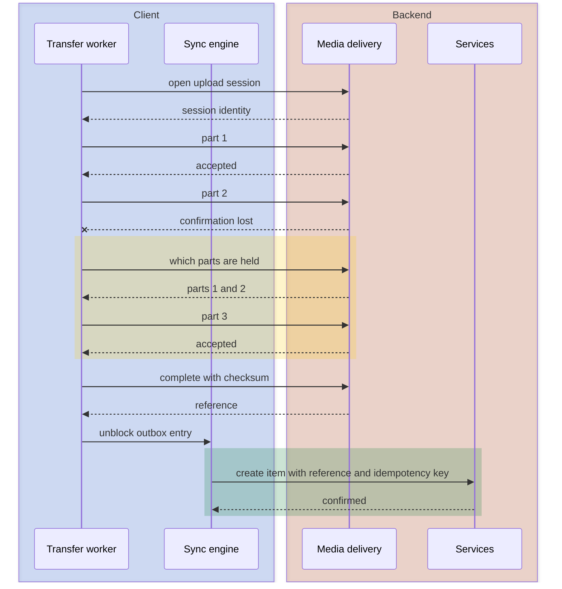

import Probe from '../../../components/Probe.astro';
import Signals from '../../../components/Signals.astro';
import TeardownBar from '../../../components/TeardownBar.astro';
import WorksheetForm from '../../../components/WorksheetForm.astro';

> **The question.** How do this app's large transfers survive interruptions, and who decides when they run?

## 18.1 Why this concern exists

A request for a screen of data lasts a fraction of a second. A video upload lasts minutes. Over that time, three of the seven constraints ([Chapter 2](/part-1-method/2-the-mobile-constraint-set/)) stop being risks and become near certainties.

The **unreliable network** will interrupt the transfer. The user walks out of wireless range, enters an elevator, or boards a train. A network switch changes the device's address and breaks the connection that carried the bytes.

**Process death** will end the code that was sending. The user starts an upload and switches to another app. The operating system suspends the first app within seconds to minutes, and may end its process soon after.

**Limited resources** make the transfer expensive. A large file uses mobile data the user pays for, keeps the radio awake, and fills storage on the way in or on the way out. Preparing a video for upload can use more battery than sending it.

**Platform rules** decide who may do long work at all. The operating system does not let an app run freely in the background. It offers a small number of sanctioned ways to continue a transfer, and each has conditions.

A short request can ignore all of this and simply fail and retry ([Chapter 13](/part-2-concerns/13-network-transport-and-resilience/)). A large transfer cannot, because every restart throws away minutes of work and megabytes of data. The designs in this chapter are answers to two separate questions. The first is how much of a transfer survives an interruption. The second is which component owns the transfer, and so decides when it runs.

## 18.2 The design space

The two questions are independent, so the design space has two axes.

### Axis one: the shape of the transfer

**A single request.** The client sends the whole file in the body of one request. The backend has the file when the request completes, and nothing when it does not. An interruption at 95 percent leaves the backend with nothing useful, and the retry begins at the first byte. This is the default in every toolkit, and it is the right choice for small files. A profile photo that takes two seconds to send does not need more.

**A resumable transfer.** The client first asks the backend to open an **upload session**, which is a record on the backend of one file in transit. The client then sends the file in parts. The backend stores each part and records that it holds it. After an interruption the client asks which parts the backend holds and sends only the rest. An interruption costs at most one part. The price is more requests, a backend that keeps state for unfinished files, and a client that must store the identity of the upload session durably.

Downloads have the same two shapes with less machinery. A single-request download starts over. A resumable download asks for the file from a byte position onward, which most file servers support without any session at all.

### Axis two: the owner of the transfer

**The app process.** The app's own network client sends the bytes. The transfer lives exactly as long as the process is allowed to run. When the app is suspended the transfer stalls, and at process death it stops. This is the simplest design and the one every app starts with.

**The app process, kept alive by a visible task.** Some platforms let an app keep running in the background if it shows the user an ongoing notification for the duration. The app's own code still sends the bytes, so it keeps full control over parts, order and retries. The user sees a persistent entry with progress for as long as the transfer runs.

**The operating system.** The app hands the operating system a file and a destination, and the operating system performs the transfer in its own process. The transfer continues when the app is suspended and after process death. The operating system wakes the app briefly when the transfer ends. The price is control. The operating system chooses the moment, may wait for an unmetered network or for charging, and reports progress coarsely. Each handed-over request is typically one file or one part to one address, so a resumable transfer run this way needs the app to be woken between parts, or a backend that accepts a whole file at one prepared address.

### The combinations

| Shape | Owner | Survives a network interruption | Survives the app closing | Typical use |
|---|---|---|---|---|
| Single request | App process | No, restarts from zero | No | Small images, avatars, documents |
| Single request | Operating system | Restarts, but retried without the app | Yes | Medium files, photo backup of single photos |
| Resumable transfer | App process | Yes, loses at most one part | Pauses, continues on return | Video in a messaging or social app |
| Resumable transfer | Visible task | Yes | Yes, while the notification shows | Long uploads the user started and wants to watch |
| Resumable transfer | Operating system | Yes | Yes | Backup, large media, offline downloads |

**The design belongs to a feature, not to the app.** One app commonly sends avatars as single requests, sends videos as resumable transfers, and hands offline downloads to the operating system. Record each feature separately.

## 18.3 Anatomy

Figure 18.1 shows the components of a complete upload path. Simpler designs are subsets of it. A single-request design has no upload sessions. An app-process design has no platform transfer service.



*Figure 18.1. The components of an upload path. The transfer worker either sends parts itself or hands them to the platform transfer service.*

Two properties of the figure matter for a teardown.

First, the file and the item that refers to it travel on different paths to different backend components. The bytes go to media delivery. The mutation goes to services. Section 18.7 covers how the two are joined.

Second, there are two durable stores on the client. The transfer queue holds files in transit and their progress. The outbox ([Chapter 12](/part-2-concerns/12-offline-and-sync/)) holds mutations. An app with one and not the other behaves differently after a force-quit, and Section 18.13 has a probe for it.

## 18.4 Resumable transfers

A resumable upload has three phases: open, send parts, complete.

**Open.** The client describes the file: its size, its type, and usually a checksum of the whole content. The backend creates an upload session and returns its identity. The client stores that identity in the transfer queue before it sends a single byte. If it did not, process death would leave parts on the backend that no client knows how to continue.

**Send parts.** The client cuts the file into parts of a fixed size and sends each with its position. The backend stores the part and records it in the upload session. Part size is a trade-off. Small parts lose little on an interruption and cost more requests. Large parts are efficient on a good network and painful on a bad one. Sizes from a few hundred kilobytes to several megabytes are common, and some clients choose the size from the network quality.

**Complete.** The client tells the backend that every part is sent. The backend checks that it holds them all, assembles the file, verifies the checksum, and returns a reference that other parts of the system can use.

The rule that makes this robust is that the backend is the authority on what has arrived. A client's own record of sent parts can be wrong, because a part can arrive while its confirmation is lost. So after any interruption the client asks first and sends second.

```text
function upload(file):
  session = transferQueue.sessionFor(file) or openSession(file)
  transferQueue.save(file, session)          // before any byte is sent
  held = backend.partsHeld(session)          // the backend is the authority
  for part in split(file, partSize):
    if part.index in held: continue
    match send(session, part, checksum(part)):
      Accepted:
        transferQueue.markSent(file, part.index)
      Transient:
        waitWithBackoff()
        return upload(file)                  // ask again what is held
      SessionExpired:
        transferQueue.forget(file)
        return upload(file)                  // a new session, from zero
  return backend.complete(session, checksum(file))
```

Sending a part twice is harmless, because the position identifies it. A part is idempotent by construction, and no separate idempotency key is needed for it.

Upload sessions expire. The backend cannot keep the parts of abandoned uploads forever, so it deletes a session after hours or days without activity. This is visible from outside: an upload interrupted for ten minutes continues, and the same upload left for three days starts over.

### Where the parts go

Large bodies are a poor fit for a gateway built for small requests, so many backends keep the bytes away from it. The client asks services for permission to upload, and receives a short-lived address that points straight at file storage. Services never touch the content. You cannot see this arrangement directly. Its one outside trace is that file transfers and ordinary requests fail independently, as [Chapter 13](/part-2-concerns/13-network-transport-and-resilience/) notes for media in general.

### Integrity

A transfer that reports success with a damaged file is worse than one that fails. Three checks exist, from cheap to thorough.

| Check | What it catches | Cost |
|---|---|---|
| Size on completion | Missing parts, truncated files | None |
| Checksum per part | Corruption in transit, parts sent out of position | A pass over each part |
| Checksum of the whole file | Wrong assembly, a source file that changed during upload | A pass over the file on both sides |

A file can change while it is being uploaded, when the user edits a document or a recording is still being written. A careful client uploads from a private copy made at the moment of choice. That copy costs storage for the duration of the transfer, which is the first of several places in this chapter where a transfer temporarily doubles the space a file uses.

## 18.5 Who owns the transfer

The ownership axis decides what happens after the user leaves the app, and it is the part of this chapter most governed by platform rules.

When the app goes to the background, the operating system gives it a short grace period, often around thirty seconds and sometimes a few minutes on request. A transfer owned by the app process continues during that period and then freezes. A small upload finishes inside it. A large one does not. This is why probes for ownership need a file that takes several minutes.

A transfer handed to the operating system behaves differently in four visible ways.

- It finishes while the app is not running, which a second device can confirm.
- Its progress, when you return to the app, jumps to a new value at once, because the operating system kept a count the app only reads on return.
- It may wait. The operating system can hold a transfer marked as not urgent until the device is on an unmetered network or charging.
- It leaves follow-up work undone until the app is woken. The file may be on the backend while the item that refers to it does not exist yet.

The last point is the main engineering difficulty. The operating system moves bytes. It does not run the app's logic. When the bytes are delivered, something must still call the completion step and send the mutation. The operating system wakes the app briefly for this, and the app has a few seconds to do it. If the app cannot finish in time, the work waits until the next launch. An upload that shows as complete only after you reopen the app has this shape.

The visible-task design avoids that difficulty. The app's own code keeps running, with a notification the user cannot miss. A persistent notification with a progress bar that lasts exactly as long as the transfer is a strong signal for it.

Force-quit needs care as a probe. On some platforms a force-quit by the user also cancels the transfers the operating system holds for that app, as a matter of platform policy. A transfer that stops after a force-quit therefore does not prove that the app process owned it. A transfer that finishes after a force-quit does prove that the operating system owned it. [Chapter 23](/part-2-concerns/23-background-work-and-notifications/), which asks what an app does when it is not on screen and what wakes it up, treats these rules in general.

## 18.6 Work before upload

Few apps send a file exactly as the user chose it. A camera produces images and video far larger than any viewer needs, so the client reduces them first.

| Work | What it does | Typical cost on the device |
|---|---|---|
| Resize | Reduces an image to the largest size the product displays | Well under a second |
| Compress | Encodes the image again at lower quality or in a denser format | Under a second |
| Transcode | Decodes a video and encodes it again at lower resolution and bit rate | Seconds to minutes, with heavy battery and heat |
| Strip metadata | Removes location and device details embedded in the file | Negligible |
| Generate a thumbnail | Produces a very small preview that travels with the item | Negligible |

The trade is processing power and battery on the device against data, time on the network and storage on the backend. A one-minute video from a recent camera can be several hundred megabytes. Transcoded for a phone screen it can be under twenty. On a slow connection, a minute of transcoding saves ten minutes of uploading.

The alternative is to send the original and let the backend do the work. That keeps the client simple, treats every device equally, and lets the backend produce better variants later from the original. It costs the user data and time. Products that promise to keep originals, such as backup, send the file untouched. Products that only display media reduce it first.

Preparation has consequences you can observe.

- **A pause before progress moves.** After you tap send, a label such as "preparing" or "processing" appears, or the progress indicator sits at zero. That pause is the transcode. Its length grows with the length of the video and not with the speed of the network.
- **A smaller, softer result.** Open the uploaded item on a second device and compare it with the original. Lower resolution and visible compression show how hard the client or the backend reduced it.
- **Fragility.** Preparation runs in the app process. If the app is suspended in the middle of a transcode, the work usually starts over. A long video that never gets past "preparing" when you leave the app shows this.

## 18.7 Upload, then attach

An item that includes a file involves two writes: the bytes, and the item that refers to them. The order of the two is a design decision.

**Upload, then attach.** The file goes to media delivery first. Media delivery returns a reference. The client then sends the mutation that creates the item, carrying the reference. The item never exists on the backend without its file. Other users never see a post with a hole in it. The mutation stays small, so the path it travels stays fast. This is the dominant design.

**Item first, then media.** The client creates the item at once and uploads the file afterwards. Other users see the item early, with a placeholder where the media will be. Teams choose this when the item matters more than its attachment, or when the backend must assign an identity before the upload can be addressed.

**Everything in one request.** The item and the file travel together in a single request. It is atomic and simple, and it inherits every weakness of the single-request shape.

Upload-then-attach connects this chapter to the outbox of [Chapter 12](/part-2-concerns/12-offline-and-sync/). The mutation is in the outbox from the moment the user taps send, with an optimistic update on screen. It cannot be sent until the upload completes. The outbox entry therefore has a dependency, and the dependency must be stored as durably as the entry.

```text
function sendWithAttachment(item, file):
  item.id = newUniqueId()                  // also the idempotency key
  transaction(localStore):
    applyLocally(item, localPreview(file))
    transferQueue.add(file, ownerItem = item.id)
    outbox.append(item, blockedOn = file)
  transferWorker.requestRun()

function onUploadComplete(file, reference):
  transaction(localStore):
    outbox.attach(file.ownerItem, reference)
    outbox.unblock(file.ownerItem)         // now the sync engine may send it
  syncEngine.requestRun()
```

Figure 18.2 shows the whole sequence with one interruption.



*Figure 18.2. Upload, then attach. The lost confirmation costs one question, not a restart.*

Three details follow from this design.

**Blocking order.** If the outbox is strictly ordered, a text typed after a video waits behind it. Many apps relax the order so that small items overtake a blocked one. A text that arrives on the other device before the video sent ahead of it shows this choice.

**Early upload.** The client can start uploading when the user chooses the file, before the user finishes writing a caption. When the user taps send, most of the work is done. You see a send that completes far faster than the file size allows. The cost is uploads for posts that are never sent, which is the next point.

**Orphans.** A file that was uploaded and never attached stays in file storage. The user cancelled, the app was uninstalled, or the mutation was rejected. The backend needs a rule that deletes files no item refers to after some period.

## 18.8 Queues, order and conditions

An app that lets the user select thirty photos has thirty transfers and has to decide how they run.

### Parallelism

Sending files one at a time is simple, keeps order, and gives clear progress. It wastes capacity on a fast network. Sending several at once uses the network fully, and on a slow network it divides a narrow pipe so that every file crawls and every file is exposed to the same interruption. Most clients settle on a small fixed number, commonly two to four, and some lower it on a metered network. Parts of one file can also be sent in parallel, which you cannot distinguish from outside.

### Order

Common orders are the order the user chose, smallest first, newest first for backup, and user-initiated work ahead of automatic work. The last matters most. A manual send that waits behind a backlog of automatic backup is a priority failure the user feels directly.

### Conditions

A transfer queue usually carries conditions that must hold before it runs.

| Condition | Why | What you see |
|---|---|---|
| Unmetered network only | Mobile data costs the user money | "Waiting for a wireless network", or a setting to allow cellular |
| Charging only | Long transfers and transcodes drain the battery | Backup that advances overnight |
| Not in low-power mode | The user asked the device to do less | Transfers paused, sometimes with a notice |
| Not in data-saver mode | The user asked apps to use less data | Automatic transfers stop, manual ones ask |
| Enough free storage | Downloads and temporary copies need space | A refusal before the download starts |

A common refinement is a size threshold: small files go on any network, and large ones wait for an unmetered network or ask. The settings screen is evidence here. An app that offers "use cellular data for uploads" has a condition system. Passive observation of the settings screen is the cheapest probe in this chapter.

When the operating system owns the transfer, the app states the conditions and the operating system enforces them. When the app process owns it, the client checks them itself and must react when they change in the middle of a transfer.

## 18.9 Progress reporting

Progress is the user's only view into a long transfer, and it is rarely as simple as it looks.

A transfer of a prepared file has at least three phases: preparation on the device, transfer, and processing on the backend. Each has its own speed. Clients handle this in three ways.

- **Phase labels.** "Preparing", then a percentage, then "processing". This is honest, and it tells you exactly which phases exist.
- **One weighted bar.** The client assigns each phase a share of the bar. The bar moves at uneven speed, with a characteristic stall near the start and near the end.
- **Bytes only.** The bar covers the transfer alone. It sits at zero during preparation and at 100 percent during backend processing.

What progress does after an interruption is a strong signal. A bar that returns to zero means the bytes are being sent again. A bar that holds its place and continues means the earlier bytes were kept. A bar that jumps backward by a small amount lost one part. Section 18.13 turns each of these into a probe.

## 18.10 Downloads

Downloads mirror uploads with three differences.

**Resuming is cheaper.** The client keeps a partial file and asks the server for the rest from a byte position. No session is needed on the backend. The client does need to know that the file on the server is still the same one, so it sends back a validator ([Chapter 11](/part-2-concerns/11-local-storage-caching-and-prefetching/)) with the request. If the file changed, the server sends it whole, and the download starts over for a good reason.

**The user often controls it.** Offline downloads of video, audio, maps and documents usually have explicit pause, resume and cancel controls. A pause control that continues from the same point is a resumable download made visible. A pause that is really a cancel, followed by a restart, is not.

**Storage is the scarce resource.** A download needs space for the partial file and sometimes for a second copy during a final step, such as verification, decryption or unpacking. A careful client checks free space before it starts and refuses early with a clear message.

A downloaded file is not usable until it is complete and verified. Clients write to a temporary name and rename the file as the last step, so that no other component ever opens half a file. Large media is often an exception by design: it is downloaded as many small segments, each usable alone. [Chapter 17](/part-2-concerns/17-audio-and-video-playback/), on how playback starts fast and adapts to the network, covers that structure. A download that is playable up to the point it reached is built from segments.

Ownership applies to downloads as it does to uploads. An offline download of a season of video is the classic case for handing the transfer to the operating system. The user starts it and leaves, and expects it to be finished the next morning.

## 18.11 Retry and cleanup

### Retry

Retry for a transfer follows the rules of [Chapter 13](/part-2-concerns/13-network-transport-and-resilience/), with backoff, jitter and a classification of failures. Two points are specific to transfers.

A transfer should wait for the network and not burn through its retries while offline. A careful client pauses the queue when connectivity is absent and resumes on the connectivity change. A careless one retries five times in airplane mode, marks the transfer failed, and waits for the user.

Some failures are permanent. The file is too large, the type is refused, the user's storage quota is full, or the content is rejected. These need a failed state on the item with a reason, and no further attempts. An upload that retries forever against a quota error has not classified its failures.

### Cleanup

Every design in this chapter creates temporary data, and each kind needs an owner that deletes it.

| Leftover | Where | Who should remove it |
|---|---|---|
| Private copy or transcoded copy of an upload | Device | The transfer worker, on completion or cancel |
| Partial download | Device | The transfer worker on cancel, and a sweep at launch for anything orphaned |
| Parts of an abandoned upload session | Backend | An expiry on upload sessions |
| Uploaded files never attached | Backend | A periodic sweep for unreferenced files |

Device-side leftovers are observable. The operating system's settings show the storage an app uses. Start a large download, cancel it halfway, and look again. Storage that does not come back is a partial file nobody owns. The same check after a cancelled video upload finds abandoned transcodes.

## 18.12 What the outside view can and cannot tell you

Several designs in this chapter leave no outside trace, or leave the same trace as another design.

- **A fast network hides everything.** A transfer that completes in three seconds cannot be interrupted usefully. Use a large file and a slow network, or the probes show nothing.
- **Resumable transfer against a surviving connection.** A transfer that rides through a network switch with no pause may be resumable with a fast silent retry, or may be carried by a transport that survives the switch. This is Speculative either way.
- **Direct to storage against through the gateway.** Not visible.
- **Client transcode against backend transcode.** The pause before progress is evidence for the client. Comparing the data the app used, in the device's data-usage settings, against the size of the original file is stronger evidence. A reduced result alone proves nothing, because the backend may have produced it.
- **Part size, part parallelism and integrity checks.** Not visible. A backward step in progress hints at the part size.

## 18.13 Probes

Use a file that takes at least a minute to transfer. A video of a few minutes on a modest network works. P18.1 is a baseline for the rest. P18.2 and P18.5 are the two that separate the most designs.

<TeardownBar />

### P18.1 Preparation pause

<Probe id="P18.1" />

### P18.2 Interrupt and restore

<Probe id="P18.2" />

### P18.3 Network switch mid-transfer

<Probe id="P18.3" />

### P18.4 Background mid-upload

<Probe id="P18.4" />

### P18.5 Force-quit mid-upload

<Probe id="P18.5" />

### P18.6 Attach order

<Probe id="P18.6" />

### P18.7 Queue several files

<Probe id="P18.7" />

### P18.8 Transfer conditions

<Probe id="P18.8" />

### P18.9 Download pause and resume

<Probe id="P18.9" />

### P18.10 Cancelled download cleanup

<Probe id="P18.10" />

## 18.14 Signal-to-design table

<Signals chapter={18} />

## 18.15 The backend this implies

- **Single request.** An endpoint that accepts a large body, with size and type limits enforced before the body is read in full. Nothing else.
- **Resumable transfer.** A store of upload sessions. An endpoint to open one, one to accept a part by position, one to report which parts are held, and one to complete. Storage that can assemble parts into a file. An expiry that deletes abandoned sessions and their parts.
- **Direct to storage.** A service that issues short-lived addresses scoped to one file and one user, and an event from storage back to services when a file lands.
- **Operating system as owner.** Endpoints the operating system can use without the app's logic: one prepared address per file or per part, valid long enough for a transfer the operating system may delay for hours.
- **Upload, then attach.** References that services can validate: that the file exists, is complete, belongs to this user, and is not already attached elsewhere. A sweep for files that were never attached.
- **Processing.** A pipeline behind media delivery that checks the file, produces variants and thumbnails, and marks the file ready. A way to tell the client that processing finished, by polling or by real-time delivery ([Chapter 14](/part-2-concerns/14-real-time-delivery/)).
- **Resumable downloads.** Files served with support for byte positions and with a validator, which media delivery normally provides.

The untrusted client constraint applies throughout. The backend cannot believe the size, the type or the checksum the client declares, so it measures them itself. It scans content, enforces quotas on what was actually stored, and treats an upload address as a capability that expires. [Chapter 21](/part-2-concerns/21-security-and-trust/), on what the backend refuses to trust the client with, takes this further.

## 18.16 Failure modes and what they reveal

- **Progress returns to zero after a brief loss of signal.** A single request. Nothing on the backend survives the interruption.
- **An upload stops when you switch apps and continues when you return.** The app process owns the transfer.
- **An upload vanishes after a force-quit, and the item with it.** The transfer queue and the outbox are held in memory.
- **The item survives a force-quit as "failed" and offers retry.** The outbox is durable and the transfer is not. The retry starts from zero.
- **Stuck at 99 or 100 percent.** The bytes are sent and the completion step or backend processing has not finished. The bar counts bytes only.
- **Stuck at "preparing" every time you leave the app.** The transcode runs in the app process and restarts when the app is suspended.
- **The same photo or video appears twice.** The mutation was retried without an idempotency key, or the upload completed twice and both references were attached.
- **A post appears for others with a broken or blank media area.** Item first, then media, with an upload that failed or processing that has not finished.
- **A text sent after a video waits until the video is done.** A strictly ordered outbox with a blocked head.
- **The app's storage grows after cancelled transfers.** Partial files or transcoded copies with no cleanup.
- **An interrupted upload continues after ten minutes and restarts after a weekend.** The upload session expired.

## 18.17 Worksheet entries

These are the fields this chapter adds to the teardown worksheet. Probe outcomes fill some of them in. Record the file size and the network of each run in the notes field, because a fast network hides most of these designs.

<TeardownBar />

<WorksheetForm chapters={[18]} />

## 18.18 Summary

- A large transfer is certain to meet an interruption, a suspended app, or both. The design question is how much survives and who owns the work.
- A single request restarts from zero. A resumable transfer sends parts into an upload session the backend remembers, and loses at most one part. Progress after an interruption tells them apart.
- A transfer is owned by the app process, by the app process kept alive with a visible task, or by the operating system. Only the last finishes with no process, and it trades away control over timing and progress.
- Preparation on the device trades battery and time for data. A pause before progress that grows with the length of a video is its signature.
- Upload, then attach sends the file to media delivery first and the mutation afterwards. The outbox entry waits on the upload, and both must be durable.
- Queues decide parallelism, order and conditions. Restrictions to an unmetered network or to charging show in settings and in waiting states.
- Downloads resume from a byte position with a validator, need free space, and become usable only when complete, unless the content is built from segments.
- Every design leaves temporary data. Storage that does not return after a cancelled transfer shows that nobody owns the cleanup.
