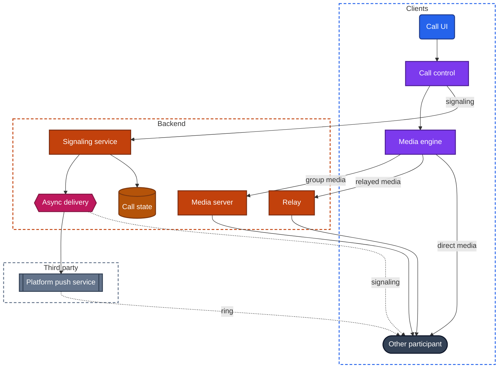
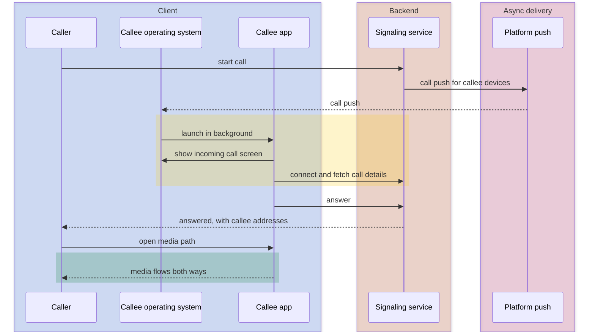
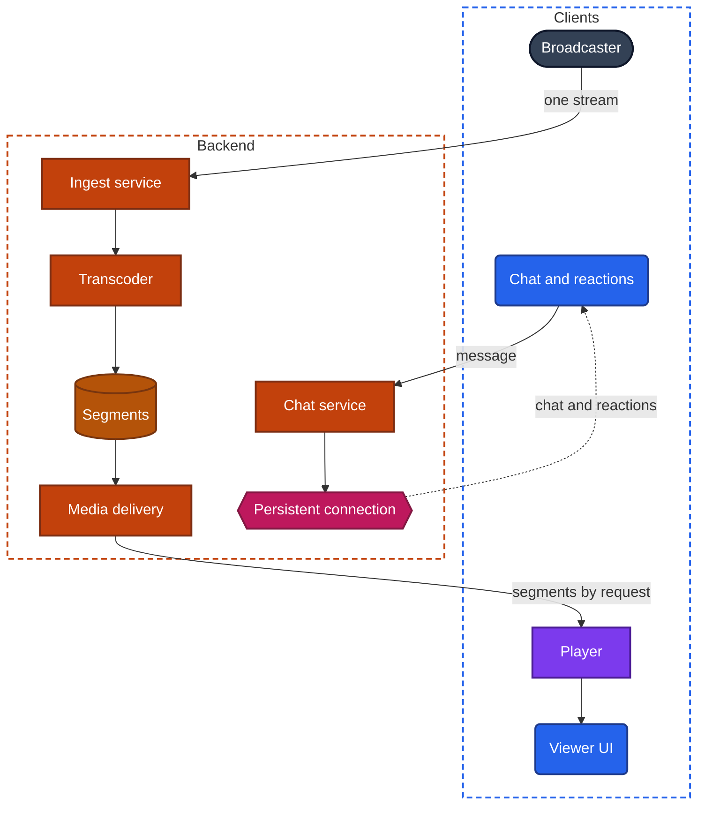

import Probe from '../../../components/Probe.astro';
import Signals from '../../../components/Signals.astro';
import TeardownBar from '../../../components/TeardownBar.astro';
import WorksheetForm from '../../../components/WorksheetForm.astro';

> **The question.** How do audio and video move between people in real time in this app?

## 19.1 Why this concern exists

Every other kind of data in this book can arrive late and still be useful. A message that takes two seconds is fine. A video that buffers for three seconds before it plays is fine. Speech in a conversation is different. If your words reach the other person half a second late, the two of you start talking over each other. Live media has a deadline, and data that misses the deadline is worthless.

That one fact inverts the usual priorities. Elsewhere, the client retries until the data is complete ([Chapter 13](/part-2-concerns/13-network-transport-and-resilience/)). In a call, waiting for a lost fragment of sound delays everything after it, so the fragment is dropped and the gap is concealed. Live media prefers timely and incomplete to complete and late.

Four of the seven constraints ([Chapter 2](/part-1-method/2-the-mobile-constraint-set/)) press on this.

- **Unreliable network.** Capacity changes from second to second, and a network switch changes the device's address in the middle of a call.
- **Limited resources.** Encoding video in real time is among the most expensive things a device does. It uses the camera, the processor, the radio and the screen together.
- **Human attention.** People notice delay in conversation at a few hundred milliseconds, and notice echo at once.
- **Platform rules.** A call has to ring a device whose app is not running. Only the operating system can do that, on its terms.

There are two families of design. A **call** is a conversation: few participants, everyone sends and receives, and delay must stay below what speech tolerates. A **live stream** is a broadcast: one or a few people send, many watch, and delay is traded for scale and smoothness. The two families use different machinery, and some products combine them.

## 19.2 The design space

| Design | Who sends | Typical end-to-end delay | Scales to | Cost |
|---|---|---|---|---|
| Call, media sent directly between devices | Both | Under a quarter of a second | Two, sometimes a few | Lowest for the backend |
| Call, media through a relay | Both | Slightly more | Two | Relay traffic |
| Group call, forwarding server | All | Under half a second | Tens, more with limits | Server traffic per participant |
| Group call, mixing server | All | Somewhat more | Tens to hundreds | Server processing per call |
| Live stream, low-latency delivery | One or a few | Under a second to about five seconds | Thousands to many more | High per viewer, or tuned segments |
| Live stream, segmented delivery | One or a few | Ten to thirty seconds or more | Effectively unlimited | Lowest per viewer |

End-to-end delay here means the time from a sound or movement in front of one device to its appearance on another. It is the one number in this chapter you can measure well, and Section 19.11 opens with the probe for it.

The figures are typical ranges, not specifications. What matters is the order of magnitude. Half a second and fifteen seconds are produced by different machinery, and no tuning turns one into the other.

## 19.3 Anatomy of a call

A call has two paths that share almost nothing. Figure 19.1 shows both.

*Figure 19.1. The two paths of a call. Signaling passes through the backend. Media takes one of three routes.*

**The signaling path** sets the call up and manages it. It carries small messages: start a call, ring, answer, decline, hang up, mute, a participant joined, here are the network addresses I can be reached at, here are the formats I can encode. Signaling is ordinary real-time delivery ([Chapter 14](/part-2-concerns/14-real-time-delivery/)). It runs over the app's persistent connection when the app is open and over platform push when it is not. It must be reliable and ordered, and a delay of a second is tolerable.

**The media path** carries the sound and picture. It uses a transport built for deadlines. Packets are small and frequent, each is stamped with its time, and a packet that is lost is usually not sent again. The media engine is the client component that owns this path. It captures, encodes, sends, receives, buffers, decodes and plays, and it adapts to the network many times per second.

The separation has consequences you can observe.

- Call controls can work while media does not. The call connects, the timer runs, and nobody hears anything. Signaling succeeded and the media path failed to open.
- Media can continue while signaling is gone. On a damaged network you may still hear the other person while the mute indicator or the participant list stops updating.
- A call can ring on a network that then refuses to carry it.

## 19.4 The media path

### Direct or relayed

The cheapest route for media is straight from one device to the other. It has the lowest delay, and the backend carries nothing.

It is also hard to arrange. Most devices sit behind network equipment that hides their address and refuses unsolicited traffic. To connect directly, each client asks a small backend service how its address appears from outside, sends the answer through signaling, and both sides then try to open a path at the same moment. On many home networks this works. On some cellular networks, corporate networks and public networks it does not.

When it fails, the clients fall back to a **relay**: a backend server with a public address that both devices can reach, which passes packets between them without decoding them. A relay adds a little delay and costs the backend traffic for the whole call.

Some apps relay every call by choice. A direct path reveals each participant's network address to the other, which can expose a rough location. Relaying hides it. Some apps offer this as a privacy setting, and that setting is direct evidence that both routes exist.

From outside, direct and relayed media are almost impossible to tell apart. A relay near both users adds a few tens of milliseconds, which is below what a side-by-side probe can resolve. A claim about which route a two-person call uses is Speculative unless the app's settings or its maker's publications say so.

### Group calls

Direct media does not scale. In a call of five, each device would send its video four times and receive four streams. Upload capacity and encoding cost grow with every participant. In practice, direct media is used for two people and rarely beyond three or four.

A larger call needs a **media server**, and there are two kinds.

**A forwarding server** receives each participant's stream once and forwards it to every other participant. It does not decode anything. Each device uploads one stream and downloads one per visible participant. The server is cheap, adds little delay, and can work when media is end-to-end encrypted, because it forwards what it cannot read.

**A mixing server** decodes every stream, composes them into one picture and one sound track, encodes the result and sends each participant a single stream. The device's work is small and constant whatever the call size. The server's work is heavy, the delay is higher, the layout is fixed by the server, and the backend must be able to read the media.

| | Direct | Forwarding server | Mixing server |
|---|---|---|---|
| Streams a device uploads | One per other participant | One, or one per quality | One |
| Streams a device downloads | One per other participant | One per visible participant | One |
| Backend cost | None | Traffic | Traffic and heavy processing |
| Added delay | None | Small | Larger |
| Who decides the layout | The client | The client | The server |
| End-to-end encryption | Possible | Possible | Not possible |

Forwarding is the common design for interactive group calls. Mixing appears where devices are weak, where a call is recorded or streamed onward as one picture, or where the participant is on an ordinary telephone line.

### How group size changes the design

A forwarding server has a problem with mixed audiences. One participant is on a fast network with a large screen. Another is on a weak cellular connection. A single stream from each sender suits one of them.

The usual answer is for each sender to produce **quality layers**: the same video encoded at two or three qualities at once. The forwarding server chooses, for each receiver and each tile, which layer to forward. A small tile gets the low layer. An enlarged tile gets the high one. A receiver on a weak network gets low layers for everyone.

This produces a distinctive signature. When you enlarge or pin one participant, the picture is soft for a moment and then sharpens. The client asked the server for a higher layer, and the server switched at the next point the video allows.

As calls grow further, more limits appear, and each is visible.

- **Only some tiles carry video.** The client subscribes to the participants on screen. Scrolling to another page of the grid shows blank tiles that fill in after a moment.
- **Only the loudest few are heard.** The server forwards audio for a handful of active speakers.
- **Senders are capped.** Beyond some size, new participants join with the camera off, or as listeners only.
- **The two-person case is special.** Some apps use direct media for two and move to a media server when a third person joins. The move can show as a brief freeze or a "reconnecting" moment at exactly that point.

Very large calls shade into the second family. A meeting with a few speakers and thousands of viewers is a call for the speakers and a live stream for everyone else.

## 19.5 Call setup and ringing

A call begins on the signaling path. Figure 19.2 shows the hardest case, in which the callee's app has no process.

*Figure 19.2. Ringing a device whose app is not running, then opening the media path.*

### Ringing through platform push

When the callee's app is open, the ring arrives over its persistent connection. When it is not, the only route is platform push. An ordinary notification is a poor ring. It makes one short sound, it can be delayed, and it does not take over the screen.

Platforms therefore offer a dedicated kind of platform push for calls, which this chapter calls a **call push**. It is delivered at high priority, it starts the app in the background even after a force-quit on some platforms, and it lets the app present the system's own incoming-call screen, with a ringtone, on a locked device. Platform rules bind it tightly. An app that receives a call push must show an incoming call promptly, and an app that misuses the mechanism for other wake-ups loses it.

What you see tells you which mechanism is in use. A full-screen incoming call on a locked device, a few seconds after the caller taps, is a call push with the platform's calling integration. A banner that says someone is calling is ordinary platform push. Nothing until you open the app means signaling depends on a live process.

### Ringing is a distributed state

A ring has to be stopped as reliably as it is started. Four cases need a second message that reaches every ringing device.

- The caller gives up. The callee's devices must stop ringing.
- The callee answers on one device. The other devices must stop.
- The callee declines. The caller must be told.
- Nobody answers. Something must end the ring by a timeout and record a missed call.

Each of these is fan-out to a user's devices, as [Chapter 14](/part-2-concerns/14-real-time-delivery/) describes, with stricter timing. A device that keeps ringing after the call was answered elsewhere missed the stop message. A missed-call entry with no ring at all means the call push arrived after the caller had given up.

### Opening the media path

After the answer, the two clients exchange candidate addresses and formats through signaling, test which routes work, and choose the best. This takes from a fraction of a second to several seconds, and it is the "connecting" state between the answer and the first sound. Many clients start it during the ring, so that answering feels instant. A consistently long "connecting" state on one network and a short one on another suggests that direct attempts fail there and the call falls back to a relay.

## 19.6 Adapting to the network

The media engine estimates, continuously, how much the network can carry. It watches for lost packets and for packets that arrive progressively later, which means a queue is building somewhere on the path. It then tells the encoder how many bits per second it may produce. The whole loop runs several times per second.

### What gives way first

Audio needs little: a few tens of kilobits per second. Video needs tens to hundreds of times more. A sound adaptation policy therefore sacrifices video to protect audio, in roughly this order.

| Step | What the engine does | What you see or hear |
|---|---|---|
| 1 | Lowers video quality at the same size | A softer, blockier picture |
| 2 | Lowers resolution | A visibly blurry picture |
| 3 | Lowers frame rate | Jerky movement |
| 4 | Pauses video | A frozen frame, an avatar, or a "poor connection" label, with audio continuing |
| 5 | Lowers audio quality | Thin or muffled voices |
| 6 | Drops the call | "Reconnecting", then the end of the call |

The order of steps 2 and 3 depends on the content. A face is better blurry than jerky. A shared screen of text is better sharp at a few frames per second. An app that keeps shared text crisp while its motion stutters has a separate policy for screen sharing.

Whose picture degrades tells you where the problem is. If your network is weak, others see you degrade, because your upload is constrained. You see them degrade only if your download is also constrained. With a forwarding server and quality layers, a weak receiver does not harm what the other participants see of each other, because the server sends each receiver a different layer.

### Smoothing arrival

Packets do not arrive at the even rhythm they were sent with. The receiving engine holds them briefly in a playout buffer and releases them on schedule. The buffer is a trade-off. A deep one hides irregular arrival and adds delay. A shallow one keeps delay low and lets gaps through. Engines resize it constantly, and they stretch or compress sound slightly to do so without a gap.

Loss is concealed and not repaired. For audio, the engine fills a missing fragment with a guess based on what came before. Short losses are inaudible. Longer ones produce the metallic, robotic voice everyone recognizes. For video, a lost packet can damage every frame until the next complete one, so the receiver asks the sender for a fresh complete frame. You see a freeze and then a sudden recovery.

## 19.7 Surviving a network switch

A network switch changes the device's address. For a call, the route the media path was using no longer exists.

A robust client handles this without ending the call. It notices the new network, gathers its new addresses, sends them through signaling, and the two sides agree on a new route. Signaling has its own interruption at the same moment, because the persistent connection also broke and has to reconnect. The call's state lives on the backend during this window, and the signaling service holds the call open for a grace period before it tells the other side that you left.

What the user sees is a few seconds of frozen video and silence, often with a "reconnecting" label, and then the call continues. The other participant sees the same from their side. Some transports can move a connection to a new address without setting it up again, and the interruption shrinks to something barely noticeable.

Three outcomes are possible and a probe in Section 19.11 separates them: no noticeable interruption, a short freeze and recovery, or a dropped call. As with transfers in [Chapter 18](/part-2-concerns/18-file-transfer-uploads-and-downloads/), the seamless outcome is Observed and the mechanism behind it is Speculative.

## 19.8 Echo and delay

### Echo

On speaker, your device plays the other person's voice and its microphone picks that sound up again. Sent back, the other person hears themselves a moment late. The longer the delay, the more disturbing it is.

The media engine removes this with echo cancellation. It knows what it just played, predicts how that sound will appear in the microphone signal, and subtracts it. Modern devices and operating systems provide this as a platform service, and engines often add their own. It is an estimate, and it has failure modes you can hear.

- **Echo of your own voice.** The other side's cancellation is failing. The problem is on their device, not yours.
- **The other person cuts out when you speak.** A cruder suppressor that silences the microphone while the speaker is playing. Only one person can talk at a time.
- **A burst of echo at the start of a call or after switching to speaker.** The canceller is still learning the room.

Two devices in one room on the same call defeat any canceller, because each hears the other's speaker through the air. The result is a howl. The side-by-side probes in this chapter mute one device to avoid it.

### Delay

End-to-end delay is the sum of several stages: capture, encoding, the network, the playout buffer, decoding and playing. The network and the playout buffer dominate. A media server on the route adds a little. A mixing server adds more, because it decodes and encodes again.

Below about a fifth of a second, conversation feels natural. Up to about four tenths it is workable. Beyond that, people begin to collide and pause. These thresholds explain why calls cannot borrow the delivery machinery of live streams.

Sound and picture also have to stay aligned. Audio is cheaper to process and would arrive first, so the engine delays it to match the video. Lips that move out of step with speech show that alignment failing, usually under network stress.

## 19.9 One-to-many live streaming

A live stream has one sender and an audience that may be very large. The sender's device does what it does in a call: it captures, encodes and sends one stream to the backend. Everything after that is different. Figure 19.3 shows the path.

*Figure 19.3. A segmented live stream, with chat on a separate path.*

### Segmented delivery

The backend transcodes the incoming stream into several qualities and cuts each into **segments**, which are short files of a few seconds of media. Media delivery serves them as it serves any file. The player requests a list of the newest segments, downloads them in order, and chooses the quality of each from its measured network speed. This is the playback machinery of [Chapter 17](/part-2-concerns/17-audio-and-video-playback/), which asks how playback starts fast and adapts to the network, applied to content that is still being produced.

The strength of this design is that viewers are cheap. A segment is an ordinary file, cacheable at the edge of the network, and a million viewers request the same files. The transport is the same reliable request and response the rest of the app uses, so it passes through every network.

The cost is delay. A segment cannot be served until it is complete. The player holds two or three segments before it starts, so that one slow download does not stall playback. Transcoding and distribution add more. The sum is commonly ten to thirty seconds between the event and the viewer's screen.

### Low-latency delivery

When the product needs the audience to react in time, such as an auction, a quiz, betting, or a host answering questions from chat, that delay is too long. There are two ways down.

**Tuned segments.** Segments become shorter, or are published in small pieces while still being produced, and the player holds less. Delay falls to roughly two to five seconds. The scale and cost stay close to those of segmented delivery. The price is a thinner buffer, so a weak network stalls more often.

**Call-style delivery.** The stream is sent to viewers over the same kind of media path a call uses, through forwarding servers. Delay falls below a second. Each viewer now holds a live connection to a media server, which costs far more than serving cached files, and loss shows as glitches instead of buffering.

### Hybrids

Many products mix the families. Hosts and guests are in a call with one another, with conversational delay. A mixing server composes that call into one picture, and the picture is distributed to the audience in segments. When a viewer is invited to join as a guest, their client leaves the segmented stream and joins the call. You can see the move: the player reloads briefly, and the viewer's delay drops from many seconds to almost none.

### Chat and reactions beside the stream

Chat, reactions, viewer counts and polls do not travel with the video. They are real-time delivery over a persistent connection, exactly as in [Chapter 14](/part-2-concerns/14-real-time-delivery/). Three consequences are visible.

- **Chat runs ahead of the picture.** Chat arrives in under a second. Segmented video arrives fifteen seconds later. Viewers comment on a goal before a slower viewer sees it. A host answers a question a long time after it was asked. Some clients delay chat to match the video, which you cannot distinguish from low-latency delivery by this signal alone.
- **Reactions are ephemeral signals.** They are not stored, a viewer who joins late does not see earlier ones, and at large scale the backend sends a sampled or summarized flow because the full flow would be unreadable and costly.
- **Chat is thinned at scale.** In a very large audience you do not receive every message. Your own message always appears to you, through an optimistic update.

### Falling behind the live edge

The **live edge** is the newest moment of the stream available to play. A player always sits some distance behind it. That distance grows whenever playback stalls or the viewer pauses, and it does not shrink by itself. A player has four policies.

| Policy | What you see |
|---|---|
| Stay behind | Playback continues from where it stopped. A "live" control, often with a changed color, offers a jump forward |
| Jump | After a stall or a long pause, playback skips to the live edge and the missed part is never shown |
| Speed up | Playback runs slightly fast until it is close to the live edge again. Speech sounds a little hurried |
| No pause | The pause control is absent, or resuming always returns to the live edge |

Low-latency designs must use jump or speed up, because their whole purpose is a small, stable delay. A call has only one policy: late media is dropped, so a call never falls behind. That is why sound in a call sometimes rushes for a moment after a network stall.

## 19.10 What the outside view can and cannot tell you

This chapter has more hidden machinery than most. State these limits in a teardown.

- **The transport cannot be identified.** You can measure delay and see how the app degrades. You cannot see which protocol carries the media. Delay under a second implies a deadline-oriented media path. Ten seconds or more implies segments. The range in between fits either tuned segments or a deep buffer on a media path, and a claim there is Speculative.
- **Direct against relayed media.** Not distinguishable in a two-person call, apart from a privacy setting that offers the choice.
- **The location of media servers.** Delay hints at distance and nothing more.
- **Forwarding against mixing.** Usually Inferred from layout control and per-tile quality changes, and never Observed.
- **Encoding formats.** Not visible.
- **End-to-end encryption of media.** A claim made by the app's maker, not something a probe can verify. [Chapter 21](/part-2-concerns/21-security-and-trust/), on what the backend refuses to trust the client with, discusses how to treat such claims.

## 19.11 Probes

These probes need two devices. Use two of your own with two accounts, or ask someone who agrees to help. For group probes, ask two or three more people. P19.1 and P19.8 measure delay and are the anchors for everything else. Keep at least one device muted with its speaker off whenever two devices on the same call are in one room.

<TeardownBar />

### P19.1 Call delay, side by side

<Probe id="P19.1" />

### P19.2 Echo

<Probe id="P19.2" />

### P19.3 Degrade one side

<Probe id="P19.3" />

### P19.4 Network switch mid-call

<Probe id="P19.4" />

### P19.5 Call a force-quit app

<Probe id="P19.5" />

### P19.6 Add participants

<Probe id="P19.6" />

### P19.7 Enlarge a tile

<Probe id="P19.7" />

### P19.8 Stream delay against a clock

<Probe id="P19.8" />

### P19.9 Chat against picture

<Probe id="P19.9" />

### P19.10 Fall behind the live edge

<Probe id="P19.10" />

## 19.12 Signal-to-design table

<Signals chapter={19} />

## 19.13 The backend this implies

- **Signaling.** A service that holds call state: who is in the call, who is ringing, and each participant's media settings. Fan-out to every device of every participant over async delivery. Timeouts that end unanswered rings and remove participants who vanished.
- **Ringing.** Call push through each platform's push service, with the device tokens that requires. A store of missed calls, so that a device that never rang still learns of the call through catch-up.
- **Direct media.** A small service that tells a client how its address appears from outside. Nothing else on the media path.
- **Relayed media.** Relay servers in many regions, with short-lived credentials issued per call so that only participants can use them.
- **Group calls.** Media servers, placed near users, with a way to assign a call to a server and to move it when a server fails. For forwarding, the logic that selects a quality layer for each receiver. For mixing, enough processing to decode, compose and encode every call.
- **Segmented live streaming.** An ingest service for the broadcaster's stream, a transcoder, segment storage, and media delivery with edge caches. A list of current segments that updates every few seconds.
- **Low-latency live streaming.** Either the above tuned for short segments, or a fleet of forwarding servers arranged in tiers so that one stream reaches a large audience.
- **Beside the stream.** A chat service on persistent connections, with sampling for very large audiences, moderation, and counters for viewers and reactions.
- **Recording.** If calls or streams can be replayed, a component that receives the media as a participant and stores it, which is only possible when the backend can read the media.

## 19.14 Failure modes and what they reveal

- **The call connects and nobody hears anything.** Signaling succeeded and the media path did not open. No route worked, and there was no relay or it was unreachable.
- **One-way audio.** The media path opened in one direction only, or a microphone permission was refused on one side.
- **Calls work on home wireless and fail on a corporate or public network.** The network blocks the media transport, and the app has no fallback that looks like ordinary traffic.
- **A device keeps ringing after the call was answered elsewhere.** The stop message did not reach that device.
- **A missed call with no ring.** The call push was delayed, or the app was not allowed to show an incoming call.
- **A robotic or metallic voice.** Loss concealment covering missing audio.
- **Video freezes, then snaps back.** A lost packet damaged the picture until a fresh complete frame arrived.
- **You hear your own voice.** Echo cancellation is failing on the other person's device.
- **A freeze when a third person joins.** The call moved from direct media to a media server.
- **Blank tiles when you scroll a large call.** The client subscribes only to visible participants.
- **Everyone's video degrades when one weak participant joins.** A single quality per sender, with no quality layers.
- **Chat reacts before you see the event.** Segmented video beside real-time chat.
- **You are a minute behind other viewers after a stall.** The player's policy is to stay behind.
- **The device becomes hot and the battery drains quickly on video calls.** Real-time encoding and decoding, possibly without hardware support for the chosen format. [Chapter 35](/part-2-concerns/35-performance-and-resource-budgets/), on how an app spends time, battery, memory, data and storage, covers the budget.

## 19.15 Worksheet entries

These are the fields this chapter adds to the teardown worksheet. Probe outcomes fill some of them in. Record the measured delays and the network of each run in the notes field. Mark every claim about a transport or a route as Speculative.

<TeardownBar />

<WorksheetForm chapters={[19]} />

## 19.16 Summary

- Live media has a deadline. Late data is dropped, not retried, which inverts the priorities of every other chapter.
- A call has a signaling path and a media path. Signaling is real-time delivery through the backend. Media uses a separate route and a separate transport.
- Media between two devices goes directly or through a relay, and the two are not distinguishable from outside. Group calls need a media server that forwards each stream or mixes them into one.
- Group size changes the design: quality layers, video only for visible tiles, audio only for active speakers, and caps on senders.
- Adaptation gives up video before audio. A network switch needs a new route, and shows as a short freeze or as nothing.
- Ringing a device with no running app requires a call push through the platform, and stopping the ring is fan-out with strict timing.
- A live stream uses segmented delivery with a delay of many seconds, or low-latency delivery at higher cost. Chat and reactions are real-time delivery beside the stream and can run ahead of the picture.
- Delay is the one number you can measure well. The transport behind it cannot be identified from outside.
