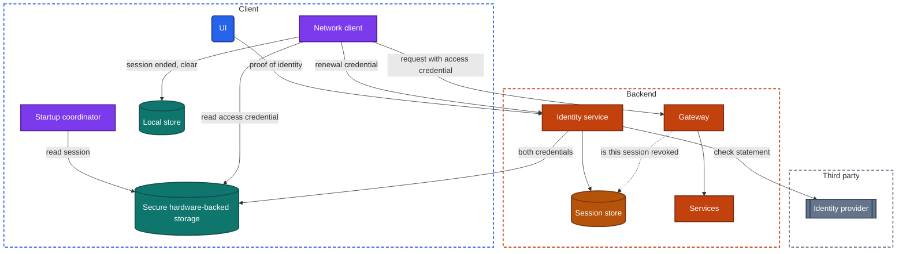
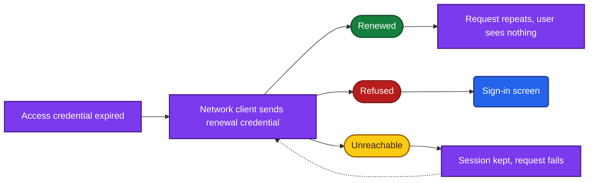
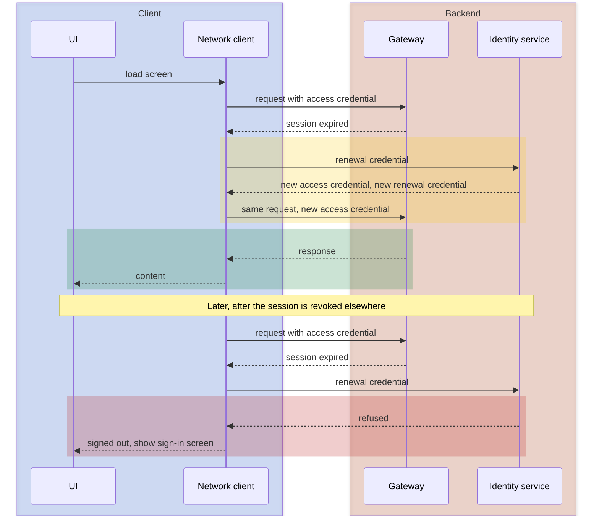

import Probe from '../../../components/Probe.astro';
import Signals from '../../../components/Signals.astro';
import TeardownBar from '../../../components/TeardownBar.astro';
import WorksheetForm from '../../../components/WorksheetForm.astro';

> **The question.** How does this app know who you are, and how long does it keep believing it?

## 20.1 Why this concern exists

Four of the seven constraints ([Chapter 2](/part-1-method/2-the-mobile-constraint-set/)) shape how an app handles identity.

**Untrusted client** is the root. The backend cannot see a person. It sees requests, and each request must carry something that only the right person's device could hold. Anything on the device can be copied by someone with enough access to it, so whatever the request carries must be limited in what it can do and for how long.

**Human attention** pulls the other way. A phone is unlocked dozens of times a day. An app that asks for a password on each of those visits is abandoned. The user expects to prove who they are once and to stay signed in for months.

**Unreliable network** complicates the middle. A session is an agreement between the client and the backend, and the two cannot always talk. The client must decide what a signed-in user may see when the backend cannot confirm anything.

**Process death** means that nothing about the session can live in memory only. The credential is stored on the device, which returns the problem to the first constraint.

The standard answer to these four forces is the same almost everywhere. The user proves identity rarely, by a strong method. The backend then issues credentials that stand in for that proof, with limited lifetimes. This chapter is about the choices inside that answer, and nearly all of them are visible, because sign-in, sign-out and the moments between them are things a user sees.

This chapter covers how the app knows who you are. What the backend lets you do once it knows is the subject of [Chapter 21](/part-2-concerns/21-security-and-trust/).

## 20.2 The design space

### Ways to prove identity

A sign-in method is defined by what it asks the user to demonstrate. There are four capabilities in common use.

**A password.** The user demonstrates knowledge of a secret. It needs nothing but a text field and works on any device. Its weaknesses are well known: passwords are reused, guessed and given away to convincing fake screens. A password also forces the product to build a reset path, and that path becomes a second way in.

**A one-time code.** The backend sends a short code or a link to a phone number or an email address, and the user returns it. The user demonstrates control of that channel at this moment. There is no secret to remember and no reset path, because every sign-in is a reset. The cost is a dependency on delivery: a code that arrives late or never is a failed sign-in, and each text message costs the maker money. A link is the same design with the code carried in a verified web link ([Chapter 8](/part-2-concerns/8-navigation-deep-links-and-screen-state/)).

**An identity provider.** The app hands the user to a third party that already knows them. The provider asks for whatever proof it requires, and returns a signed statement that names the user. The backend checks the statement and creates its own session. The user demonstrates that they hold an account elsewhere. The app's team stores no password and gains a sign-in that is often one tap. They also take on a dependency: if the provider is down, or the user loses that account, sign-in to this app fails too.

**A device-bound credential.** At registration the device creates a key pair in secure hardware-backed storage. The backend stores the public half. To sign in, the backend sends a challenge, the user unlocks the private half with a fingerprint, a face or the device passcode, and the device signs the challenge. The user demonstrates possession of a specific device and the ability to unlock it. Nothing that could be reused is typed or sent. The cost is recovery: a lost device takes the credential with it, unless the operating system copies such credentials between the user's devices.

| Method | What the user demonstrates | What the user sees | Main weakness | Backend needs |
|---|---|---|---|---|
| Password | Knowledge of a secret | A password field and a reset option | Reuse, guessing, fake screens | Password verifier, reset flow |
| One-time code | Control of a channel now | A code field or a link, a resend control | Delivery delay, channel takeover | Code issue and check, delivery through third parties |
| Identity provider | An account elsewhere | A sheet that belongs to another party | Dependency on that party | Check of the provider's statement, account linking |
| Device-bound credential | A device and its unlock | A system unlock sheet, nothing typed | Loss of the device | Public key per device, challenge and response |

Apps combine these. A second factor is a second method required after the first, and it follows the same table. A code sent to a phone after a password is the most common pair.

**Methods belong to moments.** An app may accept a one-time code at first sign-in, a device-bound credential on every later visit, and a password only on the web. Record the method for each moment: first sign-in, return visits, and sensitive actions.

### How long the proof lasts

The second axis is what the backend issues after a successful proof. There are three workable designs.

**One long-lived credential.** The backend issues a single token that is valid until it is revoked. Every request carries it. This is simple, and it has one sharp cost: the credential that travels on every request is also the one that grants months of access.

**An access credential and a renewal credential.** The backend issues two. The access credential is short-lived, minutes to hours, and goes on every request. The renewal credential is long-lived, weeks to months, and is sent to one endpoint only, to obtain a new access credential. The exposure of the long-lived secret drops to one request per renewal. This is the dominant design, and Section 20.3 describes it.

**A credential bound to the device.** Either of the two designs can be strengthened by tying the credential to a key in secure hardware. Each request, or each renewal, is signed by that key. A copied credential is useless on another device. From outside this looks identical to the unbound design. A claim that an app uses it is Speculative unless the maker has published it.

## 20.3 Anatomy

Figure 20.1 shows the parts involved in a session built from two credentials.



*Figure 20.1. The components of a session built from an access credential and a renewal credential.*

Three properties of the figure matter for a teardown.

First, the session lives in two places. The client holds the credentials. The backend holds a session record per signed-in device, which is what a device list shows and what revocation deletes.

Second, only the network client handles credentials. Screens do not know that an access credential expired. This is why a well-built app shows session failure in one uniform way on every screen ([Chapter 3](/part-1-method/3-the-universal-app-model/)).

Third, the dotted line is optional, and it is the most consequential choice in the figure. Section 20.4 returns to it.

### Silent renewal

The access credential expires many times a day. The network client replaces it without the user noticing. This is silent renewal.

```text
function send(request):
  response = transport.send(request.with(accessCredential))
  if response is not SessionExpired: return response
  match renewOnce():                 // all waiting requests share one renewal
    Renewed(newAccess):
      return transport.send(request.with(newAccess))
    Refused:
      endSessionLocally()            // the backend no longer accepts this device
      return SignedOut
    Unreachable:
      return Failed                  // a network fault proves nothing about the session
```

The three outcomes of a renewal produce three different things on screen.



*Figure 20.2. The three outcomes of a silent renewal.*

- **Renewed.** Nothing visible, apart from one request that takes two extra round trips. You cannot see a successful renewal.
- **Refused.** The session is over. A careful app explains why, for example "you were signed out because your password changed". A plain one drops you on the sign-in screen with no message. The worst leaves you on a screen where every action fails until you restart.
- **Unreachable.** The app keeps the session and treats the failure like any other network failure. An app that signs you out because it could not reach the backend has merged the last two outcomes, and that is a defect you can see in airplane mode.

Two details of renewal produce visible bugs.

**Concurrent renewal.** A screen often fires several requests at once, and all of them fail together when the access credential expires. If each one starts its own renewal, the backend receives several renewal requests with the same renewal credential.

**Rotation.** Many backends replace the renewal credential on every renewal and treat any reuse of an old one as a sign of theft, ending the whole session. This is a strong defense. Combined with concurrent renewal, or with a renewal whose response is lost on a weak network, it signs out a legitimate user for no reason they can see. An app that signs you out now and then, more often on poor connections, has rotation and one of these two gaps. That reading is Speculative, because expiry by lifetime looks the same on any single occasion.



*Figure 20.3. A silent renewal that succeeds, and one that is refused after revocation.*

### The session at launch

At a cold start the startup coordinator reads the stored session before the first screen ([Chapter 7](/part-2-concerns/7-launch-and-startup/)). Reading is local. Confirming it with the backend is not. An app that trusts the stored session opens straight to signed-in screens, and learns of a revoked session only when its first request is refused. P20.1 shows which choice an app made.

## 20.4 Lifetime, revocation and the device list

### When a session ends

A session ends for one of five reasons.

| Cause | Who decides | What you see |
|---|---|---|
| You sign out | You | The sign-in screen, at once |
| Idle lifetime passes | Backend rule, counted from last use | Sign-in after a long absence, never during regular use |
| Absolute lifetime passes | Backend rule, counted from sign-in | Sign-in at a fixed interval, however often you use the app |
| Revocation | You on another device, or the backend | Sign-in at an unexpected moment |
| The credential is lost | The device | Sign-in after a reinstall, a restore or an update |

A consumer app usually sets a long idle lifetime and no absolute one, so that a regular user never signs in twice. A banking app sets a short one, often minutes, and softens it with a quick local unlock. A workplace app often sets an absolute lifetime because an employer requires it. The lifetime tells you what the team feared more: a stolen session, or a lost user.

### How fast revocation lands

Revocation is the act of ending a session from somewhere other than the device that holds it. A password change, a "sign out everywhere" control, and a tap on one entry in a device list are all revocations. The backend deletes the session record. The interesting question is when the revoked device finds out, and the answer exposes how the gateway checks the access credential.

**Checked on every request.** The gateway looks the session up in the session store each time. Revocation takes effect on the device's next request. The cost is one lookup per request.

**Checked at renewal only.** The access credential is self-contained: it carries its own expiry and a signature, and the gateway verifies it without a lookup. This is cheaper and faster. A revoked device keeps working until its access credential expires, and is refused at the next renewal. The delay is the access credential's lifetime.

**Pushed.** In either design the backend can also tell the device directly, over a persistent connection or by platform push ([Chapter 14](/part-2-concerns/14-real-time-delivery/)). The revoked device signs itself out within seconds, even while idle on a screen.

P20.4 separates these. A device that is signed out in seconds while you only watch it was told by push. A device that keeps showing its screen and fails on your next tap is checked per request. A device that keeps working for minutes and then fails is checked at renewal, and the delay is a rough measure of the access credential's lifetime.

### The device list

A list of signed-in devices is the session store shown to the user. Each row is one renewal credential. What the rows contain tells you what the backend records at sign-in: a device name, an app version, an approximate place derived from the network address, and a last-active time.

The last-active time is worth a second look. If it updates to the minute, the backend writes to the session record on every request. If it is coarse, such as "this week", it is written at renewal or on a timer.

Some apps limit how many devices may hold a session at once. A limit of one, where a new sign-in ends the old session, is common in messaging apps that tie an account to one phone ([Chapter 39](/part-3-archetypes/39-messaging/)) and in banking. A limit of a few is common in paid media. P20.3 finds the limit.

## 20.5 Biometric unlock: a local gate or a proof

A fingerprint or face prompt inside an app is one of two different things, and they look alike.

**A local gate.** The app asks the operating system whether the device's owner is present. The system answers yes or no. On yes, the app shows its screens. The session was valid the whole time, and the backend is not involved and does not know the unlock happened. The gate protects against someone who picks up an unlocked phone. It does nothing against a copied credential.

**A proof to the backend.** The biometric match releases a key in secure hardware-backed storage, the key signs a challenge from the backend, and the backend issues or extends a session. This is the device-bound credential of Section 20.2. Here the backend does know, and the unlock is a real sign-in.

Two observations help to separate them.

- A local gate works in airplane mode, provided the app has something to show offline. A proof needs the backend. P20.2 uses this. An unlock that fails offline is not conclusive, because the app may have a local gate and no offline content.
- A key held in secure hardware is commonly set to become invalid when the device's enrolled fingerprints or faces change. An app that asks you to sign in again with your password after you add a fingerprint to the device is using a bound key. This follows a change to a device-wide setting, so treat it as something to notice when it happens and not as a probe to run.

Many apps use both. The local gate covers return visits within a live session, and the bound key is used for sign-in after the session has ended or before a sensitive action. [Chapter 21](/part-2-concerns/21-security-and-trust/) covers the second proof before a sensitive action.

## 20.6 Guests, recovery, reinstalls and several accounts

### Guest sessions

Many apps let you browse, fill a cart or play before you create an account. There are two designs behind that.

**A guest session on the backend.** On first launch the backend creates an account with no credentials and issues a session for it. The guest is a real user with a real identifier. Creating an account later attaches credentials to the same record, so everything carries over with no migration. The risk sits at the other branch: signing in to an existing account means two accounts must be merged, and the app needs a rule for a guest cart meeting a saved cart.

**Guest state on the device only.** The client keeps guest data in its local store and the backend knows nothing until sign-up, when the client uploads it or discards it. This is cheaper, and it loses everything on reinstall.

A guest who receives a platform push about an abandoned cart, or whose state appears on another surface of the same product, has a guest session on the backend. P20.8 checks what happens at conversion.

### Account recovery

Every way to regain a lost account is a way to sign in, and the weakest one sets the strength of the whole account. A strong sign-in guarded by a reset link to an old email address is exactly as strong as that email account.

Recovery designs differ in what they demand: one channel, such as a link to the registered email. A second proof on top, such as a stored recovery code, approval from a device that is still signed in, or a waiting period during which the real owner is notified and can cancel. Or no self-service at all, with a support process that checks identity documents. P20.9 walks the path far enough to see which, without completing it.

Recovery should also end every existing session, since the reason for recovery may be that someone else is signed in. Whether it does is the same observation as P20.5.

### What survives a reinstall

Deleting an app removes its local store and its caches. Whether it removes the session depends on where the credential was kept and on the operating system.

| After reinstall | Reading |
|---|---|
| Signed in at once | The credential outlived the app. On some systems secure hardware-backed storage survives an uninstall ([Chapter 11](/part-2-concerns/11-local-storage-caching-and-prefetching/)), or the credential is shared among several apps from the same maker |
| "Continue as" your name, one tap | The device kept an identifier or a device-bound credential, and the backend still wants a proof |
| An empty sign-in form that the system fills in | The app kept nothing. The operating system's password manager did |
| An empty sign-in form | Nothing survived |

The first row is often unintended. Teams that want a clean first launch write a marker to ordinary storage and wipe the credential when the marker is missing.

A restore to a new device from a backup is a different case. Secure hardware-backed storage is commonly excluded from what moves to another device, so the app arrives with its settings and without its session.

### Several accounts on one device

Support for several accounts multiplies everything in this chapter by the number of accounts. Each account has its own pair of credentials, its own partition of the local store ([Chapter 11](/part-2-concerns/11-local-storage-caching-and-prefetching/)) and its own push registration. Notifications must say which account they are for.

The quality of the design shows in the switch. An instant switch that works offline means that each account's session and data are kept side by side. A switch that reloads everything means one partition is rebuilt each time. A switch that asks for credentials is a sign out and a sign in with a remembered identifier.

## 20.7 Probes

Run P20.1 and P20.2 first. They cost a minute each and need one device. P20.3 to P20.5 need a second device or the web version. Several of these probes can sign you out, so make sure you can sign in again before you start. Select the outcome you saw in each probe, and it is recorded in your worksheet for the teardown chosen here.

<TeardownBar />

### P20.1 Offline while signed in

<Probe id="P20.1" />

### P20.2 Return after idle

<Probe id="P20.2" />

### P20.3 Many devices

<Probe id="P20.3" />

### P20.4 Revoke from the device list

<Probe id="P20.4" />

### P20.5 Password change elsewhere

<Probe id="P20.5" />

### P20.6 Long absence

<Probe id="P20.6" />

### P20.7 Reinstall

<Probe id="P20.7" />

### P20.8 Guest to account

<Probe id="P20.8" />

### P20.9 Recovery path

<Probe id="P20.9" />

### P20.10 Several accounts

<Probe id="P20.10" />

## 20.8 Signal-to-design table

<Signals chapter={20} />

## 20.9 The backend this implies

Each client behavior requires specific backend support. Once you have seen the behavior, the following can be Inferred.

- **Any session.** An identity service that checks proofs and issues credentials, and a gateway that checks a credential on every request before any service runs.
- **Silent renewal.** A renewal endpoint, and a session record per device that holds the current renewal credential and its expiry. With rotation, the record also holds enough history to recognize reuse of an old credential.
- **A device list.** Session records that carry device details captured at sign-in and a last-active time. A revoke operation on one record and on all records.
- **Revocation that lands in seconds.** A path from the session store to async delivery, so that deleting a record sends a message to that device. The device's push registration must be tied to the session, and removed with it.
- **One-time codes.** Code issue and check with a short expiry, limits on attempts and on sends ([Chapter 21](/part-2-concerns/21-security-and-trust/)), and delivery through third parties.
- **An identity provider.** A check of the provider's signed statement, and a link table from the provider's user identifier to the app's own. The app's session is separate from the provider's. Ending one does not end the other unless the team built that.
- **Device-bound credentials.** A stored public key per device, and a challenge that is single-use.
- **Guest sessions.** Accounts without credentials, a merge operation, and a rule for cleaning up guests that never return.
- **Recovery.** A flow with its own limits and notifications, and a revoke-all step at its end.

## 20.10 Failure modes and what they reveal

- **Signed out when the network is poor.** The client treats an unreachable backend as a refusal. The two outcomes are not separated in the network client.
- **Signed out now and then for no visible reason.** Rotation of the renewal credential meets concurrent renewal or a lost response. Speculative, since a lifetime rule can look the same.
- **Every action fails until the app is restarted.** Renewal was refused and nothing told the UI. The session ended in the network client and the screens were not informed.
- **A flash of the sign-in screen at launch.** The first frame was drawn before the stored session was read ([Chapter 7](/part-2-concerns/7-launch-and-startup/)).
- **A revoked device keeps working.** The access credential is self-contained and long-lived, or the device was offline and showing cached screens. The second is expected. The first is a design choice with a cost.
- **Notifications for an account that signed out.** The push registration was not removed with the session ([Chapter 14](/part-2-concerns/14-real-time-delivery/)).
- **The previous account's content after switching.** Account data is not partitioned ([Chapter 11](/part-2-concerns/11-local-storage-caching-and-prefetching/)).
- **A guest cart that vanishes at sign-in.** Guest state lives on the device only, or the merge rule is "the account wins".
- **A sign-in loop.** Sign-in succeeds and the app returns to the sign-in screen. The credential was issued and could not be stored or read back, often after a restore or an update.
- **Signed in after a reinstall.** The credential survived in secure hardware-backed storage and the app did not check for a first launch.

## 20.11 Worksheet entries

These are the fields this chapter adds to the teardown worksheet. Probe outcomes fill some of them in. Identity is a property of the whole app, so one worksheet per app is enough.

<TeardownBar />

<WorksheetForm chapters={[20]} />

## 20.12 Summary

- Identity is proven by one of four capabilities: a password, a one-time code, an identity provider, or a device-bound credential. Record the method for each moment, not one for the app.
- A session is usually a short-lived access credential plus a long-lived renewal credential. Silent renewal is invisible when it works, and its failure is one of the most recognizable moments in any app.
- A renewal ends as renewed, refused or unreachable. An app that signs you out when offline has merged the last two.
- How fast a revocation reaches another device shows how the gateway checks credentials: on every request, at renewal only, or with a push on top.
- A biometric prompt is either a local gate the backend never hears of, or a proof made with a key in secure hardware. Airplane mode separates them when the app has offline content.
- Guest use, recovery, reinstall and several accounts each expose one more piece: where guest state lives, what the weakest way in is, where the credential is stored, and whether account data is partitioned.
- Some designs cannot be told apart from outside, in particular whether a credential is bound to the device. Record those as Speculative.
