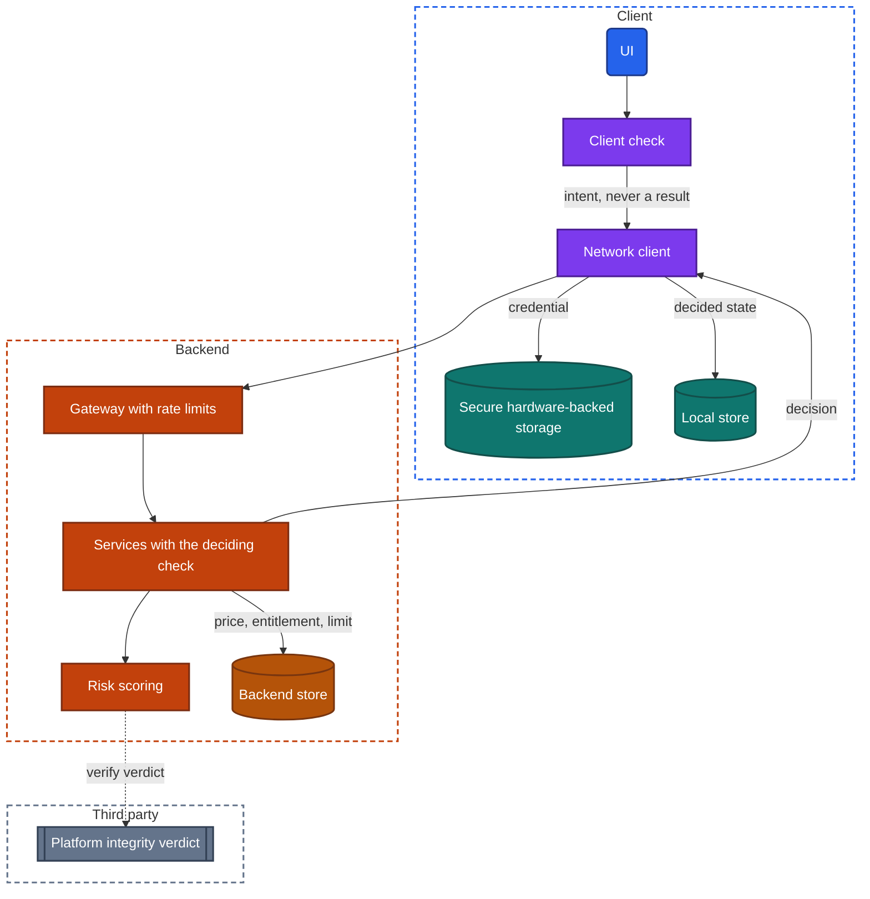
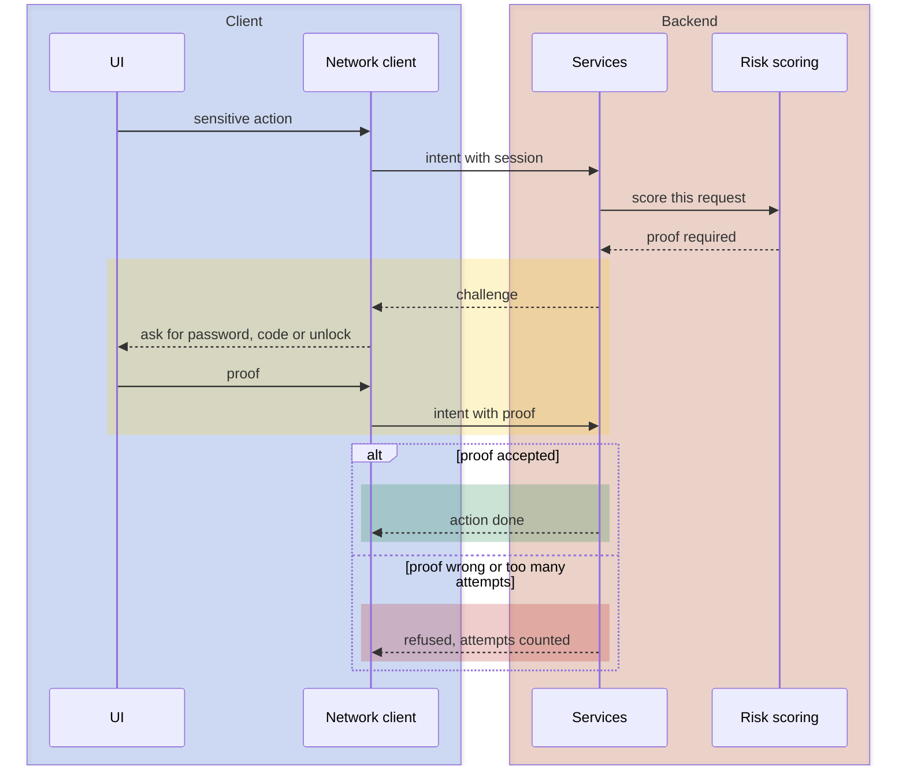

import Probe from '../../../components/Probe.astro';
import Signals from '../../../components/Signals.astro';
import TeardownBar from '../../../components/TeardownBar.astro';
import WorksheetForm from '../../../components/WorksheetForm.astro';

> **The question.** What does this app's backend refuse to trust the client with, and how is the rest protected?

## 21.1 Why this concern exists

One of the seven constraints ([Chapter 2](/part-1-method/2-the-mobile-constraint-set/)) is the subject of this chapter, and three others shape the answers.

**Untrusted client.** The app runs on hardware its maker does not control. The person holding the device can read what the app stores, watch what it sends, and run a changed copy of it. The backend receives requests and has no certain way to know that the real app produced them. Every design in this chapter follows from that one fact.

**Slow release.** A secret shipped inside the app is shipped to everyone, for years. A protection built into version 4 does not exist in version 3, which is still in use. A protection that breaks cannot be withdrawn.

**Human attention.** Every protection that asks the user for something costs attention. A second proof before each payment is safe and tiring. Teams spend this budget where the damage would be largest.

**Platform rules.** The operating system supplies most of the building blocks: secure hardware-backed storage, isolation between apps, a statement about whether the device and the app are unmodified, and control over screenshots. The app chooses which to use.

### The limits of this chapter

**This handbook does not cover defeating protections.** Every probe in this chapter is something an ordinary user does in ordinary use: take a screenshot, open the app switcher, start an action and read what the app asks for, sign out. No probe tampers with the app, the device or the traffic, and none tries to get past a limit. You run them on your own accounts and devices only.

That restriction has a cost, and the chapter is honest about it. Much of security design has no signature a normal user can see. Whether stored data is encrypted, whether a connection would be refused on a hostile network, whether the backend rechecks a value the client already checked: these stay Speculative. The chapter describes those designs so that you know what the candidate designs are, and it marks each one that cannot be confirmed.

## 21.2 The design space

A security design is a set of answers to one question, asked of every decision and every piece of data: where does this live, and who can change it. Four postures cover what you will meet, each including the one before it.

**The client decides.** The client computes the price, checks the limit, knows whether you have paid, and tells the backend the result. The backend stores what it is told. This is how a prototype works. It fails as soon as anything of value is involved, because the party that benefits from a wrong answer is the party computing it.

**The backend decides.** The client sends intent: "buy item X", "open lesson 12". The backend works out the price, the entitlement, the limit and the permission from its own data, and returns the result. The client may still check things first, to give fast feedback, and those checks are a courtesy. This is the baseline for any app with accounts or money. Section 21.3 describes it.

**A hardened client.** On top of a deciding backend, the client protects what it must hold. Secrets go in secure hardware-backed storage. Connections are restricted to the backend's own certificate. The app asks the platform whether the device and the app are unmodified. Sensitive screens are hidden from screenshots. None of this replaces the backend's decisions. It raises the cost of copying a session or of automating the app.

**Adaptive.** The backend scores each request by its risk and responds in proportion. A familiar device doing a familiar thing passes. A new device, a large amount or an unusual pattern meets a second proof, a delay or a refusal. This needs data about normal behavior, and it is the posture of banking and of large consumer platforms.

| Posture | Who decides price, entitlement, limit | What the client protects | What a user can see | Typical of |
|---|---|---|---|---|
| The client decides | Client | Nothing | Rule results offline, at once | Prototypes, apps with no backend |
| The backend decides | Backend | The session | Actions with value need the network | Most apps |
| A hardened client | Backend | Session, stored data, transport, screen | Blocked screenshots, covered app switcher, clean sign out | Finance, health, workplace |
| Adaptive | Backend, with a risk score | The same | A second proof that appears only sometimes | Banking, large platforms |

**Postures belong to features.** A news app may leave its articles unprotected and guard its subscription screen carefully. Record the posture for each feature that carries value.

## 21.3 Anatomy

Figure 21.1 shows where each check and each protection sits.



*Figure 21.1. Where decisions and protections sit in a design where the backend decides.*

### What the backend decides

Four kinds of value are never left to the client in a sound design.

- **Prices and totals.** The client sends item identifiers and quantities. The backend computes the amount. The total you see before confirming is either computed by the backend and displayed, or computed on the client for display and recomputed on the backend for charging.
- **Entitlements.** Whether you have paid for a feature or a piece of content is a fact in the backend store ([Chapter 26](/part-2-concerns/26-payments-and-subscriptions/)). The client holds a copy so that it can draw the right screen.
- **Limits.** How many items, how many attempts, how much per day. Counters live on the backend, because a counter on the device is reset by a reinstall.
- **Permissions.** Whether this user may read or change this item. The backend checks on every request, using the session and its own data. A client that hides a button has changed the screen and nothing else.

The clearest signal of a deciding backend is that actions with value need the network. P21.1 uses this.

The exception is deliberate. An entitlement is often cached on the device with a time limit, so that a subscriber can use paid features on a flight. This is a trade: the backend accepts that the copy may be wrong for a bounded period. A paid feature that works offline has a cached entitlement, and how long it keeps working is the time limit. The design remains sound as long as the valuable thing itself, such as the content, was delivered while the entitlement was true.

### Validation on both sides

A client check and a backend check do different jobs.

```text
function submit(form):
  errors = clientCheck(form)          // format, required fields, obvious limits
  if errors: return show(errors)      // instant, works offline, saves a round trip
  match backend.submit(form.intent):  // the backend repeats every check, and adds its own
    Accepted(result): show(result)
    Rejected(errors): show(errors)    // uniqueness, balance, permission, current price
    Unreachable:      showRetry()
```

The client check exists for the user. It answers at once and saves a request. The backend check exists for the system. It is the only one that counts, because the backend cannot know that the client check ran.

Some rules can only be checked on the backend: whether a name is taken, whether the balance covers the amount, whether the price changed a second ago. Others are checked on both sides, and the two copies can drift apart, because the client's copy ships with a release and the backend's does not ([Chapter 33](/part-2-concerns/33-releases-and-compatibility/)). An old version that accepts input which then fails with a generic backend error is showing that drift.

A user can see client checks: they answer instantly and in airplane mode. A user cannot see backend checks for the rules the client already enforces, because honest input that passes the first also passes the second. This asymmetry matters. You can observe that a client check exists. You cannot observe that a backend check is missing, and trying to find out would mean sending input the client refuses, which is outside this handbook. "The backend validates everything" stays Inferred from the posture as a whole, or Speculative.

A client-only check does leave traces in ordinary use. The same rule differs between the app and the web version, or between two app versions. A limit resets after a reinstall. A rule result is available offline. Each of these says the rule lives on the client. None says the backend lacks it.

## 21.4 Protecting what the client holds

### Secrets on the device

The client must hold a small number of secrets: the session credentials ([Chapter 20](/part-2-concerns/20-identity-and-sessions/)), keys that encrypt local data, and for end-to-end encryption the user's private keys ([Chapter 39](/part-3-archetypes/39-messaging/)). The storage choices from [Chapter 11](/part-2-concerns/11-local-storage-caching-and-prefetching/) carry different protection.

| Where | Protected by | Suitable for |
|---|---|---|
| Secure hardware-backed storage | Device hardware and the device's unlock state | Credentials and keys |
| The app's private storage | Isolation between apps | Content, settings, the local store |
| The app's private storage, encrypted with a key in secure hardware | Both | Sensitive content, such as messages or health records |
| Inside the app package | Nothing | Nothing secret |

The last row deserves a paragraph. A key built into the app is delivered to every device that installs it, so it is not a secret. Identifiers for third parties are often shipped this way on purpose, and they are designed to be public. A value that grants real power must stay on the backend, and the client reaches the third party through the app's own services.

Almost none of this is visible. The one faint signal is a restore to a new device from a backup: an app that arrives with its settings and without its session keeps its credentials in storage that does not travel between devices. That is Inferred. Whether the local store is encrypted is Speculative for every app, unless its maker has published it.

### Data in transit

Encryption between client and backend is universal, and the platforms make it the default. The design choice that remains is how much the client trusts the device's list of certificate authorities.

**Default trust.** The client accepts any certificate the device trusts for the backend's name. A device that has been told to trust an additional authority, for example by an employer's management profile, will let that authority read the traffic.

**Certificate restriction.** The client carries its own short list of acceptable certificates or keys and refuses everything else, whatever the device trusts. Traffic cannot be read by an added authority. The cost falls under slow release: when the backend's certificate changes, old versions that carry only the old list stop connecting. Teams that use this ship backup entries, or deliver the list through remote config ([Chapter 30](/part-2-concerns/30-remote-config-and-experiments/)), which moves the trust to that channel.

**A refusal to connect on a network that intercepts traffic is Speculative from outside.** A normal user meets interception in two places: a captive network before sign-in ([Chapter 13](/part-2-concerns/13-network-transport-and-resilience/)), and a managed device. On both, every app fails to load, with or without certificate restriction, because even default trust rejects the network's own page presented under the backend's name. The two designs produce the same error on the same screen. P21.8 records what the app shows, and its reading is about error handling, not about which trust design is in use.

One failure does point here. An old version of an app that stops connecting on every network on one particular day, while the current version works, is consistent with an expired restriction list. It is also consistent with a forced-update gate that failed to draw ([Chapter 7](/part-2-concerns/7-launch-and-startup/)). Speculative.

### Device and app integrity

The backend would like to know that a request comes from the real app on an unmodified device. There are two designs.

**A local check.** The app looks for signs that the operating system has been modified or that the app itself has been changed, and refuses to run or disables features. The check runs on the device it is judging, so it can be removed along with everything else. It deters casual attempts.

**A verdict the backend verifies.** The app asks the platform for a signed statement about the device and the app, bound to a value the backend chose, and sends it along. The backend verifies the statement with the platform. The decision is made where the client cannot change it. This is the dotted line in Figure 21.1. It adds a dependency on a third party and a round trip, so it is used at sign-in and before sensitive actions, not on every request.

You cannot probe this without modifying a device, and this handbook does not do that. What you can do is read. Makers that enforce integrity usually say so in their help pages or store listing, because users on modified devices contact support. P21.9 records what the maker states. That is an Observed fact about a publication, and it does not tell you which of the two designs is behind it.

### Hiding sensitive screens

The screen is an exit. Three protections close it.

- **Screenshot and recording control.** The app marks a screen so that captures come out blank, or are refused. On systems that do not allow blocking, the app can detect a capture and react, by warning the user or telling the other party.
- **App switcher cover.** The operating system keeps a picture of each app for the switcher. An app that covers its content with a logo or a blur when it leaves the foreground keeps balances and messages out of that picture.
- **Input control.** Sensitive fields turn off suggestions and copying. Some apps draw their own number pad so that no third-party keyboard sees a PIN.

These are the most observable protections in the chapter, and they are applied per screen. P21.2 and P21.3 check them. Which screens an app protects tells you what its team classified as sensitive.

## 21.5 Abuse controls and second proofs

### Rate limits

Any endpoint that can be called can be called a million times. A rate limit caps how often one party may call it. The design questions are what counts as one party and what happens at the cap.

| Counted per | Stops | Weakness |
|---|---|---|
| Account | Guessing against one account | Does nothing before sign-in |
| Device | One device trying many accounts | A device identifier is whatever the client says |
| Network address | Volume from one place | Many honest users share one address on mobile networks |
| Target, such as a phone number | Flooding one person with codes | An honest user who mistypes is delayed |

At the cap the backend delays, refuses for a period, or asks for proof that a person is present. Each has a visible form: a countdown on a resend control, a message such as "too many attempts, try again in an hour", or a challenge.

A countdown is client UI. The limit behind it is on the backend, at the gateway or in the service. From outside you see only the message, and an honest user meets it only by accident or in P21.5, which stops at the first limit message. Whether the limit is counted per account, per device or per target is Speculative.

Endpoints that cost the maker money or harm other people get the strictest limits: sending a text message, sending an invitation, creating an account.

### A second proof before a sensitive action

A session proves that this device signed in at some point. It does not prove that the person holding it now is the owner. Before an action with lasting consequences, many apps ask again. This handbook calls that a step-up proof.

The design has three parts.

**Which actions.** Changing the password, email or phone number. Adding a payee. Showing a full card number. Deleting the account. Exporting data. The list is the team's own ranking of harm.

**Which proof.** A local gate, a password, a one-time code, or approval on another device. [Chapter 20](/part-2-concerns/20-identity-and-sessions/) explains why a local gate proves less than the others: the backend never hears of it. A step-up that works in airplane mode is a local gate.

**When.** Always, or only when the risk score is high. A step-up that appears for a new payee and not for a known one, or on a new device and not on an old one, is adaptive. Many designs also keep a short window after a proof during which they do not ask again.



*Figure 21.2. A step-up proof that the backend demands and verifies.*

In Figure 21.2 the backend asks for the proof and checks it. In the weaker form, the client shows a local gate and then sends the action as usual. The two differ in exactly one observable way, which P21.4 records: whether the proof is something only the backend could verify.

## 21.6 What remains after sign out

Sign out is the moment the device may change hands. [Chapter 11](/part-2-concerns/11-local-storage-caching-and-prefetching/) lists what a complete sign out removes. From the security side, there are three grades of residue.

- **Nothing.** The app is as it was on first launch.
- **An identifier.** The name, avatar or email of the last account is shown to speed up the next sign-in. This is a deliberate trade of privacy for convenience.
- **Content.** Cached screens, downloaded files, old notifications, a widget that still shows data ([Chapter 25](/part-2-concerns/25-platform-surfaces-widgets-wearables-and-extensions/)). Each one is a store that sign out did not reach.

The backend side of sign out matters as much. The session record should be deleted, so that a copy of the credential is useless afterwards, and the push registration removed. Neither is directly visible. A notification that arrives for a signed-out account shows that the second did not happen.

## 21.7 Probes

Run P21.1 to P21.3 first. They take a minute each and change nothing. P21.5 and P21.6 can lock you out or sign you out for a while, so run them when you do not need the account urgently. Select the outcome you saw in each probe, and it is recorded in your worksheet for the teardown chosen here.

<TeardownBar />

### P21.1 Offline refusal

<Probe id="P21.1" />

### P21.2 Screenshot of a sensitive screen

<Probe id="P21.2" />

### P21.3 App switcher

<Probe id="P21.3" />

### P21.4 Second proof

<Probe id="P21.4" />

### P21.5 One-time code limit

<Probe id="P21.5" />

### P21.6 Sign-out residue

<Probe id="P21.6" />

### P21.7 Validation timing

<Probe id="P21.7" />

### P21.8 Intercepting network

<Probe id="P21.8" />

### P21.9 Stated device requirements

<Probe id="P21.9" />

## 21.8 Signal-to-design table

<Signals chapter={21} />

## 21.9 The backend this implies

Most of this chapter's design lives on the backend, so the client observations translate directly.

- **Actions with value need the network.** Services that hold prices, entitlements, limits and permissions as their own data, and that accept intent, not results. An authorization check on every request, tied to the session.
- **A cached entitlement.** An entitlement record with an expiry that the client may hold, and a refresh path. Revoking a purchase reaches the device at the next refresh.
- **Rate limits.** Counters at the gateway keyed by account, device, address or target, with windows and penalties. A shared counter store, because requests land on many machines.
- **A step-up proof the backend verifies.** A challenge that is single-use and tied to the specific action, so that a proof given for one action cannot be spent on another. A record of recent proofs for the no-ask window.
- **An adaptive posture.** A history of devices, places and behavior per account, and risk scoring that services consult. A way to tell the owner about unusual events through a channel the session does not control.
- **An integrity verdict.** A verification step against the platform, and a policy for devices that fail: refuse, limit, or allow and record.
- **Clean sign out.** Deletion of the session record and of the push registration.

A backend that decides also records. Sensitive actions are written to an audit trail with the session and device that performed them. You see its surface as a "recent activity" screen or as security emails.

## 21.10 Failure modes and what they reveal

Each of these is something a user meets in normal use. None requires doing anything the app does not offer.

- **A total changes at the last step.** The client computed a display total and the backend computed the real one. The two copies of the pricing rule disagree.
- **A paid feature keeps working long after a subscription ends.** The entitlement is cached with a long time limit, or with none.
- **A paid feature locks the moment the network drops.** The entitlement is not cached at all. The backend decides on every use.
- **A form accepted by the app and rejected with a generic error.** The backend holds a rule that this version's client check does not. The rule changed after the release.
- **A rule that differs between the app and the web version.** The rule is implemented once per client. Speculative as to what the backend enforces.
- **A balance visible in the app switcher.** No cover on that screen. Screen protection is applied per screen, and this one was missed.
- **A locked account after a few mistyped codes.** A limit counted per account with a hard penalty. It protects against guessing and lets a stranger lock you out.
- **No resend limit on codes.** The send endpoint is not limited per target, or the limit is higher than you reached.
- **An old version that stops connecting everywhere.** Consistent with an expired certificate restriction list. Speculative.
- **Notifications for an account after sign out.** The push registration outlived the session.
- **The previous user's name on the sign-in screen of a shared device.** Identifier residue, kept on purpose.

## 21.11 Worksheet entries

These are the fields this chapter adds to the teardown worksheet. Probe outcomes fill some of them in. Fill the worksheet for each feature that carries value, since the posture differs between features.

<TeardownBar />

<WorksheetForm chapters={[21]} />

## 21.12 Summary

- The backend cannot trust the client, so prices, entitlements, limits and permissions are decided on the backend. The client sends intent and displays results.
- A client check gives fast feedback and a backend check decides. You can see that a client check exists. You cannot see that a backend check is missing, and this handbook does not try to find out.
- The client protects what it must hold: secrets in secure hardware-backed storage, connections restricted to known certificates, an integrity verdict the backend verifies, and sensitive screens hidden from captures and the app switcher.
- Screen protection, second proofs, limit messages and sign-out residue are observable. Storage encryption, certificate restriction and integrity checks are mostly not, and claims about them stay Speculative.
- A second proof is either a local gate or something the backend verifies. Airplane mode and the kind of proof asked for separate the two.
- What a team protects shows what it ranked as harmful. The list of screens that block screenshots and the list of actions that ask for a second proof are that ranking made visible.
- Every probe here is ordinary use. The handbook does not cover defeating protections.
