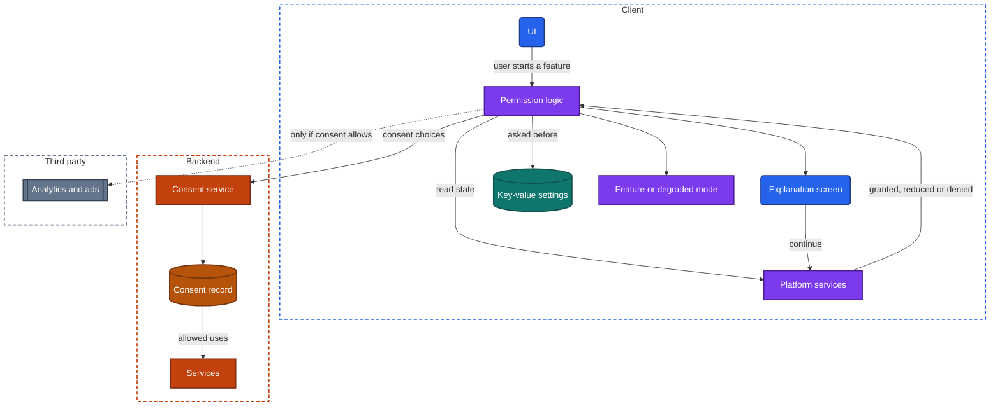
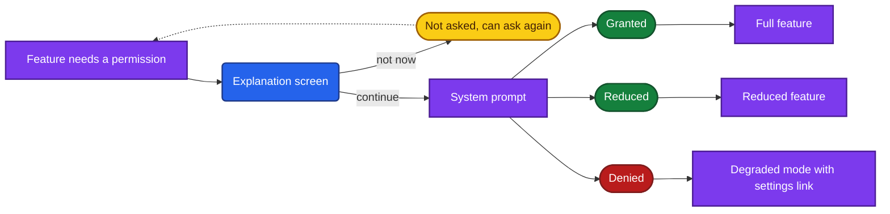

import Probe from '../../../components/Probe.astro';
import Signals from '../../../components/Signals.astro';
import TeardownBar from '../../../components/TeardownBar.astro';
import WorksheetForm from '../../../components/WorksheetForm.astro';

> **The question.** What does this app ask to access, when does it ask, and what does it do when refused?

## 22.1 Why this concern exists

**Platform rules** ([Chapter 2](/part-1-method/2-the-mobile-constraint-set/)) create this concern almost alone. The operating system stands between the app and everything personal on the device: location, camera, microphone, photos, contacts, calendar, motion, nearby devices, notifications. The app cannot take any of these. It can only ask, through a prompt the system draws and the user answers. The store adds its own rules: a published statement of what the app collects, and a way to delete an account.

Three properties of that arrangement drive the design.

**The answer can be no.** Every feature that depends on a permission has a second version of itself, the one that runs when permission is refused. The team either designs that version or ships whatever happens by accident.

**The answer can change.** A user can grant today and revoke next month, in device settings, while the app is not running. The system can also reduce a grant by itself, for example by resetting permissions of an app that has not been opened for months. The app learns of this only when it next checks.

**The question can often be asked only once.** After a refusal, the system commonly stops showing its prompt for that permission. The app's remaining route is to send the user to device settings. This makes the timing of the first request the most valuable decision in the chapter, and it is why **human attention** is the second constraint at work. A prompt at the wrong moment is refused by reflex.

Law is a further force, and it varies by region. Rules on consent to tracking and to non-essential data use, on deletion and on export differ between jurisdictions. An app that operates in several regions either builds one behavior that satisfies the strictest, or varies its behavior by region. That variation is visible to a reader who travels or compares notes with someone elsewhere.

Privacy is unusual among the concerns in this book. The operating system forces the app to act in the open. Each request is a visible event with a visible answer, so this chapter's probes are among the cheapest and most conclusive.

## 22.2 The design space

### When to ask

**At launch, all at once.** The first run shows a series of system prompts before any content. This is the least work, since one piece of startup code requests everything. It is also the least effective. The user has no reason yet to say yes, and a refusal given here is hard to reverse.

**In onboarding, with an explanation.** The first run walks through screens that explain each permission and then show the system prompt. The user at least knows why. The request is still made before the user has met the feature it serves.

**In context.** The app asks at the moment the user does something that needs the permission: the camera prompt when they tap the scan button, the location prompt when they tap "near me". The reason is obvious from the action. The cost is that every feature must handle the not-yet-asked state, and the request logic is spread across the app.

**In context, with an explanation screen first.** Before the system prompt, the app shows its own screen that states the benefit and offers "continue" and "not now". Only "continue" triggers the system prompt. The purpose is to protect the one chance: a user who would refuse says "not now" to the app's own screen, which the app can show again later, and the system prompt is spent only on users who are likely to grant.

**Never.** The app avoids the permission by using a capability that needs none. A system picker returns the items a user chose without giving the app access to the library. A system share sheet sends content without access to contacts. A typed address replaces location. This is the cheapest design to run and the most private, and it is available more often than apps use it.

| Timing | What you see on first run | Grant rate | Cost to build | After a refusal |
|---|---|---|---|---|
| At launch | System prompts before any content | Lowest | Lowest | Often stuck, features silently missing |
| Onboarding with explanation | Explanation pages, then prompts | Low to medium | Low | Onboarding rarely returns |
| In context | No prompts until a feature is used | High | Medium | The feature can explain and offer settings |
| In context with an explanation screen | The app's own screen, then the prompt | Highest | Medium to high | The app can ask again later |
| Never | No prompt at all | Not applicable | Low | Not applicable |

**Timing belongs to permissions, not to apps.** A navigation app asks for location on first run, because it is nothing without it, and for the microphone only when voice search is tapped. Record the timing for each permission.

### How much to ask for

The second axis is the size of the grant. Operating systems offer reduced forms of most permissions, and an app chooses whether to work with them.

| Permission | Full grant | Reduced grants |
|---|---|---|
| Location | Precise, at all times | Approximate. Only while the app is in use. This one time |
| Photos and media | The whole library | Selected items only. A system picker with no permission |
| Contacts | The whole address book | A system picker that returns one contact |
| Camera and microphone | Direct capture inside the app | The system's capture screen, which returns one result |
| Notifications | Alerts with sound | Quiet delivery. Per-category switches in the app |

A design that accepts the reduced form works for more users. A design that insists on the full form is simpler inside, and it tells you that either the feature needs it or nobody built the alternative. [Chapter 24](/part-2-concerns/24-location-sensors-and-hardware/) covers what an app does with location once it has it.

## 22.3 Anatomy

Figure 22.1 shows the parts involved. A permission's state is held by the operating system, not by the app. The app may only read it and request a change.



*Figure 22.1. The components of a permission request and of consent.*

### The states of a permission

From the app's side a permission is in one of five states.

| State | Meaning | What the app can do |
|---|---|---|
| Not asked | The system prompt has never been shown | Show the prompt, once |
| Granted | Full access | Use the capability |
| Reduced | Approximate, selected items, or while in use only | Use the reduced capability, or ask for more |
| Denied | The user refused, and the system will not prompt again | Explain, and link to device settings |
| Restricted | A device policy forbids it, and the user cannot change it | Degrade. Asking is pointless |

The request logic follows from the table.

```text
function useFeature(permission):
  match platform.state(permission):
    Granted:  return runFeature()
    Reduced:  return runFeature(reduced = true)   // or explain what full access adds
    NotAsked:
      if not explanationAccepted(permission):     // the app's own screen, repeatable
        return showExplanation(permission)
      answer = platform.request(permission)       // the one system prompt
      return useFeature(permission)               // read the new state, do not assume
    Denied:   return degrade(offerSettingsLink = true)
    Restricted: return degrade(offerSettingsLink = false)
```

Two lines carry the design. The explanation is checked before the system prompt is spent. After the prompt, the state is read again from the platform, because the answer may be a reduced grant that the app did not ask for.



*Figure 22.2. The outcomes of one permission request.*

## 22.4 Refusal and revocation

### Degraded modes

What a feature does without its permission is a design in its own right. There are four grades.

- **A fallback.** The feature works by another route. Without location, the user types a city. Without the camera, they enter the code by hand. Without contacts, they type a phone number. The team built the feature twice.
- **A blocked feature with an explanation.** The feature shows why it cannot run and offers a link to device settings. Nothing else in the app is affected.
- **A silent failure.** A blank map, an empty list, a button that does nothing. The code assumed a grant.
- **A blocked app.** The whole app refuses to continue until the permission is granted. This is justified when the permission is the product, as with a camera app, and it is a choice otherwise.

The fallback grade usually reveals a second data path. A typed city goes to the backend as text and comes back as coordinates, so the backend has a place-lookup service that the granted path never uses.

### Asking again

After a refusal the system prompt is usually unavailable. A feature that is tapped again shows which case the team handled. An app that shows its own explanation with a link to settings has read the denied state. An app that does nothing has called the request, received an immediate "denied" from the system and ignored it.

Some apps reopen the question on a schedule, with a banner or a card in a feed. That needs a stored record of when the user last declined, in key-value settings on the device or on the backend. If the card returns after a reinstall at the same point in your use, the record is on the device and was reset.

### Revocation later

A grant can be withdrawn while the app is in the background or not running. The app meets the change in one of two ways.

On some operating systems, changing a permission in device settings ends the app's process. The next launch is a cold start, or a state restoration ([Chapter 8](/part-2-concerns/8-navigation-deep-links-and-screen-state/)) into a screen whose permission is now gone. An app that restores the screen and handles the missing permission has both state restoration and a state check at screen entry. An app that restarts at its first screen has neither, or only the second.

On others the process survives, and the app must notice by itself. A sound design reads the state every time the feature is entered and every time the app returns to the foreground. A weaker one read the state once, at launch or at first grant, and kept the answer. That design shows a live-looking feature that no longer works: a map with a frozen position, an upload control that fails.

Revocation also has a backend side. Data the app collected under the grant is still on the backend. A location-sharing feature must stop sharing and tell the other party, and a contacts feature must decide whether uploaded contacts are kept. What the other party sees after you revoke shows whether revocation is a client event only or is sent to the backend.

## 22.5 Consent

A permission is about a capability of the device. Consent is about a use of data. The system gates the first. Law, store rules and the maker's own policy gate the second.

### Tracking

Tracking here means linking what you do in this app with what you do in other companies' apps and sites, usually for advertising ([Chapter 27](/part-2-concerns/27-ads-attribution-and-growth/)). Platforms treat it in one of two ways: a system prompt that the app must show before it may read the device's advertising identifier, or a device-wide setting the user controls.

A refusal should change what data leaves the device, and that change is not visible. What you can see is the app's behavior around the question: whether its own screen comes before the prompt, whether it asks again, and whether features are withheld after a refusal. Whether ads become less targeted is too noisy to judge by eye. Speculative.

### Non-essential data use

Analytics, personalization and marketing messages are not needed to deliver the service ([Chapter 34](/part-2-concerns/34-observability/), [Chapter 29](/part-2-concerns/29-personalization-and-on-device-intelligence/)). Where consent is required for them, the app shows a consent screen, typically at first launch, with a choice for each purpose.

The design questions are structural.

**Where is the choice stored?** In key-value settings on the device, or as a consent record on the backend tied to the account. The first is lost on reinstall, so the screen returns. The second follows you to a new device. A consent screen shown before sign-in is necessarily stored on the device first, and may be uploaded after sign-in.

**What does the choice control?** Third-party components that start at launch ([Chapter 7](/part-2-concerns/7-launch-and-startup/)) must wait for the answer. An app in which the consent screen is the very first thing drawn has gated its startup on it. An app that shows content first and a consent banner afterwards either started those components already or started them late. Which of the two is Speculative.

**Are the options balanced?** A screen with "accept all" as a button and refusal behind two more screens is a design decision. Record it.

### Regional variation

The same app often shows a full consent screen in one region and none in another. The backend, or remote config ([Chapter 30](/part-2-concerns/30-remote-config-and-experiments/)), decides which rules apply to this user. It can decide by the device's region setting, by the network address, by the store the app was installed from, or by the country of the account. From outside these are hard to separate, because for most users all four agree. A traveler who sees the consent screen appear abroad has ruled out the account and the store, and nothing more. Treat any claim about the mechanism as Speculative. [Chapter 37](/part-2-concerns/37-accessibility-and-global-reach/) covers regional behavior in general.

## 22.6 Deletion, export and where processing happens

### Account deletion

The major stores require that an app which lets you create an account also lets you start its deletion from inside the app. The path therefore exists in most apps, and its shape exposes the backend.

| What the path looks like | Design behind it |
|---|---|
| In the app, with a grace period during which signing in cancels | Soft deletion. The account is flagged, and a scheduled job erases it later |
| In the app, effective at once | Immediate deletion, or immediate sign out with erasure behind the scenes |
| A form or message to support | A manual process. No deletion operation exists across the backend |
| A link to a web page | The operation exists on the web only, and the app reaches it through a browser |

Deletion is hard on the backend because user data is spread across services, the change log, media delivery, backups and third parties. A grace period is partly a kindness to users who change their mind and partly time for a fan-out that cannot be instant. Data that other users hold, such as messages you sent, follows a product rule that the deletion screen often states. Read it.

P22.8 finds the path and reads it. It does not complete the deletion.

### Data export

An export shows the same structure from the read side. A file that downloads at once comes from one store. A request that is "being prepared" and arrives by email hours later is an asynchronous job that gathers data from many services. The second is the usual one for any app of size, and the waiting time hints at how the job is scheduled.

The export's contents are the maker's own statement of what the backend holds about you. Categories you did not expect are findings for other chapters: stored search history, inferred interests, device records.

### On-device or on the backend

The strongest privacy design is to never send the data. Processing that runs on the device, such as recognizing text in a photo, suggesting a reply or classifying an image, keeps the input out of the backend entirely. Processing on the backend is easier to improve and works on weak devices, and the input must travel.

Airplane mode separates the two for any single feature. A feature that works offline at full quality runs on the device. A feature that fails offline runs on the backend, or needs backend data for another reason, so that direction is weaker. [Chapter 29](/part-2-concerns/29-personalization-and-on-device-intelligence/) develops this probe. End-to-end encryption ([Chapter 39](/part-3-archetypes/39-messaging/)) is the same idea applied to stored content: the backend holds data it cannot read.

### The store's privacy listing

Each store shows, on the app's page, a statement of what data the app collects and for what purposes. The maker writes this statement. The store does not verify it line by line. It is a published claim, which makes it the one place in a teardown where you compare what an app says with what it does.

The comparison runs in both directions.

- The app asks for something the listing does not mention. The listing is out of date, or a third-party component asks on its own account.
- The listing declares data you never saw requested. This is normal. Much collection needs no permission: identifiers, usage events, purchase history, the approximate location that a network address gives away. The listing is your only view of it.

Record the listing as Observed, in the sense that the maker published it. What the app actually collects remains Speculative from outside in most respects.

## 22.7 Probes

Start with P22.1 on a fresh install, since first-run behavior can only be seen once per install. Then run P22.2 and P22.3 for each permission the app requests. P22.4 to P22.7 change settings for this app in device settings. Restore them afterwards. Select the outcome you saw in each probe, and it is recorded in your worksheet for the teardown chosen here.

<TeardownBar />

### P22.1 First-run prompts

<Probe id="P22.1" />

### P22.2 Deny on first request

<Probe id="P22.2" />

### P22.3 Ask again

<Probe id="P22.3" />

### P22.4 Grant, then revoke

<Probe id="P22.4" />

### P22.5 Approximate location

<Probe id="P22.5" />

### P22.6 Limited photo access

<Probe id="P22.6" />

### P22.7 Decline tracking and non-essential use

<Probe id="P22.7" />

### P22.8 Account deletion path

<Probe id="P22.8" />

### P22.9 Data export path

<Probe id="P22.9" />

### P22.10 Store listing against behavior

<Probe id="P22.10" />

## 22.8 Signal-to-design table

<Signals chapter={22} />

## 22.9 The backend this implies

- **A fallback for a denied permission.** A second input path and whatever service it needs: place lookup for a typed address, a manual entry endpoint beside the scan endpoint, an invitation by typed phone number beside contact matching.
- **Approximate location accepted.** Queries that work on a coarse area, such as "stores in this region", and not only on a point.
- **Contact matching.** If the app finds your friends after a contacts grant, the address book or a derived form of it was uploaded, and a matching service compared it with other accounts. The store listing should say so.
- **A consent record on the account.** A consent service, a record per user and purpose with a time and a version of the text agreed to, and enforcement in the services and pipelines that use the data. A changed policy text produces a new prompt for everyone, which is the version field at work.
- **Regional rules.** A decision, made per request or per session, about which jurisdiction's rules apply, delivered to the client so that it can draw the right screens.
- **Soft deletion.** An account state between active and gone, a scheduled job, and a cancel path at sign-in.
- **Deletion and export at all.** A map of where each user's data lives across services, media delivery and third parties, and a job that visits every one. This is the most expensive item on the list, and the reason some makers still route it through support.
- **Revocation that reaches other users.** A mutation sent when a grant is withdrawn, so that sharing stops for everyone and not only on your screen.

## 22.10 Failure modes and what they reveal

- **A wall of prompts at first launch.** One block of startup code requests everything. No feature owns its permission.
- **A feature that does nothing after a refusal.** The request returned "denied" at once and the code has no branch for it.
- **A link to settings that opens the wrong place.** The denied branch exists and was not tested.
- **A map with a frozen position after revocation.** The permission state was read once and cached. The app does not read it again on return to the foreground.
- **A restart at the home screen after a settings change.** The operating system ended the process and the app has no state restoration.
- **A consent screen that returns after every reinstall.** The choice is stored on the device only.
- **A consent screen that returns after an update.** The stored choice carries a version, and the text changed. Or a migration lost it.
- **Marketing notifications after you refused them in the app.** The choice was stored on the device and never reached the backend, where the messages are sent from.
- **A full-library request for a single profile photo.** The app predates the system picker, or uses a component that does.
- **A deletion that ends in an email to support.** No deletion operation exists on the backend.
- **A prompt you cannot connect to any feature.** A third-party component is asking on its own account. Compare with the store listing.

## 22.11 Worksheet entries

These are the fields this chapter adds to the teardown worksheet. Probe outcomes fill some of them in. The denied, ask-again and revoke fields apply to each permission in turn, so note the permission you tested in the first field.

<TeardownBar />

<WorksheetForm chapters={[22]} />

## 22.12 Summary

- The operating system holds every permission and the app can only ask. The request is a visible event, which makes this concern one of the easiest to read from outside.
- Timing runs from a wall of prompts at launch to a request in context behind the app's own explanation screen. The explanation screen exists to protect the single system prompt.
- Every permission-dependent feature has a degraded mode: a fallback, an explained block, a silent failure or a blocked app. A fallback implies a second data path on the backend.
- A grant can be reduced or revoked at any time. An app that reads the state on each use handles this. An app that cached the answer shows a feature that looks alive and is not.
- Consent governs data use, not device capabilities. Where the choice is stored, on the device or on the account, shows in whether the question returns after a reinstall.
- The deletion and export paths expose how the backend holds user data. A grace period means soft deletion, and a prepared export means an asynchronous job across services.
- The store's privacy listing is a statement by the maker. Compare it with what the app asks for, and record what the app collects without asking as Speculative.
