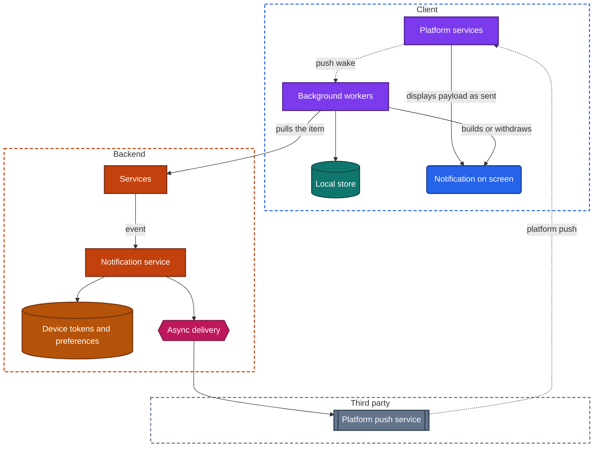
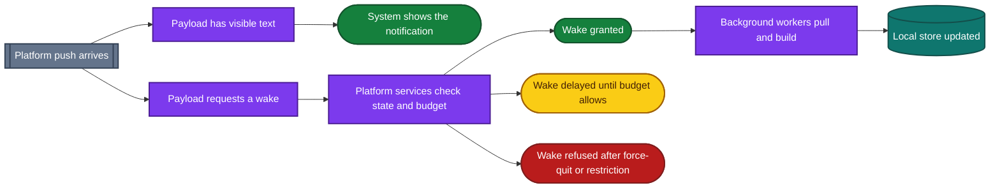
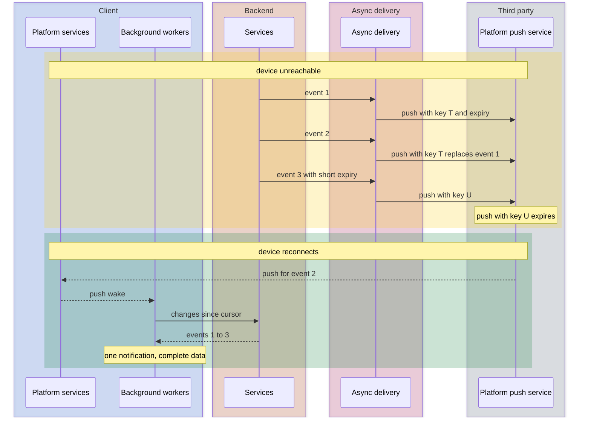

import Probe from '../../../components/Probe.astro';
import Signals from '../../../components/Signals.astro';
import TeardownBar from '../../../components/TeardownBar.astro';
import WorksheetForm from '../../../components/WorksheetForm.astro';

> **The question.** What does this app do when it is not on screen, what wakes it up, and who writes the notifications you see?

## 23.1 Why this concern exists

A mobile app does not decide when it runs. The operating system does. An app that leaves the screen is suspended within seconds, and its process can be removed at any time after that. Everything the app does while you are not looking at it happens inside a window that the operating system opened for a stated reason and will close on its own schedule.

Four of the seven constraints ([Chapter 2](/part-1-method/2-the-mobile-constraint-set/)) create this concern.

**Platform rules.** The operating system grants background execution in a few fixed kinds, each with its own trigger and time limit. Notifications are a platform service with its own permission, its own settings screen and its own display rules.

**Limited resources.** Every background wake costs battery, and the operating system keeps a budget per app. The budget shrinks for an app the user rarely opens and shrinks further in low-power mode.

**Process death.** Background workers cannot assume memory survives between two runs. Each run starts from the local store and must leave it consistent if the run is cut short.

**Human attention.** A notification interrupts. Platforms give the user controls to mute an app, and an app that wastes interruptions loses the channel entirely.

The practical result is a split. Work the user is waiting for runs under a visible indicator. Everything else runs when the operating system chooses, or does not run. A teardown of this concern finds out which kind of grant each feature depends on, and what happens to the feature when the grant is withheld.

[Chapter 14](/part-2-concerns/14-real-time-delivery/) covers how fast an event reaches the device and by which path. This chapter starts where that one stops: what the device does with the event, and what the app does with the time it is given.

## 23.2 The design space

The operating system grants background execution in four kinds. They are ordered here from the shortest to the longest.

**An exit grace period on leaving.** When the app leaves the screen, it can ask for a short extension to finish what it is doing. The extension lasts from a few seconds to about half a minute. This chapter calls it the exit grace period. Teams use it to send the last entries in the outbox, save a draft and close connections cleanly. It costs nothing to request and it cannot be relied on for anything long. A mutation that needs three retries on a weak network does not fit in it.

**A deferred task.** The app registers a piece of work with conditions, such as "when a network is present" or "when charging and idle". The operating system runs it at a time it chooses. It may run within minutes, or tonight, or never. This chapter calls it a deferred task. Teams use it for work nobody is waiting on: refreshing the first screen's data, retrying the outbox, cleaning caches, uploading logs. Its cost is unpredictability. No feature with a deadline can depend on it.

**User-visible long-running work.** The app declares that it is doing something the user knows about, from a short list the platform accepts: playing audio, giving directions, holding a call, recording, tracking a workout, finishing a transfer the user started. The operating system lets the process keep running for as long as the activity lasts. In exchange, the platform shows the user that it is happening, through a persistent notification, an indicator in the status area or controls on the lock screen. This chapter calls it user-visible work. The cost is that the indicator is mandatory, and that the store reviews whether the declared activity is real.

**A push wake.** A platform push arrives and the operating system gives the app a few tens of seconds to react. The push may be a silent push, or a visible notification that also requests a wake. Teams use it to pull new data into the local store, to build or withdraw a notification, and to refresh other surfaces. Its cost is that the operating system rations it, and withholds it entirely in several states described in Section 23.4.

Two further grants exist and belong to other chapters. A transfer can be handed to the operating system, which carries it out with no app process at all ([Chapter 18](/part-2-concerns/18-file-transfer-uploads-and-downloads/)). Hardware can wake the app on an event such as entering a region or an accessory coming into range ([Chapter 24](/part-2-concerns/24-location-sensors-and-hardware/)).

| Kind | Who starts it | How long it runs | When it runs | What the user sees |
|---|---|---|---|---|
| Exit grace period | The app, on leaving the screen | Seconds to about half a minute | At once | Nothing |
| Deferred task | The operating system | Up to a few minutes | When conditions and budget suit | Nothing |
| User-visible work | The user, through the app | As long as the activity lasts | At once | A mandatory indicator or controls |
| Push wake | The backend, through platform push | A few tens of seconds | On arrival, if the system allows | Nothing, or a notification |

A design that has none of these is also valid. Such an app does nothing in the background. It is fully up to date only after you open it and wait. Many apps are built this way on purpose, because every other option adds states to test.

## 23.3 Anatomy

Figure 23.1 shows the notification pipeline, from an event on the backend to the lock screen. It also shows the two places a notification can be written.



*Figure 23.1. The notification pipeline, with both places a notification can be written.*

The pipeline has five stages, and each one makes a decision you can observe.

1. **Services record an event.** A message is stored, an order changes state, a price crosses a threshold.
2. **The notification service decides whether anyone should be told.** It reads the recipient's preferences, mutes, quiet hours and rate limits. It decides which of the user's devices to address. It writes the text, or decides that the device will write it.
3. **Async delivery hands the message to the platform push service**, addressed to a device token, with an expiry and optionally a replacement key. Section 23.7 explains both.
4. **The platform push service delivers it**, or stores it while the device is unreachable.
5. **Platform services on the device act on it.** They display it as sent, or wake background workers, or both.

Stage 5 holds the main design choice of this chapter.

### Two authors for one notification

**A system-displayed notification.** The payload contains the title, the text and the sound. The operating system draws it without running any app code. It appears whatever state the app is in, including after a force-quit. The app's local store is unchanged, so opening the app starts a fetch. The backend must know the full text, in the user's language, at the moment it sends.

**An app-built notification.** The payload contains an identifier, or encrypted content, and a request to wake. Background workers, or a small short-lived process that the platform runs for this one purpose, receive it. They pull or decrypt the item, write it to the local store, compose the notification from local data and display it. The notification can use things the backend does not have: the name you gave a contact on this device, content only the device can decrypt, the current state of the local store. Its cost is dependence on the push wake.

Most mature apps combine the two. The payload carries fallback text that the operating system shows if no app code runs, and the app replaces it when it does run. From outside, this looks like a notification whose level of detail changes with the state of the app.

| | System-displayed | App-built | Combined |
|---|---|---|---|
| Who writes the text | The backend | The client | The client, with backend fallback |
| After a force-quit | Appears as usual | May not appear | Appears with less detail |
| Local store when you open the app | Unchanged | Already holds the item | Depends on whether the wake ran |
| Can show device-only data | No | Yes | Yes, when the wake ran |
| Depends on the wake budget | No | Yes | Only for the richer form |

One case removes the ambiguity. In an app with end-to-end encryption, the backend cannot read the content. If a notification from that app shows the message text, code on the device decrypted it. That notification is app-built, and the claim is Inferred from the product's own stated design.

### What a push wake does

A push wake has a deadline. The handler must put the visible result first and leave the local store consistent if time runs out.

```text
function onPushWake(push, deadline):
  match push.kind:
    Withdraw:
      removeNotification(push.itemId)        // read on another device
    NewItem:
      item = pullOrDecrypt(push.itemId)
      if item == null or deadline.isNear():
        show(push.fallbackText)              // never end the wake with nothing shown
      else:
        transaction(localStore):
          upsert(item)
        show(buildNotification(item), replaceKey = item.threadId)
  setBadge(countUnread(localStore))          // derived state, computed on the device
  finish()                                   // overrunning the deadline costs future budget
```

The last comment matters for a teardown. The operating system tracks how each app uses its wakes. An app that overruns, crashes or does nothing useful in them is granted fewer. Background behavior that gets worse over weeks on one device, and is fine on a fresh install, is consistent with a spent budget.

## 23.4 Limits on background execution

Every grant in Section 23.2 can be withheld. The conditions differ between platforms and between device makers, and they change with each operating system release. The categories are stable.

**Quotas.** Deferred tasks and push wakes are counted per app. The operating system learns when you usually open the app and prefers to run its tasks shortly before. An app opened every morning is refreshed before the morning. An app opened once a month is refreshed rarely or never.

**Low-power mode.** The user asks the device to save battery. Deferred tasks are postponed, silent pushes are delayed or dropped, and fetches in the background are cut. User-visible work and system-displayed notifications continue.

**A force-quit app.** On some platforms, a force-quit tells the operating system that the user does not want the app to run. Push wakes and deferred tasks stop until the user opens the app again. On other platforms a force-quit has no such meaning, and the device maker's own battery manager applies a similar rule to apps it judges inactive. In both cases a system-displayed notification still appears.

**An app the user rarely opens.** Beyond a shrinking quota, some platforms put an unused app into a dormant state after weeks. Its scheduled work is cancelled, its notifications may be silenced or moved to a digest, and its permissions may be withdrawn.

**A user setting.** Most platforms let the user turn off background refresh per app, restrict background data, or mark the app as restricted. Data-saver mode has a similar effect on background fetches.

**A restarted device.** Until the user unlocks the device for the first time after a restart, secure hardware-backed storage is closed. A push wake in that state cannot read the session, so it cannot pull. Only system-displayed notifications work.

Figure 23.2 puts these together for one incoming push.



*Figure 23.2. What one platform push can lead to, depending on its payload and the state of the app.*

The figure explains why the limits are useful to a teardown. Each limit removes the push wake and leaves the system-displayed path intact. Applying a limit and watching what survives tells you which path a feature uses. A notification that survives every limit is system-displayed. One that disappears or loses detail is app-built.

Deferred tasks have no such clean test. You cannot make one run. You can only leave the app alone for a long time and check afterwards whether its local store moved forward, which is probe P23.9.

## 23.5 User-visible work

User-visible work is the one grant that lasts, and it is the easiest to observe because the platform insists on showing it.

The indicator takes several forms: a persistent notification that cannot be swiped away, a colored marker in the status area, playback controls on the lock screen, a banner that returns you to the app. The form tells you the declared activity. Playback controls mean audio. A marker with a timer means a call or a recording. A location marker means tracking.

Three design points follow.

**The activity must be the real one.** An app that plays silence to stay alive, or declares navigation in order to poll, breaks store rules. You will rarely see it in a reviewed app, and when you do, the mismatch between the indicator and the feature is the evidence.

**The work must survive process death anyway.** The grant lowers the chance that the process is removed. It does not remove it. A well-built player or tracker saves its position to the local store as it goes, and resumes from there. [Chapter 17](/part-2-concerns/17-audio-and-video-playback/) covers playback and [Chapter 24](/part-2-concerns/24-location-sensors-and-hardware/) covers tracking.

**A user-started transfer is a borderline case.** Some platforms let an upload or export continue under a progress indicator. Others require it to be handed to the operating system, which runs it with no indicator from the app. A transfer that completes while the app is in the background with nothing visible is therefore not proof of a rule being bent. It is Speculative evidence of a transfer handed to the system.

## 23.6 Notification design as evidence

A notification is a small screen with rules. How an app uses those rules exposes the payload, the wake and the backend behind it.

### Grouping

Notifications that stack by conversation, order or topic carry a group identifier. The identifier comes from the backend's data model, so the grouping shows what the backend treats as one thread. A summary line such as a count of further items is written by the operating system or by app code. A summary that names local data, such as contact names you assigned, is app-built.

### Actions

Buttons under a notification, or a text field for a reply, are declared by the app in advance as a set per notification type. Tapping one starts the app in the background for a few seconds to carry it out. This is a push wake in reverse: the trigger is the user and the work is a mutation.

A well-built action writes the mutation to the outbox ([Chapter 12](/part-2-concerns/12-offline-and-sync/)) and sends it within the window. An action that opens the app instead shows that the team did not build the background path, or that the action needs a check the background cannot perform, such as a biometric prompt.

### Images and rich content

An image in a notification is not in the payload. The payload is a few thousand bytes at most. The payload carries an address, and a short-lived process on the device downloads the image before the notification is displayed. This tells you app code ran on arrival. On a slow network, the same notification arrives without its image, because the download did not finish within the time allowed.

### Updating in place

A notification can replace an earlier one with the same identifier. A score that changes, a delivery that advances a stage and an edited message all use this. The backend sends a new push with the same replacement key, or the app rebuilds the notification during a wake. Either way the count of notifications does not grow.

### Withdrawing

A notification can be removed without the user touching it. The common case is reading the item on another device. The backend sends a push that names the item, and app code removes the notification. On most platforms this needs a push wake, so it is subject to every limit in Section 23.4. A withdrawal that works while the app is in the background and fails after a force-quit is the signature of that dependence.

### Badge counts

The number on the app's icon has two possible sources.

- **The backend computes it** and puts it in the payload. The operating system sets it with no app code. It is correct across devices and changes even after a force-quit. It requires the backend to keep an unread count per user.
- **The client computes it** as derived state from the local store during a wake or on leaving the app. It can include things only the device knows. It goes stale when wakes are refused.

A badge that disagrees with the count shown inside the app points to two sources that have drifted apart.

### Categories the user can mute

Platforms let an app declare named categories of notification, each with its own switch, sound and importance in the system settings. The list is readable by any user and is a map of the product's event types as the team sees them.

Preferences kept only inside the app's own settings screen are a different design. They are stored on the backend and applied by the notification service before anything is sent. The two can be told apart: a category switched off in system settings still costs a push that the device discards, and one switched off in the app is never sent. From outside, the visible difference is that in-app preferences follow you to a second device and system settings do not.

### Priority and timing

Some notifications break through a focus or do-not-disturb setting, and some arrive silently in a list. These levels are set per notification by the sender, within what the platform and the user allow. A level that seems wrong for the content shows a default nobody tuned. Notifications that arrive at the same local time every day, in every time zone you travel to, are scheduled on the backend per user.

### The tap

Tapping a notification is a deep link. Where you land, and whether back leads somewhere sensible, is covered in [Chapter 8](/part-2-concerns/8-navigation-deep-links-and-screen-state/).

## 23.7 Local scheduling, and notifications sent to an offline device

### Notifications with no backend

An app can ask the operating system to show a notification at a future time or on a condition, such as arriving at a place. No push and no network are involved. The operating system holds the request and shows it even if the app has no process. This chapter calls it a local notification.

Alarms, timers, medication reminders, habit prompts and "your session starts in ten minutes" are natural uses. So is the "come back" message from a game you have not opened for three days, which was scheduled the last time you closed it.

Local scheduling has three limits that produce visible behavior.

- **It knows only what the device knew when it was scheduled.** A reminder for an event that you cancelled on another device still fires, unless a push wake or a deferred task reached this device to cancel it.
- **The platform caps the number pending.** An app with many future reminders schedules only the nearest ones and tops them up each time it runs. Reminders far in the future stop firing if the app has not run for a long time.
- **A restart or a time zone change may clear or shift them.** The app must reschedule when it next runs.

The alternative is a reminder scheduled on the backend and sent by platform push. It is correct across devices and fails offline. Probe P23.8 separates the two.

### What the push service does while the device is unreachable

A device in airplane mode, switched off or out of coverage cannot receive a push. The platform push service keeps messages for it, within limits the sender can influence.

- **Expiry.** The sender sets how long a message is worth delivering. A message past its expiry is dropped. "Your driver is outside" should expire in minutes. "You have a new message" can wait for days.
- **Replacement key.** Messages with the same key replace each other while stored. Only the latest is delivered.
- **Storage limits.** Some push services keep only one message, or a small number, per app per device. Others keep more and deliver them together.

Figure 23.3 shows a device that misses three events and reconnects.



*Figure 23.3. Replacement and expiry while a device is unreachable, followed by a push wake that pulls everything.*

The number of notifications that appear on reconnecting is a direct reading of these settings. One per event means no replacement key and a long expiry. One in total means replacement, or a push service that keeps only the latest. None means a short expiry, or a backend that did not send because it saw the device as unreachable.

The data is a separate matter. Whatever the notifications do, the app's next pull by cursor brings all three events, as in [Chapter 14](/part-2-concerns/14-real-time-delivery/).

## 23.8 What the outside view can and cannot tell you

- **Whether a notification appears in each app state** is Observed.
- **System-displayed against app-built** can be Inferred by applying a limit from Section 23.4 and comparing the notification with the one seen without the limit (P23.3 and P23.7).
- **A combined design** shows as a notification with less detail under a limit. A notification that looks identical under every limit is system-displayed, or the fallback text happens to equal the built text. The second reading is Speculative and cannot be excluded.
- **Which grant ran a piece of background work** is often not separable. A local store that moved forward while the app was unopened fits a deferred task and a push wake equally well. Low-power mode suppresses both.
- **Exit grace period against a transfer handed to the system** cannot be told apart for small work. Both finish something after you leave.
- **Quota state** is invisible. You can see that a wake did not happen. You cannot see why.

Record the app state for every observation. "Notification arrived" means little without "after a force-quit, in low-power mode, with the device locked".

## 23.9 Probes

Most of these need a second device or a second account to cause events. Run P23.1 and P23.2 first, because they need nothing but a look. Run P23.3 before the others that withhold a wake, because it gives the comparison they use. Select the outcome you saw in each probe, and it is recorded in your worksheet for the teardown chosen here.

<TeardownBar />

### P23.1 Notification categories

<Probe id="P23.1" />

### P23.2 User-visible work

<Probe id="P23.2" />

### P23.3 Force-quit, then an event

<Probe id="P23.3" />

### P23.4 Leave during a write

<Probe id="P23.4" />

### P23.5 Act from the notification

<Probe id="P23.5" />

### P23.6 Read elsewhere

<Probe id="P23.6" />

### P23.7 Low-power mode

<Probe id="P23.7" />

### P23.8 Scheduled notification, offline

<Probe id="P23.8" />

### P23.9 Offline, then reconnect

<Probe id="P23.9" />

### P23.10 Days unopened

<Probe id="P23.10" />

## 23.10 Signal-to-design table

<Signals chapter={23} />

## 23.11 The backend this implies

Each client design needs specific backend support. Once you have placed a feature, the following can be Inferred.

- **Any platform push.** A store of device tokens per user and per device, refreshed when the platform issues a new token, and cleared on sign-out ([Chapter 20](/part-2-concerns/20-identity-and-sessions/)). Handling of the push service's reply that a token is dead.
- **System-displayed notifications.** A notification service that writes final text. It needs the user's language, the sender's display name and the formatting rules, all on the backend. Text that appears in the wrong language after you change the device language shows where the language is stored.
- **App-built notifications.** A payload with identifiers only, and a read endpoint fast enough to answer inside a push wake. For end-to-end encryption, a payload that carries ciphertext.
- **Preferences applied before sending.** A per-user, per-category preference record, quiet hours with the user's time zone, and rate limits so that a burst of events becomes one notification.
- **Withdrawal.** Read state fanned out to the user's other devices as its own push, as in [Chapter 14](/part-2-concerns/14-real-time-delivery/).
- **Backend badge counts.** An unread counter per user, updated on every event and every read, and included in each payload.
- **Updating in place.** A stable replacement key per thread or per item, stored with the item.
- **Scheduled sends.** A job scheduler on the backend that knows each user's time zone. Notifications that arrive at the same local hour for everyone were sent in waves by zone.
- **Deferred refresh.** A cheap delta endpoint, because a deferred task has little time and may run on a metered network.
- **Delivery feedback.** Many backends record whether a notification was displayed or opened, reported by app code. This feeds the rate limits, and it is one reason an app prefers the app-built path.

## 23.12 Failure modes and what they reveal

- **Notifications stop after a force-quit and return after you open the app.** The feature depends on a push wake, with no fallback text in the payload.
- **A notification with a generic line such as "You have a new message".** Fallback text. The wake that would have built the full notification did not run, or the content is unreadable to the backend.
- **A notification arrives without its image on a weak network.** The image is downloaded on the device before display, under a deadline.
- **A notification stays on the tablet after you read the item on the phone.** No withdrawal push, or the withdrawal's wake was refused.
- **The badge shows a number and the app shows nothing unread.** Two sources for the count, one on the backend and one on the client.
- **The badge never clears until you open a specific screen.** A client-computed badge that is recalculated only by that screen.
- **A reminder fires for something you already completed on another device.** A local notification scheduled before the change, and no wake reached this device to cancel it.
- **Reminders stop after a few weeks of not opening the app.** The platform's cap on pending local notifications, with top-up only when the app runs.
- **A burst of stale notifications when you leave airplane mode.** No replacement key and a long expiry.
- **"Your order is arriving" appears an hour after it arrived.** No expiry on a time-bound message.
- **A reply typed in a notification never arrives.** The action was sent directly inside the background window, with no outbox, and the request failed.
- **The app opens to old content every morning in low-power mode and to fresh content otherwise.** Refresh depends on deferred tasks or silent pushes.
- **Playback or tracking stops a few minutes after the screen locks.** The activity was not declared as user-visible work, or the process was removed and the work was not resumed.
- **The same notification twice.** The backend sent a system-displayed push and the app also built one, with different identifiers.
- **Notifications continue for an account you signed out of.** The device token was not removed from the backend at sign-out.

## 23.13 Worksheet entries

These are the fields this chapter adds to the teardown worksheet. Probe outcomes fill some of them in. Complete one set per feature that notifies or works in the background.

<TeardownBar />

<WorksheetForm chapters={[23]} />

## 23.14 Summary

- The operating system grants background execution in four kinds: an exit grace period on leaving, a deferred task, user-visible work and a push wake. Only user-visible work lasts, and it always shows an indicator.
- Quotas, low-power mode, a force-quit, long disuse, user settings and a restart before first unlock all withhold push wakes and deferred tasks. None of them stops a system-displayed notification.
- A notification is written either by the backend and displayed by the system, or built by app code after a wake. Many apps send fallback text and replace it when the wake runs.
- Applying a limit and comparing the notification is the main test. A notification that loses detail or disappears is app-built.
- Grouping, actions, images, in-place updates, withdrawal, badge counts and mutable categories each expose a part of the payload, the wake or the backend.
- A local notification needs no backend and fires offline. It knows only what the device knew when it was scheduled.
- While a device is unreachable, expiry and replacement keys decide how many notifications appear on reconnecting. The data arrives by a pull regardless.
- Which grant ran a piece of background work is often not separable from outside. Record the app state with every observation.
