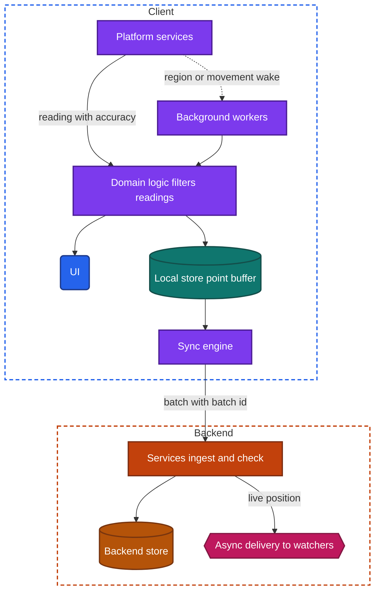
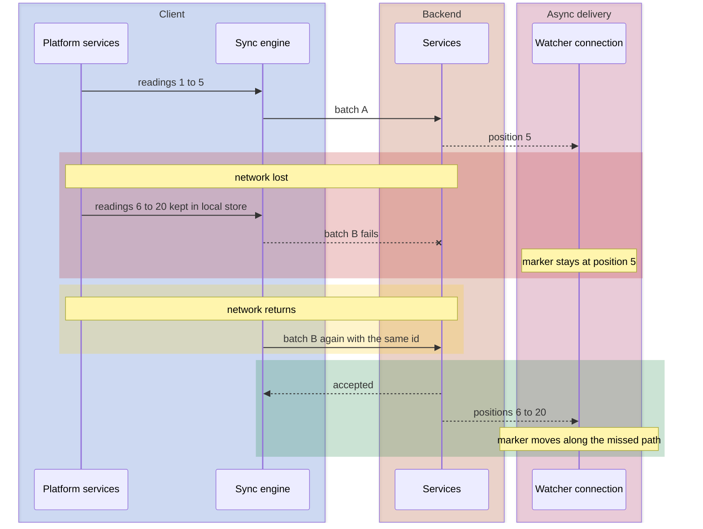

import Probe from '../../../components/Probe.astro';
import Signals from '../../../components/Signals.astro';
import TeardownBar from '../../../components/TeardownBar.astro';
import WorksheetForm from '../../../components/WorksheetForm.astro';

> **The question.** Which hardware does this app use, in which mode, and what does that cost in battery, permissions and trust?

## 24.1 Why this concern exists

A phone carries a positioning receiver, motion sensors, cameras, microphones, several radios, a biometric reader and a vibration motor. An app does not touch any of them directly. It asks platform services, and the operating system decides what the app gets, how precise it is, and whether the user is told.

Four of the seven constraints ([Chapter 2](/part-1-method/2-the-mobile-constraint-set/)) shape every use of hardware.

**Limited resources.** Positioning by satellite, a camera preview and an active radio are among the most expensive things a phone does. The same feature can cost ten times more battery in one mode than in another.

**Platform rules.** Each piece of hardware has a permission, and several have more than one level. The operating system shows an indicator while location, the camera or the microphone is in use. Use in the background needs a stronger grant and is reviewed by the store.

**Process death.** A feature that records over time, such as a tracked route, must survive the removal of its process. Readings taken before the removal must not be lost, and recording must resume.

**Untrusted client.** Every reading is produced on a device the backend does not control. A position, a step count or a scan result can be fabricated. A backend that pays out or grants access on the strength of a reading has to check it.

Hardware is unusually open to outside observation. The platform's indicators, the permission prompts, the battery screen and the behavior when hardware is missing are all visible to a normal user. Few concerns in this book give as many Observed facts.

## 24.2 The design space

Most of the design choices are about location, because location has the widest range of modes and costs. Sections 24.5 to 24.8 cover the other hardware.

### Where a position comes from

The operating system combines several sources and gives the app one answer with an estimated accuracy.

| Source | Typical accuracy | Works indoors | Battery cost | Needs a network |
|---|---|---|---|---|
| Satellite positioning | A few meters under open sky | Poorly | High | No, but the first reading is faster with one |
| Nearby wireless networks | Tens of meters | Yes | Low | Usually, to look up where the networks are |
| Cell towers | Hundreds of meters to kilometers | Yes | Very low | Yes |
| The network address, on the backend | A city or region | Not applicable | None | Yes |

The last row is not a device capability. The backend guesses a region from the address a request comes from. It needs no permission and shows no indicator, which makes it the fallback when location is denied.

### Location modes

There are six modes. They are ordered here from the cheapest to the most expensive in battery.

**No device location.** The user types an address, or the backend guesses from the network address. No permission is needed. Teams choose this when a city is precise enough, or as the path for users who refuse the permission.

**One reading.** The app asks for the current position once, uses it and stops. The request can accept the last position the system already knows, which returns at once and may be minutes old, or it can demand a fresh one, which takes seconds. Teams choose this for a "near me" search, tagging a photo or choosing a default store. The cost is small. The visible trace is an indicator that appears briefly.

**Continuous while on screen.** The app subscribes to updates while a screen is open, and unsubscribes when it closes. A map with a moving marker works this way. The cost is high while it lasts and zero afterwards. The design question is who owns the subscription: one screen, or the whole app.

**Region entry and exit.** The app gives the operating system a short list of regions, each a point and a radius. The operating system watches them using low-power sources and wakes the app when the device crosses a boundary. This chapter calls it region monitoring. It works with no process. It is cheap, coarse and late: accuracy is on the order of a hundred meters or worse, and the wake can lag by minutes. The platform caps the number of regions per app, so an app with thousands of places registers only the nearest few and replaces them as the device moves.

**Coarse movement updates.** The operating system wakes the app when the device has moved a significant distance, typically hundreds of meters or a change of cell tower. A related form reports arrivals at and departures from places where the device stayed a while. The cost is close to zero. Teams use it to keep a rough position on the backend, to refresh content for a new area and to replace the region list.

**Continuous in the background.** The app keeps receiving precise updates after it leaves the screen. This is user-visible work as described in [Chapter 23](/part-2-concerns/23-background-work-and-notifications/), and the platform shows a persistent indicator. It needs the strongest location permission or an explicit, visible session. It has the highest cost of any mode. Turn-by-turn directions, a tracked workout and a driver's live position are the legitimate uses.

| Mode | Accuracy | Battery cost | Runs with no process | What the user sees |
|---|---|---|---|---|
| No device location | City or typed address | None | Not applicable | No prompt, no indicator |
| One reading | Whatever is available now | Low | No | A brief indicator |
| Continuous while on screen | Meters | High while open | No | An indicator while the screen is open |
| Region monitoring | A hundred meters or worse | Low | Yes | A background permission, and an occasional indicator |
| Coarse movement updates | Hundreds of meters | Very low | Yes | A background permission, and an occasional indicator |
| Continuous in the background | Meters | Highest | Restarted by the system at best | A persistent indicator |

Modes belong to features and not to apps. A delivery app uses one reading for the address screen, continuous updates on the tracking map, and nothing in the background on the customer's side. The courier's side of the same product uses continuous background location.

### Precise and approximate

Current platforms let the user grant an approximate position in place of a precise one. An approximate position is accurate to a few kilometers and is updated rarely. The app is told which it received.

A feature has three ways to respond. It can work at area level, which suits weather, local news and store lists. It can explain that it needs a precise position and offer the setting. Or it can ignore the difference and place a marker confidently in the wrong street. The third is a defect and is easy to find with probe P24.3. [Chapter 22](/part-2-concerns/22-privacy-permissions-and-consent/) covers the prompts themselves.

## 24.3 Anatomy

Figure 24.1 shows a client that records positions over time and shares them. Simpler modes use the left half only.



*Figure 24.1. A client that reads positions, filters them, buffers them in the local store and uploads them in batches.*

Three properties of the figure matter for a teardown.

First, readings pass through a filter before anything else sees them. Raw readings are noisy. A stationary phone indoors reports positions that wander by tens of meters. The filter drops readings with poor accuracy, drops readings too close in time or distance to the last one kept, and may smooth the rest. A recorded route that shows a tight scribble wherever you stood still has a weak filter. A route with no scribble at all, and a pause in recording wherever you stopped, uses motion data to decide when to sample.

Second, the UI and the buffer are fed separately. The marker on the map can move with every reading while the buffer keeps one point every few seconds. What you see live and what is stored are not the same data.

Third, the upload is a batch from the local store, not a request per reading. Section 24.4 covers why, and what it looks like to someone watching.

### Snapping to roads

Some apps move each point to the nearest road or path. This needs map data, on the client or on the backend. It shows when you cut across a parking lot and the recorded line follows the road around it. If the live line cuts the corner and the saved route follows the road, the snapping runs on the backend after upload.

## 24.4 Buffering and uploading location

A device that records its position is often somewhere with no network: a tunnel, a trail, a basement garage. The design choices are how often to upload and what to do with the readings taken while offline.

**Upload each reading as it happens.** This is the simplest design. Every reading taken offline is lost. A watcher sees the marker freeze, then jump.

**Buffer, then upload in batches.** Each kept reading is written to the local store with the time the device recorded it. The sync engine sends batches on a timer and when the buffer reaches a size. A failed batch stays in the buffer and is retried. This is the outbox of [Chapter 12](/part-2-concerns/12-offline-and-sync/) applied to sensor data. Batches cost fewer radio wakes than single readings, so this design also saves battery.

**Buffer, and upload at the end.** A recorded workout that nobody watches live needs no upload until it finishes. The recording works fully offline and appears on other devices only after it is saved.

The upload interval is a trade between freshness for the watcher and battery for the sender. A courier's position is typically sent every few seconds. A friend-finding feature can send every few minutes, driven by coarse movement updates.

```text
function onReading(reading):
  if reading.accuracy > maxAccuracyMeters:
    return                                   // a poor reading is worse than none
  if distance(reading, lastKept) < minMeters and reading.time - lastKept.time < maxGap:
    return                                   // standing still, so keep the buffer small
  transaction(localStore):
    buffer.append(reading)                   // durable before anything else happens
  lastKept = reading
  if buffer.size >= batchSize or now() - lastUpload >= uploadInterval:
    flush()

function flush():
  batch = buffer.peek(batchSize)
  result = send(batch, idempotencyKey = batch.id)
  match result:
    Accepted:
      buffer.remove(batch)                   // only after the backend confirms
    Failed:
      scheduleRetry(backoff)                 // readings stay buffered
```

Figure 24.2 shows this design across a loss of network, as a second person watching sees it.



*Figure 24.2. Readings buffered through a loss of network, then uploaded as one batch.*

What the watcher sees after the gap separates the designs. A marker that jumps straight to the new position, with a straight line or no line between, means readings were not buffered or the backend forwards only the latest. A marker or line that fills in the missed path means the batch carried the history and the backend passed it on.

Smooth movement of a watched marker says little about upload frequency. Most clients animate between the positions they receive. To estimate the interval, watch for the rhythm of small corrections in direction, or watch a sender who changes direction sharply.

The device's clock stamps each reading. The backend cannot trust it, so it usually keeps the device time for ordering within a batch and records its own receive time beside it.

## 24.5 Motion and step data

Phones contain a low-power processor that counts steps and classifies movement all day, whether or not any app is running. The operating system stores the result. An app with permission can query the history, and it can ask to be told when the kind of movement changes, for example from walking to driving.

This gives two designs for a step count or an activity log.

- **Read from platform services.** The app shows what the operating system recorded. Steps for the past several days appear the moment the permission is granted, including days before the app was installed. The app uses almost no battery. Its numbers match the system's own health screen.
- **Count in the app.** The app reads raw motion sensors while it runs. It has no history from before it was installed and none from times it was not running. It costs battery and needs user-visible work to continue in the background. Teams do this only when they need raw data the platform does not provide, such as the shape of a movement.

Many platforms also keep a shared health store that several apps read and write with the user's consent. A workout recorded by one app can appear in another. That is a transfer through the platform on one device, with no backend involved.

Other sensors follow the same split between a cheap platform answer and expensive raw data. A barometer gives changes in altitude. A compass gives the heading that rotates a map. Raw acceleration and rotation drive gestures, a level tool or an augmented view, and are read only while the screen is on.

Whether motion data leaves the device is a separate question. Check a second device signed in to the same account. If yesterday's steps appear there, the app uploads them. If each device shows its own count, the data stays local.

## 24.6 The camera

An app obtains an image in one of three ways.

**The system's capture screen.** The app hands control to a capture screen that the operating system provides and receives one photo or video back. The screen looks the same as it does in every other app that uses it. The app usually needs no camera permission, because the user takes the picture in the system's own UI. The app cannot add overlays, filters or its own controls.

**An in-app camera.** The app shows the live preview inside its own screen and draws its own controls. This needs the camera permission. It allows overlays such as a document frame, live effects, scanning and capture without a confirm step. It costs engineering effort, startup time and battery, and the device warms up during long use. It also has a lifecycle to manage: the camera is released when the app leaves the screen and must be reopened on return.

**The system's library picker.** The app shows a picker that runs outside its process and returns only the items the user chose. The app needs no access to the whole library. An app that asks for full library access and draws its own grid of your photos made a different choice, usually to offer a custom gallery.

| Path | Permission prompt | Custom controls | What it shows about the app |
|---|---|---|---|
| System capture screen | Usually none | No | Capture is incidental to the product |
| In-app camera | Camera, and microphone for video | Yes | Capture is a core feature |
| System library picker | None | No | The app sees only chosen items |
| In-app gallery | Photo library | Yes | The app reads the library itself |

### Scanning codes and documents

Scanning adds analysis of the live preview. Two steps are involved, and they can run in different places.

**Recognition** finds the code, the edges of a page or the text in a frame. For codes, this runs on the device, frame by frame, and is effectively instant. For documents, edge detection and perspective correction run on the device. Text recognition runs on the device or on the backend. On-device recognition works offline and returns in under a second. Backend recognition needs an upload and returns after a visible wait.

**Resolution** turns the recognized content into meaning. A code that contains a web address or a full ticket is self-contained. A code that contains only an identifier needs a lookup on the backend. Probe P24.9 separates recognition from resolution by scanning offline.

Identity checks that ask you to photograph a document and then your face are usually run by a third party inside the app. The style of the screens often changes at that point. [Chapter 38](/part-2-concerns/38-modularity-sdks-and-team-scale/) covers how to recognize embedded third-party components.

After capture, an image is resized and compressed on the device before upload. [Chapter 16](/part-2-concerns/16-images/) and [Chapter 18](/part-2-concerns/18-file-transfer-uploads-and-downloads/) cover that path.

## 24.7 Short-range radios

Phones carry two kinds of short-range radio that apps use. One connects to accessories within a room. The other works at a distance of a few centimeters and is used by tapping.

### Accessories

A low-energy radio link connects the phone to a watch, a sensor, a lock, a scale or a speaker. The app discovers the accessory, connects, and exchanges small messages. Three design questions have visible answers.

- **Who relays the data.** Most accessories have no network connection of their own. The phone is the relay: data flows from the accessory to the app and from the app to the backend. With the phone absent, nothing reaches the backend.
- **When the transfer happens.** The simplest design syncs when you open the app, and you see a progress indicator each time. A fuller design asks the operating system to wake the app when the accessory comes into range or has data. The data is then already present when you open the app, and on other devices before you open it.
- **What happens without the radio.** With the radio switched off or the permission refused, the app can explain and offer the setting, or it can search forever. Some accessories have a second path through their own network connection and the backend, which works from anywhere and is slower.

Firmware updates for an accessory are long transfers over a slow link, and are the place where the lifecycle limits of [Chapter 23](/part-2-concerns/23-background-work-and-notifications/) are most visible. An update that fails when you leave the app has no background grant.

Discovering devices on the local network, for example to send video to a television, is a related capability with its own permission prompt.

### Tap interactions

The contact-range radio reads small tags and exchanges data with terminals and other phones. Apps use it to read a tag on a product, to pair an accessory by touching it, and to check a document's chip.

Paying or opening a door by tapping the phone is usually not the app's code at all. The operating system's wallet holds a credential in secure hardware and presents it, even when the device is locked or the app has no process. The app's part was to provision the credential once. [Chapter 26](/part-2-concerns/26-payments-and-subscriptions/) covers the payment side. A tap that works with the app force-quit and the device in airplane mode is Observed evidence of a credential held by the system.

## 24.8 Biometrics, haptics and audio routing

### Biometrics as a local check

A fingerprint or face match is done by the operating system inside secure hardware. The app never receives the biometric data. It receives a result, in one of two forms.

- **A yes or no.** The operating system tells the app the user passed. The app then shows its content. This protects the UI and nothing else, because the session was readable all along.
- **A released key.** The app's session secret, or a key that signs requests, sits in secure hardware-backed storage and is released only after a match. Without the match the app cannot talk to the backend as the user at all.

Neither form sends anything biometric to the backend. The backend still sees a session, as in [Chapter 20](/part-2-concerns/20-identity-and-sessions/). One outside test separates the two forms on many devices. Storage can be bound to the set of enrolled fingerprints or faces. When you enroll a new one, a key bound in this way is destroyed, and the app asks for your password again. An app that keeps accepting the biometric after a new enrollment uses the plain yes-or-no check, or chose not to bind the key.

### Haptics

A vibration is triggered by the client at a moment the team chose. The moment is evidence. A tap that vibrates at once, before the network could have answered, belongs to an optimistic update. A vibration that comes after a pause, together with a confirmation, was triggered by the backend's response. Haptics are suppressed by a system setting and often in low-power mode, so their absence proves nothing.

### Audio routing

Sound output is shared by every app on the device, and the operating system arbitrates. An app declares how its sound relates to others: mixed in, briefly lowering other audio, or taking over. The declaration is visible. Opening an app whose muted videos stop your music shows an app that takes over audio output without needing to. A spoken direction that lowers your music and restores it shows the lowering mode.

Routes change under the app. Headphones disconnect, a car connects, a call arrives. Platform convention is to pause playback when headphones disconnect and not to resume without the user. An app that keeps playing through the speaker after a disconnect does not handle the route change. [Chapter 17](/part-2-concerns/17-audio-and-video-playback/) covers playback itself.

## 24.9 What the outside view can and cannot tell you

- **Whether hardware is in use** is Observed, through the system's indicators and the permission list in settings.
- **The location mode in the foreground** is Inferred from when the indicator turns on and off as you move between screens.
- **Region monitoring against coarse movement updates** cannot be told apart from the indicator alone. Both show brief, occasional background use. A reminder tied to a named place favors region monitoring.
- **The filter and the sampling interval** are Inferred from the shape of a recorded route.
- **Upload interval** is Speculative when the watcher's client animates between positions.
- **On-device against backend recognition** is Inferred from an offline scan.
- **Which biometric form is used** is Inferred only where enrolling a new biometric forces a password. Otherwise it stays Speculative.
- **Backend checks on readings** are invisible. You cannot see whether the backend validates a position, and this book's probes do not try to submit false ones.

## 24.10 Probes

Run P24.1 and P24.2 first. They need only a look at the status area. P24.5 and P24.6 need a walk of ten minutes or more. Select the outcome you saw in each probe, and it is recorded in your worksheet for the teardown chosen here.

<TeardownBar />

### P24.1 Location indicator on screen

<Probe id="P24.1" />

### P24.2 Location indicator in the background

<Probe id="P24.2" />

### P24.3 Approximate location only

<Probe id="P24.3" />

### P24.4 Location denied

<Probe id="P24.4" />

### P24.5 Move in the background

<Probe id="P24.5" />

### P24.6 Record offline

<Probe id="P24.6" />

### P24.7 Battery after a session

<Probe id="P24.7" />

### P24.8 Capture path

<Probe id="P24.8" />

### P24.9 Scan offline

<Probe id="P24.9" />

### P24.10 Hardware unavailable

<Probe id="P24.10" />

## 24.11 Signal-to-design table

<Signals chapter={24} />

## 24.12 The backend this implies

- **One reading for a nearby search.** A store with a spatial index, so that "what is within this distance" is one query.
- **No device location.** A service that maps a network address to a region, usually bought from a third party.
- **Batched uploads.** An ingest endpoint that accepts a batch with an idempotency key, stores points by device time and records its own receive time.
- **Live sharing.** Async delivery from the ingest service to watchers, as in [Chapter 14](/part-2-concerns/14-real-time-delivery/). The live position is usually an ephemeral signal, kept in memory with an expiry, and the route history is stored separately.
- **Region monitoring.** A catalog of places per user, and an endpoint that returns the nearest few for a position, because the device can hold only a short list.
- **Route processing.** A job that snaps points to roads, computes distance and duration, and writes a summary. A distance that changes slightly after saving shows this job replacing the client's own figure.
- **Checks on readings.** Limits on speed and distance between points, comparison with the network address, and attention to the platform's flag for simulated positions. These matter wherever a position earns money or unlocks something, as in [Chapter 21](/part-2-concerns/21-security-and-trust/).
- **Retention.** A rule for how long raw points are kept. Location history is sensitive, and a product that shows only summaries of old routes may have deleted the points.
- **Scanning.** A lookup service for identifiers read from codes. A recognition service when text recognition is not done on the device.
- **Accessories.** A registry of accessories per account, an ingest path for their data relayed by the phone, and hosting for firmware.
- **Biometrics.** Nothing. The backend sees a session, or a signature from a key the device holds.

## 24.13 Failure modes and what they reveal

- **A recorded route with a straight line across a lake or a block of buildings.** A gap in readings joined by a line. The process was removed or readings were dropped, and recording resumed later.
- **A scribble of points wherever you stood still.** No filter on accuracy or minimum distance.
- **"Near me" shows the place you left an hour ago.** The app accepted the last known position and did not check its age.
- **A place-based reminder fires two streets late.** Region monitoring, with its coarse accuracy and delay.
- **Place-based reminders work at home and never in another city.** The region list holds only the nearest places and was not replaced after you traveled, because no coarse movement wake ran.
- **The location indicator stays on after you leave the map.** The subscription belongs to the app and is never stopped.
- **A marker placed confidently in the wrong neighborhood.** An approximate position treated as precise.
- **The app is high on the battery screen with most of its time in the background.** Continuous background location, or a subscription that was never stopped.
- **A watched marker freezes and then jumps.** Readings are not buffered, or the backend forwards only the latest position.
- **Distance on the phone differs from distance on another device after saving.** The client and the backend each compute it, from different points.
- **A step count that differs from the system's health screen.** The app counts in its own process.
- **A black preview after returning to the app.** The in-app camera was released on leaving and not reopened.
- **A scan that recognizes the code and then reports an error offline.** Recognition on the device, resolution on the backend.
- **Accessory data that appears only after a long sync on opening the app.** No background wake for the accessory.
- **The app asks for a password after you enroll a new fingerprint or face.** A key in secure hardware-backed storage, bound to the enrolled set.
- **Music stops when the app opens, although nothing in it is playing sound.** The app takes over audio output on launch.

## 24.14 Worksheet entries

These are the fields this chapter adds to the teardown worksheet. Probe outcomes fill some of them in. Complete the location fields once per feature that uses a position.

<TeardownBar />

<WorksheetForm chapters={[24]} />

## 24.15 Summary

- The app reaches hardware only through platform services, which control precision, show indicators and require permissions. Indicators, prompts and the battery screen make this concern unusually observable.
- Location has six modes: no device location, one reading, continuous while on screen, region monitoring, coarse movement updates and continuous in the background. They belong to features, and their battery cost differs by an order of magnitude.
- Region monitoring and coarse movement updates run with no process, cheaply and imprecisely. Continuous background location is user-visible work with a persistent indicator.
- A recording client filters readings, writes them to the local store and uploads batches with an idempotency key. What a watcher sees after a gap shows whether readings were buffered.
- Step and activity data usually come from platform services, which hold history from before the app was installed. An app that counts for itself has gaps and costs battery.
- The system's capture screen, an in-app camera and the system's library picker differ in permissions and controls. Scanning splits into recognition, usually on the device, and resolution, often on the backend.
- Accessories relay through the phone. A tap that works with the app force-quit is a credential held by the system.
- A biometric match is a local check that returns a yes or releases a key. The backend never sees it.
