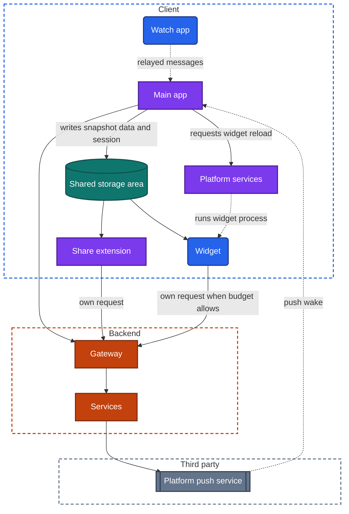
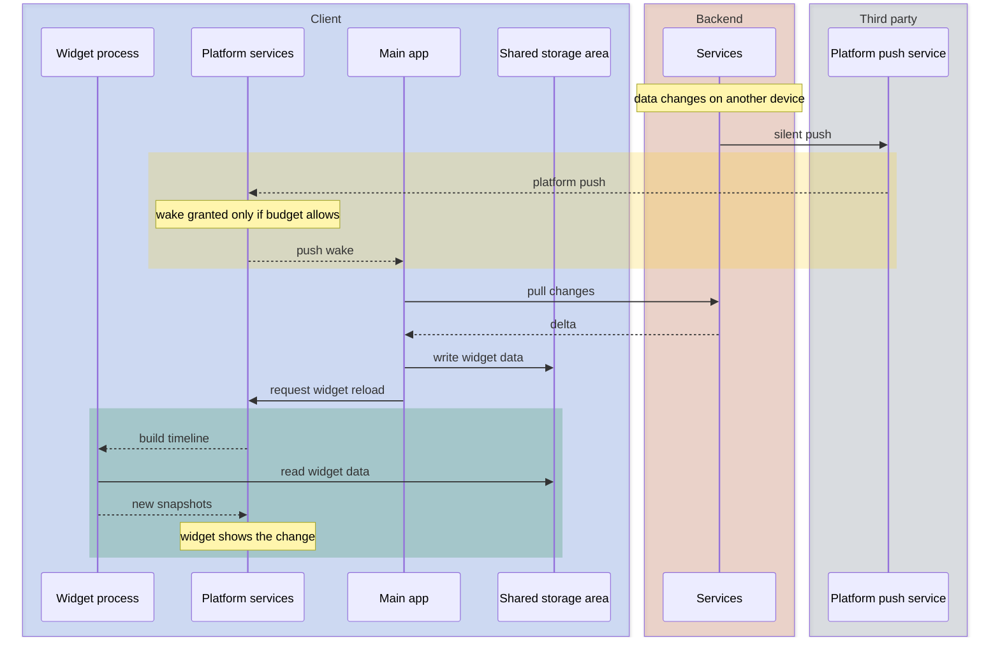

import Probe from '../../../components/Probe.astro';
import Signals from '../../../components/Signals.astro';
import TeardownBar from '../../../components/TeardownBar.astro';
import WorksheetForm from '../../../components/WorksheetForm.astro';

> **The question.** Where does this app appear outside its own window, how does each of those pieces get its data and its session, and how stale does each one get?

## 25.1 Why this concern exists

What a user calls one app is often several programs shipped in one package. There is the main app. There may also be a widget on the home screen, a live status on the lock screen, an app on a watch, an entry in the share sheet, an action for the voice assistant, and a version for a car or a television. This chapter calls each of these a surface.

The operating system runs each surface as its own process, with its own storage sandbox, memory limit and lifetime. Surfaces do not share memory with the main app. Most of the time the main app is not running at all when a surface is on screen.

Four of the seven constraints ([Chapter 2](/part-1-method/2-the-mobile-constraint-set/)) create this concern.

**Platform rules.** Each surface is a container the platform defines. The platform decides when its code runs, how long, how much memory it has and what it may draw.

**Limited resources.** A widget is refreshed on a daily budget. An extension has a fraction of the main app's memory. A watch has a small battery and a smaller background allowance.

**Process death.** A surface's process lives for seconds. Nothing it holds in memory survives. Everything it shows must come from storage or from a request it has time to make.

**Human attention.** A surface is read at a glance, often with the device locked. It must be correct without interaction, and it must say when it is not current.

The central design question follows from the separation. Each surface needs data and a session, and it cannot ask the main app's memory for them. A teardown of this concern finds, for each surface, where its data comes from, how it knows who you are, and what bounds its staleness.

## 25.2 The design space

### The surfaces

**Home-screen and lock-screen widgets.** A widget is a snapshot. A short-lived process produces a view, the operating system stores it and displays it, and the process ends. No app code runs while you look at it. The process can return several snapshots with times attached, and the system swaps them on schedule. Refreshes are rationed to a few dozen per day. Interaction is limited to a tap that opens the app and, on current platforms, a few buttons that each run one action.

**Live status.** For an activity with a beginning and an end, such as a delivery, a ride, a timer, a match or a workout, the app can place a status on the lock screen that updates as the activity moves. It is started by the app, lasts for hours at most, and can update far more often than a widget.

**Watch apps.** An app on a watch is a second client on a second device. It ranges from a remote control for the phone to a client that works alone.

**Extensions.** An extension is a small program that the system loads inside another app's flow: a share target, a custom keyboard, a provider of saved passwords, a filter for calls. It runs for the length of one task with a tight memory limit.

**Voice assistant and shortcut actions.** The app declares actions with parameters, such as "start a timer for this long" or "send this to that person". The system can run them from a voice request, an automation or a search result, without showing the app.

**An instant version.** A small part of the app can run without installation, opened from a link, a code or a tap. It has a size cap and fewer permissions, and it is removed when unused.

**Car surfaces.** On a car's screen the app supplies data and the system draws it, from a fixed set of templates such as a list, a map and playback controls. The app cannot draw freely, because the platform enforces rules about driver distraction.

**Television surfaces.** A television runs either its own installed app, which is a separate client with its own session, or a stream that the phone hands over.

| Surface | Runs as | Lifetime of its code | Limit that matters most |
|---|---|---|---|
| Widget | A short-lived process that returns snapshots | Seconds per refresh | Refreshes per day |
| Live status | A view the system draws from data the app or a push supplies | No code of its own on most platforms | Hours of duration, rationed updates |
| Watch app | A client on another device | While on the wrist's screen, plus a small background allowance | Battery and reach of the phone |
| Extension | A process inside another app's flow | One task | Memory and seconds |
| Assistant or shortcut action | A background run of app code | Seconds | No UI unless it opens the app |
| Instant version | A cut-down app | While in use | Size and permissions |
| Car surface | Data supplied to system templates | While connected | Fixed templates |
| Television app | A separate client | Like any app | Text entry and sign-in |

### How the pieces share data

There are three ways for a surface to get data. Most products use more than one.

**A shared storage area.** The platform lets programs from the same maker open a common container on the device: files, key-value settings, a database, and a shared entry in secure hardware-backed storage. This chapter calls it the shared storage area. The main app writes to it and the surface reads from it. It is fast, works offline and needs nothing from the backend. Its weakness is that the surface is only as fresh as the last time something wrote to the area. If only the main app writes, the surface goes stale when the main app does not run.

**Messages relayed through the phone.** A watch and a phone exchange messages over the link between them. The phone's app is the hub: it holds the session and the local store, and it answers the watch. A message can be immediate when both sides are reachable, or queued by the system and delivered later. The surface needs no session of its own. Its weakness is total dependence on the phone being near, switched on and wakeable.

**Each piece calls the backend itself.** The surface has its own network client and makes its own requests. It is fresh whenever it runs, whatever the main app is doing. The costs are a session the surface can use, duplicated data access code, and a backend that now serves many small clients on timers.

| | Shared storage area | Relay through the phone | Own backend calls |
|---|---|---|---|
| Fresh without the main app running | No | No | Yes |
| Works with no network | Yes, with old data | Yes, for cached data | No |
| Needs a session in the surface | No | No | Yes |
| What bounds staleness | When the main app last ran | Reach of the phone | The surface's refresh budget |
| Backend cost | None | None | One more client per surface |

A common combination is to read the shared storage area first, so that something appears at once, and then make a request if the surface has budget for it. This is stale-while-revalidate applied to a widget.

## 25.3 Anatomy

Figure 25.1 shows a main app with three surfaces, one for each way of sharing.



*Figure 25.1. A main app and three surfaces. The widget and the share extension read a shared storage area and can call the backend. The watch app relays through the main app.*

Two properties of this figure matter for a teardown.

First, the shared storage area is the only thing the processes on one device have in common. If a surface shows your data while the main app has no process and the device has no network, the data came from that area. That is an Inferred claim with no real alternative.

Second, two processes can write the same storage at the same time. The main app and an extension may both append to an outbox or update a database. Designs that allow this need file coordination or a database built for several processes. Designs that avoid it give each process its own file and let the main app merge. A shared item that appears twice, or not at all, after a share made while the main app was syncing is the visible trace of this problem.

### Sessions

A surface that calls the backend needs to prove who the user is. There are three designs, and [Chapter 20](/part-2-concerns/20-identity-and-sessions/) covers the session itself.

- **Shared secret.** The session's credentials sit in a shared entry in secure hardware-backed storage, and every surface on the device reads them. One sign-in covers all. One sign-out can cover all, if the main app also clears what each surface has already drawn.
- **A credential per surface.** The main app asks the backend for a separate, narrower credential for the watch or the widget, and hands it over once. The backend can revoke it alone and can limit what it may do.
- **No session in the surface.** The surface only reads data the main app prepared, or opens the main app to finish the task.

A secure storage entry is closed until the device is unlocked for the first time after a restart. A lock-screen widget that shows a placeholder after a restart, and data after the first unlock, depends on such an entry or on a storage area protected in the same way.

## 25.4 Widgets

A widget process is asked for a timeline: a list of snapshots, each with the time it becomes current, and a hint about when to ask again.

```text
function buildTimeline(now, budget):
  data = sharedArea.read("widgetData")           // always available, possibly old
  if budget.allowsRequest() and data.age(now) > maxAge:
    match fetchCompact(session = sharedArea.session()):
      Ok(fresh):
        sharedArea.write("widgetData", fresh)
        data = fresh
      Failed:
        pass                                     // keep the old data and say how old it is
  if sharedArea.session() == null:
    return Timeline([signedOutSnapshot()], reloadAfter = never)
  entries = []
  for slot in upcomingSlots(data, now):          // the system swaps these with no code running
    entries.append(Snapshot(time = slot.start, view = render(data, slot)))
  return Timeline(entries, reloadAfter = nextUsefulTime(data))
```

The timeline explains behavior that looks like live code and is not. A calendar widget that moves to the next event on the minute, and a countdown that ticks, are drawn by the system from entries prepared earlier. They keep working in airplane mode and after a force-quit.

Four things cause a new timeline to be built.

| Trigger | When it happens | What it needs |
|---|---|---|
| The main app requests a reload | Whenever the main app runs and its data changed | The main app to run |
| The timeline's own reload hint | At a time the widget chose, if the budget allows | Refresh budget |
| A push wake of the main app, which then requests a reload | After a backend event | A push wake, as in [Chapter 23](/part-2-concerns/23-background-work-and-notifications/) |
| A button in the widget | When the user taps it | An action that runs in the background |

Figure 25.2 shows the third trigger, which is the only one that follows a change made on another device.



*Figure 25.2. A widget updated after a change on another device, through a push wake of the main app.*

Every step in the waiting phase can be refused. When it is, the widget waits for its own reload hint or for you to open the app. This gives the three time scales that probe P25.2 separates: about a minute for a push-driven reload, tens of minutes to hours for a budgeted reload, and "not until the app is opened" for a widget fed only by the main app.

One further detail is visible.

**Data age.** A widget cannot know when you are looking at it. A careful design prints the time of the data, or uses a relative time that the system keeps current. A widget that shows a price or a balance with no time has no defense against being hours old.

A tap on a widget is a deep link, covered in [Chapter 8](/part-2-concerns/8-navigation-deep-links-and-screen-state/). A widget whose different parts open different screens passes arguments in that link.

## 25.5 Live status

A live status differs from a widget in three ways. It belongs to one activity and ends with it. It may update every few seconds. And it can be updated with no app code running at all.

It has three sources of updates.

- **The app, while it runs.** During user-visible work such as a workout or directions, the app pushes new content to the status directly. This stops if the process is removed.
- **A dedicated push.** When the activity starts, the app obtains a push token for that one status and sends it to the backend. The backend then sends pushes that carry the new content. The system draws them without waking the app. This works after a force-quit.
- **The system clock.** A countdown or a progress bar between two known times is drawn by the system with no updates at all.

The first two can be told apart by a force-quit during the activity, which is probe P25.5. A delivery status that keeps advancing after a force-quit is driven by push. A countdown that keeps ticking proves nothing, because the clock drives it.

A live status must end. The app or a final push ends it. If neither arrives, the platform removes it after some hours. A status that sits at "arriving soon" long after the activity finished shows that the final update was lost and the platform's time limit has not yet passed.

## 25.6 Watch apps

A watch app sits at one of three levels.

**Remote control.** The watch draws screens and sends every request to the phone as a relayed message. It has no local store of its own. With the phone unreachable, it shows a message asking for the phone.

**Companion with a cache.** The watch keeps its own small local store, filled by the phone through queued transfers. It shows the last data it received when the phone is away, and queues the user's actions for later. This is the companion model in the glossary, with cached reads and queued writes added, and it corresponds to offline Level 1 or Level 2 in [Chapter 12](/part-2-concerns/12-offline-and-sync/).

**Works alone.** The watch has its own session, its own network client and its own push. It talks to the backend directly over whatever network it has. The phone is one more of the user's independent devices.

| Level | With the phone switched off | Session on the watch | Backend sees |
|---|---|---|---|
| Remote control | Nothing works | None | One device |
| Companion with a cache | Old data shown, actions queued | None | One device |
| Works alone | Everything works if the watch has a network | Its own, or a copy handed over at setup | Two devices |

One platform detail matters for probing. When the phone is near, the operating system may route the watch's network traffic through the phone without the app knowing. A watch app that works alone therefore still looks dependent on the phone in casual use. The only clean test is to switch the phone off, or leave it behind, with the watch on a network of its own.

## 25.7 Extensions

### Share targets

When you share from another app, the system shows a sheet, you pick a target, and the target's extension draws a small compose view over the app you are in. The extension is a separate process with a memory limit far lower than the main app's, and it is expected to finish in seconds.

There are three designs for what happens when you confirm.

- **Complete in the extension.** The extension reads the session from shared secure storage and sends the item itself. For anything large, it hands the upload to the operating system as a background transfer ([Chapter 18](/part-2-concerns/18-file-transfer-uploads-and-downloads/)) and exits. The item reaches the backend whether or not the main app ever runs.
- **Queue for the main app.** The extension writes the item into an outbox in the shared storage area and exits. The main app sends it the next time it runs. This reuses the main app's sync engine and avoids a second network path. The item does not leave the device until you open the app.
- **Open the main app.** The extension passes the item to the main app through a deep link and the main app's own compose screen takes over.

A second device signed in to the same account separates the first two. Probe P25.4 does this.

The memory limit produces a recognizable failure. Sharing a long video or many photos at once makes the sheet vanish without a message. The extension tried to load the items into memory and the system ended it. A design that passes file references and never loads the content avoids this.

## 25.8 Actions, instant versions, cars and televisions

### Voice assistant and shortcut actions

An action is a function of the app that the system can call with parameters. It either completes in the background and returns a short result for the assistant to speak or show, or it opens the app at a screen.

An action that completes in the background is a mutation sent without UI. It needs a session available to a background process and, in a good design, the same outbox as every other write. Actions can be run by automations, repeatedly and without attention, so the backend must treat them as retried requests and apply an idempotency key. An action that always opens the app is a deep link with a spoken name.

### An instant version

An instant version is opened from a link, a printed code or a tap, without installation. It is a subset of the app, built to fit under a size cap, and it starts from a verified web link ([Chapter 8](/part-2-concerns/8-navigation-deep-links-and-screen-state/)).

The design question is what carries over when the user installs the full app. The platform offers a way to hand over a small amount of data. A product that uses it keeps your cart or your sign-in across the installation. One that does not starts the full app from nothing.

### Car surfaces

In a car, the app does not draw. It gives the system lists, map content and playback state, and the system renders approved templates. Every audio app therefore looks nearly identical on a car screen. What differs is the data: how deep the lists go, whether they load offline, and whether playback state matches the phone. The car surface is either projected from the phone, in which case it is the phone's app and session, or runs on the car's own computer, in which case it is a separate client with its own sign-in.

### Television surfaces

A television app is an independent client that is awkward to sign in to, because typing is slow. The common answer is a short code shown on the television that you enter or confirm on your phone, after which the backend grants the television its own session. [Chapter 20](/part-2-concerns/20-identity-and-sessions/) covers that flow.

Sending video from the phone to a television has two designs. In one, the phone tells the television where the stream is, and the television fetches it from media delivery itself. The phone becomes a remote control and can be locked or used for something else. In the other, the phone sends its own screen or decoded video to the television, and playback stops when the phone's app is suspended. Locking the phone during playback separates them.

## 25.9 Staleness and sign-out across surfaces

Each surface has its own bound on staleness. Writing them side by side is the main output of this chapter.

| Surface | Data source | What bounds its staleness |
|---|---|---|
| Widget fed by the main app | Shared storage area | When the main app last ran |
| Widget with its own requests | Backend | The refresh budget |
| Widget reloaded after a push wake | Shared storage area | Whether the push wake is granted |
| Live status by push | Backend | Push delivery |
| Companion watch app | The phone | Reach of the phone and its queue |
| Watch app that works alone | Backend | The watch's own network and budget |
| Extension | Shared storage area | When the main app last ran |

Sign-out is the hardest moment for this design. The main app must do all of the following, and each one can be forgotten separately.

1. Remove the session from the shared secure storage entry.
2. Clear the data in the shared storage area.
3. Request a reload of every widget, so that the snapshots the system holds are replaced.
4. End any live status.
5. Tell the watch, which may be out of reach.
6. Ask the backend to revoke the session and any credential issued to a surface.

A snapshot is a stored picture. Clearing the data it was made from does not change the picture. Step 3 is the one most often missed, and its absence is visible to anyone who picks up the device: the widget still shows the previous account's data. Probe P25.6 checks every surface after a sign-out.

Step 5 fails silently when the watch is away. If the watch holds only cached data, it keeps showing it. If it holds its own credential and step 6 revoked it, the watch finds out on its next request.

## 25.10 What the outside view can and cannot tell you

- **Which surfaces exist** is Observed. List them from the widget gallery, the share sheet, the watch, the assistant's suggestions and the store listing.
- **A shared storage area** is Inferred when a surface shows account data with the main app force-quit and the device offline.
- **Whether a widget makes its own requests** is Inferred from a change made on another device that appears in the widget without the main app being opened. It cannot be separated from a push wake of the main app that reloads the widget. Both end with the same picture.
- **Shared secret against a credential per surface** is Speculative from outside, unless the product's settings list the watch or the television as a separate signed-in device.
- **Relay against own requests on a watch** is Inferred only with the phone switched off. With the phone merely out of the hand, the result says nothing.
- **Push-driven live status** is Inferred from updates that continue after a force-quit and that could not be computed from a clock.
- **Refresh budgets** are invisible and vary by day. Time a widget several times before writing a number.

## 25.11 Probes

Start by listing the surfaces the app has, then run the probes for those surfaces only. P25.1 to P25.4 need only the phone. P25.7 and P25.8 need a watch with the app installed. Select the outcome you saw in each probe, and it is recorded in your worksheet for the teardown chosen here.

<TeardownBar />

### P25.1 Widget after a change in the app

<Probe id="P25.1" />

### P25.2 Widget after a change elsewhere

<Probe id="P25.2" />

### P25.3 Action without the app

<Probe id="P25.3" />

### P25.4 Share while force-quit

<Probe id="P25.4" />

### P25.5 Live status after a force-quit

<Probe id="P25.5" />

### P25.6 Sign out, then check every surface

<Probe id="P25.6" />

### P25.7 Watch with the phone off

<Probe id="P25.7" />

### P25.8 Watch write with the phone off

<Probe id="P25.8" />

## 25.12 Signal-to-design table

<Signals chapter={25} />

## 25.13 The backend this implies

- **Widgets that make their own requests.** A compact endpoint that returns exactly what the widget draws, which is a screen-shaped response in the terms of [Chapter 10](/part-2-concerns/10-api-shape/). Widgets reload on round clock times, so the backend sees synchronized bursts unless clients add jitter.
- **Widgets reloaded by push.** A silent push on each relevant change, sent with the knowledge that many will not be acted on.
- **Live status by push.** A token per activity, stored with the activity and discarded when it ends. A sender that marks the final update as an end.
- **A watch that works alone.** A device record and push token for the watch, and a session or narrower credential issued to it. Revocation that reaches it.
- **A companion watch.** Nothing. The backend cannot tell the watch exists.
- **Share completed in the extension.** The same write endpoints as the main app, with an idempotency key, and upload endpoints that accept a transfer run by the operating system with no app process to answer challenges.
- **Assistant and shortcut actions.** Write endpoints that are safe to repeat, because automations retry.
- **An instant version.** A link resolver and the domain proof behind a verified web link. An account path that lets a guest become a signed-in user without losing state.
- **Television sign-in by code.** An endpoint that issues a short code, an endpoint the phone calls to approve it, and a session granted to the television when it asks again.
- **Handing a stream to a television.** Media delivery that the television can reach directly, with a playback credential that is not tied to the phone's session.
- **Sign-out.** Revocation of every credential derived from the session, including those given to surfaces.

## 25.14 Failure modes and what they reveal

- **A widget shows the previous account's data after sign-out.** The data was cleared and the widget was not reloaded. The snapshot is a stored picture.
- **A widget is blank after a restart until the device is unlocked.** It reads from storage that is closed before the first unlock.
- **A widget is blank after an app update until the app is opened.** The shared storage area needs a migration that only the main app runs.
- **A widget and the app show different values at the same moment.** Two copies of the data, one in the shared storage area and one in the main app's local store, updated at different times.
- **A widget changes only when you open the app.** It is fed only by the main app and makes no requests of its own.
- **A widget shows hours-old data with no time on it.** No data age in the design.
- **A live status stays on the lock screen long after the activity ended.** The final update was lost, and the platform's time limit removes it later.
- **A live status freezes when the app is force-quit.** It is updated by the app's process and not by push.
- **The watch app says to open the app on the phone.** A remote control with no session or store of its own.
- **An action taken on the watch never takes effect.** It was sent as an immediate relayed message while the phone was unreachable, and was not queued.
- **The share sheet vanishes when sharing a large video.** The extension loaded the content into memory and passed its limit.
- **A shared item appears on other devices only after you open the app.** The extension queues in the shared storage area and the main app sends.
- **The share extension asks you to sign in although the app is signed in.** The session is not in shared secure storage.
- **A voice action answers that you must continue in the app.** The action has no background path, or has no session available to it.
- **The full app starts empty after you used the instant version.** No data handed over at installation.
- **Video on the television stops when the phone locks.** The phone is sending the picture itself, and the television is not fetching the stream.

## 25.15 Worksheet entries

These are the fields this chapter adds to the teardown worksheet. Probe outcomes fill some of them in. Leave a field empty when the app does not have that surface.

<TeardownBar />

<WorksheetForm chapters={[25]} />

## 25.16 Summary

- An app is several programs in one package. Each surface runs as its own short-lived process with its own memory limit, and shares no memory with the main app.
- A surface gets data in three ways: a shared storage area on the device, messages relayed through the phone, or its own calls to the backend. Each has a different bound on staleness.
- A widget is a stored snapshot with a timeline, refreshed on a budget. Clock-driven changes need no code. A change from another device reaches it only through a push wake or its own budgeted request.
- A live status can be updated by the app's process, by a dedicated push or by the system clock. A force-quit during the activity separates the first two.
- A watch app is a remote control, a companion with a cache, or a client that works alone. Only switching the phone off tells them apart.
- A share extension completes the send itself, queues it for the main app, or opens the main app. A second device shows which.
- Sign-out must clear the shared session, the shared data, every snapshot, every live status, the watch and the backend's credentials. A widget that still shows data afterwards is the most common miss.
- Record, for each surface, its data source, its session and what bounds its staleness.
