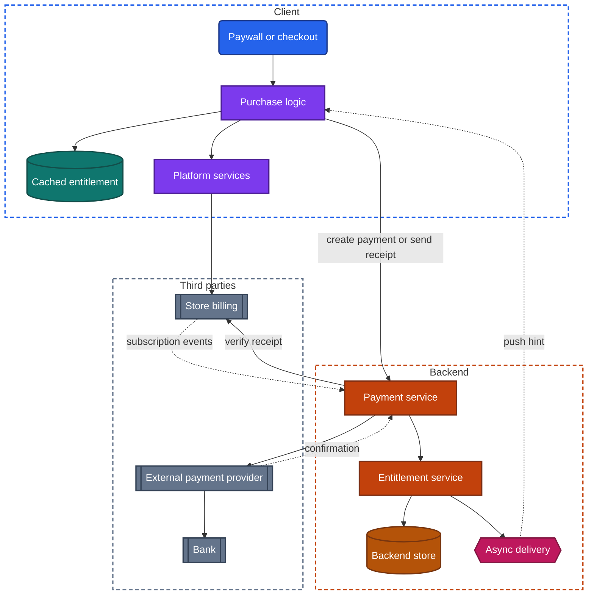
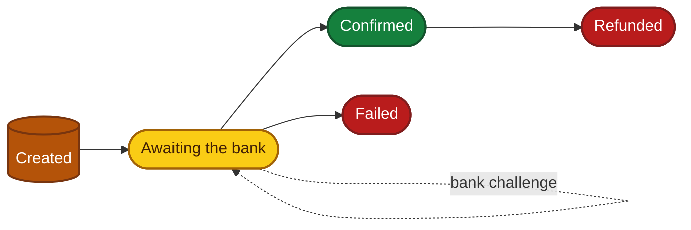
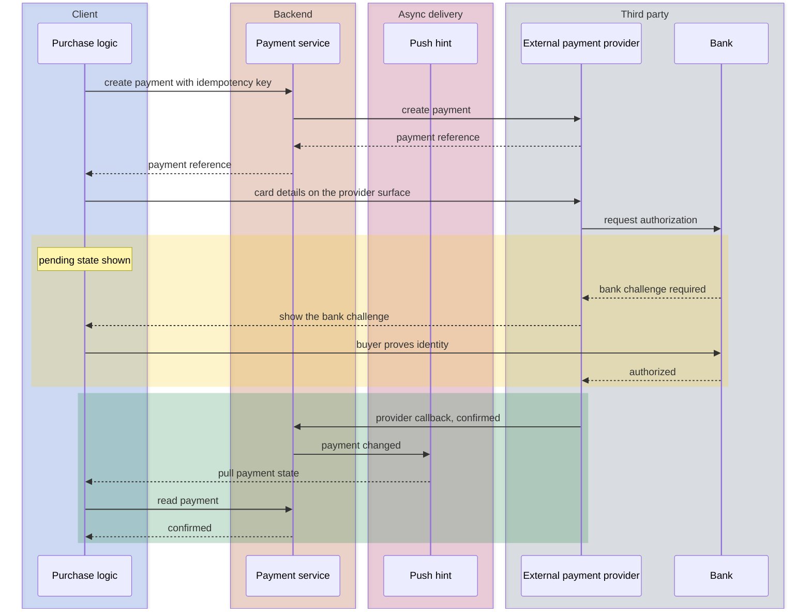

import Probe from '../../../components/Probe.astro';
import Signals from '../../../components/Signals.astro';
import TeardownBar from '../../../components/TeardownBar.astro';
import WorksheetForm from '../../../components/WorksheetForm.astro';

> **The question.** When this app takes money, how does the money move, and which party is responsible for each step?

## 26.1 Why this concern exists

Payment is the part of an app with the most parties in it. A purchase involves the buyer, the client, the app's backend, a store or a payment provider, and at least one bank. Each party holds part of the truth, and none of them holds all of it at the same moment.

Three of the seven constraints ([Chapter 2](/part-1-method/2-the-mobile-constraint-set/)) shape the design.

**Platform rules.** The store decides how an app may charge. For digital goods used inside the app, the store generally requires its own billing system. For physical goods and for services delivered outside the app, the store's billing is not available, and the app must use a payment provider of its own choice. This one rule splits every payment design into two routes before the team has made a single decision.

**Untrusted client.** A client that could say "this user has paid" would be told to say it by anyone who inspects the device. The decision that a payment succeeded, and the decision about what the user may now use, both belong to the backend. The client's part is to start the payment and to display what the backend decided.

**Unreliable network.** A payment is a request whose response matters more than any other, sent over a network that loses responses. The buyer's bank may take seconds or days to answer. The design must hold a payment in an undecided state without charging twice and without losing it.

Money also brings rules that come from outside the platform. Card schemes impose security requirements on any system that stores or carries card numbers, and those requirements are expensive to meet. Most teams design so that card numbers never enter their own systems at all.

Payment design is unusually readable from outside, because the rules force apps to state things. The paywall must say who bills you. The store's purchase sheet is drawn by the operating system and looks the same in every app. The subscription has to be manageable somewhere, and the app must tell you where. None of the probes in this chapter requires you to buy anything.

## 26.2 The design space

### The two routes

**Store billing** is the store's own payment system, reached through platform services ([Chapter 3](/part-1-method/3-the-universal-app-model/)). The client asks the operating system to sell a product from a catalog the team registered with the store. The operating system draws the purchase sheet, authenticates the buyer and charges the payment method on the buyer's store account. The app receives a **receipt**, which is a signed record of the purchase. The store keeps a share of the price, handles tax and refunds, and runs the renewal of subscriptions.

An **external payment provider** is a third party that moves money from the buyer's card or bank to the seller. The app's backend creates a payment at the provider and the client collects the payment details on a surface the provider controls. The team chooses the provider, pays lower fees, and takes on everything the store would have done: failed-payment retries, refunds, tax, fraud and disputes.

The platform rule assigns each kind of sale to one route.

| What is sold | Route | Typical apps |
|---|---|---|
| Digital goods used in the app: subscriptions, premium features, virtual currency, content | Store billing | Streaming, games, productivity tools |
| Physical goods | External payment provider | Marketplaces, grocery delivery |
| Services delivered in the real world | External payment provider | Rides, bookings, food delivery |
| Transfers between people | External payment provider or a licensed financial partner | Wallets, banking |

The rule has exceptions, and it changes by region and over time. Treat the route as something you observe, not something you deduce. Some apps sell both kinds of goods and carry both routes. Some sell digital goods only on a website and offer no purchase in the app at all. In that design the app reads the entitlement of whoever signs in and never mentions a price.

### Keeping card details away from the backend

On the external route, the team must decide where the card number is typed. There are four designs, and all but the last keep the number out of the app's own systems.

**A hosted payment screen** is a page the provider serves. The client opens it in a web view or a browser, the buyer types the card details there, and the provider returns the buyer to the app with a result. The app's code never sees the number. This is the cheapest design to build and the least integrated in look and feel.

**Embedded provider fields** are input fields supplied by the provider's code and placed inside the app's own layout. The screen looks like the app, but the fields send their contents straight to the provider. The app receives a **payment token**, which is a reference that stands in for the card and is useless outside that seller's account at that provider.

**The device wallet** is a platform service that holds cards the user added to the device. The app asks for a payment, the operating system draws a sheet, the user authenticates, and the wallet returns a single-use payment token. The app sees neither the card number nor the user's authentication.

**The app's own fields with the backend carrying the number** is possible and rare. It puts the whole backend under the card schemes' security requirements. A large payments company may choose it. Almost nobody else does.

| Design | Who draws the card form | What the backend receives | Visible signature |
|---|---|---|---|
| Hosted payment screen | The provider | A result and a payment token | A page in a different style, sometimes with an address bar |
| Embedded provider fields | The provider's code, inside the app's layout | A payment token | Fields that match the app, often with slightly different keyboard or focus behavior |
| Device wallet | The operating system | A single-use payment token | A system sheet with a saved card and an authentication prompt |
| Own fields | The app | The card number | None. Looks the same as embedded provider fields |

Embedded provider fields and the app's own fields cannot be told apart from outside. Record the first as Speculative, on the grounds that the second is costly and uncommon.

## 26.3 Anatomy

Figure 26.1 shows both routes in one app. Most apps have only the left or the right half of the third-party zone.



*Figure 26.1. The components of both payment routes.*

Three properties of this figure matter for a teardown.

First, the client never tells the backend that a payment succeeded. On the store route it forwards a receipt, and the backend checks that receipt with the store. On the external route the provider tells the backend directly. In both, the arrow that carries the truth runs from a third party to the backend.

Second, the dotted arrows are asynchronous. The confirmation of a payment and the events of a subscription arrive at the backend at a time the client does not control. The client therefore needs a way to learn the outcome later, through async delivery or by asking again.

Third, the entitlement is a separate thing from the payment. A payment is an event with money in it. An **entitlement** is the backend's current answer to "what may this account use". Payments, refunds, renewals and expiries all change entitlements, and the client reads only the result.

## 26.4 A payment as a state machine

A payment is not a request that returns true or false. It is a record on the backend that moves through states, and some of those states can last a long time.



*Figure 26.2. The states of a payment.*

- **Created.** The backend has recorded the intent to pay a stated amount for a stated order. No money has moved.
- **Awaiting the buyer's bank.** The payment details have been submitted. The provider has asked the bank, and the answer has not arrived. Card payments usually leave this state within seconds. Bank transfers and some local payment methods stay in it for hours or days.
- **Confirmed.** The bank agreed. The backend may now grant what was paid for.
- **Failed.** The bank refused, the buyer abandoned the payment, or a time limit passed.
- **Refunded.** Money was returned after confirmation, in full or in part.

### Creating a payment once

The create step is a mutation sent over an unreliable network, and it has the lost-response problem in its most expensive form. If the response is lost and the client retries, a careless backend creates a second payment and the buyer may be charged twice. The remedy is the idempotency key from [Chapter 12](/part-2-concerns/12-offline-and-sync/). The client generates the key once for the checkout attempt, stores it, and sends it with every retry. The backend passes its own key on to the provider for the same reason.

```text
function startPayment(order):
  key = savedKeyFor(order) or newUniqueId()
  save(order, key)                    // survives process death
  match backend.createPayment(order, key):
    Created(payment):
      showPaymentSurface(payment)     // hosted screen, fields or wallet
    AlreadyExists(payment):
      resume(payment)                 // a retry found the first attempt
    Unreachable:
      showRetry()                     // same key on the next attempt
```

This differs from the outbox in [Chapter 12](/part-2-concerns/12-offline-and-sync/) in one respect. A payment is never queued for later. The buyer must be present, the price may change and stock may run out, so every app treats payment as Level 0 and refuses to start one offline.

### Confirmation arrives later

The client is a poor witness to the outcome. The buyer may close the app during the bank's step. The device may lose the network just after the bank agrees. The provider therefore reports the outcome directly to the backend, in a **provider callback**, which is a request the provider sends to an address the backend registered. The backend treats the callback as the truth and treats anything the client reports as a hint.



*Figure 26.3. A payment on the external route, confirmed by a provider callback.*

The pending state in the middle of this figure is the main thing to look for. After the buyer submits, an honest client shows "processing" or "confirming your payment" until the backend says confirmed. The client learns of the change by one of the means in [Chapter 14](/part-2-concerns/14-real-time-delivery/): a push hint, a persistent connection, or polling the payment's state every few seconds. An order screen that flips to confirmed while you watch, with no action from you, shows that one of these is at work.

A client that shows "paid" the moment the provider's surface closes is trusting its own view. Some apps do this as an optimistic update and correct it later. It is a signal worth noting, because the correction, when it comes, is an order that turns from paid to failed.

### The bank challenge

A bank may refuse to authorize a payment until the buyer proves their identity again. This is the **bank challenge**. It appears in the middle of the payment as a screen from the bank, a code sent by text message, or an approval request in the bank's own app. In some regions regulation makes it mandatory for most card payments. Elsewhere the bank decides by risk.

The challenge has design consequences. The payment must wait in the awaiting state while the buyer leaves the app, and the app must survive that. The buyer may switch to a banking app, which puts the client in the background where process death can take it. A robust client stores the payment reference before showing the challenge and, on its next start, asks the backend what became of the payment. A fragile client returns to an empty cart, and the buyer does not know whether they paid.

Store billing hides all of this. The store holds the payment method and runs any challenge inside its own sheet.

## 26.5 Entitlements, receipts and restoring

### Who decides

An entitlement is decided on the backend. The reasoning is the untrusted client from [Chapter 2](/part-1-method/2-the-mobile-constraint-set/): a flag on the device that says "premium" can be set by the device's owner.

On the store route, the flow is as follows. The purchase completes inside platform services and the client receives a receipt. The client sends the receipt to the backend. The backend verifies it with the store, either by checking the store's signature or by asking the store directly. Only then does it record the entitlement against an account.

```text
function grantFromReceipt(account, receipt):
  purchase = store.verify(receipt)       // backend to store, not client to store
  if purchase is invalid: return Rejected
  transaction(backendStore):
    if purchaseAlreadyLinked(purchase.id, otherThan: account):
      return LinkedElsewhere             // one purchase, one account
    upsertEntitlement(account, purchase.product, purchase.expiresAt)
    recordPurchase(purchase.id, account)
  return Granted
```

A simpler design exists: the client checks the receipt itself and unlocks features locally, with no backend. Small apps with no accounts use it. It works, and it is easy to defeat. It also cannot carry a purchase to another platform. Whether an app verifies receipts on the backend cannot be seen directly, so a claim about it is Inferred at best, from the evidence that the entitlement follows the account across platforms.

### The cached entitlement

A client that asked the backend before every paid action would fail offline. Most clients cache the entitlement with an expiry time and use the cached copy until then. The trade-off is plain. A long expiry lets a paying user keep working on a flight. It also lets a refunded user keep the feature until the cache runs out. Downloaded media is often handled item by item, with each download carrying its own expiry and requiring the app to go online periodically to extend it.

### Restoring purchases

A **restore purchases** control asks the store for every lasting purchase made by the device's store account and runs each one through the same receipt flow. It exists because a store purchase belongs to a store account, and an app account may not exist at all. A user who reinstalls, or moves to a new device, has paid and has nothing on the device that says so.

What the control asks for shows where entitlements live. If it works without signing in to the app, entitlements can hang on the store account alone. If it demands an app sign-in first, the app account is the owner and the store receipt is only the proof used to attach a purchase to it.

Two identities are in play, and they can disagree. One store account may be used by a family with several app accounts. One app account may be signed in on devices with different store accounts. The backend must choose a rule, and the usual one is that a purchase links to the first app account that presents it. The visible result is a message such as "this subscription is linked to another account".

## 26.6 The subscription lifecycle

A subscription is a payment that repeats without the buyer present, and an entitlement with an end date that keeps moving.

| State | What happened | Entitlement | What the user sees |
|---|---|---|---|
| **Trial** | Subscribed with a free or reduced first period | Active | A trial end date, and often a reminder before the first charge |
| Active | A period was paid for | Active | A renewal date |
| Canceled | The user turned off renewal | Active until the period ends | "Expires on" in place of "renews on" |
| **Grace period** | A renewal charge failed and is being retried | Active for a limited time | A request to update the payment method |
| On hold | Retries continue after the grace period ran out | Suspended | Locked features and a request to fix billing |
| Expired | The period ended with no renewal | None | The paywall |
| Revoked | A refund or a dispute reversed the purchase | None, at once | Locked features, sometimes with no explanation |

The grace period deserves attention. Renewal charges fail often, mostly for dull reasons such as an expired card. Ending the subscription at the first failure would lose customers who intend to pay. So the party that runs the renewal retries the charge for days or weeks, and the product keeps working for the first part of that time.

### Who runs the clock

On the store route, the store runs renewals, retries and cancellations. The app's backend is a spectator that must keep an accurate copy. It has three ways to stay informed.

| Method | How it works | Weakness |
|---|---|---|
| Events from the store | The store sends a request to the backend when a subscription changes | The backend must handle events that arrive late, twice or out of order |
| Asking the store | The backend queries the store for a subscription's state on a schedule or on demand | Changes are noticed only at the next query |
| Client reports | The client reads the current receipt at launch and forwards it | A user on another platform sees stale state until the buying device next runs the app |

Mature designs use the first and keep the second as a repair path. The third alone gives a recognizable defect: a subscription renewed on a phone stays expired on the web until the phone app is opened.

On the external route, the backend runs the clock itself, usually by delegating the schedule to the provider's subscription feature. Renewal is a charge against a saved payment method with nobody present. The backend also owns the retry schedule, the grace period, and the emails that ask for a new card.

### One subscription across platforms

A user may subscribe through one store, sign in on the other platform, and expect the product to work. That requires the backend to hold the entitlement against the app account, whichever route produced it. It also creates a management problem. A subscription bought through one store can only be canceled through that store. The backend records where each subscription came from, and the other clients show a message that sends the user back there. An account can also end up with two live subscriptions from two routes. Good designs detect that and warn. Others charge twice until the user notices.

### Where cancellation lives

The store's rules require that a store subscription is managed in the store's own settings. An app on that route can only link there. An app on the external route owns cancellation and may place it in the app, on a website, or behind a support conversation. Where the cancel control leads is therefore a direct reading of who owns the subscription.

## 26.7 Saved payment methods and refunds

### Saved payment methods

On the external route, a returning buyer expects not to retype a card. The provider keeps the card and gives the backend a payment token that can be charged again. The backend stores the token with a few display details: the card brand, the last four digits and the expiry month. That is why a saved card always appears in that form. The app cannot show more, because it holds nothing more.

A saved method also enables charges with the buyer absent. A ride is priced at the end of the trip. A delivery order changes when an item is out of stock. Designs for these place a hold for an estimated amount at the start and capture the final amount afterwards. From outside this shows as a pending charge on the bank statement that later changes or disappears.

Saved methods are account data, so they follow the account to a second device. A device wallet is the opposite: its cards live on the device, and a second device offers its own.

### Refunds

A refund is a second movement of money with its own state machine. The request is created, the provider passes it to the bank, and the bank returns the money some days later. Apps that model it honestly show "refund pending" and then "refunded". Partial refunds add an amount to each state.

Responsibility again follows the route. On the store route, the buyer asks the store, the store decides, and the backend finds out afterwards from a store event and revokes the entitlement. The app's own support staff often cannot grant the refund at all, and the help pages say so. On the external route, the backend asks the provider to refund, and the team sets the policy.

A dispute is a refund the buyer's bank forces. It arrives at the backend as an event, sometimes months after the purchase, and it is the reason entitlements must be revocable at any time.

## 26.8 Probes

Run P26.1 and P26.2 on any app that asks for money, since they settle the route. P26.6 and P26.7 need an account that already has a purchase. Skip them otherwise. None of these probes requires a payment, and none should end in one.

<TeardownBar />

### P26.1 Read the paywall

<Probe id="P26.1" />

### P26.2 Start a checkout and cancel

<Probe id="P26.2" />

### P26.3 Look for the abandoned payment

<Probe id="P26.3" />

### P26.4 Paywall in airplane mode

<Probe id="P26.4" />

### P26.5 Restore purchases

<Probe id="P26.5" />

### P26.6 Existing entitlement on a second device

<Probe id="P26.6" />

### P26.7 Existing entitlement offline

<Probe id="P26.7" />

### P26.8 Where to manage or cancel

<Probe id="P26.8" />

### P26.9 Saved payment methods

<Probe id="P26.9" />

## 26.9 Signal-to-design table

<Signals chapter={26} />

## 26.10 The backend this implies

Once the route is known, most of the backend can be Inferred.

- **Store billing.** A product catalog registered with the store, mirrored in the backend so that each product maps to an entitlement. A receipt verification step that talks to the store. A record of which purchase is linked to which account. An endpoint that receives subscription events from the store, tolerant of repeats and of events out of order. A scheduled job that asks the store about subscriptions whose events may have been missed.
- **External payment provider.** A payment service that creates payments with an idempotency key and stores each payment's state. An endpoint for provider callbacks that verifies each callback really came from the provider. An order model whose states depend on the payment's states. A store of payment tokens per account. A refund path, and a reconciliation job that compares the backend's records with the provider's.
- **Either route.** An entitlement service that every feature asks, so that the rest of the backend does not care which route produced the entitlement. A way to tell clients that an entitlement changed, by push hint or on the next request. Support tooling to inspect and correct a customer's state.
- **Subscriptions on the external route.** A renewal schedule, a retry policy with a grace period, and messages to the user at each step. [Chapter 23](/part-2-concerns/23-background-work-and-notifications/), Background work and notifications, covers how those messages reach the device.

The paywall itself is often controlled from the backend. Offers, prices shown first and trial lengths are among the most frequently changed things in an app, and they are a common use of remote config. [Chapter 30](/part-2-concerns/30-remote-config-and-experiments/), Remote config and experiments, covers how an app changes its behavior without a new release.

Payment also raises the bar on identity. Many apps ask for authentication again before a purchase or before showing saved methods. [Chapter 20](/part-2-concerns/20-identity-and-sessions/), Identity and sessions, and [Chapter 21](/part-2-concerns/21-security-and-trust/), Security and trust, cover what the backend refuses to trust the client with.

## 26.11 Failure modes and what they reveal

- **Charged, and the order says unpaid.** The provider callback was lost or not processed, and nothing repairs the gap. The client's report was the only path that worked. A design with a reconciliation job heals this within minutes.
- **Charged twice.** Payment creation has no idempotency key, or the key was regenerated on retry. This is the duplicate-item bug from [Chapter 12](/part-2-concerns/12-offline-and-sync/) with money attached.
- **Paid, and features stay locked until the app is restarted.** The entitlement changed on the backend and the client was not told. It reads entitlements only at launch.
- **An empty cart after returning from the bank's app.** Process death during the bank challenge, and no stored payment reference to resume from.
- **Subscribed on one platform, locked on the other.** Entitlements follow the store account, or the backend learns of renewals only from client reports.
- **Features locked on the day a renewal fails.** No grace period. The entitlement's end date is taken literally.
- **Features that keep working long after cancellation or a refund.** A cached entitlement with a long expiry, or a client that decides entitlements itself.
- **Two active subscriptions on one account.** The backend does not check for an existing entitlement from the other route before the client offers a purchase.
- **"Linked to another account" after a reinstall.** The purchase was attached to a different app account under the same store account, and the linking rule is first come, first served.
- **A paywall with blank prices.** The price lookup against the store's catalog failed and the layout has no fallback.

## 26.12 Worksheet entries

These are the fields this chapter adds to the teardown worksheet. Probe outcomes fill some of them in. An app with both routes needs one set of entries per route.

<TeardownBar />

<WorksheetForm chapters={[26]} />

## 26.13 Summary

- A platform rule splits payments into two routes. Digital goods go through store billing. Physical goods and services go through an external payment provider. The paywall text and the payment surface show which route an app uses.
- Card details stay out of the app's backend. A hosted payment screen, embedded provider fields or the device wallet collect them, and the backend holds only a payment token.
- A payment is a state machine on the backend: created, awaiting the buyer's bank, confirmed, failed, refunded. An idempotency key makes creation safe to retry.
- Confirmation comes from the provider or the store to the backend, not from the client. The client shows a pending state and learns the outcome afterwards. A bank challenge can hold the payment in the waiting state while the buyer is in another app.
- Entitlements are decided on the backend from receipts it verifies with the store. The client caches the result with an expiry time, which is why paid features can work offline.
- Restore purchases shows whether entitlements hang on the store account or the app account. A second device, and a second platform, show whether the backend carries them.
- A subscription moves through trial, active, canceled, grace period, on hold, expired and revoked. The party that runs renewals is also the party that owns cancellation, and the cancel control leads to it.
- Refunds are their own state machine. On the store route the store grants them and the backend finds out afterwards.
