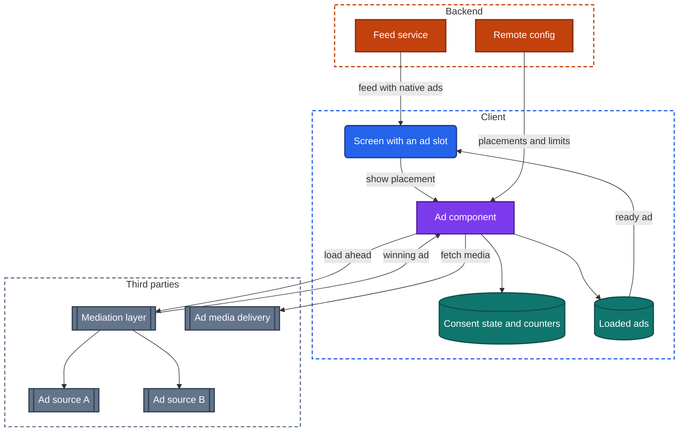
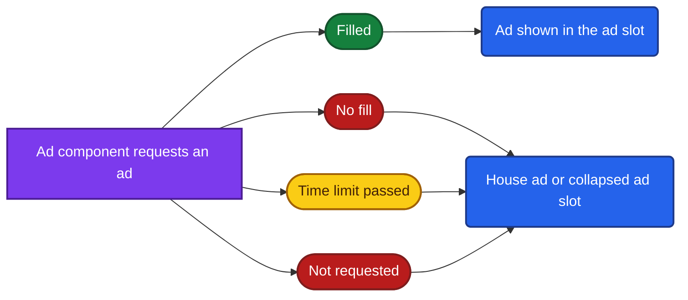
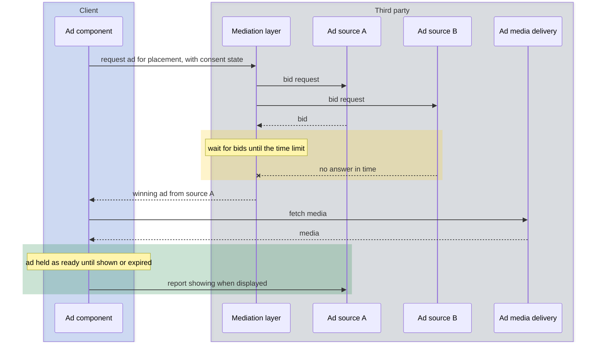
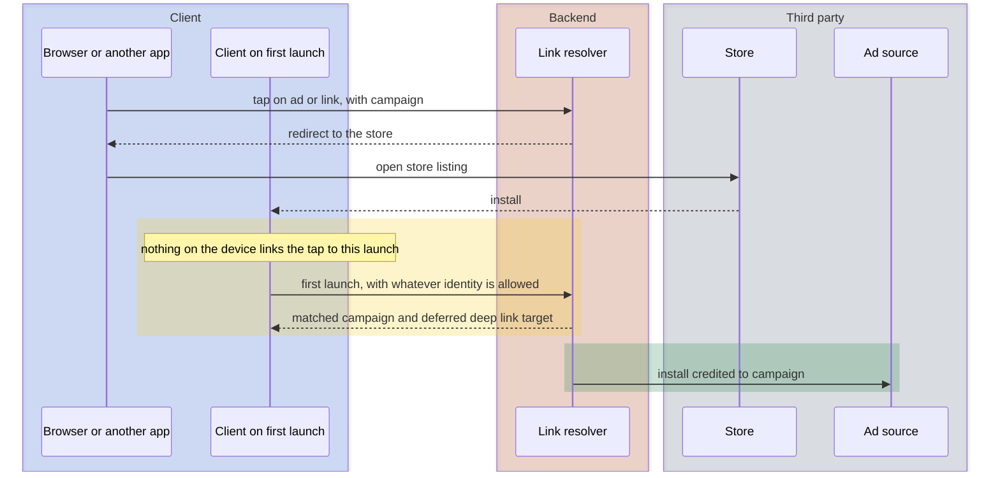

import Probe from '../../../components/Probe.astro';
import Signals from '../../../components/Signals.astro';
import TeardownBar from '../../../components/TeardownBar.astro';
import WorksheetForm from '../../../components/WorksheetForm.astro';

> **The question.** How does this app earn from attention, and how does it know where its users came from?

## 27.1 Why this concern exists

An app that does not charge its users still has to pay for itself. The usual answer is to sell the user's attention to advertisers. An app also has to find users, and every team wants to know which of its efforts found them. Ads, attribution and growth are three systems built around those two needs. They share data, they share third parties, and they are subject to the same constraints ([Chapter 2](/part-1-method/2-the-mobile-constraint-set/)).

**Human attention.** An ad spends the scarcest thing the app has. Every format is a decision about which moment may be interrupted and for how long. A rating prompt and a re-engagement notification spend the same resource.

**Unreliable network and limited resources.** An ad is media fetched from a third party, often video. It cannot be fetched at the moment it is needed without making the user wait, so it is fetched ahead. That costs data, memory and battery, and it can slow the launch.

**Untrusted client.** Advertisers pay for views, taps and installs, and all three are reported by clients. Anything a client reports can be forged. Rewards, referral credits and install counts are therefore checked on a backend wherever money depends on them.

**Platform rules.** The operating system decides whether an app may follow a user across other companies' apps, and asks the user. It supplies its own install reporting. It limits how often a rating dialog may appear, and it gates notifications behind a permission.

Most of the machinery in this chapter is not built by the app's team. It is third-party code inside the client that talks to third-party backends. A teardown cannot see those backends. It can see how the app is arranged around them: where an ad slot sits, when it is filled, what happens when it is not, and what the app knows on its first launch.

## 27.2 The design space

### Ad formats

Four formats cover nearly every ad in a mobile app. They differ in what they interrupt.

A **banner** is a small rectangle fixed to an edge of the screen or placed between sections. It interrupts nothing, earns little per showing, and refreshes on a timer.

A **full-screen ad** covers the app between two actions, such as between levels of a game or after an article closes. It earns far more per showing than a banner. It must be ready at the exact moment of the break, and the user must be able to close it.

A **rewarded ad** is a full-screen ad the user chooses to watch in exchange for something in the app: an extra life, a free unlock, a day without ads. It is the only format users ask for, and it creates a new problem, which is that the reward must be granted only for a completed view.

A **native ad** is an item in a list or feed, drawn in the style of the surrounding content and marked as paid. It is the main format of feed-based apps.

| Format | Where it appears | What triggers it | Interrupts | Relative earnings per showing |
|---|---|---|---|---|
| Banner | A fixed strip or a gap between sections | The screen appearing, then a timer | Nothing | Lowest |
| Full-screen ad | Over the whole app | A break between two actions | The flow | High |
| Rewarded ad | Over the whole app | The user's own tap | Nothing the user did not choose | Highest |
| Native ad | Inside a list or feed | Scrolling to its position | Nothing | Medium to high |

### Where the ads come from

The second axis is who supplies the ad for a given ad slot. An **ad source** is any system that can return an ad when asked.

**House ads only.** The app shows promotions for its own products. The content comes from the app's backend or ships with the app. There is no third party and no payment per showing.

**Direct sale.** The team sells its ad slots to advertisers itself and serves the ads from its own backend. Large feed apps do this. Targeting, pacing and measurement are all built in-house, and ads are just another item type in the feed.

**One ad network.** The client embeds one third party's code and asks it for ads. This is simple and leaves money unearned, because one network does not have a paying ad for every request.

**Several ad sources behind a mediation layer.** A **mediation layer** is a component that asks several ad sources for the same ad slot and picks one. It raises both the price and the **fill**, which is the share of ad requests that come back with an ad. It also raises latency and the amount of third-party code in the client.

| Design | Who chooses the ad | Third parties in the client | Typical fill | Who uses it |
|---|---|---|---|---|
| House ads only | The app's backend | None | Full, by construction | Apps that cross-promote their own products |
| Direct sale | The app's backend | None or few | High | Very large feed and content apps |
| One ad network | That network | One | Partial | Small apps |
| Mediation layer | An auction or ordered list among sources | Several | Highest | Games and most ad-funded apps |

## 27.3 Anatomy

Figure 27.1 shows an ad-funded client with a mediation layer. The team's own backend plays a small part. It supplies configuration and, for native ads sold directly, the ad items themselves.



*Figure 27.1. The components that fill an ad slot.*

Four terms from this figure are used in the rest of the chapter.

- An **ad slot** is a position in the UI that an ad may occupy.
- A placement is the team's name for one ad slot and its rules: which format, which ad sources and which limits apply. Placements are usually defined in remote config, so they can change without a release.
- The **ad component** is the client logic that loads ads, holds them and decides whether one may be shown now. Much of it is third-party code.
- The loaded ads are a small cache of ads that are ready to show. Unlike most caches, its entries expire quickly and each can be used once.

## 27.4 Filling a slot

### Loading ahead of display

A full-screen ad shown at a break must appear at once. A video cannot be fetched in the gap between two game levels without the user noticing the wait. So the ad component requests an ad long before the break, downloads its media, and holds it.

```text
function showFullScreenAd(placement, continueFlow):
  if not frequencyLimit.allows(placement):
    return continueFlow()
  ad = loadedAds.take(placement)
  if ad is none or ad.isExpired():
    preload(placement)
    return continueFlow()            // never make the user wait for an ad
  ad.show(onClosed: continueFlow)
  frequencyLimit.record(placement)
  preload(placement)                 // replace the one just used
```

Three details of this logic are visible from outside.

The ad is counted when shown, not when loaded. An ad source pays for a showing. A loaded ad that is never shown earns nothing, and it has still cost the user's data.

A loaded ad expires. Ad sources accept a showing only within a time limit after the load, commonly around an hour. An app left in the background returns with expired ads and must load again, so the first break after a long pause often has no ad.

The flow continues when no ad is ready. A well-built app treats the ad as optional. A badly built one shows a loading indicator at the break and makes the user wait, or shows the ad late, on top of whatever the user has moved on to.

A rewarded ad makes the loaded state visible. Because the user asks for it, the control must tell the truth about whether an ad is ready. A button that is disabled, or reads "no ad available", and then becomes active is the loaded-ads cache shown directly in the UI.

### What an empty slot means

An ad request has more outcomes than success.



*Figure 27.2. The outcomes of an ad request.*

- **Filled.** An ad source returned an ad and its media was fetched.
- **No fill.** Every ad source declined. No advertiser wanted this request at the minimum price. Fill varies by country, by time of day, and by whether the request carries a user identity.
- **Time limit passed.** The sources were too slow, or the network was.
- **Not requested.** The ad component decided not to ask. A frequency limit applied, consent was missing, the account is a paying one, or remote config turned the placement off.

All but the first leave the ad slot without a paid ad. What the app does then is a layout decision with a clear signature. A slot that reserves its space stays as a blank rectangle or shows a house ad. A slot that reserves no space is absent until an ad arrives, and then pushes content down when it does. The first design is stable and sometimes ugly. The second is clean and sometimes makes the user tap the wrong thing.

### An auction among ad sources

How the mediation layer picks a winner is hidden. Two designs are in use, and both are **Speculative** from outside.

In an ordered list, the mediation layer asks the ad sources one at a time, from the highest expected price down, and takes the first that returns an ad. Latency grows with each source that declines.

In an auction, the mediation layer asks all sources for a bid at the same time, waits until a time limit, and takes the highest bid. Latency is bounded by the time limit, and the price is set by real competition.



*Figure 27.3. One auction for one ad slot. The design is Speculative from outside.*

The hints are indirect. Load times that vary widely from one request to the next suggest a chain of sources. Ads whose style, close button and end screen differ from one showing to the next show that more than one ad source feeds the slot, which is Inferred. Whether those sources are asked in order or in an auction is not something a user can determine.

### Native ads in a feed

A native ad can enter a feed in two ways ([Chapter 15](/part-2-concerns/15-lists-feeds-and-pagination/)).

The backend can insert it. The feed service ranks ads together with content and returns one list. The ad is an item like any other, it is cached with the page, and it appears offline along with the rest of a cached feed.

The client can insert it. The client receives a feed of content only, and the ad component fills fixed positions, such as every fifth item, from its own requests. These ads arrive a moment after the content, show a placeholder first, and are missing offline.

### Frequency limits

A **frequency limit** caps how often a user sees ads. It exists because revenue per user rises with ads shown, and retention falls with them. Limits are set per placement, and three kinds are common: one ad per so many actions, a minimum time between ads, and a maximum per day or per session. A further rule often spares new users for their first session or first few days.

The limit can be kept on the client, as counters in key-value settings, or on the backend, per account. A client-side limit resets when the app's data is cleared. A backend limit follows the account to another device. The values are normally in remote config and are a frequent subject of experiments, so two users may see different limits.

### Rewards

A reward must not be granted for an ad that was skipped. In the simple design, the ad component tells the client the view completed, and the client grants the reward. In the stricter design, the ad source tells the app's backend directly, and the backend grants it. This is the same shape as the provider callback in [Chapter 26](/part-2-concerns/26-payments-and-subscriptions/), for the same reason. From outside, a reward that arrives a second or two after the ad closes hints at the backend path. That reading is Speculative.

### Consent gating

A personalized ad is selected using what is known about the user from other apps and sites. That requires an identifier that those other parties also hold. The operating system provides an advertising identifier for this, and the user can withhold it. On some platforms the app must ask permission to track before it may read the identifier. In some regions, law also requires consent before any personal data is used for advertising.

The design consequence is a gate. Consent must be collected before the ad component initializes, because the first ad request already carries the answer. So the consent screen sits early in the startup flow, and the consent state is stored and passed with every ad request. Without consent, the ad sources fall back to selecting by context: the app, the content on screen, the country. Fewer of them bid, and they bid less. [Chapter 22](/part-2-concerns/22-privacy-permissions-and-consent/), Privacy, permissions and consent, covers what an app asks to access, when it asks, and what it does when refused.

## 27.5 Attribution

**Attribution** is matching an install, or a later action, to the link or ad that caused it. The team wants it to decide where to spend its marketing budget. Ad networks want it because many are paid per install.

The difficulty is the same one behind the deferred deep link in [Chapter 8](/part-2-concerns/8-navigation-deep-links-and-screen-state/). The tap happens in one app or browser. The install happens in the store. The first launch happens in a new app that shares nothing with the place where the tap occurred. Something must carry the tap's identity across that gap.

### Ways to match

| Method | How the match is made | Precision | What it needs |
|---|---|---|---|
| Advertising identifier | The app that showed the ad and the new app both read the same identifier | Exact, per device | The user's permission in both apps |
| Store referrer | The store passes a short string from the link to the app after install | Exact, per install | A store that offers it |
| Device matching | The tap and the first launch are compared by network address, device model and time | Approximate | Nothing, which is why platform rules restrict it |
| Aggregate reporting by the platform | The operating system itself records the tap and the install and reports later | Per campaign, never per user | Nothing from the user |
| Referral code or account match | The user types a code, or signs up with the invited email address or phone number | Exact | Effort from the user |
| Asking the user | An onboarding question about where they heard of the app | Rough | An honest answer |



*Figure 27.4. Attribution of an install. The link resolver is often run by a third party.*

### The platform's privacy-preserving reporting

Per-user matching lets ad networks follow a person from app to app, and the platforms have moved against it. Their alternative moves attribution into the operating system. The operating system records that an ad for the app was shown or tapped. If the app is then installed and opened, the operating system sends a report to the ad network. The report names the campaign and carries a small value the app may set. It names no user and no device. It is delayed by a random interval, and details are withheld when too few installs share them.

This changes the app's design in a way that is easy to miss. The team can no longer learn that a given user came from a given ad. It learns that a campaign produced so many installs of roughly such quality. The app's part is to tell the operating system, within the first days of use, a coarse value that summarizes how valuable this install looks. Deciding what to pack into that value is a product decision, and it happens entirely out of sight.

This reporting cannot be seen from outside. What you can see is its side effect. An app that asks during onboarding where you heard about it is filling the gap with the user's own answer.

### Referral codes

A **referral code** is an identifier for the inviting user. It travels inside an invitation link, or the new user types it. On the backend it is a record that links two accounts, usually with a reward attached.

The reward makes it a target for abuse. One person can create many accounts and invite themselves. Designs therefore pay the reward only after a qualifying event, such as a first order, and check for repeated devices and payment methods. All of that is decided on the backend. A reward that appears "after your friend's first purchase" is that rule shown to the user.

When the invitation is a link, the referral code rides on a deferred deep link. If the match across installation fails, a field for typing the code is the fallback. An app that offers both has seen the match fail often enough to need one.

## 27.6 Growth mechanics as system design

Growth features look like marketing. Each one is also a small system with data, triggers and a backend.

### Invitations and contact matching

An invitation by link needs little: a link resolver, a referral record, and the share sheet of the operating system. The backend never learns who was invited until someone taps.

**Contact matching** is heavier. The client reads the device's contacts, with permission, and uploads phone numbers or email addresses. The backend compares them with the identifiers of its accounts and returns the matches. This tells a new user at once which of their contacts already use the app, which is the fastest way to give a social product something to show.

The design choices are about how much the backend keeps. It may match and discard. It may store the uploaded contacts, which lets it notify you when one of them joins later, and lets it suggest you to people whose number you hold. Identifiers are often hashed before upload. That is weaker than it sounds, because the space of phone numbers is small enough to search. A notification that a contact has just joined, long after you granted access, shows that the contacts were stored.

### Rating prompts

Store ratings affect how many people install an app, so teams ask for them. The operating system provides a system rating dialog and limits how often it may appear. The app can request it. The operating system may decline, without telling the app.

That scarcity makes the trigger matter. A **rating prompt** is fired by a condition, and the condition is a small rules engine: enough launches, enough days since install, no recent crash, not asked recently, and a positive event just completed. A delivered order, a finished workout and a won game are typical. The values usually sit in remote config.

Many apps place their own question first. A pre-prompt asks whether you are enjoying the app. A yes leads to the system rating dialog. A no leads to a feedback form that goes to the team and not to the store. This raises the average rating by filtering who is asked. Store rules restrict the practice in some cases, and it is easy to observe.

### Re-engagement notifications

A **re-engagement notification** is sent to bring back a user who has stopped opening the app. Two designs produce it.

The client can schedule it locally. On each launch it cancels the pending notification and schedules a new one for some days ahead. If the user returns, the cycle repeats. If not, the notification fires. No backend is involved, the text is generic, and it arrives even when the device is offline.

The backend can send it by platform push. A job selects users by their last activity, composes a message from their data, and sends it. The text can name specific content, a friend's activity or an expiring offer. This design needs an event pipeline that records activity, a campaign service, limits on how many messages one user receives, and a sense of the user's local time. [Chapter 23](/part-2-concerns/23-background-work-and-notifications/), Background work and notifications, covers what wakes an app when it is not on screen.

A tap on such a notification is a deep link, and the campaign records whether it worked. That is attribution again, applied to an existing user.

### Promotional content controlled by remote config

The app's own promotions are the last growth surface: a banner on the home screen, a full-screen message at launch, a badge on a tab. They change weekly, they differ by region and user segment, and they have start and end times. No team ships a release for each.

So the content comes from the backend. In the lightest design, remote config carries an image address, a text and a deep link for a fixed slot. In a heavier one, the home screen is a screen-describing response and promotions are sections within it. [Chapter 30](/part-2-concerns/30-remote-config-and-experiments/), Remote config and experiments, and [Chapter 31](/part-2-concerns/31-server-driven-ui/), Server-driven UI, cover those two mechanisms. For this chapter, the point is that a promotion is a house ad. It fills a slot, it is targeted, and its taps are counted.

## 27.7 Probes

Start with P27.1, which tells you whether the ad probes apply. P27.2 to P27.5 are for apps with ads. P27.6 to P27.10 apply to any app that wants to grow, and P27.8 and P27.9 need days or weeks of elapsed time, so start them early.

<TeardownBar />

### P27.1 Ad inventory

<Probe id="P27.1" />

### P27.2 Ad slots in airplane mode

<Probe id="P27.2" />

### P27.3 Rewarded ad readiness

<Probe id="P27.3" />

### P27.4 Count the full-screen ads

<Probe id="P27.4" />

### P27.5 Decline tracking and compare

<Probe id="P27.5" />

### P27.6 Install from a referral link

<Probe id="P27.6" />

### P27.7 Invitation screen

<Probe id="P27.7" />

### P27.8 Rating prompt timing

<Probe id="P27.8" />

### P27.9 Re-engagement notifications

<Probe id="P27.9" />

### P27.10 Promotional content over time

<Probe id="P27.10" />

## 27.8 Signal-to-design table

<Signals chapter={27} />

## 27.9 The backend this implies

Much of this concern runs on third parties. The team's own backend holds the parts that carry its rules or its users' data.

- **Ads through third parties.** Placement definitions, frequency limits and on-off switches in remote config. An endpoint that receives reward confirmations from ad sources, where rewards have value. A rule that suppresses ads for paying accounts, which ties this chapter to the entitlements in [Chapter 26](/part-2-concerns/26-payments-and-subscriptions/).
- **Ads sold directly.** An ad store with campaigns, budgets and targeting. Ranking that mixes ads into the feed. Counting of showings and taps that advertisers can trust, which means deduplication and fraud checks on events sent by an untrusted client.
- **Attribution.** A link resolver that records taps and answers a first-launch query, run by the team or by a third party. A place to keep the campaign an account came from. An endpoint for the platform's aggregate reports, if the team receives them itself.
- **Referrals.** Referral records that link inviter and invitee, a definition of the qualifying event, and abuse checks.
- **Contact matching.** A matching service over account identifiers, and a decision, visible in its effects, about whether uploaded contacts are stored.
- **Re-engagement.** An event pipeline that records activity, a way to select users by it, a campaign service that composes and schedules messages, and per-user limits. [Chapter 34](/part-2-concerns/34-observability/), Observability, covers how the team knows what the app is doing on your device.
- **Promotions.** Remote config or a content service with targeting and schedules.

The client side has a cost that the backend list hides. Each ad source, the mediation layer and the attribution third party all ship code inside the app. That code adds to the app's size, runs at launch, and makes its own network requests. [Chapter 38](/part-2-concerns/38-modularity-sdks-and-team-scale/), Modularity, SDKs and team scale, covers what the app's shape says about the code behind it.

## 27.10 Failure modes and what they reveal

- **Content jumps down as you are about to tap.** An ad slot with no reserved space, filled after the screen was drawn.
- **A blank rectangle where an ad should be.** A reserved ad slot, no fill, and no house ad as a fallback.
- **A full-screen ad appears seconds late, over the next screen.** The ad was requested at the break and shown when it arrived. Nothing was loaded ahead, and the late showing was not canceled.
- **A loading indicator before an ad.** The app makes the user wait for an ad to load. Revenue was ranked above the flow.
- **You watched the ad and got no reward.** The completion event was lost between the ad component, the client and the backend. If the reward appears after a restart, the backend had it and the client was not told.
- **The same ad many times in a row.** One ad source with few campaigns for your profile, and no limit per ad.
- **No ad at the first break after a long pause.** The loaded ads expired in the background and nothing reloaded them on return.
- **The consent screen returns on every launch.** The consent state is not stored, or it is stored somewhere that does not survive.
- **A referral that was never credited.** The match across installation failed and the app has no typed-code fallback.
- **A rating prompt right after an error.** The trigger counts launches or days and ignores what just happened.
- **A notification that leads to content that no longer exists.** The message was composed ahead of time and its deep link went stale.
- **A slower launch than the app's content would explain.** Third-party ad and attribution code initializes before the first frame ([Chapter 7](/part-2-concerns/7-launch-and-startup/)).

## 27.11 Worksheet entries

These are the fields this chapter adds to the teardown worksheet. Probe outcomes fill some of them in. Record the ad fields per placement when an app has several.

<TeardownBar />

<WorksheetForm chapters={[27]} />

## 27.12 Summary

- Four ad formats cover most apps: banner, full-screen ad, rewarded ad and native ad. Each is a decision about which moment may be interrupted.
- Ads are loaded ahead of display, held briefly and used once. A rewarded ad control that becomes ready shows that cache directly.
- An empty ad slot means no fill, a passed time limit or a request that was never made. Whether the slot collapses or stays reserved is a layout decision you can observe.
- Several ad sources behind one ad slot can be Inferred from ads that differ in style. Whether they are chosen by an ordered list or an auction is Speculative.
- Frequency limits count actions, time or both. Repeating one action at two paces separates them.
- Consent gates the ad request. Declining tracking changes what the ad sources know, and often lowers fill.
- Attribution carries a tap across installation by an identifier, a store referrer, device matching, a code or the account. The platform's own reporting works per campaign and is invisible from outside.
- Invitations, contact matching, rating prompts, re-engagement notifications and promotions are small systems with triggers and backends. Their timing and content show where each rule lives.
