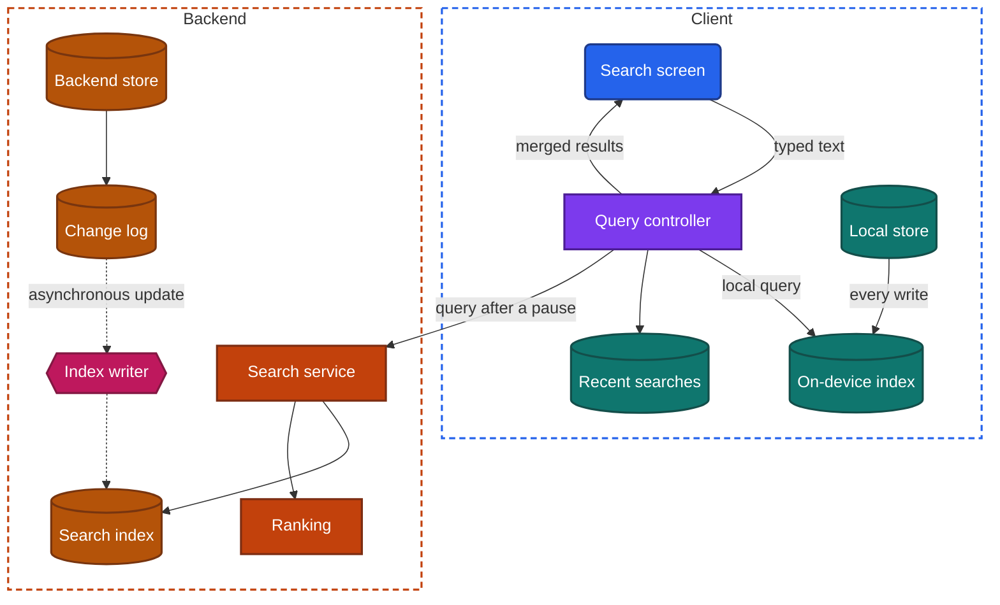
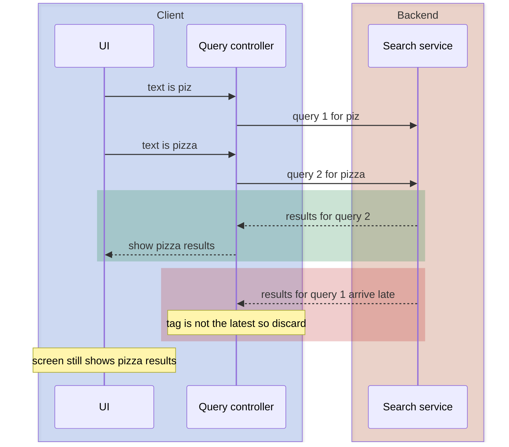

import Probe from '../../../components/Probe.astro';
import Signals from '../../../components/Signals.astro';
import TeardownBar from '../../../components/TeardownBar.astro';
import WorksheetForm from '../../../components/WorksheetForm.astro';

> **The question.** How does this app find things for you, and where is that work done?

## 28.1 Why this concern exists

Search is the one screen where the user sends a new request with every keystroke and expects an answer before the next one. Three of the seven constraints ([Chapter 2](/part-1-method/2-the-mobile-constraint-set/)) meet there.

**Human attention.** A search box that waits a full second after each letter feels broken. The response has to look immediate, and it has to stay stable enough to read while the user is still typing.

**Unreliable network.** Typing a ten-letter word can produce ten requests. On a weak connection their responses return late, and not in the order they were sent. A client that draws whatever arrives last will show results for a query the user has already replaced.

**Limited resources.** The data being searched is usually far larger than the device can hold. A catalog of millions of items cannot be copied to a phone. A user's own notes can. The size of the data set, more than anything else, decides where the search runs.

There is a fourth pressure that is specific to search. Finding text well is hard. Tolerating misspellings, matching word forms, ordering results by usefulness and counting matches per filter value all need a specialized data structure, a search index, that is built ahead of time and kept up to date. Somebody has to build it and keep it current, on the device or on the backend, and the choice leaves marks you can see.

Discovery is the same machinery without a typed query. A browse screen, a row of recommendations and a "similar items" strip all answer the question "what should this user look at next", using the context as the query. This chapter treats them as one concern, because the backend components behind them overlap and the probes are the same.

## 28.2 The design space

There are four workable places to do the finding. They are listed from simplest to most capable.

**Local filter.** The client holds a list in memory or in its local store and keeps the rows that contain the typed text. There is no index. Each keystroke scans the list. This is correct and fast for a few thousand short items, such as a contact list, a settings screen or the conversations already loaded. It costs almost nothing to build. It finds only what the device already holds, it matches literally, and it orders results by the list's existing order. Teams choose it for small, fully loaded collections.

**On-device index.** The client builds a search index over its local store and queries that. The index maps each word, or each word prefix, to the items that contain it, so a query does not scan every item. This is the design for apps that hold a replica ([Chapter 12](/part-2-concerns/12-offline-and-sync/)) of data that belongs to the user: notes, messages, mail, documents. It works with no network and it is as fast as the device. It costs storage, it costs work on every write, and it can only search what has been synced. It is also the only possible design when the backend cannot read the content, as under end-to-end encryption ([Chapter 39](/part-3-archetypes/39-messaging/)).

**Backend search.** The client sends the query text to a search service and draws the response. The backend holds the index. This is the only design that works when the data set is large, shared or changing fast: a product catalog, a public feed, a map of places. It gives the team full control over matching and ranking, and it lets them change both without a release. It costs a round trip per query, it fails without a network, and it requires a pipeline that keeps the index in step with the backend store.

**Hybrid.** The client answers from local data at once and asks the backend in parallel, then merges the two. A messaging app shows matching contacts and recent conversations immediately and adds older messages when the backend replies. A store app shows your recent searches and previously viewed items first and the catalog results after. The hybrid costs the most to build, because two result sets with two ranking rules must be merged without the list jumping under the user's finger.

| Design | Searches | Works offline | Speed | Matching quality | New item searchable | Cost |
|---|---|---|---|---|---|---|
| Local filter | Rows already loaded | Yes | Instant | Literal substring | At once, on that device | Lowest |
| On-device index | Everything synced to the device | Yes | Instant | Good, fixed at release | At once on that device, after sync on others | Medium |
| Backend search | Everything the user may see | No | One round trip | Best, changeable at any time | After the index catches up | High |
| Hybrid | Both | Partly | Instant, then refined | Mixed | At once locally, later globally | Highest |

**The design belongs to a search box, not to an app.** One app commonly has a local filter on its settings screen, an on-device index over conversations and a backend search over public content. Record each search surface separately.

## 28.3 Anatomy

Figure 28.1 shows the hybrid design, which contains the other three as subsets. Remove the backend zone and you have an on-device index. Remove the on-device index and the local store path and you have backend search.



*Figure 28.1. The components of a hybrid search. The dotted path is the asynchronous update of the backend's search index.*

Three properties of this figure matter for a teardown.

First, the search index is a second copy of the data, on whichever side holds it. The backend store is the source of truth and the index is derived from it. A derived copy can lag, and Section 28.9 shows how to measure that lag from outside.

Second, the query controller is the piece of client logic that decides when a keystroke becomes a request. Its rules are the most observable part of the whole design, and Section 28.4 covers them.

Third, ranking is drawn as a separate backend service because in large systems it is one. The search index returns candidates that match. Ranking orders them. The two can be changed independently, and only the second is likely to be personal.

### What an on-device index needs

An on-device index is not free, and each of its costs has a visible side.

- **A build step.** After a fresh install the index is empty. It is built as data syncs, or in a background task afterwards. Search that returns partial results shortly after sign-in, and complete results later, shows the build in progress. Some apps show a notice that search is still being prepared.
- **Maintenance on every write.** Each insert, edit and delete in the local store must update the index in the same transaction. If it does not, search returns deleted items or misses new ones until the next rebuild.
- **Storage.** An index over text commonly adds a noticeable fraction of the size of the text itself. An app whose storage use grows faster than its visible content may be holding one.
- **Text processing that ships with the app.** Splitting text into words, folding case and accents, and handling languages that do not put spaces between words all run on the device. The rules are fixed at release, so matching behavior changes only with an app update.
- **A migration.** When the processing rules change, the index must be rebuilt from the local store. A brief period of incomplete search after an app update is a sign of this.

## 28.4 Search as you type

A search that runs only when the user presses a submit key is simple: one query, one request, one response. Search as you type is where the engineering shows. The query controller has three jobs.

### Waiting for a pause

Sending a request on every keystroke wastes most of them. The user who types "restaurant" does not want results for "r", "re" and "res". The standard rule is debouncing: start a short timer on each keystroke, restart it on the next, and send only when the timer finishes. The interval is typically a few tenths of a second. Many apps add a minimum length, so nothing is sent for one or two characters.

Local sources skip the wait. A local filter or an on-device index answers faster than the timer, so it runs on every keystroke. This produces the two-speed signature of a hybrid: some rows change with each letter and others arrive in a batch after you stop.

### Cancelling the previous request

When a new request is sent, the earlier one is no longer wanted. Cancellation ([Chapter 13](/part-2-concerns/13-network-transport-and-resilience/)) frees the connection and saves data, and it tells a cooperative backend to stop working on the query. It does not solve correctness by itself, because a response may already be on its way when the cancel is issued.

### Discarding responses that arrive out of order

Requests sent in the order A, B can return in the order B, A. If the client draws each response as it arrives, the screen ends on the results for A while the box shows the text of B. The fix is to tag each request and ignore any response whose tag is not the latest.

```text
function onQueryChanged(text):
  generation = generation + 1          // every change gets a number
  mine = generation
  showLocalMatches(text)               // instant, from data already held
  cancel(pendingTimer)
  cancel(inFlightRequest)              // nobody is waiting for it now
  if length(text) < minLength: return
  pendingTimer = after(pauseInterval):
    inFlightRequest = backend.search(text)
    match await inFlightRequest:
      Results(items):
        if mine != generation: return  // an older answer arrived late
        show(merge(localMatches(text), items))
      Failed:
        if mine == generation: showRetryKeepingLocalMatches()
```



*Figure 28.2. Two queries whose responses return in the wrong order. The tag check keeps the late response off the screen.*

A client without the tag check redraws at the last step, and the user sees results for "piz" under a box that says "pizza". This is one of the few race conditions a user can provoke on demand, and probe P28.3 does so.

### What the user sees while waiting

Between the pause and the response there are three choices. The client can keep the previous results on screen, dimmed or not. It can clear the list and show a loading indicator. It can show local matches and a loading row beneath them. Keeping the old results avoids flicker and risks the user tapping a row that is about to be replaced. Clearing is honest and makes the screen flash on every pause. The third is the hybrid's natural behavior.

## 28.5 Suggestions, completions and recent searches

The rows shown before any results are a separate system from the results, with separate sources.

**Recent searches.** A list of the user's own past queries, shown when the box is focused and empty. The list is either kept in the local store of one device or stored on the backend against the account. The two look identical on one device. A second device separates them, as does a reinstall: a device-only list is empty after either, and a synced list returns. A synced history also means the backend records every query against the account, which bears on [Chapter 22, Privacy, permissions and consent](/part-2-concerns/22-privacy-permissions-and-consent/).

**Completions.** Proposed endings for the text typed so far, drawn from a table of popular queries. That table is small compared with the full index and is served from a dedicated, fast endpoint. Completions often arrive on every keystroke with no visible pause, even when full results wait for one, because the request is cheap enough not to debounce. A client can also hold a compact list of popular completions locally. If completions appear in airplane mode for words you have never typed, they shipped with the app or were fetched ahead of need.

**Suggestions.** Rows that propose a destination instead of a query: a category, a person, a specific item. These come from the search service and are often mixed with completions in one list, distinguished by an icon.

**Trending and editorial rows.** Queries shown before the user types anything, the same for everyone in a region or tailored to the account. They are discovery content placed in the search screen, and usually come from the same backend that fills the browse surfaces of Section 28.11.

Which of these appear, in which order, and how they are capped is commonly set on the backend. A row type that appears or disappears without an app update points to [Chapter 30, Remote config and experiments](/part-2-concerns/30-remote-config-and-experiments/).

## 28.6 Matching and misspellings

Matching decides which items are candidates at all. From outside you can place an app on a short ladder.

| Matching | A query for "recieve" finds "receive" | A query for "run" finds "running" | Typical home |
|---|---|---|---|
| Literal substring | No | Yes, as a substring | Local filter |
| Word or prefix match | No | Only as a prefix | On-device index |
| Word forms reduced to a root | No | Yes, and "ran" where rules allow | Either side |
| Tolerance of small spelling differences | Yes | Yes | Backend search, rarely the device |
| Query rewriting with a notice | Yes, with a "showing results for" line | Yes | Backend search |
| Match by meaning | Often | Yes, and finds synonyms | Backend search |

Tolerance of misspellings is expensive. The index must find terms within a small number of character changes of the typed term, which multiplies the work per query. It is cheap for a backend to offer and uncommon on a device, so it is a useful discriminator: a search box that works offline and forgives typing errors has an unusually capable on-device index.

Query rewriting is a different mechanism with the same goal. The backend holds a model of likely intended queries, replaces the typed query and says so. The notice is the tell. Silent tolerance and announced rewriting can coexist.

Matching by meaning returns items that share no words with the query. A search for "something to keep coffee hot" that returns insulated mugs is not matching words. The backend has turned the query and the items into numeric representations and compared those. From outside you can observe that it happens. Which model does it is Speculative.

One trap applies to all of these. An app with a local filter may appear tolerant because it matches against several fields, such as a name, a nickname and an address. Test with a misspelling in the middle of a distinctive word before recording tolerance.

## 28.7 Ranking, and whether it is personal

Ranking orders the candidates. The inputs fall into four groups.

- **Text relevance.** How well the item matches the words. The same for everyone.
- **Item quality.** Popularity, recency, ratings, completeness. The same for everyone at one moment, and drifting over time.
- **Context.** Location, language, time of day, device type. Shared by everyone in the same context.
- **The user's history.** Past queries, items opened, purchases, the accounts followed. Different for each account.

Only the last group makes ranking personal. The discriminating probe is the same query at the same moment on two accounts in the same place. Identical order rules out personal ranking for that query. Different order shows that something account-specific is used, but it does not show what. Paid placements ([Chapter 27, Ads, attribution and growth](/part-2-concerns/27-ads-attribution-and-growth/)) and experiment groups also differ between accounts, so a single differing query is weak evidence. Run several, and prefer queries where one account has a clear history.

Ranked results have the same paging problem as a ranked feed ([Chapter 15](/part-2-concerns/15-lists-feeds-and-pagination/)). The order has no stable sort key, so the backend either stores the ordering for the query or accepts that later pages may repeat or skip items. Repeated rows deep in a long result list are the visible sign.

Personal ranking on the device also exists. A hybrid search often orders the local section by how recently and how often you opened each item. That needs no backend and works offline. It is personal to the device, not to the account, and a second device shows the difference. Models that personalize are the subject of [Chapter 29, Personalization and on-device intelligence](/part-2-concerns/29-personalization-and-on-device-intelligence/).

## 28.8 Filters and counts

Filters narrow the candidates by structured attributes: price range, category, date, sender, file type. Three designs are common.

**Client-side filtering.** The client filters the rows it already has. This is correct only if it holds the full result set. Applied to a paged result it is wrong: filtering the first page of forty to the ones in stock shows five items when the catalog holds five hundred. A filter that produces a suspiciously short list, with no further pages, has been applied on the client to a partial result.

**Backend filtering.** The filter values travel with the query, and the backend returns a new result set. Each filter change costs a round trip and resets the list to the top.

**Backend filtering with facet counts.** The response carries, for each filter value, the number of results that would remain if that value were chosen. These counts are computed over the whole matching set, not over one page, so only the search index can produce them. They are a strong signal of a real search engine behind the screen.

Counts come in grades. Static counts are computed once for the query and do not change as other filters are applied. Dynamic counts are recomputed on every change, so choosing a brand updates the counts beside every color. Values that would lead to zero results are dimmed or removed. Dynamic counts mean the backend runs a faceted query on every filter change, which is costly, and which a team builds only when filtering is central to the product, as in a marketplace ([Chapter 43](/part-3-archetypes/43-marketplace-and-e-commerce/)).

The list of available filters is itself data. If different queries show different filters, such as sizes for clothing and screen sizes for televisions, the backend sends the filter definitions with the results. That is a small case of a screen-describing response ([Chapter 10](/part-2-concerns/10-api-shape/)).

## 28.9 How long a new item takes to become searchable

This is the most revealing measurement in the chapter, and it needs only a stopwatch.

In a backend search design, a write goes to the backend store first. The search index is updated afterwards, by a process that reads the change log or a queue. The update is asynchronous for good reasons. The index is a different system from the store, updating it inside the write request would slow every write, and an index outage should not block writes. The cost is indexing lag: for some seconds or minutes the item exists and cannot be found.

| What you see after creating an item | Design |
|---|---|
| Found at once on the creating device, in airplane mode too | On-device index or local filter |
| Found at once on the creating device, and only later on a second device | Hybrid, or a client that adds its own new items to backend results |
| Not found anywhere at first, found everywhere after a delay | Backend search with an asynchronous index |
| Found everywhere at once | A synchronous index update, or a lag too short to observe |
| Visible in lists at once, and searchable only much later | Index built by a periodic batch job |

The length of the lag says something about the pipeline. A lag of a second or two fits a stream that the index writer follows continuously. A lag of minutes fits small batches. A lag of hours, or one that ends at the same time each day, fits a scheduled rebuild. These readings are Inferred at best, because moderation steps, deliberate holds on new content and plain backlog also add delay.

Edits and deletes travel the same path. A renamed item that is still found under its old name, or a deleted item that still appears in results and fails to open, shows the index behind the store. The deleted case matters more: it shows that search results are not checked against the backend store before they are returned.

The same lag applies to permissions. When access to a shared item is removed, the index must learn that too. A result you can see and cannot open is the index answering with old permissions.

## 28.10 Search by voice and by image

Both are a conversion step in front of the ordinary text or item search.

**Voice.** Speech is turned into text, and the text is searched. The conversion runs in one of three places: a speech model on the device supplied by the operating system, a speech model the app ships or downloads, or a backend service that receives the audio. In airplane mode the first two still produce text, even if the search that follows then fails. A backend conversion produces nothing. Words that appear while you speak and are revised a moment later show a model emitting provisional text, which either side can do, so that detail does not discriminate.

**Image.** The client sends a photo, or a representation computed from it, and the backend returns visually similar items. Finding matches in a large catalog is backend work. What can run on the device is the first stage: detecting the object, reading printed text or decoding a barcode. A barcode or printed text that is recognized in airplane mode, followed by a failed lookup, shows that split. A long upload on a weak connection before any response shows the whole image traveling ([Chapter 18, File transfer: uploads and downloads](/part-2-concerns/18-file-transfer-uploads-and-downloads/)).

Both need a permission, and how the app behaves when the microphone or camera is refused belongs to [Chapter 22, Privacy, permissions and consent](/part-2-concerns/22-privacy-permissions-and-consent/).

## 28.11 Browse and recommendation surfaces

Users find most things without typing. The surfaces that do this work share one structure: a retrieval step that gathers candidates and a ranking step that orders them, with the context standing in for the query.

- **Category browse.** The query is a category identifier. Results are the search index filtered by that category, usually with the same filters and counts as search. If a category page and a search page behave identically, they are one backend.
- **Related items.** The query is the item on screen. The related set is usually computed ahead of time and stored per item, so it loads fast and changes slowly.
- **Home rows and carousels.** Each row is a named query with its own rule: new arrivals, popular nearby, continue where you left off, picked for you. The set and order of rows is commonly decided on the backend, which makes the home screen a candidate for [Chapter 31, Server-driven UI](/part-2-concerns/31-server-driven-ui/).
- **The empty search screen.** Trending queries and suggested categories fill the space before typing starts.

Three questions separate the designs. Is the surface the same for every account, which a second account answers. Does it change when requested again, which is ranking stability ([Chapter 15](/part-2-concerns/15-lists-feeds-and-pagination/)). Does it react to what you just did, which is the feedback delay measured in [Chapter 29, Personalization and on-device intelligence](/part-2-concerns/29-personalization-and-on-device-intelligence/).

A surface that is identical for all accounts in a region and changes at fixed times is editorial or computed in batch. It can be cached aggressively and usually appears offline on a second visit. A surface that differs per account is computed per request or per user in advance, and is rarely usable offline beyond the last copy fetched.

## 28.12 Probes

Run P28.1 and P28.2 on every search box in the app. They take a minute and settle where the work is done. Run P28.5 on any app where users create content. The rest refine the picture. Select the outcome you saw in each probe, and it is recorded in your worksheet for the teardown chosen here.

<TeardownBar />

### P28.1 Search in airplane mode

<Probe id="P28.1" />

### P28.2 Typing rhythm

<Probe id="P28.2" />

### P28.3 Fast typing on a weak connection

<Probe id="P28.3" />

### P28.4 Misspelling

<Probe id="P28.4" />

### P28.5 Create, then search

<Probe id="P28.5" />

### P28.6 Filter counts

<Probe id="P28.6" />

### P28.7 Same query, two accounts

<Probe id="P28.7" />

### P28.8 Recent searches on a second device

<Probe id="P28.8" />

### P28.9 Voice search offline

<Probe id="P28.9" />

## 28.13 Signal-to-design table

<Signals chapter={28} />

## 28.14 The backend this implies

Each client design requires specific backend support. Once you have placed a search surface, the following can be Inferred.

- **Local filter.** Nothing. The backend only has to deliver the list.
- **On-device index.** A sync design that brings the searchable data to the device ([Chapter 12](/part-2-concerns/12-offline-and-sync/)). No search service is needed for that data. If old data is not on the device, a backend search for the remainder is needed, and the app is a hybrid.
- **Backend search.** A search index separate from the backend store. An index writer that follows the change log or a queue, so that creates, edits, deletes and permission changes all reach the index. A search service that applies access rules to every result, because the index is a copy and must not leak what the store would refuse. A ranking step. Rate limits at the gateway, because search as you type multiplies request volume.
- **Completions.** A table of popular queries, rebuilt periodically from query logs, behind an endpoint fast enough to answer per keystroke. That implies the backend logs queries.
- **Facet counts.** An index that can aggregate over the matching set. Dynamic counts imply the aggregation runs on every request.
- **Synced recent searches.** A per-account store of queries, and a way to delete them that reaches all devices.
- **Personal ranking.** A per-account profile available at query time, and a store of interaction events that feeds it.
- **Voice and image search.** For backend conversion, a service that accepts audio or images and returns text or matches, plus storage rules for that media. For device conversion, nothing beyond ordinary text search.

Search results are also a client of the item data. A result row usually carries enough fields to draw itself, which lets the detail screen open by seeding ([Chapter 11](/part-2-concerns/11-local-storage-caching-and-prefetching/)). If tapping a result shows the title and image at once and the rest a moment later, the search response is feeding the client's cache.

## 28.15 Failure modes and what they reveal

- **Results for an earlier query under the current text.** No tag check on responses. The client draws whatever arrives last.
- **The list flickers through several result sets after you stop typing.** No debouncing and no cancellation. Every keystroke sent a request and every response was drawn.
- **A new item cannot be found for a while.** An asynchronous search index. The length of the wait is the indexing lag.
- **A deleted item appears in results and fails to open.** The index is behind the store, and results are not checked against the store before being returned.
- **A result you can see and cannot open after losing access.** Permission changes reach the index late, or are checked only when the item is opened.
- **A filter leaves a very short list with no more pages.** The filter was applied on the client to one page of results.
- **Counts beside filters do not add up to the results shown.** Counts are approximate, cached separately or computed before a later filter was applied.
- **Search finds only recent items until the app has been open a while.** An on-device index still being built, or a device that holds a window of data with no backend search for the rest.
- **Search stops finding things after an app update, then recovers.** The on-device index is being rebuilt after a change to its rules.
- **The same item appears twice deep in the results.** Ranked results paged without a stored ordering.
- **Recent searches return after being cleared.** The list is synced, and the clear did not reach the backend or another device wrote it back.

## 28.16 Worksheet entries

These are the fields this chapter adds to the teardown worksheet. Probe outcomes fill some of them in. Complete one set per search surface.

<TeardownBar />

<WorksheetForm chapters={[28]} />

## 28.17 Summary

- Search runs as a local filter, on an on-device index, on the backend, or as a hybrid of these. The size and ownership of the data decide which. Record the design per search box.
- Airplane mode separates the designs in one step. Results with no network mean the work is done on the device, and what those results cover shows what the device holds.
- Search as you type needs debouncing, cancellation and a check that discards responses that are not for the latest query. Fast typing on a weak connection exposes a client that lacks the check.
- Recent searches, completions and suggestions are separate systems from results. A second device shows whether recent searches are kept on the device or synced.
- Tolerance of misspellings, facet counts that update with each filter and matching by meaning all point to a search index on the backend.
- The time between creating an item and finding it measures the indexing lag, and shows whether the index is updated continuously, in small batches or on a schedule.
- Ranking is personal only if two accounts in the same context get different orders, and even then paid placements and experiments are alternative explanations.
- Voice and image search are conversion steps in front of ordinary search. Airplane mode shows whether the conversion runs on the device.
