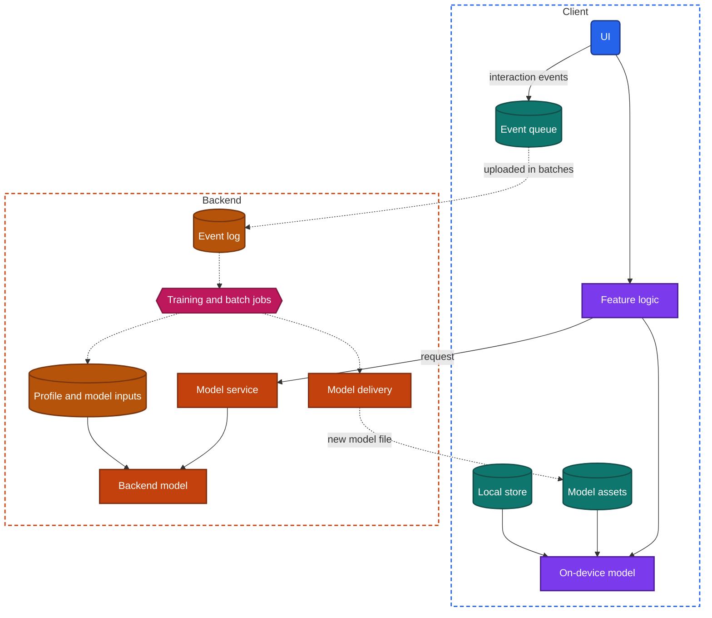
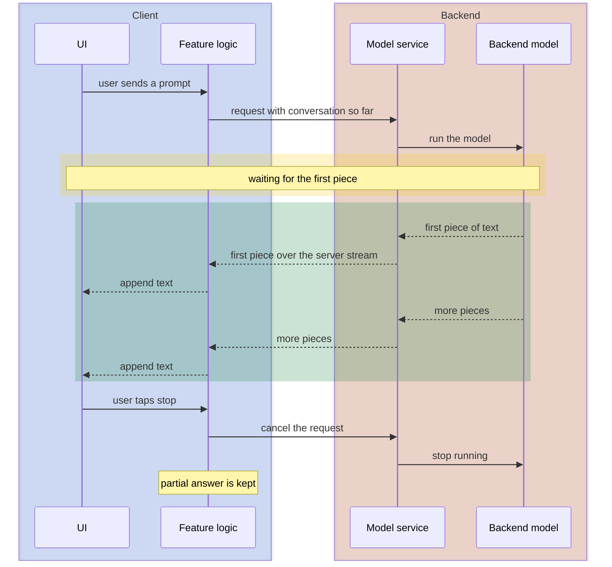

import Probe from '../../../components/Probe.astro';
import Signals from '../../../components/Signals.astro';
import TeardownBar from '../../../components/TeardownBar.astro';
import WorksheetForm from '../../../components/WorksheetForm.astro';

> **The question.** What does this app learn about you, and does the model run on the device or on the backend?

## 29.1 Why this concern exists

A model is a function whose behavior was learned from data instead of written by hand. Apps use models to order a feed, propose the next word, find the photos that contain a dog, turn speech into text and answer questions in prose. Each of these has to run somewhere, and each needs something to run on: the user's history, the content in front of it, or both.

Four of the seven constraints ([Chapter 2](/part-1-method/2-the-mobile-constraint-set/)) pull the placement in different directions.

**Human attention.** A proposed next word is useful only if it appears before the next keystroke. A network round trip is too slow for that, which pushes the model onto the device.

**Limited resources.** A capable model is large and expensive to run. On a phone it costs storage, memory, battery and heat. That pushes the model onto the backend, where the team pays for the compute instead.

**Unreliable network.** A model on the backend stops working when the connection does. A model on the device does not.

**Slow release.** A model shipped inside the app package can be improved only with an app update, and old versions keep the old model for years. A model on the backend improves for everyone at once.

A fifth pressure is not on the list and still shapes the design: privacy. A model that runs on the device can read data that never leaves it. A model on the backend can read only what the client sends, and everything it reads has been collected. The placement of the model is therefore also a statement about what the backend knows, which ties this chapter to [Chapter 22, Privacy, permissions and consent](/part-2-concerns/22-privacy-permissions-and-consent/).

This concern is harder to read from outside than most. You can observe where a model runs with good confidence. You can observe how fast the app adapts. You can almost never observe which model it is, what it was trained on or which of your actions it weighs. Section 29.11 lists those limits, and this chapter uses Speculative more often than any other.

One note on words. This book uses inference for a design claim drawn from signals. To avoid a clash, this chapter says "running the model" for what machine learning texts call by the same word, and says "model inputs" for the values a model reads.

## 29.2 The design space

A model can run in three places.

**Backend model.** The client sends a request and the backend runs the model. This is how ranked feeds, recommendations, large language models and heavy media analysis work. The model can be as large as the team can afford. It can read the behavior of every user, which a recommendation model needs. It can be replaced at any moment. It costs the team money for every request, it adds a round trip, it fails offline, and the model's inputs must be sent to the backend.

**On-device model.** The model's file is on the device and the device's processor runs it. This is how text prediction, speech to text, recognition of content in photos, document scanning and camera effects usually work. It responds in milliseconds, works with no network, costs the team nothing per use and keeps its inputs on the device. It costs the user storage and battery. The model must be small, its quality varies with the hardware, and updating it means delivering a new file to every device.

**Split.** Both run, and the work is divided. There are three common divisions.

- **Quick first, better later.** The on-device model answers at once and the backend model replaces or refines the answer when it arrives. Speech to text that revises its words after a moment, and search that reorders after a pause, are examples.
- **Device prepares, backend decides.** The device turns raw input into something small, such as detected text, a cropped region or a numeric representation, and the backend does the heavy step. This saves upload size and keeps the raw input on the device.
- **Backend retrieves, device reorders.** The backend sends a few hundred candidates and a small on-device model orders them using what the user did in the last few seconds. This gives reactions faster than any round trip.

| Property | Backend model | On-device model | Split |
|---|---|---|---|
| Response time | One round trip or more | Milliseconds | Fast first answer, slower final one |
| Works offline | No | Yes | Reduced |
| Cost to the team per use | Compute on every request | None | Reduced |
| Cost to the user | Mobile data | Storage, battery, heat | Both, in smaller amounts |
| What leaves the device | The inputs | Nothing, unless separately collected | A reduced form of the inputs |
| Model size limit | The team's budget | Device memory and storage | Small on the device, large behind it |
| Quality across devices | Uniform | Varies with hardware | Varies in the first answer only |
| Time to improve the model | Immediate | A download to every device | Mixed |
| Can learn from all users | Yes | Only through what is collected | Yes, on the backend side |

**Placement belongs to a feature, not to an app.** One app commonly has an on-device model that proposes replies, a backend model that ranks its feed and a split design for voice input. Record each smart feature separately.

## 29.3 Anatomy

Figure 29.1 shows a split design with every component present. A pure backend design has no model on the client. A pure on-device design has no backend model, and may have no event collection either.



*Figure 29.1. The components of a split design. Solid lines are the path of one request. Dotted lines are the slower loop by which behavior changes the model and its inputs.*

The figure contains two loops, and they run at very different speeds.

The **request path** is the solid lines. The UI asks for a result, a model produces it, and the result is drawn. It takes milliseconds on the device or a round trip to the backend. Probes that use airplane mode and a stopwatch read this path.

The **learning loop** is the dotted lines. The client records what the user did, uploads those events, and backend jobs turn them into two things: updated model inputs for this user, and from time to time a newly trained model. The first changes what you see. The second changes how well the feature works for everyone. Probes that use time and a second account read this loop.

A model and its inputs are different things, and the distinction carries most of this chapter. When a feed adapts to you within a minute, no model was retrained. The same model was run again with newer inputs about you. Retraining happens on a schedule of hours to weeks and cannot be seen from outside.

## 29.4 What the app learns

A personalized feature reads some record of you. The record has three possible sources.

**What you stated.** Interests chosen during sign-up, accounts followed, ratings, a language setting, items marked "not interested". These are explicit, few and reliable. They are also the only inputs you can enumerate with certainty, because you provided them.

**What you did.** Items opened, time spent on each, searches, purchases, items scrolled past without stopping. These are implicit, numerous and noisy. A client records them as interaction events and uploads them in batches ([Chapter 34, Observability](/part-2-concerns/34-observability/)). How finely the client measures your behavior is not visible. That a surface reacts to dwell time, and not only to taps, can be tested: linger on items of one topic without tapping anything and see whether the surface shifts.

**Your context.** Location, time of day, language, device type, network. These need no history and apply to a brand-new account.

The record is kept in one of two places. A **backend profile** is stored against the account, follows you to a second device and survives a reinstall. A **device profile** is kept in the local store, starts empty on every new device and is lost on reinstall unless a device backup restores it. A keyboard's learned words and a photo library's recognized faces are usually device profiles. A feed's taste profile is almost always a backend profile. A second device signed in to the same account separates the two in one step.

## 29.5 The new account

A model that ranks by history has nothing to rank with on the first visit. What a brand-new account sees shows how the team filled that gap.

| What a new account sees | Design |
|---|---|
| The same content as every other new account in the region | A default ranking by popularity or editorial choice |
| A screen asking for interests, then content that matches them | Stated interests used as the initial profile |
| Content that fits you although you stated nothing | Context, an imported contact list, or data from before sign-up |
| Rapid, visible shifts over the first minutes of use | A design that weights the newest events heavily while history is short |

The third row deserves care. A new account that seems tailored before you have done anything is using something. Context such as language and location is the plain explanation. An address book the app was allowed to read is another. Activity recorded before sign-up on the same device, or identifiers shared with other apps, is a third ([Chapter 27, Ads, attribution and growth](/part-2-concerns/27-ads-attribution-and-growth/)). From outside these are hard to separate, and any claim about which one is in use is Speculative unless you can remove one, for example by refusing a permission and repeating the comparison.

The comparison between a new account and an old one is the baseline for everything else in the chapter. If the two see the same thing, the surface is not personalized and the remaining probes on it have nothing to measure.

## 29.6 How quickly behavior feeds back

Interact heavily with one topic, then ask how long it takes for the surface to show it. The answer places the learning loop on a scale with three marks.

**Within the same visit, without a request.** The items further down the list you are already scrolling change to fit what you just did. No refresh was made. Either the client reorders items it already holds, using a small on-device model or a simple rule, or the next page was requested with your recent actions attached. A change that still happens in airplane mode, among items already loaded, is the on-device case.

**On the next refresh.** A refresh a few seconds later already reflects the last few minutes. The backend ingests events as a stream and updates this user's model inputs continuously, or the client sends the recent actions along with the refresh request. Both mean the backend model reads fresh inputs on every request. This is the costly design: it needs events delivered promptly, not in a batch an hour later, and a store of per-user inputs that is written and read at high rate.

**The next day.** Nothing changes during the visit, and tomorrow the surface has shifted. A scheduled job computes each user's profile or even each user's recommendations in bulk, and the app serves the stored result until the next run. This is far cheaper and is adequate for surfaces such as a weekly digest or a "because you bought" row.

| Feedback delay | Where the adaptation happens | Backend this implies |
|---|---|---|
| Seconds, with no refresh | On the device, or by actions attached to the next page request | Candidates sent in larger sets than shown |
| Seconds to minutes, on refresh | Backend model inputs updated from a stream of events | Prompt event upload, stream processing, a fast per-user input store |
| Hours to a day | Batch computation of profiles or results | Scheduled jobs and a store of results computed in advance |
| None seen | Not personalized on this input, or the loop is longer than your test | Nothing can be concluded |

Many apps combine the marks. A feed can use a batch-computed long-term profile and add a short-term profile from the current visit. The probe then shows a fast, modest shift that fades when you stop, and a slower, lasting one a day later.

Two cautions apply. Ranking stability ([Chapter 15](/part-2-concerns/15-lists-feeds-and-pagination/)) confounds the test: a feed that reorders on every refresh will look different whether or not it learned anything. Refresh twice before you start, to learn how much the surface changes without any new behavior. And experiments ([Chapter 30, Remote config and experiments](/part-2-concerns/30-remote-config-and-experiments/)) can change a surface overnight for reasons that have nothing to do with you.

## 29.7 Models as downloadable assets

A model for the device is a file, often tens or hundreds of megabytes and sometimes several gigabytes. There are four ways to get it there.

**In the app package.** The model ships with the app. It works from the first launch with no network. It enlarges the download for every user, including those who never use the feature, and it changes only with an app update.

**Downloaded after install.** The client fetches the model as an asset, on first use of the feature or in the background after sign-in. The app's download stays small, and only users of the feature pay for the model. The feature shows a "preparing" or "downloading" state on first use, and the app's storage grows by the model's size. The download is a large file transfer, with everything that implies ([Chapter 18, File transfer: uploads and downloads](/part-2-concerns/18-file-transfer-uploads-and-downloads/)): it usually waits for an unmetered network, and it should resume after an interruption.

**Supplied by the operating system.** The platform offers models for common tasks such as speech to text, text recognition and translation, and the app calls them as platform services. The app's own storage does not grow and the feature works offline. The operating system may fetch the model itself, per language, the first time any app needs it.

**Not delivered.** The model stays on the backend.

Delivering the model as an asset is what frees it from slow release. The client asks the backend which model version it should hold, compares that with the version it has and downloads the difference. The answer can depend on the device: a recent, powerful phone receives a larger model, and an older one a smaller model or an instruction to use the backend. That choice is commonly driven by remote config, and it is one reason the same app version behaves differently on two phones.

```text
function ensureModel(feature):
  wanted = remoteConfig.modelFor(feature, deviceClass())   // may be "use backend"
  if wanted is UseBackend: return BackendOnly
  held = modelAssets.versionOf(feature)
  if held == wanted.version: return Ready(held)
  if not network.isUnmetered and wanted.size > meteredLimit:
    return Ready(held) if held exists, else NotYetAvailable   // old model keeps working
  download(wanted, resumable = true)
  verify(wanted.checksum)              // a corrupt model fails in confusing ways
  modelAssets.swap(feature, wanted)    // atomic, so a kill mid-swap leaves the old one
  return Ready(wanted.version)
```

From outside, the signs of this design are a storage increase that follows enabling a feature, a feature that is unavailable for a short time after a fresh install, and a feature whose quality changes while the app version does not. The last is weak evidence alone, because a backend model would produce the same sign. Combined with a feature that works in airplane mode, it becomes good evidence of an updated on-device model.

## 29.8 On-device features that work with no network

Three families of feature are the usual residents of the device. Each has a characteristic shape.

**Text prediction.** Proposed next words, corrections and short reply suggestions. The model must answer within a keystroke, so it is small and local. It often keeps a device profile of the words you use. Suggested replies to a message are the interesting case: they can be computed on the device from the message text, or on the backend when the message is delivered and sent along with it. Receive a message, go to airplane mode before opening the conversation, and see whether suggestions appear. If they do, they were computed on the device or arrived with the message, and those two cannot be told apart by that step alone.

**Recognizing content in photos.** Searching a photo library for "beach", grouping photos by the people in them, or reading text from a picture. Running a model over thousands of photos is heavy, so it is done as background work, usually while the device is charging and idle ([Chapter 23, Background work and notifications](/part-2-concerns/23-background-work-and-notifications/)). The signature is a delay: a new photo is not findable by its content for hours, and a new device takes days to finish its library. If the same search works at once on a second device, the analysis ran on the backend and the results are synced. If each device builds its own results slowly, the analysis runs on each device.

**Speech to text.** Dictation and voice commands. A model on the device produces text with no network, sometimes with lower accuracy or fewer languages than the backend version. A split design shows text at once and revises it.

All three cost battery and heat, and well-behaved apps ration them. Recognition that pauses in low-power mode, or runs only on a charger, shows the app treating the model as a resource budget item ([Chapter 35, Performance and resource budgets](/part-2-concerns/35-performance-and-resource-budgets/)).

## 29.9 Assistants that stream from a backend model

An assistant that answers in prose usually runs on a large model on the backend. Its response is produced one small piece at a time, and a long answer takes many seconds to complete. Holding the response until it is complete would mean a long blank wait, so the backend sends each piece as it is produced over a server stream ([Chapter 14](/part-2-concerns/14-real-time-delivery/)), and the UI appends it.



*Figure 29.2. A streamed response from a backend model, stopped by the user before it completes.*

Several observable facts follow from this shape.

- **Two delays, not one.** The time to the first piece and the rate of pieces afterwards are separate. The first reflects queueing and model startup on the backend. The second reflects the model's speed. Time both.
- **A stop control.** Stopping cancels the request, which matters to the team because every piece costs compute. Whether the partial answer is saved shows where the conversation is stored.
- **Interruption behavior.** Turn on airplane mode mid-answer. A client that keeps the partial text and offers to retry has treated the stream as resumable in the UI. One that discards the answer held it only in screen state. If the complete answer appears after you reconnect, the backend finished the response without the client and stored it.
- **Conversation storage.** A conversation that appears on a second device is stored on the backend. The model itself holds no memory between requests. The client or the backend sends the earlier turns with each new prompt.
- **Remembering across conversations.** If the assistant recalls a fact from a different conversation, the backend keeps a per-account record and adds it to the model's inputs. That is a backend profile in the sense of Section 29.4, and it should have a control and a consent path.

Text that appears progressively is not proof of a stream. A client can receive a whole response and reveal it with an animation. The discriminating probe is the weak connection: a real stream stalls and resumes unevenly with the network, and an animation runs smoothly once it starts.

A small model on the device can serve an assistant for narrow tasks such as summarizing a short text or rewriting a sentence. An assistant that answers simple requests in airplane mode and refuses complex ones is routing between an on-device model and a backend model. The complete worked example is [Chapter 50, AI assistants](/part-3-archetypes/50-ai-assistants/).

## 29.10 Personalization and consent

Personalization is collection plus use. Both are subject to the user's choices, and the way an app honors those choices exposes its design.

Look for three kinds of control: a switch for personalized content or recommendations, a way to view or clear history, and a statement of whether your content is used to improve models. The rules and prompts themselves are the subject of [Chapter 22, Privacy, permissions and consent](/part-2-concerns/22-privacy-permissions-and-consent/). What matters here is what each control does when used.

- **A switch that changes the surface on the next refresh.** The backend checks the setting at request time and falls back to the default ranking. The profile may still exist. You have observed that use stopped, not that collection stopped.
- **A switch with no visible effect.** Either the surface was not personalized, or the setting governs something you cannot see, such as whether your events are used for training. Compare with a new account before concluding anything.
- **Clearing history resets the surface to the new-account state.** The profile was derived from that history and is recomputed without it. If the reset is immediate, the profile is computed at request time or invalidated on the spot. If it takes a day, it waits for a batch job.
- **A refused permission removes one input.** Refuse location and repeat the new-account comparison. If the surface becomes less local, location was an input. This is one of the few ways to identify a specific input from outside.

On-device models change this picture. A feature whose model and inputs both stay on the device can personalize without the backend learning anything, and teams choose that placement for sensitive inputs such as typed text, photos and health data. You can observe that such a feature works in airplane mode. You cannot observe from that alone that nothing is uploaded later. A device profile that does not follow you to a second device is supporting evidence, not proof.

Some systems improve a shared model from data that stays on devices, by training locally and uploading only a summary of what was learned, combined across many users. Nothing a user can see distinguishes this from ordinary on-device use. Any claim that an app does it is Speculative unless its maker has published it.

## 29.11 What the outside view can and cannot tell you

| Question | From outside |
|---|---|
| Does the model run on the device or on the backend | Observed, by airplane mode |
| Is there a split | Inferred, from a fast answer that is later revised, or reduced quality offline |
| Is the model a downloaded asset | Inferred, from storage growth and a preparing state |
| Is the surface personalized at all | Inferred, from a comparison of two accounts |
| How fast behavior feeds back | Observed, as a delay. The mechanism behind it is Inferred |
| Is the profile on the backend or the device | Inferred, from a second device |
| Which specific actions are used as inputs | Speculative, except for an input you can remove |
| Which model, of what size, trained on what | Speculative |
| Whether your data is used to train models | Not observable. Only the app's published statements say |
| Whether the app's own model or a third party's is used | Speculative |
| Whether a difference between accounts is personalization or an experiment | Speculative on one comparison, Inferred after many |

Record a claim from the lower half of this table as an open question, with the candidate designs and what would settle it.

## 29.12 Probes

Start with P29.1 on every smart feature. It takes seconds and settles where the model runs. Run P29.4 before P29.5, because a surface that is not personalized has no feedback delay to measure. Select the outcome you saw in each probe, and it is recorded in your worksheet for the teardown chosen here.

<TeardownBar />

### P29.1 Smart feature in airplane mode

<Probe id="P29.1" />

### P29.2 Response time online and offline

<Probe id="P29.2" />

### P29.3 Storage after enabling a feature

<Probe id="P29.3" />

### P29.4 New account against old

<Probe id="P29.4" />

### P29.5 Feedback delay

<Probe id="P29.5" />

### P29.6 Assistant response shape

<Probe id="P29.6" />

### P29.7 Personalization switch

<Probe id="P29.7" />

### P29.8 Second device

<Probe id="P29.8" />

### P29.9 First use after a fresh install

<Probe id="P29.9" />

## 29.13 Signal-to-design table

<Signals chapter={29} />

## 29.14 The backend this implies

Once you have placed a feature, the following can be Inferred.

- **Backend model.** A model service behind the gateway, with capacity planned per request, since each one costs compute. Rate limits or usage caps per account are the visible edge of that cost. A store of per-user model inputs that the service reads on each request.
- **Feedback on refresh.** Event collection that delivers within seconds, stream processing that updates per-user inputs, and a store that takes writes and reads at high rate. The client must upload events promptly instead of holding them for a convenient moment.
- **Feedback the next day.** An event log, scheduled jobs and a store of results computed ahead of time. The serving path can be very simple, because it only looks results up.
- **On-device model delivered as an asset.** A model registry with versions, a rule that maps device classes to model versions, and media delivery for large files. Remote config to choose the version and to turn the feature off on devices where it performs badly.
- **On-device model with a device profile.** Possibly nothing. A feature that is fully local needs no backend at all, and that absence is the design.
- **Split.** Both of the above, plus an agreed format for whatever the device sends in place of the raw input.
- **Streaming assistant.** A model service that holds a server stream open for the length of a response, storage for conversations, cancellation that reaches the model, and content checks on both the prompt and the response. A per-account record if the assistant remembers across conversations.
- **Consent controls.** A setting checked at request time, a way to delete or exclude a user's history from profiles, and for training, a way to exclude a user's events from future jobs.

Any backend model also implies training infrastructure: stored events, jobs that produce new models and a way to compare a new model against the current one on real users. The last is an experiment system, and it is why two accounts can differ for reasons that are not personal.

## 29.15 Failure modes and what they reveal

- **A feature shows "preparing" for a long time, or forever.** The model asset has not downloaded. The transfer is waiting for an unmetered network, has no room, or does not resume after interruption.
- **A feature works on one phone and is missing on another with the same app version.** The feature or its model is chosen by device class, through remote config.
- **A feature stops working after the device ran low on storage.** The model asset was deleted as if it were a cache and must be fetched again.
- **The device grows warm and the battery drops after a large import.** On-device analysis is running over the new content without waiting for a charger.
- **Recommendations repeat an item you already bought or dismissed.** The profile is computed in batch and has not seen the event yet, or dismissals are not an input.
- **One accidental tap reshapes the whole surface.** Recent events are weighted heavily and there is little long-term profile to balance them.
- **A new device shows a generic surface for an account with years of history.** The profile lives on the device, or the backend profile is keyed to something other than the account.
- **An assistant's answer disappears when the connection drops mid-response.** The partial response was held only in screen state.
- **An assistant's answer stops mid-sentence and never completes.** The stream ended and the client has no way to resume or retry it.
- **Personalization continues after the switch was turned off.** The setting is not checked at request time, or a cached surface is still being served ([Chapter 11](/part-2-concerns/11-local-storage-caching-and-prefetching/)).

## 29.16 Worksheet entries

These are the fields this chapter adds to the teardown worksheet. Probe outcomes fill some of them in. Complete one set per smart feature.

<TeardownBar />

<WorksheetForm chapters={[29]} />

## 29.17 Summary

- A model runs on the backend, on the device or split between them. The choice trades response time, offline use, cost, battery and privacy. Record it per feature.
- Airplane mode shows where the model runs. A feature that works unchanged has an on-device model, one that fails has a backend model, and one that works with reduced quality is split.
- A model and its inputs are different. Fast adaptation means fresher inputs to the same model, not a retrained model.
- A new account compared with an old one shows whether a surface is personalized and what the default ranking is. Run that comparison before measuring anything else.
- The delay between behavior and its effect separates on-device reordering, model inputs updated from a stream of events, and batch computation.
- On-device models are often downloaded as assets and updated without an app release. Storage growth, a preparing state and behavior that differs by device are the signs.
- A streamed assistant response has two delays, a stop control and a visible reaction to a dropped connection, and each exposes part of the design.
- Which model is used, what it was trained on, which actions it weighs and whether your data trains it cannot be told from outside. Record those as Speculative or as open questions.
