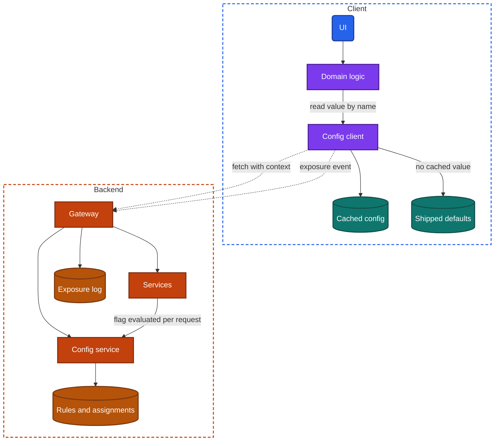
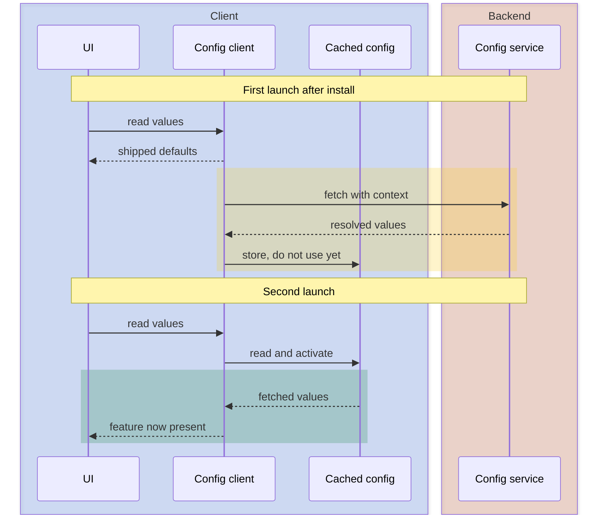
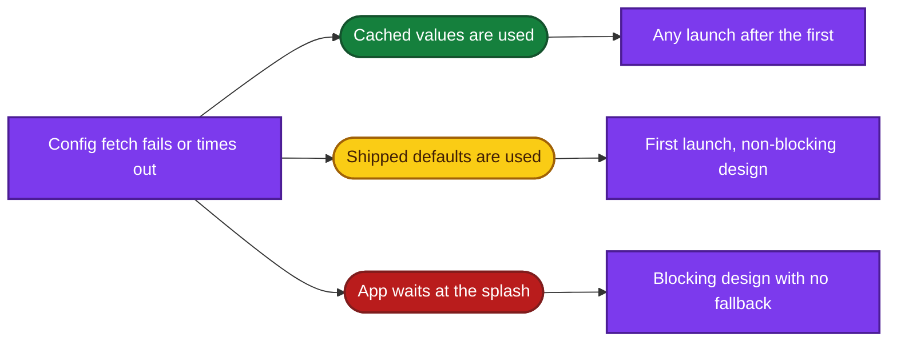

import Probe from '../../../components/Probe.astro';
import Signals from '../../../components/Signals.astro';
import TeardownBar from '../../../components/TeardownBar.astro';
import WorksheetForm from '../../../components/WorksheetForm.astro';

> **The question.** How does this app change its behavior without a new release, who gets each change, and when does it take effect?

## 30.1 Why this concern exists

A shipped version is frozen. Its code cannot be recalled, and a replacement takes days to reach most users and years to reach all of them. That is the slow release constraint of [Chapter 2](/part-1-method/2-the-mobile-constraint-set/), and remote config is the cheapest answer to it. The team ships code that asks a question at run time, and keeps the answer on the backend.

Three other constraints shape how the answer travels.

- **Unreliable network.** The answer may not arrive. Every value the app asks for needs a fallback that is safe to run with, and the app needs a rule for how long it waits.
- **Human attention.** The answer is often needed before the first screen can be drawn. Waiting for it costs launch time. Applying it late makes the screen change under the user's eyes.
- **Untrusted client.** A value on the device can be read and changed by its owner. A switch that only hides a button protects nothing. Anything that matters is enforced again on the backend.

This chapter is about **values and switches**. A value tunes code that is already in the app. A switch chooses between paths that are already in the app. Two neighboring chapters cover other ways an app changes after it ships. [Chapter 31](/part-2-concerns/31-server-driven-ui/) covers layout that the backend describes. [Chapter 33](/part-2-concerns/33-releases-and-compatibility/) covers new versions. Section 30.8 shows how to tell the three apart.

One limit applies throughout. You cannot see a config value. You see the behavior it selects, and only when two observations differ: two moments, two accounts or two devices. Every probe in this chapter is a comparison.

## 30.2 The design space

### What config carries

Remote config carries five kinds of thing. They use the same delivery path, and they differ in who receives which value and why.

| Kind | What it is | Who gets which value | How long it lives |
|---|---|---|---|
| Tuning value | A number, text or list that code reads, such as a timeout, a page size or a banner text | Everyone, or a targeted group | Indefinitely |
| Feature flag | A switch that turns a feature on or off for a set of users | A targeted group | Until the feature is fully released, then removed |
| Staged rollout | A feature flag whose set of users is a percentage that the team raises step by step | A growing random share | Days to weeks |
| Kill switch | A feature flag kept for emergencies, which turns a feature off for everyone | Everyone | For the life of the feature |
| Experiment | A set of variants assigned at random, with measurement of what each group does | Random groups of fixed size | Weeks, then one variant wins |

### Where the decision is made

The same switch can be evaluated in three places.

**On the backend, per request.** The client never learns that a flag exists. It sends an ordinary request, and a service consults the flag and returns a different response. This works for every app version, takes effect on the next request, and cannot be read from the device. It only reaches behavior that the response controls.

**On the config service, delivered as resolved values.** The client sends its context: account, app version, device, region. The config service applies the rules and returns a flat set of names and values for that client. The client stores them and reads them by name. The rules stay private, and the client is simple. A change in context, such as a sign-in, needs a new fetch.

**On the client, from delivered rules.** The client downloads the rules themselves and evaluates them locally. It can re-evaluate at once when the context changes, with no round trip. The rules are on the device, where they can be read, and every client version carries its own copy of the evaluation logic.

From outside, the first design is separable from the other two. A flag evaluated per request takes effect when a screen is fetched again, with no relaunch, and never applies offline to a screen that was not cached. The second and third designs look the same in almost every probe, and a claim about which one an app uses is Speculative.

### When config is fetched and applied

[Chapter 7](/part-2-concerns/7-launch-and-startup/) introduces three designs at startup. They are the central choice of this chapter, because the choice decides what the user sees when config changes.

**Fetch, then start.** The app holds its splash until the config service has answered, usually with a timeout. Every session runs on current values, and a value never changes during a session. The cost is launch time that follows network speed, and a decision about what to do when the timeout passes.

**Cached, applied on the next launch.** The app starts with the values it stored last time. It fetches new values in the background and stores them without using them. The next cold start reads them. Launch is fast and a session is consistent from start to end. The cost is delay. A change reaches a user one launch late, and a user who never force-quits may run on old values for days. A kill switch delivered this way is slow.

**Applied live.** The app starts with stored values and switches to new ones as soon as they arrive, or receives changes over a persistent connection or a push hint ([Chapter 14](/part-2-concerns/14-real-time-delivery/)). A change reaches the user in seconds. The cost is a session that can change in the middle: a control moves, a section vanishes, a flow the user is halfway through takes another path.

| Design | Launch waits on network | Change reaches a running app | Change reaches the next launch | Consistent within a session | Visible signature |
|---|---|---|---|---|---|
| Fetch, then start | Yes, up to a timeout | No | Yes | Yes | Splash length follows network speed. First launch already has every feature |
| Cached, applied on the next launch | No | No | One launch late | Yes | A feature appears on the second launch after install, or two launches after a change |
| Applied live | No | Yes | Yes | No | Something appears, moves or vanishes while you watch |
| Evaluated on the backend per request | No | On the next fetch of the screen | Yes | Per screen load | A screen differs after a refresh, with no relaunch |

**Designs belong to values, not to apps.** A careful team mixes them. A kill switch is applied live, because its purpose is speed. An experiment that changes a checkout flow is applied at the next launch, because changing it under a user corrupts both the experience and the measurement. Record the design for each change you observe.

## 30.3 Anatomy

Figure 30.1 shows the parts. The client holds three layers of values: the defaults shipped inside the app, the values it last fetched, and, in some designs, values fetched and not yet in use.



*Figure 30.1. The components of remote config. The config client answers from the cached config, and falls back to the shipped defaults.*

Two properties of the figure matter for a teardown.

First, a read never touches the network. Domain logic asks the config client for a value by name and gets an answer at once, from the cached config or from the shipped defaults. The network only refills the cache. This is why an app with remote config can still open in airplane mode, and why what it shows there is evidence.

Second, config reaches the app by two routes. The config client fetches values that the client reads. Services consult the same config service while they build responses. A change you observe came by one of the two, and the timing of its arrival tells you which.

```text
function getValue(name):
  if active.has(name): return active[name]     // last activated fetch
  return shippedDefaults[name]                 // always present, never fails

function onColdStart():
  active = cachedConfig.readActivated()        // local read, no network
  fetchInBackground()

function onFetched(values):
  cachedConfig.storeFetched(values)
  match applyPolicy:
    NextLaunch: return                         // activated at the next cold start
    Live:
      active = values
      notifyObservers()                        // screens redraw
```



*Figure 30.2. Config that is cached and applied on the next launch. The first launch runs on shipped defaults, and the second runs on what the first one fetched.*

The yellow phase in Figure 30.2 is the delay you look for. Under the live design, the same fetch ends with the UI redrawing in the first launch. Under the blocking design, the fetch sits before the first read and the UI waits for it.

## 30.4 Feature flags, staged rollouts and kill switches

A feature flag separates two events that used to be one: shipping code and releasing a feature. The code ships inside a version, turned off. Weeks later, when most users have that version, the team turns the flag on. Nothing is downloaded at that moment. The feature was already on the device.

This has a consequence you can test. A flag can only turn on code that a version contains. If a feature appears with no update, on a version you installed weeks ago, the code was shipped dark and a flag released it. If the same feature never appears on an older version, however long you wait, that version does not contain the code.

**A staged rollout** raises the share of users who have the flag on: one percent, five, twenty, fifty, all. At each step the team watches crash rates and key measures ([Chapter 34](/part-2-concerns/34-observability/)) before going further. From outside, a staged rollout looks like a feature that some of your accounts or devices have and others lack, at the same version, for some days, after which everyone has it. Do not confuse this with the staged rollout of a version by the store, which [Chapter 33](/part-2-concerns/33-releases-and-compatibility/) covers. One stages a binary. The other stages a switch inside binaries that are already installed.

**A kill switch** is a flag the team hopes never to use. It exists because a release cannot be recalled. When a feature misbehaves, the team turns it off for everyone, and the app falls back to a designed absence: the entry point disappears, or the feature shows a message that it is unavailable. The maintenance screen of [Chapter 7](/part-2-concerns/7-launch-and-startup/) is the largest kill switch, for the whole app. A kill switch is only as fast as the apply design behind it. Applied live, it works in seconds. Applied at the next launch, it does not reach a process that stays alive.

**Flags leave debt.** Every flag is a branch, and every pair of flags is four combinations that somebody must have tested. Teams remove flags once a feature is fully released, and some never get around to it. You cannot see the debt directly. An app in which the same account shows slightly different combinations of features on each device is one visible form of it.

## 30.5 Experiments

An experiment assigns users at random to variants, shows each variant a different behavior, and compares what the groups do. Three design choices define it, and two of them are observable.

### The unit of assignment

The unit is the thing that is randomized.

- **By account.** The assignment follows the user. Every device signed in to the account shows the same variant, and a reinstall changes nothing. This is the usual choice for anything a user would notice differing between their phone and their tablet. It cannot cover screens shown before sign-in.
- **By device or installation.** The app generates an identifier at first launch and the assignment follows it. This works before sign-in, which makes it the only choice for onboarding and sign-up experiments. Two devices of one user may differ, and a reinstall draws again.
- **Anonymous first, account after.** The app uses the installation identifier until sign-in, then switches to the account. A careful design carries the earlier assignment across, so that a user does not see onboarding in one variant and the app in another.

### Staying in the same group

A user must see the same variant every time, or the measurement means nothing and the experience is erratic. Most systems do not store assignments at all. They compute them.

```text
function variantFor(experiment, unitId):
  // Deterministic. The same unit always lands in the same bucket.
  bucket = hash(experiment.key + ":" + unitId) mod 10000
  if bucket >= experiment.trafficShare: return NotInExperiment
  return experiment.variants[bucket mod experiment.variants.count]
```

The experiment's key is part of the hash, so that the users who landed in one experiment's first group are spread evenly across the next experiment's groups. Because the function is deterministic, any component that knows the unit and the experiment computes the same answer, on the backend or on the device, with nothing stored.

Stickiness has an edge. If the team raises an experiment's traffic share or changes its variants, a careless design moves some users to another variant. You may see this as a feature that flips once and stays flipped.

### Exposure

A user is assigned whether or not they ever reach the screen under test. Counting all assigned users dilutes the result with people who saw nothing different. So the client records an **exposure**: an event sent at the moment the user actually encounters the place where the variants differ. Only exposed users are compared.

Exposure is invisible from outside. It matters to a teardown for one reason. It means the experiment's variant is often read lazily, when the screen opens, and not at startup. A difference between two accounts may therefore sit on a screen deep in the app while the home screens match.

### What you can and cannot learn

You can observe that two accounts differ at the same version, platform and region. You can observe that the difference is stable. You cannot see group sizes, what is measured, or which variant is the control. And one pair of accounts that match tells you nothing: with a ten percent experiment, two random accounts both fall outside it four times in five.

## 30.6 Targeting

A rule decides who gets a value. Rules combine conditions on the context the client sends.

| Condition | Typical use | What you may observe |
|---|---|---|
| App version | Turn a feature on only where the code exists and works. Turn it off for a version with a known defect | A feature present on one of your devices and absent on another that runs an older version |
| Platform and device class | Hold back a heavy feature on devices with little memory ([Chapter 36](/part-2-concerns/36-constrained-devices-and-networks/)) | An old phone and a new one differ at the same version |
| Region or language | Legal limits, market launches, payment methods ([Chapter 37](/part-2-concerns/37-accessibility-and-global-reach/)) | A section that exists for an account in one region and not in another |
| Account attributes | Plan, age of account, staff accounts, opted-in testers | A new account and an old one differ. A setting labeled as early access exists |
| Random share | Staged rollouts and experiments | A difference between two accounts that nothing else explains |

Targeting is the main confound in this chapter. Before you read a difference between two accounts as an experiment, rule out every other row of the table: same version, same platform, same device class, same region, same plan. What is left is random assignment, and the claim is Inferred. If you could not equalize a condition, the claim is Speculative.

## 30.7 Config as a failure point

Remote config is a dependency of every feature that reads it. A team that adds it to gain safety can lose safety in three ways.

**The fetch fails.** Figure 30.3 shows the three outcomes. A sound design never lets a failed fetch stop the app. The first launch after install is the hard case, because nothing is cached. The app either runs on shipped defaults or waits.



*Figure 30.3. Three visible outcomes when the config fetch fails.*

**The defaults are wrong.** A shipped default is frozen in the version, like all its code. The safe default for a new feature is off, and for a kill switch it is "feature allowed". A default that made sense at release can be wrong two years later, and an old version that cannot reach the config service runs on it anyway. A default is a decision about what the app does when it knows nothing.

**The config itself is wrong.** A config change reaches every user without review by the store and without a staged rollout of a binary. A malformed value, or a flag turned on for a version whose code crashes, can break the app for everyone at once, faster than any release could. A value that crashes the app at startup is the worst case, because the app must start in order to fetch the correction. Careful teams validate config before publishing it, roll config changes out in stages as they do code, and make the client discard a value it cannot parse. You cannot see those measures. You can sometimes see their absence, as an outage that affects every version at the same moment and ends without an update.

### Consistency across the devices of one account

One account on two devices can show two behaviors, for four different reasons.

| Cause | How to recognize it |
|---|---|
| The devices run different versions, and the rule targets a version | The difference goes away when both run the same version |
| The devices hold cached config of different ages | The difference goes away after each device has been launched twice online |
| The rule targets device class or platform | The difference is stable and follows the device, whichever account is signed in |
| The assignment is by device or installation | The difference is stable, follows the device, and may change after a reinstall |

Only when all four are ruled out, and the devices match, can you say the assignment follows the account. Probe P30.4 walks through them in order.

A team that wants a user's devices to agree assigns by account and applies changes at a defined moment. A team that does not think about it gets a phone and a tablet that disagree for a day after every change, and most users never notice.

## 30.8 Separating config from server-driven UI and from a release

Three mechanisms change an app after it ships. Each leaves a different mark.

| Question | Remote config | Server-driven UI | A new version |
|---|---|---|---|
| Did the version number change | No | No | Yes |
| What changes | A value, or which built-in path runs | Which known pieces a screen has, and their order | Anything, including new code |
| How many distinct forms exist | Few. Each one was built into the app | Many. Any arrangement of the known pieces | One per version |
| When it arrives | At a launch, or live | When the screen is fetched again | When the store installs it |
| On an old version | Absent if the code is missing | Present, drawn from pieces the old version knows | Absent |
| Varies between accounts | Often, by rule or at random | Often, by personalization | No |

Check the version number first. If it changed, the change may have come with the version, and nothing more can be said without a second device that did not update.

If the version did not change, look at what kind of thing changed. New behavior, such as a new gesture, a new flow or a new kind of screen, must have been in the app already, so a flag released it. A new arrangement of familiar pieces, changing often and differing with each refresh, points to [Chapter 31](/part-2-concerns/31-server-driven-ui/). A single switch between two arrangements, stable for weeks, fits both a flag that picks one of two built-in layouts and a backend that sends one of two section lists. From one observation the two cannot be separated, and the claim is Speculative.

The screen-shaped response of [Chapter 10](/part-2-concerns/10-api-shape/) overlaps as well. Text and eligibility that the backend sends as finished values change without an update and without any config on the device. That is the per-request evaluation of Section 30.2, seen from the API side.

## 30.9 Probes

P30.1 and P30.2 are passive and run over days, so start them first. P30.3 and P30.4 need a second account or a second device and give the most evidence. The last four each need a fresh install or a setting. The probe families are those of [Chapter 4](/part-1-method/4-probes/). Select the outcome you saw in each probe, and it is recorded in your worksheet for the teardown chosen here.

<TeardownBar />

### P30.1 Change without an update

<Probe id="P30.1" />

### P30.2 An announced feature you do not have

<Probe id="P30.2" />

### P30.3 Two accounts side by side

<Probe id="P30.3" />

### P30.4 Two devices of one account

<Probe id="P30.4" />

### P30.5 First against second launch

<Probe id="P30.5" />

### P30.6 First launch in airplane mode

<Probe id="P30.6" />

### P30.7 Reinstall and the variant

<Probe id="P30.7" />

### P30.8 Region setting

<Probe id="P30.8" />

## 30.10 Signal-to-design table

Each row follows the inference chain of [Chapter 5](/part-1-method/5-from-signal-to-inference/). A difference between two observations is the only signal this concern produces, so each row names what was compared.

<Signals chapter={30} />

## 30.11 The backend this implies

Once you have seen config at work, parts of the backend follow.

- **Any remote config.** A config service that answers by app version, platform, region and account, and a way for staff to change rules without a deployment. It sits on or near the launch path, so it must be fast and must fail well.
- **Fetch, then start.** A config endpoint with strict latency, since every launch waits on it. Teams often fold it into a single startup request with session and landing data ([Chapter 7](/part-2-concerns/7-launch-and-startup/)).
- **Applied live.** A way to tell running clients that config changed: a push hint, a message on a persistent connection, or a short polling interval ([Chapter 14](/part-2-concerns/14-real-time-delivery/)).
- **Staged rollouts and experiments.** A deterministic assignment function shared by every component that evaluates a flag, a stable identifier for each unit, and a record of exposures. Behind that sits an analysis pipeline that joins exposures to outcomes, which is far larger than the delivery path and wholly invisible to you.
- **Assignment by account.** The config service knows the account, so config is fetched again after sign-in. An app whose features shift a moment after you sign in shows that second fetch.
- **Assignment before sign-in.** An installation identifier generated on the device, and, in a careful design, a step that links it to the account at sign-in.
- **Per-request evaluation.** Services that call the config service, or hold a copy of its rules, while building responses. The request must carry enough context for the rules: version, platform, region.
- **Kill switches.** A flag checked on the backend as well as on the client. A switch that only hides a button leaves the endpoint open to any old or modified client ([Chapter 21](/part-2-concerns/21-security-and-trust/)).

A config service is a strong candidate for a third party. Many teams buy it. Whether an app's config is built in-house or bought leaves no trace a user can see, and any claim about it is Speculative.

## 30.12 Failure modes and what they reveal

- **A tab or section that appears on the second launch after install.** Config is cached and applied on the next launch. The first launch ran on shipped defaults.
- **A control that moves or vanishes while you are using it.** Config is applied live, with no protection for a session in progress.
- **Features that shift a moment after sign-in.** Config was fetched for an anonymous unit, then fetched again for the account.
- **A feature that you had yesterday and lack today, at the same version.** A staged rollout was rolled back, a kill switch was used, or a careless change to an experiment moved you to another variant.
- **A feature present on your phone and absent on your tablet, at the same version.** Assignment by device, or a rule that targets device class, or cached config of different ages. Section 30.7 separates them.
- **Onboarding in one style and the app in another.** An experiment assigned by installation before sign-in, with no carry-over to the account.
- **A button that is shown and fails with "not available".** The client's flag says on and the backend's says off. The flag is evaluated in two places, and the two are out of step.
- **A splash that hangs on a weak connection, on every launch.** A blocking config fetch with a long timeout or none.
- **Every version fails at the same moment, and recovers with no update.** A bad config value or a backend fault. If the app would not even start, the value was read at startup with no validation.
- **A years-old version that behaves oddly but runs.** It can no longer fetch config, or its values are no longer maintained, and it is running on shipped defaults.
- **A banner for an event that ended last week.** A tuning value with no end date, or a cached value on a device that has not fetched since.

## 30.13 Worksheet entries

These are the fields this chapter adds to the teardown worksheet of [Chapter 6](/part-1-method/6-the-teardown-worksheet/). Probe outcomes fill some of them in. Record one worksheet per observed change when changes behave differently.

<TeardownBar />

<WorksheetForm chapters={[30]} />

## 30.14 Summary

- Remote config answers slow release with values and switches. The code is already in the app, and the backend chooses which path runs.
- Config carries tuning values, feature flags, staged rollouts, kill switches and experiments over one delivery path.
- The apply design is the main observable choice: fetch then start, cached and applied on the next launch, applied live, or evaluated on the backend per request. The moment a change arrives separates them.
- A flag can only release code that a version contains. A feature that appears with no update was shipped dark.
- An experiment has a unit of assignment. Two devices of one account, and a reinstall, show whether the unit is the account or the installation.
- Rule out targeting by version, device, region and plan before you read a difference between two accounts as random assignment.
- Config is a failure point. Shipped defaults, a timeout and validation decide whether a failed fetch or a bad value stops the app. A first launch in airplane mode shows the defaults.
- Check the version number first. Then separate a switch between built-in forms, which is config, from a free arrangement of known pieces, which is server-driven UI.
