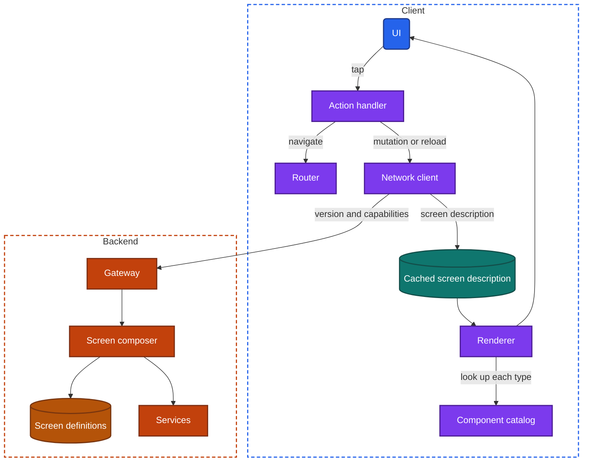
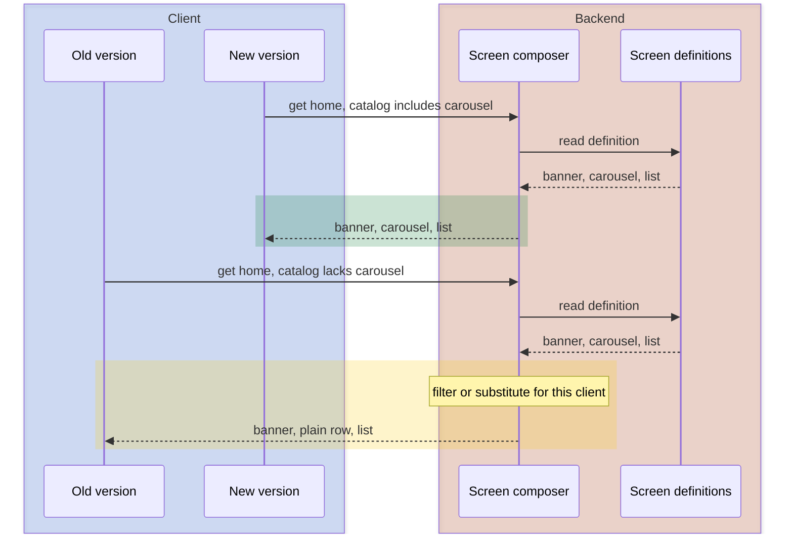
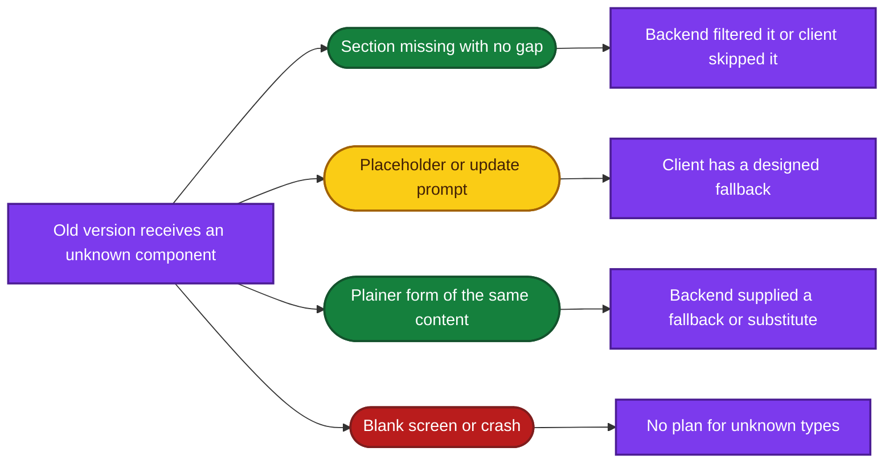

import Probe from '../../../components/Probe.astro';
import Signals from '../../../components/Signals.astro';
import TeardownBar from '../../../components/TeardownBar.astro';
import WorksheetForm from '../../../components/WorksheetForm.astro';

> **The question.** How much of this screen does the backend decide, and how can you tell?

## 31.1 Why this concern exists

A screen is a decision about what to show, in what order, and what each tap does. In the plainest design, that decision is compiled into the app. The backend supplies data, and the client pours it into a layout that was fixed on the day the version shipped.

Slow release ([Chapter 2](/part-1-method/2-the-mobile-constraint-set/)) makes that expensive. A marketplace wants a seasonal row on its home screen tomorrow. A team wants to reorder a checkout screen for one region. With a compiled layout, each change waits for a release, reaches users over weeks, and never reaches the versions that do not update. Server-driven UI moves the decision to the backend. The response describes the screen, and the client draws what it is told.

Three other constraints set the price.

- **Platform rules.** Stores review an app's code and restrict how an app may change its behavior afterwards. Describing a screen with data, drawn by code that was reviewed, stays within those rules. This is one reason the technique is built on a fixed set of components and not on downloaded code. [Chapter 33](/part-2-concerns/33-releases-and-compatibility/) covers the rules.
- **Unreliable network.** A layout that lives on the backend is a layout the app does not have when the network is gone. The app must cache it, ship a fallback, or show nothing.
- **Human attention.** A screen whose every interaction asks the backend what to draw next feels slow. The more the backend decides, the harder it is to keep a response immediate.

[Chapter 10](/part-2-concerns/10-api-shape/) introduces the screen-describing response as the far end of the API shape axis. This chapter starts there. It is about **layout decided by the backend**. It is separate from remote config, which switches between paths built into the app ([Chapter 30](/part-2-concerns/30-remote-config-and-experiments/)), and from releases, which change the app's code ([Chapter 33](/part-2-concerns/33-releases-and-compatibility/)). Section 31.8 shows how to tell the three apart.

## 31.2 The design space

The designs form five levels. Each gives the backend more of the screen. They are named here, not numbered, so that they are not confused with the offline levels of [Chapter 12](/part-2-concerns/12-offline-and-sync/).

**Fixed screen.** The app holds the layout. The backend sends data, and at most finished text and decisions for a layout the client owns, which is the screen-shaped response of [Chapter 10](/part-2-concerns/10-api-shape/). The screen is as interactive and as fast as the platform allows, and it can be designed in full detail. It changes only with a release. Teams choose this for screens that are complex, stable and central: an editor, a camera, a player, a conversation.

**Backend-ordered sections.** The app holds a set of sections for one screen, each built by hand. The response says which of them are present and in what order. This is the screen-describing response in its smallest form. The backend can reorder a home screen, drop a section for one user and add one for another. It cannot show anything the app has no section for. Teams choose this for home, profile and detail screens that product and marketing teams want to rearrange.

**Component list.** The app holds a catalog of general components that are not tied to any screen: a banner, a horizontal row of cards, a list row, a grid, a button, a text block. A screen is nothing more than a list of components with their content and actions. Whole new screens can be built on the backend with no release, as long as they are made of known components. The cost is that every screen looks like an arrangement of the same blocks, and that each component must be general enough for uses nobody has thought of yet. Teams choose this for the large body of screens that are mostly content: storefronts, campaign pages, help, onboarding, settings.

**Layout description.** The response describes the layout itself: containers, stacks, spacing, alignment, text styles, colors, conditions. The client holds a general layout engine in place of a catalog of product components. The backend can draw almost anything that is static. The cost is the highest of the native designs. The team is now maintaining a layout language and an interpreter for it on every platform, with their own bugs, versions and performance limits. Interaction beyond taps is hard to express. Teams choose this when the catalog approach has been outgrown and many teams need to ship screens that do not fit shared components.

**Embedded web content.** The screen is a web page shown inside the app. The backend decides everything, including behavior, because it sends the code along with the layout. Nothing needs a release. The cost is a screen that does not feel like the rest of the app, starts slower, depends on the network unless it is specially cached, and has limited access to the device. [Chapter 32](/part-2-concerns/32-ui-technology-native-cross-platform-and-web/) covers how each screen is drawn. This chapter treats embedded web content only as the far end of backend control.

| Level | What the backend decides | What the app must contain | New screen without a release | Interactivity | What you can observe |
|---|---|---|---|---|---|
| Fixed screen | Data, and perhaps text | The whole layout | No | Full | Structure changes only with a version |
| Backend-ordered sections | Presence and order of sections | Every section, built for this screen | No | Full inside each section | Known sections reorder, appear and vanish |
| Component list | The whole screen, from known blocks | A catalog of general components | Yes, from known blocks | Limited to what components offer | The same blocks on unrelated screens. New screens with no update |
| Layout description | Arrangement, spacing and style | A layout engine | Yes, in any static form | Low unless the language grows | New visual designs with no update |
| Embedded web content | Everything, including behavior | A web view | Yes | Whatever the page implements | Web tells. See Section 31.8 |

**Levels belong to screens.** An app is almost never one level. A typical large app has a fixed conversation or editor, a home screen of backend-ordered sections, campaign and help screens built from a component list, and legal pages as embedded web content. Record the level per screen. The boundary between levels often follows the boundary between teams ([Chapter 38](/part-2-concerns/38-modularity-sdks-and-team-scale/)).

## 31.3 Anatomy

Figure 31.1 shows the parts of a component-list design. The other levels use a subset or a variation.



*Figure 31.1. The components of a server-driven screen built from a component list.*

On the backend, the **screen composer** is the client-dedicated layer of [Chapter 10](/part-2-concerns/10-api-shape/) with one more duty. It reads a screen definition, which staff can edit without a deployment, fetches the data each component needs from services, and returns the two together. It also knows who is asking: which version, which platform, which account.

On the client, three parts replace the hand-built screen.

- The **component catalog** maps each component type to code that draws it. The catalog is compiled into the app. It is the fixed vocabulary in which the backend must speak.
- The **renderer** walks the description and asks the catalog for each component in turn.
- The **action handler** turns the actions attached to components into navigation, mutations or reloads.

```text
function render(description):
  views = []
  for node in description.components:
    component = catalog.find(node.type)
    if component is none:
      views.append(fallbackFor(node))      // skip, placeholder or update prompt
      continue
    views.append(component.build(node.content, node.actions))
  return views

function fallbackFor(node):
  if node.fallback exists: return render(node.fallback)   // backend supplied a simpler form
  if node.required: return UpdatePrompt
  return nothing                                           // drop silently
```

A description is data in the same sense as any response. That has two consequences. It can be cached, personalized and experimented on like data. And the screen is only as fresh as its last fetch, which makes a pull to refresh a way to ask for a new layout.

## 31.4 The component catalog and unknown components

The catalog is frozen in each version, like everything else that is compiled. The backend is not. Sooner or later the backend wants to send a component that some installed versions do not have. This is the central compatibility problem of server-driven UI, and each answer to it looks different on an old version.

**The backend filters.** The client states its version, or lists the component types it can draw. The screen composer leaves out what that client does not know, or substitutes an older component. The old version shows a complete screen with nothing visibly missing. It just has fewer or plainer sections than the new version. The cost is a composer that carries knowledge of every version in use.

**The client skips.** The backend sends the same description to everyone. A client that meets an unknown type drops it. The old version shows the screen with a section missing and no gap. From outside this looks the same as the backend filtering, and a claim about which one happened is Speculative.

**The client shows a placeholder.** An unknown type becomes a visible block, such as a card that asks the user to update the app. This is the designed fallback that [Chapter 10](/part-2-concerns/10-api-shape/) describes for unknown content, applied to layout.

**The backend supplies a fallback.** Each new component arrives with a simpler description built from older components. A client that does not know the new type draws the fallback. The old version shows the content in a plainer form.

**The screen falls back to web.** If the client cannot draw the screen at all, it opens a web version of it. The old version shows a screen that works and feels different from the rest of the app.

**Nothing was planned.** The client fails on the unknown type. The old version shows a blank screen, an error, or closes. Once that has happened, the team's only tools are a filter on the backend and a forced update ([Chapter 33](/part-2-concerns/33-releases-and-compatibility/)).



*Figure 31.2. The same screen requested by a new and an old version. The screen composer substitutes a component the old version can draw.*



*Figure 31.3. What an old version shows for a component it does not know, and the design behind each outcome.*

The catalog also explains the pace of change you observe. New arrangements of old components arrive at any time. A new kind of component arrives only with a version, and is used only once enough users have that version. An app that shows new layouts every week and a new kind of block twice a year is showing you its catalog.

## 31.5 Actions and navigation

A description that says only what to draw gives the backend half the screen. The other half is what a tap does. In a server-driven design the response carries actions as data, attached to components.

| Action | What the client does | What the app must already contain |
|---|---|---|
| Navigate to a screen | Hands a route to the router | The target screen, or a renderer for another description |
| Open a described screen | Fetches a new description by its identifier and renders it | Only the renderer |
| Send a mutation | Calls a named endpoint with given arguments | A general way to send and to show progress and failure |
| Reload | Fetches this screen's description again | Nothing more |
| Open web content | Shows a web address inside or outside the app | A web view |
| Show a message or sheet | Presents a described overlay | A component for it |

Navigation actions are usually expressed as deep links ([Chapter 8](/part-2-concerns/8-navigation-deep-links-and-screen-state/)). The same address that opens a screen from a notification opens it from a banner. This is economical, and it gives the backend control over where every tap leads. A tile on the home screen can lead to an item today, a campaign page tomorrow and a web page next week, with no release.

Actions have their own unknown-type problem. A new action sent to an old version cannot be skipped the way a section can, because the user can see the control. A tap that does nothing on an old version, or that opens a web page where the new version opens a native screen, is that problem made visible.

Backend-described navigation also explains a pattern of failure. If a tile leads to a screen that was removed, or to an identifier that no longer exists, the client lands on an error or an empty screen. The link was data, and nobody compiled it.

## 31.6 Caching layout for offline use

A fixed screen always has its layout. It may lack data, and then it shows its frame with an error or an empty state inside. A server-driven screen without its description has nothing to draw at all. Teams answer this in four ways.

- **No cache.** The screen needs the network on every visit. Offline, it is a full-screen error or a spinner with no frame around it.
- **Cache the whole response.** The description and its data are stored together, as one response ([Chapter 11](/part-2-concerns/11-local-storage-caching-and-prefetching/)). Offline, the screen appears exactly as it was last seen, structure and content alike. This is the common design, because a description is just a response.
- **Cache layout and data apart.** The description refers to data by identifier, and data is stored per item. The layout can be reused while the data refreshes, and the reverse. This costs more and is rare outside layout-description designs.
- **Ship a default description in the app.** A fresh install with no network still has a home screen. The shipped description goes out of date, like any shipped default ([Chapter 30](/part-2-concerns/30-remote-config-and-experiments/)).

A cached description has a hazard of its own. It can outlive the things it refers to. An old cached screen may show a section whose items are gone, or an action whose target was retired. After an app update, a description cached by the old version may also be drawn by a new catalog, which is normally harmless, or may be discarded on purpose, which shows as a home screen that loads from scratch once after an update.

## 31.7 The cost: flexibility against interactivity

Server-driven UI trades one kind of speed for another. The team changes screens faster. The screen responds to the user more slowly, or less richly. Four costs recur.

**Interaction needs a round trip, or a richer language.** A stepper that changes a quantity, a filter that hides rows, a field that validates as you type: on a fixed screen these are a few lines of client code. In a description, the backend either receives each interaction and sends back a new description, or the description language must grow state, conditions and expressions until it becomes a programming language. Most teams stop early and keep interactive screens fixed. The visible mark of the round-trip design is a control that shows a loading state and then the whole section redraws.

**Everything looks alike.** Shared components give every screen the same spacing, the same card shapes and the same loading and error states. That is good for consistency and limits design. It is also the most useful signature of this chapter. A defect in one component appears on every screen that uses it. Unrelated screens that share one exact truncation rule, one image corner, one odd gap, were drawn by the same catalog.

**Transitions and gestures are generic.** A screen the app knows nothing about ahead of time cannot have a transition designed for it. Server-driven screens open with the default transition, show a generic skeleton, and rarely support custom gestures.

**The testing matrix grows.** Every description must be drawn correctly by every catalog version still in use, on every platform. A compiled screen is tested once per version. A described screen is tested against all of them, again, whenever the description changes. [Chapter 34](/part-2-concerns/34-observability/) covers how a team learns that a description broke on an old version.

There is one more cost that a user does not see. A description is larger than the data it carries, and it is parsed and laid out at run time. On a slow device a long described screen scrolls worse than a compiled one ([Chapter 35](/part-2-concerns/35-performance-and-resource-budgets/)).

For these reasons the levels of Section 31.2 are not a ladder that every app climbs. A team picks a level per screen by asking how often the screen changes and how much it must respond to touch. Screens that change weekly and are mostly read go to the backend. Screens that change yearly and are mostly touched stay in the app.

## 31.8 Separating the mechanisms

A change in a screen's structure with no app update has three possible causes: remote config, a described screen, and embedded web content. They overlap, and [Chapter 10](/part-2-concerns/10-api-shape/) leaves the question open. Five tests separate most cases.

| Test | Remote config switching built-in layouts | Backend-ordered sections or component list | Embedded web content |
|---|---|---|---|
| How many arrangements do you see over weeks | Two or three, each stable for a long time | Many. Often different per refresh, per account or per day | Any |
| Does the arrangement change on refresh, with no relaunch | Rarely. It changes at a launch | Yes | Yes, on reload |
| Does a new kind of block ever appear with no update | No | No for a catalog. Yes for a layout description | Yes |
| Does an old version follow the change | Only if it contains both layouts | Yes, within its catalog | Yes, fully |
| Does the screen feel like the rest of the app | Yes | Yes, with shared quirks | No |

**Against a release.** Check the version number, as in [Chapter 30](/part-2-concerns/30-remote-config-and-experiments/). A structure that changes only when the version changes is a fixed screen.

**Against remote config.** Count arrangements and note when they arrive. A feature flag picks one of a few forms built into the app, usually at launch, and holds it. A described screen has as many forms as the backend cares to send, and they arrive with the data. A single switch between two forms, seen once, fits both. Record it as Speculative.

**Against embedded web content.** Web content has tells that a normal user can see. A thin progress bar may appear at the top while it loads. Text can often be selected by a long press where native labels cannot. Scrolling, bounce and tap feedback differ slightly from the app's other screens. Offline, the screen may show an error page that does not match the app's own error design. A link may reload the whole view. No one of these is proof. Several together are, and [Chapter 32](/part-2-concerns/32-ui-technology-native-cross-platform-and-web/) covers them in depth.

**Component list against layout description.** Both produce new screens without an update. The difference is whether new visual forms appear. A catalog repeats the same blocks. A layout description can produce a card with a shape you have never seen in this app, with no update. This takes weeks of observation and remains Speculative more often than not.

**Two platforms.** If you have devices of both platforms, compare one screen on each at the same moment. When the backend decides the layout, both show the same sections in the same order, and a change arrives on both on the same day. When each app holds its own layout, the two differ in small ways and change on separate release dates.

## 31.9 Probes

P31.1 to P31.3 need only one device and attention, and P31.1 runs over weeks, so start it first. P31.4 and P31.6 use airplane mode. P31.8 needs an old version on a second device, and P31.9 needs a device of the other platform. The probe families are those of [Chapter 4](/part-1-method/4-probes/). Run the probes per screen. Select the outcome you saw in each probe, and it is recorded in your worksheet for the teardown chosen here.

<TeardownBar />

### P31.1 Structure change without an update

<Probe id="P31.1" />

### P31.2 Arrangement across refreshes

<Probe id="P31.2" />

### P31.3 Shared quirks across screens

<Probe id="P31.3" />

### P31.4 The screen in airplane mode

<Probe id="P31.4" />

### P31.5 Where taps lead

<Probe id="P31.5" />

### P31.6 Interaction inside the screen

<Probe id="P31.6" />

### P31.7 Embedded web tells

<Probe id="P31.7" />

### P31.8 Old version against new

<Probe id="P31.8" />

### P31.9 Two platforms

<Probe id="P31.9" />

## 31.10 Signal-to-design table

Each row follows the inference chain of [Chapter 5](/part-1-method/5-from-signal-to-inference/). Many rows are Speculative from one observation and become Inferred when several agree.

<Signals chapter={31} />

## 31.11 The backend this implies

- **Backend-ordered sections.** A screen composer that knows the screen and its sections, calls services for each, and decides order and presence per user. The decision is often a ranking, so the composer leans on personalization ([Chapter 29](/part-2-concerns/29-personalization-and-on-device-intelligence/)).
- **Component list.** Screen definitions stored as data, and a tool with which staff outside engineering build and schedule screens. A screen that changes at midnight on the first day of a campaign was scheduled in such a tool. That is Speculative from one observation and Inferred from a pattern.
- **Any described screen.** A record of which component types each client version can draw, taken from the request as a version or as a list of capabilities, and filtering or substitution on that basis. If an old version shows a complete, plainer screen, this exists.
- **Actions as data.** A link scheme shared by notifications, web links and described actions, and a link resolver ([Chapter 8](/part-2-concerns/8-navigation-deep-links-and-screen-state/)).
- **Both platforms identical.** One composer serves both clients, and the catalogs are kept in step by agreement between the platform teams.
- **Embedded web content.** A web front end served by the backend, and a way to pass the session into it ([Chapter 20](/part-2-concerns/20-identity-and-sessions/)). A web screen that asks you to sign in again has not solved that.
- **Experiments on layout.** Since a description is data, the composer can send different descriptions to different groups. A described screen that differs between two matched accounts is an experiment run on the backend, with no flag on the device ([Chapter 30](/part-2-concerns/30-remote-config-and-experiments/)).

The composer is on the critical path of every described screen and holds knowledge of every client version. It is one of the most heavily changed services in any organization that uses it. That matters when you read failures: a described screen that breaks for all users at once, with no release, broke on the backend.

## 31.12 Failure modes and what they reveal

- **A full-screen error with no frame, offline.** The layout lives on the backend and is not cached.
- **A home screen with a section missing on an old version, and no gap.** The backend filtered a component the version lacks, or the client skipped it.
- **A card that says to update the app, among normal cards.** A designed placeholder for an unknown component.
- **A blank screen on an old version only.** An unknown component with no fallback.
- **A tap that does nothing on an old version.** An action the old version does not know.
- **A tile that opens an error or an empty screen.** A backend-described action that points at a target which no longer exists.
- **The same visual defect on many unrelated screens.** One component in a shared catalog.
- **A stepper or toggle that shows a spinner and then the section redraws.** The backend re-describes the screen on each interaction.
- **A screen that asks you to sign in again inside the app.** Embedded web content without a shared session.
- **A screen that looks slightly out of place, with selectable text and its own error page.** Embedded web content.
- **A campaign section still shown offline after the campaign ended.** A cached description that outlived its content.
- **A layout that is broken for everyone for an hour and then fixed, with no update.** A bad description published on the backend and corrected there.
- **Two platforms that show different sections for the same account.** Each app holds its own layout, or the catalogs are out of step and the composer filters differently for each.

## 31.13 Worksheet entries

These are the fields this chapter adds to the teardown worksheet of [Chapter 6](/part-1-method/6-the-teardown-worksheet/). Probe outcomes fill some of them in. Complete one worksheet per screen, since levels differ between screens.

<TeardownBar />

<WorksheetForm chapters={[31]} />

## 31.14 Summary

- Server-driven UI moves the decision about what a screen shows from the compiled app to the backend. It answers slow release and stays within platform rules, because the code that draws was reviewed.
- There are five levels: fixed screen, backend-ordered sections, component list, layout description and embedded web content. Record the level per screen.
- The component catalog is frozen in each version. New arrangements arrive at any time. New kinds of block arrive only with a version.
- An old version shows how unknown components are handled: filtered or skipped, replaced by a placeholder, replaced by a plainer form, or not handled at all.
- Actions and navigation are data too. Tiles whose destinations change in kind with no update show it.
- A described screen has no layout without its description. Airplane mode shows whether the description is cached.
- The price of flexibility is interactivity. Controls that need a round trip, generic transitions and identical quirks across unrelated screens are the signature.
- Count arrangements and note when they arrive to separate a described screen from a feature flag. Look for web tells to separate it from embedded web content. One observation of one switch remains Speculative.
