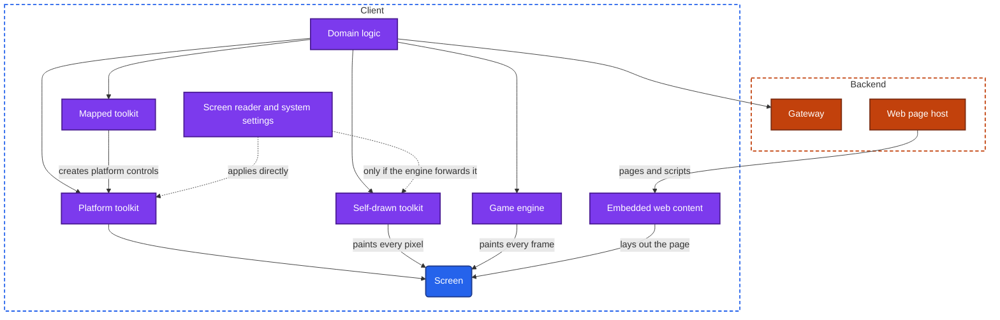
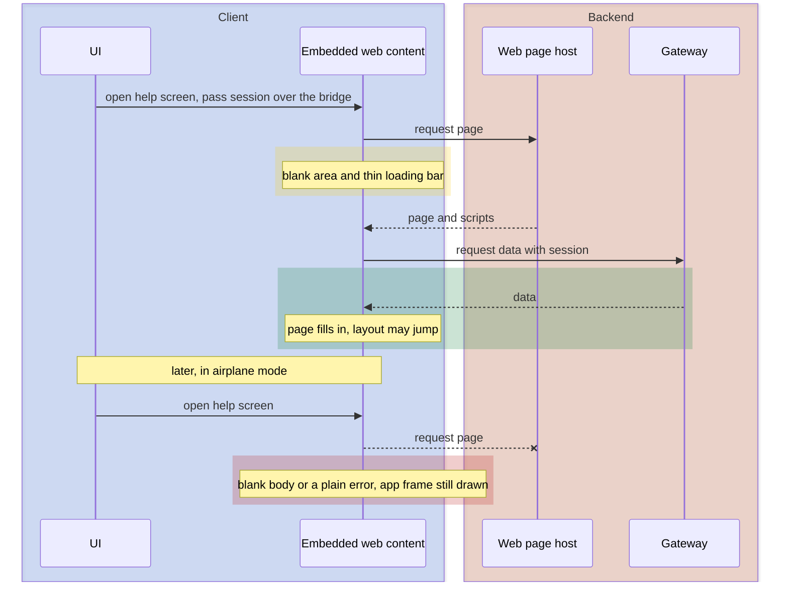

import Probe from '../../../components/Probe.astro';
import Signals from '../../../components/Signals.astro';
import TeardownBar from '../../../components/TeardownBar.astro';
import WorksheetForm from '../../../components/WorksheetForm.astro';

> **The question.** How is each screen of this app drawn, and what does that say about how the app is built?

## 32.1 Why this concern exists

Every mobile platform ships its own UI toolkit, with its own controls, gestures and conventions. A product that runs on two platforms must draw every screen twice, or find a way to draw it once. That choice is among the most expensive a team makes, and it is rarely reversed.

Four of the seven constraints ([Chapter 2](/part-1-method/2-the-mobile-constraint-set/)) pull on it.

- **Platform rules.** Each operating system defines how a back gesture, a menu, a date picker and a text selection behave. Users expect an app to follow them. New platform features appear first in the platform's own toolkit.
- **Slow release.** A screen compiled into the app changes only with a new release. A screen delivered as web content changes the moment the backend serves a new page.
- **Limited resources.** A toolkit that is not part of the operating system must be shipped inside the app. It adds to app size, to memory use and to the work done before the first frame.
- **Human attention.** A screen that scrolls, selects text or answers a tap slightly differently from every other app on the device feels wrong, even to a user who cannot say why.

The team's own cost sits against these. Two codebases need two sets of engineers and drift apart. One codebase halves the work and gives up something on each platform.

This chapter differs from the others in one respect, and you should hold it in mind throughout. The handbook is independent of any stack, so it names no toolkit. It describes five families by what they can do. And the evidence is weaker here than anywhere else in Part II. A user sees behavior, not code. A careful team can make any family behave like another. Almost every claim in this chapter is Inferred at best, and many are Speculative. The probes tell you how a screen is drawn. They do not tell you what language the logic behind it is written in.

## 32.2 The design space

There are five families. They are ordered here from the one closest to the operating system to the one furthest from it.

**Family 1. The platform toolkit.** The screen is built from the operating system's own controls, by code written separately for each platform. Text, lists, menus and pickers are the same objects the system's own apps use. This family costs the most to build, because every screen exists twice. It gains full fidelity to platform conventions, the lowest startup cost, the smallest app, and access to each new platform feature on the day it ships. Teams choose it when the product competes on feel, when it leans on hardware and platform surfaces, or when the company can afford two client teams.

**Family 2. A mapped toolkit.** The screen is described once, in shared code, and a layer in the app turns that description into the platform's own controls on each platform. A button in the shared description becomes the platform's button. The team writes one codebase and still gets platform controls, platform scrolling and platform accessibility for free. The cost is a runtime for the shared code, which adds to app size and startup time, and a boundary between the shared code and the controls. Work that crosses the boundary on every frame, such as a gesture that follows the finger, is the hard case. New platform features arrive when someone writes the mapping for them. Teams choose this family when they want one codebase and care that the result looks at home on each platform.

**Family 3. A self-drawn toolkit.** The app ships its own drawing engine. The engine receives an empty surface from the operating system and paints every pixel on it: text, buttons, scrolling, selection handles, everything. The platform's controls are not used. They are imitated, or replaced by the product's own. The team gets one codebase and pixel-identical output on every platform and every operating system version. The cost is the engine in the app's size, engine startup before the first frame, and the fact that every platform behavior must be reimplemented. Accessibility is not inherited. The engine must describe its pixels to the screen reader through a parallel structure. Teams choose this family when brand consistency matters more than platform convention, or when one small team must cover many platforms.

**Family 4. Embedded web content.** The screen is a web page, shown inside a component the operating system provides for that purpose. The page comes from the network, from files bundled in the app, or from a cache. One codebase serves the app on both platforms and the website. A page from the network also escapes slow release entirely. The cost is the furthest distance from platform conventions, a loading step, weaker offline behavior, and access to platform features only through a bridge the app must build. Teams choose it for screens that change often, that are shared with the website, or that are visited too rarely to justify building twice: help, legal terms, campaigns, long forms, a checkout owned by another team.

**Family 5. A game engine.** The whole screen is one surface that the engine redraws many times a second. There are no controls in the platform's sense. Menus and buttons are drawn objects in the game's scene. The team gets full control over every frame and one codebase across phones, consoles and desktops. The cost is a large app, a long launch, continuous use of the processor and battery, and no inherited text handling or accessibility at all. Teams choose it for games, and sometimes for a single screen with heavy graphics inside an otherwise ordinary app.

| | Platform toolkit | Mapped toolkit | Self-drawn toolkit | Embedded web content | Game engine |
|---|---|---|---|---|---|
| Codebases for two platforms | Two | One, plus platform pieces | One | One, shared with the website | One |
| Startup cost | Lowest | A runtime to start | An engine to start | A page to load | An engine and assets to load |
| App size cost | None | Runtime | Engine | Little, when pages come from the network | Large |
| Fidelity to platform conventions | Full | High | Imitated | Low | None |
| New platform features | At once | After a mapping exists | After a wrapper exists | Through a bridge | Through a plugin |
| Changes without a release | No | Sometimes | Rarely | Yes, when served from the network | Assets and levels |
| Accessibility | Inherited | Inherited | Rebuilt by the engine | The web's own model | Absent unless built |

**Families belong to screens, not to apps.** A single app commonly has a home feed built with the platform toolkit, a settings area in a mapped toolkit left by an earlier team, a help center in embedded web content and a camera effect on a game engine's surface. Record the family for each screen. One label for a whole app is usually wrong.

Two neighbors of this chapter are easy to confuse with it. Server-driven UI ([Chapter 31](/part-2-concerns/31-server-driven-ui/), which asks how much of the screen the backend decides) changes a screen's layout without a release, and still draws it with whichever family the client uses. Remote config ([Chapter 30](/part-2-concerns/30-remote-config-and-experiments/), which asks how the app changes its behavior without a new release) changes values. A screen that changes overnight is not thereby web content.

## 32.3 Anatomy

Figure 32.1 shows the five drawing paths side by side. In the universal app model ([Chapter 3](/part-1-method/3-the-universal-app-model/)) all of them are the UI component. What differs is how many layers sit between the domain logic and the pixels, and who owns each layer.



*Figure 32.1. Five paths from logic to pixels. Only the platform toolkit receives system behavior without extra work.*

Three properties of this figure drive every probe in the chapter.

First, the platform toolkit is the only path that the operating system reaches into directly. System text size, the screen reader, text selection, the context menu and scrolling physics are properties of the platform's controls. A mapped toolkit inherits them, because it ends in those same controls. A self-drawn toolkit and a game engine must rebuild each one, and anything not rebuilt is missing or slightly different. Each difference is a signal.

Second, embedded web content has a second source. It can load its page from a host on the backend, which the other families never do for layout. That path gives it its release speed and its offline weakness.

Third, the mapped toolkit converges on the platform toolkit. From the last arrow onward the two are the same objects. This is why they are the hardest pair to tell apart, and why most claims that separate them are Speculative.

### The bridge

Web content and shared-code runtimes are sealed off from the rest of the app. They reach the session, the local store, the camera or the payment sheet only through a bridge, a narrow set of messages the host app chooses to answer.

```text
// Inside the host app. The page can ask only for what is listed here.
function onMessageFromPage(message):
  match message.name:
    "getSession":   reply(sessionTokenFor(page.origin))   // only for the app's own pages
    "close":        navigation.pop()
    "openRoute":    router.open(message.route)
    "share":        platform.share(message.payload)
    otherwise:      reply(Unsupported)                    // old app, newer page
```

The bridge matters to a teardown because it is where a mixed app shows its seams. A page that cannot reach the session asks you to sign in again. A page newer than the app asks the bridge for something the app does not know, and a button does nothing. Section 32.5 returns to these.

## 32.4 The signatures, one by one

Each signature in this section is a place where the operating system gives the platform toolkit something for free. The question is always whether the screen has the real behavior, a rebuilt one, or none.

### Text selection and context menus

In the platform toolkit, text is selectable only where the developer marked it so: message bodies, article text, text fields. Labels, titles and button captions are not. When selection works, the handles and the menu are the system's own, and the menu carries system entries such as look up, translate and share.

Embedded web content inverts this. Text on a web page is selectable by default, so a long-press on a label or heading often starts a selection. A long-press on a link or image may open a preview or a menu with entries about the link itself. A tap may flash a gray highlight over the tapped area. A careful team disables all three, so their absence proves nothing. Their presence is the strongest single signal in this chapter.

A self-drawn toolkit draws its own handles and its own menu. They are often close copies of one platform's style, and they may be the same on both platforms. The menu tends to be shorter, because system entries added in recent operating system versions are missing until the toolkit adds them. A game engine usually has no text selection at all.

### Scrolling feel

Each platform has its own scrolling physics: how fast a fling decays, and what happens at the edge of the content. One platform stretches or bounces past the edge. Another shows a glow or a squeeze. Platform and mapped toolkits get this from the system's scrolling control.

A self-drawn toolkit imitates the physics, usually well. The tell is an edge effect from the wrong platform, or the same effect on both. Embedded web content scrolls inside the web component, whose deceleration can differ from the app's other lists, and an inner region that scrolls inside the page can catch the gesture unexpectedly.

One scrolling signal belongs to mapped toolkits. When rows are produced by shared code running apart from the UI, a hard fling can outrun it, and blank rows appear briefly before they fill. The platform toolkit can show the same thing when images load late, so treat it as Speculative.

### System text size and accessibility settings

Raise the system text size and a platform-toolkit screen grows, if the team used the system's text styles. That condition matters. Many teams fix their font sizes, and their screens do not grow in any family. So growth is evidence that the system setting reaches the screen, and no growth is weak evidence of anything.

The useful signal is a difference between screens of one app. If the home screen grows and the help screen does not, the two are probably drawn differently. Embedded web content often ignores the system text size unless the page was written to follow it. A game engine ignores it. A self-drawn toolkit follows it when the engine forwards the setting, and may round or cap it differently from the system.

The screen reader is the sharper tool. It reads a structure the toolkit publishes, not the pixels.

| What the screen reader does | What it suggests |
|---|---|
| Moves control by control, announcing name, role and state as it does in system apps | Platform or mapped toolkit, or a self-drawn toolkit with full support |
| Announces web structure, such as headings, links and landmarks, and offers navigation by them | Embedded web content |
| Finds elements, but focus outlines sit slightly off the visible control, or the order jumps | A self-drawn toolkit describing its pixels through a parallel structure |
| Lands on one large region, or finds nothing | A game engine, or a self-drawn surface with no accessibility support |

[Chapter 37](/part-2-concerns/37-accessibility-and-global-reach/) uses the same probe to judge how well the app serves the people who depend on it. Here it only classifies the drawing path.

### Platform conventions, or the same on both

This is the one signature that needs two devices. Put the same screen side by side on both platforms and compare the parts each platform has opinions about: the position of the back control, the look of switches and pickers, how a menu opens, how a modal is dismissed, the typeface, the transition between screens.

| What you see | Reading |
|---|---|
| Layout and controls each follow their platform, and the screens differ in structure | Two codebases. Platform toolkit on each. |
| The same layout on both, with each platform's own switches, pickers and menus | A mapped toolkit, or two teams following one tight design system |
| Identical pixels, including controls, typeface and transitions | A self-drawn toolkit, embedded web content or a game engine |

The middle row is why this signature alone cannot identify a mapped toolkit. A disciplined pair of teams produces the same picture. A second weak tell appears after a major operating system update that restyles the system's controls. Screens built on the platform's controls change overnight with no app update. Self-drawn imitations keep the old look until the toolkit and the app catch up.

### Loading bars, refresh and offline behavior

A web page arrives as a document, and it loads like one. Typical marks are a thin progress bar under the title, a blank white or gray area that fills from the top, content that jumps as images and fonts arrive, and a pull-to-refresh that blanks and reloads the whole page instead of updating a list in place. A close control where the rest of the app has a back control, or a title that changes as you move within the screen, marks a web container.

Offline behavior separates code in the app from pages on the network. A screen drawn by code in the app still draws its frame without a network: the title, the tabs, the empty list, an error state in the app's own style ([Chapter 9](/part-2-concerns/9-state-and-ui-data-flow/)). A page from the network cannot draw anything. The body is blank or shows a plain error, often in a style that matches nothing else in the app. This is the cleanest probe in the chapter, with one exception. Web content bundled in the app or cached draws offline like any other screen.

### App size and startup time

Every family except the first ships something the operating system does not provide. The cost appears as a floor under app size and as time before the first frame ([Chapter 7](/part-2-concerns/7-launch-and-startup/)).

A small app with a near-instant first frame is consistent with the platform toolkit. A simple app that is tens of megabytes larger than its features suggest, with a visible pause on the splash at cold start, is consistent with a bundled runtime or engine. A very large app with a long loading screen and a progress bar is a game engine's pattern. None of these is more than Speculative. Media, fonts, bundled models and third-party SDKs inflate size too, and [Chapter 38](/part-2-concerns/38-modularity-sdks-and-team-scale/) lists them.

### Reading the signatures together

No single signature identifies a family. Combine them, in this order of strength.

1. Selectable labels, link menus, a page-style loading bar or a whole-screen failure offline. Any two of these make embedded web content Inferred.
2. A screen reader that finds one region or nothing, with a large app and constant redrawing. A game engine, Inferred.
3. Identical pixels on both platforms with controls that follow neither exactly, and selection handles or menus that differ from the system's. A self-drawn toolkit, Inferred when you have compared both platforms, Speculative when you have one.
4. System behavior everywhere, and a different structure on each platform. The platform toolkit, Inferred.
5. System behavior everywhere, and the same structure on both platforms. A mapped toolkit or two disciplined teams. Speculative either way.

## 32.5 Mixed apps and their seams

Most large apps mix families, and the joins are easier to detect than the families themselves. A seam is a place where you pass from one drawing path to another. Four things tend to break there.

**The session.** Web content keeps its own storage, separate from the app's. Unless the bridge hands over the session ([Chapter 20](/part-2-concerns/20-identity-and-sessions/), which asks how the app knows who you are), the page does not know who you are and shows a sign-in form inside an app you are already signed in to.

**Navigation.** The host app has a back stack ([Chapter 8](/part-2-concerns/8-navigation-deep-links-and-screen-state/)). The page has its own history. Back may leave the whole web screen when you expected to go one page back, or step through page history when you expected to leave.

**Appearance.** The page ignores the dark appearance the rest of the app follows, uses a different typeface, or shows the website's header, footer or consent banner inside the app.

**State.** A change made in the page is not known to the screens around it. You update an address in a web form, go back, and the screen under it still shows the old one until it refetches.

Figure 32.2 shows the life of one embedded web screen, online and offline.



*Figure 32.2. One embedded web screen, online and then offline.*

Record every seam you find. A list of which screens sit on which side is often the most reliable output of this chapter, and it feeds [Chapter 38](/part-2-concerns/38-modularity-sdks-and-team-scale/), because a seam between families is frequently a boundary between teams.

## 32.6 What the drawing path says about the code

The drawing path supports a few claims about the codebase, and it is easy to claim too much.

A screen in embedded web content is very probably shared with, or derived from, the product's website. Open the same function in a browser and compare. Identical layout and wording raises this to Inferred.

A self-drawn or mapped toolkit across the whole app implies one UI codebase for both platforms, and usually a single team that ships both at once. Simultaneous releases with the same version notes on both stores support it.

The platform toolkit on both platforms implies two UI codebases. It says nothing about the logic underneath. Domain logic, the data layer and the sync engine can be written once in a language that compiles for both platforms and sit under two separate UIs. This arrangement leaves no visual signature at all. Its only trace is behavioral: the same edge-case bug, the same validation wording and the same sync behavior on both platforms. Even then, a shared specification followed by two teams explains the evidence equally well. Mark any claim of shared logic under platform UI as Speculative.

A cross-platform runtime can also load new logic from the backend without a store release, where platform rules allow it. From outside this looks the same as remote config or server-driven UI, so it cannot be claimed on behavior alone.

## 32.7 Probes

Run P32.1, P32.5 and P32.6 on every screen you care about. They take seconds and catch embedded web content. Run P32.2 and P32.3 next, on one screen of each kind. P32.4 needs a second platform. Select the outcome you saw in each probe, and it is recorded in your worksheet for the teardown chosen here.

<TeardownBar />

### P32.1 Long-press text

<Probe id="P32.1" />

### P32.2 Raise the system text size

<Probe id="P32.2" />

### P32.3 Screen reader walk

<Probe id="P32.3" />

### P32.4 Two platforms side by side

<Probe id="P32.4" />

### P32.5 Each screen in airplane mode

<Probe id="P32.5" />

### P32.6 Refresh and loading

<Probe id="P32.6" />

### P32.7 Scroll to the edge and fling

<Probe id="P32.7" />

### P32.8 The seam

<Probe id="P32.8" />

### P32.9 App size and startup time

<Probe id="P32.9" />

## 32.8 Signal-to-design table

Read the confidence column closely in this chapter. Few rows reach Inferred on their own.

<Signals chapter={32} />

## 32.9 The backend this implies

The drawing path leaves a lighter mark on the backend than most concerns, and the mark is specific.

- **Platform, mapped and self-drawn toolkits.** The backend serves data, not layout. The API shape ([Chapter 10](/part-2-concerns/10-api-shape/)) is whatever the team chose. One shared client codebase makes it more likely that both platforms call exactly the same endpoints in the same order, and less likely that the backend carries platform-specific responses.
- **Embedded web content from the network.** A web page host exists and serves pages built for a small screen. It needs a way to accept the app's session, to hide the website's own header and footer when inside the app, and to learn the app's version, so that a new page does not call a bridge message an old app lacks. Old app versions meet new pages every day, which is the compatibility problem of [Chapter 33](/part-2-concerns/33-releases-and-compatibility/) (how old versions keep working, and how they are retired) in reverse.
- **Bundled or cached web content.** A delivery path for page bundles exists, with versions, so that the app can replace its local pages without a release.
- **Game engine.** An asset delivery service for levels, textures and audio, usually fetched after install. A first launch that downloads for minutes is that service at work.

A team that serves the same pages to the app and the website has also made the website a dependency of the app. A website outage becomes an app outage for those screens only, which you may one day observe.

## 32.10 Failure modes and what they reveal

- **A sign-in form inside a signed-in app.** The screen is embedded web content and the bridge did not pass the session, or the session expired separately in the page's own storage.
- **A website header, footer or consent banner inside the app.** The page is the public website, served without an in-app variant.
- **One screen stays light in dark appearance.** That screen is drawn by a different path from its neighbors, most often web content.
- **A button that does nothing on an old app version.** The page asked the bridge for a capability this version lacks. This confirms web content served from the network, and a missing version check.
- **Back leaves the whole flow from its third step.** The flow is a sequence of pages inside one web screen, and the host's back stack knows only the screen.
- **Controls that look one operating system version old.** Imitated controls in a self-drawn toolkit, waiting for the toolkit to follow a system restyle.
- **The keyboard covers the field being typed in.** The drawing path does not receive the system's keyboard handling for free. This is common in web content and self-drawn toolkits, and possible anywhere.
- **Taps answer late while scrolling stays smooth.** Scrolling runs in the platform's control while the logic that answers the tap runs elsewhere and is busy. Consistent with a mapped toolkit. Speculative.
- **The screen reader goes silent on one screen.** That screen is a single drawn surface with no published structure.
- **Emoji or a rare script renders differently from the rest of the device.** The screen draws text with its own engine and fonts, not the system's.

## 32.11 Worksheet entries

These are the fields this chapter adds to the teardown worksheet. Probe outcomes fill some of them in. Record the family per screen in the notes, and give each claim its confidence word.

<TeardownBar />

<WorksheetForm chapters={[32]} />

## 32.12 Summary

- A screen is drawn by one of five families: the platform toolkit, a mapped toolkit, a self-drawn toolkit, embedded web content or a game engine. Families are assigned per screen, and most large apps mix them.
- The families trade one codebase against startup time, app size, fidelity to platform conventions and access to new platform features.
- The operating system gives the platform toolkit text selection, scrolling physics, text scaling and screen reader support for free. Every other family inherits, rebuilds or lacks each one, and the differences are the signals.
- Embedded web content is the easiest family to detect: selectable labels, link menus, page-style loading, full-page refresh and whole-screen failure offline.
- A mapped toolkit ends in the platform's own controls, so it is the hardest to separate from two well-coordinated platform teams. Claims about it are Speculative.
- Seams between families show in the session, in back navigation, in appearance and in stale state. A seam is often a team boundary.
- The drawing path says how the UI is built. It says nothing about shared logic underneath, which leaves no visual signature.
- Almost every claim in this chapter is Inferred or Speculative. Write the confidence word next to each one.
