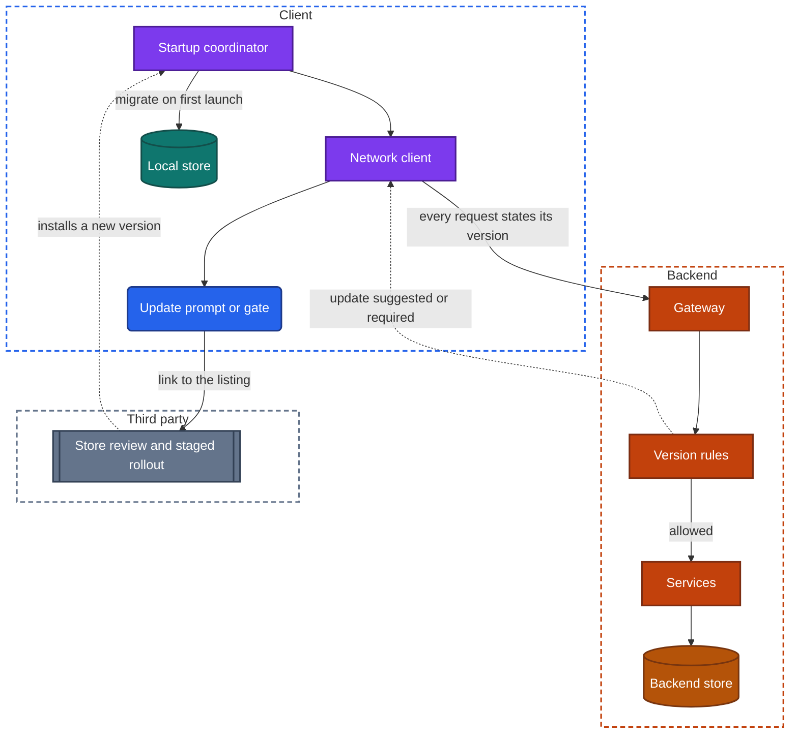
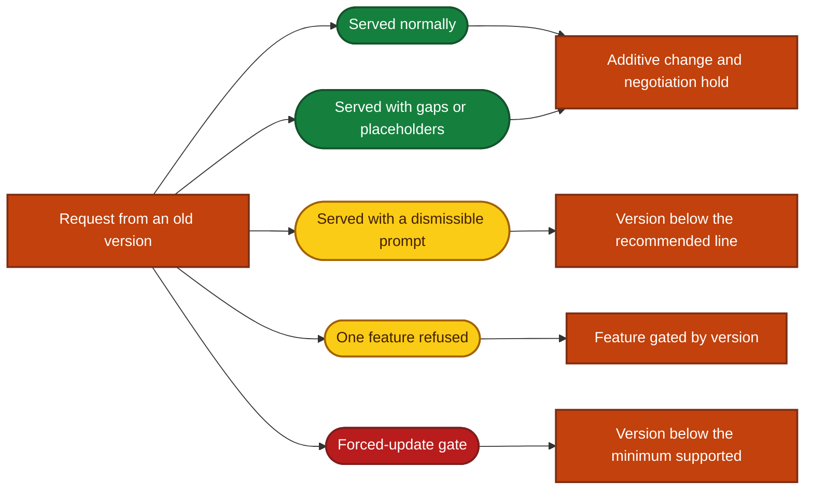
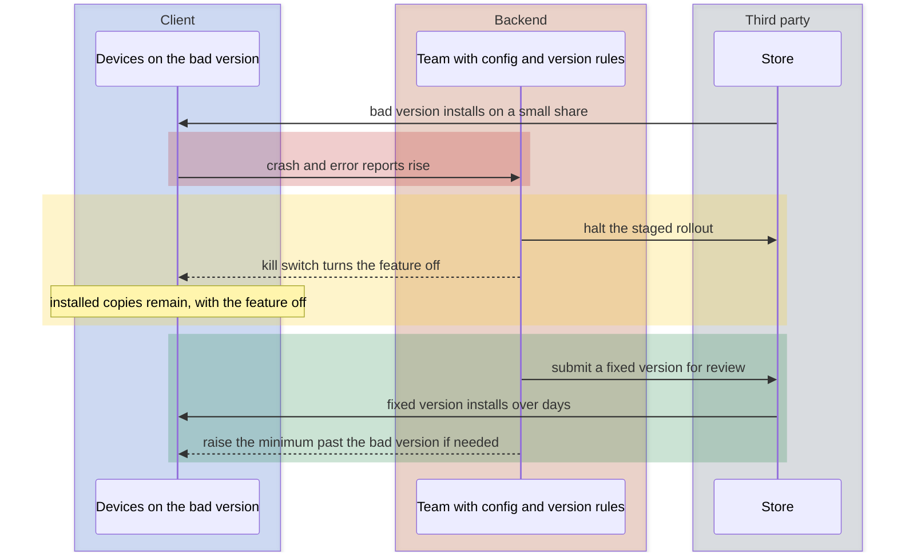

import Probe from '../../../components/Probe.astro';
import Signals from '../../../components/Signals.astro';
import TeardownBar from '../../../components/TeardownBar.astro';
import WorksheetForm from '../../../components/WorksheetForm.astro';

> **The question.** How do old versions of this app keep working, and how are they retired?

## 33.1 Why this concern exists

A backend has one version in production. A team deploys it, and a minute later every user is on the new code. A mobile app has no such moment. Each release adds one more version to the set that is in use, and nothing removes the old ones except each user's own decision to update.

This is the slow release constraint of [Chapter 2](/part-1-method/2-the-mobile-constraint-set/) in full. Three facts make it up.

- **A release is slow to leave.** The store reviews it. The team usually exposes it to a small share of users first. The whole path takes days.
- **A release is slow to arrive.** Devices update when they are charging and on an unmetered network, when the user opens the store, or never. Some devices cannot update, because their operating system is too old for the new version.
- **A release cannot be recalled.** Once a version is on a device, the team cannot remove it or change its code. A defect stays until the user installs something newer.

Platform rules shape the rest. The store decides what may be published, how fast, and what an app may change about itself afterwards. The untrusted client constraint adds a duty: an old version may contain a security defect, and the backend is the only place where the team can stop it from being used.

This chapter is about **versions**. Two neighboring chapters cover the ways an app changes without one. [Chapter 30](/part-2-concerns/30-remote-config-and-experiments/) covers values and switches. [Chapter 31](/part-2-concerns/31-server-driven-ui/) covers layout decided by the backend. Both exist because of the problem described here, and Section 33.9 shows how to tell the three apart.

Versions are unusually easy to observe. The version number is printed in the app or the store listing. The store listing's version history and release notes are statements published by the maker, and you may cite them as such. An old device in a drawer is a time machine.

## 33.2 The design space

A compatibility policy answers one question: what happens to a version as it ages. Five policies exist. Most teams move down this list as the app grows.

**Support every version.** The backend never breaks a client. Every endpoint, field and behavior that any shipped version relies on is kept. This is the default of a young app, which has few versions and no reason to think about them. It costs nothing at first and more every year, because nothing can be removed.

**Soft prompts.** The app tells users on old versions that an update exists, and lets them continue. This shortens the tail without cutting it. It costs a config value and a dialog.

**Features gated by version.** Old versions keep working, and lose access to particular features. The backend refuses a feature's endpoints below a given version, or the app shows a message in place of the feature. The team retires the costly parts of old behavior one at a time.

**A minimum supported version.** The backend publishes the lowest version it will serve. Anything below sees the forced-update gate of [Chapter 7](/part-2-concerns/7-launch-and-startup/) and can do nothing else. The team can finally delete old behavior. The cost is users who are locked out, including those whose devices cannot install the new version at all.

**A rolling window.** The minimum supported version advances on a schedule, for example every version older than a year. Users learn that updates are not optional, and the backend's burden has a fixed bound. Teams choose this where an old client is a risk in itself, such as an app that moves money.

| Policy | What an old version experiences | What the backend must keep | Who it suits |
|---|---|---|---|
| Support every version | Works, without newer features | Everything, forever | Young apps. Apps whose users cannot be forced |
| Soft prompts | Works, with reminders | Everything | Most consumer apps, as a first step |
| Features gated by version | Works in part. Some features ask for an update | Everything except the gated features | Apps with a few expensive legacy paths |
| Minimum supported version | Blocked below the line | Only versions above the line | Apps after a breaking change or a security fix |
| Rolling window | Blocked after a fixed age | A bounded set of versions | Apps under regulatory or security pressure |

A policy is observable only at its edge. If your oldest available version works, you have learned that the edge is further back, and nothing about where it is.

## 33.3 Anatomy

Figure 33.1 shows the parts. The store stands between the team and the device, and the team runs none of it. The version rules stand between every old client and the services.



*Figure 33.1. The components of release and compatibility. The store delivers versions. The version rules decide what each version may still do.*

Every request carries the client's version, and usually its platform and operating system version too. That one piece of context does four jobs. The gateway uses it to enforce the minimum supported version. Services use it to shape responses the client can read. The config service uses it for targeting ([Chapter 30](/part-2-concerns/30-remote-config-and-experiments/)). And the team counts it, to learn how many users each version still has, which is the number every retirement decision rests on ([Chapter 34](/part-2-concerns/34-observability/)).



*Figure 33.2. The five things an old version can experience, and the rule behind each.*

## 33.4 Getting a version out

### Store review

Every version passes a review by the store before users can install it. Review takes from hours to days, and it can end in a rejection. The team does not control the timing. Two consequences follow. A fix for an urgent defect is at least hours away, however fast it is written. And teams batch work into releases, because each release has a fixed cost.

Most teams of any size settle on a **release train**: a version leaves on a fixed schedule, such as every week or every two weeks, carrying whatever is ready. Work that is not ready ships turned off behind a feature flag and waits. The version history in the store listing shows the schedule directly. Dates at a steady interval are a train. Release notes that repeat the same sentence every time are a train whose features are released by flags, so that the binary's contents are not news.

### Staged rollout

Stores let a team release a version to a share of users and raise the share over days. The team watches crash rates and key measures at each step, and can halt the rollout if the version is bad. A halt stops new installs. It does not remove the version from the devices that already have it.

This is the second staged mechanism in the book. A staged rollout of a version, run by the store, decides which devices get the new binary. A staged rollout of a feature, run by a flag, decides which users see new behavior inside binaries they already have ([Chapter 30](/part-2-concerns/30-remote-config-and-experiments/)). They are independent, and many teams use both: the binary goes out over a week, and the feature inside it is turned on over the following month.

From outside, a staged rollout of a version shows as two of your devices being offered the same update days apart. The evidence is weak, since automatic updates also wait for charging and an unmetered network.

### Many versions at once

The result of all this is a distribution. At any moment a popular app has a current version on most devices, the previous two or three on a large minority, and a long tail that stretches back years. The tail is made of people who turned off automatic updates, devices that are rarely used, and devices whose operating system the new versions no longer support.

That last group matters. When an app raises the lowest operating system version it supports, devices below the line stay on the last version they could install, permanently. A forced-update gate tells those users to update, and the store offers them nothing. A careful gate checks for this and says so. You can sometimes read the event in the store listing, as a requirement that rises between versions.

## 33.5 Keeping old versions working

The backend's duty is to keep serving every version above the minimum. [Chapter 10](/part-2-concerns/10-api-shape/) lists the techniques from the API's side. This section looks at them as promises to old clients.

**Additive change.** The interface only grows. New fields, new endpoints and new optional arguments are added, and nothing is removed or redefined. Old clients ignore what they do not recognize. This rule carries most apps most of the way, and it has three sharp edges.

- *New values of an existing kind.* A new message type, order status or component reaches a client with no case for it. The client needs a fallback, which is the unknown-content placeholder of [Chapter 10](/part-2-concerns/10-api-shape/) and the unknown-component handling of [Chapter 31](/part-2-concerns/31-server-driven-ui/).
- *Writes from old clients.* An old client sends mutations in the old shape, without fields that newer clients send. The backend must fill the gap with a default that is correct, for years.
- *Removal.* Additive change never lets the team delete anything. The cost accumulates until a minimum supported version is the only way out.

**Version negotiation.** When the shape must differ, the two sides agree on which shape to use. There are three forms.

| Form | How it works | Cost |
|---|---|---|
| Stated version | The client states its app version or an interface version with each request, and the backend branches on it | A code path per version, and a test for each |
| Stated capabilities | The client lists what it can handle, such as content types or component types, and the backend sends only those | A list to maintain. It ages better than version numbers, because it says what the client can do and not when it was built |
| Client-dedicated layer | A layer per client translates between old shapes and current services | The layer grows with every version still alive |

```text
function handle(request):
  version = request.clientVersion
  if version < rules.minimumSupported:
    return UpdateRequired(storeLink)           // any endpoint can return this
  response = service.handle(request)
  response = shapeFor(version, response)       // drop or replace what this client cannot read
  if version < rules.recommended:
    response.notice = UpdateSuggested          // client decides when to show it
  return response
```

**A queued past.** One case is easy to miss. An app with an outbox ([Chapter 12](/part-2-concerns/12-offline-and-sync/)) can hold mutations that an old version wrote, and send them after an update, or days later from a device that was offline. The backend receives old-shaped writes from a client that now reports a new version. A team that has met this keeps old write shapes alive far longer than old read shapes.

Nothing in this section can be seen directly. What you see is the result: an old version that still works, and how gracefully it handles content made by newer ones.

## 33.6 Retiring old versions

### Update prompts

A prompt is the mildest pressure. It differs in three ways that you can observe.

- **Who shows it.** Some platforms offer an update flow that the app can invoke, with the store's own design. Otherwise the app draws its own dialog and links to the store listing. A prompt in the app's own style is the app's.
- **How often it returns.** Once per version, once per launch, or after a set number of days. A prompt that appears at every launch is a team applying pressure just short of a gate.
- **What it interrupts.** A prompt at launch, before content, is driven by startup config. A banner inside a screen is driven by a response.

### Update flows inside the app

On platforms that support it, the app can ask the store to download the new version in the background while the user keeps working, and then offer to restart into it. This removes the trip to the store listing and raises the share of users who accept. It is still a store release. The binary came from the store, and it was reviewed.

### The forced-update gate

Below the minimum supported version, the app is replaced by the forced-update gate. [Chapter 7](/part-2-concerns/7-launch-and-startup/) covers where the rule is checked and whether it holds offline. Three points belong here.

*What triggers it.* Teams use a gate after a breaking backend change, a security defect in old versions, a legal requirement, or a decision that the cost of old versions is too high. The store listing's release notes sometimes say which.

*What it cannot do.* A gate needs code in the old version to show it. A version shipped before the team built the gate has none, and when the backend refuses it, the user sees raw failures: errors, empty screens, a sign-in loop. An old version that breaks with no explanation predates the gate, or was cut off by a change nobody meant as a retirement.

*What it risks.* A gate with a wrong minimum locks out every user, and a release cannot fix it. [Chapter 7](/part-2-concerns/7-launch-and-startup/) discusses this failure.

### Features gated by version

Between a prompt and a gate sits partial retirement. The app runs, and one feature answers with a message that it needs a newer version. The rule lives in one of two places. If the old version contains the message, the team planned the gate when it built that version. If the message is generic text from the backend shown in a standard error dialog, the backend is refusing the feature's endpoints and the client is reporting what it was told.

The reverse case is as informative. A new feature is simply absent from an old version, with no message, because the old version has no code for it and no knowledge that it exists.

## 33.7 The first launch after an update

An update replaces the code and keeps the data. The new version finds a local store, key-value settings, cached files and a stored credential, all written by an older version. [Chapter 7](/part-2-concerns/7-launch-and-startup/) describes what the launch looks like, and [Chapter 11](/part-2-concerns/11-local-storage-caching-and-prefetching/) describes what is stored. The compatibility question is how far back the new version can read.

**Migrations chain.** A user may jump from a version two years old to the current one, skipping twenty in between. The new version must carry every migration step from every schema it might find, and run them in order. Teams bound this in two ways. They keep all steps forever, which costs code and testing. Or they declare that a store older than some version is discarded and rebuilt from the backend, which is cheap and only possible when the backend holds everything.

**Caches are discarded freely.** A cache can be dropped without loss, by definition. Many apps clear their caches on every update, to avoid reading responses in an old shape. You see a first launch that loads everything again and then behaves normally.

**Sessions should survive.** A stored credential usually lives in secure hardware-backed storage, apart from the local store, so that an update does not sign the user out. Being signed out after an update is either deliberate, for a security reason, or a defect ([Chapter 20](/part-2-concerns/20-identity-and-sessions/)).

**There is no way back.** Stores do not offer older versions, and a migrated store cannot be read by the old code. If the new version is bad, the user cannot return to the one that worked. This is the device-side half of the rule that Section 33.9 states for the team.

The update is also a moment when an app reveals its local model. Data that survives was stored and migrated. Data that reloads was a cache or was rebuilt. Data that is lost, such as a draft or a setting, existed only on the device and was not migrated, which is a defect.

## 33.8 Changing the app without a store release

Teams look for ways around the slow path. Four capabilities exist, in rising order of power.

| Capability | What changes | Chapter |
|---|---|---|
| Values and switches | Which built-in path runs | [Chapter 30](/part-2-concerns/30-remote-config-and-experiments/) |
| Described layout | Which known components a screen shows | [Chapter 31](/part-2-concerns/31-server-driven-ui/) |
| Web content | Anything inside a web view | [Chapter 32](/part-2-concerns/32-ui-technology-native-cross-platform-and-web/) |
| Non-compiled code and assets | Logic and screens that the app loads at run time | This section |

The fourth needs explanation. Some apps are built so that part of their logic is not compiled into the binary. It is a bundle of scripts and assets that an interpreter inside the app runs. The app ships with one bundle, and it can download a newer one and use it at the next launch. The same applies to content packs: levels, lessons, large media, language data. The store delivers the shell, and the team delivers the rest.

**Platform rules limit this.** Stores review what an app does, and they do not allow an app to become something else after review. The details differ by platform and change over time, so read the current published rules of the store in question before making a claim. In general, downloading new compiled code is forbidden or tightly restricted, while content, configuration and code run by an interpreter shipped in the reviewed app are tolerated as long as the app's purpose and reviewed behavior do not change. Teams use the capability for fixes and small changes, and keep features that alter what the app is for on the reviewed path.

**How it looks.** The signatures are distinct from the first three capabilities.

- A short "updating" or "downloading" step at launch, on a day when the store installed nothing.
- An about screen with two identifiers, one that changes with store updates and one that changes between them.
- A change in behavior, not just layout, with no change of store version, arriving at a launch.
- An app that is small in the store listing and large on the device after first launch ([Chapter 35](/part-2-concerns/35-performance-and-resource-budgets/)).

A behavior change with no version change is also what a feature flag produces. The difference is that a flag releases code that shipped earlier, and a downloaded bundle is new code. From outside the two can only be separated by a second identifier or a visible download. Without one of those, the claim is Speculative.

## 33.9 A bad release, and telling the mechanisms apart

### Shipping forward

A version with a serious defect is on a growing number of devices. The team cannot recall it. Figure 33.3 shows the tools it has, in the order they act.



*Figure 33.3. Recovery from a bad release. Nothing is recalled. The rollout is halted, the feature is switched off, and a fixed version ships forward.*

1. **Halt the rollout.** No further devices receive the version. This acts in minutes and helps only those who do not have it yet.
2. **Use a kill switch.** If the defect sits in a feature behind a flag, the team turns it off for the affected version ([Chapter 30](/part-2-concerns/30-remote-config-and-experiments/)). This is the only tool that repairs installed copies, and only if the flag exists and the app can start.
3. **Compensate on the backend.** The backend changes a response so that the bad code path is not reached, or tolerates the bad requests the version sends.
4. **Ship forward.** The team submits a fixed version with a higher number. Stores can speed up review for urgent fixes, at their discretion. The fix then spreads at the usual pace.
5. **Force the update.** If the bad version is dangerous, the team raises the minimum supported version past it. This works only if the bad version can still reach its gate.

The order explains what a user sees. A version that is followed two days later by another, with notes that mention only fixes, is a shipped-forward repair. A feature that disappears for a few days and returns after an update is a kill switch followed by a fix. A version that starts and closes at once is the worst case, because the code that fetches the kill switch never runs. Only a new version repairs it, and teams that have lived through this keep startup code small and guard it separately.

### Separating the three mechanisms

| What you saw | Remote config | Server-driven UI | A new version |
|---|---|---|---|
| Version number changed | No | No | Yes |
| The store listing shows a new entry | No | No | Yes |
| Arrives on all your devices at once | Often | Yes, on refresh | No. Each device updates in its own time |
| A device kept on an old version gets it | Only if that version has the code | Yes, within its component catalog | No |
| First launch afterwards is slow or reloads data | No | No | Sometimes. A migration |

The decisive tool is a device held back on an old version. Whatever reaches it did not come with a version. Whatever does not reach it, and does reach an updated device on the same account, did.

## 33.10 Probes

P33.1 to P33.3 are passive and need only the store listing and the app's about screen. P33.4 to P33.7 wait for an update to be offered. P33.8 and P33.9 need a spare device kept on an old version, which is worth setting up at the start of any long teardown. The probe families are those of [Chapter 4](/part-1-method/4-probes/). Select the outcome you saw in each probe, and it is recorded in your worksheet for the teardown chosen here.

<TeardownBar />

### P33.1 Release cadence

<Probe id="P33.1" />

### P33.2 Release notes

<Probe id="P33.2" />

### P33.3 A second version identifier

<Probe id="P33.3" />

### P33.4 When the update is offered

<Probe id="P33.4" />

### P33.5 Update prompt

<Probe id="P33.5" />

### P33.6 Update flow

<Probe id="P33.6" />

### P33.7 First launch after the update

<Probe id="P33.7" />

### P33.8 What an old version can still do

<Probe id="P33.8" />

### P33.9 A new feature on an old version

<Probe id="P33.9" />

## 33.11 Signal-to-design table

Each row follows the inference chain of [Chapter 5](/part-1-method/5-from-signal-to-inference/). Rows that rest on the store listing are statements by the maker, and are marked Observed for what was published, not for what the team does internally.

<Signals chapter={33} />

## 33.12 The backend this implies

- **Any app with more than one version in use.** Requests that carry the client's version and platform, and a count of active users per version. Without the count, no team can decide to retire anything.
- **Old versions that work.** Old endpoints and old response shapes are still served, and old-shaped writes are still accepted with correct defaults. If a version two years old works fully, there is a compatibility test suite, or a great deal of luck.
- **Graceful gaps on old versions.** Negotiation by version or capability, and a component that shapes responses for each client ([Chapter 10](/part-2-concerns/10-api-shape/)).
- **Soft prompts.** A recommended version per platform, published through config or attached to responses.
- **A forced-update gate.** A minimum supported version per platform, enforced at the gateway so that no endpoint is missed, plus the same value delivered to the client so that it can show the gate without a failed request. A careful design serves the rule from a system that does not share the failures of the one it guards ([Chapter 7](/part-2-concerns/7-launch-and-startup/)).
- **Features gated by version.** Version checks inside individual services, and a structured error that names the reason, so that the client can show a specific message.
- **Local stores that are discarded on update.** Endpoints that can rebuild everything the device held, which means the backend is the source of truth for all of it ([Chapter 12](/part-2-concerns/12-offline-and-sync/)).
- **Non-compiled code delivered outside the store.** A service that hosts bundles, decides which bundle each app version may run, and can roll a bad bundle back. This is a release pipeline of its own, with its own staged rollout.
- **A release train.** Automation that builds, tests and submits on a schedule, and feature flags to keep unfinished work dark. The organization behind it is the subject of [Chapter 38](/part-2-concerns/38-modularity-sdks-and-team-scale/).

Apps that handle money or regulated data usually run a rolling window and a strict gate. [Chapter 46](/part-3-archetypes/46-banking-payments-and-fintech/) is the archetype in which this chapter's policies are tightest.

## 33.13 Failure modes and what they reveal

- **An old version that shows errors everywhere and never mentions updating.** The backend dropped support, and this version predates the gate or was cut off by accident.
- **A gate that tells you to update, and a store that offers no update.** The device's operating system is below what the new version requires. The gate does not check for it.
- **A gate that appears in the middle of a task.** The rule is checked on responses. The process had been alive since before the minimum was raised.
- **The app closes at every launch after an update.** A failed migration. It works after a reinstall, because that removes the old data.
- **Signed out after an update.** The credential did not survive, by decision or by defect.
- **A draft or a setting lost after an update.** Data that lived only on the device and was not migrated.
- **Two releases within two days, the second with notes about fixes.** A bad release repaired by shipping forward.
- **A feature that vanishes for some days and returns with an update.** A kill switch, then a fixed version.
- **A new item that shows as a blank row on an old version.** Additive change met a client with no fallback for an unknown type.
- **An update prompt at every launch that can always be dismissed.** A recommended version with no memory of the dismissal, or deliberate pressure.
- **An item created on an old version that looks wrong on a new one.** An old-shaped write whose missing fields received a poor default.
- **The app behaves differently after a launch with a brief downloading step, and the store version is the same.** Non-compiled code or content updated outside the store.

## 33.14 Worksheet entries

These are the fields this chapter adds to the teardown worksheet of [Chapter 6](/part-1-method/6-the-teardown-worksheet/). Probe outcomes fill some of them in. One worksheet per app is enough, since versions apply to the whole app.

<TeardownBar />

<WorksheetForm chapters={[33]} />

## 33.15 Summary

- A release is slow to leave, slow to arrive and impossible to recall. Many versions are in use at once, and the backend serves all of them.
- A compatibility policy says what happens to a version as it ages: supported forever, prompted, gated by feature, blocked below a minimum, or blocked after a fixed age.
- The store listing's version history and release notes are published statements. They show the cadence, and often whether features ship with versions or behind flags.
- Old versions keep working through additive change and negotiation by version or capability. Unknown values, old-shaped writes and the impossibility of removal are the weak points.
- Retirement runs from soft prompts through features gated by version to the forced-update gate. An old version that fails with no message predates the gate.
- The first launch after an update shows what is migrated, what is discarded and rebuilt, and what is lost.
- Apps also change without a store release, through config, described layout, web content and non-compiled code. Platform rules limit the last of these.
- A bad release is repaired by halting the rollout, using a kill switch and shipping forward. A device held on an old version is the tool that separates all of these mechanisms.
