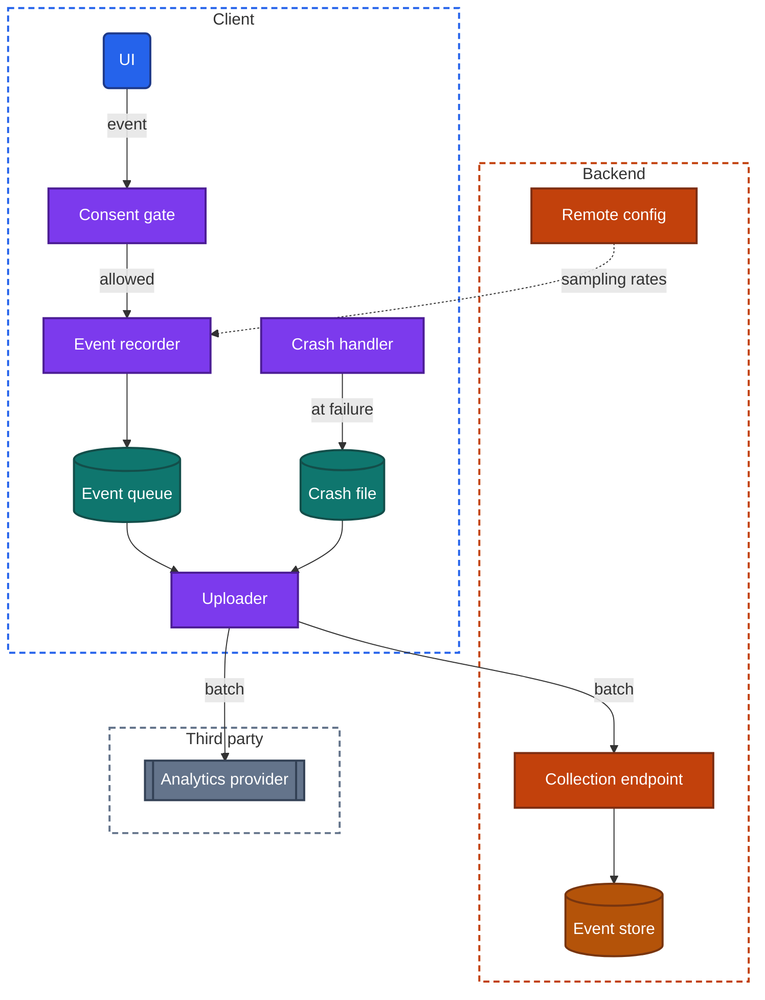
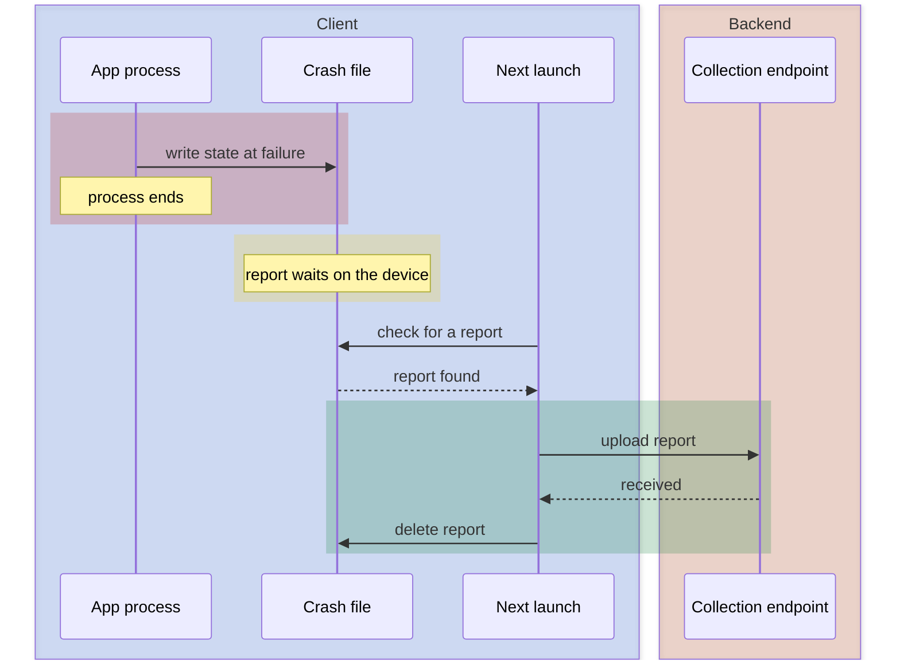

import Probe from '../../../components/Probe.astro';
import Signals from '../../../components/Signals.astro';
import TeardownBar from '../../../components/TeardownBar.astro';
import WorksheetForm from '../../../components/WorksheetForm.astro';

> **The question.** How does the team know what this app is doing on your device?

## 34.1 Why this concern exists

A backend runs on machines its team controls. When a service misbehaves, an engineer reads its logs, attaches a debugger or restarts it. A client runs on a device the team will never touch. The code executes on thousands of hardware models, under an operating system that suspends and ends it at will, on networks nobody can reproduce. Whatever the team learns about that execution, the client has to record and send back itself.

Four of the seven constraints ([Chapter 2](/part-1-method/2-the-mobile-constraint-set/)) shape how it does so.

**Slow release** is the reason the concern exists at all. A shipped version cannot be recalled, so a defect stays in the field until a new version passes review and users install it. The team needs to learn about the defect within hours, from the devices that hit it, and it needs enough detail to fix it without a second round of questions.

**Process death** and the **unreliable network** shape the mechanics. A record of what happened must survive the process that produced it, and it must wait on the device until a network is available. Observability is therefore a small offline system of its own, with a durable queue and an uploader, built on the ideas of [Chapter 12](/part-2-concerns/12-offline-and-sync/).

**Limited resources** set the ceiling. Every record costs storage while it waits, and data and battery when it is sent. A client that reports everything spends the user's resources on the team's curiosity.

**Platform rules** add a gate. The operating system and the store require a maker to declare what an app collects, and the law in many regions requires the user's agreement before some of it is collected. [Chapter 22](/part-2-concerns/22-privacy-permissions-and-consent/), Privacy, permissions and consent, covers that gate. This chapter covers what sits behind it.

This concern is the hardest in the book to see from outside. Observability is designed to be invisible to the user, and a well-built pipeline produces no screen, no delay and no error. Almost every claim you make from this chapter is Speculative. The chapter says so wherever it applies, and Section 34.10 lists what you can and cannot establish.

## 34.2 The design space

Observability is a set of independent channels. An app can have any combination of them. They are listed here from the least data to the most.

**Channel 0. Nothing from the client.** The team sees only what reaches the backend as ordinary requests. It knows which endpoints are called and how often they fail. It does not know about anything that happens without a request: a crash, a slow screen, a button nobody finds. Very small apps and apps with a strict privacy position work this way.

**Channel 1. Reports the platform collects.** The operating system records crashes and some performance figures for every app, and passes them to the maker when the user has agreed to share diagnostics at the device level. The app contains no code for this. The data is coarse and arrives late, and it costs the team nothing.

**Channel 2. Crash reports.** The client contains a component that records the state of the process when it fails and uploads that record. This is the first channel most teams add, because a crash is the worst outcome and the report is small.

**Channel 3. Analytics events.** The client records named events, such as a screen shown, a control tapped or a purchase completed, with a few properties each. Events answer product questions: which features are used, where users give up in a flow, whether an experiment changed behavior ([Chapter 30](/part-2-concerns/30-remote-config-and-experiments/), Remote config and experiments).

**Channel 4. Performance measurements.** The client times its own work on real devices: how long a cold start took, how long a screen took to show first content, how long each request took, how many frames were late during a scroll. The team reads these as distributions across all devices, not as single values.

**Channel 5. Logs.** The client keeps a running text record of what its components did. Logs are verbose and are rarely uploaded continuously. They are kept on the device and sent when something goes wrong or when the user sends feedback.

**Channel 6. Session recordings.** The client records what the user saw and did, in enough detail to replay it. This is the richest channel and the one with the most privacy risk. Teams use it for a small sample of sessions, or for specific flows where users fail and the events do not explain why.

| Channel | What it records | Volume per user | Uploaded | Privacy risk |
|---|---|---|---|---|
| 0 None | Nothing beyond requests | None | Never | Lowest |
| 1 Platform reports | Crashes and coarse performance | Tiny | By the operating system | Low |
| 2 Crash reports | Process state at failure | Small, and only on failure | On the next launch | Low to medium |
| 3 Analytics events | Named actions with properties | Medium | In batches | Medium |
| 4 Performance measurements | Durations and counts | Medium | In batches, often sampled | Low |
| 5 Logs | Text record of internal steps | Large | On demand | Medium to high |
| 6 Session recordings | Screens and input | Largest | Sampled | Highest |

The channels share machinery. Each one records something, holds it on the device, and uploads it later. Section 34.3 describes that shared machinery, and Sections 34.4 to 34.7 describe what is particular to each channel.

## 34.3 Anatomy

Figure 34.1 shows the components. Few apps build all of them. Many use a third party for the whole pipeline, in which case the recorder and uploader arrive as a library and the receiving side belongs to someone else.



*Figure 34.1. The components of a client observability pipeline.*

Three properties of the figure matter for a teardown.

First, nothing in it touches the screen. The UI hands an event to the pipeline and continues. No screen waits on an upload, so no loading state reveals one.

Second, the pipeline is separate from the app's own data path. Its queue is not the outbox of [Chapter 12](/part-2-concerns/12-offline-and-sync/), and its uploads do not go through the sync engine. A failed upload never produces an error the user sees. The separation is deliberate: a fault in observability must not break the product.

Third, the pipeline has two destinations in the figure and can have more. Events may go to the team's own backend, to a third party, or to both. From outside you cannot see which. You can only read what the maker declares, which Section 34.9 covers.

## 34.4 Crash reports

### The timing problem

A process that has just failed cannot be trusted to open a connection, wait for a response and retry. It may have corrupted its own memory, and the operating system is about to remove it. A crash handler therefore does the least it can: it writes the state of the failing process to a file, using only operations that are safe in a broken process, and lets the process end.

The upload happens later, on the next launch. A startup step checks for a crash file, sends it, and deletes it once the backend confirms receipt.



*Figure 34.2. A crash report is written at failure and uploaded on the next launch.*

This timing has two consequences you can reason about. A user who crashes and never opens the app again never sends the report, so the worst crashes are under-counted. And a crash during startup is the hardest to report, because the next launch may crash before the upload runs. Careful designs upload the pending report before anything else at launch, or detect repeated startup failures and enter a reduced mode. [Chapter 7](/part-2-concerns/7-launch-and-startup/) describes that startup sequence.

### What the report holds

A report holds the call stack of each thread at the moment of failure, the app version, the operating system version, the device model, free memory and storage, and whether the app was in the foreground. The stack is a list of addresses. The backend holds a mapping file for each released build and translates addresses into function names. That translation is why the build number matters, and why a team keeps mapping files for every version still in use.

Most designs add context the stack lacks: a short list of recent events, called a trail in this chapter, such as the last screens visited and the last requests made. Some attach a user identifier so that support can connect a complaint to a report.

### Failures that are not crashes

Three kinds of failure never run the crash handler.

- **A hang.** The UI stops responding and the user force-quits, or the operating system ends the process for being unresponsive. A watchdog inside the client can notice that the main thread has been blocked for several seconds and record its stack.
- **Termination by the operating system.** The process is ended for using too much memory or for overrunning a background time limit. No code runs at that moment. A client can detect this only by exclusion: at the next launch it notes that the previous run did not end cleanly, did not crash, and was not updated or restarted by the user.
- **A handled error.** The code caught a failure and showed an error state. Nothing crashed, and the user was still let down. Teams record these as events, not as crash reports.

### The prompt after a crash

Most designs upload crash reports without asking, under whatever consent the user gave earlier. A few ask on the next launch whether to send the report. That prompt is one of the only direct views of this channel a user gets. If a crash happens to you naturally, the launch that follows is worth watching, and P34.8 records it. Do not try to cause a crash. A crash can lose your data, and a deliberate one tells you nothing a natural one would not.

## 34.5 Analytics events

### Recording

An event is a name, a timestamp and a small set of properties. The recorder adds context that every event shares: an identifier for the installation or the user, an identifier for the current run of the app, the app version, the device class, and the experiment groups the user is in.

Two timestamps are needed. The device clock says when the event happened and can be wrong. The backend clock says when the batch arrived and says nothing about the delay before it. A sound design sends both the event time and the device's time at upload, so the backend can compute how long ago each event happened by subtraction and place it on its own clock.

### Queueing and batching

Sending each event as its own request would wake the radio hundreds of times in a session ([Chapter 35](/part-2-concerns/35-performance-and-resource-budgets/), Performance and resource budgets). The recorder instead appends events to a durable queue, and an uploader sends them with batching.

```text
function record(event):
  if not consent.allows(event.category): return
  if not sampler.keeps(event): return
  queue.append(event)                 // on disk, survives process death
  if queue.size >= batchSize: uploader.requestRun()

function upload():
  batch = queue.peek(batchSize)
  match send(batch, batchId):         // batchId lets the backend drop repeats
    Accepted:
      queue.remove(batch)
    Unreachable:
      scheduleRetryWithBackoff()
    Refused:
      queue.remove(batch)             // a bad batch must not block the rest
```

The uploader runs on a few triggers: the queue reaching a size, a timer, the app moving to the background, and the next launch. The move to the background matters most. It is the last moment the client is sure to run, so most designs try to send whatever is queued then, within the short time the operating system allows.

### While offline

Events recorded offline wait in the queue. Unlike an outbox, this queue is allowed to lose data. It has a bound on size or age, and when the bound is reached the oldest or least important events are dropped. A team would sooner lose a day of events than fill the user's storage.

When the network returns, the uploader drains the queue, often through a background task the operating system schedules ([Chapter 23](/part-2-concerns/23-background-work-and-notifications/), Background work and notifications). This is the one place where the channel can leave a faint trace: a device that was used offline and then reconnected may show data sent by the app while the app was closed. P34.7 looks for that trace. An outbox draining looks the same, so the probe works only on a session in which you wrote nothing.

### Delivery guarantees

Analytics delivery is at-least-once with deduplication on the backend, or simply at-most-once. A batch whose response is lost is sent again, and the backend drops it by its batch identifier, which is the idempotency key of this pipeline. Order across batches is not guaranteed, and the backend sorts by event time. Nothing here is visible from outside.

## 34.6 Performance measurements

### What is measured

Performance data from real devices answers a question the team's own test devices cannot: how the app behaves on the slowest phones and the worst networks its users have. The client measures a small set of durations and counts.

| Measurement | What it times or counts |
|---|---|
| Startup | Process start to first frame, and to first content |
| Screen load | Navigation to a screen until its content is drawn |
| Request | Each request's duration, size and result, by endpoint |
| Frames | How many frames missed their deadline during scrolling or a transition |
| Hangs | Periods in which the UI did not respond |
| Resources | Memory in use, and terminations by the operating system |

### How it is reported

A single slow startup means nothing. The team reads percentiles across devices, split by app version, device class and region. The client therefore sends plain numbers with the same context as an event, usually through the same queue.

A finer tool is a trace: a record of the steps inside one operation with the time each took, such as the phases of a cold start. Traces are large and are collected for a small fraction of runs.

Measuring costs something. Timing every frame and every request adds work to the code paths that are already under pressure. That is one reason this channel is sampled, and Section 34.8 covers sampling.

## 34.7 Session recordings and logs

### Two ways to record a session

A session recording lets a member of the team replay what a user saw. There are two designs.

- **Captured frames.** The client takes images of the screen at intervals and uploads them as video or as a series of stills. This is simple and heavy. It costs processing time and a large upload, and it captures everything on screen unless areas are blanked out first.
- **Reconstruction.** The client records the structure of each screen, as a tree of views with their positions and text, plus the input events. A viewer on the backend redraws the session from that record. This is far smaller and makes masking precise, because the recorder knows which element is a text field.

Both designs need masking: replacing sensitive content, such as typed text, payment details and messages, before anything leaves the device. Masking by default, with an explicit list of what may be shown, is the safe arrangement. Masking only what someone remembered to mark is the arrangement that leaks.

A recording is the channel a user is least likely to expect. You cannot observe it directly. The evidence available is the maker's own statements in its privacy listing and policy, and occasionally a side effect: a device that grows warm or stutters in an app that draws nothing demanding, or unusually high data sent for the amount of use. Both have many other explanations. Any claim that an app records sessions is Speculative unless the maker states it.

### Logs and feedback

Logs are kept in a ring: a fixed-size buffer in which new lines replace the oldest. The ring holds the last few minutes or megabytes of activity and costs a bounded amount of storage.

A feedback or problem-report form is where the ring surfaces. When you submit the form, the client can attach the ring, the device model and versions, the state of key settings, and a screenshot. Good forms say so and let you choose. This makes the feedback form the best window a user has onto this concern. The wording of the form tells you that logs exist, that they are held on the device, and whether the team treats their upload as something to ask about. P34.4 reads the form.

Some apps open the report form when you take a screenshot or shake the device. That trigger shows the form is wired into the app as a whole and not into one settings screen.

## 34.8 Sampling and remote control

Collecting everything from every device is expensive at both ends, so most pipelines sample.

| Kind | Rule | Used for |
|---|---|---|
| By user | A fixed fraction of users report a channel in full | Performance measurements, recordings |
| By session | Each run of the app decides once whether it reports | Traces, recordings |
| By event | Each event is kept with some probability | High-volume events such as scroll positions |
| By outcome | Record everything locally, upload only if the run ended badly | Logs, trails before a crash |

Sampling by user keeps each chosen user's history complete, which matters when the question is about a sequence of actions. Sampling by event keeps totals accurate when scaled and breaks sequences. Sampling by outcome is the most economical: the ring and the trail cost nothing to upload unless a failure makes them worth reading.

Rates are set by remote config, not compiled into the app. A team raises the rate for a new version in its first days, lowers it once the version is stable, and can turn a channel off entirely for a version whose recorder is itself faulty. The same mechanism lets a team raise the detail collected from one account while it investigates a complaint, which is why a support agent sometimes asks you to reproduce a problem after they "enable diagnostics".

Sampling is invisible. Two users of the same app may be reporting very different amounts, and neither can tell.

## 34.9 The tie to consent

Observability collects data about a person's behavior, so it sits behind the consent rules that [Chapter 22](/part-2-concerns/22-privacy-permissions-and-consent/) covers. Three design points belong to this chapter.

**The gate comes first.** In Figure 34.1 the consent gate sits before the recorder. An event the user has not agreed to is never recorded. The alternative is to record everything and filter at upload, which keeps data on the device that the user declined to give and risks sending it through a mistake.

**Events before the choice.** On first launch the user has not chosen yet. A design can drop everything until the choice is made, or hold early events in memory and either queue or discard them once the choice is known. The first is simpler and loses the data on first-launch behavior that product teams most want.

**Categories.** A consent screen usually separates what is needed for the app to work from what is optional. Crash reports are often placed in the first group and analytics in the second. The categories you are shown are a statement by the maker of which channels exist. So is the store's privacy listing, which declares the kinds of data the app collects and whether they are linked to your identity.

These statements are the strongest evidence available for this chapter, and they need careful handling. They are published by the maker, and a statement is not an observation of behavior. Record them as what they are: Observed that the maker declares a category, and Speculative as to what the app sends. A listing that declares more than the app uses is as possible as one that declares less.

A setting that turns usage data off also tells you something about structure. If the change takes effect at once, the gate is consulted for each event. If the app says the change applies after a restart, the recorder reads the choice once at startup.

## 34.10 What you can and cannot know

| Question | Best evidence available | Confidence you can reach |
|---|---|---|
| Does the maker declare crash or usage data collection | Store privacy listing, consent screen | Observed, as a declaration |
| Is there an in-app control | Settings screen | Observed |
| Do logs exist on the device | Feedback form wording | Inferred |
| Does the app upload while idle | Data figures over an idle day | Observed that data moved. Speculative as to what |
| Are events queued offline | Data sent after reconnecting | Speculative |
| Are crash reports sent | A prompt after a natural crash | Observed if prompted. Otherwise Speculative |
| Are sessions recorded | The maker's statement only | Speculative without a statement |
| Which third parties receive data | The maker's policy | Observed, as a declaration |
| What the sampling rates are | Nothing | Cannot be determined |

Two designs are indistinguishable from outside throughout this chapter: a pipeline the team built and one supplied by a third party. Both queue, batch and upload in the same way.

## 34.11 Probes

Every probe in this chapter is passive. Run P34.1 to P34.5 in one sitting, since they only read screens. P34.6 and P34.7 need a day. P34.8 cannot be scheduled.

<TeardownBar />

### P34.1 Diagnostics setting

<Probe id="P34.1" />

### P34.2 Privacy listing

<Probe id="P34.2" />

### P34.3 Consent choices

<Probe id="P34.3" />

### P34.4 Feedback form

<Probe id="P34.4" />

### P34.5 Report trigger

<Probe id="P34.5" />

### P34.6 Idle day

<Probe id="P34.6" />

### P34.7 Offline session, then reconnect

<Probe id="P34.7" />

### P34.8 Launch after a crash

<Probe id="P34.8" />

## 34.12 Signal-to-design table

<Signals chapter={34} />

## 34.13 The backend this implies

Each channel needs a receiving side. Because the client evidence is weak, treat these as what must exist if the channel does.

- **Crash reports.** A collection endpoint that accepts reports from every version ever shipped. A store of mapping files per build, and a step that turns addresses into names. Grouping, so that ten thousand reports of one defect appear as one issue with a count. Alerts when a new version's crash rate rises, tied to the release process ([Chapter 33](/part-2-concerns/33-releases-and-compatibility/), Releases and compatibility).
- **Analytics events.** A collection endpoint built to accept and never to block: it acknowledges a batch quickly and processes it later. Deduplication by batch identifier. A definition of every event name and property, so that old versions sending old shapes can still be read. A large store that is queried in bulk.
- **Performance measurements.** Aggregation into percentiles by version, device class and region. Raw values are rarely kept for long.
- **Logs and feedback.** Storage for attachments, linked to the support case that carried them, with a short retention period.
- **Session recordings.** Storage for the recordings, a viewer, and for the reconstruction design, a renderer that can redraw screens from every app version.
- **Control.** Remote config entries for sampling rates and channel switches, per version and per user.
- **Deletion.** A way to remove one person's data from every one of these stores on request. This is easy to state and expensive to build, and it is the reason many teams avoid attaching a user identifier where an installation identifier will do.

When a third party supplies the pipeline, all of this exists on that party's side, and the team's backend may contain none of it.

## 34.14 Failure modes and what they reveal

Observability fails quietly, and a user sees its failures only as side effects.

- **A slow or hanging startup that clears when the network is turned off.** A startup step is waiting on a collection endpoint. The upload was placed on the launch path without a short timeout.
- **Storage that grows in an app that caches little.** A queue or a log with no bound, or an uploader that never succeeds and never gives up.
- **Data used every day by an app you never open.** Background work that uploads, checks config or syncs. The channel cannot be identified from the figure alone.
- **The app is warm and stutters on simple screens.** One possible cause among many is a recorder capturing frames. Speculative.
- **A feedback form that fails to send on a weak connection.** The attachment is large and the transfer is not resumable ([Chapter 18](/part-2-concerns/18-file-transfer-uploads-and-downloads/), File transfer: uploads and downloads).
- **The same crash on every launch, with no fix for days.** Either reports are not arriving because the app fails before the upload runs, or the team has no alert on a rising crash rate.
- **A prompt to send a report appears long after the crash.** The report waited on the device until the next launch, as Figure 34.2 shows.
- **A usage-data setting that says it takes effect after a restart.** The recorder reads consent once at startup instead of for each event.

## 34.15 Worksheet entries

These are the fields this chapter adds to the teardown worksheet. Record the maker's statements and your own observations in separate fields, and keep the confidence word on each.

<TeardownBar />

<WorksheetForm chapters={[34]} />

## 34.16 Summary

- Observability is how a team learns what its code does on devices it cannot reach. Slow release makes it necessary, and limited resources and consent bound it.
- The channels are platform reports, crash reports, analytics events, performance measurements, logs and session recordings. An app can have any combination.
- All channels share one shape: record, hold on the device in a bounded queue, upload later in batches. The pipeline is separate from the app's data path and never blocks a screen.
- A crash report is written at failure and uploaded on the next launch. Hangs and terminations by the operating system need separate detection.
- Sampling and remote config decide how much each device reports. Neither is visible.
- The feedback form, the settings screen, the consent screen and the store's privacy listing are the only direct evidence. The last two are statements by the maker, not observations of behavior.
- Most claims in this concern are Speculative. A built pipeline and a third-party pipeline cannot be told apart from outside.
- Never cause a crash to study it. Watch the launch after one that happens naturally.
