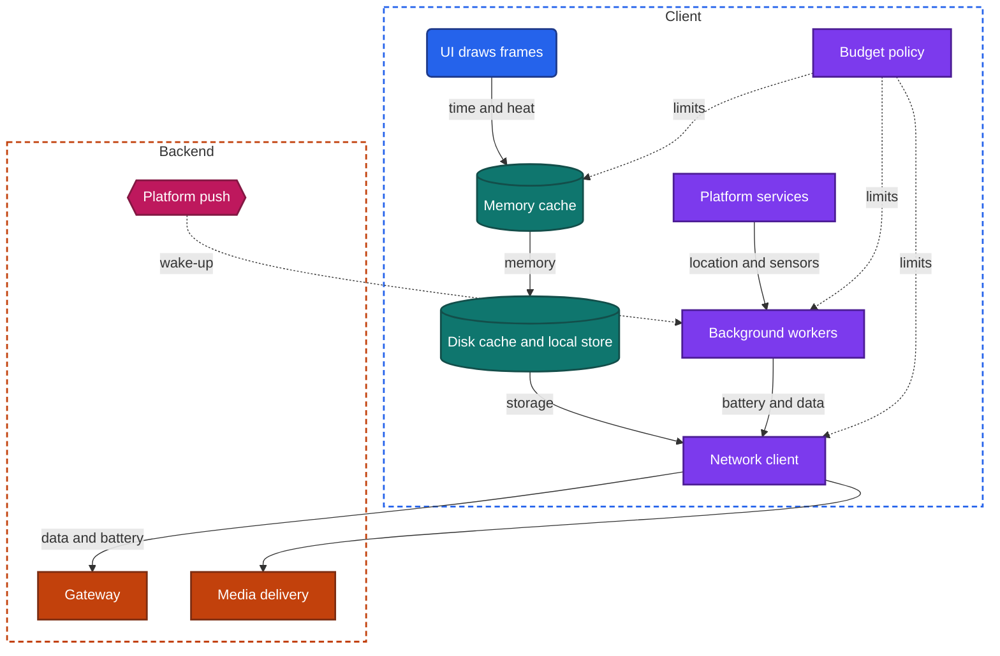
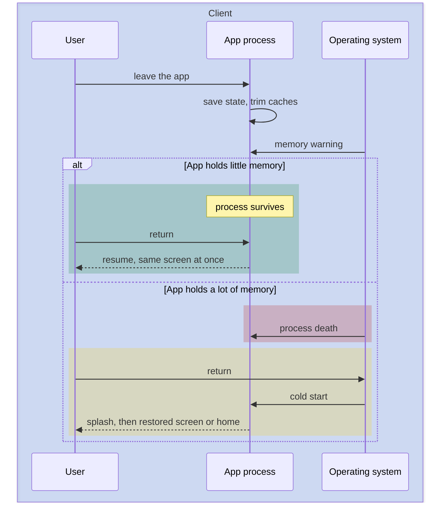

import Probe from '../../../components/Probe.astro';
import Signals from '../../../components/Signals.astro';
import TeardownBar from '../../../components/TeardownBar.astro';
import WorksheetForm from '../../../components/WorksheetForm.astro';

> **The question.** How does this app spend time, battery, memory, data and storage, and which of them does it spend to save the others?

## 35.1 Why this concern exists

The third of the seven constraints ([Chapter 2](/part-1-method/2-the-mobile-constraint-set/)) is limited resources: battery, memory, storage, mobile data and processing power are all rationed. On a server a team that runs short of a resource buys more of it. On a device the resource belongs to the user, it is shared with every other app, and the amount is fixed on the day the phone was bought.

Two other constraints turn the ration into a design problem. **Human attention** sets a budget for time: a response must feel immediate, and a scroll must follow the finger. **Platform rules** make the operating system an enforcer. It ends processes that hold too much memory, limits what runs in the background, slows a device that grows hot, and shows the user a per-app account of battery, data and storage.

That account is what makes this concern unusually open to a teardown. Most chapters ask you to infer hidden structure from behavior. Here the device itself measures the app and publishes the figures in its settings. The figures do not say why an app spends what it spends. The rest of this chapter supplies the candidate reasons.

The word budget is meant literally. A careful team sets a number for each resource, such as a startup time, a download size or a daily amount of background data, measures it on real devices ([Chapter 34](/part-2-concerns/34-observability/)), and treats a release that exceeds it as a defect. A less careful team has no numbers and finds out from reviews.

## 35.2 The design space

### The seven budgets

| Budget | What spends it | Who enforces it | What the user sees when it is overspent |
|---|---|---|---|
| Time | Work before a frame can be drawn | Nobody. The user judges | Slow launch, stutter, late response to a tap |
| Memory | Decoded images, caches, screens kept alive | The operating system ends the process | The app restarts when you return to it |
| Battery | Wake-ups, the radio, location, processing | The operating system limits background work | The app high on the battery screen |
| Data | Media, prefetching, background refresh | The user's plan, and data-saver mode | The app high on the data screen |
| Storage | Caches, downloads, the local store | The device fills up | The app high on the storage screen |
| App size | Code, bundled resources | The store, on some networks | A long download. An install that is put off |
| Heat | Sustained processing, radio and screen | The operating system slows the device | A warm device, dropped frames, dimmed screen |

### Four postures

Teams differ less in which techniques they know than in how they manage the budgets.

**Posture 1. Unmanaged.** Nothing is measured. Caches have no bound, images are loaded at full size, and background work runs whenever the code asks. The app works well on the team's own new phones.

**Posture 2. Reactive.** The team fixes what users complain about. The symptoms that draw complaints, such as slow launch and battery drain, are handled. Those that do not, such as storage growth, are left.

**Posture 3. Budgeted.** Each resource has a number and a measurement. Caches are bounded, background work is scheduled, and releases are checked against the numbers.

**Posture 4. Adaptive.** The budgets change at run time with the device and its state. The app does less on a device with little memory, on a metered network, in low-power mode or when the device is warm. [Chapter 36](/part-2-concerns/36-constrained-devices-and-networks/), Constrained devices and networks, extends this posture to whole classes of device and network.

| Posture | Caches | Background work | Reacts to device state | Signature |
|---|---|---|---|---|
| 1 Unmanaged | Unbounded | Unscheduled | No | Storage and battery figures grow without limit |
| 2 Reactive | Some bounded | Reduced after complaints | No | Good on the common symptoms, poor on the rest |
| 3 Budgeted | All bounded | Scheduled and batched | To memory warnings | Figures level off and stay proportionate to use |
| 4 Adaptive | Bounded per device | Deferred by state | Yes | Behavior changes in low-power mode and data-saver mode |

Low-power mode, in this chapter, is the device setting by which the user asks the system and its apps to use less battery.

## 35.3 Anatomy

Figure 35.1 places each budget on the universal app model. Every component spends at least one, and the operating system stands over all of them.



*Figure 35.1. Where each budget is spent, and the policy that limits the spending.*

The budget policy is the part that separates Posture 3 and Posture 4 from the others. It is a small piece of logic that reads the device's state and sets limits for the components that spend.

```text
function currentLimits(device):
  limits = defaultsFor(device.class)      // set per class of device, Chapter 36
  if device.lowPowerMode:
    limits.prefetch = off
    limits.backgroundRefresh = off
    limits.animation = reduced
  if device.network.metered or device.dataSaver:
    limits.prefetch = off
    limits.mediaQuality = low
  if device.thermalState is hot:
    limits.frameRate = reduced
    limits.mediaQuality = low
  return limits

function onMemoryWarning():
  memoryCache.evictAll()                  // cheaper than being ended
  screensNotVisible.releaseViews()
```

An Unmanaged app has no such function. A Budgeted app has the defaults and the memory handler. An Adaptive app has all of it, and each branch has a visible effect that a probe can find.

## 35.4 Time

### Startup

The first time budget is the wait from the tap on the icon to the first useful screen. [Chapter 7](/part-2-concerns/7-launch-and-startup/) covers it in full: the phases of a cold start, deferred initialization and lazy initialization. This chapter adds only the link to the other budgets. Work moved out of startup still has to run, and it spends battery and time later. App size also feeds startup, because more code takes longer to load.

### Frames

The second time budget is the frame. A screen redraws many times a second, and each frame has a fixed deadline of a few milliseconds. A frame that misses its deadline is not drawn late. It is skipped, and the user sees the previous frame for twice as long. A run of skipped frames is stutter.

All drawing and all input handling happen on one thread, the main thread. Any work placed on it competes with the next frame. The design rule is short: nothing slow runs on the main thread. Reading from disk, parsing a response, decoding an image and computing a layout for a long text all belong elsewhere, and their results are handed back when ready.

### Scrolling

A long list is the hardest test of the frame budget, because each row entering the screen needs layout, data and often an image, and the user is supplying new rows at the speed of a finger. Three techniques carry most of the load.

- **View recycling.** A small set of row views is reused for whichever items are in sight ([Chapter 15](/part-2-concerns/15-lists-feeds-and-pagination/)), so memory and setup cost do not grow with the list.
- **Work off the main thread.** Images are decoded and sized in the background and shown when ready ([Chapter 16](/part-2-concerns/16-images/), Images). Until then the row shows a placeholder.
- **Work ahead of need.** Rows just beyond the screen are prepared before they are visible, and the next page is requested before the end is reached.

The visible result depends on which of these is missing. With all three, a fast scroll is smooth and placeholders fill in a moment later. Without work off the main thread, the scroll stutters each time a new image arrives. Without recycling, the scroll slows as the list gets longer, and memory rises until the process is ended.

### Transitions and taps

A transition between screens is a short animation that must also hold its frame rate. An app that starts the animation and loads the next screen's data on the main thread at the same time drops frames at the start of every transition. Designs avoid this by seeding the next screen from data already held, and by starting the fetch without waiting on it.

A tap needs a visible response within about a tenth of a second, even when the work behind it takes longer. A pressed state, an optimistic update or an immediate skeleton meets that budget. A control that shows nothing until the network answers does not.

## 35.5 Memory

### What fills memory

Three things dominate a client's memory: decoded images, caches of data, and screens kept alive beneath the current one. Images matter most. An image occupies memory in proportion to its pixel dimensions, not its file size, so one full-resolution photo shown in a small row can cost as much as hundreds of rows of text. Loading images at the size they are displayed is the largest single saving.

A memory cache is bounded by a size, and its entries are evicted when the bound is reached ([Chapter 11](/part-2-concerns/11-local-storage-caching-and-prefetching/)). The bound is a direct trade between memory and time: a larger cache means fewer reloads and more risk.

### Pressure and process death

A device has no way to grow its memory, so the operating system reclaims it from apps. The sequence is the same everywhere. First it warns running apps, which are expected to release what they can rebuild. Then it ends background processes, starting with those that hold the most memory or were used longest ago. Last, it ends the foreground app if that app alone exceeds its limit, which the user sees as a crash.

This makes memory use visible in an indirect way. An app that holds a lot of memory while in the background is ended sooner. When you return, there is no process, and you get a cold start where a resume was possible.



*Figure 35.2. Memory held in the background decides whether a return is a resume or a cold start.*

What happens after that cold start belongs to [Chapter 8](/part-2-concerns/8-navigation-deep-links-and-screen-state/): an app with state restoration returns you to your screen, and one without it shows the home screen. The two chapters meet here. How often the app restarts on return is a memory question. What you see when it does is a state question.

Read this signal with care. The operating system's choice depends on everything else running on the device, on how much memory the device has, and on how long you were away. A single restart proves little. A consistent difference between two apps on the same device, under the same use, is evidence.

## 35.6 Battery

Battery is spent by hardware, and an app spends it by keeping hardware awake. Four parts account for almost all of it.

### The radio

The radio is not charged by the byte. It is charged by the time it spends in its high-power state. After any transfer, however small, the radio stays in that state for several seconds in case more follows, and only then drops back. A one-kilobyte request every minute therefore costs far more than the same sixty kilobytes sent at once.

The saving design is to bunch network use. Requests that are not urgent are held and sent together, with batching, alongside traffic that would have woken the radio anyway. Polling is the opposite design, and frequent polling is the classic cause of battery drain ([Chapter 14](/part-2-concerns/14-real-time-delivery/)). A platform push costs the app nothing while it waits, because the operating system keeps one shared connection for all apps.

### Wake-ups

A device that is idle sleeps deeply and uses very little. Each event that wakes it, such as a timer, a silent push or a location update, costs the wake itself plus whatever the app then does. The operating system therefore prefers to group background tasks from many apps into shared windows. An app that asks for work "some time in the next few hours, on power and an unmetered network" is cheap. An app that insists on an exact time is not. [Chapter 23](/part-2-concerns/23-background-work-and-notifications/), Background work and notifications, covers what an app may ask for.

### Location and sensors

Precise positioning is one of the most expensive things an app can request, and continuous precise positioning in the background is the most expensive of all. Cheaper forms exist: a coarse position from nearby networks, updates only on significant movement, or a notice when the device enters a region. [Chapter 24](/part-2-concerns/24-location-sensors-and-hardware/), Location, sensors and hardware, covers the choice. For this chapter, the point is that the battery screen often shows the result, and the device shows an indicator while location is in use.

### Processing and the screen

Decoding video, running a model on the device, drawing heavy animation and keeping the screen at full brightness all cost battery while the app is in the foreground. This spending is proportionate to use, and users accept it. A dark color scheme saves power only on screens whose pixels emit their own light.

### Foreground against background

The useful split is not how much battery an app uses. It is how much it uses while you are not looking at it. Foreground use is the price of the product. Background use needs a feature to justify it: playback, navigation, a call, a sync you asked for. The battery screen on most devices shows the two separately, and P35.3 reads them.

## 35.7 Data

Data is spent mostly on media. Text responses are small, and a single video can exceed a month of them. The designs that save data are therefore mostly designs about media: sizes matched to the display, qualities matched to the network ([Chapter 13](/part-2-concerns/13-network-transport-and-resilience/)), and no playback the user did not ask for.

Three further spenders are worth separating.

- **Prefetching.** Data fetched on a prediction is wasted when the prediction is wrong. A design limits it to an unmetered network, or to the next one or two items.
- **Background refresh.** Data spent while the app is closed, so that it is current when opened.
- **Refetching.** Data spent downloading again what the device already had, because a cache was too small, was evicted, or was never consulted. Validators avoid this at the cost of a small request ([Chapter 11](/part-2-concerns/11-local-storage-caching-and-prefetching/)).

A metered network changes the calculation, since each megabyte has a price for the user. An app that behaves the same on cellular and on a wireless network has not made that distinction.

## 35.8 Storage and app size

### Storage

The storage an app occupies has three parts, and the device's settings usually report at least two of them separately.

| Part | Contents | Grows with | Safe to delete |
|---|---|---|---|
| The app | Code and bundled resources | Each update | No |
| Data | The local store, settings, downloads the user asked for | Use of the app | No. The user would lose something |
| Cache | Copies of what the backend also holds | Browsing | Yes |

A managed design bounds the cache by size and by age and evicts entries when the bound is reached. The storage figure for such an app climbs during the first days and then levels off. A figure that climbs without limit means some store has no bound: a cache, a log, a queue, or media the app saved without telling you.

The operating system may delete an app's cache when the device runs low, without telling the app. A design that kept something it cannot rebuild in the cache location loses it then.

### App size

App size has two figures. The download size is what the store transfers. The installed size is larger, because the download is compressed and the installed app is not.

Size matters before the user has seen a single screen. A large download takes longer, costs data, may be held back by the store on a metered network, and may not fit on a nearly full device. Each of these loses installs. Size also matters afterwards: updates are downloads too, and a user short of storage removes the largest apps first.

Designs reduce size in four ways.

- **Ship less.** Remove unused code and resources, share one implementation across features, and compress images.
- **Ship per device.** The store delivers only the resources and code that match the device: one screen density, one processor type, one language. The same listing then shows different sizes on different devices.
- **Fetch on demand.** Resources and whole features are left out of the install and downloaded on first use. This chapter calls them on-demand resources. The installed size starts small and grows as you explore.
- **Move to the backend.** Content that could be bundled is fetched and cached instead, and logic moves into services or into server-driven UI ([Chapter 31](/part-2-concerns/31-server-driven-ui/), Server-driven UI).

The last two trade size for a dependency on the network. A feature fetched on demand cannot be opened for the first time offline, and it shows a progress indicator where a bundled feature would open at once. That indicator is the signature.

## 35.9 Heat

Heat is the budget teams forget, because it appears only after minutes of sustained load. Processing, the radio, the screen and charging all produce it, and a phone has no fan.

When the device passes a temperature threshold, the operating system protects it. It lowers processor speed, dims the screen, slows charging and may pause the camera flash or other hardware. The app then has less processing power than it had a minute earlier, and frames it could draw comfortably start to miss their deadlines.

The operating system reports its thermal state to apps. An Adaptive design responds before the system forces the matter: it lowers its frame rate, reduces effects, drops video or camera resolution, and postpones optional work. Games, camera features, calls and navigation are where this matters. A design with no response looks fine for ten minutes and then degrades sharply. A design with a response degrades a little, earlier, and stays usable.

## 35.10 Trade-offs between budgets

Almost every technique in this chapter saves one budget by spending another. A design is a position on these trades, and the device's figures show which way the team leaned.

| Technique | Saves | Spends |
|---|---|---|
| Prefetching | Time | Data, battery, storage |
| A large memory cache | Time | Memory, and so more restarts on return |
| A large disk cache | Time, data | Storage |
| Bundling resources in the app | Time, data at run time | App size |
| On-demand resources | App size | Time on first use, data later |
| Background refresh | Time at open | Battery, data |
| Batching requests | Battery | Time. The data is less fresh |
| A persistent connection | Time to deliver | Battery while it is open |
| Higher media quality | Nothing. It is the product | Data, battery, heat, memory |
| Compression | Data | Processing, and so battery and time |
| Work on the backend | Battery, heat, app size | Data, and time on a poor network |
| Deferred initialization | Startup time | Time and battery shortly after |

Three points follow from the table.

Time is what most techniques buy, and it is the only budget with no figure in the settings. A team that optimizes what it can feel, on fast devices and unmetered networks, drifts toward spending everything else.

The right trade depends on the device and the moment. Prefetching is a good trade on a charger and an unmetered network and a bad one at five percent battery on a metered network. This is the argument for the Adaptive posture.

The trades are not hidden. An app that opens instantly with fresh content, and sits high on the data and battery screens, has prefetched and refreshed in the background. An app that is small on the storage screen and reloads everything on each visit has chosen the other side.

## 35.11 Probes

P35.1 to P35.4 only read figures and can run alongside a normal day of use. P35.5 to P35.8 take a few minutes each.

<TeardownBar />

### P35.1 App size

<Probe id="P35.1" />

### P35.2 Storage over a week

<Probe id="P35.2" />

### P35.3 Battery over a day

<Probe id="P35.3" />

### P35.4 Data over a day

<Probe id="P35.4" />

### P35.5 Heavy list scroll

<Probe id="P35.5" />

### P35.6 Leave and return

<Probe id="P35.6" />

### P35.7 Low-power mode

<Probe id="P35.7" />

### P35.8 Sustained use

<Probe id="P35.8" />

## 35.12 Signal-to-design table

<Signals chapter={35} />

## 35.13 The backend this implies

The budgets are spent on the device, and much of the saving is done on the backend.

- **Media in several sizes and qualities.** Loading an image at display size requires media delivery to serve that size. Without it the client downloads the original and scales it down, spending data, memory and time together.
- **Responses cut to the screen.** Over-fetching spends data and parsing time on every request. A screen-shaped response ([Chapter 10](/part-2-concerns/10-api-shape/)) moves that cost to the backend.
- **Validators and deltas.** A backend that can answer "nothing changed" cheaply lets the client refresh often without spending much data.
- **Push in place of polling.** A push hint through platform push lets the client stay asleep until there is something to fetch.
- **Hosting for on-demand resources.** Resources left out of the install must be served, versioned and kept available for every app version still in use.
- **Remote config for limits.** Cache bounds, prefetch depth and refresh intervals set from the backend can be tuned without a release, and can differ by class of device ([Chapter 30](/part-2-concerns/30-remote-config-and-experiments/), Remote config and experiments).
- **Measurement.** Budgets need numbers from real devices, which means the performance channel of [Chapter 34](/part-2-concerns/34-observability/) and a place to aggregate it.

An app that is light on the device and fast is usually backed by a backend doing more work per request. That work is invisible to you, and it is a sound Inferred claim when the client shows right-sized media and small, quick responses.

## 35.14 Failure modes and what they reveal

- **The app restarts almost every time you return to it.** It holds a lot of memory in the background and does not release it on a warning. If your place is also lost, state restoration is missing as well.
- **The app closes while you are using a media-heavy screen.** The foreground process exceeded its memory limit. Images are being held at full size, or a list is not recycling its views.
- **Scrolling slows as you go deeper into a list.** Rows or images are accumulating instead of being recycled and released.
- **Stutter each time new content arrives.** Parsing or image decoding runs on the main thread.
- **High background battery use with no background feature.** Frequent wake-ups: polling, precise location, or tasks scheduled at exact times.
- **Storage that only ever grows.** A cache, a log or a queue has no bound.
- **Data use far beyond what you watched or read.** Prefetching or autoplay with no limit on a metered network.
- **The device grows hot on a simple screen.** Continuous animation, a redraw loop that never idles, or work repeated in the background. Speculative, since the cause cannot be seen.
- **A feature shows a download bar the first time you open it.** On-demand resources. The feature was left out of the install.
- **Frame rate falls after several minutes of a game or a call.** The operating system reduced processing power for heat, and the app made no adjustment of its own.

## 35.15 Worksheet entries

These are the fields this chapter adds to the teardown worksheet. Record figures with the date and the amount of use behind them, since a figure without its context cannot be compared.

<TeardownBar />

<WorksheetForm chapters={[35]} />

## 35.16 Summary

- An app spends seven budgets: time, memory, battery, data, storage, app size and heat. The operating system enforces most of them and publishes per-app figures for three.
- Time is spent per frame. Slow work on the main thread shows as stutter, most clearly in a fast scroll through a media-heavy list.
- Memory is enforced by process death. An app that holds a lot in the background restarts on return where a lighter one resumes.
- Battery follows wake-ups and radio time, not bytes. Background use needs a feature to justify it.
- Storage should level off. App size has a download figure and an installed figure, and on-demand resources show as growth after install and a progress indicator on first use.
- Heat appears after minutes of load. An adaptive app lowers quality before the operating system forces it.
- Nearly every technique saves one budget by spending another. Prefetching spends data, battery and storage to save time.
- The device's own settings are the instrument. They show what was spent, and the probes narrow down why.
