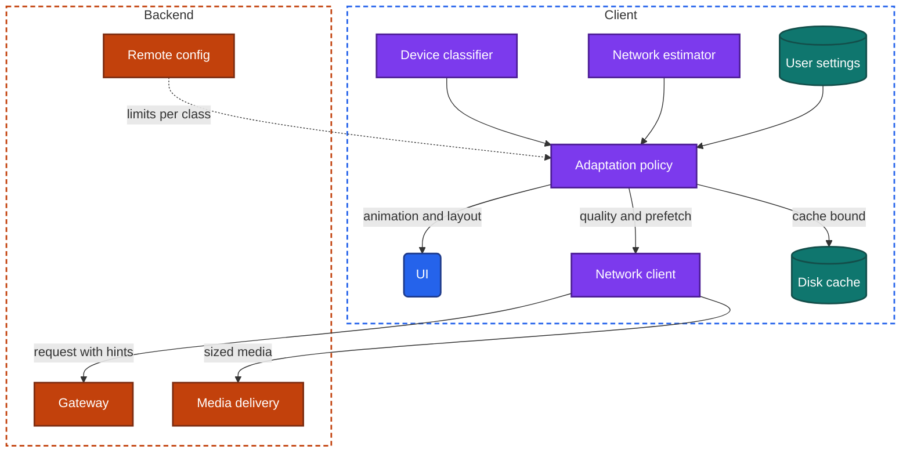
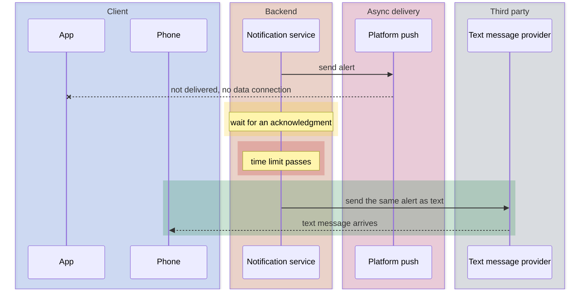

import Probe from '../../../components/Probe.astro';
import Signals from '../../../components/Signals.astro';
import TeardownBar from '../../../components/TeardownBar.astro';
import WorksheetForm from '../../../components/WorksheetForm.astro';

> **The question.** How does this app change for cheap phones and poor networks, and does it change at all?

## 36.1 Why this concern exists

Most teams build on recent, expensive phones and fast, unmetered networks. A large share of the world's users have neither. Their phone has a fraction of the memory and processing power, its storage is small and nearly full, its operating system is several versions behind, and its network is slow, intermittent and paid for by the megabyte.

Two of the seven constraints ([Chapter 2](/part-1-method/2-the-mobile-constraint-set/)) meet here at their extremes. **Limited resources** stops being a matter of tuning and becomes a matter of whether the app runs. [Chapter 35](/part-2-concerns/35-performance-and-resource-budgets/) describes the budgets, and on a constrained device every one of them is a small fraction of what the team is used to. **Unreliable network** stops being an interruption and becomes the normal state. [Chapter 13](/part-2-concerns/13-network-transport-and-resilience/) describes how a client survives a poor network, and here the poor network is all there is.

A third constraint, **slow release**, appears in a specific form. Old devices cannot install new operating system versions, so supporting those users means supporting old platform capabilities for years.

The cost of ignoring the problem is concrete. An app that is too large is never installed. One that needs too much memory is ended by the operating system as soon as the user switches away. One that assumes a fast network shows a spinner and nothing else. For a product whose growth depends on these users, the choice of how to serve them is a product decision as much as an engineering one, and the result is visible in the store before you install anything.

## 36.2 The design space

There are five approaches. They are not exclusive, and a large product often uses several.

**Approach 0. One app, no adaptation.** The same behavior everywhere. This costs nothing to build. On a constrained device the app is slow or unusable, and the team may not know, because its measurements come mostly from users for whom it works.

**Approach 1. One app that adapts.** The app measures the device and the network at run time, places each in a class, and changes its behavior by class: fewer animations, smaller images, no prefetching, features turned off. There is one codebase and one store listing. Every adaptation is a branch that has to be tested, and the app's size stays the same for everyone.

**Approach 2. A separate small variant.** The maker publishes a second app with its own listing, built for small size and low memory. It has fewer features, simpler screens and stricter data use. It shares the backend and the user's account with the full app. The cost is a second client to build, release and keep in step, and a product that differs between users.

**Approach 3. A variant that moves work to the backend.** A small variant taken further. The client becomes a thin display, and rendering, compression or processing that the full app does on the device is done by a backend service. Pages are laid out or compressed on the backend, media is transcoded to exactly what the device needs, and heavy features such as filters or recognition run remotely. The device does less and the client is very small. The cost moves to the backend and to latency: every interaction needs a round trip, on the very network that is least able to provide one.

**Approach 4. Fallbacks outside the app.** For some tasks the answer on a constrained device is not the app. A text message, a voice call or a simple page in the browser reaches a user whom the app cannot. Section 36.9 covers these.

| Approach | App size | Works on low memory | Works on a poor network | Cost to the team | Signature |
|---|---|---|---|---|---|
| 0 No adaptation | Full | Poorly | Poorly | None | Same behavior everywhere, and failure at the edges |
| 1 One adaptive app | Full | Yes, with reduced features | Yes, with reduced quality | Branches to test | Behavior differs between devices and networks |
| 2 Small variant | Small | Yes | Yes | A second client | A second listing in the store |
| 3 Backend does the work | Smallest | Yes | Needs a connection for everything | Backend load, latency | Little works offline. Output looks processed |
| 4 Fallback outside the app | None | Not applicable | Yes | A second channel to run | Text messages or calls carry the task |

The choice between Approach 1 and Approach 2 turns on install size. Adaptation can change everything an installed app does, and nothing about the download a user must complete before the app runs once. When size itself is the barrier, a separate variant is the only answer. When the barrier is behavior, a single adaptive app avoids splitting the product.

## 36.3 Anatomy

Figure 36.1 shows the components of an adaptive app. A small variant uses the same parts with fixed, low settings in place of some run-time decisions.



*Figure 36.1. An adaptive app. Three inputs feed one policy, which sets limits for the components that spend resources.*

The policy has three inputs, and they differ in how often they change.

- **The device class** is decided once, at first launch or at each launch. It does not change while the app runs.
- **The network class** changes from minute to minute and is measured continuously.
- **User settings** change only when the user changes them. They include the device's data-saver mode and low-power mode, and any setting the app offers itself.

```text
function adaptationFor(device, network, settings):
  p = remoteConfig.limitsFor(device.class)    // tuned without a release
  if network.class is poor or settings.dataSaver:
    p.imageQuality = low
    p.autoplay = off
    p.prefetch = off
    p.loadMediaOnTap = settings.dataSaver
  if network.class is offline:
    p.readPolicy = cacheOnly
  if device.freeStorage is low:
    p.cacheBound = small
    p.downloads = askFirst
  return p
```

An explicit user setting ranks above a measurement. A user on a fast network who has turned on data saving is telling the app something about cost that no measurement can detect. The reverse does not hold: a measured poor network reduces quality even when no setting asks for it.

The request to the backend carries hints: the class of the device, the class of the network, and whether the user asked to save data. With these the backend can return fewer items, smaller media addresses or a simpler screen. This is where adaptation becomes cheap for the client. One response field replaces a branch in the app.

## 36.4 Classifying the device

### What the client measures

A device class is a coarse bucket, commonly three: low, middle and high. The client assigns it from properties it can read at run time.

| Input | What it predicts |
|---|---|
| Total memory | How much can be cached and how many screens can stay alive |
| Number and speed of processor cores | Whether animation, decoding and on-device models hold up |
| Screen size and density | The largest image worth downloading |
| Operating system version | Which platform capabilities exist |
| Age of the hardware design | A summary of all of these |
| Whether the system marks the device as low on memory | A direct statement from the platform |

Some designs skip the properties and use a table kept on the backend that maps each device model to a class. This is more accurate, because it can be corrected from real performance measurements ([Chapter 34](/part-2-concerns/34-observability/)), and it needs a default for models the table has never seen.

A third option measures instead of guessing: the app times a small piece of work at first launch and derives the class from the result. This catches a fast phone made slow by age, heat or a full disk.

### What changes by class

| Area | On a low class |
|---|---|
| Motion | Animations shortened or removed. Blur, shadows and transparency replaced with flat fills |
| Media | Lower resolution. No autoplay. Fewer items decoded at once |
| Lists | Simpler rows. Smaller pages ([Chapter 15](/part-2-concerns/15-lists-feeds-and-pagination/)) |
| Memory | Smaller memory cache. Fewer screens kept alive under the current one |
| Features | Heavy features hidden or replaced: camera effects, on-device models, live previews |
| Processing | Work moved to the backend that a high class does on the device |

Features are turned off through remote config and feature flags keyed by class ([Chapter 30](/part-2-concerns/30-remote-config-and-experiments/), Remote config and experiments). That lets the team move a model of phone from one class to another without a release, after the measurements show it struggling.

From outside, the class is invisible on one device. It becomes visible only by comparison: the same account, on the same network, on two devices of different capability. A difference in animation, image sharpness or available features that follows the device and not the account is the signature. P36.8 runs that comparison.

## 36.5 Classifying the network

[Chapter 13](/part-2-concerns/13-network-transport-and-resilience/) covers how a client learns the quality of its network and what it changes in response. This section adds what is specific to networks that are poor all the time.

**Type is a weak signal.** The operating system reports whether the connection is wireless or cellular and which cellular generation. A crowded wireless network can be far slower than a good cellular one. A design that keys on type alone gives full quality to the first and reduced quality to the second, which is backwards.

**Measurement is the strong signal.** The network estimator in Figure 36.1 times the app's own recent requests and tracks throughput and failure rate. It costs nothing extra, because the requests were being made anyway. Its weakness is the first request of a session, for which there is no history. Designs start from the last class seen on this network, or from a cautious default.

**Cost is a separate axis.** A metered network may be fast and still expensive. Speed decides what the app can do. Cost decides what it should do without asking. A design that treats the two as one either wastes a user's money on a fast cellular connection or starves a user on a slow unmetered one.

**The class must not flap.** A network that hovers at a threshold would switch quality back and forth. The estimator therefore changes class only after the measurement has stayed on the far side of a threshold for some time, and it moves down faster than it moves up.

| Network class | Typical behavior |
|---|---|
| Good and unmetered | Full quality, prefetching, autoplay |
| Good and metered | Full quality on request, limited prefetching, autoplay by setting |
| Poor | Low-resolution media, text first, no prefetching, longer timeouts |
| Offline | Cache only, writes queued where the feature supports it ([Chapter 12](/part-2-concerns/12-offline-and-sync/)) |

## 36.6 Data budgets and text first

### Text first

On a poor network the order in which things arrive matters more than the total time. Text is small and carries most of the meaning. A design that sends text and layout first, and media afterwards, gives the user something to read within a second or two. A design that waits for everything shows a spinner for the whole duration.

Text first needs three things. The text and the media must come in separate requests, or the text must come first within one response. The request queue must rank text above media ([Chapter 13](/part-2-concerns/13-network-transport-and-resilience/)). And the layout must reserve the right space for each image before it arrives, so that the text does not jump when the image appears.

### Low-resolution media

Media then loads in stages. A placeholder occupies the space. A very small version of the image follows, often a few hundred bytes carried inside the first response and drawn blurred. The full image for the display size comes last, and on a poor class it may be a lower-quality rendition, or it may not load until tapped. [Chapter 16](/part-2-concerns/16-images/), Images, covers the renditions and the loading sequence. [Chapter 17](/part-2-concerns/17-audio-and-video-playback/), Audio and video playback, covers the equivalent for video.

### A data-saver setting inside the app

The device has a data-saver mode that applies to every app. Many apps add their own. This chapter calls the second kind an in-app data saver, to keep it apart from the device setting. It exists because the app knows what its own data goes on and can offer finer choices.

| Control | What it changes |
|---|---|
| Media quality | The rendition requested, sometimes per network type |
| Autoplay | Never, on unmetered networks only, or always |
| Load images on tap | Images become placeholders with a size label |
| Automatic download of attachments | By media type and by network type |
| Prefetching | Off, or on unmetered networks only |
| A data use screen | A count of what the app has sent and received |

The granularity of these controls tells you about the internals. A single switch means one flag read by the adaptation policy. Separate choices by media type and network type mean the policy already reasons in those terms. A screen that counts data used means the network client meters its own traffic.

A data budget goes one step further. The app holds itself to a quota, for example an amount of prefetching per day on a metered network, and stops optional work when the quota is spent. This is invisible except in the totals over time ([Chapter 35](/part-2-concerns/35-performance-and-resource-budgets/)).

Showing the cost before spending it is a related design. A download control labeled with its size, or a video that states its size before it plays, hands the decision to the user. An app that does this was built for users who count megabytes.

## 36.7 Small variants

### What a small variant removes

A small variant is defined by its size limit, and everything else follows from it.

- **Bundled resources.** Fewer images, fonts and animations in the install. More is drawn with plain shapes and system fonts.
- **Features.** The long tail of features is left out. What remains is the core loop of the product.
- **Third-party libraries.** Each library adds size. A small variant carries few.
- **On-device processing.** Media editing, recognition and ranking move to the backend or are dropped.
- **Motion.** Transitions are minimal.

Some small variants are a thin shell around web content. The shell supplies the icon, notifications and storage, and pages supplied by the backend supply the screens. [Chapter 32](/part-2-concerns/32-ui-technology-native-cross-platform-and-web/), UI technology: native, cross-platform and web, covers how to tell.

### What it keeps

The account, the data and the backend are the same. A message sent from the small variant arrives in the full app. This is what you can establish most firmly: sign in to both with one account, and the same data appears. It follows that the backend serves both through a compatible API, and that the differences between the two are differences of client only.

A small variant is also not merely the full app with a flag set. It has its own listing, its own size, its own version numbers and its own release dates. Those are all visible in the store, and P36.1 and P36.2 read them.

### When the backend does the work

Approach 3 moves the heavy steps across the network.

- **Rendering.** The backend lays out a page or compresses it into a compact form and the client only draws it. A scroll may need a new request, and nothing works offline.
- **Media.** The backend transcodes each image or video to exactly the device's screen and the current network class, more aggressively than the full app accepts. Images look visibly compressed.
- **Processing.** Recognition, translation, filters and search run remotely. The feature shows a wait and needs a connection where the full app answers at once.

The observable difference is where waiting happens. In the full app a filter applies instantly and works in airplane mode. In a backend-processing variant the same filter shows progress and fails offline. Running one feature in both, offline, separates the two designs with an Inferred claim.

## 36.8 Low storage and old operating systems

### Low storage

A nearly full device is a normal condition for the users this chapter concerns. It causes failures of a kind that fast phones never show.

- **Writes fail.** A local store that cannot write may refuse new data, or in a poor design, corrupt what it has. A sound design checks free space before large writes and handles a failed write as an expected result.
- **The cache disappears.** The operating system reclaims cache space, so the app refetches what it had, spending data the user also lacks.
- **Updates cannot install.** The user stays on an old version for want of space ([Chapter 33](/part-2-concerns/33-releases-and-compatibility/), Releases and compatibility).
- **Downloads stop part way.** A resumable transfer continues later. A simple one starts again.

Designs for low storage keep the install small, bound every cache tightly, and scale the bound to free space. They give the user a storage screen inside the app that lists what is kept by kind and size, with controls to remove each. That screen is the clearest signal available: a team builds it only when its users run out of space. Some apps also offer to move downloads to removable storage where the device has it, or to delete media already backed up.

Do not fill your own device to test this. A full device can lose data in other apps and fail to take photos or receive messages. The probes read the app's storage controls, and observe low-storage behavior only if your device is already in that state.

### Old operating system versions

Each app states a minimum operating system version. The store listing shows it, and it is a direct published statement of how far back the team supports.

| Policy | What a user on an old device sees |
|---|---|
| Low minimum, one app | The current app installs. Newer capabilities are absent or replaced |
| High minimum | The app is not offered, or the store says it is incompatible |
| Last compatible version | The store offers an older version of the app, which no longer updates |
| Small variant with a lower minimum | The full app is not offered and the variant is |

Supporting an old version means every use of a newer platform capability is guarded by a check, with a fallback: a simpler widget, no rich notification, a plainer sign-in. Each guard is a branch to test, which is why teams raise the minimum once the share of users on old versions is small.

A user left on a last compatible version continues to call the backend with an old client. The backend must keep serving that API until it retires the version with a forced-update gate, which for these users ends the product, because they cannot update. [Chapter 33](/part-2-concerns/33-releases-and-compatibility/) covers that decision.

## 36.9 Fallbacks outside the app

Some tasks must succeed even when the app cannot run or cannot reach the backend. Designs route them through channels with weaker requirements than a data connection.

| Channel | Used for | Why it works |
|---|---|---|
| Text message | Sign-in codes, alerts, receipts, simple commands | Needs only cellular signaling, not a data connection |
| Voice call | Codes read aloud, confirmation by an automated call | Works on the oldest phones and for users who cannot read the text |
| A plain page in the browser | Tracking a delivery, viewing a ticket, paying | Needs no install |
| A code shown on screen or printed | Tickets, pickup, payment at a counter | Needs no network at the moment of use |
| Transfer between nearby devices | Sharing files or the app itself | Needs no network at all |

The most common fallback is for delivery of something urgent. Platform push needs a working data connection and a device the push service can reach. When the backend sends a push and receives no acknowledgment from the client within a time limit, it sends the same information as a text message.



*Figure 36.2. A fallback from platform push to a text message when no acknowledgment arrives.*

The signature is a text message that arrives a fixed interval after the event and repeats what a notification would have said. If both arrive, the acknowledgment was lost or the design sends both without checking. Text messages cost the maker money for each one sent, so a design that uses them freely has decided that the task is worth it.

## 36.10 Probes

P36.1 to P36.3 read the store and the settings and take minutes. P36.4 and P36.5 apply a constraint to the network. P36.6 and P36.7 are passive. P36.8 and P36.9 need a second, older device and are optional.

<TeardownBar />

### P36.1 Look for a small variant

<Probe id="P36.1" />

### P36.2 Compare the variant with the full app

<Probe id="P36.2" />

### P36.3 In-app data controls

<Probe id="P36.3" />

### P36.4 Device data-saver mode

<Probe id="P36.4" />

### P36.5 Weak connection

<Probe id="P36.5" />

### P36.6 Storage controls

<Probe id="P36.6" />

### P36.7 Fallback channels

<Probe id="P36.7" />

### P36.8 Two classes of device

<Probe id="P36.8" />

### P36.9 Old operating system

<Probe id="P36.9" />

## 36.11 Signal-to-design table

<Signals chapter={36} />

## 36.12 The backend this implies

Adaptation on the client depends on choices the backend offers.

- **Media in many renditions.** Media delivery must serve each image and video at several sizes and qualities, including very small ones, and must produce a tiny preview that can travel inside a response.
- **Responses that take hints.** The gateway accepts the device class, network class and data-saver state, and services return fewer items, lighter media addresses or simpler sections accordingly. With server-driven UI ([Chapter 31](/part-2-concerns/31-server-driven-ui/), Server-driven UI) the backend can send a different screen to a low class.
- **Remote config by class.** Limits and feature flags keyed by device class and by region, and a table of device models where that design is used.
- **One API for two clients.** A small variant and a full app share accounts and data, so the API must serve both, and each has its own old versions in the field.
- **Processing services.** For Approach 3, services that render, compress or process on behalf of the client, placed close to users so that the added round trip is short.
- **A second delivery channel.** For fallbacks, a provider of text messages or calls, delivery acknowledgments from the client so that the backend knows when to fall back, and a rule that prevents sending both.
- **Long support for old clients.** Users on a last compatible version call old API versions indefinitely.
- **Measurements split by class.** Without performance data from low-class devices and poor networks, the team cannot see the users this chapter concerns.

## 36.13 Failure modes and what they reveal

- **A spinner with nothing else on a slow network.** No text-first ordering. The screen waits for one large response or for its media.
- **Text jumps as images arrive.** The layout did not reserve space, so the response does not carry image dimensions.
- **Sharp images that take very long on a poor network.** One rendition for all networks. The network class is not measured, or not used.
- **Full quality on a slow wireless network and low quality on fast cellular.** The class is taken from the network type and not from measurement.
- **Quality switches back and forth every few seconds.** The estimator has no damping at its threshold.
- **The app restarts whenever you switch away, on an older phone only.** Memory use is not scaled to the device class ([Chapter 35](/part-2-concerns/35-performance-and-resource-budgets/)).
- **An error or a crash when saving on a nearly full device.** Free space is not checked and a failed write is not handled.
- **A notification and a text message with the same content.** A fallback that fires without checking for an acknowledgment.
- **A feature of the small variant that stops in airplane mode while the full app's version works.** That feature's processing was moved to the backend.
- **The store offers an old version that then shows a forced-update gate.** The backend retired a version that some devices can never leave.

## 36.14 Worksheet entries

These are the fields this chapter adds to the teardown worksheet. Record which devices and networks you tested on, since every claim here is a comparison.

<TeardownBar />

<WorksheetForm chapters={[36]} />

## 36.15 Summary

- Constrained devices and networks turn limited resources and the unreliable network from tuning problems into the question of whether the app runs.
- There are five approaches: no adaptation, one adaptive app, a separate small variant, a variant that moves work to the backend, and fallbacks outside the app. Products combine them.
- An adaptive app feeds a device class, a network class and user settings into one policy. A user's explicit setting ranks above any measurement.
- The device class shows only by comparing two devices on one account. The network class shows as quality that follows measured speed, not network type.
- Text first, staged low-resolution media and an in-app data saver are the visible parts of a data budget. The granularity of the controls mirrors the policy inside.
- A small variant has its own store listing, size and versions, and shares the account and backend. Running one feature offline in both shows whether its work moved to the backend.
- A storage screen inside the app, a low minimum operating system version and text message fallbacks each show that the team designed for these users.
- Never fill your own device to test low storage. Read the app's controls, and observe only what your device already does.
