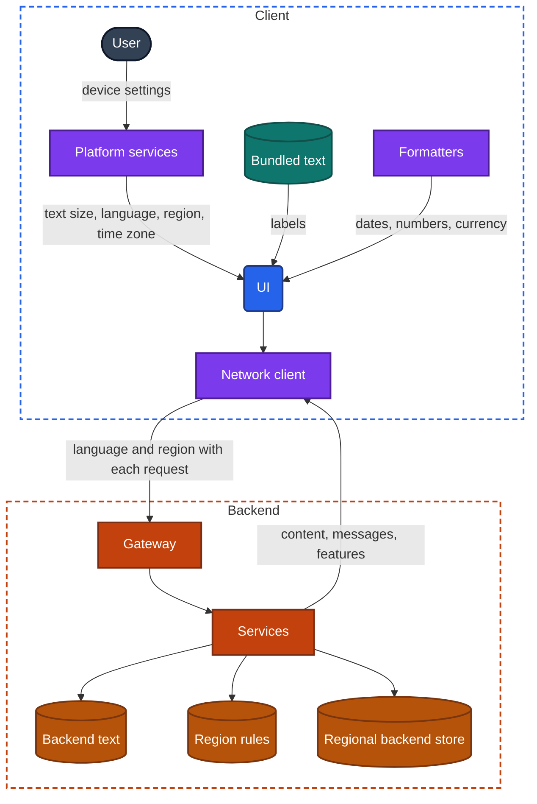
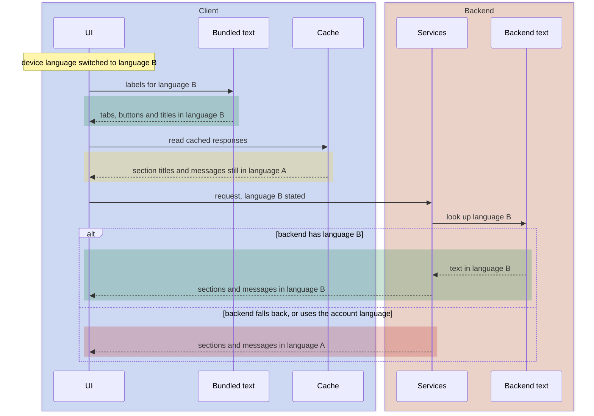

import Probe from '../../../components/Probe.astro';
import Signals from '../../../components/Signals.astro';
import TeardownBar from '../../../components/TeardownBar.astro';
import WorksheetForm from '../../../components/WorksheetForm.astro';

> **The question.** How does this app adapt to different users, languages, regions and devices?

## 37.1 Why this concern exists

A team designs an app on a handful of devices, in one language, with good eyesight and steady hands. The app is then used by people who cannot see the screen, who read at twice the default text size, who read from right to left, who live eleven time zones away, and who unfold the device into a tablet halfway through a task.

Three of the seven constraints ([Chapter 2](/part-1-method/2-the-mobile-constraint-set/)) shape the response.

- **Human attention.** The constraint assumes one small screen and a user who looks at it. Some users do not look at it at all, and listen instead. Others need larger text, stronger contrast or less motion to use it. The screen is also no longer one size.
- **Platform rules.** The operating system owns the settings through which a user states these needs: text size, screen reader, appearance, motion, language, region and time zone. An app adapts by reading them. Stores and regulators add rules that differ by country, and some of them make accessibility a legal requirement.
- **Slow release.** Text compiled into the app is fixed until the next release. A wrong translation, or a legal sentence that must change in one country, cannot wait for that. So some text moves to the backend, and the split is visible.

This concern has an unusual property for a teardown. Its probes are settings switches. Each takes a minute, costs nothing, and the result is plainly visible. That makes most findings here Observed. The inferences come afterwards, when you ask what a result says about where text lives, where times are formatted and who decides what a region may see.

The two halves of the chapter are one subject. Accessibility adapts the app to the person. Global reach adapts it to the person's language, place and device. Both depend on the same engineering habit: nothing about the user is assumed, and everything is read from a setting or from the backend at run time.

## 37.2 The design space

For every adaptation in this chapter, the design question is the same: who decides? There are four answers. They form a ladder, and an app sits on different rungs for different adaptations.

**Fixed.** The app has one text size, one appearance, one language, one layout. Nothing is read from the device. This costs nothing to build and excludes users silently. Teams end up here by default, not by choice, usually for a first version in one market.

**Platform-driven.** The app reads the device's settings and lets the platform's toolkit do the work. Text uses the system's text styles and grows with the system setting. Controls carry labels that the screen reader speaks. Layout is declared in terms of leading and trailing edges, so that the toolkit mirrors it for right-to-left languages. Dates and numbers go through the platform's formatters. This is the cheapest correct design, because the operating system already contains the hard parts. Its cost is discipline. Every screen must use the system's mechanisms and never a fixed size, a fixed direction or a hand-built date string.

**App-driven.** The app has its own settings that override the device's: an in-app language picker, an in-app theme, an in-app text size. Teams choose this where users commonly run the device in one language and want the app in another, or where the app serves shared devices. The cost is that every adaptation is now the app's job, including the parts the platform would have handled.

**Backend-driven.** The backend decides, using what it knows about the account and the request: the language of content, the currency, which features exist, which legal terms apply, and sometimes fully formatted strings. This is the only design that can change an adaptation without a release, and the only one that can enforce a rule the client must not be trusted with ([Chapter 21](/part-2-concerns/21-security-and-trust/), which asks what the backend refuses to trust the client with). Its cost is a network dependency, and a second source of text and formats that can disagree with the first.

| Decided by | Changes without a release | Works offline | Follows device settings | Typical for |
|---|---|---|---|---|
| Fixed | No | Yes | No | First versions, single-market apps |
| Platform | No | Yes | Yes, at once | Text size, screen reader, appearance, layout direction, formats |
| App | No | Yes | Only when the app's own setting says so | Language and theme pickers |
| Backend | Yes | Only what was cached | Only if the client sends them | Content text, currency, region features, legal terms |

**The rung belongs to the adaptation, not to the app.** One app usually has platform-driven text size, an app-driven theme, bundled labels, backend-driven content and backend-driven region rules. The interesting findings are the places where two rungs meet and disagree.

## 37.3 Anatomy

Figure 37.1 shows the inputs an app can adapt to and the two places where text and rules live.



*Figure 37.1. Device settings enter through platform services. Text and rules live in two places, the app and the backend.*

Three things in this figure carry the chapter.

First, the device settings are several independent inputs, not one. Language, region and time zone are separate settings. A user can run the device in one language, with another country's formats, in a third country's time zone. An app that derives all three from one of them is making an assumption you can expose.

Second, text has two homes. Bundled text ships inside the app and follows the device language at once, offline. Backend text arrives in responses and follows whatever language the backend chose. Section 37.5 is about telling them apart.

Third, the backend learns the user's language and region only from what the client sends and what the account records. The client usually sends the device language with each request. What the backend does when that conflicts with the account's stored language is a design decision, and a probe finds it.

## 37.4 Accessibility

### The screen reader

A screen reader does not read pixels. It reads a structure the UI publishes: a list of elements, each with a name, a role, a state and a position in an order. A user moves through that list by swiping and acts on the focused element. The quality of an app's support is the quality of that structure. Four properties matter.

- **Labels.** Every control needs a name. Text buttons have one for free. Icon buttons do not, and a developer must supply it. A missing label is announced as "button" with nothing else, or as an image's internal name.
- **Order.** The reading order should follow the visual and logical order. Custom layouts, overlays and absolute positioning scramble it.
- **Grouping.** A list row with a title, a subtitle, a price and a badge is one thing to a sighted user. Announced as four separate stops, a list of fifty rows takes two hundred swipes. A well-built row is one element with a combined description, and its secondary actions are offered as actions on that element.
- **Custom controls.** A control from the platform's toolkit announces its role and state by itself. A control the team drew, such as a custom slider, a star rating or a swipeable card, announces nothing unless the team adds role, value and actions by hand.

There is also a fifth, which is easy to miss: **change**. When content updates without the user acting, such as an error appearing or a list finishing its load, the screen reader user learns of it only if the app announces it. A modal must also trap focus inside itself, or the user swipes into the screen behind it.

What screen reader support reveals about the drawing path is the subject of [Chapter 32](/part-2-concerns/32-ui-technology-native-cross-platform-and-web/). Here the question is simpler: could a person complete the app's main task with the screen off?

### Text scaling

The system text size is a multiplier the user sets once for the whole device. An app honors it in three steps, and many stop after the first.

1. **Text grows.** The app uses the system's text styles and not fixed sizes.
2. **Layout survives.** Rows grow taller, labels wrap onto more lines, side-by-side elements stack, and every screen scrolls. A layout built with fixed heights clips the larger text or lets it overlap its neighbors.
3. **Nothing is lost.** Truncated text can still be reached in full. Fixed bars do not grow until they cover the content.

Outcomes follow from the family of design. Fixed heights give clipped text. A cap on scaling gives text that grows a little and then stops. Reflow gives a longer, fully usable screen. Text scaling is also a rehearsal for translation, because both make strings longer. A layout that breaks at large text will break in a language whose words are longer.

### Contrast, dark appearance and reduced motion

Dark appearance is implemented by naming colors by purpose, such as background, primary text and separator, and giving each name a light and a dark value. An app built this way switches at once when the system setting changes. An app that was painted with fixed colors has no dark appearance, or has one bolted on behind an in-app setting, with stray screens that stay light. A screen that stays light inside a dark app is often embedded web content or a third-party screen.

Contrast is a property of those color pairs. Gray text on a slightly lighter gray is the common failure. The platform also offers an increased-contrast setting, which few apps read.

Reduced motion is a system setting that asks apps to replace large movement, such as sliding, zooming and parallax, with a fade or nothing. Autoplaying video and looping animation fall under the same request. An app either reads the setting or does not. When it does, the team has a central place where motion is defined.

### Touch targets

Each platform publishes a minimum target size, large enough for a fingertip. The drawn icon can be smaller, as long as the tappable area around it is not. Small targets packed together, or an icon whose tappable area is only its own pixels, show that no shared control enforces the minimum. You can judge this without tools. Count how often you miss.

## 37.5 Language and text

### Bundled text and backend text

Bundled text is a table inside the app. It maps a key to a string for each language the app ships. The UI asks for a key, and the platform picks the row for the device language. It is instant, works offline and changes only with a release.

Backend text arrives in responses. It includes content, which was always going to come from the backend, and often much more: section titles from server-driven UI ([Chapter 31](/part-2-concerns/31-server-driven-ui/), which asks how much of the screen the backend decides), error messages, notification text, promotions, onboarding copy and legal documents. The backend picks the language from a request header, from the account's stored preference or from the region.

Some apps treat all text as backend text. They download the string table at launch and keep it in a cache, which lets them fix a translation without a release. The table bundled in the app is then only a fallback.

### The mixed-language signal

Switch the device language and the two kinds of text separate. This is the most informative probe in the chapter, and Figure 37.2 shows why.



*Figure 37.2. After a language switch, bundled text changes at once and backend text follows its own rules.*

Read the result as a map. Everything that changed at once, with no network, is bundled. Everything that changed after a refresh is backend text keyed to the request. Everything that stayed in the old language is one of three things: backend text keyed to the account, backend text with no translation, or a cached response that has not been refetched. Refresh, then sign out and in, to separate the three.

The pattern is often telling. Navigation in the new language with section headings in the old one points to a screen-describing response ([Chapter 10](/part-2-concerns/10-api-shape/)). Error messages in the old language mean the backend writes the errors. A notification in the old language means push text is composed on the backend from the account's stored language, at a time when the device cannot be asked.

### Fallback

No app has every string in every language. Each lookup therefore runs down a chain.

```text
function resolve(key, preferences):
  // preferences: the user's ordered list, for example a regional variant, then its base language
  for language in preferences:
    if table[language] has key: return table[language][key]
    if table[baseOf(language)] has key: return table[baseOf(language)][key]
  return table[defaultLanguage][key]       // the language the team writes in
```

The chain runs per string, not per screen. A single untranslated label in an otherwise translated screen is a string added after the last translation pass. It shows that release and translation run on different schedules. The language of that stray label is the team's default language.

Translation is more than word replacement. Plural forms differ by language, and some have several. A message built by joining fragments, such as a number, then a noun, then a verb, comes out in the wrong order in languages with a different word order. Both failures are visible to a reader of the language, and both show strings assembled in code.

### Right-to-left layout

In a right-to-left language the whole layout mirrors. The back control moves to the right. Lists align right. A swipe to go back starts from the other edge. Progress bars fill from right to left. Icons that imply direction, such as arrows, flip. Things that do not imply reading direction stay as they are: media playback controls, clocks, phone numbers, and images.

The platform's toolkit does most of this when layouts are declared with leading and trailing edges. Hard-coded left and right survive as defects: an arrow that points the wrong way, padding on the wrong side, an animation that slides in from the wrong edge. Partial mirroring is a reliable sign of older screens next to newer ones.

Mixed-direction text is the hard case. A right-to-left sentence that contains a product name or a number in left-to-right script must be laid out in both directions at once. Misplaced punctuation at the end of such a line shows text that was assembled without direction marks.

## 37.6 Formats and time

### Dates, numbers and currency

Language and region are separate inputs, and formats belong to region. The same language is written with different date orders, decimal separators, first days of the week and measurement units in different countries. An app that uses the platform's formatters picks these up from the device's region setting. An app that builds its own strings shows one fixed format everywhere.

Currency has two parts that are decided in different places. Which currency a price is in, and how much, is a business decision made by the backend. How the amount is written, with its symbol position and separators, is a format, and belongs to the user's region. A backend that sends a finished string, such as a price with symbol and separators, has taken the second decision too. You can tell, because the price then ignores a change in the device's region.

| What you see after changing only the region | Where the format is made |
|---|---|
| Dates, numbers and the first day of the week change at once | On the client, by the platform's formatters |
| They change after a refresh | On the backend, from the region the client sends |
| They never change | On the backend from the account, or hard-coded in the client |

### Time zones

A moment in time is one value everywhere. The correct design stores it as an absolute instant and formats it in the device's current time zone at the moment of display. Change the time zone, and every timestamp shifts.

Three kinds of time must not shift, and they separate careful designs from simple ones.

- **A time at a place.** A flight departure, a restaurant booking or a store's opening hours belong to the place's time zone. The app should show that local time and say so, wherever the device is.
- **A wall-clock time.** A daily alarm at seven means seven wherever the user wakes up. It is stored without a zone.
- **A calendar date.** A birthday is a date, not an instant. Stored as midnight in one zone, it shows as the day before in zones to the west.

Day boundaries are the subtle case. A streak, a daily limit or a "today" section needs a definition of when a day ends. The device's zone, the account's home zone and a single global zone are all in use. Each produces a different result for a traveler, and [Chapter 12](/part-2-concerns/12-offline-and-sync/) covers what happens when the clock itself is wrong.

## 37.7 Regions

A region changes more than formats. It can change the catalog, the prices, the payment methods, which features exist, the minimum age, the consent prompts and the legal terms. These are backend decisions, because the client is untrusted and because they change with the law.

The first question is which signal the backend uses to place a user. There are several, and they can disagree.

| Signal | What it is | Why a team uses it |
|---|---|---|
| Store account country | The country of the account that installed the app | It decides which listing and which payments the store offers |
| Account country | Chosen or verified at sign-up | It is stable, and it ties to legal identity |
| Device region setting | A preference, freely changeable | It is a formatting hint, and rarely trusted for rules |
| Network location | The country the request arrives from | It reflects where the user is now, which licensing rules often require |
| Phone number or payment method | The country of a verified number or card | It is hard to fake |

Changing the device's region setting is the only one of these a probe can safely change. If features change with it, the app trusts a client setting for a region rule, which is a weak design. If nothing changes, the rule is keyed to one of the other signals, and you cannot tell which without travelling. Do not attempt to disguise your network location. That defeats a protection, and it is outside the method.

Legal terms and consent are published text, and you can read them. A terms document that names a specific country's law, a consent prompt that appears only for some regions ([Chapter 22](/part-2-concerns/22-privacy-permissions-and-consent/), which asks what the app asks to access and what it does when refused), and a settings screen with region-specific controls such as a data export or deletion request all show a backend that holds rules per region.

### Where data is stored

Some laws require that personal data stay within a country or region. A backend that complies runs separate backend stores per region and routes each account to its own. This is invisible from outside. The hints are indirect: an account that must be created anew to move countries, a sign-in screen that asks for a region first, a published statement in the privacy policy, or a feature that cannot find users from another region. Each hint has other explanations. Any claim about where data is stored is Speculative unless the maker has published it, in which case you record the statement and its source.

## 37.8 Screen sizes, foldables and tablets

A phone in portrait is one of many windows an app must fill. The same app runs on a tablet, in a split view beside another app, on a foldable that changes size while in use, and in landscape.

There are three designs.

- **Locked.** The app runs in portrait at phone size only. On a larger screen it is stretched or shown in a letterbox.
- **Stretched.** The phone layout fills the wider window. Rows become very long and images very large.
- **Adaptive.** The layout changes structure at certain widths. A list and its detail screen sit side by side. A tab bar becomes a side rail. A grid gains columns.

An adaptive app must also keep its state across the change. Unfolding a device or rotating it is, on some platforms, a rebuild of the screen. Navigation state, view state and typed input have to survive it. [Chapter 9](/part-2-concerns/9-state-and-ui-data-flow/) and [Chapter 8](/part-2-concerns/8-navigation-deep-links-and-screen-state/) cover the mechanisms. A list and detail pair that becomes two panes also shows how navigation state is modeled. When it is one tree that the layout renders in one or two panes, the selected item stays selected across the change. When the two-pane layout is a separate screen, the selection is lost.

## 37.9 Probes

Every probe here is a settings change, so run them in the order of least disruption: P37.1, P37.3 and P37.4 first, then the screen reader, then language, region and time zone. Change one setting at a time and restore it before the next. Select the outcome you saw in each probe, and it is recorded in your worksheet for the teardown chosen here.

<TeardownBar />

### P37.1 Large text

<Probe id="P37.1" />

### P37.2 Screen reader task

<Probe id="P37.2" />

### P37.3 Dark appearance

<Probe id="P37.3" />

### P37.4 Reduced motion

<Probe id="P37.4" />

### P37.5 Switch the language

<Probe id="P37.5" />

### P37.6 Right-to-left

<Probe id="P37.6" />

### P37.7 Change the region

<Probe id="P37.7" />

### P37.8 Change the time zone

<Probe id="P37.8" />

### P37.9 Rotate or resize

<Probe id="P37.9" />

### P37.10 Read the regional terms

<Probe id="P37.10" />

## 37.10 Signal-to-design table

<Signals chapter={37} />

## 37.11 The backend this implies

- **Bundled text only.** Nothing. The backend sends identifiers and numbers, and the client words them.
- **Backend text.** A store of text per language, a rule for choosing the language of a response, and a fallback when a translation is missing. If the choice comes from the request, every cache between client and backend must keep languages apart, or one user receives another's language ([Chapter 11](/part-2-concerns/11-local-storage-caching-and-prefetching/)).
- **Notifications in the user's language.** The backend stores a language per account or per device, updated when the client reports a change. A notification in the old language after a switch shows that the stored value was not updated.
- **Formats made on the backend.** The backend knows the user's region and time zone, and formats with them. This suits text that leaves the app, such as email and notifications. Inside the app it produces values that ignore device settings.
- **Times.** Instants are stored in one global reference and formatted late. Times at a place are stored with the place's zone. The backend needs both types, and an API that says which is which.
- **Region rules.** A service that maps an account or a request to a region, and a table of what each region allows. It is evaluated on the backend for every request that matters, since the client's claim cannot be trusted.
- **Regional storage.** Possibly a backend store per region with routing in the gateway. Speculative from outside.

## 37.12 Failure modes and what they reveal

- **A button announced only as "button".** An icon control with no label. Nobody on the team ran the screen reader on that screen.
- **Screen reader focus moves into the screen behind a modal.** The modal is drawn over the screen without telling the platform that the content under it is inactive.
- **Clipped or overlapping text at large sizes.** Fixed-height layouts. The same screens will break under long translations.
- **One light screen in a dark app.** A screen from another drawing path or another team, outside the shared color definitions.
- **One label in another language.** A string added after the last translation pass, resolved by fallback to the team's default language.
- **Section titles or errors in the old language after a switch.** Backend text, keyed to the account or cached.
- **A sentence with its parts in the wrong order.** A message assembled from fragments in code.
- **An arrow pointing the wrong way in a right-to-left language.** A hard-coded direction in a layout or an image that was not marked for mirroring.
- **A price that ignores the device's region format.** The backend sends prices as finished strings.
- **A birthday or due date one day off.** A calendar date stored as an instant and shifted by a time zone.
- **An event shown at the wrong hour after travel.** A time at a place converted to the device's zone.
- **A streak lost on a flight.** The day boundary follows the device's zone, or a zone the user was not told about.
- **A lost selection or cleared form after unfolding.** The screen was rebuilt for the new size and its state was not carried over.

## 37.13 Worksheet entries

These are the fields this chapter adds to the teardown worksheet. Probe outcomes fill some of them in. Fill the free-text fields with the places where two sources of text or format disagreed.

<TeardownBar />

<WorksheetForm chapters={[37]} />

## 37.14 Summary

- Every adaptation is decided by one of four parties: nobody, the platform, the app or the backend. An app sits on a different rung for each adaptation.
- Screen reader support is a published structure of labels, order, grouping and roles. Custom controls and icon buttons are where it fails.
- Text scaling has three steps: text grows, layout survives, nothing is lost. A layout that fails at large text will fail under translation.
- Switching the device language separates bundled text from backend text. What stays in the old language maps the backend's share of the screen.
- Language, region and time zone are independent inputs. Changing one at a time shows where formats are made and what timestamps really are.
- Region rules are backend decisions keyed to a signal the user cannot easily change. Only the device's region setting can be probed safely.
- Where data is stored by region leaves no reliable signature. Mark it Speculative, or cite what the maker published.
- Rotation, resizing and unfolding test both the layout and the survival of state across a rebuild.
