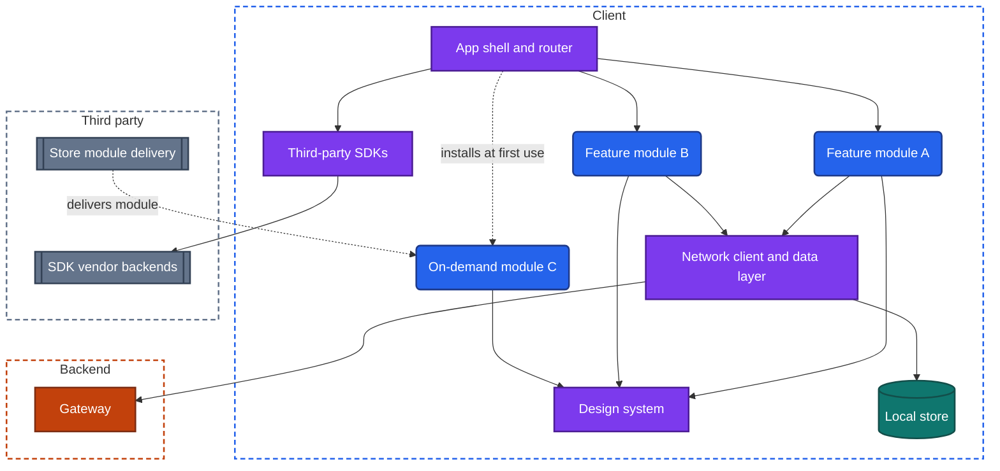
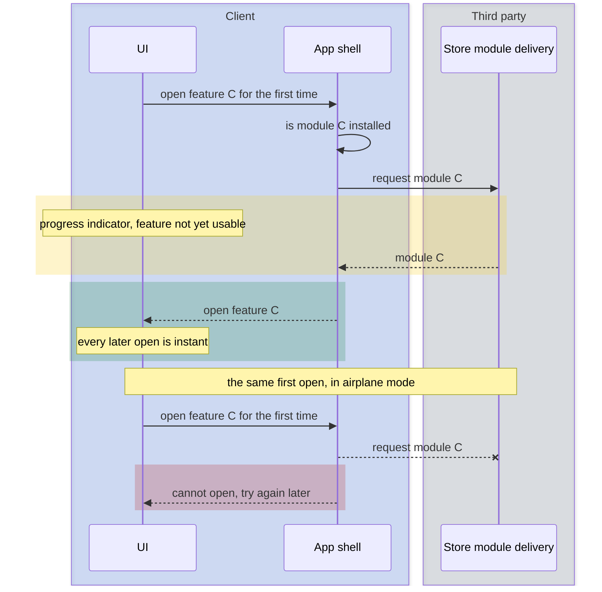

import Probe from '../../../components/Probe.astro';
import Signals from '../../../components/Signals.astro';
import TeardownBar from '../../../components/TeardownBar.astro';
import WorksheetForm from '../../../components/WorksheetForm.astro';

> **The question.** What does this app's shape tell you about the code and the organization behind it?

## 38.1 Why this concern exists

An app is one installed thing. A user downloads one package, sees one icon and runs one process. Behind a large app there may be forty teams, a few hundred engineers and a dozen outside vendors, all of whose code is linked into that one process. The other concern chapters ask how a feature works. This one asks how the work was divided, and what the division left behind in the product.

Four of the seven constraints ([Chapter 2](/part-1-method/2-the-mobile-constraint-set/)) make the division hard on mobile in ways it is not on a backend.

- **Slow release.** A backend team deploys its own service when it is ready. Every mobile team ships in the same package on the same date. One team's defect delays or breaks everyone's release.
- **Limited resources.** Every team's code, and every SDK a team adds, shares one startup, one memory limit and one app size. Costs add up in a way no single team sees.
- **Platform rules.** The store reviews the whole app and holds the maker responsible for all of it, including code the maker did not write. The store also requires a public statement of the data the app collects.
- **Untrusted client.** Third-party code runs inside the app's process with the app's permissions. The maker trusts it with everything the app can reach.

The evidence in this chapter comes in two grades, and the difference matters more here than anywhere else in the book. Some facts are published by the maker: the licenses screen, the store's privacy listing, the version history. You can read them, and what they say is Observed. Everything else is inference from texture: where the app is consistent, where it is not, how large it is, how it changes. Those claims are Inferred at best. And a good part of this subject leaves no trace at all. Section 38.10 lists it plainly.

## 38.2 The design space

A codebase can be divided in five ways. Each is the answer to a larger team.

**One module.** All code is compiled together. Any part can call any other part. This is the right design for a small team, and it is fast to work in. It stops scaling when build times grow and when changes in one area break another without warning.

**Layered modules.** The code is cut horizontally: a UI layer, a domain layer, a data layer, each a module. Dependencies point one way. This enforces the architecture, and does nothing for team independence, because every feature touches every layer.

**Feature modules.** The code is cut vertically. Each feature, such as search, checkout or profile, is a module with its own UI, screen state and logic. Features do not depend on each other. They depend on shared modules beneath them: the design system, the network client, the local store, navigation. Each feature module has an owner. This is the common design for a large app, because it lets a team build and test its feature without building the rest.

**On-demand modules.** Some feature modules are left out of the installed package. The store delivers them later, at first use or when the device meets a condition. The base app is smaller, and the price is a download at an awkward moment and a feature that may be absent offline.

**Hosted mini-programs.** The app becomes a container. Features are small programs fetched from the backend and run inside a runtime the container provides, written by many teams or by outside companies. Each ships on its own schedule. [Chapter 53](/part-3-archetypes/53-super-apps-and-mini-programs/) covers this archetype.

| Design | Team independence | Release coupling | App size | What a user may notice |
|---|---|---|---|---|
| One module | None | Total | Whatever the code needs | Nothing |
| Layered modules | Low | Total | Same | Nothing |
| Feature modules | High in development | Total. One package, one date | Same | Seams between areas |
| On-demand modules | High | Total for the base, loose for modules | Smaller base, grows with use | A download at first use |
| Hosted mini-programs | Very high | Loose | Small container, content from the network | Areas that load, look and behave like separate products |

The first three designs produce the same binary behavior. A user cannot tell a well-kept single module from forty feature modules by any direct observation. What a user can see is the human consequence of the division. Different teams make different choices, and the places where their work meets do not quite match.

## 38.3 Anatomy

Figure 38.1 shows a feature-module app. The arrows are dependencies: who is allowed to call whom.



*Figure 38.1. Feature modules over shared modules. No arrow runs between two features.*

Three properties of this figure produce everything you can observe.

First, features do not depend on each other. Feature A cannot call a function in feature B. To open one of B's screens it asks the router for a route ([Chapter 8](/part-2-concerns/8-navigation-deep-links-and-screen-state/)). To learn that B changed an item it must read a shared store or receive a change event ([Chapter 9](/part-2-concerns/9-state-and-ui-data-flow/)). When that shared layer is missing, the two features hold separate copies and disagree. A stale value across two areas of an app is often a module boundary showing through.

Second, everything the features share sits beneath them, and what sits there is a choice. A feature that draws its own buttons, makes its own requests or keeps its own cache, where the shared modules would have served, behaves differently from its neighbors. Each such difference is a signal.

Third, third-party SDKs are modules the maker does not control. They talk to their own backends, which appear in the universal app model as third parties ([Chapter 3](/part-1-method/3-the-universal-app-model/)).

## 38.4 Boundaries you can see

### Inconsistency as a sign of team boundaries

A system's structure tends to copy the communication structure of the organization that built it. Two engineers on one team settle a question in a conversation. Two teams settle it in a meeting that may never happen. So the product is consistent inside a team's area and inconsistent across areas.

Look for differences in things no user would ask to be different.

| What differs between areas | What it suggests |
|---|---|
| The look of buttons, spacing, typefaces, icons | An area built outside the design system, or before it existed |
| How loading is shown: a skeleton in one place, a spinner in another | Separate UI conventions per team |
| How errors are shown and worded | Separate error handling, and possibly a separate network client |
| Whether pull to refresh exists, and how offline is handled | Separate data layers with separate read policies ([Chapter 11](/part-2-concerns/11-local-storage-caching-and-prefetching/)) |
| How dates, names or prices are formatted | No shared formatting module |
| How back, swipe and modals behave | An area on a different navigation system, or drawn by a different UI family ([Chapter 32](/part-2-concerns/32-ui-technology-native-cross-platform-and-web/)) |
| A second sign-in, or a different account screen | An acquired product or a separate backend |

Three explanations compete for any one difference, and you must rule them out. The difference may be deliberate design. It may be age: an old screen nobody has touched. Or it may be an experiment that gives you a variant ([Chapter 30](/part-2-concerns/30-remote-config-and-experiments/), which asks how the app changes its behavior without a new release). Several differences that all change at the same border are harder to explain away. When look, loading, errors and offline behavior all change as you cross from one tab to another, a team boundary is Inferred.

### A shared design system as a sign of central investment

A design system is a shared module of UI components, with the colors, type sizes and spacing they use. Its signature is uniformity that would be expensive to achieve by hand: every button the same height, every list row from one family, every empty state built the same way, across dozens of screens.

It also shows in how the app changes. With a design system, a new look reaches the whole app in one release, because the change was made in one place. Without one, a redesign spreads screen by screen over months, and the app is visibly in two styles at once. The settings that [Chapter 37](/part-2-concerns/37-accessibility-and-global-reach/) probes are a second test. When dark appearance, large text and right-to-left layout work on every screen, they were built once, in shared components.

A design system needs people to maintain it. Its presence is evidence of a team whose product is the other teams' productivity, and that team exists only above a certain company size.

## 38.5 Modules downloaded on demand

An on-demand module is absent from the device until something asks for it. The request goes to the store's delivery service, not to the app's own backend, so the download can be large and still follow platform rules about what code an app may fetch.



*Figure 38.2. First use of an on-demand module, online and offline.*

The signature has three parts. A progress indicator appears the first time a feature is opened and never again. The app's size in the device's storage settings grows afterwards. And the feature cannot be opened for the first time offline, even if it needs no data.

Each part has a look-alike. A feature that downloads data on first use, such as a map region, a language pack or a model for on-device intelligence, shows the same indicator and the same growth. That is a downloaded asset, not downloaded code, and from outside the two cannot be separated. Embedded web content also loads on every visit, not only the first. Record what was downloaded as far as the app tells you, and mark a claim of an on-demand code module as Speculative unless the indicator names it.

Teams choose on-demand delivery for features that are large and used by few: a document scanner, an editor, an augmented-reality view, support for a rarely paired accessory. The choice tells you the team measures app size and knows which features most users never open.

## 38.6 App size as evidence

App size is the one number in this chapter you can read exactly. The store listing states it, and the device's storage settings split it into the app itself and its data.

Size comes from five sources: compiled code, including every SDK; a bundled runtime or engine ([Chapter 32](/part-2-concerns/32-ui-technology-native-cross-platform-and-web/)); bundled media, such as images, fonts, animations and sound; bundled data, such as models and offline databases; and duplication, where two versions of one library or two libraries for one job were linked because nobody removed the old one.

Compare the app with others of similar scope. A size far above its peers, in an app with ordinary features and little bundled media, points to accumulation: many SDKs, many feature modules, old code that was never removed. That is the mark of a large organization where adding is easy and removing needs an owner. A small size for a large feature set points to a team that sets a size budget and enforces it, or to features that live on the backend as web content or mini-programs. Both readings are Speculative. Size has too many sources for one number to settle.

The trend is better evidence than the level. The version history often lists the size of past versions. Steady growth with every release is accumulation. A sudden drop is a deliberate cleanup, a move to on-demand modules, or a rewrite.

## 38.7 Third-party SDKs

### What an SDK brings

An SDK is a library from another company that connects the app to that company's service. Typical categories are analytics, crash reporting, advertising, attribution, payments, sign-in with an outside identity, maps, customer support chat, push delivery, experiments, fraud detection and media playback.

Each one brings a feature the team did not have to build. Each one also brings costs that fall on the whole app.

- **Startup.** Many SDKs ask to be initialized at launch. Ten of them add up ([Chapter 7](/part-2-concerns/7-launch-and-startup/)).
- **Size.** Each adds code, and sometimes its own copies of common libraries.
- **Network and battery.** Each talks to its own backend on its own schedule.
- **Stability.** A crash in an SDK is a crash of the app. The team cannot fix it, only wait for the vendor or remove the SDK.
- **Privacy.** The SDK can read what the app can read. The maker answers to the store and the user for what it collects ([Chapter 22](/part-2-concerns/22-privacy-permissions-and-consent/), which asks what the app asks to access and what it does when refused).
- **UI.** Some SDKs bring screens: a payment sheet, a support chat, an ad. These never match the design system exactly, and you can spot them the way you spot a team boundary.

### Statements published by the maker

Two documents let you read part of the SDK list directly.

**The open-source licenses screen.** Most open-source licenses require the app to reproduce a notice. Apps do so on a screen deep in settings, often titled licenses, acknowledgments or legal notices. It is a list of library names. You will recognize categories from the names alone: an image loader, a database, a networking library, a UI toolkit, an animation player. This is the only place where an app tells you, in its own words, what it is built from.

Know its limits. It lists open-source components only, so commercial SDKs with no such license are absent. It is often generated automatically, so it includes libraries pulled in indirectly. It can be out of date. And a missing screen means only that you did not find one. So the claim has two layers. It is Observed that the maker lists a library. It is Inferred that the current version contains it. What the app does with it is a further inference.

**The store's privacy listing.** Stores require the maker to declare the kinds of data the app collects, whether each is linked to the user's identity, and whether it is used for advertising or shared with others. The maker must include what its SDKs collect. A declaration of data used to track the user across other companies' apps implies an advertising or attribution SDK ([Chapter 27](/part-2-concerns/27-ads-attribution-and-growth/), which asks how the app earns from attention and how it knows where its users came from). A declaration of diagnostics implies crash and performance reporting ([Chapter 34](/part-2-concerns/34-observability/), which asks how the team knows what the app is doing on your device).

This listing is self-declared. Treat it exactly as the style of this book treats any published fact. You Observe that the maker states it. You do not Observe that it is true or complete.

A third, weaker source is the app's own consent screen, where one exists. It often lists partners by category, and sometimes by name.

## 38.8 The design of an in-app library as a small system

A team that builds a shared module for other teams, or an SDK for other companies, faces a small system design problem of its own. The design is worth knowing for two reasons. It is a common interview question. And its failures are the ones you observe as slow startup and area-specific bugs.

A well-designed library has five properties.

**A narrow public interface.** A few entry points, with everything else hidden. Callers can use only what is public, so anything hidden can change without breaking them. A wide interface freezes the library, because some caller depends on every part of it.

**Stated threading rules.** The library says which thread it may be called from and on which thread it calls back. A library that does disk or network work on the caller's thread freezes the UI. One that calls back on an arbitrary thread corrupts screen state.

**Lifecycle awareness.** The library can be told that the app went to the background, that the user signed out, that memory is low. It stops work, releases memory and deletes the departing user's data when told. It survives process death without losing what it had accepted.

**No hidden work at startup.** Construction is cheap. Nothing touches the disk or the network until first use, or until the app calls an explicit start. This is lazy initialization and deferred initialization ([Chapter 7](/part-2-concerns/7-launch-and-startup/)) applied as a rule for library authors.

**Bounded resources and contained failure.** Queues and caches have limits. An error inside the library is reported to the caller and never crashes the host.

```text
// A small event-reporting library. Only these four functions are public.
function create(config):                 // cheap. No disk, no network, no threads
  return Reporter(config, state = NotStarted)

function record(reporter, event):        // callable from any thread, never blocks
  if reporter.queue.size >= reporter.config.maxQueued:
    reporter.queue.dropOldest()          // bounded. Loses data before it harms the host
  reporter.queue.append(event)
  startIfNeeded(reporter)                // first use opens the store, on a worker

function onBackground(reporter):         // the host forwards lifecycle
  reporter.worker.persistQueue()         // must survive process death

function onSignOut(reporter):
  reporter.worker.deleteStoredEvents()   // the previous user's data must not outlive the session
```

The same library, designed carelessly, opens its store and contacts its backend the moment the app launches, on the main thread. Multiply that by every module in a large app and you have the slow cold start that [Chapter 35](/part-2-concerns/35-performance-and-resource-budgets/) (how the app spends time, battery, memory, data and storage) asks you to measure.

A versioning rule completes the design. A library used by other teams cannot change its public interface freely. An SDK shipped to other companies is in the position of a backend with old clients ([Chapter 33](/part-2-concerns/33-releases-and-compatibility/), which asks how old versions keep working): its old versions stay in other apps for years, and its backend must keep serving them.

## 38.9 Sharing code across platforms

A product on two platforms has two apps. How much code they share is a modularity decision, and it has three settings.

- **Nothing shared.** Two teams build from one specification. Behavior drifts in the details.
- **Logic shared, UI separate.** Domain logic, the data layer or the sync engine are written once and compiled for both platforms. Each platform keeps its own UI.
- **UI shared.** One codebase draws the screens on both platforms.

[Chapter 32](/part-2-concerns/32-ui-technology-native-cross-platform-and-web/) covers shared UI, which is the visible case. Shared logic under separate UI has no visual signature. Its only trace is parity in behavior that nobody would specify: the same validation message for the same odd input, the same rounding, the same order of items after a conflict, the same bug on the same day. Features that arrive on both platforms in the same week support it too. Two teams working from a careful specification, or copying each other's fixes, produce the same evidence. A claim of shared logic is Speculative.

The opposite finding is firmer. When a feature exists on one platform and not the other for months, or behaves differently in ways a user would care about, the two apps are built by separate teams with separate plans. That is Inferred.

## 38.10 What cannot be observed from outside

The outline of this book promises a plain statement of what a teardown cannot reach in this area. The following have no visible signature.

- **The build system.** How code is compiled, how modules are cached, how long a build takes. A user sees the result of a build and nothing of the process.
- **A single repository for many teams, or many repositories.** Either can produce any module structure and any release rhythm. No behavior separates them.
- **Continuous integration.** Whether every change is built and tested before it merges, how many tests exist, how often they fail. A low crash rate is consistent with good testing, and also with a simple app or a lucky one.
- **Code ownership and review rules.** Who may change which module.
- **The language the logic is written in**, and the internal architecture pattern of a feature.
- **The number of engineers.** Feature count, release rhythm and public job listings bound it loosely. Nothing fixes it.

Two things at the edge of this list are observable, weakly. The release rhythm in the version history shows whether releases leave on a schedule. A fixed schedule with generic notes implies a release process that does not wait for any one feature, which in turn implies feature flags and automated checks, since nobody ships weekly by hand at scale. And a problem that is fixed for you without an update shows a team that can turn features off remotely. Both are covered in [Chapter 33](/part-2-concerns/33-releases-and-compatibility/) and [Chapter 30](/part-2-concerns/30-remote-config-and-experiments/).

When a worksheet reaches these subjects, write "cannot be observed" and move on. If the maker has published an engineering article on its build or repository, cite it as a publication. Do not infer it.

## 38.11 Probes

Start with the passive probes, P38.1, P38.2, P38.6 and P38.7, which need only reading. Then walk the app for P38.3 and P38.4. Select the outcome you saw in each probe, and it is recorded in your worksheet for the teardown chosen here.

<TeardownBar />

### P38.1 Read the licenses screen

<Probe id="P38.1" />

### P38.2 Read the store's privacy listing

<Probe id="P38.2" />

### P38.3 Compare the look of each area

<Probe id="P38.3" />

### P38.4 Compare the behavior of each area

<Probe id="P38.4" />

### P38.5 First use of a feature

<Probe id="P38.5" />

### P38.6 Read the version history

<Probe id="P38.6" />

### P38.7 App size against feature count

<Probe id="P38.7" />

### P38.8 Prompts at first launch

<Probe id="P38.8" />

### P38.9 Parity across platforms

<Probe id="P38.9" />

## 38.12 Signal-to-design table

<Signals chapter={38} />

## 38.13 The backend this implies

Client modularity and backend structure usually mirror each other, because the same organization built both.

- **Feature modules with team owners.** Likely a matching set of backend services, one or more per team, behind a gateway. Inconsistent error wording between areas, where the backend words the errors, supports separate services. [Chapter 10](/part-2-concerns/10-api-shape/) reads the same boundary from the API side.
- **An area with a second sign-in or a separate account.** A separate backend, often from an acquisition, joined at the session and not yet at the data.
- **On-demand modules.** No backend of the maker's is needed. The store delivers them. Downloaded assets, by contrast, need media delivery on the maker's side.
- **Each third-party SDK.** One more backend the app depends on and the maker does not run. When that vendor has an outage, one function of the app fails alone: sign-in with an outside identity, the map, the support chat. An isolated failure of that kind identifies the dependency.
- **A weekly release rhythm.** Remote config and feature flags on the backend, so that unfinished work ships turned off and a faulty feature can be turned off without a release.
- **Hosted mini-programs.** A catalog service, a package host, and a permission system that decides what each mini-program may ask of the container.

## 38.14 Failure modes and what they reveal

- **A change in one area is stale in another.** The two areas keep separate copies of the item, and no shared store or change event crosses the module boundary.
- **One area is in an old visual style.** Built before the design system, or outside it, and without an owner to migrate it.
- **A redesign that reaches the app screen by screen.** No shared component module. Each team applies the new look by hand.
- **Signing out leaves traces in one area.** A module or SDK was not told about the sign-out. A previous user's name in the support chat or a recommendation from their history shows a missing lifecycle call.
- **One function fails while the rest of the app works.** A third-party dependency is down, or a single team's backend service is.
- **A slow cold start that grows release by release.** Work at startup accumulates from modules and SDKs, with no budget and no owner.
- **Two different pickers, players or editors for the same job in one app.** Two teams solved the same problem separately, and both solutions shipped.
- **A feature that will not open the first time without a network.** An on-demand module or a downloaded asset that is not yet on the device.
- **Version notes that say only "bug fixes and improvements" on a fixed schedule.** A release process that runs by the calendar, with features turned on separately.
- **A consent prompt before the first screen.** At least one SDK starts collecting at launch, and the team must ask before initializing it.

## 38.15 Worksheet entries

These are the fields this chapter adds to the teardown worksheet. Probe outcomes fill some of them in. In the free-text fields, write each structural claim with its confidence word, and write "cannot be observed" where Section 38.10 applies.

<TeardownBar />

<WorksheetForm chapters={[38]} />

## 38.16 Summary

- Many teams ship in one package on one date. The ways of dividing the code run from one module, through layered and feature modules, to on-demand modules and hosted mini-programs.
- Module structure itself is invisible. Its human consequence is not: an app is consistent inside a team's area and inconsistent across areas. Several differences that change at the same border make a team boundary Inferred.
- Uniformity across many screens, and a redesign that lands everywhere at once, show a shared design system and the central team that maintains it.
- A one-time download at first use, followed by a larger app, shows an on-demand module or a downloaded asset. The two cannot be separated from outside.
- The licenses screen and the store's privacy listing are statements published by the maker. What they say is Observed. That the app matches them is Inferred.
- Every SDK costs startup time, size, stability and privacy exposure. A good in-app library has a narrow public interface, stated threading and lifecycle rules, and no hidden work at startup.
- Shared logic across platforms has no visual signature. Behavioral parity suggests it, and a careful specification explains the same evidence.
- Build systems, repository layout, continuous integration and team size cannot be observed. Say so in the worksheet.
