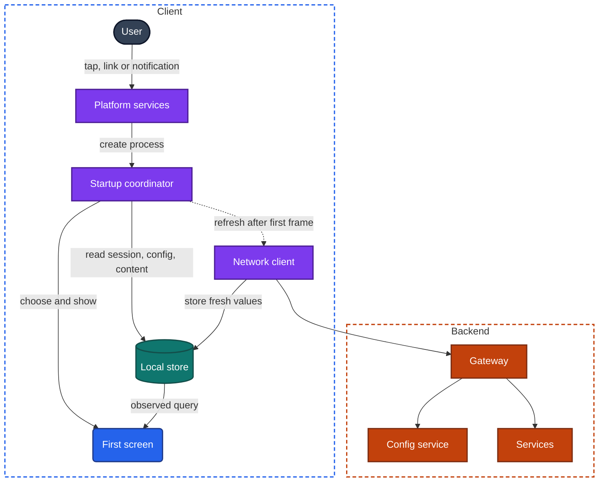
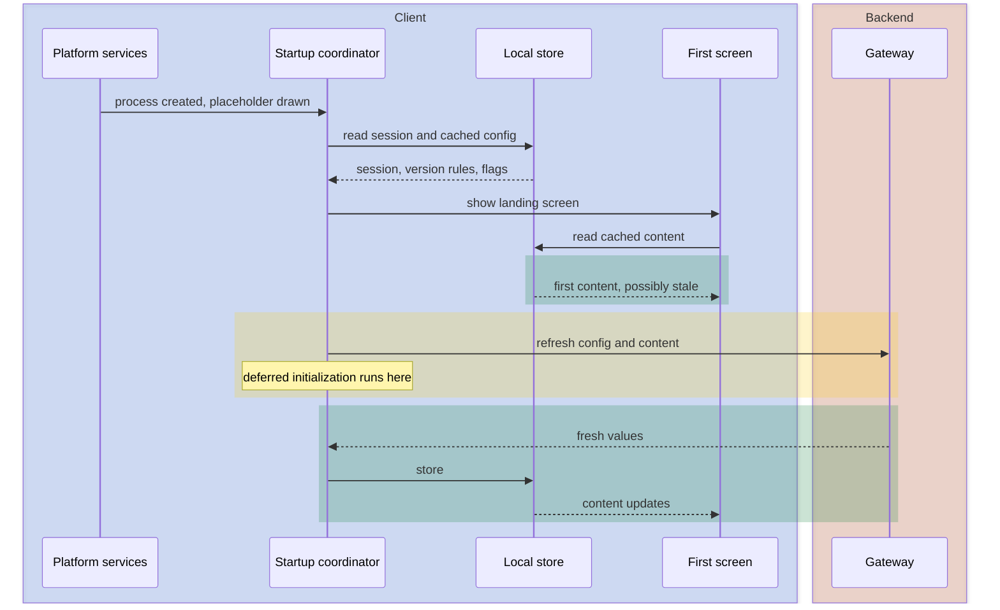

import Probe from '../../../components/Probe.astro';
import Signals from '../../../components/Signals.astro';
import TeardownBar from '../../../components/TeardownBar.astro';
import WorksheetForm from '../../../components/WorksheetForm.astro';

> **The question.** What happens between the tap on the icon and the first useful screen of this app?

## 7.1 Why this concern exists

Launch is the one path every user takes in every use of the app. Five of the seven constraints ([Chapter 2](/part-1-method/2-the-mobile-constraint-set/)) press on it at once.

**Human attention** sets the budget. A user who taps an icon is waiting with nothing else to look at. Every hundred milliseconds of blank screen is noticed.

**Process death** sets the frequency. The operating system ends background processes freely, so a large share of launches start from nothing. The slowest path is also a common one.

**Unreliable network** sets the hardest rule. At launch the app knows the least it will ever know: it has not spoken to the backend, and it may not be able to. Any startup decision that needs a response is a decision that can hang.

**Slow release** adds the questions the app must ask before it shows anything. A version shipped two years ago still launches today. The backend may no longer support it, or may want it to behave differently, and the only moment to say so is startup.

**Limited resources** make the work compete. Everything the app prepares at launch runs on the same processor, in the same seconds, as the drawing of the first screen.

The result is a concern with an unusual property. The user sees every stage of it. A launch plays out as a sequence of visible states, and the order and duration of those states expose most of the design.

## 7.2 The design space

The central design choice is what the user sees first and where its data comes from. There are five workable strategies. They run from simplest to most capable, and each later one needs more machinery on the device.

**Blocking fetch behind a splash.** The app holds a splash screen until the backend has answered, then shows a complete screen. Nothing on screen is ever wrong or out of date. The cost is that launch time equals network time, and with no network the app cannot get past the splash. Teams choose this when stale data is unacceptable, when the app is small, or when nobody has revisited the first version of the startup code.

**Skeleton placeholders.** The app draws its real layout at once, with gray shapes or spinners where content will appear, and fills them in as responses arrive. Launch feels faster because the first frame comes early, although the content arrives no sooner. The user can already reach tabs and menus. The cost is modest: each screen needs a loading state. With no network the skeleton never resolves, or turns into an error.

**Cached content first, then refresh.** The app shows the content it stored on the previous run and refreshes it in the background. This is stale-while-revalidate applied to launch ([Chapter 11](/part-2-concerns/11-local-storage-caching-and-prefetching/)). First content arrives at local-storage speed, and launch works offline. The cost is a cache that survives process death, and a screen that may change under the user's eyes when the refresh lands.

**Persisted last screen.** The app reopens where the user left it, with that screen's data and position, instead of at its home screen. This needs everything the previous strategy needs, plus stored navigation state ([Chapter 8](/part-2-concerns/8-navigation-deep-links-and-screen-state/)). Teams choose it for apps in which the user's place is valuable: a reader, a document editor, a long conversation.

**Prepared before launch.** The app refreshes its local store while it is not on screen, prompted by a push hint or a background task the operating system schedules ([Chapter 23](/part-2-concerns/23-background-work-and-notifications/)). When the user launches, the stored content is already current, so the cached screen and the fresh screen are the same screen. This is the most capable design and the most expensive, because it spends battery and data on launches that may not happen, under platform rules the team does not control.

| Strategy | First frame shows | Time to first content | Launch with no network | Main risk | Relative cost |
|---|---|---|---|---|---|
| Blocking fetch behind a splash | Splash | One or more round trips | Stuck or error | Hangs on a bad network | Lowest |
| Skeleton placeholders | Layout without data | One or more round trips | Empty layout or error | Feels fast, is not | Low |
| Cached content first | Stored content | Local read | Works, content is old | Content shifts on refresh | Medium |
| Persisted last screen | The screen the user left | Local read | Works, content is old | Restores a screen that no longer makes sense | High |
| Prepared before launch | Current content | Local read | Works, content is recent | Background budget wasted or refused | Highest |

**Strategies belong to screens, and they combine.** An app commonly holds a short splash while it reads the session, shows a cached feed, and puts a skeleton in the one section that must be fresh, such as a balance. Record the strategy for the first screen and note the exceptions.

## 7.3 Anatomy

### Three kinds of launch

What the user calls "opening the app" is one of three different events.

| Kind | What exists beforehand | What the app must do | What you see |
|---|---|---|---|
| Cold start | No process | Everything in Figure 7.2 | Splash or placeholder, then content |
| Warm start | A live process whose screens were released or are out of date | Rebuild or refresh screens. No initialization | No splash. Content reloads or updates |
| Resume | A live process with its screens intact | Nothing, or a quiet refresh | The exact screen you left, at once |

The glossary defines a warm start as any return to a live process. This chapter splits off the cheapest case and calls it a resume, because the two look different and reveal different things.

You cannot see whether a process exists. You can only infer it from what the launch shows. A splash means a cold start. The absence of a splash means a live process. This matters for every probe in this chapter: before you time a cold start, make sure it is one, by force-quitting the app or restarting the device.

### The components

Figure 7.1 shows the parts that take part in a cold start. The startup coordinator is the piece of domain logic that decides which screen comes first. In a small app it is a few lines in the entry point. In a large one it is a dependency graph of initialization tasks.



*Figure 7.1. The components of a cold start, drawn for the cached-content-first strategy.*

The figure shows the network as a dotted line, after the first screen. That is the property that separates the strategies in Section 7.2. In a blocking design the same arrow is solid and sits before the first screen.

### The phases of a cold start

A cold start passes through five phases. Each ends at a moment the user can see.

1. **Process creation.** The operating system creates the process and loads the app's code. The app's own code is not running yet. The operating system draws a placeholder so that the tap gets an immediate response. The team controls this phase only indirectly, through the size of the app and the amount of code it links.
2. **App initialization.** The app's own setup runs: it builds its object graph, opens the local store, and starts the libraries it depends on. This is the phase teams most often let grow, because each addition is small.
3. **First frame.** The app draws something of its own. Depending on the strategy this is a splash, a skeleton or real content.
4. **First content.** Real data is visible. In a blocking design, first frame and first content are far apart. In a cached design they are almost the same moment.
5. **Interactive.** The app responds to touch. This can trail first content, because work postponed from the earlier phases is now running on the thread that handles input.



*Figure 7.2. A cold start that shows cached content first.*

From outside, you can separate four moments with nothing more than attention: the placeholder appears, the app's own drawing replaces it, real content appears, and the first touch is honored. The boundary between the operating system's placeholder and the app's own splash is usually invisible, because teams design the two to match.

## 7.4 What the app must decide at startup

Before the first screen, the startup coordinator answers four questions. The design of each answer decides whether launch depends on the network.

```text
function chooseFirstScreen(launch):
  session = localStore.readSession()       // answerable with no network
  rules = localStore.readCachedConfig()    // last known version rules and flags
  refreshConfigInBackground()              // result applies later, see text

  if rules.minimumVersion > appVersion: return UpdateGate
  if rules.maintenance: return MaintenanceScreen
  if session is none: return SignIn(pendingLink = launch.link)
  if launch.link exists: return route(launch.link)
  if savedScreen exists and savedScreen.age < restoreLimit:
    return savedScreen
  return Home
```

### Is there a session

The client stores a credential from the last sign-in. Reading it is a local operation. Checking that the backend still accepts it is a network operation. There are two designs.

- **Trust, then verify.** The app treats a stored credential as a session and shows signed-in screens at once. If the backend later refuses the credential, the app sends the user to sign-in at that moment. Launch does not wait.
- **Verify, then show.** The app holds the splash until the backend confirms the session. Launch waits on the network, and with no network the app either blocks or falls back to the first design.

[Chapter 20](/part-2-concerns/20-identity-and-sessions/) covers sessions in full. For this chapter the point is narrow: a launch in airplane mode shows which design the app uses.

### Which version rules apply

The backend can tell an app that its version is too old, or that the service is unavailable. Section 7.6 covers these gates. The startup question is where the rule comes from at launch: a cached copy of the last answer, or a fresh request.

### Remote config and feature flags

Remote config decides which features exist in this launch. The app must choose between showing the right features and showing something soon. Three designs exist.

| Design | How it works | Visible behavior |
|---|---|---|
| Fetch, then start | Hold the splash until config arrives, usually with a timeout | Launch time follows network speed. A timeout shows as a splash of fixed maximum length on a bad network |
| Cached, applied on the next launch | Start with the values fetched last time, fetch new ones in the background, and use them next time | Launch is fast. A change reaches the user one launch late |
| Applied live | Start with cached values and switch when new ones arrive | Launch is fast. A section or control can appear, move or vanish seconds after launch |

The first launch after install has no cached config. An app of the second or third kind uses defaults shipped inside the app, so a feature may be absent on the first launch and present on the second. [Chapter 30](/part-2-concerns/30-remote-config-and-experiments/) covers remote config in depth.

### Where to land

The landing screen depends on how the launch began and on what the app remembers.

- A launch from the icon lands on the home screen, or on the last screen if the app persists it. Many apps apply a time limit: after a short absence they restore the last screen, and after a long one they return to home, on the reasoning that the old context no longer matters to the user.
- A launch from a notification or a link lands on the target screen. The startup coordinator must carry the target through the session check and any gate. A simpler design starts the app normally and navigates afterwards, which shows as a flash of the home screen before the target.
- A first launch after install lands on onboarding or sign-in, or on browsable content if the app supports use without an account.

## 7.5 Deferred and lazy initialization

Everything done before the first frame delays it. A startup design therefore sorts each piece of setup into one of three groups.

| Group | When it runs | Typical contents |
|---|---|---|
| Before first frame | During app initialization | Crash reporting, the session read, the cached config read, whatever the first screen draws with |
| Deferred | After first frame, without being asked | Analytics, push registration, the persistent connection, warming of caches, cleanup of old files |
| Lazy | On first use of a feature | Payment, maps, media playback, the camera, rarely visited sections |

Both postponements leave marks you can see.

**Deferred work competes with the first seconds of use.** The first content is on screen while the deferred group runs. If the first scroll after a cold start stutters and the same scroll ten seconds later is smooth, deferred work is running on the thread that draws. If taps are ignored for a moment after content appears, the interactive phase is trailing first content.

**Lazy work makes the first use slow once.** Open a heavy feature after a cold start, leave it, and open it again. A delay on the first opening that is absent on the second, and that returns after a force-quit, is lazy initialization. A delay that is absent after a force-quit and present only after a fresh install is a one-time download or setup, which is a different thing.

**Some work happens before the tap.** The operating system may keep a process alive after a notification arrives, or start one for a scheduled background task. A launch from the icon then finds a live process and is a warm start, although the user did nothing to cause it. This is why a launch after a device restart is the cleanest cold start you can produce: nothing has had the chance to run.

## 7.6 Gates: forced updates and maintenance

A gate is a screen that replaces the app until a condition changes. Gates exist because of slow release. The team cannot recall a version, so it ships every version with a way to be told to stop.

**The forced-update gate.** The backend publishes a minimum supported version. A client below it shows a screen with one action, a link to the store. A softer form shows a dismissible prompt and lets the user continue.

**The maintenance screen.** The backend states that the service, or a part of it, is unavailable. The client shows a message instead of a stream of errors. The same mechanism serves as a kill switch for a single feature.

Two design choices decide how a gate behaves.

*Where the rule is checked.* A rule checked only at startup arrives with config. A rule checked on every response arrives as a specific error that any request can return, and the gate can then appear in the middle of use. The second design is more robust, because it also catches a process that has stayed alive for days.

*What happens with no network.* The app cannot learn a new rule offline. If a gate appears in airplane mode, the rule was stored on the device on an earlier launch. If an app that was gated online opens normally offline, the rule is not stored, and the gate is only as strong as the network connection. For apps that work offline this is a real gap, and some teams accept it.

A gate also has a failure of its own. A blocking gate with a wrong rule locks every user out, and a release cannot fix it, because a release takes days. A team that understands this serves the rule from a system separate from the one it guards. You cannot see that from outside, so any claim about it is Speculative.

## 7.7 Startup with no network, and after an update

### No network

A cold start in airplane mode has four possible results, and each one states a design.

| Result | What it tells you |
|---|---|
| The normal first screen, with content | Session, config and content are all read from the device. Nothing at startup blocks on the network |
| The app's layout, with an error or empty sections | Startup decisions are local. Content is not cached, or only held in memory |
| The splash never ends, or a full-screen error with a retry control | At least one startup step blocks on a response |
| The sign-in screen | The session check needs the network and treats no answer as no session |

The fourth result is a defect in most products, since the user is signed in and has lost access to cached content because of a missing connection. It is still common. The offline levels of [Chapter 12](/part-2-concerns/12-offline-and-sync/) describe what the app can do once it is open. This probe asks the earlier question of whether it opens at all.

### After an update

A new version finds a local store written by the old one. It has three options.

- **Migrate.** Convert the stored data to the new shape. A small migration is invisible. A large one shows as a single long launch, sometimes with a message such as "updating" or "optimizing".
- **Discard and refetch.** Delete the local data and load it again from the backend. This shows as an empty app that refills, or as a full initial load, and it tells you the backend holds everything the device held.
- **Fail.** A migration that throws an error on some users' data produces an app that closes at every launch until it is reinstalled. Reinstalling works because it removes the old data.

One confound applies. On some platforms the operating system itself does extra work on the first launch of new code, so a slightly slower first launch after an update is not evidence of a migration. A visible message, a progress indicator or a delay of many seconds is.

## 7.8 Probes

Run P7.1 to P7.3 on every app. They take two minutes together and settle the first-screen strategy. The later probes need time, a notification or an update, so run them when the chance arises. Select the outcome you saw in each probe, and it is recorded in your worksheet for the teardown chosen here.

<TeardownBar />

### P7.1 Cold against warm

<Probe id="P7.1" />

### P7.2 First-screen strategy

<Probe id="P7.2" />

### P7.3 Launch in airplane mode

<Probe id="P7.3" />

### P7.4 Where it lands

<Probe id="P7.4" />

### P7.5 Launch from a notification

<Probe id="P7.5" />

### P7.6 Launch after a device restart

<Probe id="P7.6" />

### P7.7 First launch after install

<Probe id="P7.7" />

### P7.8 Launch after a long absence

<Probe id="P7.8" />

### P7.9 First launch after an update

<Probe id="P7.9" />

### P7.10 Old version

<Probe id="P7.10" />

## 7.9 Signal-to-design table

<Signals chapter={7} />

## 7.10 The backend this implies

Each client design needs something specific from the backend. Once you have placed the app, the following can be Inferred.

- **Blocking fetch.** One or more endpoints that the first screen cannot do without. An app with a short, steady splash on a good network usually has a single startup request that returns session validity, config and landing data together. A splash that varies widely suggests several requests in sequence. You cannot count requests from outside, so the number is Speculative.
- **Cached content first.** Read endpoints whose responses are safe to show when old, and a cheap way to ask whether stored content is still current ([Chapter 11](/part-2-concerns/11-local-storage-caching-and-prefetching/)).
- **Prepared before launch.** A way to wake the client when content changes, by push hint, and endpoints cheap enough to call on launches that never happen ([Chapter 14](/part-2-concerns/14-real-time-delivery/) and [Chapter 23](/part-2-concerns/23-background-work-and-notifications/)).
- **Remote config.** A config service that answers by app version, platform and user, and that answers fast, since it sits on the launch path for at least some designs.
- **Gates.** A published minimum version for each platform, and either a config value or a dedicated error that every endpoint can return. A maintenance screen that appears while the rest of the backend is failing implies that the status is served from somewhere that does not share the failure.
- **Launch from a notification.** A notification that carries the target, and endpoints that load one item by its ID without the screens that normally lead to it ([Chapter 8](/part-2-concerns/8-navigation-deep-links-and-screen-state/)).

The gateway sees every one of these requests at the same moment for every user who opens the app, for example after a widely delivered notification. A startup design that makes five requests before first content multiplies that peak by five. This is a reason backend teams push for a single startup request, and a reason client teams resist it, because one slow field then delays everything ([Chapter 10](/part-2-concerns/10-api-shape/)).

## 7.11 Failure modes and what they reveal

Startup bugs are easy to notice, because they happen in front of a waiting user.

- **A splash that never ends on a weak connection.** A blocking fetch with no timeout, or a timeout longer than your patience.
- **A flash of the sign-in screen before the home screen.** The first frame is drawn before the session has been read. The session read is asynchronous and the screen did not wait for it.
- **A flash of the home screen before a notification's target.** The app starts normally and navigates afterwards. The startup coordinator does not carry the launch target.
- **Content that jumps a second after it appears.** Cached content was replaced by a refresh whose layout differs. The design is cached-first with no reserved space for late elements.
- **A tab or section that appears on the second launch after install.** Config is cached and applied on the next launch, and the first launch ran on built-in defaults.
- **A feature that vanishes while you are looking at it.** Config is applied live.
- **An update gate that appears over a screen you were already using.** The rule is checked on responses, not only at startup.
- **An ignored first tap.** Deferred initialization is running on the thread that handles input.
- **The app closes at every launch after an update, until reinstalled.** A failed migration of the local store.
- **Signed out after an update.** The stored credential did not survive the change, either through a deliberate reset or a storage migration that lost it.
- **Yesterday's content with no sign of loading, for a long time.** Cached-first with a refresh that failed silently. The app has no indicator for a failed refresh.

## 7.12 Worksheet entries

These are the fields this chapter adds to the teardown worksheet ([Chapter 6](/part-1-method/6-the-teardown-worksheet/)). Probe outcomes fill some of them in.

<TeardownBar />

<WorksheetForm chapters={[7]} />

## 7.13 Summary

- A launch is a cold start, a warm start or a resume. A splash is the visible mark of a cold start. Force-quit or restart the device before timing one.
- A cold start has five phases: process creation, app initialization, first frame, first content and interactive. You can separate first frame, first content and interactive by eye.
- The first-screen strategy is a blocking fetch, skeleton placeholders, cached content first, a persisted last screen, or content prepared before launch. The position of the network relative to the first screen separates them.
- Before the first screen the app decides whether there is a session, which version rules apply, which config is in force and where to land. Each decision is either local or blocks on the network.
- A cold start in airplane mode is the most informative single probe. It shows which startup decisions need a response.
- Deferred work shows as a rough first few seconds. Lazy work shows as a slow first use of a feature in each process.
- Gates exist because a release cannot be recalled. Where the rule is checked, and whether it holds offline, are both observable.
- The first launch after an update shows whether the local store is migrated or discarded.
