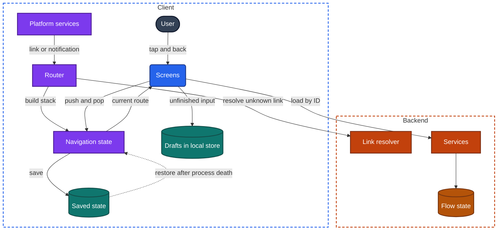
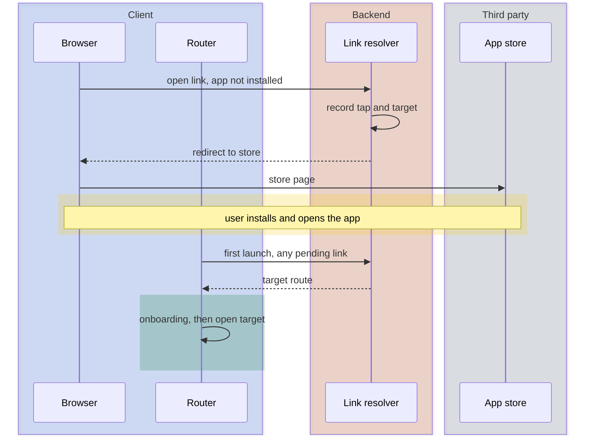

import Probe from '../../../components/Probe.astro';
import Signals from '../../../components/Signals.astro';
import TeardownBar from '../../../components/TeardownBar.astro';
import WorksheetForm from '../../../components/WorksheetForm.astro';

> **The question.** How does this app know where you are, how do links reach a screen, and what survives when the app is killed?

## 8.1 Why this concern exists

A user's position in an app is data. It has a structure, it lives somewhere, and it can be lost. Most of the seven constraints ([Chapter 2](/part-1-method/2-the-mobile-constraint-set/)) bear on it.

**Process death** is the main one. The user leaves to answer a call, and the operating system ends the process. The user returns and expects the same screen, the same scroll position and the same half-typed text. The user neither knows nor cares that the process is new. Anything the app held only in memory is gone, so anything the user expects back must have been written down first.

**Human attention** makes this frequent. Mobile use is a series of interruptions. A flow that takes two minutes is often spread over ten, with three other apps in between. Some flows force the interruption themselves, by sending the user to a banking app or to a message that contains a code.

**Platform rules** shape the mechanics. The operating system owns the back gesture, decides which app receives a tapped link, and offers the app a brief chance to save state before it is suspended.

**Slow release** applies to links. A link in a two-year-old email is still tapped today, and it arrives at whatever version is installed. A link to a new screen arrives at old versions that do not have that screen.

**Untrusted client** applies as well. A link is input from outside the app. It can be crafted by anyone and tapped by a user who is signed out, signed in as someone else, or not entitled to the target.

Three sub-problems follow, and this chapter takes them in turn: how position is structured and stored, how it is restored, and how a link is turned into a position.

## 8.2 The design space

The first design choice is where the user's place and unfinished input are kept. There are five workable answers. Each one survives more than the one before it and costs more.

**In memory only.** Navigation state and screen state are objects in the running process. This is what an app has if nobody does anything. It survives a switch to another app for as long as the process lives. It is lost on process death.

**Saved through the operating system.** Before suspending the app, the operating system asks it for a small amount of state and hands that state back if it later recreates the app. The app saves its navigation state and a little screen state, such as a scroll position or a text field. This is cheap, and it covers the most common loss. It is typically cleared when the user force-quits the app, and it may not survive a device restart, because the platform reads both as a wish to start fresh.

**Persisted by the app.** The app writes its navigation state to its own local store. It then controls how long the state lives, so the state survives a force-quit, a restart and an update. The cost is that the app must decide when a saved place is too old to be useful, and must cope with saved state written by an earlier version.

**Drafts in the local store.** Unfinished input is stored as data, keyed by the thing it belongs to: the reply to this conversation, the edit to this item. A draft does not depend on navigation at all. The user can leave the screen, return by any path and find the text. Teams choose this where typed input is valuable, which in practice means messages, posts, notes and long forms.

**Held on the backend.** The state is stored against the user's account: a cart, a saved draft, the step reached in an application, a playback position. It survives a reinstall and follows the user to another device. It costs an endpoint, storage, an expiry rule and a conflict rule ([Chapter 12](/part-2-concerns/12-offline-and-sync/)).

| Where the state lives | App switch | Process death | Force-quit | Reinstall or second device | Relative cost |
|---|---|---|---|---|---|
| In memory only | Survives | Lost | Lost | Lost | None |
| Saved through the operating system | Survives | Survives | Usually lost | Lost | Low |
| Persisted by the app | Survives | Survives | Survives | Lost | Medium |
| Drafts in the local store | Survives | Survives | Survives | Lost | Medium |
| Held on the backend | Survives | Survives | Survives | Survives | High |

**The answer differs per kind of state.** One app commonly holds its tab histories in memory, saves the current screen through the operating system, keeps message drafts in the local store and keeps the cart on the backend. Record each separately. The rows of the table map directly onto probes: each column is something a user can do.

## 8.3 Anatomy

### The navigation structure

An app's screens are arranged with four building blocks.

- **A stack.** Screens are pushed on and popped off. Back pops the top screen. The list of screens under the current one is the back stack.
- **Tabs.** Several top-level sections, each of which can hold its own stack. With independent histories, a tab keeps its place while the user visits another.
- **A modal.** A screen or a stack presented over everything else, with its own way out. A modal marks a task that the user completes or cancels: composing, signing in, paying.
- **A nested flow.** A stack inside a modal, or inside a tab, with a defined start and end. Checkout is the standard example.

Navigation state is the tree these form: the selected tab, the stack in each tab, and any modal on top. Each entry is a route, which is a screen identifier plus its arguments.

A sound design keeps arguments small. The route holds the ID of an item, and the screen loads the item from the data layer ([Chapter 9](/part-2-concerns/9-state-and-ui-data-flow/)). A route that holds only IDs can be saved, restored, and built from a link. A route that holds a whole object passed from the previous screen can do none of these, and that difference is visible, as Section 8.9 shows.

### The components



*Figure 8.1. The components that hold and change the user's position.*

The router is the component that turns an external request into navigation state. In the universal app model ([Chapter 3](/part-1-method/3-the-universal-app-model/)) it sits between platform services, which deliver links and notification taps, and screen state. Two things in the figure matter for a teardown.

First, there are two ways into navigation state. The user's taps change it one step at a time. The router replaces or extends it in one move. An app with a real router can put the user on any screen from a cold start. An app without one can only reach a screen by the taps that normally lead there.

Second, there are three separate stores: saved state, drafts and backend flow state. They correspond to rows of the table in Section 8.2, and each fails independently.

## 8.4 State restoration

Restoration has three layers. An app can restore any subset, and each subset looks different.

| Layer | What it holds | When it is missing |
|---|---|---|
| Route | Which screen, with which arguments, over which back stack | The app opens on its home screen |
| View state | Scroll position, selected segment, expanded sections, playback position | The right screen, at its top, in its default arrangement |
| Input | Text typed and choices made and not yet submitted | The right screen, with empty fields |

```text
function onBeforeSuspend():
  saved.navigation = navigationState.serialize()   // routes hold IDs only
  for screen in navigationState.screens:
    saved.screens[screen.key] = screen.viewState() // scroll anchor, field text

function onCreate(saved):
  if saved is none or saved.age > restoreLimit:
    return showHome()
  navigationState = deserialize(saved.navigation)
  for screen in navigationState.screens:
    screen.restore(saved.screens[screen.key])
    screen.loadData()            // the data itself was not saved
```

The last line is where restoration meets the rest of the design. The saved state is small. It records where the user was, not what was on screen. The content must come from somewhere again.

- With a cache or a local store, the restored screen fills at once.
- Without one, the restored screen shows a loading state and then content. A restored screen that reloads is evidence that the route survived and the data did not.

### Why scroll position is hard

A scroll position means something only against the same content in the same order. A restored list that refetches from the backend may receive different items, for example a feed that is ranked again on each request ([Chapter 15](/part-2-concerns/15-lists-feeds-and-pagination/)). There are three designs.

- **Restore against stored content.** The list is kept in the local store, so the position still applies. This is the only design that returns the user exactly.
- **Anchor on an item.** The app saves the ID of the item at the top of the screen and scrolls to it after loading. This works if the item is still in the first pages loaded.
- **Give up.** The list loads fresh and starts at the top.

### The limit of observation

You cannot end a process on purpose without a force-quit, and a force-quit is not the same event. It tells the operating system that the user wants a fresh start, and system-saved state is typically discarded. Process death in the background is what you want to observe, and you can only encourage it: leave the app for hours, and use memory-heavy apps such as the camera or a game in between.

The splash is your evidence ([Chapter 7](/part-2-concerns/7-launch-and-startup/)). If you return and see a splash, the process was gone, and whatever is on screen after it was restored. If you return and see no splash, the process survived, and the probe has told you nothing about restoration. Record such a result as Speculative, or repeat it.

## 8.5 Deep links

A deep link is an address that identifies one screen with its arguments. Links arrive from three sources: other apps and web pages, notifications, and the app's own backend content.

### Three kinds of link

| Kind | What it is | With the app installed | Without the app |
|---|---|---|---|
| Custom-scheme link | An address in a scheme private to the app | Opens the app | Nothing happens, or an error |
| Verified web link | An ordinary web address on a domain the app's maker has proven it owns | The operating system hands it to the app | Opens the web page at that address |
| Deferred deep link | A verified web link whose target is remembered through installation | Same as a verified web link | Leads to the store, and the app opens on the target after its first launch |

Verified web links have largely replaced custom schemes for links that people share, because they work in both cases and because another app cannot claim the address.

### Routing a link

The router does four things with a link: it matches the address to a route, checks whether the user may go there now, decides what the back stack should be, and falls back when it cannot match.

```text
function open(link, appWasRunning):
  route = routeTable.match(link)
  if route is none:
    return fallback(link)                  // web view, browser or home
  if route.needsSession and session is none:
    pendingLink = link                     // survives the sign-in flow
    return present(SignIn)
  if appWasRunning:
    navigationState.present(route)         // keep the user's place underneath
  else:
    navigationState = [Home] + route.parents + [route]
```

**Unknown links.** An old version receives a link to a screen that it does not have. The fallback is a design choice: show the web page inside the app, open the browser, show a message that asks the user to update, or land on the home screen with no explanation. The last one is the result of having no fallback at all.

**The back stack.** A link opened from a cold start produces a single screen. The router can leave it alone, in which case back leaves the app, or it can build the screens that would normally sit under the target, so that back leads to the parent section and then to home. This rebuilt history is a synthesized back stack. When the app is already running, the router chooses between presenting the target over the user's current place and replacing that place.

**Signed out.** The target needs a session and there is none. A careful design holds the link, runs sign-in, and then continues to the target. Holding it in memory is enough for a password sign-in. It is not enough for a sign-up that sends the user to an email app to confirm an address, because the process may die on the way.

**Trust.** A link carries no authority. The backend checks access when the screen loads its data, exactly as it would for any request ([Chapter 21](/part-2-concerns/21-security-and-trust/)). The exception is a link that is itself a credential, such as a sign-in link sent by email, which holds a single-use token. A link that performs an action when opened, with no confirmation screen, lets anyone who can get the user to tap it act as the user.

### When the app is not installed

A verified web link tapped on a device without the app opens a web page. The page does one of three things: it shows the content, it shows a prompt to install, or it redirects to the store.

A deferred deep link must carry the target across an installation, and nothing links the browser that saw the tap to the app that later starts. There are four ways to bridge that gap.

| Method | How it works | What you can see |
|---|---|---|
| Store referrer | The store passes a short string from the link through the installation to the app | Nothing |
| Device matching | The backend records the tap with the device's network address and characteristics, and the new app asks whether a recent tap matches | Nothing. Occasionally a wrong match |
| Clipboard | The web page copies a token, and the app reads the clipboard on first launch | A system notice that the app pasted from the browser, on platforms that show one |
| Account | Nothing crosses the installation. The backend stores the invitation against an email address or phone number and delivers it after sign-in | The target appears only after sign-in |



*Figure 8.2. A deferred deep link by device matching.*

The first two methods look the same from outside, and both are often supplied by a third party ([Chapter 27](/part-2-concerns/27-ads-attribution-and-growth/)). If the target appears before you sign in, the account method is ruled out. Beyond that, the method is Speculative unless you see the clipboard notice.

## 8.6 Navigation decided by the backend

In the simplest design, each screen's code names the screen that follows it. In many apps the backend names it instead.

- **Destinations as data.** A banner, a notification or a cell in a list carries a link, and the client passes that link to the router. The same router serves outside links and inside taps. The team can point a banner at any screen without a release.
- **Next step as data.** In a flow such as onboarding or identity verification, each response states which step comes next. The backend can add, skip or reorder steps per user, region or experiment.
- **Resolution at tap time.** A short link holds no target. The client asks a link resolver where it leads. The target can be changed after the link is sent, and the tap needs the network.

These leave marks. A destination that opens as a web page in an old version and as a native screen in a new one is a link with a fallback. A flow with different steps on two accounts, in the same app version, is ordered by the backend. A brief spinner between tapping a banner and seeing a screen that is otherwise instant is a resolution request. This is the navigation side of a broader question, who decides what a screen receives, which [Chapter 10](/part-2-concerns/10-api-shape/) and [Chapter 31](/part-2-concerns/31-server-driven-ui/) take up.

## 8.7 Back as a design signal

Back reads the stack aloud, one entry at a time. It is the cheapest way to see navigation state.

| What back does | What it tells you |
|---|---|
| After a link from a cold start, leaves the app | A single-screen stack. The router does not synthesize |
| After a link from a cold start, shows a parent screen | A synthesized back stack |
| Returns to a list at the same position, with no reload | The list screen stayed alive under the detail screen |
| Returns to a list that reloads or jumps to the top | The list screen was rebuilt, or it refetches whenever it appears |
| After a completed flow, returns to the screen before the flow | The flow's screens were removed from the stack on completion |
| After a completed flow, returns to the last form of the flow | The flow was pushed onto the ordinary stack and never removed |
| Inside a screen, steps through pages of content | The screen is a web view with its own history ([Chapter 32](/part-2-concerns/32-ui-technology-native-cross-platform-and-web/)) |
| On a form with input, asks whether to discard | The screen tracks unsaved input |
| On a form with input, leaves silently, and the input is there on return | A draft was stored |

Tabs add one more reading. Go deep in one tab, visit another, and come back. A tab that kept its place has its own stack. A tab that reset has a single stack shared by the whole app, or tabs that are rebuilt when selected.

## 8.8 Multi-step flows

A flow gathers state over several screens and commits it at the end. Checkout gathers items, an address, a delivery choice and a payment method. The design question is where that state lives between the first screen and the commit. The five answers of Section 8.2 all occur.

Flows deserve separate attention because they are interrupted by design. Paying often means leaving for a banking app or a code in a message. That is the moment at which the process is most likely to die, since the app is in the background while another app takes memory, and it is the moment at which losing state costs a sale.

Robust flows therefore share three properties.

- **The state is on the backend before the user leaves.** The cart and the order in progress are stored against the account. On return, the client asks for the current state of the order and draws the matching step.
- **The commit is safe to repeat.** If the process dies after the payment request is sent, the restored client cannot know whether it arrived. It asks for the status, or resends with the same idempotency key ([Chapter 12](/part-2-concerns/12-offline-and-sync/)).
- **Expiry is decided by the backend.** A hold on a seat or a price has a deadline. A countdown that is still correct after a force-quit, and that matches on a second device, is computed from a backend deadline and not from a timer in memory.

A fragile flow holds everything in the memory of its screens. It works in a demonstration and fails when the user switches to a banking app on a device short of memory.

## 8.9 Probes

Run P8.1 and P8.2 first. They take a minute and need nothing but the app. P8.5 to P8.7 need a link to an item, which most apps provide through a share action. Stop any checkout probe before the step that pays. Select the outcome you saw in each probe, and it is recorded in your worksheet for the teardown chosen here.

<TeardownBar />

### P8.1 Tab histories

<Probe id="P8.1" />

### P8.2 Half a form

<Probe id="P8.2" />

### P8.3 Long absence in the middle of a task

<Probe id="P8.3" />

### P8.4 Force-quit and reopen

<Probe id="P8.4" />

### P8.5 Link while signed in

<Probe id="P8.5" />

### P8.6 Back after a link

<Probe id="P8.6" />

### P8.7 Link into a running app

<Probe id="P8.7" />

### P8.8 Link while signed out

<Probe id="P8.8" />

### P8.9 Link with the app not installed

<Probe id="P8.9" />

### P8.10 Interrupted flow

<Probe id="P8.10" />

## 8.10 Signal-to-design table

<Signals chapter={8} />

## 8.11 The backend this implies

Navigation looks like a client matter. Several of its designs still need backend support, and seeing the client behavior lets you infer it.

- **Verified web links.** A web domain that serves a statement of which apps may open its addresses, and a web page for every address that can be shared. If the page shows the content itself, the backend has a web rendering of that screen.
- **Synthesized back stacks and routes with IDs.** Endpoints that load any item by its ID alone, without the list that normally leads to it. Access is checked on that request, since the link proves nothing.
- **Deferred deep links.** A link resolver that records taps and answers a first-launch query, or a third party that does. The account method needs a store of pending invitations keyed by email address or phone number.
- **Navigation decided by the backend.** Responses that carry links or next-step identifiers. The backend must know which app versions understand which routes, or send a fallback with each one ([Chapter 10](/part-2-concerns/10-api-shape/)).
- **Notifications.** A payload that carries the target route ([Chapter 14](/part-2-concerns/14-real-time-delivery/)).
- **Flow state on the backend.** A cart or draft service, an order in progress with a status endpoint, an expiry rule, and idempotent commits. When a draft appears on a second device, the backend stores drafts, and a conflict rule exists for two devices editing the same draft, whether or not anyone designed it.

## 8.12 Failure modes and what they reveal

- **You return to the home screen and your form is gone.** Navigation state was in memory only, and the process died.
- **You return to the right screen and it is blank, shows an error, or the app closes.** The route was restored and its data was not. The screen received an object from the previous screen instead of an ID, and that object no longer exists.
- **You return to the screen under the one you were on.** The modal was not part of the saved navigation state.
- **A list returns to the top when you come back.** View state is not restored, or the list was refetched and the position no longer applied.
- **A link opens the app on its home screen.** The router has no route for it, usually because the installed version is older than the screen, and there is no fallback.
- **A link opens the browser although the app is installed.** The operating system did not hand the link over. A common cause is that the link passes through a redirect on another domain, such as a tracking link in an email.
- **After signing in, you are on the home screen and the link is forgotten.** The pending link is not held through the sign-in flow.
- **Tapping a notification twice stacks the same screen twice.** The router pushes without checking what is already on top.
- **Back alternates between two screens.** Each screen pushes the other instead of returning to it.
- **Back after payment shows the payment form again.** The flow's screens were left on the stack after the commit.
- **Checkout restarts after you approve a payment in another app.** Flow state was in memory, and the process died while the app was in the background.
- **A screen opened by link shows content the account should not see, or an action happens without confirmation.** The link was trusted. This one is a security defect and not only a navigation defect.

## 8.13 Worksheet entries

These are the fields this chapter adds to the teardown worksheet ([Chapter 6](/part-1-method/6-the-teardown-worksheet/)). Probe outcomes fill some of them in. Fill the flow fields once per flow of interest.

<TeardownBar />

<WorksheetForm chapters={[8]} />

## 8.14 Summary

- A user's position is data: a tree of tabs, stacks and modals whose entries are routes. Routes that hold only IDs can be saved, restored and built from links.
- Position and input live in one of five places: memory, state saved through the operating system, state persisted by the app, drafts in the local store, or the backend. Each survives a different set of events, and each event is something a user can do.
- Restoration has three layers: route, view state and input. A restored screen that reloads shows that the route survived and the data did not.
- A splash on return proves the process died. Without one, a restoration probe is inconclusive.
- A router turns a link into navigation state. Its handling of unknown links, signed-out users and the back stack are separate design choices, each visible in one probe.
- A deferred deep link carries a target across installation by a store referrer, device matching, the clipboard or the account. Only the last two can be identified from outside.
- Back reads the stack aloud. What it does after a link, after a completed flow and on a form with input each reveal a design choice.
- Flows that send the user to another app must keep their state on the backend and make their commit safe to repeat.
