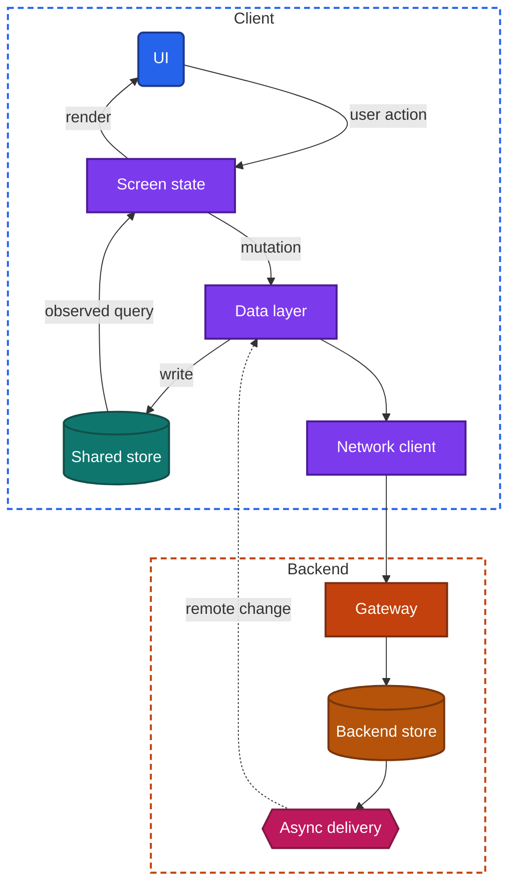
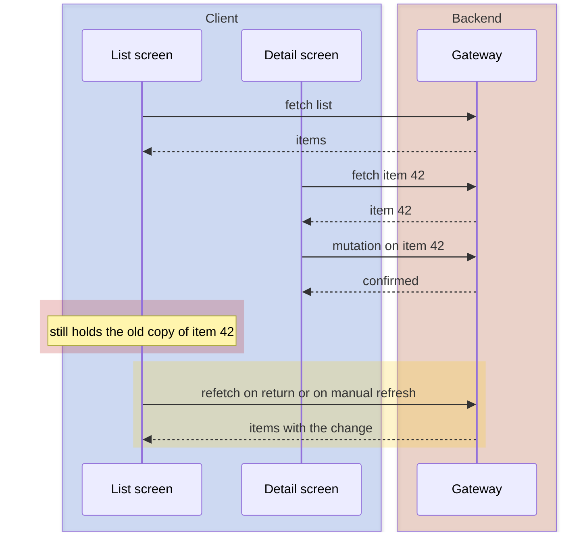

import Probe from '../../../components/Probe.astro';
import Signals from '../../../components/Signals.astro';
import TeardownBar from '../../../components/TeardownBar.astro';
import WorksheetForm from '../../../components/WorksheetForm.astro';

> **The question.** Where does each piece of on-screen data live, and what makes the screen update?

## 9.1 Why this concern exists

Almost everything a screen shows is a copy of data that lives somewhere else. A price, a name, an unread count and a like button are all copies of backend state. The client decides how many copies it holds, which copy each screen reads, and what event causes a screen to read again. Those three decisions are the subject of this chapter.

Three of the seven constraints from [Chapter 2](/part-1-method/2-the-mobile-constraint-set/) force the decisions. Human attention means a tap must show a result at once, so the screen often has to change before the backend has answered. The unreliable network means a fetched copy is out of date from the moment it arrives, and the next fetch may not succeed. Process death means anything held only in memory can vanish while the app is in the background, and the user expects to return to the same place with the same content.

A phone also shows the same item in many places at once. One conversation appears in a list row, a detail screen, a badge on a tab, a notification and perhaps a widget. Each of those is a reader of the same data. When they read from different copies, they disagree, and the user sees the disagreement.

This makes state design easy to probe. You do not need to turn anything off. You change one thing and then look at every place that shows it.

## 9.2 The design space

### Four kinds of state

Before the designs, sort the data on a screen into four kinds. Each kind has a natural home in the universal app model of [Chapter 3](/part-1-method/3-the-universal-app-model/).

| Kind | Examples | Where it lives | Lifetime |
|---|---|---|---|
| Transient screen state | Scroll position, text in a field, an expanded section, a selected filter | Screen state | Until the screen closes, unless it is saved for restoration |
| State shared across screens | The signed-in user, the cart, the track now playing, unread counts | A holder in domain logic or the data layer that outlives any one screen | The life of the process |
| Persisted state | Drafts, settings, cached and synced items | Local store | Across launches |
| Backend state | Everything the backend holds for this user | Backend store | Until changed. The client holds only copies |

A design fails when a piece of data sits in the wrong home. A draft kept as transient screen state is lost on process death. A cart kept inside one screen cannot feed the badge on another. Much of a teardown in this chapter is working out which home each visible value has.

### The designs

The designs differ in how many copies of an item the client holds and who is told when one changes. They are ordered from simplest to most capable.

**Design A. Each screen owns its data.** A screen fetches what it needs when it opens, keeps the response in its own screen state, and discards it when it closes. Two screens that show the same item hold two copies. Nothing links them. This is the cheapest design to build and to reason about, because a screen depends on nothing but its own request. Teams choose it for read-only content, for early versions, and where each screen is built by a different group. The cost is that every change must be followed by a refetch somewhere, or some screen stays stale.

**Design B. Screen-owned copies with change events.** Screens still hold their own copies, but a mutation announces itself inside the client: "item 42 changed". Screens that hold item 42 listen, and patch their copy or fetch again. This repairs the most visible staleness at low cost. Its weakness is that it works by enumeration. Every new screen must subscribe to every relevant event, and each one that was forgotten is a stale surface.

**Design C. A shared in-memory store.** The client keeps one copy of each item, keyed by its identity, in a store that lives as long as the process. Responses are broken up into items and merged into that store. Screens do not hold items. They observe the store and redraw when the items they show change. A mutation changes one copy, and every screen that shows it follows. The cost is a requirement on the backend, which must give each item a stable identity in every response, and a store that is empty again after process death.

**Design D. The local store as the source of truth for the UI.** The same idea, with the store on disk. Screens run observed queries against the local store. The data layer writes fetched data and local mutations into the local store, and never hands a network response to a screen. The UI has one way to get data, and it works the same online, offline and after a cold start. This is the client half of Level 3 in [Chapter 12](/part-2-concerns/12-offline-and-sync/). The cost is a schema, migrations, storage management ([Chapter 11](/part-2-concerns/11-local-storage-caching-and-prefetching/)) and the discipline to keep every write on that one path.

| Design | Copies of one item | Other screens after a change | After process death | Relative cost |
|---|---|---|---|---|
| A Screen-owned | One per screen | Stale until each refetches | Everything refetched | Lowest |
| B Screen-owned with change events | One per screen | Current where a listener exists | Everything refetched | Low |
| C Shared in-memory store | One per process | Current everywhere | Everything refetched | Medium |
| D Observed local store | One per device | Current everywhere | Content present at once | High |

**Designs belong to features, not to apps.** A messaging feature may be Design D while the settings screens of the same app are Design A. Record the design for each feature you tear down.

**Some of these designs look the same from outside.** A complete Design B and Design C both show a change everywhere at once, and both lose everything on process death. You can tell them apart only when Design B has a gap, which is a screen that was never subscribed. If you find no gap, record "B or C" and mark it Speculative.

## 9.3 Anatomy

Figure 9.1 shows Designs C and D, in which data flows one way. The shared store is in memory for Design C and is the local store for Design D.



*Figure 9.1. One-way data flow from a shared store to the screen.*

The figure has one loop on the client. A user action becomes a mutation. The mutation is written to the store. The store notifies the observed query. The screen state is recomputed, and the UI renders it. Nothing in the loop writes to the screen directly.

Three properties follow, and each one is visible.

First, the screen does not care where a change came from. A tap on this screen, a tap on another screen, a response from the backend and a change delivered by async delivery all arrive as the same thing: a write to the store. An app built this way updates an open screen when a second device changes the data, with no extra code per screen.

Second, the network response has no direct path to the UI. A screen in Design A waits for its own request and draws the answer. A screen in Design D draws whatever the store holds now, and draws again when the request finishes and the store changes. That is why such apps show content first and a small update afterwards.

Third, there is one copy to keep right. Consistency across screens is a property of the structure and does not depend on any screen doing the right thing.

The difference between the two ends of the design space fits in a few lines. In Design A the screen holds an answer. In Designs C and D it holds a question.

```text
// Design A. The screen holds an answer.
function onOpen(itemId):
  state = Loading
  match backend.getItem(itemId):
    Ok(item):   state = Content(item)   // a private copy, aging from now on
    Failed(e):  state = Error(e)

// Designs C and D. The screen holds a question.
function onOpen(itemId):
  observe(store.query(itemId)) as item:
    state = present(item)               // runs again on every change to the item
  dataLayer.refresh(itemId)             // writes to the store, never to the screen
```

## 9.4 What makes the screen update

A screen redraws for a reason, and the reason is a design decision. There are five common triggers. An app usually combines several, and the one that fires first is the one you see.

| Trigger | How it works | Visible behavior |
|---|---|---|
| Manual refresh | The user pulls or taps to fetch again | Content changes only when asked |
| Refetch on appear | The screen fetches every time it becomes visible | A brief reload each time you return to the screen |
| Change event in the client | A mutation notifies the screens that listen | Changes you make in the app show on the screens that listen. Changes made elsewhere do not |
| Observed query | The store notifies every query whose result changed | Every screen is current with every change the client knows about |
| Remote change | The backend delivers changes while the app is open ([Chapter 14](/part-2-concerns/14-real-time-delivery/)) | The screen changes while you watch, with no action on this device |

The first four are about changes the client already knows. The fifth is about how the client learns of changes made elsewhere. They are independent. An app can have observed queries and still learn of remote changes only on manual refresh. It can also hold a persistent connection and feed it into screen-owned copies, in which case the visible screen updates live and the screen behind it does not.

Refetch on appear deserves attention, because it imitates the better designs. The list behind a detail screen shows your change when you go back, which looks like a shared store. Three details give it away. The list shows the old value for a moment and then changes. It may show a loading indicator or lose its scroll position. And with the network off it shows the old value, because the corrected value was never on the device. Probe P9.1 uses the last of these.

## 9.5 Consistency across screens

The standard test of a state design is a change made on a detail screen while the list that leads to it sits behind it in the navigation stack ([Chapter 8](/part-2-concerns/8-navigation-deep-links-and-screen-state/)). The list is alive, holds data, and is not visible. Figure 9.2 shows what happens in Design A.



*Figure 9.2. A change on a detail screen with screen-owned copies. The list is stale until it fetches again.*

In Designs C and D the two screens are observers of one copy, and the red phase does not exist. The mutation writes to the store, and the list is already correct when it becomes visible again.

The list and its detail screen are only the nearest pair. The same item usually appears on more surfaces: search results, a second tab, a profile, a "recently viewed" row, a widget. Each surface is a separate test, and the pattern of results is more informative than any single one.

- **All surfaces agree at once.** One copy. Design C or D, or a complete Design B.
- **Nearby surfaces agree, distant ones are stale until refreshed.** Design B. The team wired the obvious pair and missed the others.
- **A surface is stale even after a refresh.** This is no longer a client matter. That surface is fed by a different backend source, such as a search index or a precomputed feed, which is updated on its own schedule. Record it as backend evidence, and do not count it against the client design.

The third case matters for honesty. A stale surface tells you about client state only if a refresh fixes it.

## 9.6 Optimistic updates at the UI level

Human attention demands that a tap shows its effect at once. An optimistic update does that by changing local state before the backend confirms. [Chapter 12](/part-2-concerns/12-offline-and-sync/) treats the durable side of this: the outbox, retries and idempotency. This chapter is concerned with where the optimistic value is held, because that decides who sees it.

- **In the control.** The button flips its own appearance and sends the request. No other screen knows. The row in the list behind still shows the old value, and the count next to the button may not move.
- **In the screen state.** The whole screen reflects the change, including values on that screen that depend on it. Other screens do not.
- **In the shared store.** The change is written to the one copy, usually with a marker that it is pending. Every screen shows it, and every derived value includes it.

The other half is what happens on failure. A rollback must undo the change in the same place it was made. An optimistic value held in a control rolls back by flipping the control. One held in the store rolls back everywhere. You can see the rollback as a control that bounces back, sometimes a second or two after the tap, with or without a message.

A related behavior exposes how responses and mutations are ordered. You tap, the value changes, it flips back to the old value for an instant, then changes again. A fetch that started before your tap returned after it and overwrote the optimistic value, and the confirmation then corrected it. A design that reconciles carefully holds pending mutations apart from fetched data and reapplies them over every incoming response, so this flicker does not occur.

A feature that shows a spinner and waits has no optimistic update. That is a choice, not a defect. Teams wait for the backend when a wrong answer is costly, for example a payment, a booking or a transfer.

## 9.7 Loading, empty, error and partial states

Every screen that shows remote data has more states than "content". How an app models those states is visible, and it follows from the state design.

A screen-owned design tends to model the screen as one status at a time. A design that reads from a store tends to hold content and activity separately, because content comes from the store and activity comes from the request.

```text
// One status at a time. A failed refresh replaces the content.
type ScreenState = Loading | Content(items) | Empty | Error(reason)

// Content and activity are separate. A failed refresh leaves the content in place.
type ScreenState:
  items:      List or none       // from the store
  refreshing: Boolean            // from the request
  lastError:  reason or none
```

The two models behave differently in situations you can create.

| Situation | One status at a time | Content and activity separate |
|---|---|---|
| Refresh fails on a screen that has content | Content is replaced by a full-screen error | Content stays. A brief message reports the failure |
| Return to a screen visited earlier | A full loading indicator, then content | Content at once, then a small update |
| A list that is truly empty | An empty state may flash before content arrives, when "no items" and "not loaded yet" are the same value | Loading and empty are distinct, so no flash |
| One section of a screen fails | The whole screen fails | That section shows an error and the rest renders |

Partial states say the most. A screen in which each section loads, fails and retries on its own has one state holder per section. A screen that is entirely present or entirely absent has one holder for the whole. How the backend supplies those sections is the subject of [Chapter 10](/part-2-concerns/10-api-shape/).

Skeleton placeholders are weak evidence on their own. They show that the team designed the loading state. They do not show where the data lives.

## 9.8 Derived state

Some values on screen are not stored anywhere. They are computed from other values: a badge count, a cart total, a "3 selected" label, a progress bar, an enabled or disabled button. These are derived state, and the question for each is whether it is truly derived or is a second copy.

- **Derived on the client from the same data.** The badge is the count of unread items in the store. It cannot disagree with the content, and it changes in the same instant the content does.
- **A separate value from the backend.** The backend sends the count as its own field, or a notification carries it. The client stores it apart from the items. It can lag, and it can be wrong. This is often necessary: a client that holds only one page of a long list cannot count the whole list.
- **A separate value maintained by hand.** The client adds one when you do something and subtracts one when you undo it. It drifts whenever an event is missed, and is corrected on the next fetch.

The badge on the app icon is a special case. The operating system draws it, and the app or a notification sets it. It is often set by the backend through a notification while the app is not running, so it comes from a different source than the count inside the app. A badge on the icon that disagrees with the badge inside the app is two sources, Observed.

Totals carry a further question. A cart total computed on the client changes at once, offline included. A total that waits for the network is computed on the backend, because prices, taxes and discounts are rules the backend owns ([Chapter 10](/part-2-concerns/10-api-shape/)).

## 9.9 What survives rotation, backgrounding and process death

Each kind of state from Section 9.2 has a different lifetime, and three events test them in order of severity.

**Rotation or resize.** On many platforms a change of size or orientation rebuilds the screen's visual tree. State held inside the visual tree is lost. State held in a screen state holder that outlives the visual tree survives. A screen that refetches after rotation keeps its data in the wrong place, or uses the request as its only source. A half-typed field that clears on rotation was held only in the control.

**Backgrounding.** While the process lives, everything in memory survives. The question on return is whether the app refreshes, which Section 9.4 covers.

**Process death.** Everything in memory is gone. What reappears was persisted, in one of three ways. The navigation position and small pieces of transient screen state can be saved through the operating system's state restoration ([Chapter 8](/part-2-concerns/8-navigation-deep-links-and-screen-state/)). Drafts and user data can be written to the local store. Everything else is fetched again. Design D shows content at once after process death. Designs A to C show loading states.

| Value | Rotation | Process death | What survival tells you |
|---|---|---|---|
| Scroll position | Usually kept | Kept only if saved | The team saves transient screen state for restoration |
| Text in a field | Kept unless held in the control | Kept only if saved or stored as a draft | Drafts are treated as persisted state |
| Loaded content | Kept unless the screen refetches | Present at once only with a local store | Design D, or a cache read at start ([Chapter 11](/part-2-concerns/11-local-storage-caching-and-prefetching/)) |
| Optimistic change not yet confirmed | Kept | Kept only with a durable outbox | See [Chapter 12](/part-2-concerns/12-offline-and-sync/) |

You cannot order process death as a user. Probe P9.8 makes it likely by leaving the app in the background while you use other heavy apps. A force-quit is not the same event, because many platforms discard saved screen state when the user closes the app on purpose.

## 9.10 Probes

Run P9.1 to P9.4 on every feature of interest. They need one device and a minute each. Run the rest on features where the first four showed a shared store, or where you need to know what survives. The probe families are those of [Chapter 4](/part-1-method/4-probes/). Select the outcome you saw in each probe, and it is recorded in your worksheet for the teardown chosen here.

<TeardownBar />

### P9.1 Change and go back

<Probe id="P9.1" />

### P9.2 Every surface

<Probe id="P9.2" />

### P9.3 Badge against content

<Probe id="P9.3" />

### P9.4 Tap on a weak connection

<Probe id="P9.4" />

### P9.5 Failed refresh

<Probe id="P9.5" />

### P9.6 Rotate or resize mid-task

<Probe id="P9.6" />

### P9.7 Act from outside the app

<Probe id="P9.7" />

### P9.8 Long background

<Probe id="P9.8" />

### P9.9 Two devices side by side

<Probe id="P9.9" />

## 9.11 Signal-to-design table

Each row follows the inference chain of [Chapter 5](/part-1-method/5-from-signal-to-inference/). A row marked Speculative names a design that at least one other design can imitate.

<Signals chapter={9} />

## 9.12 The backend this implies

State design is mostly a client matter, but each design asks something of the backend.

- **Design A.** Nothing beyond read endpoints. Each screen's request is self-contained.
- **Design B.** Mutation responses that return the changed item, so that the event can carry the new value and listeners do not each fetch again.
- **Design C.** A stable identity for every item, the same in every response that contains it. If a list endpoint and a detail endpoint describe the same item under different identifiers or in incompatible shapes, the client cannot merge them into one copy. A list and a detail screen that always agree are therefore weak evidence of a consistent item model across endpoints.
- **Design D.** Everything Design C needs, plus a way to bring the local store up to date cheaply after an absence. That is the delta and cursor machinery of [Chapter 12](/part-2-concerns/12-offline-and-sync/).
- **Live updates.** Async delivery to the open app, by persistent connection or push hint ([Chapter 14](/part-2-concerns/14-real-time-delivery/)), and a per-user or per-item stream of changes to feed it.
- **Counts the client cannot derive.** A count endpoint or a count field, and a rule for keeping it consistent with the items. A badge that lags by a few seconds points to a count the backend maintains asynchronously. That is Speculative from outside, because a slow client fetch looks the same.
- **Surfaces outside the app.** A widget or a notification action runs with little or none of the app's memory. For the app to be current when you open it afterwards, the action must either write to storage the app shares with that surface, or go to the backend and come back to the app as a remote change.

## 9.13 Failure modes and what they reveal

- **A count that differs between a list row and its detail screen.** Two copies, fetched at different times. Design A, or Design B with a missing listener.
- **A badge with nothing behind it.** The badge is a separate value, set by a notification or a count endpoint, and the items were read through another path.
- **A toggle that flickers to the old value and back.** A response fetched before the tap overwrote the optimistic value. Pending mutations are not reapplied over incoming data.
- **A toggle that bounces back seconds later.** A rollback. The mutation was rejected or failed, and the app may or may not say so.
- **An empty state that flashes before content.** "No items" and "not loaded yet" are the same value in the screen state.
- **A list that jumps to the top when one item changes.** The list was replaced as a whole. Items lack a stable identity in the UI, or the screen refetched and rebuilt.
- **An item shown twice after you create it.** The optimistic copy and the backend copy have different identities, and the client did not reconcile them.
- **A form that empties on rotation.** The text was held in the control and not in screen state.
- **A full-screen error over content you were reading.** One status at a time. A failed refresh replaced good content.
- **A screen you return to that shows what you saw an hour ago.** Screen-owned copy with no refetch on appear and no observed query. The process was alive the whole time.
- **A deleted item that still appears in search.** Not a client fault if a refresh does not remove it. The search surface has its own backend source.

## 9.14 Worksheet entries

These are the fields this chapter adds to the teardown worksheet of [Chapter 6](/part-1-method/6-the-teardown-worksheet/). Probe outcomes fill some of them in. Complete one worksheet per feature.

<TeardownBar />

<WorksheetForm chapters={[9]} />

## 9.15 Summary

- On-screen data is one of four kinds: transient screen state, state shared across screens, persisted state and backend state. Each has a natural home and a lifetime.
- The design space runs from screens that each own a copy, through change events and a shared in-memory store, to observed queries over a local store. Record the design per feature.
- Change an item on one screen and inspect every other surface that shows it. Agreement everywhere means one copy. A stale surface that a refresh fixes means a separate client copy. A stale surface that a refresh does not fix means a separate backend source.
- Refetch on appear imitates a shared store. Repeating the test with the network off separates the two.
- An optimistic update can be held in a control, in screen state or in the store. Where it is held decides which screens and which derived values reflect it.
- Loading, empty, error and partial states are evidence. A failed refresh that wipes good content shows a screen with one status at a time.
- Derived values such as badges and totals are either computed from the same data or held as a second copy. Only the second kind can disagree with the content.
- Rotation, a long stay in the background and process death test progressively more durable homes for state. What survives each one tells you where the value was kept.
