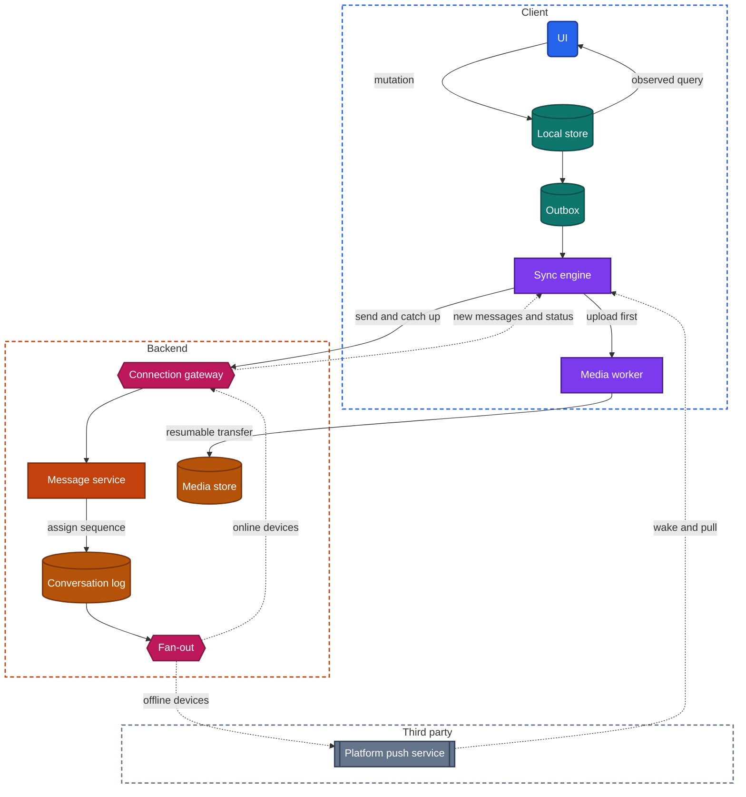
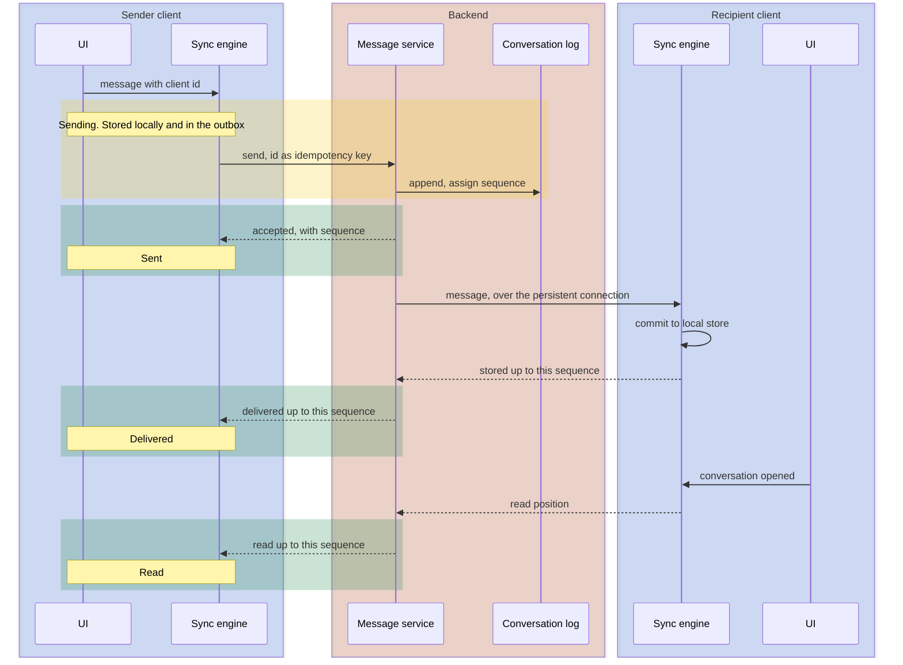

import Probe from '../../../components/Probe.astro';
import Signals from '../../../components/Signals.astro';
import TeardownBar from '../../../components/TeardownBar.astro';
import WorksheetForm from '../../../components/WorksheetForm.astro';

> **The archetype.** An app in which people exchange text and media in one-to-one and group conversations, see whether each message was delivered and read, and find the same conversations on every device they use.

## 39.1 What defines this archetype

A messaging app makes one promise. A message, once sent, arrives exactly once, in order, on every device of the recipient, and the conversation is readable at any time.

Each clause of that promise costs something.

- **Once sent.** The user's part is over when they tap send. Losing the network or the process afterwards is the app's problem.
- **Exactly once.** The network delivers at least once or not at all. The app has to turn that into exactly once.
- **In order.** Every participant sees the same sequence, although their devices sent and received at different moments with different clocks.
- **Every device.** A phone, a tablet and a laptop of one person are separate replicas that must converge.
- **Readable at any time.** The conversation opens without a network, at once, at any scroll position the device holds.

Four concerns dominate the design.

| Concern | Why it dominates | Chapter |
|---|---|---|
| Offline and sync | The conversation is a local replica, and every send is a queued mutation | [Chapter 12](/part-2-concerns/12-offline-and-sync/) |
| Real-time delivery | A message that arrives a minute late is a failed product | [Chapter 14](/part-2-concerns/14-real-time-delivery/) |
| Media | Photos, video and voice are most of the bytes and most of the failures | Chapters 16 to 18 |
| Security | Messages are private by nature, and the strongest form of privacy reshapes the design | [Chapter 21](/part-2-concerns/21-security-and-trust/) |

The archetype has four variants that change the design in a meaningful way. They are independent axes, and a product takes a position on each.

| Axis | One end | Other end |
|---|---|---|
| Main copy of history | The backend keeps full history | The device is the main copy, and the backend relays |
| Content visibility | Backend-readable | End-to-end encrypted |
| Identity | A phone number | An account with a name and credentials |
| Devices | Single device | Multi-device |

The axes are independent in principle and correlated in practice. End-to-end encryption pulls history toward the device, because a backend that cannot read messages gains little from keeping them. Section 39.6 gives the probe that settles each axis.

## 39.2 Requirements read from the product

These are requirements as a user experiences them. None of them names a design.

**What the app does**

- Send text to one person or to a group, and see it in the conversation at once.
- Send photos, video, voice recordings and files, with a preview before the full item has loaded.
- See a status on each sent message that advances as the message travels.
- Receive messages while the app is open, without any gesture, and be notified while it is closed.
- See a list of conversations ordered by latest activity, each with a preview and an unread count.
- Use the same account on more than one device, where the product allows it.
- Search past messages.
- Edit or delete a sent message, where the product allows it, on every device that holds it.

**Qualities it must have**

- Sending feels instant. The message appears before any network round trip.
- A message is never lost and never duplicated, whatever the network does.
- Every participant sees the same order.
- An open conversation scrolls smoothly through thousands of messages.
- A message from another person arrives within about a second while the app is open.
- Opening the app from a notification shows the message that the notification announced.
- The cost in battery and data stays low, although the app is expected to be reachable all day.
- Content is private. In the strongest variant, the operator of the service cannot read it.

Of the seven constraints of [Chapter 2](/part-1-method/2-the-mobile-constraint-set/), three bind hardest. Unreliable network and process death shape the send path. Platform rules shape the receive path, because the operating system decides whether the app may run when a message arrives.

## 39.3 Running the probes

Run the general probes first. They place the app on the scales of Part II, and the messaging probes then separate the variants. [Chapter 4](/part-1-method/4-probes/) describes the probe families and how to run a probe cleanly.

### Probes from Chapter 12

Run P12.1 to P12.4 on the conversation screen, then P12.9 to P12.11. They are defined in [Chapter 12](/part-2-concerns/12-offline-and-sync/). The typical outcomes for a messaging app follow.

| Probe | Typical outcome for messaging | What it tells you |
|---|---|---|
| P12.1 Offline read | Conversations appear, including ones not visited in this session | The local store is filled by sync, not by visits |
| P12.2 Offline write | The message shows at once with a pending mark | Optimistic update |
| P12.3 Kill while pending | The message is still there | Durable outbox |
| P12.4 Reconnect | The message sends from any screen, often from the background | App-level sync engine |
| P12.9 Long absence | A quick update, or a short "updating" state and then a full list | Delta by cursor |
| P12.10 First sync | Conversation list first, recent messages next, older ones later or on demand | Staged backfill, or a window |
| P12.11 Flaky network duplicates | No duplicate | Weak evidence of an idempotent send |

The conflict probes, P12.5 to P12.8, mostly do not apply. A conversation is an append-only sequence. Two people who send at the same moment have not changed the same data. They have each added an item, and the only matter to settle is the order, which P39.3 tests. Conflicts exist only at the edges: an edited message, a group name, a mute setting. Run P12.5 on a group name and P12.7 as "edit a message on one device while deleting it on another" if you want those fields filled.

### Probes from Chapter 14

[Chapter 14](/part-2-concerns/14-real-time-delivery/) asks how new information reaches the app without the user asking. Run its probes with two accounts side by side, for three situations.

- **Both apps open.** Send from one and time the arrival on the other. Arrival within about a second, with no gesture, points to a persistent connection. Typing and presence indicators point the same way, because they are too frequent to deliver any other way.
- **Recipient in the background.** A notification arrives within seconds. That is a platform push, since the app has no connection of its own while suspended.
- **Recipient returns after a gap.** Bring the app to the foreground after several minutes in airplane mode. Missed messages appear together in a moment. That is catch-up over a freshly opened connection.

Typical for messaging is all three: a persistent connection in the foreground, a platform push in the background, and a pull on return.

### Messaging probes

These nine probes are specific to the archetype. Run them with a second account of your own, or with a person who has agreed to help. P39.1 to P39.3 examine the path of one message. P39.4, P39.5 and P39.7 locate the history. P39.6 examines media, P39.8 deletion and P39.9 the device model.

<TeardownBar />

### P39.1 Status stages

<Probe id="P39.1" />

### P39.2 Recipient switched off

<Probe id="P39.2" />

### P39.3 Crossed messages

<Probe id="P39.3" />

### P39.4 New device history

<Probe id="P39.4" />

### P39.5 Old conversation on a second device

<Probe id="P39.5" />

### P39.6 Interrupted video

<Probe id="P39.6" />

### P39.7 Offline search

<Probe id="P39.7" />

### P39.8 Delete for everyone

<Probe id="P39.8" />

### P39.9 Phone off, companion on

<Probe id="P39.9" />

## 39.4 The design, concern by concern

Each subsection states the design this archetype usually takes and the reason. The components are those of the universal app model in [Chapter 3](/part-1-method/3-the-universal-app-model/).

### Message identity and ordering

A message needs two things before it can be synced: a name and a position.

The name is a client-generated id, created when the user taps send. It is permanent. It serves as the idempotency key for the send, as the key that a recipient uses to discard a repeat, and as the target of every later reference: a reply, a reaction, an edit, a deletion, a status update.

The position is a per-conversation sequence number that the backend assigns when it accepts the message. The backend is the one place that sees all the senders of a conversation, so it is the one place that can put their messages in a single order.

Device timestamps cannot do this job, for three reasons.

- Clocks disagree. A device that is two minutes fast would place its messages after replies to them.
- Offline sends carry the time of the tap, not the time of arrival. A message written in a tunnel would be inserted into the past of a conversation that others have already read.
- Timestamps collide and sequence numbers do not. A sequence has no ties and no gaps, which makes it usable as a cursor.

The sequence is per conversation, not global. Nothing requires an order between messages of different conversations, and a global counter would be a bottleneck for no benefit.

A pending message has no sequence yet. The client shows it at the end of the conversation and gives it a real position when the backend confirms. P39.3 exposes this step. When "one" moves to sit after "two" on the sending device, you have watched reconcile replace a provisional position with the backend's.

### The send path

The send path is the Level 2 write path of [Chapter 12](/part-2-concerns/12-offline-and-sync/), applied to one kind of mutation.

```text
function sendMessage(conversation, content):
  m = Message(id: newUniqueId(), conversation, content, status: Sending)
  transaction(localStore):
    insertAtEnd(conversation, m)      // provisional position, no sequence yet
    outbox.append(m)
  syncEngine.requestRun()

function onSendConfirmed(m, ack):
  transaction(localStore):
    m.sequence = ack.sequence         // the backend's position replaces the provisional one
    m.status = Sent
    outbox.remove(m)
```

The UI draws from the local store, so the message appears before any request is made. The outbox is ordered per conversation. A stuck video in one conversation must not hold back a text in another.

The send is idempotent. If the response is lost, the sync engine sends the same message with the same id, and the backend returns the sequence it already assigned.

Each status stage corresponds to one acknowledgment, and each acknowledgment has an exact meaning.

| Stage | What has happened | Who acknowledged |
|---|---|---|
| Sending | The message is in the local store and the outbox of the sender's device, and nowhere else | Nobody |
| Sent | The backend stored the message durably and assigned its sequence | The backend, to the sender |
| Delivered | A device of the recipient stored the message durably | The recipient's device, through the backend |
| Read | The recipient opened the conversation with the message on screen | The recipient's device, through the backend |

Two details of this table are design choices that probes expose.

First, "delivered" has two possible meanings. In most designs it means a recipient device holds the message. In some it means only that the backend accepted it for the recipient. P39.2 separates the two, because a device that is switched off cannot acknowledge anything.

Second, "read" is rarely a per-message record. It is a read position: one number per user per conversation, holding the highest sequence that user has seen. One small update marks any number of messages read. The same value, synced to the user's own devices, clears the unread count everywhere.

A rejected send is final. The recipient blocked the sender, the group removed them, or the content was refused. The message stays in the conversation, marked failed. Messaging apps almost never roll a message back silently, because a message that vanishes looks like data loss.

### The receive path

A message reaches a device by one of three routes, and a robust design uses all three.

- **Persistent connection, in the foreground.** The client holds one connection open while it is on screen. The backend writes each new message to it. This route is the fastest and the least reliable, because the connection can drop without either side noticing for a while.
- **Platform push, in the background.** The operating system suspends the app and closes its connection. The backend asks the platform's push service to notify the device. Depending on the design, the push carries the message, or it is a push hint that gives the client a short time to run and pull.
- **Catch-up by cursor.** Whenever a connection opens, the client states the highest sequence it holds for each conversation, and the backend returns what follows. This route is the slowest and the only one that is complete.

The first two are optimizations. Catch-up is what makes delivery correct. A design that relies on live events alone loses messages whenever the connection drops silently, and P39.8 shows the same weakness for deletions.

```text
function onIncoming(conversation, messages):
  transaction(localStore):
    for m in messages:
      if exists(m.id): continue         // the connection and catch-up can both deliver it
      insert(m)
    cursor[conversation] = highestContiguousSequence(conversation)
  if hasGap(conversation): requestCatchUp(conversation, cursor[conversation])
  acknowledgeDelivered(conversation, cursor[conversation])   // only after the commit
```

Duplicates are discarded by id, which is how at-least-once delivery becomes exactly-once display. A gap in the sequence is detectable, so the client knows that it missed something and asks. The delivered acknowledgment is sent only after the message is committed to the local store, so "delivered" never describes a message that process death could still lose.

### The conversation list as a derived view

The conversation list shows, for each conversation, the last message, its time and an unread count. None of these is primary data.

- The last message is the item with the highest sequence in that conversation.
- The unread count is the number of messages from others with a sequence above your read position.
- The order of the list is the order of those last messages.

In a full-replica design the client derives all three from the local store, and the list is correct offline. In a windowed design the backend keeps a summary record per conversation and syncs it, because the client may not hold the messages needed to compute it. From outside, the two look the same until you go offline on a fresh device: a derived list can be only as complete as the replica under it.

### Media

Media is handled apart from the message that refers to it. The later chapters on images, playback and file transfer, Chapters 16 to 18, cover the mechanisms. The parts that shape a messaging design are these.

- **Upload first, then send.** The client uploads the file to media delivery and receives a reference. The message carries the reference, the size, the type and a very small thumbnail. The message itself stays small, so the message path stays fast.
- **A separate queue.** Uploads run in background workers, on their own queue. A text sent after a video arrives before it. P39.6 shows this in its last step.
- **Resumable transfer.** A large file is sent in parts, and the backend records which parts it holds. After an interruption the client asks what is missing and continues.
- **Thumbnails first.** The recipient sees the embedded thumbnail at once, usually blurred, then fetches the full item on demand or by a rule: always for photos, only on unmetered connections for video.
- **Processing on the device.** Photos and video are usually reduced in size before upload. The pause between tapping send and the first movement of the progress indicator is that work.

A message with media has one more status than a text: it is not "sent" until its upload completes. The outbox entry waits on the upload, and the dependency must survive process death as well.

### Group fan-out

A group message is written once and delivered to many. Fan-out can be placed in two ways.

- **Fan-out on read.** The backend appends the message to the group's conversation log. Each member's device reads that log by its own cursor. The write is cheap, and storage is shared.
- **Fan-out on write.** The backend copies the message, or a reference to it, into a queue per recipient or per recipient device. Delivery is a simple drain of one queue, and the cost of a send grows with the size of the group.

A backend that keeps full history tends to the first. A backend that relays for devices that hold the main copy tends to the second, because it wants to delete each copy as soon as that device acknowledges it.

From outside, the two cannot be told apart directly. What you can observe is what the product allows. Note the maximum group size, whether a new member sees messages from before they joined, and whether delivered and read are shown per member. A new member who sees old messages implies a shared log that the backend can read. That inference is good. An inference from group size to a fan-out strategy is Speculative.

### Multi-device

There are three models, and P39.9 separates them.

| Model | What each device is | Consequence |
|---|---|---|
| Single device | The account is bound to one device | No convergence problem. A new device replaces the old one |
| Companion | The phone is the only full client. Other devices show what the phone relays | The companion stops when the phone is unreachable |
| Independent devices | Every device has its own connection, cursor and local store | Devices converge through the backend. Each needs its own copy of history |

The independent model adds one requirement that is easy to miss. A message you send from your laptop must also appear on your phone. The backend therefore fans out every message to the sender's other devices as well as to the recipients. Read positions, drafts where they are synced, mute settings and deletions travel the same way.

Identity interacts with this axis. A phone-number identity starts from one device that proves ownership of the number, and other devices are linked to it. An account identity can sign in anywhere with credentials. [Chapter 20](/part-2-concerns/20-identity-and-sessions/) covers both. The sign-in flow is passive observation that fills the identity field of the worksheet.

### Search

Search can run in two places.

- **On-device index.** The client indexes the messages in its local store. It works offline and finds only what the device holds.
- **Backend search.** The backend indexes all history. It finds everything, needs a network, and requires that the backend can read message content.

P39.7 separates them, and its result is one of the most informative in the chapter. Backend search that finds an old message proves that the backend holds readable history. Offline search that finds a year-old message proves that the device holds a full replica with an index.

### End-to-end encryption as a constraint on the whole design

End-to-end encryption means that only the devices of the participants can read a message. Each device holds a private key that never leaves it. The sender's device encrypts the message for the recipient's devices, and the backend stores and forwards data that it cannot read.

It is a constraint on the whole design, because it removes the backend from every job that needs the content. Each such job moves to the client.

| Job | Backend-readable design | End-to-end encrypted design |
|---|---|---|
| Search | The backend can index history | On-device index only |
| History on a new device | The backend serves it | An existing device transfers it, or the user restores a backup |
| Backup | The backend's copy is the backup | The client makes it, protected by a secret the user holds |
| Notification text | The backend can put the text in the push | The client must decrypt before it can show text |
| Link previews | The backend can fetch the page | The sender's client fetches it and attaches the result |
| Media | Stored readable | Encrypted on the device before upload. The key travels in the message |
| Web or desktop version | Can be a thin view of backend data | Must hold keys and decrypt on its own, or relay through the phone |
| Abuse handling | The backend can examine content | Relies on reports from recipients and on patterns of use |

Two consequences reach into the earlier subsections. Multi-device becomes harder, because the sender must encrypt for every device of every recipient and for their own other devices, so adding a device is a visible event. Groups become harder too, because a group key has to reach each member's device and change when a member leaves.

The backend still knows who sent a message to whom, when, and roughly how large it was. It must, to route it. Sequence assignment, fan-out, push and catch-up work unchanged on encrypted payloads.

You cannot verify encryption from outside. A screen that lets two people compare a code is a claim, not a proof. What you can observe is the set of consequences in the table. An app that claims end-to-end encryption and also finds old messages by backend search on a fresh device has contradicted itself, and that observation is worth recording. When every consequence is present, the claim you can make is "the design is consistent with end-to-end encryption", and no more.

### Notifications

[Chapter 23](/part-2-concerns/23-background-work-and-notifications/) covers background work and notifications. For this archetype, two designs matter.

- **The push carries the content.** The operating system can show the notification without running the app. This is simple and reliable, and it requires that the backend can read the message, or that a small piece of the app is allowed to run and decrypt the payload before display.
- **The push is a push hint.** It wakes the client, which pulls by cursor, stores the message and posts the notification itself. The message is then already in the local store when the user taps.

A quick check separates the results, though not always the designs. Receive a notification with the app closed, turn on airplane mode, then open the app. If the message is in the conversation, the client stored it before you opened the app. If the conversation lacks the message that the notification showed, the notification was drawn from the push alone, and the local store catches up only in the foreground. P39.2 gives the same answer through the delivered mark.

## 39.5 End-to-end architecture

Figure 39.1 shows the components that the probes imply for the most common variant: independent devices, with a backend that keeps a log per conversation.



*Figure 39.1. The client and backend of a messaging app with independent devices.*

In the terms of the universal app model, the connection gateway is the gateway, the conversation log is a change log per conversation, fan-out is async delivery, and the media store sits behind media delivery. In the variant where the device is the main copy, the conversation log is replaced by a queue per device that empties as devices acknowledge.

Figure 39.2 follows one message from sender to recipient, with the recipient's app open.



*Figure 39.2. One message from sender to recipient, with the three acknowledgments that advance its status.*

When the recipient's app is not running, the line from the message service to the recipient's sync engine is replaced by a platform push, followed by a pull when the client is woken or opened. The acknowledgments are the same and arrive later.

## 39.6 Variants and how to tell them apart

Each axis from Section 39.1 is settled by one or two probes. [Chapter 5](/part-1-method/5-from-signal-to-inference/) describes how a signal becomes a claim with a confidence word. The table gives the discriminating probe for each axis.

| Axis | Discriminating probe | Reading |
|---|---|---|
| Main copy of history | P39.4, confirmed by P39.5 | Full history on a new device with the old one off means the backend keeps it |
| Content visibility | P39.7, with P39.4 | Backend search or backend-served history means backend-readable. Their absence is consistent with end-to-end encryption |
| Identity | Passive observation of sign-in | A code sent to a phone number, or credentials for an account |
| Devices | P39.9 | Whether a companion works with the phone off |

**History on the backend against history on the device.** With the backend as the main copy, a device is a cache that happens to be writable. It can hold a window, backfill on demand, and be rebuilt after any failure. Storage use stays modest. With the device as the main copy, the device holds everything, storage grows for the life of the account, and losing the device without a backup loses the history. Storage used, from the device's settings, is a cheap first signal. P39.4 is the decisive one.

**Backend-readable against end-to-end encrypted.** The honest limit applies here. No probe shows that a backend cannot read content. Probes show only that the product behaves as if it cannot. Some products apply end-to-end encryption to certain conversation types and not to others. Run P39.4 and P39.7 once for each type, and record the result per type.

**Identity and devices.** A phone-number identity tends to treat one device as primary and link the others to it. An account identity tends to treat devices as equals. This is a tendency, so record what P39.9 shows and do not infer it from the identity. Where devices are independent, follow P39.9 with P39.5 on the second device, because the amount of history that a linked device receives is a design decision of its own.

The signal table collects the behaviors from all nine probes and from normal use.

<Signals chapter={39} />

## 39.7 What changes with scale

The client design barely changes between a small messaging app and a very large one. The backend changes a great deal, and little of that is visible from outside.

**The same at every size**

- Client-generated ids and an idempotent send.
- A local store that the UI reads, with a durable outbox.
- A per-conversation sequence assigned by the backend.
- Catch-up by cursor as the route that makes delivery complete.
- The four status stages and what they acknowledge.

**What changes**

- **Connections.** A small app holds persistent connections in the same service that handles messages. A large one runs a dedicated tier whose only job is to hold millions of open connections and route to them. This is why Figure 39.1 draws the connection gateway apart from the message service.
- **Ordering.** A single database can number every conversation's messages. At large size, conversations are partitioned, and each partition numbers its own. The per-conversation sequence is what makes this possible, since no order across conversations was ever promised.
- **Ephemeral events.** Typing and presence are never stored, are sent far more often than messages, and are the first thing to be limited. In large groups they are commonly reduced or absent.
- **Group fan-out.** Copying a message to every member's queue works for small groups. For very large groups and broadcast channels, members read a shared log instead, and status per member is dropped.
- **Push.** Pushes are grouped and rate-limited, so a busy group produces one notification that updates and not one per message.
- **Retention.** A backend that keeps full history pays for storage that grows without limit. A backend that relays keeps only what is undelivered, and sets a limit on how long it waits for a device that stays off.

From outside you see only the product limits these produce: group size caps, missing typing indicators in large groups, summarized notifications, a linked device that is signed out after a long absence. Each is a Speculative signal of scale pressure, since a product decision explains it equally well.

## 39.8 Completed worksheet

[Chapter 6](/part-1-method/6-the-teardown-worksheet/) describes the worksheet and the order in which to fill it in. The fields in this form are specific to messaging. The probes of Section 39.3 fill most of them.

<TeardownBar />

<WorksheetForm chapters={[39]} />

The fields that [Chapter 12](/part-2-concerns/12-offline-and-sync/) adds to the worksheet take these typical values for the conversation feature of a messaging app. A value that differs in your teardown is a finding. Record it with the probe that produced it.

| [Chapter 12](/part-2-concerns/12-offline-and-sync/) field | Typical value for messaging | Confidence |
|---|---|---|
| Offline level | 3 Local replica | Inferred |
| Offline read scope | All synced | Inferred |
| Offline write actions | Send text, send media, react, delete for yourself | Observed |
| Pending mutations survive force-quit | Yes | Inferred |
| Outbox drain trigger | App, and background where the operating system allows | Inferred |
| Rejection behavior | Failed state with retry | Observed |
| Idempotency evidence | No duplicates seen | Speculative |
| Pull trigger | Persistent connection in the foreground, push hint in the background | Inferred |
| Delta or full refetch | Delta, by a cursor per conversation | Inferred |
| First sync order | Conversation list, then recent messages, then backfill or on demand | Observed |
| Conflict unit | The message. A conversation is appended to, not edited | Inferred |
| Conflict detection | None needed for new messages. Version for an edited message | Speculative |
| Conflict resolution | Order by backend sequence. LWW for an edited message and for settings | Inferred |
| Delete against edit rule | Delete wins | Observed |
| Backend components implied | Gateway holding connections, message service, change log per conversation or queue per device, async delivery, media delivery, platform push as a third party | Inferred |
| Failure modes seen | A message stuck at sending, a notification without the message, a companion that waits for the phone | Observed |

## 39.9 As an interview question

The question is usually asked as "design a messaging app" or "design the client for a chat product". It is a frequent choice because it touches sync, real-time delivery and storage in a small space.

**Clarify first.** Ask four things, in this order, because each one removes or adds a large part of the design.

1. One-to-one only, or groups, and how large.
2. One device per user or several.
3. Whether the backend may read content, or end-to-end encryption is required.
4. Whether media is in scope.

Then state the promise from Section 39.1 in your own words. It gives you the acceptance test for everything you draw.

**Go deep on three concerns.**

- **Identity and ordering.** Client-generated ids, a sequence per conversation from the backend, and why device time cannot order a conversation. This shows that you see the distributed problem inside a simple screen.
- **The send path.** Local store first, a durable outbox, an idempotent send, and the exact meaning of each status. Draw Figure 39.2 from memory.
- **The receive path.** A persistent connection in the foreground, a platform push in the background, catch-up by cursor on every connect. Say plainly that the first two are optimizations and the third is what makes delivery correct.

**Trade-offs an interviewer expects to hear.**

- A full replica on the device against a window with backfill: offline reach and search against storage and first-sync time.
- Fan-out on write against fan-out on read for groups, and the group size at which you would switch.
- A push that carries content against a push hint: reliability of the notification against privacy and a single source of truth.
- What end-to-end encryption removes from the backend, and where each job goes. If you name search, history on a new device, and backups without being asked, you have covered what most candidates miss.
- Per-message read records against a read position per conversation.

Leave presence, typing indicators and reactions until the core is drawn. They reuse the same paths.

## 39.10 Summary

- A messaging app promises that a sent message arrives exactly once, in order, on every device of the recipient, and that the conversation is always readable. Sync, real-time delivery, media and security dominate its design.
- A message has a client-generated id, which makes the send idempotent and the receive free of duplicates, and a per-conversation sequence from the backend, which gives every participant the same order.
- The send path is local store first, then a durable outbox. Sending, sent, delivered and read each correspond to one acknowledgment with an exact meaning.
- The receive path uses a persistent connection in the foreground and a platform push in the background. Catch-up by cursor is the route that makes delivery complete.
- The conversation list and the unread count are derived views. Read state is a position per user and conversation, synced like any other data.
- Media is uploaded apart from the message, resumably, with a thumbnail inside the message.
- End-to-end encryption moves search, history transfer and backups to the client. You can observe those consequences. You cannot verify the encryption.
- Four axes separate real products: where history lives, who can read content, how identity works and how many devices an account has. P39.4, P39.7 and P39.9 settle three of them, and the sign-in flow settles the fourth.
