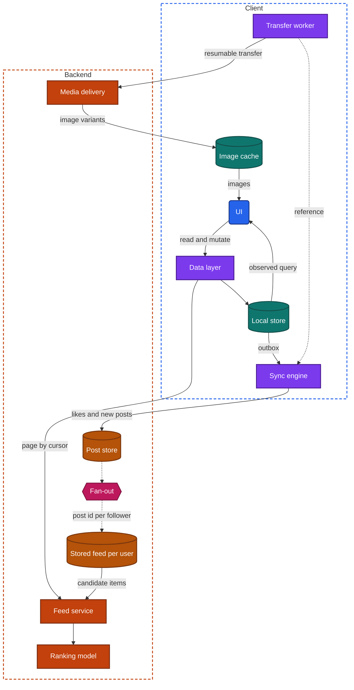
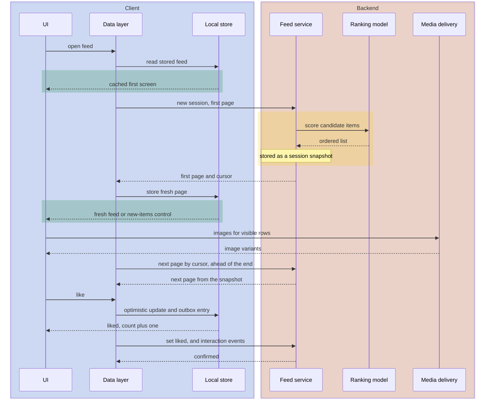

import Probe from '../../../components/Probe.astro';
import Signals from '../../../components/Signals.astro';
import TeardownBar from '../../../components/TeardownBar.astro';
import WorksheetForm from '../../../components/WorksheetForm.astro';

> **The archetype.** An app in which people publish posts and short-lived stories, and each person reads an endless feed of what others published, chosen and ordered for that person.

## 40.1 What defines this archetype

A social feed app makes one promise. You open the app and fresh, relevant content is there at once, with no end.

Each clause of that promise costs something.

- **At once.** The first screen cannot wait for a ranking request on a cellular network. Something must be on the device before the tap on the icon.
- **Fresh.** What is on the device is old by definition. The app has to show it and replace it without disturbing the reader.
- **Relevant.** Someone has to choose a few hundred items for this person out of millions. That work runs on the backend and takes time.
- **No end.** The list has no last page. Paging must stay coherent through a feed whose order is computed per request.

A second promise sits beside the first. When you publish, your post looks published the moment you tap.

Four concerns dominate the design.

| Concern | Why it dominates | Chapter |
|---|---|---|
| Lists, feeds and pagination | The product is one endless list with no stable sort key | [Chapter 15](/part-2-concerns/15-lists-feeds-and-pagination/) |
| Images | Most of the bytes, most of the memory and most of the perceived speed | [Chapter 16](/part-2-concerns/16-images/) |
| Personalization | The order of the feed is the product, and a backend model decides it | [Chapter 29](/part-2-concerns/29-personalization-and-on-device-intelligence/) |
| Caching and prefetching | "At once" is met only by data that is already on the device | [Chapter 11](/part-2-concerns/11-local-storage-caching-and-prefetching/) |

Two more concerns shape parts of the design: ads ([Chapter 27](/part-2-concerns/27-ads-attribution-and-growth/)) and publishing ([Chapter 18](/part-2-concerns/18-file-transfer-uploads-and-downloads/)).

The archetype varies along two axes that change the design in a meaningful way.

| Axis | One end | Other end |
|---|---|---|
| Order | Time-ordered. Newest first, the same for any reader of the same sources | Ranked. A model scores items for this reader at this moment |
| Source of items | Followed accounts. The reader chose the sources | Inferred interests. The backend chooses from everything published |

A feed of followed accounts can be time-ordered or ranked. A feed of inferred interests is always ranked, because nothing else could select it. Many products offer more than one feed, on separate tabs. Run the probes once per tab.

Stories are a second content form inside the same product. A story expires after a fixed time, plays full screen in a fixed sequence, and tracks which items each viewer has seen.

## 40.2 Requirements read from the product

These are requirements as a user experiences them. None of them names a design.

**What the app does**

- Show a home feed of posts, and supply more for as long as the user scrolls.
- Bring newer posts on request, and say when newer posts exist.
- Let the user like, share and comment on a post, and follow or unfollow its author.
- Let the user publish a post with photos or video, and see it in their own feed.
- Show a row of stories, mark which are unseen, and play them in order until each expires.
- Notify the user of likes, comments, follows and mentions.
- Show ads, labeled as such, among the posts and between stories.

**Qualities it must have**

- The first screen has content within a moment of launch, on any network.
- Scrolling is smooth through hundreds of items with media.
- Nothing jumps. Images arrive into space that was reserved for them, and new posts do not push the reader's place down the screen.
- A tap on like responds before any round trip.
- The feed does not repeat itself, and a refresh brings something new.
- A story advances to the next one without a loading pause.
- Publishing does not hold the user on a progress screen.
- Data and storage use stay bounded.

Of the seven constraints of [Chapter 2](/part-1-method/2-the-mobile-constraint-set/), three bind hardest. Human attention sets the bar for the first screen and for every tap. Limited resources bound what may be prefetched and kept. Unreliable network shapes the read path and the write path alike.

## 40.3 Running the probes

Run the general probes first. They place the app on the scales of Part II, and the archetype probes then separate the variants. [Chapter 4](/part-1-method/4-probes/) describes the probe families and how to run a probe cleanly.

### Probes from Chapter 15

Run these on the home feed. They are defined in [Chapter 15](/part-2-concerns/15-lists-feeds-and-pagination/).

| Probe | Typical outcome for a social feed | What it tells you |
|---|---|---|
| P15.1 Scroll rhythm | An indicator appears only during a fast fling | The next page is requested ahead of the end |
| P15.2 Page size | A smaller first batch, then a constant larger one | A small first page for a fast first screen |
| P15.5 Refresh a ranked feed twice | Mostly different items each time | A ranked feed that holds back what was shown |
| P15.6 New items while reading | A new-items control, or nothing until a pull to refresh | New items are never inserted under the reader |
| P15.7 Leave and return | Kept after the detail screen and a short absence, reset after a long one | The loaded items are held, with a freshness time limit |
| P15.10 List against detail | The row shows the change at once | Feed and detail read one stored copy of the post |

P15.5 settles the order axis. The same items in the same order on each refresh means a time-ordered feed, and you record that and skip the ranking probes.

P15.3 and P15.4 need a time-ordered list that a second device can change. Run them on the list of posts on your own profile, where the typical outcome is cursor paging or keyset paging.

### Probes from Chapter 11

[Chapter 11](/part-2-concerns/11-local-storage-caching-and-prefetching/) asks what the app keeps and what it fetches before you ask.

| Probe | Typical outcome for a social feed | What it tells you |
|---|---|---|
| P11.1 Memory or disk | The feed appears on both offline visits | The loaded feed is on disk |
| P11.2 Read policy | Old content at once, then newer content or a control that offers it | Stale-while-revalidate on the home feed |
| P11.6 Unvisited detail | Only what the feed row showed appears, and the comments fail to load | Seeding from the feed item. Comments are fetched on open |
| P11.7 Metered and unmetered | Less is ready ahead of time on cellular | Prefetching is limited on a metered network |

### Probes from Chapter 16

Run these in the feed on a weak connection. They are defined in [Chapter 16](/part-2-concerns/16-images/).

Typical outcomes are these. P16.1 shows a tint per image or a blurred preview, so stand-in data travels in the feed item. P16.3 shows nothing moving when images land, so the item carries dimensions. P16.5 shows images on both offline visits, which means a memory cache and a disk cache. P16.7 fills the rows you stopped on first. P16.10 returns smaller dimensions and no location.

### Probes from Chapter 29

[Chapter 29](/part-2-concerns/29-personalization-and-on-device-intelligence/) supplies the probes for the ranking. Run them on each feed tab.

Typical outcomes are these. P29.4 shows a new account generic or popular content, or asks it for interests. P29.5 shows a clear shift on the refresh, and within the visit on a feed of inferred interests. P29.8 shows a new device as tailored as the old one, which means a backend profile.

### Probes from Chapters 27 and 18

Run P27.1 and P27.2 from [Chapter 27](/part-2-concerns/27-ads-attribution-and-growth/). Typical is a labeled native ad every few posts and a full-screen ad between stories. In P27.2 the ad either stays in the cached feed, which means the backend inserted it, or its slot closes up, which means the client did.

Run P18.1, P18.2, P18.4 and P18.6 from [Chapter 18](/part-2-concerns/18-file-transfer-uploads-and-downloads/) on a post with video. Typical is a short preparation phase, a transfer that continues by itself after an interruption and while the app is off screen, and a post that other accounts see only when it is complete.

### Social feed probes

These eight probes are specific to the archetype. Run them with a second account of your own, or with a person who agreed to help.

<TeardownBar />

### P40.1 First screen after a gap

<Probe id="P40.1" />

### P40.2 Like in airplane mode

<Probe id="P40.2" />

### P40.3 Counter from a second account

<Probe id="P40.3" />

### P40.4 Follow, then unfollow

<Probe id="P40.4" />

### P40.5 Publish and interrupt

<Probe id="P40.5" />

### P40.6 Stories in airplane mode

<Probe id="P40.6" />

### P40.7 Seen-state on a second device

<Probe id="P40.7" />

### P40.8 Story past its limit

<Probe id="P40.8" />

## 40.4 The design, concern by concern

Each subsection states the design this archetype usually takes and the reason. The components are those of the universal app model in [Chapter 3](/part-1-method/3-the-universal-app-model/).

### The ranked feed and its session snapshot

[Chapter 15](/part-2-concerns/15-lists-feeds-and-pagination/) separates a time-ordered list from a ranked feed. A time-ordered feed of followed accounts has a sort key, the time of publication, and pages by cursor like any list. A ranked feed has no key. Its order exists only in the answer to one request.

The usual answer is a session snapshot. On the first request of a visit, the backend gathers candidate items, scores them for this user, stores the ordered result under a session, and returns the first page with a cursor into that stored order. Later pages read the same stored order. Paging is stable, cheap and free of repeats.

A pull to refresh ends the session and starts a new one. The backend ranks again and holds back what the user was already shown. This is why P15.5 typically returns mostly different items, and it implies that the backend keeps a record of what each user has seen.

The second design from that chapter, ranking each page with shown items excluded, lets the feed react while the user scrolls. Feeds of inferred interests lean toward it. From outside the two differ only in feedback delay. If P29.5 shows the feed shifting before any refresh, the order was not frozen at the start of the visit. A claim beyond that is Speculative.

The client's part is small and strict.

- It requests the next page ahead of the end, so that scrolling never meets a loading row at reading speed.
- It never inserts items above the reader. Newer items wait behind a new-items control, or behind the pull gesture.
- It removes any item it already holds from an arriving page, because a ranked backend can return a repeat when its record of shown items lags.
- It reports what was actually on screen, and for how long, as interaction events. The backend's record of shown items and the model's inputs both depend on it.

### The cached first screen

The promise says "at once", and a ranking request cannot meet it. The design that does is the stale-while-revalidate read policy of [Chapter 11](/part-2-concerns/11-local-storage-caching-and-prefetching/), applied to the first page of the feed.

The client writes the loaded feed to disk as it arrives: the items of the first pages, in order, with the session cursor. At launch it draws from that copy before the network client has opened a connection. The refresh runs behind it. P40.1 shows which of three variants the app takes.

- **Cached, then refreshed.** The old feed shows, and the fresh one replaces it or waits behind a control. This is the common design.
- **Loading, then fresh.** A skeleton covers the wait.
- **Fetched ahead of opening.** A background task or a push hint refreshed the stored feed before the launch. The first screen is both instant and fresh. The cost is data and battery spent on launches that may not happen.

The replacement step needs care. If the fresh feed simply overwrites the cached one a second after launch, the post the user had begun to read vanishes from under their finger. Well-built clients replace the feed only while the user has not scrolled or touched it, and otherwise keep the cached feed and offer the fresh one through the new-items control.

The stored feed also carries a time limit. Returning after a few minutes restores the position. Returning after some hours resets to the top with a new session. P15.7 estimates that limit.

### Prefetching

Three things are prefetched in a feed, in rising order of cost: the next page of items, the images for rows just outside the visible range, and the start of a video that is about to scroll into view. The last is limited or disabled on a metered network.

The post detail screen is not prefetched. It is seeded: the feed item already holds the author, media reference, caption and counters, so the detail screen draws them at once and requests only the comments. P11.6 shows this as a detail screen that is complete except for its comment list.

### Images in the feed

The feed takes the designs of [Chapter 16](/part-2-concerns/16-images/) nearly without exception, because every one of them removes a visible defect.

- **Image variants.** The backend serves a size that fits the device's screen. A feed row never downloads a full camera image.
- **Dimensions and a stand-in in the item data.** The layout is final before any image request is made.
- **A memory cache and a disk cache.** Scrolling back is instant, and the first screen at launch has images as well as text.
- **Cancellation and priority.** A fling through fifty rows must not queue fifty downloads ahead of the rows where the user stops.
- **Preparation before upload.** A photo is resized and its metadata is removed, which shortens the upload and protects the author.

Video in the feed follows [Chapter 17](/part-2-concerns/17-audio-and-video-playback/): one item plays at a time, muted, and a poster image stands in until it starts. The archetype chapter Video and short-video streaming covers the case where video is the whole product.

### Ranking and the learning loop

The feed is ranked by a backend model, because a recommendation model needs the behavior of every user ([Chapter 29](/part-2-concerns/29-personalization-and-on-device-intelligence/)). The pipeline has three steps, and none of them is visible from outside.

1. **Gather candidates.** A few hundred to a few thousand items: recent posts from followed accounts, and items that resemble what the user engaged with.
2. **Score.** The model estimates, for each candidate, how likely this user is to engage with it.
3. **Assemble.** Rules adjust the scored list. They limit runs of posts from one author, mix content forms, and place ads.

What is visible is the loop around it. The client records interaction events: what was shown, how long it stayed on screen, what was tapped, liked, shared or hidden. It uploads them in batches while the app is in use. The backend turns them into model inputs for this user. P29.5 measures the length of that loop, and for this archetype it is typically one refresh.

A new account has no inputs. It is shown a default ranking, or asked for interests, or offered accounts to follow. P29.4 shows which.

### Likes and counters

A like is the smallest mutation in the app and the most frequent. It takes the optimistic update of [Chapter 12](/part-2-concerns/12-offline-and-sync/): the UI changes first and the request follows.

```text
function toggleLike(post):
  transaction(localStore):
    post.likedByMe = not post.likedByMe
    if post.likedByMe: post.likeCount += 1
    else: post.likeCount -= 1                    // a display estimate, not the truth
    outbox.replace(key: likeKey(post.id), desired: post.likedByMe)   // latest intent wins
  syncEngine.requestRun()

function onPostFetched(fresh):
  transaction(localStore):
    pending = outbox.find(likeKey(fresh.id))
    if pending:
      // keep the user's intent, and adjust the fetched count only if it lacks that intent
      post.likedByMe = pending.desired
      post.likeCount = fresh.likeCount + differenceOf(pending.desired, fresh.likedByMe)
    else:
      post.likedByMe = fresh.likedByMe
      post.likeCount = fresh.likeCount
```

Three choices in this code are design decisions that probes expose.

The mutation states a desired end state, liked or not liked. It is not a toggle. A request that says "liked is true" can be retried any number of times with the same result, so no idempotency key is needed. Tapping like, unlike and like again offline leaves one entry in the outbox.

The count on screen has two sources. The client's own tap moves it by one. Every fetch replaces it with the backend's number, which includes the likes of everyone else. P40.3 shows both: an instant step from your tap, and a jump on refresh. The step is an estimate and the fetched value is the reconcile.

The backend's number is itself approximate. A post that receives thousands of likes a minute cannot be counted by a query on each read. The backend keeps a separate counter, updates it asynchronously from the stream of likes, and serves it from a cache. The signs are a rounded figure, a count that lags the list of people who liked, and a count that is briefly old after a refresh.

A rejected like is rare: the post was deleted, or the author blocked the viewer. The client rolls the change back silently. A like has too little value to deserve a failed state.

### The posting pipeline

Publishing is the upload, then attach design of [Chapter 18](/part-2-concerns/18-file-transfer-uploads-and-downloads/).

1. The client prepares the media: it resizes photos, and transcodes video to a size worth uploading.
2. The transfer worker uploads each file to media delivery as a resumable transfer and receives a reference.
3. The sync engine sends the mutation that creates the post, with the references, the caption and a client-generated id as the idempotency key.
4. The backend makes the post visible. For video it may first wait for processing into quality levels.

From the tap on share, the client shows the post in the author's own feed as an optimistic item with a progress indicator. P40.5 tests whether that item and its transfer are durable.

The order matters to everyone else. With upload, then attach, no follower ever sees a post with a hole where the media should be. P18.6 confirms it from a second account.

Many clients begin the upload while the author is still writing the caption. The share tap then completes faster than the file size can explain.

### Stories

A story is a short sequence of full-screen items from one account. Three properties set it apart from a post, and each has a design consequence.

**Stories expire.** Each item carries an expiry time, set by the backend at publication. The backend stops returning the item after that time. A careful client also checks the time itself before it draws the row, so that a device which was offline at the limit does not show a dead story. P40.8 separates the two.

**Stories play in a fixed sequence.** The row of stories is a small list: one entry per account, ordered by the backend, usually unseen first. Tapping an entry starts a player that advances through that account's items and then into the next account. The sequence is known in advance, which makes it the ideal case for prefetching. The client fetches the first unseen item of the next few accounts as soon as the row loads, and while one item plays it fetches the one after. P40.6 measures how far ahead that goes. The reward is a viewer that never shows a loading indicator. The cost is media fetched for stories the user never opens, so the depth is reduced on a metered network.

**Stories track who has seen what.** Seen-state has two readers. The viewer needs it to order the row and to resume at the first unseen item. The author needs it for the list of viewers. The viewer's side is the story counterpart of a read position: one value per viewer per author, holding the newest item that viewer has seen. It is tiny, it is written often, and it must survive going offline in the middle of a story. The client writes it to the local store at once and queues the report in the outbox. P40.7 shows whether the backend stores it and how it reaches the account's other devices.

### Assembling the feed: write time or read time

The backend can build each user's feed at two moments. [Chapter 14](/part-2-concerns/14-real-time-delivery/) introduces fan-out, and the same choice appears here with posts in place of messages.

| | Fan-out on write | Fan-out on read |
|---|---|---|
| What happens at publication | The post's id is copied into a stored feed for each follower | The post is appended to the author's own list |
| What happens when a reader opens the feed | One read of that reader's stored feed | The lists of every followed account are read and merged |
| Cost of a read | Low and constant | Grows with the number of accounts followed |
| Cost of a write | Grows with the number of followers | Low and constant |
| Follow and unfollow | Affect only future posts, unless the stored feed is repaired | Take effect on the next read |

Readers far outnumber writers, so a small product leans to fan-out on write. The weak point then forces a hybrid at size: ordinary accounts fan out on write, and the posts of very popular accounts are merged in at read time.

A ranked feed changes the meaning of the stored feed. It no longer is the feed. It is one source of candidate items, and the ranking step reads it together with other sources.

This is the least observable part of the design. P40.4 gives the only view of it, and only on a time-ordered feed: posts that linger after an unfollow point to a stored feed. Record any other result as Speculative.

### Ads as native items

The feed's ads are native ads, the format [Chapter 27](/part-2-concerns/27-ads-attribution-and-growth/) describes as an ad drawn as an item inside a feed. That chapter gives two ways for the ad to enter, and this archetype usually takes the first.

- **The backend inserts it.** The assembly step places ads among the ranked items and returns one list. The ad is cached, paged and prefetched like a post. It appears in the cached first screen offline.
- **The client inserts it.** An ad component fills fixed positions from its own requests. The ad arrives late and is missing offline.

A product that sells its own ads inserts them on the backend: one request, no layout shift, and frequency limits enforced where the ranking happens. The client's duty is measurement. It reports when an ad was on screen and for how long, through the same interaction events as posts.

### Comments and notifications

A comment list is a time-ordered or ranked list of its own, loaded when the post opens. It pages by cursor. A new comment is an optimistic item with a client-generated id, sent through the outbox, and marked failed if rejected, since a comment has more value than a like.

Notifications are built on the backend from activity on the user's posts and sent by platform push ([Chapter 23](/part-2-concerns/23-background-work-and-notifications/)). Likes are grouped: a replacement key lets one notification replace another, so a popular post does not produce a hundred alerts. A tap on a comment notification is a deep link that enters the comment list at an anchor, the case P15.9 tests.

## 40.5 End-to-end architecture

Figure 40.1 shows the components that the probes imply for the most common variant: a ranked feed of followed accounts with a stored feed per user as a candidate source.



*Figure 40.1. The client and backend of a ranked social feed. Solid lines are the read path and the write path. Dotted lines are asynchronous.*

In the terms of the universal app model, the feed service and the ranking model are services, the post store and the stored feeds are the backend store, and fan-out is async delivery.

The client has a sync engine, and it is a small one. It drains an outbox of likes, follows, comments, seen-state and new posts. It does not pull a replica. The read side is a cache, which places the feed at Level 1 for reads and Level 2 for writes on the offline scale of [Chapter 12](/part-2-concerns/12-offline-and-sync/).

Figure 40.2 follows the archetype's most important flow: opening the app, from the cached first screen to the first optimistic like.



*Figure 40.2. Opening a ranked feed. The cached first screen is drawn before the ranking request returns.*

The yellow phase is the cost of relevance, and the cached first screen exists to hide it.

## 40.6 Variants and how to tell them apart

Each axis from Section 40.1 is settled by one or two probes. [Chapter 5](/part-1-method/5-from-signal-to-inference/) describes how a signal becomes a claim with a confidence word.

| Axis | Discriminating probe | Reading |
|---|---|---|
| Order | P15.5 | The same order on every refresh means time-ordered. Reordered or new items mean ranked |
| Source of items | Passive observation, then P29.4 | Authors you never followed in the feed mean inferred interests. A new account that sees a full feed without following anyone confirms it |
| Feed assembly | P40.4 | Lingering posts after an unfollow mean a stored feed per user |

**Time-ordered against ranked.** A time-ordered feed is the simpler system. It needs no model, no record of shown items and no session snapshot. It can store pages on the device and fill a gap after an absence, as P15.8 tests. Its weakness is a product one: a reader who follows many accounts misses most of what they post. A ranked feed is always full, and it cannot be resumed or compared between two people.

**Followed accounts against inferred interests.** A feed of followed accounts has a bounded candidate set and a natural default, an empty feed with suggestions. A feed of inferred interests draws from everything. It must work for a new account from the first second, so its default ranking matters more, and it learns from time on screen, because the user has stated nothing. Its feedback delay is the shortest in the product.

The signal table collects the behaviors from all eight probes and from normal use.

<Signals chapter={40} />

## 40.7 What changes with scale

The client of a small feed app and of a very large one are nearly the same. The backend is where size shows, and most of that is hidden.

**The same at every size**

- A cached first screen with a refresh behind it, and paging by cursor.
- Item data that carries image dimensions and a stand-in.
- Optimistic likes that state a desired end state.
- Upload, then attach for posts.

**What changes**

- **Ranking.** A small app sorts by time, or by a simple score computed in the query. A large one runs candidate gathering, a model and an assembly step, with a store of per-user model inputs fed by event streams.
- **Feed assembly.** A small app reads the posts of followed accounts at request time, in one query. A larger one stores a feed per user. A very large one adopts the hybrid of Section 40.4 for its most followed accounts.
- **Counters.** A small app counts rows. A large one keeps approximate counters updated from a stream, and shows rounded figures.
- **Ads.** A small app has none, or takes them from an ad source through a client component. A large one sells its own and inserts them at assembly.
- **Experiments.** At size, two accounts differ for reasons that are not personal, because ranking and layout are under experiment ([Chapter 30](/part-2-concerns/30-remote-config-and-experiments/)). Repeat any surprising probe on a second account.

From outside you see rounded counts, a delay before a post reaches followers, and feeds that differ between similar accounts. Each is a Speculative signal of scale, because a product decision explains it equally well.

## 40.8 Completed worksheet

[Chapter 6](/part-1-method/6-the-teardown-worksheet/) describes the worksheet and the order in which to fill it in. The fields in this form are specific to the archetype. The probes of Section 40.3 fill most of them.

<TeardownBar />

<WorksheetForm chapters={[40]} />

The fields that Part II adds to the worksheet take these typical values for the home feed of a ranked social app. A value that differs in your teardown is a finding. Record it with the probe that produced it.

| Field | Typical value for a social feed | Confidence |
|---|---|---|
| **From [Chapter 15](/part-2-concerns/15-lists-feeds-and-pagination/)** | | |
| List order | Ranked | Observed |
| Paging method | Cursor or keyset, into a session snapshot | Speculative |
| Ranking stability on refresh | New items each time | Observed |
| How new items arrive | New-items control, or gesture only | Observed |
| **From [Chapter 11](/part-2-concerns/11-local-storage-caching-and-prefetching/)** | | |
| Read policy | Stale-while-revalidate | Inferred |
| Detail screen data source | Seeded from list | Inferred |
| Prefetch on metered network | Reduced on metered | Inferred |
| **From [Chapter 16](/part-2-concerns/16-images/)** | | |
| Stand-in before arrival | Dominant color or blurred preview | Observed |
| **From [Chapter 29](/part-2-concerns/29-personalization-and-on-device-intelligence/)** | | |
| Where the model runs | Backend | Inferred |
| Feedback delay | On refresh | Observed |
| **From [Chapter 27](/part-2-concerns/27-ads-attribution-and-growth/)** | | |
| Ads present | Native ads in the feed, full-screen ads between stories | Observed |
| **From [Chapter 18](/part-2-concerns/18-file-transfer-uploads-and-downloads/)** | | |
| Order of file and item | Upload then attach | Inferred |
| **From [Chapter 12](/part-2-concerns/12-offline-and-sync/)** | | |
| Offline level | 1 Cached reads for the feed, 2 Queued writes for likes and posts | Inferred |

## 40.9 As an interview question

The question is usually asked as "design a news feed" or "design the home screen of a photo-sharing app". The read path, the write path and the ranking each open into a deep topic, and the candidate has to choose.

**Clarify first.** Ask four things.

1. Time-ordered or ranked, and built from followed accounts or from inferred interests.
2. Which media: text, photos, video.
3. Whether the question is about the client, the backend, or both.
4. Whether stories, ads and notifications are in scope.

Then state the promise from Section 40.1.

**Go deep on three concerns.**

- **The read path.** A cached first screen, stale-while-revalidate, cursor paging into a session snapshot, a new-items control. Say why offset paging fails on a feed, and why a ranked feed has no page two without a snapshot. Draw Figure 40.2.
- **Feed assembly.** Fan-out on write against fan-out on read, with the cost of each, the account with millions of followers, and the hybrid. This is the part most interviewers are waiting for when the question is about the backend.
- **Media.** Variants sized for the device, stand-in data and dimensions in the item, two cache tiers, cancellation on fast scroll. For the write side, upload, then attach with a resumable transfer.

**Trade-offs an interviewer expects to hear.**

- Showing a stale first screen against showing a skeleton.
- A frozen order per session against a feed that adapts as the user scrolls.
- An exact counter against an approximate one that scales.
- For a like, a silent rollback against a visible failure, and why a comment or a post deserves the second.

Leave stories until the feed is drawn. Then present them as the same parts with three changes: an expiry time, a fixed sequence that invites prefetching, and seen-state as a position per viewer and author.

## 40.10 Summary

- A social feed app promises fresh, relevant content at once, with no end. Lists and feeds, images, personalization and caching dominate its design.
- "At once" is met by a cached first screen read from disk, with a refresh behind it. "No end" is met by cursor paging, with the next page requested ahead of the end.
- A ranked feed has no stable order, so the backend stores one per session as a session snapshot, or ranks each page with shown items excluded. A refresh starts a new ranking and holds back what was seen.
- Likes are optimistic updates that state a desired end state. The count on screen is the client's estimate until the next fetch, and the backend's count is itself approximate at size.
- Publishing is upload, then attach. The author sees an optimistic item, and followers see the post only when it is complete.
- Stories are items with an expiry time, played in a known sequence that the client prefetches, with seen-state kept as one position per viewer and author.
- The backend builds each feed at write time, at read time, or with a hybrid for very popular accounts. Only an unfollow on a time-ordered feed gives a view of this from outside.
- Native ads enter the feed at assembly on the backend, or from a client component. P27.2 separates the two.
