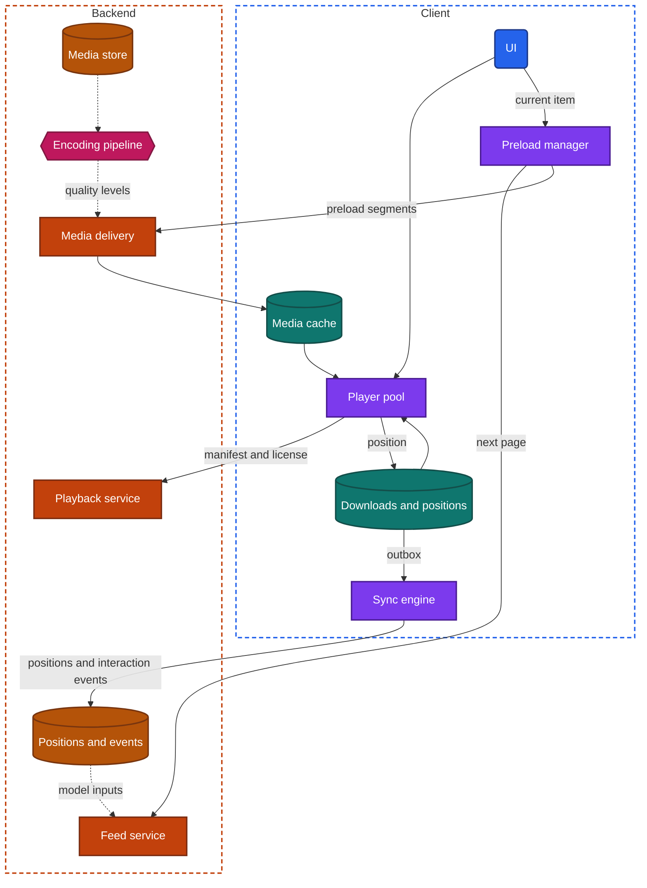
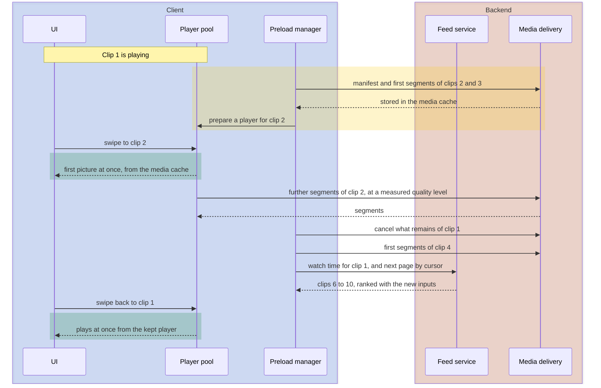

import Probe from '../../../components/Probe.astro';
import Signals from '../../../components/Signals.astro';
import TeardownBar from '../../../components/TeardownBar.astro';
import WorksheetForm from '../../../components/WorksheetForm.astro';

> **The archetype.** An app whose content is video, either a library of long items that the user chooses from, or an endless feed of short clips that the app chooses and the user swipes through.

## 41.1 What defines this archetype

A video app makes one promise. Playback starts the instant you tap or swipe, and it does not stop until you stop it.

Each clause of that promise costs something.

- **The instant.** Video needs several round trips before the first picture. To start at once, the app must have made them before the tap.
- **You tap or swipe.** In a library the user chooses, and the app cannot know which item is next. In a swipe feed the app chooses, so it always knows. The two cases lead to different designs.
- **Does not stop.** The network changes during an item. The player must give up sharpness before it gives up motion.
- **Until you stop it.** A two-hour item will be interrupted. The app must know where the user was, on this device and on the next one.

Four concerns dominate the design.

| Concern | Why it dominates | Chapter |
|---|---|---|
| Audio and video playback | Start delay, stalls and quality are the whole experience | [Chapter 17](/part-2-concerns/17-audio-and-video-playback/) |
| Lists, feeds and pagination | The swipe feed is a ranked feed shown one item at a time | [Chapter 15](/part-2-concerns/15-lists-feeds-and-pagination/) |
| Caching and prefetching | An instant start is a prefetch that guessed right | [Chapter 11](/part-2-concerns/11-local-storage-caching-and-prefetching/) |
| Performance and resource budgets | Video is the most expensive thing a phone does, in data, battery, memory and heat | [Chapter 35](/part-2-concerns/35-performance-and-resource-budgets/) |

Personalization ([Chapter 29](/part-2-concerns/29-personalization-and-on-device-intelligence/)) and file transfer ([Chapter 18](/part-2-concerns/18-file-transfer-uploads-and-downloads/)) shape the feed and the creator side.

The archetype has two variants, and they differ in almost every design decision.

| | Long-form library | Short-form swipe feed |
|---|---|---|
| Item length | Minutes to hours | Seconds to a few minutes |
| Who picks the next item | The user, by browsing or search | A backend model |
| What is preloaded | Little. The next episode at most | The next several clips |
| Buffer ahead | Tens of seconds to minutes | The whole clip is often smaller than a buffer |
| Playback position | Stored and synced across devices | Not kept |
| Downloads | Common, often with a time limit | Rare |
| Usual source of content | A licensed catalog, often protected | Creator uploads |

A second axis crosses the first: where the video comes from. A licensed catalog is prepared by the team ahead of time and is usually protected content. Creator uploads arrive from any user's phone at any moment and must pass through backend processing before anyone can watch. Many products have both forms and both sources. Run the probes once for each.

## 41.2 Requirements read from the product

These are requirements as a user experiences them. None of them names a design.

**What the app does**

- Play a chosen item, with seek, pause, captions and a choice of quality.
- In a swipe feed, play the next clip on each swipe, without an end.
- Continue a long item where the user left it, on any of their devices.
- Download items for viewing with no network, where the product allows it.
- Let a creator publish a video from their device, where the product allows it.
- Choose what to show next, from what the user has watched.
- Play live streams, in some products.

**Qualities it must have**

- The first picture appears within a moment of the tap or swipe.
- Playback does not stall. When the network weakens, the picture gets softer and keeps moving.
- A swipe is as fast on the fortieth clip as on the first.
- Mobile data use is in proportion to what the user watched, or the user can make it so.
- The device does not grow hot, and the battery survives an evening.
- A download plays when it is needed, weeks later, in airplane mode.
- A creator's video becomes available to viewers within minutes.

Of the seven constraints of [Chapter 2](/part-1-method/2-the-mobile-constraint-set/), three bind hardest. Human attention sets the start delay. Unreliable network forces adaptive streaming. Limited resources bound everything the first two would like to do.

## 41.3 Running the probes

Run the general probes first. They place the app on the scales of Part II, and the archetype probes then separate the variants. [Chapter 4](/part-1-method/4-probes/) describes the probe families and how to run a probe cleanly.

### Probes from Chapter 17

[Chapter 17](/part-2-concerns/17-audio-and-video-playback/) supplies the core. Run all ten probes. The typical outcomes differ by variant.

| Probe | Long-form library | Short-form swipe feed |
|---|---|---|
| P17.1 Weak start | Starts soft and sharpens, with few stops | The same, or one quality level for very short clips |
| P17.2 Seek to an unbuffered point | Continues within a second or two | Rarely applies |
| P17.3 Airplane mode mid-playback | Plays for tens of seconds to a few minutes | Plays to the end of the clip |
| P17.5 Switch apps | Picture-in-picture, or a pause that keeps position | Pauses |
| P17.6 Next item offline | A loading indicator, or the start of the next episode | The next clip starts |
| P17.7 Position after a force-quit | Within a few seconds of where you were | At the beginning |
| P17.8 Continue on a second device | Exact after a pause, close after a force-quit | Not synced |
| P17.9 Download then go offline | Plays and seeks freely, often with a stated expiry | No downloads offered |
| P17.10 Autoplay and data cost | Previews play muted while browsing, reduced on cellular | The feed is autoplay by nature. Quality is reduced on cellular |

P17.1 settles the delivery design. Adaptive streaming is typical for both variants. P17.6 is the first evidence of preloading, and P41.1 extends it.

### Probes from Chapters 15, 11 and 29

On the swipe feed, run P15.1 and P15.5 from [Chapter 15](/part-2-concerns/15-lists-feeds-and-pagination/). Typical is no visible page boundary at any swipe speed, since the next page is requested many items ahead, and mostly different items on each refresh.

Run P11.4 and P11.7 from [Chapter 11](/part-2-concerns/11-local-storage-caching-and-prefetching/). Storage typically rises fast and levels off at a bound of several hundred megabytes, which is the media cache. Less is ready ahead of time on a metered network.

Run P29.4 and P29.5 from [Chapter 29](/part-2-concerns/29-personalization-and-on-device-intelligence/) on the swipe feed. A new account typically sees a default ranking of popular clips with no questions asked. The feedback delay is typically within the visit, the shortest of any archetype in this book.

### Probes from Chapter 35

Video is where the budgets of [Chapter 35](/part-2-concerns/35-performance-and-resource-budgets/) are spent fastest.

| Probe | Typical outcome for video | What it tells you |
|---|---|---|
| P35.2 Storage over a week | Rises, then levels off | A bounded media cache |
| P35.4 Data over a day | More than what you watched, in a swipe feed | Preloading runs on a metered network |
| P35.7 Low-power mode | Lower quality or less preloading | The Adaptive posture |
| P35.8 Sustained use | Warm, with a smooth reduction in a well-built app | Whether the app reads the thermal state |

### Probes from Chapters 18 and 19

If the app accepts uploads, run P18.1, P18.2 and P18.4 from [Chapter 18](/part-2-concerns/18-file-transfer-uploads-and-downloads/). Typical is a resumable transfer that continues in the background. If it offers downloads, run P18.8 to P18.10. Typical is a download that waits for an unmetered network by default and continues from where it stopped.

If the app has live streams, run P19.8 and P19.10 from [Chapter 19](/part-2-concerns/19-live-calls-and-live-streaming/). Typical is a delay of several seconds or more against a clock.

### Video probes

These eight probes are specific to the archetype. P41.1 to P41.3 measure preloading and its cost. P41.4 examines the starting quality level. P41.5 and P41.6 belong to the long-form variant. P41.7 examines the creator side, and P41.8 the swipe feed's ranking.

<TeardownBar />

### P41.1 Swipe depth offline

<Probe id="P41.1" />

### P41.2 Swipe depth on cellular

<Probe id="P41.2" />

### P41.3 The cost of skipping

<Probe id="P41.3" />

### P41.4 First second on two networks

<Probe id="P41.4" />

### P41.5 Download time limits

<Probe id="P41.5" />

### P41.6 Position reported from offline

<Probe id="P41.6" />

### P41.7 Upload to availability

<Probe id="P41.7" />

### P41.8 Reopen the swipe feed

<Probe id="P41.8" />

## 41.4 The design, concern by concern

Each subsection states the design this archetype usually takes and the reason. The components are those of the universal app model in [Chapter 3](/part-1-method/3-the-universal-app-model/).

### Adaptive streaming and the start delay

Both variants take adaptive streaming from the design space of [Chapter 17](/part-2-concerns/17-audio-and-video-playback/). Each item exists on the backend at several quality levels, each cut into segments a few seconds long. A manifest lists them. The player fetches the manifest, then one segment at a time, and chooses the quality level again for each segment from the throughput it measured and the buffer it holds.

The alternative designs fail the promise. A whole file cannot start until it has arrived. A progressive download at one quality level stalls whenever the network falls under that level's bitrate.

The start delay is the sum of the round trips before the first picture: a request to a playback service for the item's manifest address, the manifest, the first segment, and a license for protected content. That chapter lists the techniques that shorten it. This archetype uses all of them, and three matter most.

- **Low quality first.** The first segment is fetched at a low quality level, so it is small and arrives fast. P17.1 shows it as a soft first second.
- **The manifest address in the item data.** The feed or the detail screen already carries what the player needs, so one round trip disappears. A swipe feed always does this. It has no signature of its own.
- **Preloading.** Every round trip is made before the tap. This is the only technique that brings the start delay to zero.

A long-form library can preload only where the next item is predictable: the next episode near the end of the current one, or the item under the user's finger on a detail screen. Elsewhere it shortens the wait and covers what remains with a poster image.

### Preloading in a swipe feed

A swipe feed removes the uncertainty. The feed service has already decided the next items, and the user will reach them in order. The client therefore keeps a preload window: for each of the next few items it fetches the manifest and the first segments, and holds them in a media cache.

```text
function onCurrentItemChanged(feed, index):
  window = adaptationPolicy.preloadWindow(networkClass, dataSaver, lowPower)
  for item in feed.items(index + 1, index + window.count):
    preload(item, seconds: window.secondsPerItem, level: window.startLevel)
  cancelPreloadsOutside(index - 1, index + window.count)   // a swipe past is a cancellation
  keepPlayerFor(index - 1)                                  // swiping back is common
  if feed.itemsAfter(index) < window.count + 2:
    requestNextPage(feed.cursor)                            // the feed must outrun the preload
```

Four decisions in this code are visible from outside.

- **How many items.** P41.1 counts them. One or two is cautious. Five or more buys a run of fast swipes with no wait.
- **How much of each.** The first few seconds are enough to start. The rest is fetched only if the user stays. A short clip may be fetched whole, since it is smaller than one buffer of a long item. P41.1 shows which, by whether a clip plays to its end offline.
- **What happens on a swipe past.** A well-built client cancels the fetches for an item the user left. One that does not pays for every clip in full, and P41.3 shows it.
- **When the next page is requested.** Paging must stay ahead of the window, so the feed asks for more items long before the user reaches the end. This is why P15.1 finds no page boundary.

Preloading is the prefetching of [Chapter 11](/part-2-concerns/11-local-storage-caching-and-prefetching/) with one difference. Elsewhere a prefetch is a guess. Here the next item is known, and only the time the user will spend on it is uncertain.

### What preloading costs

The cost is data, and it falls on the user. Suppose a user swipes past three clips for each clip they watch, and the client preloads five seconds of every clip. For each clip watched, fifteen seconds of video were fetched and never seen. If the client fetches whole clips, the waste is three whole clips.

Data is not the only budget. Each preload also keeps the radio active, fills the media cache and may hold a decoder ready. A deep window on a weak network competes with the item that is playing, so a careful client preloads only when the current item's buffer is healthy.

P41.3 measures the waste directly, as the data used per minute of skipping against the data used per minute of watching. P35.4 gives the same reading over a day. The figure tells you how the team weighed the start delay against the user's data plan.

### Quality by network class

The quality selector inside the player reacts to measurement. Around it sits an adaptation policy that sets limits before any measurement exists. [Chapter 36](/part-2-concerns/36-constrained-devices-and-networks/) defines network class as a coarse bucket for current network quality and cost. The policy reads it, together with the device's data-saver mode, low-power mode and any setting in the app, and returns four limits.

| Limit | On an unmetered network | On a metered network | Under data-saver mode |
|---|---|---|---|
| Starting quality level | Middle or high | Low | Lowest |
| Highest quality level | Up to the screen's resolution | Capped | Capped low |
| Preload window | Several items | One or two | None, or one |
| Downloads | Run | Wait, by default | Wait |

P41.2 and P41.4 read the first and third rows. A cap on the highest level shows as a quality menu whose automatic setting stops short of the best level on cellular data.

The starting level deserves a note. A fixed low start is safe and looks soft on a good network. A start chosen by network class looks right most of the time. A start carried over from the last item's measured throughput looks best on a steady network and stalls when the user has just walked out of wireless range. P41.4 separates the three.

### Players as a limited resource

A phone can decode only a few video streams at once, and each prepared player holds memory. A swipe feed that created a player per clip would exhaust both within a minute. The usual design is a small pool: one player for the current item, one prepared for the next, and one kept for the previous. Players are reused as the user moves, in the way a list reuses its rows ([Chapter 35](/part-2-concerns/35-performance-and-resource-budgets/)).

The signs of a missing pool are a feed that slows after many swipes, a device that grows hot, and a process that does not survive a short trip to another app. P35.5, P35.6 and P35.8 read them.

### Downloads and their expiry

A download is the whole-file design at the user's request. The transfer worker fetches every segment of one quality level, with the captions and audio tracks chosen, into storage that the operating system will not clear. The transfer follows [Chapter 18](/part-2-concerns/18-file-transfer-uploads-and-downloads/): a durable transfer queue, a condition on an unmetered network, and continuation after an interruption.

The time limit comes from protected content. A licensed catalog is encrypted, and the player needs a license from the backend to decode it. An offline license carries rules. Typical are a limit counted from the download, a shorter limit counted from the first play, and a count of devices per account. P41.5 reads the first two from the list of downloads, where the app must state them so that the user is not surprised on a flight.

The consequences are observable without any attempt to get around them. A download can be present and unplayable. The app asks to come online at intervals. Signing out removes downloads, because the licenses belong to the account. The picture is black in the app switcher.

A product built on creator uploads may offer downloads with no license at all, enforced by the client alone. From outside the two look alike until the limit passes, so a claim about which one you have is Speculative.

### Playback position across devices

The playback position is one small record per user per item. [Chapter 17](/part-2-concerns/17-audio-and-video-playback/) describes the design this archetype takes: the player writes the position to the local store every few seconds, and reports it to a position store on the backend on pause, on exit and at intervals during playback.

The report is a mutation like any other, and [Chapter 12](/part-2-concerns/12-offline-and-sync/) applies. A position reached with no network waits in the outbox. P41.6 tests whether that outbox is durable and whether a background worker drains it.

Two devices can report different positions for one item. The usual rule is LWW by the time of the report, and not "furthest wins", because a user who starts an item again from the beginning means it. Many products make the conflict visible instead of resolving it, with a prompt that offers both.

The same reports serve two other purposes. The backend counts streams per account from them, which is how a limit on simultaneous viewing is enforced. And the "continue watching" row on the home screen is a list of items with a position that is neither zero nor the end.

### The creator side

A creator's video takes a longer path than a photo, and the last part of it runs on the backend.

1. **Prepare.** The client may transcode the recording to a smaller size before upload. P18.1 shows this as a pause before progress moves.
2. **Upload.** A resumable transfer, owned by a transfer worker, carries the file to media delivery. The post follows the upload, then attach design, so nobody sees the item before its file exists.
3. **Process.** The backend encodes the file at each quality level, cuts the segments, writes the manifest, makes a poster image and preview thumbnails, and runs content checks.
4. **Publish.** The item becomes visible to viewers and to the ranking.

Step three takes from seconds to many minutes, in proportion to the video's length. The item is therefore in a state that neither the client nor the viewer controls. The creator sees "processing". The client learns that it has finished by a push hint or by polling.

Teams shorten the wait in one of two ways. They publish the lowest quality level as soon as it is ready and add the others later, which P41.7 shows as a new video that is soft for its first minutes. Or they encode the first levels on a faster path for short clips. [Chapter 17](/part-2-concerns/17-audio-and-video-playback/) lists this encoding pipeline first among the backend components that playback implies.

### The recommendation-driven feed

The swipe feed is a ranked feed of inferred interests. It has no follow graph to fall back on, so everything it shows is chosen by a backend model ([Chapter 29](/part-2-concerns/29-personalization-and-on-device-intelligence/)).

Its inputs are unusually rich. Every clip is shown full screen and alone, so the client knows exactly what the user was watching and for how long. Watch time, a replay, a swipe away in the first second, a like and a share are all interaction events. The client uploads them promptly, because the next page of the feed should already reflect them.

That requirement decides the paging design. A session snapshot, frozen at the first request, cannot react. This archetype usually ranks each page as it is requested and excludes what was shown, the second design of [Chapter 15](/part-2-concerns/15-lists-feeds-and-pagination/). Pages are small, a handful of clips, so that each request carries fresh inputs. P29.5 shows the result as a feed that changes subject within a few swipes.

Small pages and a deep preload window pull against each other. Items already preloaded have been ranked with older inputs. A team that wants faster adaptation keeps the window shallow. A split design, in which a small on-device model reorders the clips the client already holds, relieves this. It is Speculative from outside, because both give a feed that adapts within the visit.

P41.8 reads the other half: whether the backend's record of shown items survives a restart, and whether the client keeps a reserve of clips for a launch with no network.

### Live streams

A live stream reuses the player and the media delivery of recorded video. [Chapter 19](/part-2-concerns/19-live-calls-and-live-streaming/) covers the design space. This archetype usually takes segmented delivery: the stream is encoded into the same kind of segments, the manifest grows as the broadcast goes on, and viewers trail the live edge by several segments. The delay is many seconds, and the reward is that live video scales through the same edge caches as everything else.

Products where viewers talk back to the broadcaster take low-latency delivery instead. P19.8 measures the delay, and P19.10 shows the player's policy after falling behind the live edge. Chat and reactions travel on a separate real-time path.

## 41.5 End-to-end architecture

Figure 41.1 shows the components that the probes imply for a product with both variants and creator uploads.



*Figure 41.1. The client and backend of a video app. Solid lines are requests. Dotted lines are the slower loops of encoding and ranking.*

In the terms of the universal app model, the player pool and the preload manager are domain logic, the media cache and the downloads are the local store, and the encoding pipeline is async delivery in front of media delivery. A creator upload enters at the media store through a transfer worker, which the figure leaves out. Media delivery serves segments from edge caches apart from the gateway, which is why playback often continues when the rest of the app has failed.

Figure 41.2 follows the archetype's most important flow: one swipe in a short-form feed.



*Figure 41.2. One swipe in a short-form feed. The yellow phase happens before the swipe, which is why the green phase needs no network.*

In a long-form library the yellow phase is missing for most starts. The tap is followed by the manifest request and the first segment at a low quality level, and the start delay is whatever those take.

## 41.6 Variants and how to tell them apart

The form of the product is plain on the screen. What the probes settle is how far each product has taken the designs that its form invites. [Chapter 5](/part-1-method/5-from-signal-to-inference/) describes how a signal becomes a claim with a confidence word.

| Question | Discriminating probe | Reading |
|---|---|---|
| How deep is the preload window | P41.1 | The count of clips that start offline |
| Is the window conditioned on the network | P41.2 | A lower count on cellular data or under data-saver mode |
| Are skipped clips paid for in full | P41.3 | Skipping costs several times more data than watching |
| Is the content protected | P41.5, with the app switcher preview | A stated time limit and a black preview |
| Is the position a queued mutation | P41.6 | A second device learns a position reached offline |
| Does the backend encode in stages | P41.7 | A new video is soft at first |
| Is the order frozen per session | P29.5, with P41.8 | A change of subject within a few swipes means it is not |

**Long-form against short-form.** The long-form library is built around one item at a time. Its effort goes into the buffer, seeking, the playback position, downloads and protection. Its home screen is a set of ranked rows, often a screen-shaped response, and the model has minutes to work. The short-form feed is built around the transition between items. Its effort goes into the preload window, the player pool and the speed of the learning loop. It keeps no position and offers no downloads, because no single clip matters.

**Licensed catalog against creator uploads.** A licensed catalog brings licenses, time limits on downloads, limits on devices and streams, and a black picture in the app switcher. Its items are encoded once, ahead of release. Creator uploads bring the processing delay, content checks, and a catalog that grows every second, which makes ranking the central backend problem.

**Free with ads against paid.** An ad in a video product is itself a video. It is preloaded like a clip, it may be inserted into the feed as a native ad, and in long-form it interrupts playback at marked points ([Chapter 27](/part-2-concerns/27-ads-attribution-and-growth/)). A paid tier removes it through an entitlement ([Chapter 26](/part-2-concerns/26-payments-and-subscriptions/)). Record which features change between tiers. Downloads, background playback and the highest quality level are the usual ones.

The signal table collects the behaviors from all eight probes and from normal use.

<Signals chapter={41} />

## 41.7 What changes with scale

Playback is the concern where a small team can least afford to build its own. Much of the design is therefore the same at every size, bought as a capability.

**The same at every size**

- Adaptive streaming with a low start.
- A poster image as the stand-in.
- The playback position written locally and reported on pause.
- Upload, then attach, with a resumable transfer.

**What changes**

- **Encoding.** A small app encodes every upload at a fixed set of quality levels. A large one chooses levels per item, encodes popular items again with better settings, and publishes levels in stages.
- **Media delivery.** A small app serves from one provider's edge caches. A very large one uses several, steers each player among them, and places caches inside access networks.
- **Preloading.** A small app preloads one item with fixed rules. A large one sets the window from device class, network class and experiments, and tunes it per region from playback measurements.
- **Ranking.** A small app sorts by recency and popularity. A large one runs the learning loop of Section 41.4 with model inputs updated in seconds.
- **Quality selection.** A small app uses the player's default selector. A large one tunes it from measured start delays and stalls across all devices ([Chapter 34](/part-2-concerns/34-observability/)).

From outside you see only the edges: a quality menu with many levels, a new video that sharpens after some minutes, a feed that adapts in a few swipes. Each is a Speculative signal of scale.

## 41.8 Completed worksheet

[Chapter 6](/part-1-method/6-the-teardown-worksheet/) describes the worksheet and the order in which to fill it in. The fields in this form are specific to the archetype. The probes of Section 41.3 fill most of them.

<TeardownBar />

<WorksheetForm chapters={[41]} />

The fields that Part II adds to the worksheet take these typical values. A value that differs in your teardown is a finding. Record it with the probe that produced it.

| Field | Long-form library | Short-form swipe feed |
|---|---|---|
| **From [Chapter 17](/part-2-concerns/17-audio-and-video-playback/)** | | |
| Delivery design | Adaptive streaming | Adaptive streaming |
| Buffer ahead | Tens of seconds to minutes | Whole item |
| Next item | Not preloaded, or start of next episode | Start of next item preloaded |
| Position after force-quit | Saved every few seconds | Not saved locally |
| Position across devices | Synced closely | Not synced |
| Offline downloads | Plays offline, with an expiry | None offered |
| Autoplay in feeds | Reduced on metered or data saver | Reduced on metered or data saver |
| **From [Chapter 15](/part-2-concerns/15-lists-feeds-and-pagination/)** | | |
| List order | Ranked rows | Ranked |
| Ranking stability on refresh | Reordered | New items each time |
| **From [Chapter 11](/part-2-concerns/11-local-storage-caching-and-prefetching/)** | | |
| Prefetch on metered network | Reduced on metered | Reduced on metered |
| Disk cache bound | Bounded | Bounded |
| **From [Chapter 29](/part-2-concerns/29-personalization-and-on-device-intelligence/)** | | |
| Feedback delay | On refresh, or next day | Within the visit |
| **From [Chapter 35](/part-2-concerns/35-performance-and-resource-budgets/)** | | |
| Data pattern | Proportionate | More than consumed |
| Posture | 3 Budgeted or 4 Adaptive | 4 Adaptive |
| **From [Chapter 18](/part-2-concerns/18-file-transfer-uploads-and-downloads/)** | | |
| Shape of the transfer | Resumable transfer, for downloads | Resumable transfer, for uploads |

## 41.9 As an interview question

The question is usually asked as "design a video streaming app" or "design a short-video feed". The two are different questions, and saying so early is the first thing an interviewer listens for.

**Clarify first.** Ask four things.

1. Long-form, short-form, or both.
2. A licensed catalog or creator uploads, and whether upload is in scope.
3. Whether downloads and continuing across devices are required.
4. Client, backend, or both.

Then state the promise from Section 41.1 and name the number you will design for: the start delay.

**Go deep on three concerns.**

- **Adaptive streaming.** Quality levels, segments, a manifest, a selector driven by throughput and buffer. Count the round trips before the first picture and remove them one by one.
- **Preloading, for short-form.** The preload window, how much of each item, cancellation on a swipe past, a pool of players, and the feed staying ahead of the window. Draw Figure 41.2. Then give the cost in the user's data and say how the policy changes on a metered network.
- **The upload and encoding pipeline, when creators are in scope.** A resumable transfer, upload, then attach, backend encoding into quality levels, and the processing state between upload and availability.

For long-form, replace the second with the playback position and downloads: local writes every few seconds, reports through an outbox, a conflict rule, and offline licenses with time limits.

**Trade-offs an interviewer expects to hear.**

- Start delay against data wasted on clips the user skips.
- A low starting quality level against a soft first second.
- A deep preload window against a feed that adapts to the last swipe.
- Publishing a new video early at low quality against waiting for every level.
- LWW by report time against "furthest wins" for the playback position.
- Segmented delivery against low-latency delivery for live streams: scale and cost against delay.

Mention the budgets without being asked. Video is where data, battery, memory and heat are all spent at once, and a design that names its limits is more convincing than one that only plays.

## 41.10 Summary

- A video app promises that playback starts the instant you tap or swipe and does not stop. Playback, feeds, prefetching and resource budgets dominate its design.
- Both variants use adaptive streaming: quality levels, segments and a manifest, with a low start that keeps the first segment small.
- A swipe feed knows the next items, so it preloads the start of several of them and keeps a small pool of players. An instant start is a preload that was made before the swipe.
- Preloading is paid for in the user's data. An adaptation policy shrinks the window and caps the quality level by network class, data-saver mode and low-power mode.
- A long-form library keeps a playback position, written locally and reported through an outbox, and offers downloads whose time limits come from offline licenses.
- A creator's video is uploaded by a resumable transfer and then encoded on the backend into quality levels. It becomes available later, sometimes at low quality first.
- The swipe feed is ranked by a backend model from watch time and other interaction events, usually one small page at a time, so that it adapts within the visit.
- Live streams reuse the same player and media delivery, usually with segmented delivery and a delay of many seconds.
