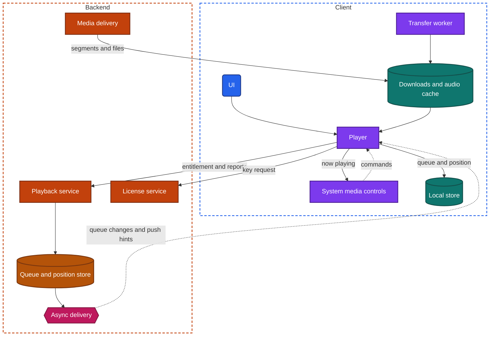
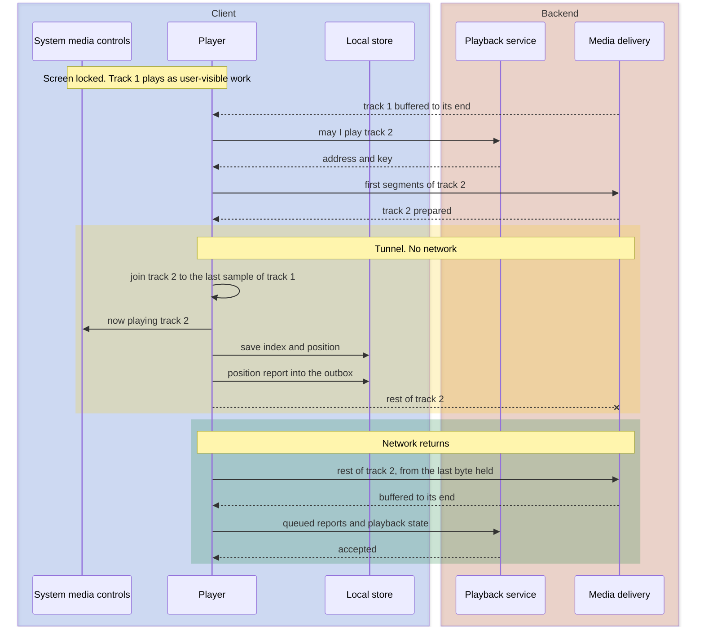

import Probe from '../../../components/Probe.astro';
import Signals from '../../../components/Signals.astro';
import TeardownBar from '../../../components/TeardownBar.astro';
import WorksheetForm from '../../../components/WorksheetForm.astro';

> **The archetype.** An app in which people listen to music, spoken episodes or live radio for long stretches, mostly with the screen off, and expect the same queue, library and place in an episode on every device they own.

## 42.1 What defines this archetype

An audio app makes one promise. Sound keeps playing, whatever else the phone is doing and wherever you go.

Each clause costs something.

- **Keeps playing.** A stall is the one failure every listener notices. So is a silence between two tracks that were recorded as one piece.
- **Whatever else the phone is doing.** The screen is locked, another app is in front, and the operating system is looking for processes to remove. The player has to stay alive with no UI.
- **Wherever you go.** The listener walks out of wireless range, rides through a tunnel, boards a flight, gets into a car, and picks up a tablet at home. Playback follows.

Four concerns dominate the design. Two more support them.

| Concern | Why it dominates | Chapter |
|---|---|---|
| Playback | The buffer, the next item and the playback position are the product | [Chapter 17](/part-2-concerns/17-audio-and-video-playback/) |
| Background work | Almost all listening happens with the app off screen | [Chapter 23](/part-2-concerns/23-background-work-and-notifications/) |
| Downloads | Offline listening is a main feature, with rules attached to every file | [Chapter 18](/part-2-concerns/18-file-transfer-uploads-and-downloads/) |
| Platform surfaces | The lock screen, a watch and a car are where the app is used | [Chapter 25](/part-2-concerns/25-platform-surfaces-widgets-wearables-and-extensions/) |
| Offline and sync | The library, the play queue and positions are synced data | [Chapter 12](/part-2-concerns/12-offline-and-sync/) |
| Local storage | Recently played audio is cached, and downloads must not be evicted | [Chapter 11](/part-2-concerns/11-local-storage-caching-and-prefetching/) |

This chapter uses one term that the glossary does not hold yet. The **play queue** is the ordered list of items the player will play, together with the index of the current item.

The archetype has three variants. Many products combine two of them, and each feature then follows its own variant.

| | On-demand music catalog | Podcast app on episode feeds | Live radio |
|---|---|---|---|
| Unit | A track of a few minutes | An episode of minutes to hours | A stream with no end |
| Who hosts the audio | The app's own media delivery | Usually each show's publisher | The station, or the app's media delivery |
| What must be remembered | The play queue | A playback position per episode | Nothing, or a short window behind the live edge |
| Hardest playback problem | No silence between tracks | Continuing exactly where you stopped | Staying on through a weak network |
| Downloads | Protected, with a license and an expiry | Plain files, often fetched automatically | None |

Section 42.6 gives the probe that separates each pair.

## 42.2 Requirements read from the product

These are requirements as a listener experiences them. None of them names a design.

**What the app does**

- Play an item within a moment of the tap, and keep playing when the screen locks or another app opens.
- Show the title, artwork and controls on the lock screen, and obey headset buttons.
- Move to the next item by itself. Albums recorded without breaks play without breaks.
- Let the listener build and reorder a play queue, and find it on another device.
- Move live playback from one device to another without starting the item again.
- Download items for offline use, and say when a download can no longer be played.
- Fetch new episodes of followed shows without being asked.
- Continue an episode from where the listener stopped, on any device.
- Appear on a watch and in a car, with the same library.

**Qualities it must have**

- No stall on an ordinary commute, including its dead spots.
- No silence at a track boundary that the recording does not contain.
- A pause for a call, and a pause when the headset disconnects.
- Hours of playback at a small battery cost.
- Modest use of mobile data, and none for downloaded items.
- Downloads that survive low storage, and a cache that does not grow without limit.

Of the seven constraints of [Chapter 2](/part-1-method/2-the-mobile-constraint-set/), three bind hardest. Unreliable network shapes the buffer and the downloads. Process death shapes how the player saves its state. Platform rules decide whether the player may run at all when it is off screen, and what it must show while it does.

## 42.3 Running the probes

Run the general probes first, on one kind of content at a time. A product that offers both music and episodes needs two passes, because the two kinds usually take different designs. [Chapter 4](/part-1-method/4-probes/) describes how to run a probe cleanly.

### Probes from Chapter 17

[Chapter 17](/part-2-concerns/17-audio-and-video-playback/) holds the core probes. Run them with headphones in a quiet place.

| Probe | Typical outcome for this archetype | What it tells you |
|---|---|---|
| P17.1 Weak start | Audio starts after a wait, with no audible change in quality | The delivery design stays Speculative. Audio hides it |
| P17.3 Airplane mode mid-playback | A music track plays to its end. A long episode plays for some minutes | The buffer target is the whole track, or minutes of an episode |
| P17.4 Lock the screen | Sound continues, with title and controls | Declared background audio with a full report to the system media controls |
| P17.6 Next item offline | The next track starts, and often plays to its end | The next item is fetched early. Section 42.4 explains why |
| P17.7 Position after a force-quit | Within a few seconds for an episode. The same track and queue for music | Position and queue are written to the local store while playing |
| P17.8 Continue on a second device | Exact after a pause, close after the force-quit | A synced playback position with a report interval |
| P17.9 Download then go offline | The download plays and seeks freely | A stored file with a license already on the device, or with no license at all |

### Probes from Chapters 23, 18 and 25

| Probe | Typical outcome | What it tells you |
|---|---|---|
| [P23.2](/part-2-concerns/23-background-work-and-notifications/) User-visible work | Playback continues with controls shown by the system | The player runs as user-visible work |
| P23.10 Days unopened | New episodes are present offline in a podcast app | A deferred task or a push wake refreshes and downloads |
| [P18.8](/part-2-concerns/18-file-transfer-uploads-and-downloads/) Transfer conditions | A download waits for an unmetered network, or the app asks first | Conditions on the transfer queue |
| P18.9 Download pause and resume | Continues from where it stopped, also after a force-quit | A durable transfer queue with resumable downloads |
| [P25.6](/part-2-concerns/25-platform-surfaces-widgets-wearables-and-extensions/) Sign out, then check every surface | Lock-screen controls and any widget clear | Surfaces read from one report and one shared storage area |
| P25.7 Watch with the phone off | Downloaded items play. Streaming works only on a watch with its own network | The level of the watch app |

### Probes from Chapters 12 and 11

Run the sync probes on the library, not on playback. Saving a track, following a show and editing a playlist are the mutations.

| Probe | Typical outcome | What it tells you |
|---|---|---|
| [P12.1](/part-2-concerns/12-offline-and-sync/) Offline read | The library and playlists appear, including ones not visited | The library is synced into the local store |
| P12.2 Offline write | Saving a track shows at once | Optimistic update with an outbox |
| P12.5 Two-device conflict, on one playlist | Both additions survive | A playlist is synced as a list of operations, not as one value |
| [P11.4](/part-2-concerns/11-local-storage-caching-and-prefetching/) Storage growth | The figure rises with listening, then levels off | A bounded disk cache of played audio |
| P11.5 Clear cache | The figure drops and downloads stay | Downloads and cache are stored apart |

### Audio probes

These seven probes are specific to the archetype. P42.1 examines the track boundary. P42.2 and P42.3 examine the play queue across devices. P42.4 and P42.5 examine downloads. P42.6 examines automatic downloads, and P42.7 the rule for conflicting positions.

<TeardownBar />

### P42.1 Track boundary

<Probe id="P42.1" />

### P42.2 Queue on a second device

<Probe id="P42.2" />

### P42.3 Hand playback over

<Probe id="P42.3" />

### P42.4 Offline queue meets a missing item

<Probe id="P42.4" />

### P42.5 Downloads after sign-out

<Probe id="P42.5" />

### P42.6 New episode while unopened

<Probe id="P42.6" />

### P42.7 Two positions for one episode

<Probe id="P42.7" />

## 42.4 The design, concern by concern

Each subsection states the design this archetype usually takes and the reason. The components are those of the universal app model in [Chapter 3](/part-1-method/3-the-universal-app-model/).

### The player as user-visible work

The player is client logic that belongs to the process, not to a screen. It starts when the listener taps play and outlives every screen of the app.

Of the four kinds of background execution in [Chapter 23](/part-2-concerns/23-background-work-and-notifications/), only one fits. Playback is user-visible work. The app declares that it plays audio, the operating system keeps the process running while sound is really coming out, and the platform shows the activity through the system media controls. The grant ends when playback does. An app paused for an hour has no protection.

The player therefore treats process death as normal. It writes three things to the local store as it goes: the play queue, the index of the current item and the playback position. After a restart it rebuilds itself from them. P17.7 measures how often it writes.

The player also owes the operating system the four duties listed in [Chapter 17](/part-2-concerns/17-audio-and-video-playback/): report what is playing, accept commands, yield the audio output to a call, and pause when the output disappears. In this archetype they are not optional polish. The lock screen, the headset, the watch and the car all reach the player through that one report and that one command channel.

### Delivery and the buffer

Audio is small. A music track at a good quality level is a few megabytes, and a fast connection delivers it in seconds. Two consequences follow.

First, the delivery design is hard to see. Music is served either by progressive download or by adaptive streaming with a few quality levels, and the switch between levels is close to inaudible. Episodes are almost always one file at one quality, fetched by progressive download from the publisher's host. Record what P17.1 shows, and mark the design Speculative unless the app has a quality setting that names the levels.

Second, the buffer target for music is the whole track. Once a track has started, the network can vanish and the track still finishes. That turns the weak point of the design into the boundary between tracks.

Played audio is usually kept in a bounded disk cache, so that a repeated track costs no data. P11.4 shows the bound. This cache is not a download. It can be evicted, and the app does not promise that anything in it will play offline.

### No silence between tracks

A live album or a continuous mix has no pause between its tracks. Playing it correctly needs two things.

**The next item is prepared early.** As soon as the current track is fully buffered, the player prepares the next item in the play queue. It asks the playback service whether the listener may play it, fetches the manifest or the start of the file, fetches the key if the content is protected, and buffers the first segments. This is prefetching of the "next media" form in [Chapter 11](/part-2-concerns/11-local-storage-caching-and-prefetching/), with a prediction that is nearly always right.

**The two tracks are joined in one output.** Compressed audio carries a little padding at the start and the end of every file. The player has to trim it by the exact amounts the encoder recorded, decode the start of the next track ahead of time, and feed both into the same output without closing it.

```text
function onBufferProgress(current, playQueue):
  next = playQueue.peekNext()
  if current.bufferedToEnd and next is not none and not next.prepared:
    prepare(next)          // entitlement, manifest or file start, key, first segments
  if current.remaining() < joinWindow and next.prepared:
    output.appendAfter(current.lastSample, next.firstSample)   // same output, padding trimmed
```

Three results are possible at a boundary, and P42.1 separates them. No silence means both parts are in place. A short silence of the same length at every boundary means the player starts each track as a new playback. A stall with a loading indicator means the next item was not prepared in time.

Early preparation has a cost on the backend. An item that was prepared and never heard must not count as a play. Plays are counted from reports of sound actually produced, not from requests for audio.

### The play queue as synced state

In the simplest design the play queue lives in the player's memory. A better one keeps it in the local store. The design typical of a music catalog goes one step further: the queue is one synced record per account.

```text
type PlaybackState:
  queue: list of ItemId
  source                    // the album, playlist or station the queue came from
  index
  position, positionTakenAt
  playing
  activeDevice
  version
```

Three details of this record matter.

- **Position is stored with the time it was taken.** While `playing` is true, any device computes the current position from those two fields. A second device can draw a moving progress bar without receiving an update every second.
- **One device is active.** The record names the device that produces sound. The others show what it plays and can send commands to it.
- **A version guards every change.** Two devices that press play at the same moment both try to become the active device. The backend accepts the first change against a version and rejects the second.

Each signed-in device learns of changes over a persistent connection while its app is open, which is the real-time delivery of [Chapter 14](/part-2-concerns/14-real-time-delivery/).

Handing playback from one device to another builds on this record.

```text
function onTransferTo(thisDevice, state):          // runs on the target device
  item = state.queue[state.index]
  prepare(item, at: state.currentPosition())
  when firstAudioReady:
    accepted = backend.claimActive(thisDevice, state.version)
    if accepted: play()                            // the source stops when it sees the change
```

The target prepares first and claims second, so the gap in sound is short. The source stops when the record names another device. P42.3 shows the result: the same item, at the same position, within a second or two.

A podcast app usually stops short of this. Its queue is often per device, and what it syncs is the position per episode.

### Downloads, licenses and expiry

A download is the whole-file design at the listener's request. The mechanism is the download path of [Chapter 18](/part-2-concerns/18-file-transfer-uploads-and-downloads/).

- **A durable transfer queue.** Each requested item is an entry with progress and conditions. A transfer worker drains it. A playlist of two hundred tracks is two hundred entries, a few of which run at once.
- **Conditions.** By default downloads wait for an unmetered network. P18.8 shows the condition and the wording the app uses for it.
- **The permanent storage area.** A download is placed where the operating system does not evict files under storage pressure. A download that vanishes when the device runs low on space was placed in the cache area by mistake.
- **A synced list of what to download.** Marking a playlist for offline use is a mutation. When the playlist gains a track on another device, this device downloads it.

In a music catalog every download is protected content. The file is encrypted, and it plays only with a license that the backend issued for this account on this device. [Chapter 17](/part-2-concerns/17-audio-and-video-playback/) lists the visible consequences. Three of them shape this archetype.

- **The license has an expiry.** The app must come online at intervals, commonly every few weeks, to renew its licenses. The settings or help text often state the interval.
- **The entitlement is checked at renewal.** When a subscription ends, the next renewal fails and the downloads stop playing, although the files are still on the device.
- **Downloads are counted per device.** The backend keeps a registry of devices and enforces a limit. A screen that lists your devices with a control to remove one is that registry.

Sign-out usually removes downloads, because the licenses belong to the account. P42.5 tests this.

A podcast download is different in kind. The file is an ordinary audio file from the publisher's host. There is no license, no expiry and no device limit. The app's own rules decide how long it stays: delete after playing, keep the latest few per show, or keep everything. Those rules are eviction by product policy, and they are visible in settings.

### Automatic downloads as deferred tasks

A listener who follows a show expects the new episode to be on the device before the morning commute. Nobody opens the app to ask for it. The work therefore runs with no user present, and platform rules decide when.

There are two parts: learning that a new episode exists, and fetching the file.

**Learning.** An episode feed is a document, published by the show's maker, that lists the show's episodes with the address of each audio file. Either the device or the backend reads it.

| Design | How a new episode is found | Signature |
|---|---|---|
| The device reads feeds | A deferred task fetches each followed feed when the operating system allows | Works with no account. New episodes appear at irregular times, and late on a device that is rarely opened |
| The backend reads feeds | The backend fetches every feed on a schedule and sends a push hint to followers | Needs an account or a device registration. A notification arrives soon after publication, on every device at once |

**Fetching.** A push wake or a deferred task lasts seconds to minutes, which is too short for a long episode on a slow connection. The usual design uses the short run only to add an entry to the transfer queue, and hands the transfer itself to the operating system. The file then arrives with no app process running.

```text
function onNewEpisode(episode):                 // from a push wake or a deferred task
  if not settings.autoDownload(episode.show): return
  transferQueue.add(episode.audioAddress,
    conditions: [unmeteredNetwork, enoughStorage],
    owner: OperatingSystem)                     // continues after this short run ends
  applyRetentionRule(episode.show)              // for example, keep the latest three
```

Every condition in [Chapter 23](/part-2-concerns/23-background-work-and-notifications/) that withholds background execution applies. Low-power mode, a force-quit on some platforms and an app that is rarely opened all delay the download. P42.6 measures the result, and its outcome varies with the state of the device.

### Playback position per episode

For an episode, the playback position is user data. [Chapter 17](/part-2-concerns/17-audio-and-video-playback/) gives the three levels: in memory, in the local store, and synced. This archetype takes the third.

The position is written to the local store every few seconds and reported to the backend at a longer interval and on every pause. Offline, the report waits in the outbox, where a newer report replaces an older one. This is a Level 2 write in the terms of [Chapter 12](/part-2-concerns/12-offline-and-sync/).

Two devices can hold different positions for one episode. The rule that settles it is a design choice.

| Rule | Reasoning | Weakness |
|---|---|---|
| LWW by the time of the report | The latest act of listening is what the listener means | A device that syncs late, with an old position and a fresh report time, moves the listener back |
| Furthest position wins | A late report never loses progress | Listening to an episode again from the start does not stick |

P42.7 separates them. Beside the position sits a played flag, usually set at a threshold short of the end so that closing credits do not leave an episode unfinished.

One detail is particular to podcasts. Some publishers assemble the audio file at the moment of the request and insert different advertisements each time. Two devices then hold files of different length for the same episode, and one position in seconds points to different words. A position that lands a little off after a change of device, by a different amount each time, is consistent with this. The claim is Speculative.

### Surfaces: lock screen, watch and car

[Chapter 25](/part-2-concerns/25-platform-surfaces-widgets-wearables-and-extensions/) describes the surfaces. An audio app uses more of them than almost any other archetype, and nearly all are fed by two sources.

- **The report to the system media controls.** The lock screen, the notification area, a headset's buttons and a connected car's steering-wheel buttons all read the report and send commands back. The app draws none of them.
- **A list of what can be played.** A car surface and a voice assistant ask the app for content as data: sections, lists and items. The system draws approved templates. The useful observation is whether those lists load with no network, which shows whether they come from the local store or from the backend.

A watch app sits at one of the three levels of [Chapter 25](/part-2-concerns/25-platform-surfaces-widgets-wearables-and-extensions/). As a remote control, it sends commands to the player on the phone. As a companion with a cache, it holds downloads that the phone transferred to it and plays them alone. As a client that works alone, it has its own session, streams over its own network and appears as one more device in the synced play queue. P25.7 separates the levels.

### Tunnels and network switches

The design for a dead network is the buffer. Requests for audio are reads of immutable data, so they are safe to repeat. The player retries with backoff and continues from the byte or the segment it had reached. [Chapter 13](/part-2-concerns/13-network-transport-and-resilience/) covers the retry rules.

A network switch breaks the request in flight. The listener hears nothing, because the buffer covers the seconds it takes to retry on the new network. Run P13.5 during playback to confirm it. A stall at the moment of a switch means the buffer was thin or the retry was slow.

A tunnel that outlasts the buffer ends in a stall, unless the next items are on the device. An app with downloads has a choice at that point, which P42.4 exposes. It can skip to the next downloaded item and keep the sound going, or it can stop and wait. Skipping serves the promise of this archetype. Waiting serves the order of the queue.

Everything the player wanted to tell the backend during the outage waits in the outbox: position reports, plays to be counted and changes to the queue.

## 42.5 End-to-end architecture

Figure 42.1 shows the components that the probes imply for the most complete variant, a music catalog with downloads and a synced play queue.



*Figure 42.1. The client and backend of a music catalog app with downloads and a synced play queue.*

In the terms of the universal app model, the player and the transfer worker are background workers, the system media controls are platform services, and the playback and license services are services behind the gateway. A podcast app that reads feeds on the device has a smaller figure. The license service disappears, media delivery becomes a third party run by each publisher, and the backend may shrink to a position store or to nothing.

Figure 42.2 follows the flow that defines the archetype: the screen is locked, the listener enters a tunnel, and one track ends while another begins.



*Figure 42.2. A track boundary crossed in a tunnel. The yellow phase needs nothing from the network.*

## 42.6 Variants and how to tell them apart

Most of the variant is visible in the product itself. The probes settle the parts that are not. [Chapter 5](/part-1-method/5-from-signal-to-inference/) describes how a signal becomes a claim with a confidence word.

| Question | Discriminating probe | Reading |
|---|---|---|
| Protected catalog or plain files | P42.5, with P17.9 | Downloads that vanish at sign-out, or that state an expiry, are held under a license |
| Play queue synced or per device | P42.2 | The second device shows the queue, or only its own |
| Transfer or remote control | P42.3 | The sound moves to the device in your hand, or stays where it was |
| Feeds read by the device or by the backend | P42.6, with P23.3 | A prompt notification for a new episode on every device points to the backend |
| Position rule | P42.7 | Latest report, or furthest position |

**Music catalog against podcast app.** A music catalog owns its audio. It can encode several quality levels, protect every file and count every play. A podcast app plays files it does not host. It cannot change their quality, it cannot protect them, and it learns of new ones only by reading feeds. So the first has more backend and the second has more background work on the device.

**Live radio.** A station is a live stream. It is normally carried by segmented delivery, the design [Chapter 19](/part-2-concerns/19-live-calls-and-live-streaming/) describes for one-to-many streams, since a delay of many seconds harms nobody who is only listening. There is no play queue and no playback position. Two things are worth observing. Pause either stops the stream and rejoins at the live edge, or holds your place in a short window behind it. P19.10 separates the two. And the title of the current song arrives on its own channel. A title that changes several seconds before or after the music does shows that the text and the audio travel apart.

**The honest limits.** Audio hides more than video. The delivery design, the number of quality levels and the format cannot be seen from outside. The transport that carries a request through a network switch cannot be identified. Whether a file is protected is Inferred from expiry and sign-out behavior, and you should not go further than that. A probe observes the consequences of a protection and never tests the protection itself.

<Signals chapter={42} />

## 42.7 What changes with scale

The client is nearly the same for a small audio app and a very large one. The player, the buffer, the transfer queue and the reports do not depend on the size of the audience.

**The same at every size**

- A player that runs as user-visible work and reports to the system media controls.
- The next item prepared early.
- Position and queue saved to the local store as playback proceeds.
- Downloads in a durable transfer queue with conditions.
- Reports that wait in an outbox while offline.

**What changes**

- **Media delivery.** A small app serves audio from one place. A large one serves it from edge caches near each listener, with popular tracks held close and rare ones fetched from further away. A start delay that is longer for an obscure track than for a popular one is a Speculative sign of this.
- **Encoding.** A small catalog holds one file per track. A large one holds several quality levels and formats per track, and chooses by device and by subscription tier.
- **Live state.** A synced play queue needs a persistent connection per open device and a small record per account that changes at every track boundary. At large size this is a service of its own.
- **Counting plays.** Payments to rights holders depend on play counts. Reports must be deduplicated and checked against abuse, because the client is untrusted.
- **Reading feeds.** A backend that reads feeds for a few thousand shows can fetch them all every few minutes. One that reads millions must rank them by how often they change, and a new episode of a small show appears later.

## 42.8 Completed worksheet

[Chapter 6](/part-1-method/6-the-teardown-worksheet/) describes the worksheet and the order in which to fill it in. The fields in this form are specific to audio. The probes of Section 42.3 fill most of them.

<TeardownBar />

<WorksheetForm chapters={[42]} />

The fields that the Part II chapters add to the worksheet take these typical values for a music catalog app with downloads. A value that differs in your teardown is a finding. Record it with the probe that produced it.

| Field | Typical value | Confidence |
|---|---|---|
| Delivery design, [Chapter 17](/part-2-concerns/17-audio-and-video-playback/) | Unknown from outside. Progressive download for episodes | Speculative |
| Buffer ahead | Whole item for a track. Minutes for an episode | Observed |
| Next item | Start of next item preloaded, often the whole item | Observed |
| Screen locked | Continues with system controls | Observed |
| Position across devices | Synced closely | Inferred |
| Long-running work in the background, [Chapter 23](/part-2-concerns/23-background-work-and-notifications/) | Continues with indicator | Observed |
| Refresh while unopened for days | Refreshed while unopened, in a podcast app | Inferred |
| Large transfer on cellular, [Chapter 18](/part-2-concerns/18-file-transfer-uploads-and-downloads/) | Waits for unmetered network | Observed |
| Watch app with the phone off, [Chapter 25](/part-2-concerns/25-platform-surfaces-widgets-wearables-and-extensions/) | Cached data only, or works alone | Observed |
| Offline level of the library, [Chapter 12](/part-2-concerns/12-offline-and-sync/) | 2 Queued writes or 3 Local replica | Inferred |
| Backend components implied | Playback service, license service, queue and position store, async delivery, media delivery | Inferred |

## 42.9 As an interview question

The question is usually asked as "design a music streaming app" or "design the client for a podcast player". Interviewers like it because one screen hides background execution, storage and sync.

**Clarify first.** Four questions remove or add large parts of the design.

1. Music, episodes or live radio. Each has a different unit and a different thing to remember.
2. Whether offline downloads are in scope, and whether the content is protected.
3. One device or several, and whether playback moves between them.
4. Which surfaces count: lock screen only, or also a watch and a car.

Then state the promise from Section 42.1 and name the three places where it breaks: the track boundary, the tunnel and process death.

**Go deep on three concerns.**

- **The player and its lifecycle.** A process-level component that runs as user-visible work, reports to the system media controls and rebuilds itself from the local store. Draw Figure 42.2.
- **Buffering and the next item.** A whole-track buffer, early preparation of the next item, and what joining two tracks without silence requires. Say what early preparation does to play counts.
- **Downloads.** A durable transfer queue with conditions, storage that is not evicted, and a license with an expiry and a renewal. For episodes, automatic downloads as deferred tasks that hand the transfer to the operating system.

**Trade-offs an interviewer expects to hear.**

- A long buffer against data spent on audio nobody hears.
- A synced play queue against a queue per device: transfer between devices and a one-stream rule against a persistent connection and a new service.
- LWW against furthest position for an episode.
- Feeds read by the device against feeds read by the backend: no account and no backend against prompt notifications and one fetch per show instead of one per follower.
- A push hint against a deferred task for automatic downloads, and why neither can promise a time.

## 42.10 Summary

- An audio app promises that sound keeps playing, whatever else the phone is doing and wherever the listener goes. Playback, background work, downloads and platform surfaces dominate its design.
- The player belongs to the process and runs as user-visible work. It reports to the system media controls, which feed the lock screen, the headset, the watch and the car.
- A music track is buffered whole, so the weak point is the boundary. The next item is prepared early and joined to the current one in the same output.
- The play queue is a small synced record that names one active device. Handing playback over is a claim on that record after the target has prepared the item.
- Downloads run through a durable transfer queue with conditions. Protected downloads carry a license with an expiry, are counted per device and usually leave with the session.
- New episodes arrive through a deferred task or a push wake that hands the transfer to the operating system. The time of arrival cannot be promised.
- The playback position per episode is synced through the outbox. LWW and furthest position are the two rules, and P42.7 separates them.
- Three variants share the player and differ in the rest: a music catalog owns its audio, a podcast app plays files hosted by publishers, and live radio is a live stream with nothing to remember.
