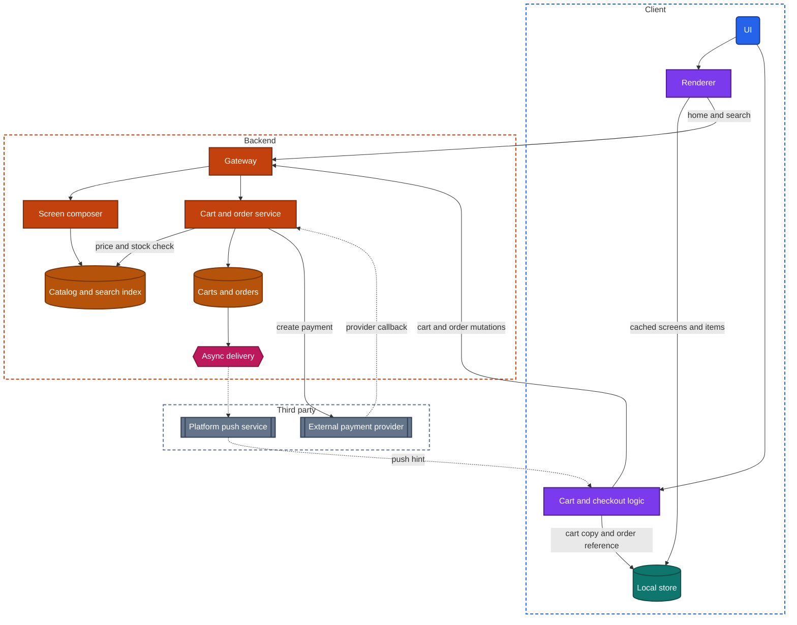
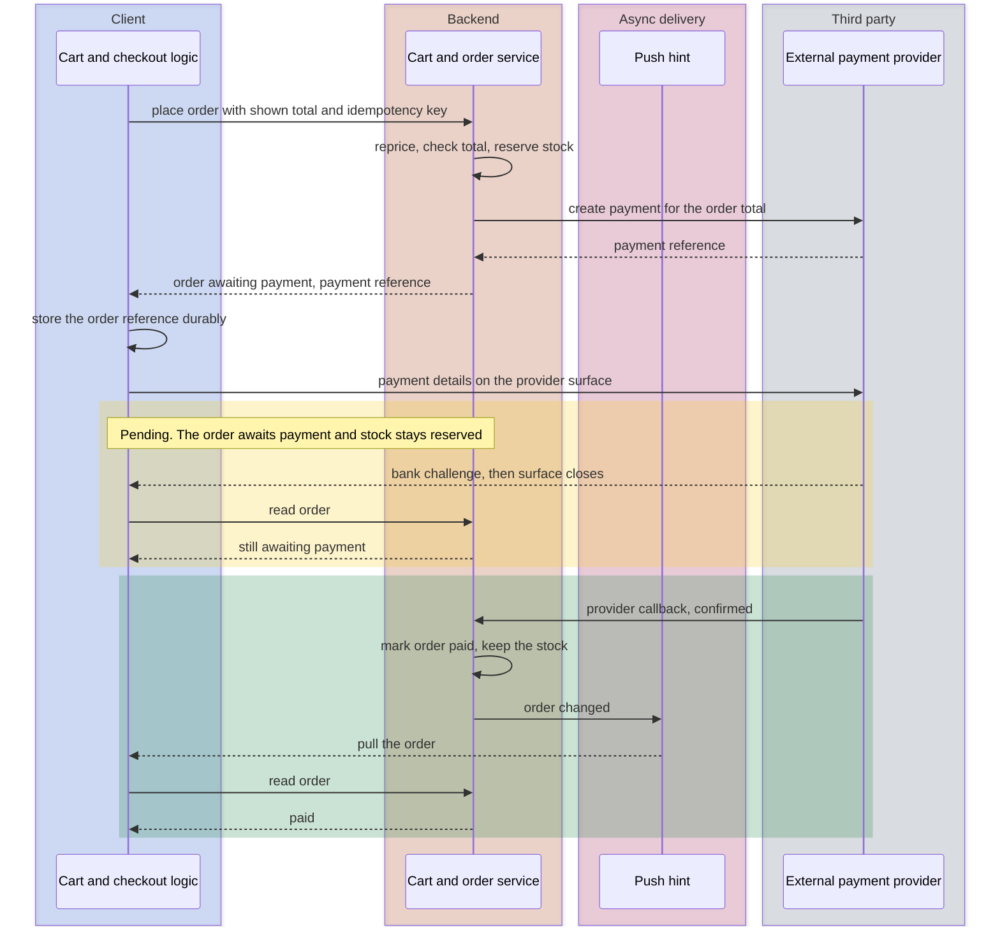

import Probe from '../../../components/Probe.astro';
import Signals from '../../../components/Signals.astro';
import TeardownBar from '../../../components/TeardownBar.astro';
import WorksheetForm from '../../../components/WorksheetForm.astro';

> **The archetype.** An app in which a buyer browses and searches a catalog of physical goods, collects items in a cart, pays through an external payment provider, and follows the order until it arrives.

## 43.1 What defines this archetype

A shopping app makes one promise. You find the thing, you can trust the price, you pay once, and you know where the order is.

Each clause of that promise costs something.

- **Find the thing.** The catalog is far larger than any device can hold. Browsing and search run on the backend, and the client's job is to make a remote catalog feel local.
- **Trust the price.** Price and stock are values the backend decides, and they change while the buyer is looking. The same item appears in a list, on a product page, in the cart and at checkout, and those four copies are read at four different moments.
- **Pay once.** Money moves through a third party, over an unreliable network, in a flow that the buyer leaves in the middle to satisfy a bank. The order must be created exactly once and paid exactly once.
- **Know where the order is.** After payment the order changes state for days, driven by warehouses, sellers and carriers. None of those changes starts on the device.

Four concerns dominate the design.

| Concern | Why it dominates | Chapter |
|---|---|---|
| Search and discovery | Most sessions start with a query or a browse surface, and the catalog lives on the backend | [Chapter 28](/part-2-concerns/28-search-and-discovery/) |
| Lists and pagination | Category pages, results and the home screen are long lists of items whose price and stock go stale | [Chapter 15](/part-2-concerns/15-lists-feeds-and-pagination/) |
| Payments | Checkout is a multi-step flow that ends in a payment with a pending state | [Chapter 26](/part-2-concerns/26-payments-and-subscriptions/) |
| Server-driven UI | Merchandising changes daily, and a release takes weeks to reach everyone | [Chapter 31](/part-2-concerns/31-server-driven-ui/) |

The archetype has two variants that differ in a meaningful way.

| Variant | Who sells | What it adds to the design |
|---|---|---|
| Single seller | The app's owner sells its own stock | One catalog, one stock record per item, one order per checkout |
| Two-sided marketplace | Many sellers, each with an account | Seller accounts and seller tools, one item offered by several sellers, an order split per seller, buyer-seller messaging, and trust features such as ratings of sellers |

A third form mixes them. Record it as mixed. Section 43.6 gives the observations that separate the variants.

This chapter covers apps that sell physical goods for delivery. Scarce seats and time slots belong to the chapter titled Booking and reservations.

## 43.2 Requirements read from the product

These are requirements as a buyer experiences them. None of them names a design.

**What the app does**

- Show a home screen of promotions, categories and recommended items that changes from day to day.
- Browse categories and search by text, with filters, sorting and counts per filter value.
- Show a product page with photos, a price, availability, options such as size and color, a delivery estimate and reviews.
- Keep a cart, and often a list of saved items, that the buyer returns to over days.
- Let a buyer start without an account and sign in later without losing the cart.
- Check out: address, delivery option, payment method, review, pay.
- Show orders, each with a status that advances, and notify the buyer when it does.
- Accept a promotion code, and show timed sales.
- Accept a review with photos.
- In a marketplace, show who sells each item and let buyer and seller exchange messages.

**Qualities it must have**

- Browsing is fast and never blank. Photos arrive quickly on a poor connection.
- The price paid is the price shown on the last screen before payment. A change before that screen is announced, not hidden.
- An item is not sold twice, and a buyer is not charged for an item that cannot be shipped.
- The buyer is charged once, whatever the network and the app do during payment.
- A checkout in progress survives a phone call, a switch to a banking app and process death.
- A sale can start at a stated minute for every user at once, without an app update.

Of the seven constraints of [Chapter 2](/part-1-method/2-the-mobile-constraint-set/), three bind hardest. Untrusted client means the client never decides a price, a discount or a stock level. Slow release means merchandising cannot wait for a store review. Process death shapes checkout, because the flow sends the buyer out of the app at its most valuable moment.

## 43.3 Running the probes

Run the general probes first, on the screen named for each. The seven shopping probes then examine the cart and checkout. [Chapter 4](/part-1-method/4-probes/) describes how to run a probe cleanly.

### Probes from Chapters 28 and 15

Run these on the search screen and on one category list. They are defined in [Chapter 28](/part-2-concerns/28-search-and-discovery/) and [Chapter 15](/part-2-concerns/15-lists-feeds-and-pagination/).

| Probe | Typical outcome for shopping | What it tells you |
|---|---|---|
| P28.1 Search in airplane mode | An error or an empty screen | Backend search. The catalog is not on the device |
| P28.6 Filter counts | Counts are shown and change with every filter choice | A faceted query on each change |
| P28.7 Same query, two accounts | The same items in a different order, with sponsored rows that differ | An account-specific ranking input. Speculative as to which |
| P15.1 Scroll rhythm | An indicator only during a fast fling | Endless scroll with the next page requested ahead of the end |

### Probes from Chapter 31 and Chapter 30

Run P31.1 to P31.5 on the home screen, and P31.7 on any campaign page that a home banner opens. They are defined in [Chapter 31](/part-2-concerns/31-server-driven-ui/).

- **P31.1 Structure change without an update.** Typical: known blocks reorder, appear and vanish from day to day. Around a large sale, a kind of block you have not seen may appear.
- **P31.4 The screen in airplane mode.** Typical: the home screen appears with its last structure and content. The response that describes the screen is cached whole.
- **P31.5 Where taps lead.** Typical: the same banner position leads to a category one day, a search result the next and a campaign page after that. Actions are data, usually deep links.
- **P31.7 Embedded web tells.** Typical: absent on the home screen, present on some campaign pages.

Then run P30.1, P30.3 and P30.5 from [Chapter 30](/part-2-concerns/30-remote-config-and-experiments/). Typical for shopping is a change at a launch or during use with no update, and two accounts that differ in the form of the same feature, such as the position of the buy button or the layout of the cart.

### Probes from Chapters 8 and 9

Run P8.5, P8.6 and P8.8 from [Chapter 8](/part-2-concerns/8-navigation-deep-links-and-screen-state/) with a link to a product. Shared product links are a main route into a shopping app, so the typical outcomes are the robust ones: the app opens on the product, back leads to a parent screen through a synthesized back stack, and a signed-out user sees the product without a session.

Run P8.10 on checkout, and stop before payment. Typical is progress visible on the second device.

Run P9.1 and P9.3 from [Chapter 9](/part-2-concerns/9-state-and-ui-data-flow/) with the cart. Add an item on a product page and watch the cart badge. Typical is a badge that changes in the same instant on every tab, which points to one shared copy of the cart on the client.

### Probes from Chapter 26

[Chapter 26](/part-2-concerns/26-payments-and-subscriptions/) defines the payment probes. None of them requires a payment.

| Probe | Typical outcome for shopping | What it tells you |
|---|---|---|
| P26.1 Read the paywall | Physical goods, paid by card or wallet | The external payment provider route |
| P26.2 Start a checkout and cancel | Card fields inside the app's screen, or a device wallet sheet | The provider's fields or the device wallet collect the card. The backend holds a payment token only |
| P26.3 Look for the abandoned payment | An unpaid or awaiting-payment order in the order list, or the cart returned intact | Whether the order is created before the payment surface opens |
| P26.9 Saved payment methods | A list with a brand and the last four digits | Payment tokens stored against the account |

If you have an order in progress from your normal use of the app, run P14.1, P14.4 and P14.5 from [Chapter 14](/part-2-concerns/14-real-time-delivery/) on its order screen as the status advances. Do not place an order for the purpose. Typical is a notification for each step, with the order screen current when you open it.

### Shopping probes

P43.1 to P43.3 locate the cart. P43.4 to P43.6 show who decides price and stock, and when. P43.7 tests checkout against process death. None of them needs a purchase. Three come close to a payment or touch stock that other buyers may want, and each of those carries a caution.

<TeardownBar />

### P43.1 Guest cart at sign-in

<Probe id="P43.1" />

### P43.2 Cart on a second device

<Probe id="P43.2" />

### P43.3 Cart in airplane mode

<Probe id="P43.3" />

### P43.4 Cart total on a weak connection

<Probe id="P43.4" />

### P43.5 Quantity above stock

<Probe id="P43.5" />

### P43.6 Stale cart

<Probe id="P43.6" />

### P43.7 Interrupted checkout

<Probe id="P43.7" />

## 43.4 The design, concern by concern

Each subsection states the design this archetype usually takes and the reason. The components are those of the universal app model in [Chapter 3](/part-1-method/3-the-universal-app-model/).

### Home and campaign screens

The home screen of a shopping app is a merchandising surface. A team that is not the app team decides each morning what it shows. The design therefore takes the middle levels of [Chapter 31](/part-2-concerns/31-server-driven-ui/).

- **The home screen** is backend-ordered sections or a component list. The response names the blocks, their order, their content and the action behind each tap. A screen composer on the backend builds it per user.
- **Campaign pages** are a component list when the team wants native scrolling and images, and embedded web content when a marketing team builds them with web tools.
- **The product page, the cart and checkout** stay closer to a fixed screen. They are interactive, they must be fast, and the team tests every state of them. Parts of the product page, such as a row of badges or a promotion strip, are often described by the backend inside a fixed frame.

The whole response is cached, so the home screen draws on launch from the last copy and then refreshes. This is the stale-while-revalidate read policy of [Chapter 11](/part-2-concerns/11-local-storage-caching-and-prefetching/). The cost is that a cached home screen can show yesterday's price in a banner.

### Catalog browsing and search

The catalog is read-only for the buyer, large, and shared by everyone. The client holds none of it ahead of need. It caches what was visited.

- **Lists** are paged from the backend.
- **Product data** is cached per item, so that a product page opened from a list can draw its title and first photo from the list row at once and fetch the rest.
- **Photos** are most of the bytes. [Chapter 16](/part-2-concerns/16-images/) covers image variants and stand-ins. A shopping app requests a small variant for the list and larger ones for the page and for zoom.

Search is backend search with facets. A facet count is the number of results that would remain if a filter value were chosen, and it is computed over the whole matching set, so only the search index can produce it. P28.6 shows the counts changing as filters combine, which means one faceted query per change.

The search index is a second copy of the catalog, updated asynchronously from the source of truth. That gap is the indexing lag of [Chapter 28](/part-2-concerns/28-search-and-discovery/), and in a shopping app it has a specific consequence: a result row can show a price or an availability that the product page then contradicts.

### Price and stock as backend-decided values

Price and stock have three properties that shape the design.

- The backend decides them. A client that computed a price would be an untrusted client setting its own bill, which [Chapter 21](/part-2-concerns/21-security-and-trust/) rules out.
- They change without the buyer acting. A sale ends, another buyer takes the last unit, a seller edits a listing.
- They are shown in at least four places, each read at a different time and usually from a different backend source.

| Where shown | Typical source | How fresh | Binding |
|---|---|---|---|
| List or search row | Search index or a cached list response | Minutes old, sometimes more | No |
| Product page | Catalog and price services, read on open | Seconds old | No |
| Cart | The cart, repriced on each read | Current at the moment of the read | No |
| Checkout summary | The order being built | Current, and compared with what was shown | Yes, once the order is placed |

The rule that holds this together is simple. Every surface before checkout shows an estimate, and the order is the only place where the price becomes a fact. When the buyer places the order, the backend reprices every line, checks stock, applies promotions, and compares the result with the total the client says the buyer saw.

```text
function placeOrder(cart, shownTotal, key):
  if orders.exists(key): return orders.get(key)   // a retry finds the first attempt
  priced = priceService.price(cart)               // never the client's numbers
  if priced.total != shownTotal:
    return PriceChanged(priced)                   // the buyer must see the new total first
  transaction(backendStore):
    for line in priced.lines:
      if not stock.reserve(line.item, line.quantity):
        return OutOfStock(line.item)
    order = orders.create(priced, key, status: AwaitingPayment)
  return order
```

The comparison with `shownTotal` is what makes the price trustworthy. The backend does not charge a total the buyer has not seen. It returns the new total, the client shows it with a notice, and the buyer confirms again.

Stock follows the same pattern with one difference. A unit of stock can be reserved. Most shops reserve at order creation, for the minutes that a payment takes, and release the reservation if payment fails. A cart does not usually reserve anything. This is why two buyers can both hold the last unit in their carts and only one can buy it. P43.5 shows how early the app checks, and P43.6 shows whether an old cart is repriced when read or only at checkout.

### The cart

The cart is the buyer's only writable data before the order, and its design has two axes.

**Where it lives.** A cart on the device is simple and works without an account. A cart on the backend follows the account across devices, lets the backend reprice it, and lets the business remind the buyer about it. Almost every app that has accounts keeps the cart on the backend once the buyer is signed in. P43.2 settles this.

**What it stores.** A cart stores item references, options and quantities. It should not treat a stored price as the price. Where a price is stored with a line, it is the price last shown to the buyer, kept so that the backend can say "the price of this item changed since you added it". P43.6 separates a cart that remembers the shown price from one that does not.

The cart mutation is where shopping apps differ most in their client design, and P43.3, P43.4 and P9.4 expose it.

- **Wait for the backend.** The control shows a spinner, and the cart on screen is always a cart the backend returned. Totals are never wrong. The cost is a delay on every tap.
- **Optimistic update, then reconcile.** The quantity changes at once, and the backend's priced cart replaces the client's estimate when it arrives. A rejected change, such as a quantity above stock, is rolled back with a message.
- **Queued mutations.** The change is written to the local store and an outbox, and sent later. This is Level 2 of [Chapter 12](/part-2-concerns/12-offline-and-sync/) applied to the cart. It is uncommon, because an offline buyer cannot check out anyway.

The cart is at Level 1 in the typical design: readable offline from a cache, and writable only online. Checkout and payment are at Level 0.

**The guest cart.** A buyer who has not signed in still needs a cart. Two designs exist. The cart is kept in the local store of the device, or the backend issues a guest session, as [Chapter 20](/part-2-concerns/20-identity-and-sessions/) describes, and stores the cart against it. From outside the two look the same until sign-in.

At sign-in the account may already have a cart from another device. The app must apply a rule, and the rule is a small conflict resolution in the sense of [Chapter 12](/part-2-concerns/12-offline-and-sync/).

| Rule | Result | When a team chooses it |
|---|---|---|
| Cart merge | The union of both carts, with quantities added or the larger kept | The default. Nothing the buyer chose is lost |
| Account cart wins | The guest items are discarded | Simple, and loses the items the buyer just chose |
| Guest cart wins | The account's older cart is replaced | Treats the newest intent as the only intent |
| No guest cart | Sign-in is demanded before the first item | The business wants an account for every cart |

P43.1 separates all four.

### Checkout as a flow that survives interruption

Checkout gathers an address, a delivery option, a payment method and sometimes a promotion code, and then commits. [Chapter 8](/part-2-concerns/8-navigation-deep-links-and-screen-state/) describes multi-step flows and names the three properties of a robust one. Each applies here directly.

- **The state is on the backend before the buyer leaves.** The checkout in progress is a record: the cart, the chosen address, the chosen delivery option, the priced totals. Each step writes its choice to that record.
- **The commit is safe to repeat.** Placing the order carries an idempotency key that the client generated when checkout began and stored durably. `placeOrder` in this section returns the existing order when the key repeats.
- **Deadlines are decided by the backend.** A stock reservation and a delivery slot both have deadlines. The client shows them and does not own them.

Each step also changes the price. The address determines tax and delivery fees, and a code changes the discount. So each step is a round trip that returns a newly priced summary.

P43.7 tests the first property with a force-quit. P8.10 tests whether the record is on the backend or on the device.

### Payment and the pending state

Physical goods take the external payment provider route of [Chapter 26](/part-2-concerns/26-payments-and-subscriptions/). Store billing does not apply to them. The design follows that chapter's state machine closely.

1. The backend creates the order in an awaiting-payment status, then creates a payment at the provider for the order's total.
2. The buyer enters or selects a payment method on a surface the provider supplies: embedded fields, a hosted payment screen or the device wallet. The card number does not pass through the app's backend.
3. The bank may demand a bank challenge. The buyer leaves the app or sees a screen from the bank.
4. The provider reports the outcome to the backend in a provider callback. The backend marks the order paid and keeps the reserved stock, or marks it failed and releases the stock.
5. The client learns of the change by a push hint, a persistent connection or polling, and shows the result.

Between steps 2 and 5 the client shows a pending state. This is the part of the flow that a careless design gets wrong. A client that shows "order confirmed" when the payment surface closes is trusting its own view. A client that returns from a bank challenge after process death and shows an empty cart leaves the buyer not knowing whether they paid. The robust client stores the order reference before it shows the payment surface, and on every start asks the backend what became of that order.

You cannot watch this without paying, and no probe asks you to. P26.3 shows the first half: whether an abandoned payment leaves an awaiting-payment order behind. Your own past purchases supply the second half as passive observation.

In a two-sided marketplace the payment has one more step that is invisible from outside. One charge to the buyer is divided on the backend among several sellers and the platform's fee. What you can observe is its shadow: one payment, then several seller orders, each with its own status and its own refund path.

### Order tracking

After payment the order is read-only for the buyer and changes for days. Every change starts on the backend or beyond it, in a warehouse system, a seller's tool or a carrier. This is the delivery problem of [Chapter 14](/part-2-concerns/14-real-time-delivery/) at a slow tempo.

- **In the background**, a platform push announces each step. Depending on the design it carries the text, or it is a push hint that lets the client pull the order into its local store. P14.5 separates the two.
- **In the foreground**, the order screen fetches on appear. Many shopping apps hold no persistent connection, since an order changes a few times a day.
- **On return**, the order list is refetched. Orders are few, so there is no need for a delta.

The carrier's own tracking is a third party. A tracking screen in another visual style is the carrier's data relayed.

### Promotions through remote config and experiments

Promotions reach the app through three channels, and a teardown should name the channel for each promotion it sees.

| What changes | Channel | Chapter |
|---|---|---|
| A banner, a new home section, a campaign page | The screen-describing response for that screen | [Chapter 31](/part-2-concerns/31-server-driven-ui/) |
| A sale price, a discount, a code | Catalog and price data, decided when the cart is priced | This chapter |
| Whether a feature is shown, its form, a timed switch | Remote config, a feature flag or an experiment | [Chapter 30](/part-2-concerns/30-remote-config-and-experiments/) |

The rule from the price subsection applies again. Config may tell the client to show a countdown to a sale. It does not tell the client what anything costs. A sale that starts at a stated minute starts on the backend at that minute, and a client with stale config or a wrong clock shows the wrong banner and is still charged the right price.

Run P30.3 with two accounts on the product page, the cart and the first checkout step. A difference in layout or wording is an experiment variant. A difference in price is not good evidence of one, since region, membership and a personal offer explain it equally well.

### Reviews and images

A review is the main content that buyers write. It is a small mutation with a large attachment.

- The text and the rating are sent online. Few apps queue a review offline.
- Photos follow the "upload, then attach" pattern of [Chapter 18](/part-2-concerns/18-file-transfer-uploads-and-downloads/): each photo is uploaded to media delivery first, and the review carries references.
- A new review usually passes through moderation before it is public. The author sees it at once and other accounts see it later. P9.2 run with a second account shows the delay.

## 43.5 End-to-end architecture

Figure 43.1 shows the components that the probes imply for the most common variant: a cart on the backend, a home screen described by the backend, and an external payment provider.



*Figure 43.1. The client and backend of a shopping app with a backend cart and an external payment provider.*

In the terms of the universal app model, the client has no sync engine. It has a data layer that caches reads and sends cart mutations directly. The local store holds cached screens, cached items, a copy of the cart and the reference of an order awaiting payment. The catalog and its search index are drawn as one node, although the index is a derived copy that lags its source. Media delivery is left out.

Figure 43.2 follows the most important flow, from the tap that places the order to the confirmed order.



*Figure 43.2. Placing an order and paying for it, with the pending state between the payment surface and the provider callback.*

Two failure branches are not drawn. If the repriced total differs from the shown total, the first response is the new total and no order is created. If the provider callback reports a failure, or none arrives before the reservation's deadline, the backend marks the order failed and releases the stock, and the client shows the cart again.

## 43.6 Variants and how to tell them apart

**Single seller against two-sided marketplace.** This axis is settled by passive observation. Look for these on a product page and in the account area.

- A seller name on each listing, with a seller page, a rating of the seller and a count of sales.
- More than one offer for the same item, with different prices and delivery times.
- A control to message the seller.
- A mode or a separate entry for selling: listing an item, managing orders, receiving payouts.
- A cart grouped by seller, and delivery fees per seller.
- One payment that produces several orders or shipments with separate statuses.

Two or more of these mean a marketplace. The design consequences are large. Stock is per offer and is edited by sellers through their own tools, so it is less reliable, and stock conflicts at checkout are more common. Buyer-seller messaging is a small messaging feature with the send and receive paths described in the chapter titled Messaging. Run P12.2 and P14.1 on it.

A marketplace also lets you run probes that a single-seller shop does not. With a seller account of your own you can create a listing and run P28.5, which measures the indexing lag, and P15.3, which exposes the paging method.

**Cart on the device against cart on the backend.** P43.2 separates them. P43.1 then gives the rule at sign-in.

**Described home screen against fixed home screen.** P31.1 and P31.2 separate them over a few days.

The signal table collects the behaviors from the seven probes and from normal use.

<Signals chapter={43} />

## 43.7 What changes with scale

**The same at every size**

- Price and stock are decided by the backend and rechecked when the order is placed.
- Placing an order is idempotent.
- Payment goes through an external payment provider, and the provider callback is the truth.
- The client shows a pending state until the backend confirms.
- Order changes are announced by platform push.

**What changes**

- **Search.** A small shop filters its catalog with database queries. A large one runs a dedicated search index with facets, misspelling tolerance and ranking, and accepts the indexing lag that comes with it.
- **Composition.** A small shop has a fixed home screen with editable banners. A large one has a screen composer, a component catalog and a tool in which merchandisers build pages.
- **Services.** One service prices, checks stock and stores orders in a small shop. At large size each is a separate service, and the product page becomes a partial-failure problem: the page draws with a price and without reviews when the review service is slow.
- **Stock under contention.** For ordinary goods, a rare oversell is cheaper than strict coordination. For a timed sale of a few thousand units, the backend reserves strictly, admits buyers at a controlled rate, and sometimes places them in a waiting room. The chapter titled Booking and reservations describes that mechanism.

## 43.8 Completed worksheet

[Chapter 6](/part-1-method/6-the-teardown-worksheet/) describes the worksheet and the order in which to fill it in. The fields in this form are specific to shopping. The probes of Section 43.3 fill most of them.

<TeardownBar />

<WorksheetForm chapters={[43]} />

The fields that the Part II chapters add to the worksheet take these typical values for a large shopping app with a backend cart. A value that differs in your teardown is a finding.

| Field | Typical value | Confidence |
|---|---|---|
| Where the search runs ([Chapter 28](/part-2-concerns/28-search-and-discovery/)) | Backend search | Inferred |
| Paging presentation ([Chapter 15](/part-2-concerns/15-lists-feeds-and-pagination/)) | Endless scroll, next page requested ahead of the end | Observed |
| How much of the home screen the backend decides ([Chapter 31](/part-2-concerns/31-server-driven-ui/)) | Backend-ordered sections or a component list | Inferred |
| When config is applied ([Chapter 30](/part-2-concerns/30-remote-config-and-experiments/)) | Cached and applied on the next launch, with some values evaluated on the backend per request | Inferred |
| Offline level of the cart ([Chapter 12](/part-2-concerns/12-offline-and-sync/)) | 1 Cached reads | Inferred |
| Offline level of checkout and payment ([Chapter 12](/part-2-concerns/12-offline-and-sync/)) | 0 Online only | Observed |
| Flow state location ([Chapter 8](/part-2-concerns/8-navigation-deep-links-and-screen-state/)) | Backend | Inferred |
| Payment route ([Chapter 26](/part-2-concerns/26-payments-and-subscriptions/)) | External payment provider | Observed |
| Payment record created ([Chapter 26](/part-2-concerns/26-payments-and-subscriptions/)) | Before the payment surface | Inferred |
| Background delivery of order changes ([Chapter 14](/part-2-concerns/14-real-time-delivery/)) | Notification, with data ready or loaded on open | Observed |
| Backend components implied | Gateway, screen composer, catalog with a search index, price and stock services, cart and order service, async delivery, media delivery, external payment provider and platform push as third parties | Inferred |

## 43.9 As an interview question

The question is usually asked as "design a shopping app" or, more narrowly, "design the cart and checkout" or "design the product listing screen". 

**Clarify first.** Ask these, in this order.

1. Single seller or marketplace. A marketplace adds seller accounts, per-offer stock and an order split.
2. Whether a guest can shop, and whether the cart must follow the account across devices.
3. Which half the interviewer wants: browsing and search, or cart, checkout and payment.
4. Whether timed sales with heavy contention are in scope.

Then state the promise from Section 43.1. It gives you the acceptance test: the buyer never pays a price they did not see, and never pays twice.

**Go deep on three concerns.**

- **Price and stock as backend-decided values.** Name the four surfaces and their freshness. Say that everything before the order is an estimate, and that placing the order reprices, compares with the shown total and reserves stock.
- **Checkout and payment.** Flow state on the backend, an idempotency key for placing the order, the order created before the payment surface, the pending state, and the provider callback as the truth. Draw Figure 43.2.
- **The browsing path.** A screen-describing response for the home screen, cached whole. Paged lists with a cached first page. Backend search with facets. Image variants. Say which screens you would keep fixed, and why.

**Trade-offs an interviewer expects to hear.**

- A cart on the device against a cart on the backend, and the rule for the guest cart at sign-in.
- An optimistic cart mutation against waiting for the priced cart: speed against a total that is briefly wrong.
- Reserving stock at add-to-cart, at order creation or at payment: lost sales from idle reservations against failed checkouts.
- A described home screen against a fixed one: change without a release against interactivity and testing cost.

## 43.10 Summary

- A shopping app promises that the buyer finds the thing, can trust the price, pays once and knows where the order is. Search, lists, payments and server-driven UI dominate its design.
- The catalog stays on the backend. The client caches what was visited, pages through lists and relies on backend search with facet counts.
- Price and stock are decided by the backend and shown on four surfaces of different freshness. Only the order makes them binding, after a recheck against the total the buyer saw.
- The cart usually lives on the backend against the account, stores references and not prices, and is repriced on every read. A guest cart meets the account cart at sign-in under a rule that P43.1 exposes.
- Checkout is a flow stored outside its screens, committed with an idempotency key, so that it survives a bank challenge and process death.
- Payment goes through an external payment provider. The order exists before the payment surface opens, a pending state follows, and the provider callback decides the outcome.
- Order changes start on the backend and reach the device by platform push, with a fetch when the order screen opens.
- A two-sided marketplace adds seller accounts, per-offer stock, split orders and buyer-seller messaging, and is recognized by passive observation.
