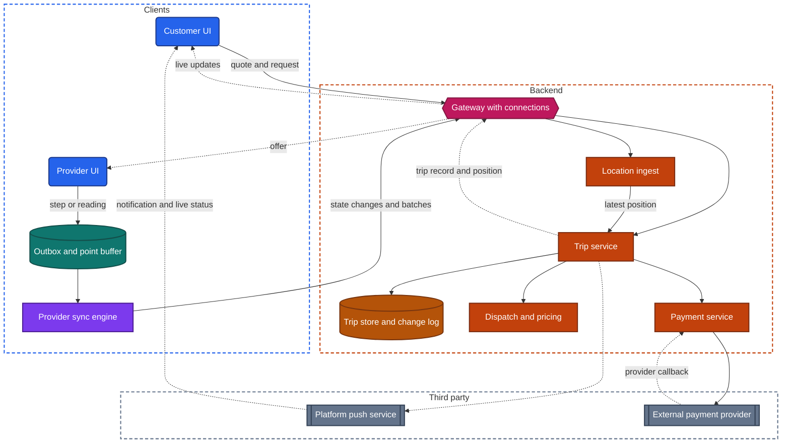
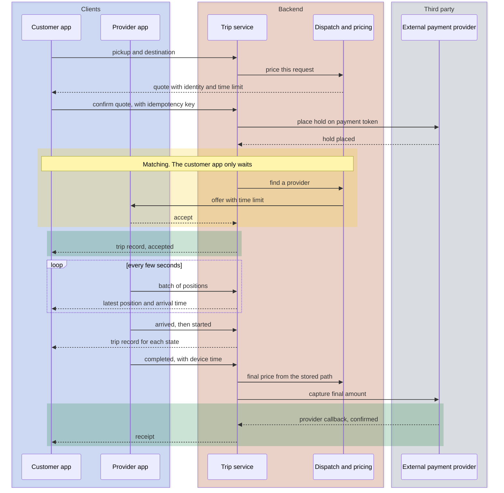

import Probe from '../../../components/Probe.astro';
import Signals from '../../../components/Signals.astro';
import TeardownBar from '../../../components/TeardownBar.astro';
import WorksheetForm from '../../../components/WorksheetForm.astro';

> **The archetype.** An app in which a customer asks for a ride or a delivery, a provider nearby accepts the job in a second app, both follow its progress on a live map, and the customer is charged when the job is done.

## 44.1 What defines this archetype

An on-demand service makes one promise. You ask for something now, you watch it come to you, and you pay without thinking.

Each clause of that promise costs something.

- **Ask now.** The request is matched to a provider within seconds or minutes. The customer waits on work that only the backend can do.
- **Watch it come.** A moving marker and an arrival time stay current for the whole job. The position comes from another person's phone, on another network, in another app.
- **Pay without thinking.** No payment screen appears at the end. The backend charges a saved payment method with the customer absent.

A fourth clause is silent. The provider's side must keep working all day, through tunnels, basements and stairwells.

Four concerns dominate the design.

| Concern | Why it dominates | Chapter |
|---|---|---|
| Location | The product is a position that moves. One side uploads it in the background, the other draws it | [Chapter 24](/part-2-concerns/24-location-sensors-and-hardware/) |
| Real-time delivery | A state change or a position that arrives a minute late breaks the promise | [Chapter 14](/part-2-concerns/14-real-time-delivery/) |
| Payments | The price is not known for certain until the end, and the customer is not there when it is charged | [Chapter 26](/part-2-concerns/26-payments-and-subscriptions/) |
| Network resilience | The provider's app changes the state of a job from places with no network | [Chapter 13](/part-2-concerns/13-network-transport-and-resilience/) |

Two further chapters supply mechanisms. [Chapter 23](/part-2-concerns/23-background-work-and-notifications/) covers the user-visible work that keeps the provider's app uploading. [Chapter 12](/part-2-concerns/12-offline-and-sync/) covers the outbox that holds a provider's state changes through a network gap.

This chapter uses one word, **trip**, for the unit of work, whether it carries a person or a parcel. Where deliveries differ, the text says **order**.

The archetype has two main variants, set by the number of parties.

| Variant | Parties | What moves | What the customer watches |
|---|---|---|---|
| Rides | Two: customer and provider | The customer | The provider coming, then the shared trip |
| Deliveries | Three: customer, courier and merchant | Goods | The merchant preparing, then the courier coming |

A third party adds a third app, a second handover and a second clock. Section 44.6 covers the further axes on which products differ.

## 44.2 Requirements read from the product

These are requirements as a user experiences them. None of them names a design.

**What the app does, for the customer**

- Set a pickup point and a destination, or choose a merchant and fill a basket.
- See a price and an arrival time before confirming.
- Confirm once, and see the request accepted by a named provider.
- Follow the provider on a map, with a state and an arrival time that stay current.
- Call or write to the provider, and be called or written to.
- Pay with a saved payment method, with no action at the end. Tip and rate afterwards.
- See a receipt and a history of past trips, and cancel within stated rules.

**What the app does, for the provider**

- Go online and offline.
- Receive an offer with a time limit, and accept or decline it.
- Be guided to the pickup point and then to the destination.
- Report each step: arrived, picked up, dropped off.

In a delivery, a merchant also receives the order, accepts it, states a preparation time and marks it ready.

**Qualities it must have**

- A request is made once. A second tap, a retry or a crash never produces two trips or two charges.
- Every party sees the same state. The customer never sees "on the way" while the provider sees "canceled".
- The marker moves smoothly and is rarely more than a few seconds behind reality.
- The arrival time is believable.
- The provider's steps are never lost, whatever the network does.
- The provider's phone lasts a working day.
- The price is the product's decision. Neither app can alter it.
- Neither party learns the other's phone number.

Of the seven constraints of [Chapter 2](/part-1-method/2-the-mobile-constraint-set/), four bind hardest. Unreliable network and limited resources shape the provider's app. Untrusted client shapes price, payment and the handling of positions. Platform rules decide whether an app may read location in the background at all.

## 44.3 Running the probes

You can run probes on the customer's app only. The provider's and merchant's apps need accounts that you do not have, and you should not create one for a teardown. What this chapter says about those apps is read from what the customer's app shows.

One rule governs every probe in this chapter. A request sends a real person toward you. Never make a request that you do not intend to complete and pay for. The probes either stop before the confirm control, or observe a trip that you were going to take anyway. [Chapter 4](/part-1-method/4-probes/) describes the probe families and how to run a probe cleanly.

### Probes from Chapter 24

Run these from [Chapter 24](/part-2-concerns/24-location-sensors-and-hardware/) on the customer's app.

| Probe | Typical outcome for this archetype | What it tells you |
|---|---|---|
| P24.1 Location indicator on screen | On while a map screen is open and off after leaving it | Continuous while on screen. The customer's position is used to set the pickup point |
| P24.2 Location indicator in the background | Off within seconds and it stays off | The customer's app does not track the customer. Some ride products keep it on during a trip, as a stated safety feature |
| P24.4 Location denied | It asks you to type an address or pick a place | Manual entry is always present, because people order for other places |

P24.5 and P24.6 describe the provider's side, which you cannot run. P44.5 watches their result from the customer's side.

### Probes from Chapter 14

Run these from [Chapter 14](/part-2-concerns/14-real-time-delivery/) during a trip that you were going to take anyway.

| Probe | Typical outcome | What it tells you |
|---|---|---|
| P14.1 Foreground latency | A state change appears within about two seconds | A held connection or a platform push while the trip screen is open |
| P14.2 Update rhythm | Marker corrections at a short, similar interval | Positions are pushed, or polled on a short timer |
| P14.4 Background delivery | A notification arrives and the trip is current on opening | Platform push for each state change, and a fresh fetch on return |
| P14.8 Reconnect catch-up | The current state appears with no gesture | The client fetches the current trip record on reconnect. There is no backlog to replay, because only the latest state matters |

### Probes from Chapter 26

Run these from [Chapter 26](/part-2-concerns/26-payments-and-subscriptions/) on the payment settings, not on a request.

| Probe | Typical outcome | What it tells you |
|---|---|---|
| P26.1 Read the paywall | Physical goods or services, paid by card or wallet | The external route. Store billing does not apply to a ride or a meal |
| P26.2 Start a checkout and cancel | Run it on the screen that adds a payment method, and stop before saving. A provider web page, or fields in the provider's style | Card details go to an external payment provider and not to the backend |
| P26.9 Saved payment methods | A list with a brand and the last four digits | The backend holds a payment token and a few display details |

Do not run P26.3 here. It asks you to abandon a checkout, and in this archetype the checkout is the request.

### Probes from Chapters 12, 13, 23 and 25

| Probe | Typical outcome | What it tells you |
|---|---|---|
| P12.1 Offline read, from [Chapter 12](/part-2-concerns/12-offline-and-sync/) | Past trips and receipts appear if visited. The first screen shows a map with no providers | Level 1 for history. Nothing live is kept |
| P12.2 Offline write. Stop at the confirm control, which is disabled offline | The control is disabled or an error appears | A request is Level 0. It is never queued, for the same reasons as a payment |
| P13.1 Cut mid-request, from [Chapter 13](/part-2-concerns/13-network-transport-and-resilience/), on the trip screen | An offline message within about two seconds | The client watches connectivity and says so, because a frozen marker would mislead |
| P23.9 Offline, then reconnect, from [Chapter 23](/part-2-concerns/23-background-work-and-notifications/) | One notification for the latest state | A replacement key for each trip, so that old states do not pile up |
| P25.5 Live status after a force-quit, from [Chapter 25](/part-2-concerns/25-platform-surfaces-widgets-wearables-and-extensions/) | It keeps updating | A live status fed by a dedicated push |

### On-demand probes

P44.1 and P44.2 stop before any request. P44.3 to P44.8 observe a trip you already intended to take. Run at most two or three of them on any one trip, and never when the provider is about to arrive.

<TeardownBar />

### P44.1 Quote before confirming

<Probe id="P44.1" />

### P44.2 Nearby markers before a request

<Probe id="P44.2" />

### P44.3 Leave during matching

<Probe id="P44.3" />

### P44.4 Force-quit during an active trip

<Probe id="P44.4" />

### P44.5 Network gap while tracking

<Probe id="P44.5" />

### P44.6 The same trip on a second device

<Probe id="P44.6" />

### P44.7 Contacting the provider

<Probe id="P44.7" />

### P44.8 Charge timing and final price

<Probe id="P44.8" />

## 44.4 The design, concern by concern

Each subsection states the design this archetype usually takes and the reason. The components are those of the universal app model in [Chapter 3](/part-1-method/3-the-universal-app-model/).

### Two or three apps on one backend

The product is not one app. It is one backend with a client for each party. The customer's app and the provider's app share an account system and a trip record, and almost nothing else.

| | Customer's app | Provider's app | Merchant's app |
|---|---|---|---|
| Used for | Minutes at a time | A working day | A working day, often on a fixed tablet |
| Location | Continuous while on screen | Continuous in the background | None |
| Background work | None of its own | User-visible work for the whole shift | Must alert loudly for a new order |
| Network | Whatever the customer has | Poor and changing | Usually fixed |
| Offline level | 0 for a request, 1 for history | 2 for state changes | 0 or 1 |

The app you can install is the simpler one. Its job is to display a record that others change.

### The trip as a state machine that the backend owns

A trip is a record on the backend that moves through states. Each state allows a few transitions, and each transition may be made by one party only.

| State | Entered when | Who causes it |
|---|---|---|
| Requested | The customer confirms | Customer |
| Matching | The backend starts to look for a provider | Backend |
| Accepted | A provider takes the offer | Provider |
| Arrived | The provider reaches the pickup point | Provider |
| In progress | The customer or the goods are on board | Provider |
| Completed | The provider reports the drop-off | Provider |
| Paid | The charge is confirmed | Backend, on a provider callback |
| Canceled | A party gives up, or no provider is found | Customer, provider or backend |

A delivery adds the merchant's states: accepted, preparing, ready.

The backend is the source of truth for the state. A client never decides that a trip is in a state. It asks for a transition, and the backend allows or refuses it.

```text
function requestTransition(tripId, to, actor, key):
  transaction(backendStore):
    trip = load(tripId)
    if seen(key): return trip                 // a retry of a transition already applied
    if not allowed(trip.state, to, actor):
      return Rejected(trip)                   // the caller receives the real state
    trip.state = to
    trip.version = trip.version + 1
    remember(key)
    appendToChangeLog(trip)
  notifyParties(trip)                         // connection first, platform push as well
  return trip
```

Three reasons put the machine on the backend.

- **Several writers.** A customer cancels at the same moment a provider accepts. One place must decide which came first.
- **Money.** Each state has a price attached, such as a cancellation fee after acceptance. A client that set the state would set the price.
- **Process death.** The customer's app is in the background for most of the trip, and the trip must advance without it.

The client side follows from this. The customer's app holds a copy of the trip record with its version, and replaces it whenever a higher version arrives. It does not replay events. If it misses three changes, it needs only the latest. That is why P14.8 shows a current state with no visible catch-up, and why P44.4 can rebuild the screen from one request at launch.

The request carries an idempotency key, so that a lost response and a retry produce one trip. It is never queued for later. A request made five minutes late, at an old price, is worse than an error.

### Matching and dispatch

Matching is the backend's work. The customer's client sends a request and waits. The backend chooses candidates, sends one of them an offer, waits for an answer, and moves on to the next if the offer is declined or runs out.

The offer has a time limit, which makes offer delivery the most demanding real-time path in the product. A persistent connection carries it while the provider's app is open, and a platform push carries it as well.

On the customer's side, matching is a waiting state that does not depend on the app staying open. P44.3 tests this. When a match arrives while the device is locked, the search ran on the backend and the result came by platform push.

What you cannot see is how the backend chooses. It may take the nearest provider, or the best assignment across many open requests at once. A wait that is always a few seconds long, even where providers are plentiful, is a Speculative hint that requests are matched in batches.

### Live location from the provider

The provider's app reads positions continuously, in the background, as user-visible work. The platform shows a persistent indicator on the provider's device for as long as the provider is online. This is the most expensive location mode in [Chapter 24](/part-2-concerns/24-location-sensors-and-hardware/), and the archetype cannot avoid it.

The pipeline is the one in that chapter's anatomy. Readings pass through a filter, are written to a buffer in the local store, and are uploaded in batches by the sync engine. During a trip a batch is sent every few seconds. While the provider is online and idle, the interval can be longer, because nobody is watching a marker.

On the backend, each batch feeds two things. The latest position becomes an ephemeral signal, kept in memory with an expiry and fanned out to whoever is watching the trip. The full path is stored, because it is the measurement that the final price and any dispute rest on.

The customer's client receives a position every few seconds and must draw smooth movement. It has three techniques, and a product may use all of them.

- **Animate between positions.** The marker travels from the previous position to the new one over the length of the interval. The display runs one interval behind reality, and it never shows a position that did not happen.
- **Predict along the route.** The client knows the planned route and the provider's speed, and moves the marker forward until the next position corrects it. The display is current, and occasionally wrong.
- **Snap to roads.** A raw position drifts onto buildings. The position is moved to the nearest road, on the backend or on the client.

P44.5 separates the first two. A marker that stops when the customer's device goes offline is animated between real positions. A marker that keeps going is predicted.

The markers on the first screen, before any request, are a different matter. They show that supply exists, and many products draw them from a list fetched on a timer. P44.2 measures that screen. Do not carry its result over to the tracking screen.

Positions come from an untrusted client. A false position could collect offers or inflate a fare, so the backend checks speed and distance between points, as [Chapter 21](/part-2-concerns/21-security-and-trust/) describes. None of this is visible from outside.

### Arrival-time estimates

The arrival time is computed on the backend. It needs the provider's position, a route, and live road speeds, and no client holds all three.

There are three estimates, and they are separate numbers.

- **Before the request.** Estimated from nearby supply. It describes no particular provider.
- **To pickup.** For the assigned provider. In a delivery it includes the merchant's remaining preparation time.
- **To destination.** The time to the end of the trip.

The backend sends each estimate with the trip record or with the position updates. A careful client receives it as a time of arrival and derives the minutes itself, so that the figure counts down between updates. An estimate that rises as well as falls shows the backend recomputing. P44.6 exposes the split: two devices that agree on the state and differ on the estimate are each doing part of the arithmetic.

### The provider's app on a poor network

The provider's app is the client that must not fail. It has three kinds of data to move, and each takes a different design.

- **Positions.** Buffered in the local store and uploaded in batches. A failed batch stays buffered and is sent again with the same batch id.
- **State changes.** Queued in an outbox as mutations. This is Level 2 of [Chapter 12](/part-2-concerns/12-offline-and-sync/).
- **Proof.** A photo of a parcel at a door, or a signature. Uploaded apart from the state change that refers to it, as a resumable transfer.

A courier in a basement taps "delivered". The app must accept the tap, show the next job step, and send the change when it can.

```text
function reportStep(trip, step):
  change = StateChange(id: newUniqueId(), trip, step, deviceTime: now(), position: lastKept)
  transaction(localStore):
    trip.localState = step                  // the provider's screen moves on at once
    outbox.append(change)
  syncEngine.requestRun()

function onStepResult(change, result):
  match result:
    Applied(trip):  outbox.remove(change)
    Rejected(trip):                         // for example, the customer canceled meanwhile
      outbox.remove(change)
      showRealState(trip)                   // rollback, with an explanation
```

The change carries the time and position the device recorded. The backend records its own receive time beside them, because it cannot trust the device's clock. It accepts a late change if the trip is still in a state that allows it, and rejects it otherwise.

This design has a signature that the customer can see. The state "delivered" appears some minutes after the event, and the time printed beside it is the earlier one. It is the best evidence available that the provider's app queues.

Accepting an offer is never queued. It is a race against a time limit, so it needs the network at that moment.

In terms of the steps in [Chapter 13](/part-2-concerns/13-network-transport-and-resilience/), the provider's app sits at Step 3 or Step 4. The customer's app needs Step 1 and a clear offline message.

### Price before and after

The backend decides the price twice.

**Before the trip**, it issues a quote. The quote is computed from an estimated route, the time of day, current demand and any discount. It has an identity and a time limit. The confirm request refers to the quote by its identity. The client never sends an amount, because an amount from an untrusted client is worth nothing. If the quote has run out, the backend refuses the request and issues a new one. P44.1 looks for that expiry.

**After the trip**, the backend computes the final price from what happened. Products take one of three positions.

| Position | Before the trip | After the trip |
|---|---|---|
| Fixed quote | An exact price | The same price, unless a stated rule applies, such as a changed destination or a long wait |
| Estimate | A range, or a figure marked as an estimate | Computed from measured distance and time |
| Basket | Item prices and fees | Adjusted for items that were out of stock or replaced, or sold by weight |

In every position, the measurement is the backend's. Distance and time come from the stored path of positions. The provider's app does not report a fare. A tip is added afterwards by the customer, as a second amount on the same payment or a payment of its own.

### Payment with a saved payment token

Payment takes the external route of [Chapter 26](/part-2-concerns/26-payments-and-subscriptions/). The customer adds a card or a device wallet once. An external payment provider keeps the card and gives the backend a payment token. From then on the backend can charge with the customer absent.

The payment is a state machine of its own, attached to the trip. Its difficulty is timing. The amount is certain only at the end, and the customer is present only at the start.

- **Hold, then capture.** At confirmation, the backend places a hold for the quoted or estimated amount. If the bank demands a bank challenge, the customer is there to answer it. After completion, the backend captures the final amount and releases the rest. This is the careful design.
- **One charge after completion.** Nothing is reserved. The backend charges the token at the end. It is simpler, and a refusal leaves the product with a debt to collect.
- **Charge at confirmation.** Common for deliveries. The basket is paid before the merchant starts, and changes become refunds.

P44.8 separates the three from your own bank notifications.

A failed charge after a completed trip becomes a debt on the account. The next request is refused until the customer pays, and that refusal is a strong signal of charging after completion.

The client's part is small. It shows a receipt when the backend says the payment is confirmed, and the backend learns that from a provider callback. Paying the provider is a separate backend flow that no probe reaches.

### Notifications and contact between the parties

The customer's app is in the background for most of a trip. State changes reach the customer as notifications, and the choice follows [Chapter 23](/part-2-concerns/23-background-work-and-notifications/).

The push carries its content, because "your driver has arrived" must appear whether or not the app can run. Successive states use one replacement key. Where the platform offers a live status, the trip appears on the lock screen, fed by a dedicated push.

The parties also need to reach each other, and must not learn each other's phone numbers. Three designs exist.

| Design | How it works | What you see |
|---|---|---|
| Relayed number | A telephony third party owns a pool of numbers. For each trip, the backend maps a number to the two parties. Each calls the number and is connected to the other | The device's dialer opens, with a number that is not personal and may repeat |
| Call inside the app | Audio travels over the data network between the two apps, as in [Chapter 19](/part-2-concerns/19-live-calls-and-live-streaming/) | A call screen in the app, and a call push on the other side |
| Chat | Messages through the backend, tied to the trip | A conversation that closes when the trip ends |

All three are scoped to the trip. The mapping is removed, or the conversation is closed, a short time after completion. A contact control that disappears after the trip is the visible trace of that scope. P44.7 records which design is in use.

A relayed number works on a poor data network and costs money for each call. A call inside the app is free and fails where data is weak.

## 44.5 End-to-end architecture

Figure 44.1 shows the components that the probes imply for the ride variant. A delivery adds a third client, the merchant's, which connects to the same trip service.



*Figure 44.1. Two clients on one backend. The provider's client has an outbox and a point buffer. The customer's client displays what the trip service sends.*

The figure is lopsided on purpose. In the terms of the universal app model, the trip service and dispatch are services, the trip store holds the backend store and a change log of transitions, and the gateway with its connections is async delivery.

Figure 44.2 follows one ride from request to receipt.



*Figure 44.2. One ride. The customer's app sends two requests of its own, and every later change comes from the provider's app or the backend.*

When a client is in the background, each dashed line to it is replaced by a platform push, and by a fetch of the trip record on return.

## 44.6 Variants and how to tell them apart

Products in this archetype differ on five axes. [Chapter 5](/part-1-method/5-from-signal-to-inference/) describes how a signal becomes a claim with a confidence word.

| Axis | Positions | Discriminating probe |
|---|---|---|
| Parties | Two, three or more | Passive observation of the states shown |
| Price | Fixed quote, estimate, basket | P44.1, then the receipt in P44.8 |
| When the money moves | Hold then capture, one charge after, charge at confirmation, paid in person | P44.8 |
| Marker movement | Animated between positions, predicted along the route | P44.5 |
| Contact | Relayed number, call inside the app, chat only | P44.7 |

**Rides against deliveries.** The states tell you the parties. A delivery shows states that no courier causes, and a period in which no marker moves. Some products assign the courier late on purpose, so that travel time and preparation time end together. A courier who appears only when the order is nearly ready points that way. It is Speculative, since a shortage of couriers looks the same.

**Scheduled and shared jobs.** A request for a later time is stored and enters matching shortly before it is due. A provider may also carry two orders at once, and a product that shows "one stop before yours" is exposing that batch. Neither changes the design.

**How the marker gets its positions.** At an interval of a few seconds, a persistent connection, a server stream and polling look alike. Record the mechanism as Speculative unless P14.2 shows a plain rhythm.

The signal table collects the behaviors from all eight probes and from normal use.

<Signals chapter={44} />

## 44.7 What changes with scale

The client designs are the same in one city and in a thousand. The backend changes, and the work is local: a trip in one city has nothing to do with a trip in another.

**The same at every size**

- A trip record with a state machine and a version, owned by the backend.
- A request with an idempotency key, never queued.
- A provider's app with a point buffer and an outbox.
- A customer's app that displays the trip record, and a payment token charged by the backend.

**What changes**

- **Partitioning by place.** A large product partitions matching, pricing and live positions by city or by map cell.
- **Location ingest.** Every online provider sends a batch every few seconds, all day. This is the largest stream of writes, and it is separated from the trip service early.
- **Dispatch.** At volume, requests are gathered for a short window and matched together, which makes each customer wait a little.
- **The first screen.** Showing every nearby provider to every open app is a large fan-out for a decorative feature. At size it is sampled, polled slowly or drawn by the client.
- **Peaks.** Demand moves with weather, events and the hour. You see a higher price, a longer estimate, or a message that no provider is available.

Each of these is a Speculative signal of scale, since a product decision explains it as well.

## 44.8 Completed worksheet

[Chapter 6](/part-1-method/6-the-teardown-worksheet/) describes the worksheet and the order in which to fill it in. The fields in this form are specific to the archetype. The probes of Section 44.3 fill most of them.

<TeardownBar />

<WorksheetForm chapters={[44]} />

The fields that the Part II chapters add take these typical values for the customer's app. A value that differs in your teardown is a finding. Record it with the probe that produced it.

| Field | Typical value | Confidence |
|---|---|---|
| Location mode on screen, [Chapter 24](/part-2-concerns/24-location-sensors-and-hardware/) | Continuous on that screen | Observed |
| Location in the background, [Chapter 24](/part-2-concerns/24-location-sensors-and-hardware/) | None on the customer's side | Observed |
| Foreground mechanism, [Chapter 14](/part-2-concerns/14-real-time-delivery/) | Held connection or push, or polling at a few seconds | Speculative |
| Role of platform push, [Chapter 14](/part-2-concerns/14-real-time-delivery/) | Carries content | Inferred |
| Payment route, [Chapter 26](/part-2-concerns/26-payments-and-subscriptions/) | External payment provider | Observed |
| Saved payment methods, [Chapter 26](/part-2-concerns/26-payments-and-subscriptions/) | Masked card list, and a device wallet | Observed |
| Offline level, [Chapter 12](/part-2-concerns/12-offline-and-sync/) | 0 for a request, 1 for history | Inferred |
| Live status updates, [Chapter 25](/part-2-concerns/25-platform-surfaces-widgets-wearables-and-extensions/) | Updated by push | Inferred |
| Backend components implied | Gateway with connections, trip service with a change log, dispatch, pricing, location ingest, payment service, platform push, an external payment provider and a telephony third party | Inferred |
| The provider's app | Continuous location in the background, a point buffer and an outbox | Speculative, from the customer's side alone |

## 44.9 As an interview question

The question is usually asked as "design a ride-hailing app" or "design live order tracking for a delivery app". It joins location, real-time delivery and payments, and its two clients have opposite needs.

**Clarify first.** Ask four things.

1. Which client: the customer's, the provider's, or both. The answer changes the whole interview.
2. Two parties or three.
3. Whether the price is fixed before the trip.
4. Whether matching is in scope, or you may treat it as a backend service that returns a provider.

Then state the promise from Section 44.1, and say that the backend owns the trip. Everything else hangs on that sentence.

**Go deep on three concerns.**

- **The trip as a state machine.** States, who may cause each transition, a version on the record, and an idempotency key on the request. Explain why the customer's client holds the latest record and not an event history.
- **The location pipeline.** Continuous location as user-visible work, a filter, a buffer in the local store, batched uploads, an ephemeral latest position for watchers, and smoothing on the customer's map. Draw Figure 44.2 from memory.
- **The provider's app offline.** Which actions are queued, which are refused, and what the backend does with a change that arrives late.

**Trade-offs an interviewer expects to hear.**

- A persistent connection against polling for the tracking screen. Polling every few seconds is defensible for the customer's side, and not for offers to providers.
- Animation between positions against prediction along the route: a display that is late and true, or current and sometimes wrong.
- Upload interval: freshness for the watcher against the provider's battery and data.
- A hold then capture against one charge at the end: a bank challenge answered while the customer is present, against a simpler flow with debts.
- A relayed number against a call inside the app: reach on a poor data network against cost.

Name the untrusted client without being asked: neither app ever states a price or a state.

## 44.10 Summary

- An on-demand service promises that you ask now, watch it come and pay without thinking. Location, real-time delivery, payments and network resilience dominate its design.
- The product is two or three apps on one backend. The customer's app is a display. The provider's app is the one that must survive poor networks.
- A trip is a state machine that the backend owns. Clients ask for transitions and display the latest record. The request carries an idempotency key and is never queued.
- Matching is backend work that the client waits on, and the result arrives by platform push if the app is away.
- The provider's app reads location continuously as user-visible work, buffers readings and uploads batches. The customer's app smooths the marker by animating, predicting or both.
- The provider's state changes are queued in an outbox with the device's time. A state that appears late with an earlier time is the visible trace.
- The backend decides the price before the trip as a quote and after it from the stored path. It charges a payment token with the customer absent, often as a hold that is captured later.
- Contact between the parties is scoped to the trip and hides phone numbers, through a relayed number, a call inside the app or a chat.
