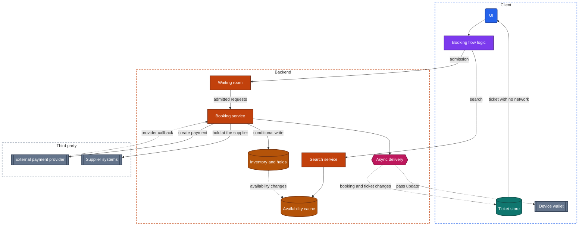
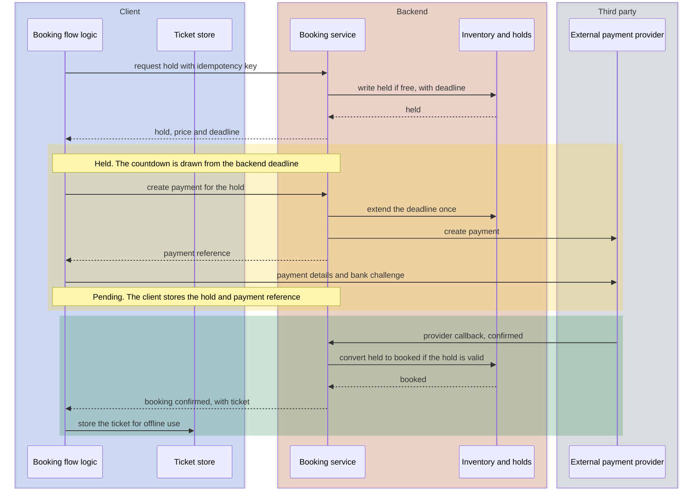

import Probe from '../../../components/Probe.astro';
import Signals from '../../../components/Signals.astro';
import TeardownBar from '../../../components/TeardownBar.astro';
import WorksheetForm from '../../../components/WorksheetForm.astro';

> **The archetype.** An app in which a user searches scarce, dated inventory, holds one item for a few minutes, pays for it, and afterwards carries a ticket that must work at the door.

## 45.1 What defines this archetype

A booking app makes one promise. The seat, room or slot you were shown is yours once you pay, and nobody else gets it.

Each clause of that promise costs something.

- **You were shown.** Availability and price are read from a source that changes every second, often one that another company runs. What the screen shows is already old.
- **Yours once you pay.** Paying takes minutes and passes through a bank. The item must be kept for you during that time, and only for that time.
- **Nobody else gets it.** Each item exists once. Two buyers can tap the same seat in the same second, and exactly one of them may win.
- **Afterwards.** The purchase produces a ticket that is used days later, at a gate with no signal, and that may change before then.

A shop that sells one unit too many apologizes and refunds. A booking app that sells one seat twice has two people standing at the same seat.

Four concerns dominate the design.

| Concern | Why it dominates | Chapter |
|---|---|---|
| Inventory holds and consistency | The hold is the mechanism that keeps the promise, and only the backend can grant one | [Chapter 21](/part-2-concerns/21-security-and-trust/) |
| Payments | The payment is tied to a hold that has a deadline | [Chapter 26](/part-2-concerns/26-payments-and-subscriptions/) |
| Offline | Booking is Level 0 by necessity, and the ticket must work with no network | [Chapter 12](/part-2-concerns/12-offline-and-sync/) |
| Real-time delivery | Availability, the place in a queue and later changes to the booking all start on the backend | [Chapter 14](/part-2-concerns/14-real-time-delivery/) |

The archetype has four variants. They differ in the form of the inventory, the length of the hold and the nature of the ticket.

| Variant | Inventory | Who owns it | Typical hold | Ticket |
|---|---|---|---|---|
| Travel | Seats and rooms, often counted per fare or room type, sometimes named | Usually a supplier outside the app's backend | Minutes, sometimes with a price guarantee | A boarding document or a booking reference |
| Events with reserved seating | Named seats on a seat map | The app's backend or a ticketing partner | A few minutes, with a countdown | A scannable code, often protected against copying |
| Restaurants | Tables per time slot, as counted capacity | The venue, through the app's backend | Short or none. Often no payment | A confirmation and a name at the door |
| Appointments | Time slots of one person or one resource | The provider's calendar | Short or none | A confirmation and a reminder |

Two properties in this table drive most of the design. Named items make contention visible. Inventory owned by a supplier makes the app's backend a client of someone else's system, with that system's delays.

## 45.2 Requirements read from the product

These are requirements as a user experiences them. None of them names a design.

**What the app does**

- Search by date, place and party size, and show what is available with prices.
- Show a seat map, a room list or a slot list in which taken items are marked.
- Let the user select an item and keep it while they enter details and pay.
- Show how long the selection is kept.
- Take payment, and state clearly whether the booking is confirmed.
- For a sale in high demand, let users wait their turn in an orderly way.
- Show the ticket, and offer to add it to the device wallet.
- Tell the user about a change: a new time, a new gate, a cancellation.
- Show the same bookings on every device the user signs in on.

**Qualities it must have**

- An item is never sold to two people.
- A user who pays gets the item, or gets the money back and is told so. There is no third outcome.
- The price charged is the price on the last screen before payment.
- The time remaining is truthful.
- The ticket opens at once, with no network, on a phone that has not opened the app for a week.
- A change to the booking reaches the user before they act on old information.
- Under a rush of demand, the app stays orderly. Waiting is acceptable. Errors and lost places in line are not.

Of the seven constraints of [Chapter 2](/part-1-method/2-the-mobile-constraint-set/), three bind hardest. Untrusted client means the client can never grant itself an item or extend its own deadline. Unreliable network collides with a flow that has a deadline. Process death is likely in the middle of payment, when a bank challenge sends the user to another app.

## 45.3 Running the probes

Run the general probes first. The eight booking probes then examine the hold and the ticket. [Chapter 4](/part-1-method/4-probes/) describes how to run a probe cleanly.

No probe in this chapter needs a booking or a payment. Stop before you confirm a payment, and leave the flow so that anything you held is released.

### Probes from Chapter 12 and Chapter 21

Run P12.1 and P12.2 from [Chapter 12](/part-2-concerns/12-offline-and-sync/) twice: once on the search and selection flow, and once on the list of bookings. The two halves of this app sit at opposite ends of the offline scale.

| Probe | On the booking flow | On existing bookings |
|---|---|---|
| P12.1 Offline read | Visited results may appear, marked as possibly out of date, or nothing appears | Bookings and tickets appear, including ones not opened in this session |
| P12.2 Offline write | The control is disabled or an error appears | Changes and cancellations are refused |
| Offline level | 0 Online only | 1 Cached reads, with the ticket stored ahead of need |

Then run P21.1 from [Chapter 21](/part-2-concerns/21-security-and-trust/) on selecting, paying, changing and canceling. Typical is refusal for every one of them. The backend decides.

### Probes from Chapter 14

Run P14.1 and P14.2 from [Chapter 14](/part-2-concerns/14-real-time-delivery/) on a seat map or a slot list, with a second device as the source of changes. P45.2 does this as part of its steps. Typical for events with reserved seating is a change within a few seconds, which points to a held connection or a fast poll for that screen. Typical for travel, restaurants and appointments is no live delivery at all: availability is fetched when the screen loads.

P14.4 and P14.5 apply when the provider changes a booking you hold. You cannot trigger that. When such a notification arrives in normal use, turn on airplane mode before opening the app and see whether the booking already shows the change.

### Probes from Chapters 28 and 26

Run P28.1, P28.2 and P28.6 from [Chapter 28](/part-2-concerns/28-search-and-discovery/) on the search screen. Typical is backend search that runs on submit, with filters whose counts change as you combine them. A travel search that fills in over several seconds, in groups, is the backend asking several suppliers and merging their answers.

Run P26.1 to P26.3 from [Chapter 26](/part-2-concerns/26-payments-and-subscriptions/), and stop when the payment surface appears. Typical is the external payment provider route, a payment surface with embedded fields or a device wallet sheet, and a pending or expired entry left behind by the abandoned attempt. If that entry shows a deadline, you have seen the hold recorded as data.

### Probes from Chapter 8

Run P8.3 and P8.10 from [Chapter 8](/part-2-concerns/8-navigation-deep-links-and-screen-state/) on the booking flow, between selection and payment. Typical is a flow that can be found again after process death, and progress that is visible on a second device, since the hold lives on the backend. P45.1 is the same test with the countdown as the measuring instrument.

### Booking probes

P45.1 to P45.3 examine the hold. P45.4 and P45.5 examine what the search screen can promise. P45.6 to P45.8 examine the ticket and need a booking that you already hold for your own reasons. Skip them if you have none.

<TeardownBar />

### P45.1 Countdown after a force-quit

<Probe id="P45.1" />

### P45.2 Held item seen from a second device

<Probe id="P45.2" />

### P45.3 Release on leaving

<Probe id="P45.3" />

### P45.4 Booking flow in airplane mode

<Probe id="P45.4" />

### P45.5 Old search results

<Probe id="P45.5" />

### P45.6 Ticket in airplane mode

<Probe id="P45.6" />

### P45.7 Code over time

<Probe id="P45.7" />

### P45.8 Booking on a second device

<Probe id="P45.8" />

## 45.4 The design, concern by concern

Each subsection states the design this archetype usually takes and the reason. The components are those of the universal app model in [Chapter 3](/part-1-method/3-the-universal-app-model/).

### Scarce inventory and the hold

A **hold** is a short reservation of one item for one buyer, with a deadline, recorded on the backend. It exists because selection and payment are separated by minutes, and the item must not be sold to anyone else in between.

An item moves through three states. It is free, held or booked. A hold returns to free in three ways: the buyer leaves and the client releases it, the deadline passes, or the payment fails. A hold becomes a booking in one way: the backend confirms the payment while the hold is still valid.

The hold has three properties that a teardown can test.

- **The backend grants it.** The client asks, and the backend answers yes or no. A client that marks a seat as "mine" before the answer arrives is showing an optimistic update on the one action where that is unsafe.
- **The backend owns the deadline.** The response carries the deadline, and the client draws the countdown from it. [Chapter 8](/part-2-concerns/8-navigation-deep-links-and-screen-state/) gives the test: a countdown that is still correct after a force-quit comes from a backend deadline. P45.1 runs it.
- **It ends without the client's help.** A buyer whose phone dies cannot release anything. The deadline is what frees the item. An explicit release when the buyer backs out is a courtesy that returns the item sooner. P45.3 shows whether the app sends one.

```text
function drawCountdown(hold):
  // Remaining time is computed from the backend's deadline on every tick.
  // Use the offset between backend time and device time, measured from the
  // hold response, so that a wrong device clock does not change the result.
  remaining = hold.deadline - (deviceNow() + hold.clockOffset)
  if remaining <= 0:
    showHoldEnded()            // the backend has already freed the item
  else:
    show(remaining)
```

The length of the hold is a product decision. A long hold lets a slow buyer finish and keeps items away from buyers who would pay now. A short hold frees items quickly and fails buyers whose bank is slow.

When the hold starts is a second decision. A hold at selection gives the buyer certainty early and lets idle visitors lock inventory. A hold at the start of payment protects inventory and lets a buyer fill in a long form for an item that is then gone. P45.2 shows which the app chose.

### Why booking is online only

[Chapter 12](/part-2-concerns/12-offline-and-sync/) places every feature at an offline level. The booking flow is at Level 0, and this is a requirement and not a shortcut.

A queued mutation works when the backend will almost certainly accept it later. A message will be accepted. A request for the last seat will not be, if anyone else asked first. An offline client that showed "seat selected, will confirm when online" would be promising something only the backend can grant. The honest design refuses, and says why.

The same reasoning applies to reads. Cached availability is not availability. Many apps keep the last search results on screen offline and block selection. Some refuse to show them at all. P45.4 separates these.

The ticket is the opposite case. It is a fact that has already been decided, it does not change often, and the moment it is needed is the moment the network is worst. So one app holds two features at two levels: Level 0 before payment and stored data after.

### Double-booking prevention as a backend rule

Preventing a double booking is a consistency rule that lives in the backend store. No client design contributes to it, and the client's checks are only for fast feedback.

The rule is a conditional write. The backend changes an item from free to held only if it is free at the instant of the write, and the check and the write are one atomic step.

```text
function requestHold(itemId, buyer, key):
  if holds.exists(key): return holds.get(key)      // a retry finds the first attempt
  transaction(inventoryStore):
    item = read(itemId)
    if item.state != Free and not deadlinePassed(item):
      return Taken                                 // the other buyer was first
    item.state = Held
    item.holder = buyer
    item.deadline = backendNow() + holdLength
    write(item)
  return Hold(itemId, item.deadline)
```

Two requests for the same seat reach this function in some order. The first finds the seat free and takes it. The second finds it held and is told so. Nothing in the result depends on what either client believed.

The form of the inventory changes the write and not the principle.

- **Named items**, such as seats, take one conditional write per item.
- **Counted capacity**, such as rooms of one type or tables in a time slot, takes a conditional decrement: reduce the count only if it is above zero.
- **Time slots** of one resource are named items whose name is a start time.

From outside you observe the rule only through its refusal. P45.2 produces one safely when the second device taps a held item. The message "this seat was just taken" is the `Taken` branch.

When a supplier owns the inventory, the app's backend cannot run this write itself. It asks the supplier to hold, and the supplier's answer is the truth. This adds a slow, fallible step to selection, which a travel app shows as a pause after you choose.

### Availability and prices that change between search and checkout

Search must be fast and broad. The inventory source is slow and exact. So search reads from a cache of availability and prices, and the booking flow confirms against the source when the user selects.

| Step | What it reads | How fresh | Binding |
|---|---|---|---|
| Search results | A cache of availability and prices | Seconds to minutes old, sometimes more | No |
| Detail or seat map | The source, or a fresher cache | Seconds old | No |
| Selection | The source, through the hold request | Current | The item is, for the length of the hold |
| Summary before payment | The hold | Current | The item and the price are |

Three client behaviors follow from this table, and P45.5 separates them.

- **Results with a time limit.** The client or the backend treats a result list as valid for a stated period and reloads it afterwards. A booking never starts from an old price.
- **A recheck with a notice.** Selection returns the current price. If it differs from the price in the list, the client says so and asks the user to accept it.
- **A silent recheck.** The summary shows the current price with no comment.

In events with fixed prices the same table describes availability alone. The seat map is the cache. On a busy map staleness is costly, so these apps deliver changes to open maps through a persistent connection or a fast poll, as [Chapter 14](/part-2-concerns/14-real-time-delivery/) describes. The live map reduces refusals. It does not prevent double booking. The conditional write does that.

### The waiting room for a high-demand sale

When a sale opens for a very popular event, far more buyers arrive in the first second than the inventory system can serve. Without control, most see errors, and those who get through are chosen by luck.

A **waiting room** is a queue in front of the booking flow. It admits buyers at the rate the inventory system can handle and holds the rest on a light screen that costs the backend almost nothing.

- Before the sale opens, arrivals are collected. At opening they are placed in an order, often a random one, so that arriving early by a second carries no advantage.
- Each buyer in line holds a queue token. The backend stores the position against the token or the account. The client polls slowly, or holds a connection, to learn its position.
- When a buyer's turn comes, the backend issues an admission that is valid for a limited period. Only then can the client load the seat map and request a hold.

The position must survive a lost connection and a restart of the app, so it lives on the backend. The admission must not be forgeable or reusable, so the backend checks it on every booking request.

You cannot trigger a waiting room, and joining a real sale you do not intend to buy from takes a place from someone who does. Record it as passive observation if you meet one in normal use. Note whether a position is shown and whether it survives closing the app.

### Payment tied to the hold

The payment follows the state machine of [Chapter 26](/part-2-concerns/26-payments-and-subscriptions/): created, awaiting the bank, then confirmed or failed, with the provider callback as the truth. What this archetype adds is a second clock. The hold has a deadline, and the payment has no regard for it.

The backend creates the payment against the hold and stores the link. When the provider callback reports that the bank agreed, the backend converts the hold into a booking, in one transaction that checks the hold is still valid.

```text
function onPaymentConfirmed(payment):
  hold = holds.get(payment.holdId)
  transaction(inventoryStore):
    if hold.state == Held and hold.holder == payment.buyer:
      hold.item.state = Booked           // valid hold, even if the deadline just passed
      booking = bookings.create(hold, payment)
    else:
      booking = None                     // the item was released, perhaps resold
  match booking:
    None:      provider.refund(payment); notifyBuyer(PaidTooLate)
    otherwise: issueTicket(booking); notifyBuyer(Confirmed)
```

The hard case is a hold that expires in the middle of a payment. The buyer submitted card details with thirty seconds left, the bank demanded a bank challenge, and the confirmation arrived after the deadline. Three designs handle it.

| Design | What happens | Cost |
|---|---|---|
| Extend the hold when payment starts | The backend moves the deadline once, by the longest time a payment may take | Items stay locked longer when payments are abandoned |
| Honor a late confirmation if the item is still free | The conversion succeeds unless someone else took the item | Works most of the time, with a rare refund |
| Refund any late confirmation | The buyer is told the booking failed and the money returns | Simple and unkind. The buyer paid and has nothing |

The signature of the first is a countdown that disappears, pauses or jumps when the payment surface opens. Whatever the design, one outcome is forbidden: money taken and no booking, with nothing said.

A robust client stores the hold and the payment reference before it shows the payment surface. After a bank challenge, or after process death, it asks the backend for the state of the booking and shows one of three screens: confirmed, still confirming, or failed with a refund on its way.

### The ticket as an offline artifact

Once the booking is confirmed, the backend issues a ticket, and the design problem turns around. The ticket is needed at a gate, in a crowd, often underground or abroad. It must open from the local store with no request.

A ticket takes one or more of these forms.

| Form | Where it lives | Works offline | Protection against copying |
|---|---|---|---|
| A static code in the app | Local store | Yes, if stored ahead of need | None. A screenshot is as good as the ticket |
| A rotating code derived on the device | A secret in secure hardware-backed storage, plus the time | Yes | A screenshot stops working within a short period |
| A rotating code from the backend | Fetched for each view | No | Strong, at the price of needing a network at the gate |
| A pass in the device wallet | The operating system's wallet | Yes | Depends on the pass |

Two details decide whether the offline ticket works in practice.

The first is when the ticket reaches the device. A ticket cached by the visit exists only if the user happened to open it while online. A ticket stored ahead of need is written to the local store when the booking is confirmed, when the booking list syncs, or when a push hint arrives. P45.6 separates the two with a device that has never opened the ticket.

The second is the session. A ticket that is in the local store but hidden behind a sign-in screen, because the access credential expired and cannot be renewed offline, is not an offline ticket. [Chapter 20](/part-2-concerns/20-identity-and-sessions/) covers what a client may show when it cannot renew.

A pass in the device wallet moves the ticket outside the app. The operating system stores it and displays it without launching the app. [Chapter 25](/part-2-concerns/25-platform-surfaces-widgets-wearables-and-extensions/) covers surfaces of this kind. The wallet has its own update channel: the backend can push a new version of the pass, so a gate change appears on the pass even if the app is never opened.

The rotating code is the untrusted-client constraint again. A static code can be copied and sold twice. A code that changes with time, and that the scanner checks against the same secret, makes a copy worthless after a short while. P45.7 shows the rotation. It cannot show how the scanner checks it.

### Changes and cancellations pushed to the device

A stored ticket is a copy, and copies go stale. A departure moves, a gate changes, an event is postponed, an appointment is canceled by the provider. The user acts on a stale ticket in the physical world.

The design is the receive path of [Chapter 14](/part-2-concerns/14-real-time-delivery/), with the background case as the important one.

- The backend learns of the change, often from a supplier, and updates the booking.
- It sends a platform push. The text tells the user. Where the design allows, the push is also a push hint that wakes the client to pull the booking into the local store.
- It pushes a new version of any pass in the device wallet.
- The client refetches bookings whenever it comes to the foreground, since a push can be lost.

[Chapter 23](/part-2-concerns/23-background-work-and-notifications/) covers what a woken client may do. The typical design also schedules local notifications as reminders, which fire with no network.

Changes and cancellations that the user starts are mutations at Level 0, for the reason given earlier in this section. A change releases one item and takes another, at a new price, and only the backend can do either.

### Itinerary sync across devices

Bookings are few, small and owned by the backend. Syncing them is simple by the standards of [Chapter 12](/part-2-concerns/12-offline-and-sync/). The client fetches the full list on sign-in and on each return to the foreground, stores it, and stores each ticket with it. No delta and no conflict handling is needed, because the device never edits a booking offline.

The complication is identity. A booking may have been made as a guest, by another person, or through an agent. Such a booking belongs to a reference and a name, and not to the account. Many apps therefore offer to add a booking by its reference. P45.8 shows whether bookings follow the account, the reference or the device.

## 45.5 End-to-end architecture

Figure 45.1 shows the components that the probes imply for an app whose backend owns the inventory, with a waiting room in front of the booking flow.



*Figure 45.1. The client and backend of a booking app. The device wallet sits on the device and is drawn in gray because the operating system runs it.*

In the terms of the universal app model, the client has no sync engine and no outbox. The backend has two read paths of different freshness, the availability cache for search and the inventory store for the hold. Where a supplier owns the inventory, the conditional write happens in the supplier's system and the booking service waits for it.

Figure 45.2 follows the most important flow, from selection to a stored ticket.



*Figure 45.2. Hold, pay and confirm. The hold is granted by a conditional write and converted only after the provider callback.*

Two failure branches are not drawn. If the item is not free, the first response is a refusal and the client returns to the seat map. If the conversion finds the hold gone, the backend refunds the payment and tells the buyer.

## 45.6 Variants and how to tell them apart

The variant is usually plain from the product. What differs inside a variant is the form of the inventory, the placing of the hold and the nature of the ticket, and each has a discriminating probe. [Chapter 5](/part-1-method/5-from-signal-to-inference/) describes how a signal becomes a claim.

| Question | Discriminating probe | Reading |
|---|---|---|
| Named items or counted capacity | Passive observation | A seat map or a named slot means named items. "2 rooms left" or a plain yes or no means a count |
| Is anything held before payment | P45.1 and P45.2 | A countdown, and a second device that is refused |
| Who owns the deadline | P45.1 | A countdown that is correct after a force-quit |
| Is availability delivered live | P45.2, then P14.2 | A change on an open screen with no gesture |
| How the ticket gets to the device | P45.6 | Whether a ticket never opened appears offline |
| Is the code protected against copying | P45.7 | Whether the code changes, and whether it does so offline |

**Travel against events.** Travel shows the supplier's delays: a search that fills in gradually, a pause at selection, and a price that moves between list and summary. Holds are often invisible, because the supplier grants them and the app shows no countdown. Events show contention instead: a live seat map, a prominent countdown, a waiting room, and a ticket with a rotating code.

**Restaurants and appointments.** Many take no payment, so the hold and the booking collapse into one conditional write at confirmation. Run P45.2 on a slot and you may find that nothing is held until the final tap.

**Honest limits.** Counted capacity hides contention. Your selection reduces a number you cannot see, so P45.2 gives no result. A hold granted by a supplier may have a deadline the app never shows. In both cases record the hold as "no hold shown", and treat any claim about what happens on the backend as Speculative.

The signal table collects the behaviors from the eight probes and from normal use.

<Signals chapter={45} />

## 45.7 What changes with scale

**The same at every size**

- The backend grants the hold with a conditional write and owns the deadline.
- The booking flow is Level 0.
- The payment is created against the hold, and the provider callback decides.
- Every confirmed payment ends in a booking or a refund.
- The ticket is stored on the device.

**What changes**

- **Admission.** A small app lets every request reach the inventory store. A large one puts a waiting room in front of a popular sale, and issues admissions at the rate the store can take.
- **Availability.** A small app reads availability from the inventory store on every search. A large one keeps a separate cache for search and accepts that it lags.
- **Suppliers.** A small app books its own inventory. A large travel app asks many suppliers per search, each with its own delays and failure modes, and merges the answers.
- **Tickets.** A small app issues a static code. Where resale and copying matter, the code rotates and the scanners hold the means to check it without a network.

From outside you see the waiting room, a search that fills in gradually and a code that rotates.

## 45.8 Completed worksheet

[Chapter 6](/part-1-method/6-the-teardown-worksheet/) describes the worksheet and the order in which to fill it in. The fields in this form are specific to booking. The probes of Section 45.3 fill most of them.

<TeardownBar />

<WorksheetForm chapters={[45]} />

The fields that the Part II chapters add to the worksheet take these typical values for an event app with reserved seating. A value that differs in your teardown is a finding.

| Field | Typical value | Confidence |
|---|---|---|
| Offline level of the booking flow ([Chapter 12](/part-2-concerns/12-offline-and-sync/)) | 0 Online only | Observed |
| Offline level of bookings and tickets ([Chapter 12](/part-2-concerns/12-offline-and-sync/)) | 1 Cached reads, with tickets stored ahead of need | Inferred |
| Posture for selection and payment ([Chapter 21](/part-2-concerns/21-security-and-trust/)) | The backend decides | Inferred |
| Foreground mechanism on the seat map ([Chapter 14](/part-2-concerns/14-real-time-delivery/)) | Held connection or push | Inferred |
| Background delivery of booking changes ([Chapter 14](/part-2-concerns/14-real-time-delivery/)) | Notification and data ready | Inferred |
| Payment route ([Chapter 26](/part-2-concerns/26-payments-and-subscriptions/)) | External payment provider | Observed |
| Payment record created ([Chapter 26](/part-2-concerns/26-payments-and-subscriptions/)) | Before the payment surface, linked to the hold | Inferred |
| Flow state location ([Chapter 8](/part-2-concerns/8-navigation-deep-links-and-screen-state/)) | Backend | Inferred |
| Backend components implied | Waiting room, search service with an availability cache, booking service, inventory store with holds, async delivery, external payment provider and platform push as third parties | Inferred |

## 45.9 As an interview question

The question is usually asked as "design a ticket booking app", "design seat selection for an event", or "design a hotel booking flow".

**Clarify first.** Ask these, in this order.

1. Named seats or counted capacity. Named seats bring a seat map and visible contention.
2. Who owns the inventory, the app's backend or a supplier.
3. Whether a sale with extreme demand is in scope. That adds the waiting room.
4. What the ticket is, and whether it must resist copying.

Then state the promise from Section 45.1. It gives you two acceptance tests: no item is sold twice, and every payment ends in a booking or a refund.

**Go deep on three concerns.**

- **The hold.** The three item states, the conditional write, a deadline the backend owns, and a countdown drawn from that deadline. Say that the flow is Level 0 and why queuing a request for scarce inventory is a false promise.
- **Payment against a deadline.** The payment created against the hold, the provider callback as the truth, the conversion that checks the hold, and the three designs for a hold that expires in the middle of payment. Draw Figure 45.2.
- **The ticket.** Stored ahead of need, readable with no session renewal, updated by a push hint, and available as a pass in the device wallet. Contrast the static code with the rotating code.

**Trade-offs an interviewer expects to hear.**

- A hold at selection against a hold at payment: certainty for the buyer against inventory locked by idle visitors.
- A live seat map against fetch on load: fewer refusals against the cost of delivering every change.
- Extending the hold during payment against refunding a late confirmation.
- A static code against a rotating one: offline simplicity against copying.

Say plainly that the client is a view of the backend's decision until the ticket exists, and a holder of a durable copy afterwards.

## 45.10 Summary

- A booking app promises that the item you were shown is yours once you pay and that nobody else gets it. Inventory holds, payments, consistency and the offline ticket dominate its design.
- A hold is a short reservation with a deadline. The backend grants it by a conditional write, owns the deadline, and frees the item without the client's help.
- Double-booking prevention is a backend rule. The client's view of availability is a lagging copy, and a live seat map only reduces refusals.
- The booking flow is Level 0, because a queued request for scarce inventory promises what only the backend can grant. Search prices are estimates until selection confirms them.
- The payment is created against the hold. The backend converts the hold after the provider callback, and a confirmation that arrives after the hold has gone ends in a refund that the buyer is told about.
- A waiting room admits buyers to a high-demand sale at a controlled rate and keeps each position on the backend.
- The ticket is stored on the device ahead of need, as a code or as a pass in the device wallet. A rotating code protects against copying.
- Changes and cancellations start on the backend and reach the device by platform push and a refetch. Bookings follow the account, or a reference, to every device.
