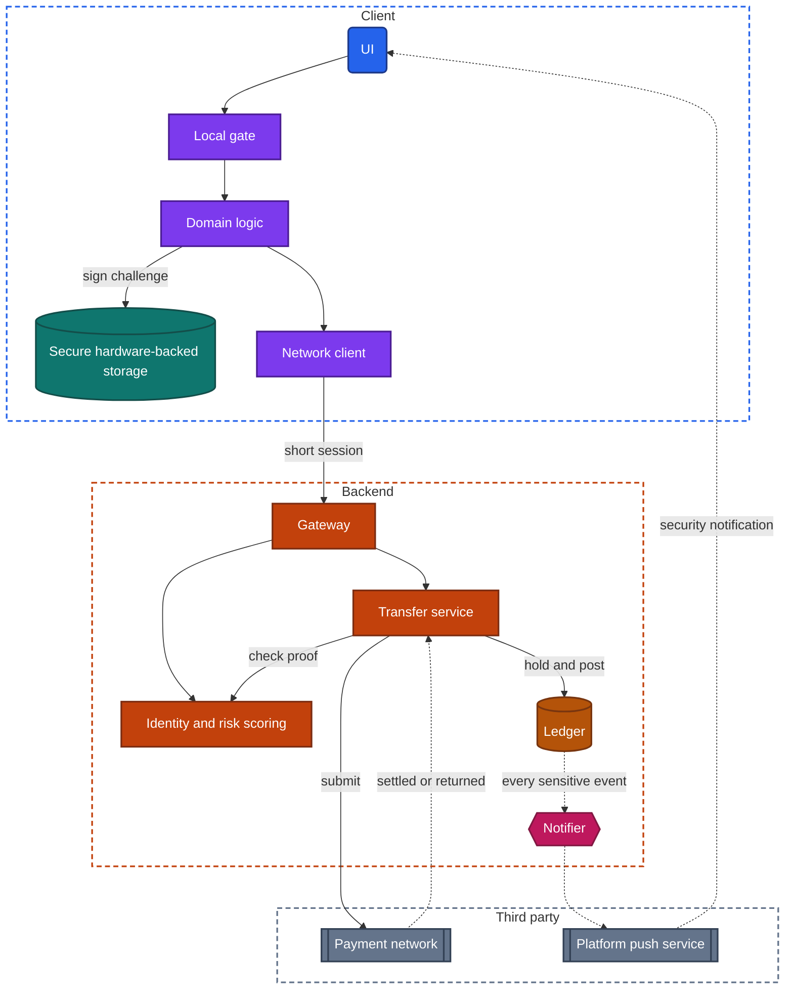
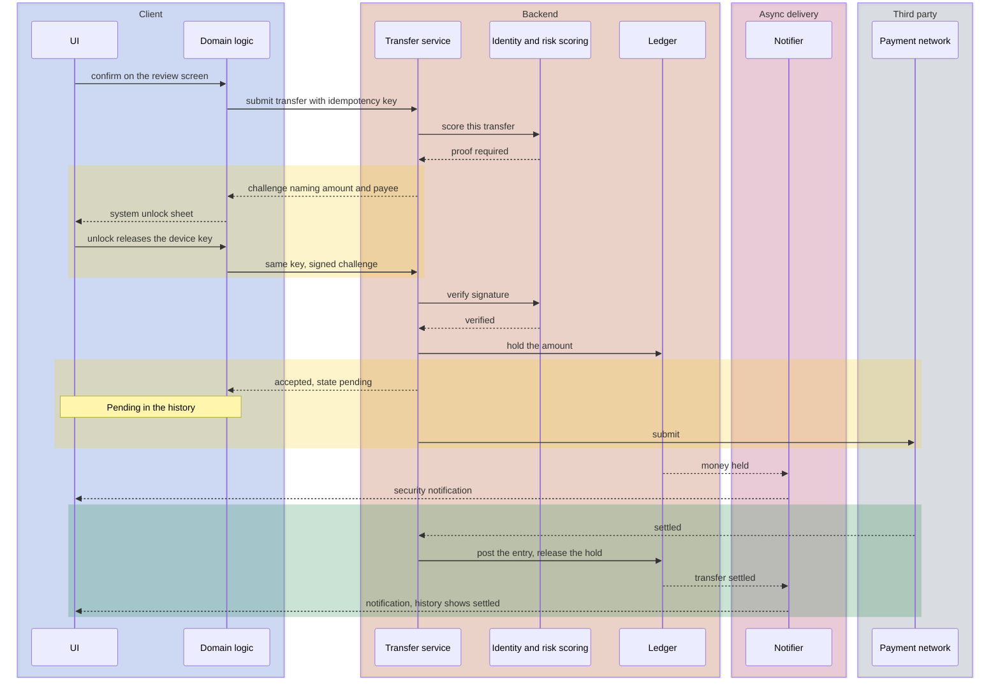

import Probe from '../../../components/Probe.astro';
import Signals from '../../../components/Signals.astro';
import TeardownBar from '../../../components/TeardownBar.astro';
import WorksheetForm from '../../../components/WorksheetForm.astro';

> **The archetype.** An app in which a person sees the money or the investments they hold, moves money to other people and other accounts, and trusts that the figures are correct and that no one else can act in their name.

## 46.1 What defines this archetype

A money app makes one promise. Your money is exactly what the screen says, and nobody else can move it.

- **Exactly what the screen says.** A social app may show a feed that is a minute old. A money app may not show a balance that is a minute old as if it were current. The backend's ledger is the only source of truth, and the client is a window onto it.
- **Nobody else can move it.** A session that lasts for months is a convenience in a reading app. In a money app it is an open door. Proof of presence is asked often, and proof of intent is asked again before money moves.

This archetype accepts friction where other apps accept risk. When you see friction in a money app, assume it was chosen.

Four concerns dominate the design.

| Concern | Why it dominates | Chapter |
|---|---|---|
| Security and trust | The backend decides everything, and each sensitive action needs a second proof | [Chapter 21](/part-2-concerns/21-security-and-trust/) |
| Identity and sessions | Sessions are short, the device is part of the identity, and every return is gated | [Chapter 20](/part-2-concerns/20-identity-and-sessions/) |
| Releases and compatibility | Old versions are a security and legal risk, so they are retired by force | [Chapter 33](/part-2-concerns/33-releases-and-compatibility/) |
| Privacy, permissions and consent | Regulation dictates screens, records and waiting periods | [Chapter 22](/part-2-concerns/22-privacy-permissions-and-consent/) |

Two further chapters supply mechanisms. [Chapter 26](/part-2-concerns/26-payments-and-subscriptions/) describes a payment as a state machine, and a transfer follows the same pattern. [Chapter 12](/part-2-concerns/12-offline-and-sync/) defines the offline levels, and this archetype is the clearest example of Level 0.

The archetype has three variants that differ in a meaningful way.

| Variant | What the user holds | What is distinctive |
|---|---|---|
| Bank account app | Accounts at a regulated institution | Slow settlement, pending entries, the strictest device binding |
| Wallet for payments between people | A stored balance, or a link to a card or account | Transfers inside one system finish at once. Contacts and requests add a social layer |
| Investing app | Positions whose value changes by the second | Live prices, orders with their own states, market hours |

Many products combine two of these. Section 46.6 separates them.

## 46.2 Requirements read from the product

None of these requirements names a design.

**What the app does**

- Show each account's balance and its recent transactions.
- Send money to another person or another account, and show what became of it.
- Show a transaction before it is final, marked as such.
- Notify the user when money arrives or leaves, and when something about the account's security changes.
- Open an account from the phone, including a check of the person's identity.
- In the investing variant, show prices as they change and accept orders to buy and sell.

**Qualities it must have**

- A figure on screen is current, or it is marked as old. It is never silently stale.
- A transfer happens once or not at all. A weak network never produces two.
- A person who picks up the unlocked phone cannot open the app. A person who copies the app's data to another device cannot use it.
- Sensitive figures do not leak through screenshots, the app switcher or notifications on a locked screen.
- The app refuses to operate where it cannot protect the user: on a device that has been modified, or in a version with a known defect.

Of the seven constraints of [Chapter 2](/part-1-method/2-the-mobile-constraint-set/), two bind hardest: untrusted client, and slow release, because a defect in a shipped version stays in use until the team forces it out.

## 46.3 Running the probes

Run the general probes first, then the eight probes of this chapter. [Chapter 4](/part-1-method/4-probes/) describes the probe families and how to run a probe cleanly.

Two rules apply to every probe in this chapter. No probe moves money. No probe enters a wrong credential on purpose, because repeated failures can lock an account. Every probe observes what the app shows and asks for, and stops.

### Probes from Chapter 20

Run P20.1, P20.2, P20.3 and P20.6 from [Chapter 20](/part-2-concerns/20-identity-and-sessions/). Skip P20.4 and P20.5 unless you are sure that removing a device or changing the password will not deregister the device you rely on.

| Probe | Typical outcome for a money app | What it tells you |
|---|---|---|
| P20.1 Offline while signed in | A connection error, or an unlock that leads nowhere | The session is checked with the backend before anything is shown |
| P20.2 Return after idle | An unlock prompt, often one that leads nowhere offline | A local gate, or a device-bound credential, in front of a short session |
| P20.3 Many devices | An earlier device is signed out, or the new sign-in is reported | The number of devices is limited and watched |
| P20.6 Long absence | Asked to confirm with an unlock or a password, with your account shown | The session ended and the device is still remembered |

### Probes from Chapter 21

Run P21.1, P21.2, P21.3, P21.4 and P21.9 from [Chapter 21](/part-2-concerns/21-security-and-trust/). P21.4 already stops before any confirmation. Leave out P21.5, which asks for several one-time codes and comes too close to a limit on an account you depend on.

| Probe | Typical outcome for a money app | What it tells you |
|---|---|---|
| P21.1 Offline refusal | Each action is refused or disabled | The backend decides. Nothing is completed on the client |
| P21.2 Screenshot of a sensitive screen | Blank or refused on some systems, allowed on others | The team marked the screen as sensitive |
| P21.3 App switcher | A logo, a blur or a blank | The app covers its content when it leaves the foreground |
| P21.4 Second proof | A password, a code or an unlock, for most sensitive actions | Step-up proof, often verified by the backend |
| P21.9 Stated device requirements | The maker states that modified devices are not supported | An integrity requirement exists |

### Probes from Chapters 33, 22 and 12

From [Chapter 33](/part-2-concerns/33-releases-and-compatibility/), run P33.1, P33.2 and P33.5. If an older device of yours still has an old version installed, run P33.8 on it as well. Typical is a steady release cadence, generic release notes, and a blocking screen where another app would show a soft prompt. P33.8 typically ends at a forced-update gate.

From [Chapter 22](/part-2-concerns/22-privacy-permissions-and-consent/), run P22.1, P22.7, P22.8 and P22.9. Typical is a long onboarding with explanation screens, consent that is recorded per purpose, and an account closure path that leads to a waiting period or to support, because an account with money in it cannot simply be deleted.

From [Chapter 12](/part-2-concerns/12-offline-and-sync/), run P12.1 and P12.2 on the account screen. Typical is "nothing appears" and "the control is disabled". The other probes of that chapter do not apply, since there is no outbox to test.

### Money probes

P46.1 examines the balance. P46.2 and P46.3 examine the session. P46.4 to P46.6 examine a transfer without making one. P46.7 reads the device binding, and P46.8 applies to the investing variant only.

<TeardownBar />

### P46.1 Balance in airplane mode

<Probe id="P46.1" />

### P46.2 Gate on every return

<Probe id="P46.2" />

### P46.3 Idle inside the app

<Probe id="P46.3" />

### P46.4 Transfer form offline

<Probe id="P46.4" />

### P46.5 Transfer up to review

<Probe id="P46.5" />

### P46.6 Pending and settled

<Probe id="P46.6" />

### P46.7 Read the device binding

<Probe id="P46.7" />

### P46.8 Live price rhythm

<Probe id="P46.8" />

## 46.4 The design, concern by concern

Each subsection states the design this archetype usually takes and the reason. The components are those of the universal app model in [Chapter 3](/part-1-method/3-the-universal-app-model/).

### The balance belongs to the backend

A balance is not a value that the client holds and syncs. It is the result of a calculation over a ledger that only the backend can see in full. A card payment at a shop, a standing order and an incoming salary all change it without the app taking part.

The app therefore reads balances with a network only read policy, in the terms of [Chapter 11](/part-2-concerns/11-local-storage-caching-and-prefetching/). It sits at offline Level 0 of [Chapter 12](/part-2-concerns/12-offline-and-sync/). A cache is not hard to build. A wrong balance causes harm in a way a stale feed does not: a person who sees money that is no longer there spends it. Many teams also keep balances out of the local store entirely, so that a locked or signed-out app has nothing to give up.

Some apps choose a softer position. They keep the last fetched figure and show it with its age: a time under the figure, a gray figure, or an offline banner. That is Level 1 for one screen, with a strict rule attached. A stale figure is always labeled. P46.1 records the choice. A balance shown offline with no label contradicts the archetype's promise, and it is worth recording as a failure mode.

Writes follow the same rule. No transfer is queued for later, because an outbox would move money when the user is not present, at a balance they have not seen. P46.4 confirms the refusal and shows where it is placed.

### Short sessions, a local gate and the device-bound credential

[Chapter 20](/part-2-concerns/20-identity-and-sessions/) describes a session as an access credential plus a renewal credential. A money app uses the same parts with very different numbers.

| Part | A typical consumer app | A money app |
|---|---|---|
| Access credential | Minutes to hours | Minutes |
| Renewal credential | Weeks to months, renewed silently | Hours to days, or none at all |
| Return to the foreground | No prompt | A local gate, on every return or after a short period |
| No input for a while | Nothing happens | An idle timeout ends or locks the session |
| Sign-in after the session ended | Rare | Frequent, and made fast by a device-bound credential |

Three mechanisms stack, and they are easy to confuse.

**The local gate.** On each return, the app asks the operating system whether the owner is present. The backend does not hear of it. It protects against a person who picks up an unlocked phone. P46.2 measures how long the app may be out of sight before the gate returns.

**The idle timeout.** A timer on the client, usually matched by a short credential lifetime on the backend, ends the session after minutes without input. The client timer is the user experience and the backend lifetime is the enforcement. P46.3 shows the client side.

**The device-bound credential.** Because sessions end so often, sign-in must be cheap. At registration the device creates a key pair in secure hardware-backed storage, and the backend stores the public half. Signing in again is then one unlock: the fingerprint or face releases the key, the key signs a challenge from the backend, and the backend issues a fresh session. Nothing reusable is typed.

The local gate and the device-bound credential look the same on screen. Both show the system's unlock sheet. A gate passes offline if the app has anything to show, and a proof needs the backend. Since a money app shows nothing offline, P20.2 often ends as "an unlock prompt that leads nowhere offline", which fits both, and the claim is Speculative. The stronger signal arrives by accident: an app that demands your password after you add a fingerprint to the device is using a bound key that the secure hardware invalidated.

### Binding the account to a device

In a money app the device is part of the identity. The backend holds a record per registered device. A stolen password alone then opens nothing. The thief must also register a device, and registration is where the design places its strongest proof.

A new device typically has to supply something that sign-in credentials cannot.

- Approval from the old device, by a prompt or by scanning a code shown on one with the other.
- A one-time code sent to the registered phone number, combined with something else such as a card PIN.
- A code sent by post, or a visit to a branch, in the strictest designs.

After registration, many designs add a quiet period. Transfer limits are low for a day or more, and new payees cannot be added at once. The delay gives the real owner time to notice the security notification and react.

Two models exist, and P46.7 separates them by reading alone. With one device at a time, a new registration revokes the old one, and a lost phone means the full registration path. With several registered devices, each appears in a device list, an existing device can approve a new one, and each can be revoked alone.

Do not test binding by starting a device change. The first step often deregisters the device in your hand.

### Step-up proof before a transfer

A session proves that this device signed in. It does not prove that the person holding it now intends this transfer. [Chapter 21](/part-2-concerns/21-security-and-trust/) calls the answer a step-up proof, and this archetype uses it more than any other.

Three choices define the design.

**Which actions.** Sending money, adding a payee, raising a limit, showing a full card number, changing the phone number, registering a device.

**Which proof.** The useful proofs are the ones the backend can verify. The strongest form signs the details of the action itself: the device-bound key signs a challenge that includes the amount and the payee, so the proof cannot be reused for a different transfer. A one-time code or approval in a second app does a similar job. A local gate is the weak form, since the backend never learns of it.

**When.** Always, or adaptively. Risk scoring on the backend looks at the amount, whether the payee is new, the device's age, the location and the pattern of recent activity. A low score lets a small transfer to a known payee pass with one tap. A high score asks for more proof, delays the transfer, or refuses it.

P46.5 shows where the proof sits in the flow without confirming anything. It cannot show an adaptive rule, which would take real transfers. If months of normal use show that known payees need less proof than new ones, record that as Inferred.

### A transfer as a state machine

A transfer is not a request that returns success. It is a record on the backend that moves through states, and some states last for days. [Chapter 26](/part-2-concerns/26-payments-and-subscriptions/) describes the same pattern for a card payment.

| State | What has happened | What the user sees |
|---|---|---|
| Created | The backend recorded the intent and checked limits and the payee | The review screen |
| Authorized | The step-up proof was verified | A brief progress indicator |
| Pending | The amount is held against the balance and the transfer is submitted to the payment network | "Pending" or "Processing" in the history |
| Settled | The receiving side confirmed | A final entry, with its booking date |
| Failed or returned | The network or the receiving institution refused | A failed entry, and the hold released |

Two balances follow from this table. The booked balance counts settled entries only. The available balance subtracts holds as well. A card payment is the common case: the shop's authorization creates a hold within seconds, and the settled entry arrives a day or two later, sometimes with a slightly different amount. P46.6 records whether the app shows both views.

The create step has the lost-response problem in its most expensive form. If the response to "send" is lost and the client retries, a careless backend sends the money twice. The remedy is the idempotency key of [Chapter 12](/part-2-concerns/12-offline-and-sync/).

```text
function confirmTransfer(draft):
  key = savedKeyFor(draft) or newUniqueId()
  save(draft, key)                          // survives process death
  match backend.submitTransfer(draft, key):
    ProofRequired(challenge):
      proof = deviceKey.sign(challenge)     // the challenge names amount and payee
      resubmit(draft, key, proof)           // same key
    Accepted(transfer):
      show(transfer.state)                  // Pending is a normal answer
    AlreadyExists(transfer):
      show(transfer.state)                  // a retry found the first attempt
    Unreachable:
      showUnknownOutcome()                  // never "failed". Read the history first
```

The last branch carries the most important rule in the chapter. When the client does not know whether the backend received the transfer, it must not say "failed", because the user will send it again by hand with a new key. A well-designed app says that the outcome is unknown and directs the user to the history, where the backend's record gives the answer.

You cannot force a lost response as a normal user, and you must not try with real money. What you can observe is the vocabulary. A history that shows pending, completed, failed and returned has told you its states.

Wallets that move money inside one system differ. Both balances live in the same ledger, so a transfer can settle in one transaction, and pending is rare. The states return when the wallet touches the outside: a top-up from a card, or a withdrawal to a bank account.

### Notifications as a security channel

In most apps a notification is an invitation to return. Here it is a control. A notification that says "you paid 40 at a shop" a few seconds after the event lets the owner detect a payment they did not make, faster than any statement.

The design consequences are specific.

- **The backend sends on every sensitive event.** Money in, money out, a sign-in, a new device, a new payee, a changed limit. The trigger is the ledger or the security service, not the client.
- **Some categories cannot be switched off.** Marketing can be muted. Security alerts usually cannot, or the app warns when you try. Read the notification settings, using P23.1 from [Chapter 23](/part-2-concerns/23-background-work-and-notifications/).
- **A second channel backs up the first.** A push can be lost or disabled, so the most important events also go by text message or email. Seeing the same alert in two channels is the signature.
- **Content is limited on a locked screen.** Amounts may be shown and balances usually are not.
- **Approval can arrive as a notification.** A prompt to approve a sign-in or an online card payment is a step-up proof delivered by push to the bound device.

After an ordinary card payment that you would have made anyway, a notification within seconds shows that the authorization, not the settled entry, triggers the push.

### Hiding sensitive screens and refusing a modified device

[Chapter 21](/part-2-concerns/21-security-and-trust/) describes both protections. This archetype applies them more widely than any other.

Screens with balances, card numbers and PIN entry are excluded from screenshots and recordings where the system allows it, and the app covers itself in the app switcher. P21.2 and P21.3 check both. Run them on several screens. The set of protected screens is the team's own classification of what is sensitive. PIN entry often uses a number pad that the app draws itself, so that no third-party keyboard sees the digits.

The app also refuses to run, or runs with reduced features, on a device whose operating system has been modified. The reason is that every other protection in this section rests on the operating system keeping its promises: secure storage, the unlock sheet, the screenshot rule. You do not probe this, and this handbook never modifies a device. P21.9 records what the maker states. Whether the check runs only on the device, or the backend verifies a signed statement from the platform, cannot be told apart from outside, and the claim stays Speculative.

### Forced updates and a high minimum supported version

[Chapter 33](/part-2-concerns/33-releases-and-compatibility/) describes the range of policies, from supporting every version ever shipped to retiring versions by force. A money app sits at the strict end, for three reasons.

- A security defect in an old version remains exploitable for as long as that version is accepted.
- A legal change, such as a new disclosure or a new consent, must reach every user by a date.
- Each supported version multiplies the cases an audit has to cover.

The result is a high minimum supported version. The window of accepted versions is often a few months wide, where a content app accepts versions that are years old. Below the minimum, the forced-update gate replaces the app at launch. P33.5 and P33.8 show it.

The gate carries its own risk, which [Chapter 7](/part-2-concerns/7-launch-and-startup/) discusses. A user who needs to pay now, on a weak connection, is locked out. Teams soften this with a soft prompt for some weeks before the gate closes.

### Regulation as a source of screens and delays

Many screens in a money app were required by a regulator or by the institution's own compliance function. The rules differ by country, so read this as a list of patterns and not as a statement of law.

| What you see | What usually lies behind it |
|---|---|
| A document scan and a live picture of the face at sign-up | An identity check, run by a third party, with a review state that can last days |
| An account that works with low limits until a review finishes | An asynchronous approval state on the backend |
| Terms that must be scrolled or opened before a control becomes active | A consent record with a version and a time, as in [Chapter 22](/part-2-concerns/22-privacy-permissions-and-consent/) |
| A warning before paying a new payee, sometimes with a check of the payee's name | Fraud prevention duties |
| A transfer held "for review" | Screening against rules the app will not explain |
| Account closure through a waiting period or through support | Money and records must be dealt with before deletion |

Two design consequences follow. First, onboarding is a long state machine that survives process death and days of waiting, so its progress lives on the backend. Second, the same app shows different screens in different countries, so a teardown describes one country's version.

When a delay or a screen looks like poor design, consider regulation first. That reading is Speculative unless the app or its help pages name the reason.

### Live prices in the investing variant

An investing app adds real-time delivery, the subject of [Chapter 14](/part-2-concerns/14-real-time-delivery/), to an archetype that otherwise avoids it.

The usual design is a persistent connection or a server stream to which the client subscribes per instrument. Three details shape it.

- **Subscription follows the screen.** The client subscribes to the instruments that are visible and unsubscribes when they scroll away.
- **The backend conflates.** A busy instrument produces more changes than a screen can draw. The backend sends the latest value at a bounded rate and drops the ones in between. A price is state and not a sequence of events, so a missed update costs nothing as long as the next one arrives. There is no catch-up by cursor, in contrast to messaging.
- **Staleness is shown at once.** A frozen price that looks live is the investing form of the unlabeled balance. Good clients gray the price or show a mark within seconds of losing the connection. P46.8 checks this in its airplane mode step.

The displayed price is never the price of a trade. The order form asks the backend for a quote, and the order itself is a state machine like a transfer: submitted, accepted, partly filled, filled, canceled or rejected. A quote with a countdown is the visible evidence that the backend sets the price.

## 46.5 End-to-end architecture

Figure 46.1 shows the components that the probes imply for the bank account variant.



*Figure 46.1. The client and backend of a bank account app. The client holds a key and no money data.*

The client zone has no local store for content, no outbox and no sync engine. The only durable thing on the device is a key. In the terms of the universal app model, the ledger is the backend store, the notifier is async delivery, and the payment network is a third party. The investing variant adds a price stream on the backend and a subscription manager on the client.

Figure 46.2 follows one transfer to an account at another institution.



*Figure 46.2. A transfer with a step-up proof, a pending state and settlement that arrives later.*

If the payment network refuses, the last phase is a return: the hold is released, the entry is marked returned, and a notification says so. The client takes no part in that outcome.

## 46.6 Variants and how to tell them apart

The three variants are told apart mostly by reading the product. The probes then confirm what each variant implies for the design. [Chapter 5](/part-1-method/5-from-signal-to-inference/) describes how a signal becomes a claim with a confidence word.

| Question | Discriminating probe | Reading |
|---|---|---|
| Is there a settlement delay | P46.6 | Pending entries and two balances point to a bank account. Final entries only point to a wallet with one ledger |
| How strict is device binding | P46.7, with P20.3 | One device at a time is typical of a bank. Several devices with a device list is typical of a wallet or an investing app |
| Are there live prices | P46.8 | Irregular changes with no gesture mean real-time delivery, and the investing variant |
| How strict is the session | P46.2 and P46.3 | A gate on every return with an idle timeout is the strict end |

**Bank account against wallet.** A wallet between people optimizes for speed. Its transfers inside the system settle at once, and its step-up proof is often a local gate for small amounts. A bank account app optimizes for correctness across systems it does not control, so it shows states and dates. The boundary case is a wallet's withdrawal to a bank account, which behaves like a bank transfer. Run P46.6 on both kinds of entry.

**Investing against the others.** The investing variant is the only one with a persistent connection and a subscription per screen. Its session rules are often slightly more relaxed for viewing and as strict as a bank's for withdrawing money, so run P21.4 on both a trade and a withdrawal.

The signal table collects the behaviors from the eight probes and from normal use.

<Signals chapter={46} />

## 46.7 What changes with scale

The client of a money app changes little with scale. The backend changes in ways that are almost entirely hidden.

**The same at every size**

- Balances and transactions read from the backend, with nothing shown as current that is not.
- An idempotency key on every request that moves money.
- A transfer as a record with states, and a history that shows them.
- A local gate, a short session, a step-up proof before a transfer, and a forced-update gate.

**What changes**

- **The ledger.** A small product posts entries in one database transaction. A large one partitions accounts, and a transfer between partitions becomes a sequence of steps with compensation. From outside you may see a transfer inside the same institution pass briefly through pending.
- **Risk scoring.** A small product uses fixed rules: a limit per day, a code for every new payee. A large one scores each action with a model and adapts the proof. Adaptive step-up is the visible sign.
- **Third parties.** A small product reaches one payment network through one partner. A large one connects to several and routes among them, which shows as different arrival times for different kinds of transfer.

From outside you see the consequences: a maintenance screen during a planned window, an arrival estimate that depends on the payee. Each is a Speculative signal of what lies behind it.

## 46.8 Completed worksheet

[Chapter 6](/part-1-method/6-the-teardown-worksheet/) describes the worksheet and the order in which to fill it in. The fields in this form are specific to the archetype. The probes of Section 46.3 fill most of them.

<TeardownBar />

<WorksheetForm chapters={[46]} />

The fields that the Part II chapters add to the worksheet take these typical values for a bank account app. A value that differs in your teardown is a finding. Record it with the probe that produced it.

| Field | Typical value for the archetype | Confidence |
|---|---|---|
| Offline level, [Chapter 12](/part-2-concerns/12-offline-and-sync/) | 0 Online only | Inferred |
| Offline session, [Chapter 20](/part-2-concerns/20-identity-and-sessions/) | Blocks on check | Inferred |
| Biometric unlock, [Chapter 20](/part-2-concerns/20-identity-and-sessions/) | Needs network. A local gate and a device-bound credential both fit | Speculative |
| Security posture, [Chapter 21](/part-2-concerns/21-security-and-trust/) | The backend decides, with a hardened client | Inferred |
| Screenshot and app switcher, [Chapter 21](/part-2-concerns/21-security-and-trust/) | Blocked where the system allows, and covered | Observed |
| Step-up proof, [Chapter 21](/part-2-concerns/21-security-and-trust/) | Backend proof, for transfers, payees, limits and card details | Inferred |
| Version policy, [Chapter 33](/part-2-concerns/33-releases-and-compatibility/) | Minimum supported version enforced | Inferred |
| Backend components implied | Gateway, identity and risk scoring, transfer service, ledger as the backend store, async delivery for security notifications, payment networks and an identity check as third parties | Inferred |
| Failure modes seen | A transfer whose outcome is unknown, a forced-update gate at a bad moment | Observed |

## 46.9 As an interview question

The question is usually asked as "design a mobile banking app", "design a wallet for payments between friends" or "design the transfer flow". It tests whether you treat the client as untrusted and can reason about money moving exactly once.

**Clarify first.** Ask four things.

1. Which variant: accounts at an institution, a stored balance, or investments with live prices.
2. Whether money leaves the system, since that decides whether settlement is delayed.
3. One device per account or several.
4. Whether onboarding and identity checks are in scope. They are large, and most interviewers exclude them.

Then state the promise from Section 46.1. It gives you the test for every decision: the figure is correct or labeled, and only the owner can move money.

**Go deep on three concerns.**

- **The transfer.** A record with states, created with an idempotency key, authorized by a step-up proof, held in the ledger and settled later. Say what the client shows when the response is lost. Draw Figure 46.2.
- **Sessions and the device.** Short access credentials, a local gate, a device-bound credential for fast sign-in, and registration of a new device as the strongest proof in the system.
- **What the client stores.** As little as possible. Explain why this app is Level 0 while a messaging app is Level 3, and what you would label if you cached a balance.

**Trade-offs an interviewer expects to hear.**

- A cached balance with a time against no balance offline: convenience against the risk of a figure that is believed.
- A local gate against a proof the backend verifies: speed and offline use against real assurance.
- One bound device against several: simplicity of reasoning against recovery when a phone is lost.
- Always asking for a step-up proof against adaptive risk scoring: predictability against friction.
- For investing: a stream per instrument against polling, and conflation against delivering every change.

Mention notifications as a security channel without being asked.

## 46.10 Summary

- A money app promises that the figure on screen is your money and that nobody else can move it. Security, sessions, release policy and regulation dominate its design.
- Balances are the backend's. The app is at offline Level 0, and any figure it keeps is labeled with its age. Transfers are never queued.
- Sessions are short. A local gate guards every return, an idle timeout ends unattended sessions, and a device-bound credential makes frequent sign-in fast.
- The account is bound to a device. Registering a new device demands a proof that sign-in credentials cannot supply, and is often followed by a quiet period.
- A transfer is a state machine: created with an idempotency key, authorized by a step-up proof, pending while held, then settled or returned. An unknown outcome is never shown as a failure.
- Notifications are a security channel. The backend sends them on every sensitive event, and the important ones cannot be switched off.
- Sensitive screens are hidden from capture, modified devices are refused, and old versions are retired by a forced-update gate with a high minimum supported version.
- Regulation adds screens, records and waits. The investing variant adds real-time delivery of prices, with staleness shown at once.
