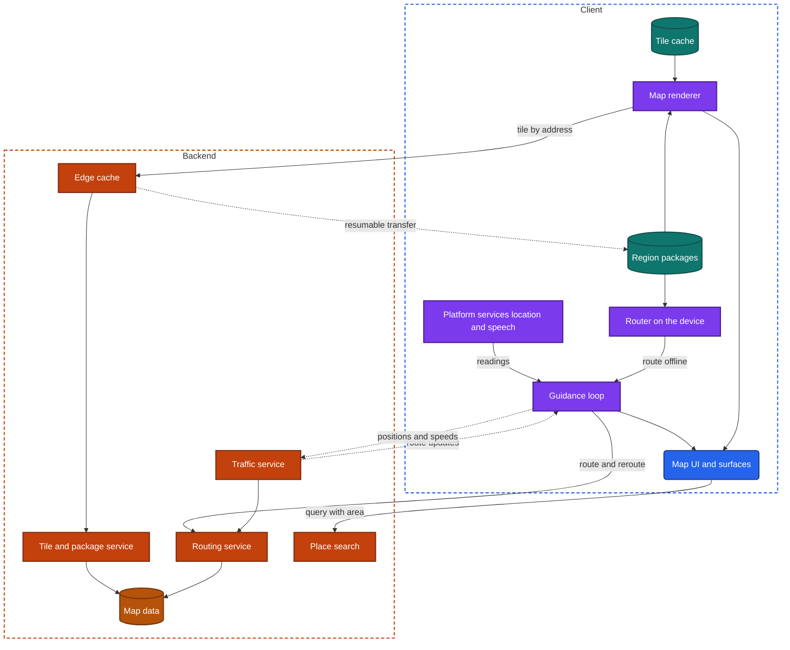
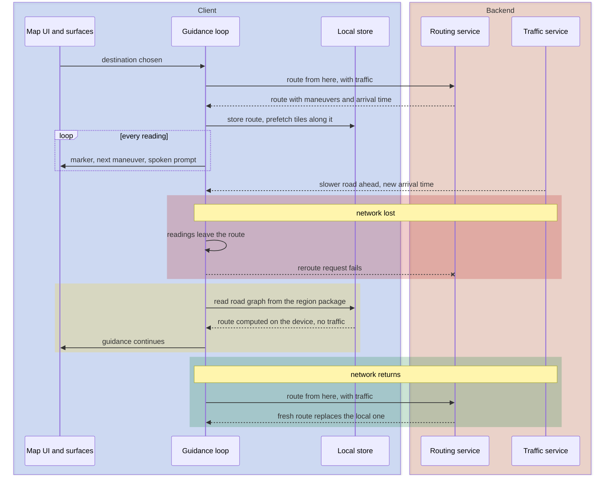

import Probe from '../../../components/Probe.astro';
import Signals from '../../../components/Signals.astro';
import TeardownBar from '../../../components/TeardownBar.astro';
import WorksheetForm from '../../../components/WorksheetForm.astro';

> **The archetype.** An app that draws a map of anywhere in the world around your position, finds places, computes a route, and guides you along it turn by turn, with or without a network.

## 47.1 What defines this archetype

A maps and navigation app makes one promise. You know where you are and how to get there, including with no signal.

Each clause of that promise costs something.

- **Where you are.** The device reads its position continuously and draws it on a map. Continuous location is the most expensive thing an app can ask of a battery.
- **How to get there.** A route is a computation over a graph of every road. Guidance then runs for hours, mostly with the screen off or the app in the background.
- **With no signal.** The map of the world is far larger than any device. The app has to decide which part of it to hold, and what it can still do with only that part.

Four concerns dominate the design.

| Concern | Why it dominates | Chapter |
|---|---|---|
| Location | The position drives the screen, the guidance and the battery cost | [Chapter 24](/part-2-concerns/24-location-sensors-and-hardware/) |
| Local storage and caching | The map is data that is mostly cached, and partly downloaded on purpose | [Chapter 11](/part-2-concerns/11-local-storage-caching-and-prefetching/) |
| Performance and resource budgets | Drawing, positioning and the radio run together for hours. Storage is counted in gigabytes | [Chapter 35](/part-2-concerns/35-performance-and-resource-budgets/) |
| Background work | Guidance must continue when the app is not on screen | [Chapter 23](/part-2-concerns/23-background-work-and-notifications/) |

Two further chapters supply mechanisms. [Chapter 28](/part-2-concerns/28-search-and-discovery/) covers place search. [Chapter 25](/part-2-concerns/25-platform-surfaces-widgets-wearables-and-extensions/) covers the lock screen, the watch and the car display.

This chapter uses three terms of its own. A **tile** is one square piece of the map at one zoom level. A **road graph** is the data a router needs: junctions, the road segments between them, and the rules for each. A **region package** is a file the user downloads on purpose, holding everything the app needs for one area.

The archetype has three variants.

| Variant | Main use | What it must hold on the device | Live data |
|---|---|---|---|
| General map | Look around, find a place, get directions now and then | A cache of what you viewed | Traffic, opening hours, reviews |
| Driving navigation | Turn-by-turn guidance for hours | The route, and the map along it. Often whole regions | Traffic and incidents, continuously |
| Outdoor map | Trails and terrain far from any network | Whole regions, downloaded before leaving | Little or none |

A general map assumes a network. An outdoor map assumes its absence. Driving navigation must work in both. Many products combine two variants, and Section 47.6 gives the probes that place a product.

## 47.2 Requirements read from the product

These are requirements as a user experiences them. None of them names a design.

**What the app does**

- Show a map of any place, at any zoom, and let you pan, zoom, rotate and tilt it.
- Show your position and the direction you face.
- Find a place by name, by address or by kind, near you or near the area on screen.
- Compute a route for a chosen way of traveling, with a distance and an arrival time.
- Guide you along the route with a moving view, on-screen instructions and spoken prompts.
- Notice when you leave the route, and give a new one.
- Show traffic and incidents, and change the route when they change.
- Download an area for use with no network.
- Continue guidance on the lock screen, on a watch and on a car display.

**Qualities it must have**

- The map moves with your fingers, with no stutter, on any device.
- A place you looked at recently appears at once, with or without a network.
- A spoken prompt comes at the right moment. A prompt five seconds late is a missed turn.
- Guidance never stops because the screen locked, a call arrived or the network dropped.
- An hour of guidance does not empty the battery or overheat the device.
- Downloaded areas do not fill the device without your knowledge, and can be removed.

Of the seven constraints of [Chapter 2](/part-1-method/2-the-mobile-constraint-set/), three bind hardest. Limited resources shape everything: battery, storage, data and heat all reach their limits in one session. Unreliable network shapes the choice of what to hold on the device. Platform rules decide whether location and audio may continue in the background.

## 47.3 Running the probes

Run the general probes first. They place the app on the scales of Part II, and the map probes then separate the variants. [Chapter 4](/part-1-method/4-probes/) describes the probe families and how to run a probe cleanly.

One rule governs every probe that involves guidance. Run it on foot, or as a passenger. Never operate a phone while you are driving.

### Probes from Chapter 24

Run these from [Chapter 24](/part-2-concerns/24-location-sensors-and-hardware/) on the map screen, and then again with directions running.

| Probe | Typical outcome for this archetype | What it tells you |
|---|---|---|
| P24.1 Location indicator on screen | On for every screen while the app is open, or while the map is open | Continuous while on screen. The map is most of the app |
| P24.2 Location indicator in the background | Off within seconds when no directions run. On continuously with a persistent marker when they do | Continuous in the background belongs to guidance alone |
| P24.3 Approximate location only | It works and shows an area without a pinpoint, and asks for precise when you start directions | Looking around needs an area. Guidance needs meters |
| P24.4 Location denied | The map still works, and you type a starting point | The map and search do not depend on the permission |
| P24.7 Battery after a session | A large share, with much of it in the background | The expected cost of guidance. A large share with no guidance is a finding |

### Probes from Chapter 11

Run these from [Chapter 11](/part-2-concerns/11-local-storage-caching-and-prefetching/) on the map itself, treating an area of the map as the content.

| Probe | Typical outcome | What it tells you |
|---|---|---|
| P11.1 Memory or disk | The area appears on both offline visits | A disk cache of tiles |
| P11.3 Late revisit | The old map appears, with no remark | Tiles are shown past any time limit. An old map is better than none |
| P11.4 Storage growth | The figure rises while you browse new areas, then levels off | A bounded cache with eviction |
| P11.5 Clear cache | The figure drops, and downloaded areas are intact | Cache and downloads are kept in separate areas |

### Probes from Chapters 35, 23, 28 and 25

| Probe | Typical outcome | What it tells you |
|---|---|---|
| P35.2 Storage over a week, from [Chapter 35](/part-2-concerns/35-performance-and-resource-budgets/) | It rises, then levels off. Each download adds its stated size | Posture 3 for storage |
| P35.8 Sustained use. Run it as a passenger, with the device in sunlight on a long trip | Warm, and the app lowers detail or frame rate smoothly | The app reads the thermal state |
| P23.2 User-visible work, from [Chapter 23](/part-2-concerns/23-background-work-and-notifications/) | Guidance continues, with an indicator shown by the system | Guidance is declared to the platform as navigation |
| P28.1 Search in airplane mode, from [Chapter 28](/part-2-concerns/28-search-and-discovery/) | Results only for recent and saved places, unless an area is downloaded | Backend search, with a local filter over history |
| P25.5 Live status after a force-quit, from [Chapter 25](/part-2-concerns/25-platform-surfaces-widgets-wearables-and-extensions/) | It freezes or disappears | The app feeds the status while it runs. Guidance is computed on the device, so no push could replace it |
| P25.7 Watch with the phone off | It needs the phone, or shows a route that it cannot update | The watch is a companion to the phone's guidance |

### Map probes

P47.1 and P47.2 examine the map. P47.3 and P47.4 examine routing with no network. P47.5 examines guidance in the background, P47.6 and P47.7 live data and search, and P47.8 storage.

<TeardownBar />

### P47.1 Visited and unvisited areas offline

<Probe id="P47.1" />

### P47.2 Rotate and zoom

<Probe id="P47.2" />

### P47.3 Download a region

<Probe id="P47.3" />

### P47.4 Leave the route offline

<Probe id="P47.4" />

### P47.5 Navigation with the screen locked

<Probe id="P47.5" />

### P47.6 Traffic layer offline

<Probe id="P47.6" />

### P47.7 Place search offline

<Probe id="P47.7" />

### P47.8 Storage and its controls

<Probe id="P47.8" />

## 47.4 The design, concern by concern

Each subsection states the design this archetype usually takes and the reason. The components are those of the universal app model in [Chapter 3](/part-1-method/3-the-universal-app-model/).

### The map as tiles

No client holds the map of the world, and no request could return it. The map is cut into tiles. At the lowest zoom level one tile covers the world. Each further level cuts every tile into four. A tile has an address made of its zoom level, column and row, and the client asks only for the tiles that cover the screen.

This addressing is the reason maps cache so well. A tile's address is the same for every user. An edge cache can serve it, and a disk cache on the device can keep it. In the terms of [Chapter 11](/part-2-concerns/11-local-storage-caching-and-prefetching/), tiles are a response cache with a very long time limit.

A tile can be delivered in two forms.

| | Image tiles | Data tiles |
|---|---|---|
| What the tile holds | A finished picture | Shapes, names and classes of things |
| Who draws | The backend, once | The device, on every frame |
| Rotation and tilt | The picture turns, and its text turns with it | Labels stay upright, and the map tilts |
| Between zoom levels | The picture is stretched, then replaced | Sharp at every moment |
| Style, language, dark mode | A separate set of tiles for each | One set of tiles, restyled on the device |
| Size | Larger | Smaller, for the same area |
| Cost on the device | Almost none | Processing and battery on every frame |

Data tiles are the common choice for the base map, and P47.2 shows it in a few seconds. Image tiles remain for layers that are pictures by nature, such as aerial imagery.

Drawing from data has a price. The device lays out labels and draws thousands of shapes on every frame. That work is where the heat of a long session comes from, and why a careful app lowers its frame rate when the map is still.

### Caching and prefetching tiles

A tile reaches the screen by the shortest path that has it.

```text
function loadTile(address):
  if memoryCache.has(address): return memoryCache.get(address)
  if regionPackages.covers(address):
    return regionPackages.read(address)        // permanent data, no network needed
  entry = diskCache.get(address)
  if entry and not online():
    return entry                               // an old map is better than none
  if entry and entry.age < timeLimit:
    return entry
  fresh = fetch(address, validator: validatorOf(entry))
  match fresh:
    NotChanged:  return diskCache.touch(address)
    Tile(data):  return diskCache.put(address, data)
    Failed:      return entry or parentTileEnlarged(address)
```

Three details of this path show from outside.

- **Old tiles are shown.** The client checks whether a tile is current when it can, and shows the old one when it cannot. That is why P11.3 returns the old map with no remark.
- **A missing tile has a stand-in.** The client enlarges the tile from the zoom level before it. Offline, you see a soft map that never sharpens. P47.1 uses that as the boundary of the cache.
- **Region packages come first.** A downloaded area never depends on the cache.

The client also fetches tiles that are not yet on screen. This prefetching takes three forms: a ring around the visible area, the next zoom level at the center of the screen, and the tiles along a whole route when the route is computed. The last matters most. A driver who loses the network halfway still has a detailed map of the road ahead. If an unvisited stretch of a route is detailed in airplane mode, you have seen it.

### Downloaded regions

Caching holds what you happened to view. A download holds what you chose. The two are different kinds of storage, and an app that confuses them loses a user's map when the device runs short of space.

A region package can hold up to three things.

- **Map data.** Every tile of the area, at every zoom level the product supports offline.
- **A road graph.** With it, a router on the device can compute routes.
- **A place index.** Streets, addresses and points of interest, for search with no network.

P47.3 and P47.7 show which of the three a product ships. Map only is the least. All three make the area fully usable offline.

Packages are built on the backend, given a version, and served by media delivery as large files. The download is a resumable transfer, as in [Chapter 18](/part-2-concerns/18-file-transfer-uploads-and-downloads/), run by a transfer worker and usually held for an unmetered network.

A package goes out of date. Products take three positions: the package updates itself in a deferred task, it expires on a stated date, or nothing happens until the user acts.

Outdoor maps often let the user draw a rectangle and pick the zoom levels. The app then fetches and stores those tiles one by one. It is the same design, with the package assembled on the device.

### Continuous location and its battery cost

The map screen uses continuous location while on screen. Guidance uses continuous location in the background. Both are modes from [Chapter 24](/part-2-concerns/24-location-sensors-and-hardware/), and the second is the most expensive mode there is.

A raw reading is not what the marker shows. The client improves it in three ways.

- **Snapping to roads.** During guidance, the position is moved onto the route. A marker that stays on the road while you walk on the sidewalk beside it is snapped.
- **Heading.** At rest the compass gives the direction you face. In motion the direction of travel is better, and the client switches between them.
- **Prediction.** When readings stop, as in a tunnel, the client moves the marker along the route at the last known speed. A marker that keeps moving at a steady pace through a tunnel is predicted.

The battery cost has four parts: satellite positioning, the screen, the drawing, and the radio. The app can lower the frame rate, simplify the view on a long straight road, and batch its network use. It cannot make positioning cheap, so it asks for the accuracy the activity needs and no more. Walking directions can sample less often than driving directions.

Heat is the budget that fails first in practice. A phone in a mount, in sunlight, charging, drawing and positioning at once, reaches its limit. An app that reads the thermal state reduces detail and frame rate before the system forces a dimmed screen. P35.8 looks for that.

### Routing on the backend and on the device

A route can be computed in two places.

| | Backend routing | On-device routing |
|---|---|---|
| Road data | Complete and current | What the region packages hold, as of their version |
| Live traffic | Used in the choice of route and in the arrival time | Not available offline |
| Works offline | No | Yes, inside downloaded regions |
| Cost | A request for each route and each reroute | Storage for the road graph, and processing |
| Very long routes | No harder than short ones | Slow, or limited to the regions held |

Most products that offer downloads do both. Online, the backend computes the route, because only it knows the traffic. Offline, the device computes from its road graph. The switch is visible: an offline route shows no traffic and often a different arrival time.

Whichever side computes it, the client holds the active route as data: a line, a list of maneuvers with their positions, and text for each instruction. Guidance is then a loop on the device that needs no network.

```text
function onReading(reading):
  position = snapToRoute(reading, route)
  if position.distanceFromRoute > offRouteMeters for several readings:
    reroute(reading)
    return
  next = route.nextManeuver(position)
  if shouldAnnounce(next, position, speed):    // earlier at higher speed
    speak(next.instruction)
  updateSurfaces(next, remainingTime(position))

function reroute(from):
  match backend.route(from, destination):
    Route(r):     route = r
    Unreachable:
      if roadGraph.covers(from, destination): route = localRouter.route(from, destination)
      else: showOffRoute()                     // keep the old line and keep asking
```

P47.4 separates the branches. A client with a road graph gives a new route in seconds with no network. A client without one keeps the old line, shows that you have left it, and asks again when the network returns.

One limit applies online. When a network is present, you cannot tell which side computed a route. A fast answer fits both. Only the offline behavior shows what the device can do, so record the online case as Speculative.

### Live traffic and incidents

Traffic is the part of the map that changes by the minute. It is delivered apart from the base map, so that tiles can be cached for weeks while traffic is not.

Two paths carry it.

- **The traffic layer.** Colored roads on the map. The client fetches traffic for the visible area on a short timer, with a time limit of a few minutes. In the terms of [Chapter 14](/part-2-concerns/14-real-time-delivery/), this is polling. Old traffic misleads, so a careful client removes the layer when it cannot refresh it. P47.6 tests that.
- **Updates to an active route.** During guidance, the client needs to know that the road ahead has changed. It polls the backend with its position and route, or holds a server stream open. The answer is a new arrival time, an incident ahead, or a faster route.

From outside the two delivery mechanisms look the same, because an update every minute or two is frequent enough. What you observe is the result: an arrival time that changes with no action from you, and an offer of a faster route.

The same product is usually a source of the data. The traffic service is computed from the positions and speeds of devices under guidance, which is why a navigation app uploads during a trip. [Chapter 22](/part-2-concerns/22-privacy-permissions-and-consent/) covers the consent this requires, and the privacy listing is where you read whether it happens.

### Navigation in the background

Guidance lasts longer than attention. The screen locks, a call arrives, the user opens a music app. Guidance must continue through all of it, and the platform allows this only as user-visible work, as [Chapter 23](/part-2-concerns/23-background-work-and-notifications/) describes.

The app declares navigation to the platform. The platform keeps the process running, keeps location flowing, and shows an indicator that the user cannot miss. P47.5 and P23.2 observe it.

Three design points follow.

- **The loop must run on the device.** No backend can decide when to say "turn left", because the timing depends on a reading taken a moment ago. Guidance is client logic even in a product that does all its routing on the backend.
- **The session must survive process death.** The grant makes removal unlikely, not impossible. A well-built app stores the destination and the route in the local store, and resumes guidance when it is started again.
- **Speech is an audio feature.** A spoken prompt lowers the music briefly, plays, and restores it, and it must respect a phone call in progress.

The words themselves come from one of two places. The device can turn instruction text into speech with the system's own voice, which works offline and for any street name. Or the backend can supply recorded or generated audio, which sounds better and needs a network or a prefetch with the route. A voice that changes character offline, or drops street names, shows the second with the first as its fallback.

### Place search

Place search is backend search for most products. The index holds every address and business in the world, with opening hours and ratings that change daily. It is far too large and too fresh for a device.

The client side follows [Chapter 28](/part-2-concerns/28-search-and-discovery/). Typing triggers a query after a pause, with debouncing. Each query carries the area on screen, because "pharmacy" means the ones nearby. Recent and saved places are matched on the device by a local filter and appear at once, before the backend answers.

Offline search needs a place index inside a region package. It is an on-device index, and it is smaller in scope than the backend's: names, addresses and categories, without live detail. Results offline therefore look plainer, with no opening hours and no photos. P47.7 separates the three cases: an index on the device, a local filter over history, or nothing.

### Surfaces beyond the app

Guidance is meant to be glanced at, so it appears wherever a glance falls. [Chapter 25](/part-2-concerns/25-platform-surfaces-widgets-wearables-and-extensions/) covers each surface.

| Surface | What it shows | Who computes it |
|---|---|---|
| Lock screen | The next maneuver, the distance to it and the arrival time, as a live status or a notification that updates in place | The app, while it runs as user-visible work |
| Watch | The next maneuver, with a tap on the wrist before a turn | The phone. The watch is a companion in most products |
| Car display | A map and instructions in a layout the system controls | The phone, projected, or a separate client on the car's own computer |

The lock screen surface differs from the one in a delivery app. There, a backend knows the state and can push it. Here, only the device knows the next turn, so the status stops when the app stops. P25.5 shows the difference with one force-quit.

A projected car display is the phone's app drawing to a second screen through templates, so it shares the session, the route and the downloads. A client on the car's own computer shares none of them.

### Storage and how it is managed

A maps app is among the largest users of storage on a device, and its data falls into four kinds with four different rules.

| Kind | Size | Can be recreated | Who removes it |
|---|---|---|---|
| Tile cache | Bounded, tens to hundreds of megabytes | Yes | The app, by eviction. The operating system under pressure |
| Region packages | Hundreds of megabytes to gigabytes each | Only by downloading again | The user, or an expiry rule |
| Voice and style assets | Small to medium | Yes | The app |
| User data: saved places, history, recorded tracks | Small | No, unless synced | The user |

The first two must be stored in different areas, the cache area and the permanent area, as [Chapter 11](/part-2-concerns/11-local-storage-caching-and-prefetching/) explains. P11.5 shows whether the team did so.

Because downloads are large and chosen, the app owes the user an account of them. The expected design is a screen that lists each region with its size, controls to update and delete it, and settings for automatic updates and metered networks. P47.8 records what exists. A product with gigabytes of data and no such screen is at Posture 1 for storage.

## 47.5 End-to-end architecture

Figure 47.1 shows the components that the probes imply for a product with data tiles, downloads and both kinds of routing.



*Figure 47.1. The client and backend of a maps and navigation app with data tiles, region packages and routing on both sides.*

In the terms of the universal app model, the tile cache and the region packages are the local store, the guidance loop is domain logic that runs inside a background worker, and the edge cache is media delivery. An outdoor map removes the routing and traffic services. A general map without downloads removes the region packages and the router on the device.

Figure 47.2 follows one guided trip that loses the network on the way.



*Figure 47.2. A guided trip that leaves the route with no network. The device reroutes from a region package, and the backend's route replaces it when the network returns.*

In a product with backend routing only, the waiting phase has no local route. The guidance loop keeps the old line, shows the marker off it, and repeats the request until it succeeds.

## 47.6 Variants and how to tell them apart

Each axis is settled by one or two probes. [Chapter 5](/part-1-method/5-from-signal-to-inference/) describes how a signal becomes a claim with a confidence word.

| Axis | Positions | Discriminating probe |
|---|---|---|
| How the map is drawn | From data on the device, as images, mixed | P47.2 |
| What is held without a download | Visited areas, a coarse base map, nothing | P47.1 |
| What a download contains | Map only, map and routes, map with routes and search | P47.3, then P47.7 |
| Where a reroute is computed | On the device, on the backend | P47.4 |
| Guidance in the background | With a system display, audio only, none | P47.5 |
| Who manages downloads | The app on a schedule, the user by hand | P47.8 |

**General map.** The typical results are data tiles, a cache of visited areas, and backend routing and search. Downloads may exist, and often hold the map and routes without full search. Traffic is prominent.

**Driving navigation.** Guidance in the background with a system display is certain. On-device rerouting separates the products built for poor coverage from those built for cities. A product that reroutes offline without any download fetched road data with the route, which is a design worth recording.

**Outdoor map.** Downloads are the main feature, often as rectangles with chosen zoom levels. Image tiles are more common here, because terrain and aerial layers are pictures. There is no traffic layer. Routing, where it exists, runs along trails and often on the device. Recording your own track is the feature that needs continuous location in the background, and P24.6 from [Chapter 24](/part-2-concerns/24-location-sensors-and-hardware/) applies to it directly.

Two limits apply to all three. With a network present, routing on the backend and on the device look the same. And the mechanism that delivers traffic to an active route, polling or a server stream, cannot be told apart at the rates involved.

The signal table collects the behaviors from all eight probes and from normal use.

<Signals chapter={47} />

## 47.7 What changes with scale

The client design is nearly the same for a small maps app and a very large one. What changes is how much of the backend the team runs itself.

**The same at every size**

- Tiles addressed by zoom, column and row, cached in memory and on disk.
- A guidance loop on the device that follows a stored route.
- Continuous location as user-visible work during guidance.
- Cache and downloads kept in separate storage areas.

**What changes**

- **Whose map it is.** A small product draws a third party's tiles and calls a third party's routing and search. Its backend may hold only accounts and saved places. A large product builds its own map data, which is the most expensive asset in the archetype. From outside, an attribution line in a corner of the map names the source of the data.
- **Traffic.** Live traffic needs a large number of moving devices. A small product buys it or has none. A large one computes it from its own users.
- **Packages.** A small product offers a few large regions. A large one cuts the world into many small packages and sends a delta between versions instead of a whole file. An update that is far smaller than the region it updates is the visible trace.
- **Routing.** One machine can route within a city. Routing across a continent with traffic needs prepared data and many machines. On the device, long routes across several packages are the hard case.

A fast route and a small update are each Speculative signals of scale, since modest designs produce them as well.

## 47.8 Completed worksheet

[Chapter 6](/part-1-method/6-the-teardown-worksheet/) describes the worksheet and the order in which to fill it in. The fields in this form are specific to maps and navigation. The probes of Section 47.3 fill most of them.

<TeardownBar />

<WorksheetForm chapters={[47]} />

The fields that the Part II chapters add take these typical values for a product that combines a general map with driving navigation. A value that differs in your teardown is a finding. Record it with the probe that produced it.

| Field | Typical value | Confidence |
|---|---|---|
| Location mode on screen, [Chapter 24](/part-2-concerns/24-location-sensors-and-hardware/) | Continuous app wide | Observed |
| Location in the background, [Chapter 24](/part-2-concerns/24-location-sensors-and-hardware/) | Continuous during guidance, none otherwise | Observed |
| Cache tiers, [Chapter 11](/part-2-concerns/11-local-storage-caching-and-prefetching/) | Memory and disk | Inferred |
| Read policy, [Chapter 11](/part-2-concerns/11-local-storage-caching-and-prefetching/) | Stale-while-revalidate for tiles | Inferred |
| Expired data offline, [Chapter 11](/part-2-concerns/11-local-storage-caching-and-prefetching/) | Shown | Observed |
| Clear-cache control, [Chapter 11](/part-2-concerns/11-local-storage-caching-and-prefetching/) | Cache only, with downloads intact | Observed |
| Posture, [Chapter 35](/part-2-concerns/35-performance-and-resource-budgets/) | 3 Budgeted or 4 Adaptive | Inferred |
| Long-running work in the background, [Chapter 23](/part-2-concerns/23-background-work-and-notifications/) | Continues with indicator | Observed |
| Where the search runs, [Chapter 28](/part-2-concerns/28-search-and-discovery/) | Hybrid: backend search, a local filter for recents, an on-device index in downloads | Inferred |
| Live status updates, [Chapter 25](/part-2-concerns/25-platform-surfaces-widgets-wearables-and-extensions/) | Updated by the app | Inferred |
| Backend components implied | Edge cache, tile and package service, routing, traffic, place search, map data. A third party for any of these in a small product | Inferred |

## 47.9 As an interview question

The question is usually asked as "design a maps app", "design turn-by-turn navigation" or "design offline maps". It forces a candidate to reason about resource budgets, which most other questions let you ignore.

**Clarify first.** Ask four things.

1. Which variant: looking around, guided driving, or use far from a network.
2. Whether offline use is required, and for the map only or for routing and search as well.
3. Whether live traffic is in scope.
4. Whether you design the client, or the tile and routing backend too.

Then state the promise from Section 47.1 and name the three budgets that will fail first: battery, storage and heat.

**Go deep on three concerns.**

- **Tiles and their storage.** The addressing scheme, image tiles against data tiles, the tiers of cache, prefetching along a route, and region packages as a separate kind of data. Write the load path from memory.
- **Routing and guidance.** Where a route is computed and why, what the client holds, and the loop that snaps, announces and detects leaving the route. Draw Figure 47.2.
- **Background and battery.** User-visible work, the accuracy and rate of readings, recovery after process death, and what the app gives up when the device is warm.

**Trade-offs an interviewer expects to hear.**

- Image tiles against data tiles: simplicity and low device cost against size, sharpness and restyling.
- Cache against download: storage the system may reclaim against storage the user chose.
- Backend routing against on-device routing: traffic and fresh data against offline use, and why a hybrid answers both.
- Accuracy and reading rate against battery, by mode of travel.
- Large packages against small ones with deltas: simple delivery against the data cost of updates.

Leave reviews, photos and saved lists until the core is drawn. They are ordinary content features.

## 47.10 Summary

- A maps and navigation app promises that you know where you are and how to get there, including with no signal. Location, caching, resource budgets and background work dominate its design.
- The map is tiles addressed by zoom, column and row. Data tiles are drawn on the device and stay sharp under rotation. Image tiles are pictures. P47.2 separates them.
- Tiles are cached in memory and on disk, shown when old, and prefetched along a route. A downloaded region is permanent data of a different kind, and may hold map data, a road graph and a place index.
- A route is computed on the backend when traffic matters and on the device when there is no network. Guidance itself is always a loop on the device. P47.4 shows where a reroute comes from.
- Traffic is delivered apart from the base map with a short time limit, and reaches an active route by polling or a server stream.
- Guidance continues in the background as user-visible work, with continuous location and spoken prompts, and must survive process death.
- The lock screen, the watch and a projected car display are fed by the phone's guidance loop, so they stop when the app stops.
- Battery, heat and storage are the budgets that fail first. The storage screen, the storage trend and behavior on a warm device show how the team manages them.
