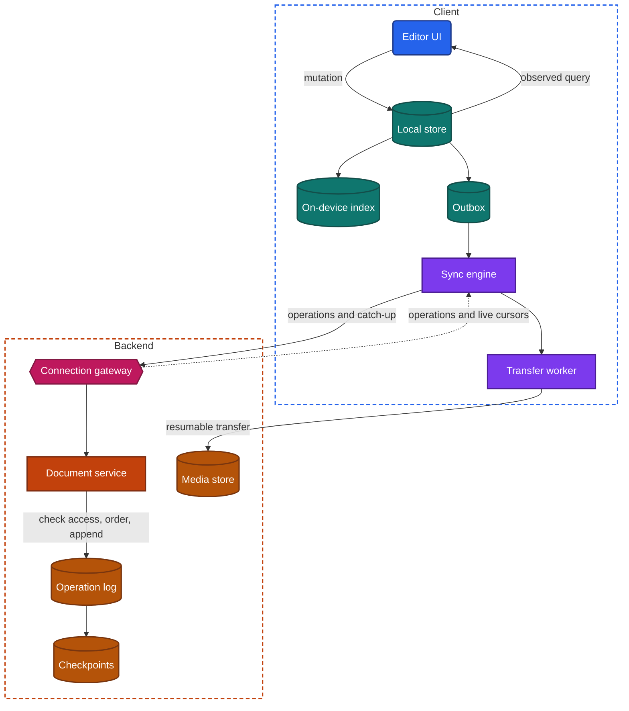
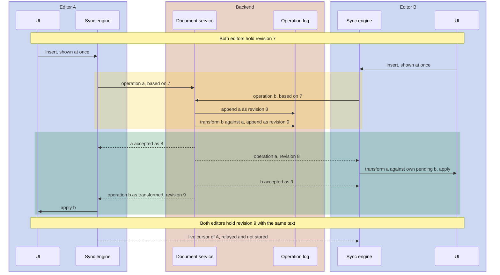

import Probe from '../../../components/Probe.astro';
import Signals from '../../../components/Signals.astro';
import TeardownBar from '../../../components/TeardownBar.astro';
import WorksheetForm from '../../../components/WorksheetForm.astro';

> **The archetype.** An app in which people write and organize text and other content, find it on every device they use, and in some products edit the same document together at the same moment.

## 48.1 What defines this archetype

A notes or documents app makes one promise. What you write is never lost, is on every device, and can be edited by several people at once.

Each clause costs something.

- **Never lost.** The user does not save. Every keystroke must be safe against process death within moments, with or without a network.
- **On every device.** A phone, a tablet and a laptop are separate replicas. Each can be edited for days without contact with the others, and they must converge afterwards.
- **Several people at once.** Two editors change the same paragraph in the same second. Both changes must survive, and both editors must end with the same text.

This chapter is the fullest application of [Chapter 12](/part-2-concerns/12-offline-and-sync/). A conversation, in [Chapter 39](/part-3-archetypes/39-messaging/), is appended to and rarely edited. A document is one item edited again and again from several replicas, so the conflict design is the center of the product.

Three concerns dominate.

| Concern | Why it dominates | Chapter |
|---|---|---|
| Offline and sync | The device is a replica, every edit is a mutation, and the conflict unit decides what users lose | [Chapter 12](/part-2-concerns/12-offline-and-sync/) |
| Real-time delivery | Editing together needs each editor's operations on every other screen within about a second | [Chapter 14](/part-2-concerns/14-real-time-delivery/) |
| Local storage | The local store is where the editor reads and writes, and it holds data the user cannot afford to lose | [Chapter 11](/part-2-concerns/11-local-storage-caching-and-prefetching/) |

Search, attachments and UI data flow follow closely, in [Chapter 28](/part-2-concerns/28-search-and-discovery/), [Chapter 18](/part-2-concerns/18-file-transfer-uploads-and-downloads/) and [Chapter 9](/part-2-concerns/9-state-and-ui-data-flow/).

The archetype has three variants. They differ in offline level and in conflict unit.

| Variant | Offline level | Conflict unit | What syncs |
|---|---|---|---|
| Personal notes | Level 3 local replica | Whole note, or block | Notes as records or as lists of blocks |
| Shared documents | Level 4 concurrent editing | Character, or a property of an object | Operations |
| File-based documents | Level 3, or Level 1 with an explicit download | Whole file | Files, replaced as a whole |

A product can hold more than one variant. Record the variant per kind of content.

## 48.2 Requirements read from the product

These are requirements as a user experiences them. None of them names a design.

**What the app does**

- Create and edit notes or documents with text, lists, headings and other structure.
- Organize them in folders or tags, and reorder them.
- Open any of them on any device signed in to the account.
- Add photos, scans, recordings and files to a document.
- Search by title and by the text inside.
- Share a document with other people, as viewers or as editors, and remove that access later.
- Edit a shared document while others edit it, and see where they are working.
- Look at earlier versions of a document and restore one.

**Qualities it must have**

- Typing feels instant. No keystroke waits for a network.
- Nothing typed is lost, whatever happens to the process, the network or the battery.
- There is no save step.
- Everything already on the device opens and edits without a network.
- Two devices that edited apart converge without the user arranging it, and the result is one a person would accept.
- Another editor's changes appear within about a second while both are online.
- A person whose access was removed stops seeing the document, including on a device that already holds it.
- A new device becomes usable quickly, even for an account with years of content.

Of the seven constraints of [Chapter 2](/part-1-method/2-the-mobile-constraint-set/), three bind hardest. Process death shapes how the editor saves. Unreliable network shapes the sync design. Untrusted client shapes sharing, because the backend cannot take back a replica on someone's device.

## 48.3 Running the probes

Run the general probes first, on a test note you can afford to lose. The probes of this chapter then separate the variants. [Chapter 4](/part-1-method/4-probes/) describes the probe families and how to run a probe cleanly.

### Probes from Chapter 12

Run all eleven probes of [Chapter 12](/part-2-concerns/12-offline-and-sync/) on the note editor. No other archetype gives every one of them a meaningful result.

| Probe | Typical outcome for this archetype | What it tells you |
|---|---|---|
| P12.1 Offline read | Notes never opened on this device also appear | A local replica filled by sync, not by visits |
| P12.2 Offline write | The edit shows at once, with at most a small waiting mark | The editor writes to the local store |
| P12.3 Kill while pending | The edit is still there | Durable local store and outbox |
| P12.4 Reconnect | Changes send from any screen, often from the background | App-level sync engine |
| P12.5 Two-device conflict | Personal notes: the last device to reconnect wins, or a conflicted copy appears. Shared documents: both edits survive | The resolution rule |
| P12.6 Conflict unit | Title and body edits both survive | The unit is the field at most. P48.2 and P48.3 go further inside the body |
| P12.7 Delete against edit | The note stays deleted, and a trash folder holds it | A domain rule, softened by a trash folder |
| P12.8 Clock skew | Varies | Whether LWW uses device time or arrival order. Not applicable where edits merge |
| P12.9 Long absence | A quick update | Delta by cursor |
| P12.10 First sync | Varies by variant | P48.8 examines this more closely |
| P12.11 Flaky network duplicates | No duplicate note | Client-generated id for a new note |

A shared-documents product often gives a different result on P12.2. The document turns read-only without a network. That is Level 4 while connected and Level 1 while not, and it is a common and legitimate design. Section 48.6 returns to it.

### Probes from Chapter 14

Run these from [Chapter 14](/part-2-concerns/14-real-time-delivery/), with the same document open on two devices.

| Probe | Typical outcome | What it tells you |
|---|---|---|
| P14.1 Foreground latency | Personal notes: several seconds, or on reopen. Shared documents: under two seconds | Whether an open document has a live path |
| P14.3 Subscription scope | Often only the open document updates live | Whether the connection belongs to the app or to the open document |
| P14.8 Reconnect catch-up | All missed edits appear with no gesture | Catch-up by cursor when the connection reopens |
| P14.10 Ephemeral signal expiry | A collaborator's mark disappears within seconds to a minute | Presence is an ephemeral signal. P48.5 is the same probe on a live cursor |

### Probes from Chapters 9, 11, 18 and 28

- **P9.2 Every surface and P9.8 Long background**, from [Chapter 9](/part-2-concerns/9-state-and-ui-data-flow/). Rename a note and look at the list and the search results. Typical is that every surface shows the new title at once, because each is an observed query on the local store. After an hour in the background, the same note returns with its text.
- **P11.4 Storage growth and P11.8 Sign out and in**, from [Chapter 11](/part-2-concerns/11-local-storage-caching-and-prefetching/). Typical is storage that tracks the size of the account, and a sharp drop on sign out. A replica is removed with the session.
- **P18.5 Force-quit mid-upload and P18.6 Attach order**, from [Chapter 18](/part-2-concerns/18-file-transfer-uploads-and-downloads/), run on an attachment. Typical is an item that appears at once with a placeholder, and an upload that continues after the app is reopened.
- **P28.1 Search in airplane mode and P28.5 Create, then search**, from [Chapter 28](/part-2-concerns/28-search-and-discovery/). Typical for personal notes is results that include notes never opened on this device, and a new note found at once on the device that created it.

### Probes for this archetype

These eight probes are specific to the archetype. P48.5 and P48.7 need a second account, which should be your own.

<TeardownBar />

### P48.1 Kill while typing

<Probe id="P48.1" />

### P48.2 Two paragraphs, two devices

<Probe id="P48.2" />

### P48.3 One sentence, two devices

<Probe id="P48.3" />

### P48.4 Live typing

<Probe id="P48.4" />

### P48.5 Cursor after disconnect

<Probe id="P48.5" />

### P48.6 Attachment added offline

<Probe id="P48.6" />

### P48.7 Remove access from an offline replica

<Probe id="P48.7" />

### P48.8 First sync on a new device

<Probe id="P48.8" />

## 48.4 The design, concern by concern

Each subsection states the design this archetype usually takes and the reason. The components are those of the universal app model in [Chapter 3](/part-1-method/3-the-universal-app-model/).

### The local store is where the editor works

The editor reads from the local store and writes to it. It never reads from a network response, and it never waits for one. This is the Level 3 anatomy of [Chapter 12](/part-2-concerns/12-offline-and-sync/), and in this archetype it has one extra demand: the write happens many times a second.

A keystroke passes through three places.

1. **Screen state.** The editor's buffer in memory changes at once, so the letter appears with no delay.
2. **Local store.** The change is committed durably, either per keystroke or after a short pause in typing. A commit per keystroke is safest. A commit after a pause of a second or so saves battery and storage wear, and risks that second.
3. **Outbox.** The same transaction records a mutation for the sync engine.

```text
function onEdit(noteId, operation):
  buffer.apply(operation)              // the letter is on screen now
  scheduleCommit(noteId, after: shortPause)

function commit(noteId):
  transaction(localStore):
    saveBlocks(noteId, buffer.changedBlocks())
    outbox.coalesce(noteId, buffer.pendingOperations())   // one entry per note, not per key
  syncEngine.requestRun()
```

P48.1 measures the pause. If all the text survives a force-quit one second after the last key, the pause is very short or absent. If the last words are missing, you have seen its length.

Every other screen is an observed query on the same store, as [Chapter 9](/part-2-concerns/9-state-and-ui-data-flow/) describes. The note list shows a new title while you are still typing it. No screen asks another screen for data.

The local store here is a replica, not a cache. A cache can be discarded when storage runs low. A replica that holds unsent edits cannot. [Chapter 11](/part-2-concerns/11-local-storage-caching-and-prefetching/) covers where each kind of data may be stored.

### The outbox and the sync engine

The write path is the one in [Chapter 12](/part-2-concerns/12-offline-and-sync/), with two adjustments for text.

**Entries are coalesced.** A minute of typing is hundreds of keystrokes. The outbox does not keep one entry for each. In a state-based design it keeps one entry per note, or per block, holding the latest content. In an operation-based design it keeps a run of operations and may compress adjacent insertions into one.

**Ordering is per document.** A note whose mutation is rejected must not block the edits to other notes. The outbox is ordered within a document and independent across documents.

The read path is delta by cursor over a change log. A personal account has one log for the user's whole space. A shared document commonly has its own log, because its readers are a different set of people from the readers of the account's other content.

Rejection is rare for personal notes. It becomes real with sharing, where access can be removed while a mutation waits. P48.7 tests that case.

### The conflict unit

The conflict unit is the smallest piece of data that is replaced as a whole. In this archetype it is the most important design decision, and it is fully observable.

| Unit | What is stored and synced | Typical resolution | What the user can lose |
|---|---|---|---|
| Whole file | An opaque file | Keep both, as a conflicted copy | Nothing, and the user must merge by hand |
| Whole note | One record with a body field | LWW, or keep both, or user decides | Under LWW, every edit made on the losing device |
| Block or paragraph | A list of blocks, each with its own id and version | Merge of the list, and LWW per block | An edit to a paragraph that another device also edited |
| Character | A sequence of operations | Automatic fine-grained merge | Nothing. The merged text may read oddly |

**Whole file.** A file-based product syncs documents that other software also opens. It cannot look inside them, so it cannot merge. A version check detects that two devices changed the file, and the only safe resolution is to keep both.

**Whole note.** The simplest notes design stores the body as one field. With LWW by arrival, the device that reconnects last replaces the body. Teams accept this because one person rarely edits one note on two devices while both are offline. When it happens the loss is silent, so careful products add a version check and keep both versions.

**Block or paragraph.** The body is an ordered list of blocks, each with a client-generated id and a version. Edits to different blocks do not conflict. The list itself needs a merge rule, so that an inserted block and a moved block both take effect. Inside one block, the rule is usually LWW. This unit covers nearly all real conflicts of a single user at modest cost.

**Character.** The body is the result of a log of operations. Concurrent operations are transformed or designed to commute, as the fine-grained merge of [Chapter 12](/part-2-concerns/12-offline-and-sync/) describes. This is Level 4, and it brings an operation log, an ordering or merging component and a persistent connection with it.

P48.2 and P48.3 find the unit in two steps. The first edits different paragraphs apart. The second edits one sentence apart.

Two limits apply. First, the two families of fine-grained merge cannot be told apart from outside. A claim about which one an app uses is Speculative. Second, a merge that keeps every character does not promise sense. Two people who rewrite one sentence get a sentence with both rewrites in it. The design guarantees convergence, and people resolve meaning.

Data around the body has its own units. The title, the folder, the tags and the order in a list are usually separate fields, and P12.6 shows that.

### Live editing

Live editing adds a second path beside the sync engine. While a document is open, the client holds a persistent connection scoped to that document.

- The client sends each operation, or a small batch, as it is made, tagged with the revision of the document it was based on.
- The backend places it in the document's operation log, transforms it against any operations the client had not yet seen, and gives it the next revision.
- The backend acknowledges the sender and sends the operation to every other open editor.
- Each receiving client transforms the operation against its own unacknowledged operations and applies it to the buffer.

The local buffer is always ahead of the backend by the operations not yet acknowledged. This is the optimistic update, performed per keystroke.

When the connection drops, a design has two choices. It can keep accepting edits, queue the operations in the outbox, and merge them on return. Or it can stop accepting edits and show a notice. The first is Level 4 in full. The second is cheaper and safer, because a merge of a day's offline edits against a day of other people's edits can surprise everyone. P12.2 on a shared document tells you which was chosen.

Catch-up after a gap uses the same log. The client states the last revision it holds, and the backend returns the operations that followed. If the gap is too long, the backend sends a checkpoint, which is the full state of the document at one revision, and the operations after it.

### Live cursors and presence

A collaborator's live cursor, their selection and the list of people viewing a document are ephemeral signals in the sense of [Chapter 14](/part-2-concerns/14-real-time-delivery/). A live cursor in this chapter is the mark that shows where another person is typing. It has nothing to do with the cursor of the sync engine, which is a position in a change log.

They are designed apart from the document's content. Operations are stored in the log, applied exactly once and caught up on after a gap. Live cursors are not stored, are sent at most a few times per second, and are never retried. A lost one is replaced by the next.

They are removed by expiry, which is what P48.5 times. A device that loses its network cannot say goodbye. The other editors remove its mark when no signal has renewed it for some seconds, or when the backend notices a missing heartbeat.

A live cursor is a position in a text that is changing, so the receiver transforms it as operations arrive, in the same way as an operation.

### Version history

A product that stores an operation log already holds every state the document ever had. Version history is a view over it.

Replaying a long log is slow, so the backend takes a checkpoint from time to time: after a number of operations, after an interval, or when the last editor leaves. The version list a user sees is usually the list of checkpoints.

A product without an operation log keeps the previous body each time a new one arrives, up to a limit of count or age. A file-based product keeps earlier files.

From outside you see the spacing and the labels of versions. Regular intervals suggest timed checkpoints. Entries that match your editing sessions suggest a checkpoint when the editor closes. Both readings are Speculative, since the list is a product decision about what to show.

Restoring a version is itself an edit. It appends operations that bring the document to the old state, so other replicas receive the restore as a normal change.

### Attachments by upload, then attach

A photo or a file is too large to travel inside a mutation. The design is the one in [Chapter 18](/part-2-concerns/18-file-transfer-uploads-and-downloads/): upload the file to media delivery, then attach a reference to the document.

Offline, the order of events is reversed in appearance. The document needs to show the photo now, and the upload cannot happen yet. The client solves this with a client-generated id.

```text
function addAttachment(noteId, file):
  a = Attachment(id: newUniqueId(), localPath: copyToAppStorage(file), state: Pending)
  transaction(localStore):
    insertBlock(noteId, AttachmentBlock(a.id))    // the note refers to the id, not to a network address
    transferQueue.add(a)
    outbox.append(noteId)
  // the transfer worker uploads a, and the backend maps a.id to the stored file
```

The note's text can sync before the file does. Other devices then show a placeholder and fill it later. The stricter design holds the note's mutation until the upload completes. P48.6 separates the two.

Uploads are resumable and run in a transfer worker, so they survive leaving the app. Downloads on other devices are often on demand. A replica of the text does not imply a replica of the attachments, and storage use shows the difference.

### On-device search

Search over personal notes runs best on the device. The data is already there, the results appear per keystroke, and the feature works offline. The client keeps an on-device index and updates it in the same transaction as the note, so there is no indexing lag on the device that wrote the text. [Chapter 28](/part-2-concerns/28-search-and-discovery/) covers the design space.

The reach of an on-device index is the reach of the replica. If the first sync loads titles and fetches bodies on open, offline search finds titles and the bodies of opened notes only. Products in that position add backend search for the rest. P28.1 and P28.5 place the app, and their result tells you about the replica as much as about search.

### Sharing, permissions and removing access

Sharing turns one user's data into a shared space, and it adds three requirements.

**A log per shared space.** Each device needs every change to every document its user can reach. The backend either writes a change to the log of each person with access, or gives the document its own log that every reader pulls by its own cursor. The first is fan-out on write and the second is fan-out on read. The two look the same from outside.

**Permission checked at the write.** A device can hold a mutation for days. The backend must check the sender's access when the mutation arrives, against the access that holds at that moment. A check made only when the document is opened would accept edits from someone removed in the meantime.

**Loss of access delivered as a change.** A replica on a device does not vanish because a row on the backend changed. The backend has to place a deletion for that document in the removed person's change log, and the client must act on it by removing the document, its attachments and its entries in the on-device index. [Chapter 12](/part-2-concerns/12-offline-and-sync/) names this requirement, and P48.7 tests it.

There is a hard limit. A device that stays offline never receives the removal, and a person who copied the text still has it. Removing access controls future delivery and cleans up cooperative clients. It cannot recall data from a device, which is the untrusted client constraint in its plainest form.

### First sync on a new device

A new device has an empty local store and an account that may hold years of content. The design chooses what to load before the app is usable.

| Order | Usable after | Offline reach on day one | Storage |
|---|---|---|---|
| Everything, then show | Longest | Complete | Full account |
| List first, bodies by backfill | Seconds | Grows to complete | Full account, attachments later or never |
| List first, bodies on open | Seconds | Opened notes only | Small |
| Recent first, older by backfill | Seconds | Recent work | Grows over time |

Text is small, and a design that wants a true replica can afford to load every body. Attachments are large and are nearly always left for demand. A shared document is loaded from its latest checkpoint and the operations after it, never from the start of the log. P48.8 reads the order directly.

## 48.5 End-to-end architecture

Figure 48.1 shows the components the probes imply for a product with personal notes and live shared documents.



*Figure 48.1. The client and backend of a notes and documents app with live editing.*

The operation log is a change log per document, and the media store sits behind media delivery. A personal-notes product without live editing has the same client. Its backend replaces the operation log with a change log per user and needs no connection gateway, only a push hint. A file-based product replaces the document service with a file store that keeps a version per file.

Figure 48.2 follows two editors who type in the same paragraph at the same moment.



*Figure 48.2. Two concurrent operations on one document, ordered by the backend and merged on both clients.*

The figure shows the family of merge in which the backend orders operations. In the other family, replicas could apply the two operations in either order and reach the same text, and the backend would relay and store without transforming. The visible behavior is identical.

## 48.6 Variants and how to tell them apart

Two probes settle the variant, and [Chapter 5](/part-1-method/5-from-signal-to-inference/) describes how each result becomes a claim with a confidence word.

| Question | Discriminating probe | Reading |
|---|---|---|
| Is the body merged, and at what unit | P48.2, then P48.3 | Whole note, block or character |
| Is there a live path while a document is open | P48.4 | Letter by letter means operations over a persistent connection |
| Does live editing continue offline | P12.2 on a shared document | Editable with a waiting mark, or read-only |
| Is the replica complete | P48.8 with P28.1 | Bodies and search results for notes never opened |

**Personal notes.** P12.1 shows unvisited notes, P48.1 keeps all text, and P48.4 shows chunks or a change on reopen. The conflict probes show a whole-note or block unit. Conflicts are rare here, so many products choose the cheapest rule and add version history as the safety net.

**Shared documents.** P48.4 shows letters arriving one by one and P48.5 shows a live cursor that expires. P48.3 keeps both words. Check P12.2 before you write "Level 4" on the worksheet. A product that goes read-only offline is Level 4 only while connected.

**File-based documents.** A conflict produces a second file with a device name or a date in its title. Sync status is shown per file, and offline reach is whatever was downloaded. The app that syncs the file and the app that edits it may be different programs, which is why nothing can be merged.

**Mixed products.** Run P48.2 to P48.4 once on a private note and once on a shared one. Different results are a finding.

One limit applies across variants. P48.3 offline and P48.4 online can disagree. Text can merge by character while both editors are connected, and by block or by LWW when one of them was offline. The live path and the offline path are separate code.

The signal table collects the behaviors from the eight probes and from normal use.

<Signals chapter={48} />

## 48.7 What changes with scale

The client design is the same for a small notes app and a very large one. What changes is the amount of data, the number of simultaneous editors and the backend behind the connection.

**The same at every size**

- The editor writes to the local store, and the UI is an observed query on it.
- A durable outbox with coalesced entries, ordered per document.
- Delta by cursor over a change log.
- A stated conflict unit and rule, enforced on the backend.
- Upload, then attach, with client-generated ids.

**What changes**

- **Size of the replica.** A personal account is small enough to hold in full. A workspace of a large organization is not. The client moves to a partial replica: recent and pinned documents on the device, and the rest on demand.
- **Editors per document.** Dozens of editors on one document need a backend process that owns that document while it is open, so that one place orders its operations. Presence is reduced at that size: a count replaces the list of names.
- **Length of the log.** A document edited for years has a log too long to replay. Checkpoints become necessary, and old operations are compacted.
- **Search.** A shared workspace needs backend search, with access checked per result, and the indexing lag of [Chapter 28](/part-2-concerns/28-search-and-discovery/) appears.
- **Permissions.** Access by individual becomes access by group and folder. Removing one person from a group changes their access to thousands of documents, and delivering those removals to their devices is a large fan-out.

From outside you see the limits these produce: a cap on simultaneous editors, a viewer count without names, search results that trail a new edit. Each is a Speculative signal of scale pressure, because a product decision explains it equally well.

## 48.8 Completed worksheet

[Chapter 6](/part-1-method/6-the-teardown-worksheet/) describes the worksheet and the order in which to fill it in. The fields in this form are specific to this archetype. The probes of Section 48.3 fill most of them. Version history and search are filled by hand from what you observed.

<TeardownBar />

<WorksheetForm chapters={[48]} />

The fields that [Chapter 12](/part-2-concerns/12-offline-and-sync/) adds to the worksheet take these typical values. The two columns are the two main variants. A value that differs in your teardown is a finding. Record it with the probe that produced it.

| [Chapter 12](/part-2-concerns/12-offline-and-sync/) field | Personal notes | Shared documents | Confidence |
|---|---|---|---|
| Offline level | 3 Local replica | 4 Concurrent editing while connected | Inferred |
| Offline read scope | All synced | Documents opened or marked for offline use | Inferred |
| Offline write actions | Everything | Everything, or none | Observed |
| Pending mutations survive force-quit | Yes | Yes, where offline editing exists | Inferred |
| Outbox drain trigger | App, and background where the operating system allows | App | Inferred |
| Rejection behavior | Rare. A conflicted copy at most | A notice, and the text offered as a copy | Observed |
| Pull trigger | Foreground and push hint | Persistent connection while the document is open | Inferred |
| Delta or full refetch | Delta by cursor | Operations since a revision, or a checkpoint | Inferred |
| First sync order | List, then bodies, then attachments on demand | List, then each document on open | Observed |
| Conflict unit | Whole note or block | Character | Inferred |
| Conflict detection | None, or a version check | Causal history | Speculative |
| Conflict resolution | LWW, or keep both | Automatic fine-grained merge | Inferred |
| Delete against edit rule | Delete wins, with a trash folder | Delete wins for everyone, with restore from history | Observed |
| Backend components implied | Change log per user, push hint, media delivery | Gateway holding connections, operation log per document, checkpoints, access checks | Inferred |
| Failure modes seen | A silently lost edit, a conflicted copy | Read-only when offline, a stale collaborator mark | Observed |

## 48.9 As an interview question

The question is usually asked as "design a notes app that syncs across devices" or "design a collaborative document editor". The two are different questions, and the first minute should establish which one you were given.

**Clarify first.** Ask four things.

1. One user on several devices, or several users on one document.
2. Whether editing must work offline, and for how long.
3. What the content is: plain text, structured blocks, or files from other software.
4. Whether attachments, search and version history are in scope.

Then state the promise from Section 48.1 and name the offline level and the conflict unit you will design for.

**Go deep on three concerns.**

- **The local store and the write path.** The editor writes locally, commits within a second, and records a coalesced mutation in a durable outbox. Explain why the commit and the outbox entry share a transaction.
- **The conflict unit.** Walk the table of Section 48.4 from whole note to character. For each unit, say what a user loses and what it costs to build. Choose one and defend it for the product you were given.
- **The live path.** A connection per open document, operations tagged with the revision they were based on, an order set by the backend, and catch-up from a checkpoint. Draw Figure 48.2 from memory.

**Trade-offs an interviewer expects to hear.**

- LWW against keep both for a whole note: silent loss against visible clutter.
- Block-level merge against character-level merge: most of the benefit for a fraction of the cost, against a result that never loses a keystroke.
- Offline editing of a shared document against a read-only mode: reach against the risk of a surprising merge.
- A full replica against a partial one: offline reach and on-device search against first-sync time and storage.

Say without being asked that live cursors are ephemeral signals, and that removing access must reach replicas that already hold the document. Most candidates leave both out.

## 48.10 Summary

- A notes or documents app promises that writing is never lost, is on every device, and can be edited by several people at once. Sync, real-time delivery and local storage dominate its design.
- The editor reads and writes the local store. A commit within moments of each keystroke, in one transaction with a coalesced outbox entry, is what makes the absence of a save control safe.
- The conflict unit is the central decision. Whole file, whole note, block and character each lose a different amount of work, and P48.2 and P48.3 find the unit from outside.
- Personal notes are Level 3 with a coarse unit and a simple rule. Shared documents are Level 4, with an operation log, a persistent connection per open document and automatic fine-grained merge. Many are Level 4 only while connected.
- Live cursors and presence are ephemeral signals. They are never stored, never caught up on, and removed by expiry.
- Version history is a view over checkpoints of the log. Attachments are uploaded apart from the text and attached by a client-generated id.
- On-device search reaches exactly as far as the replica, so the first-sync order decides what search finds offline.
- Removing access must be delivered as a change to replicas that hold the data, and the backend must check permission when each mutation arrives. A device that never reconnects keeps what it has.
